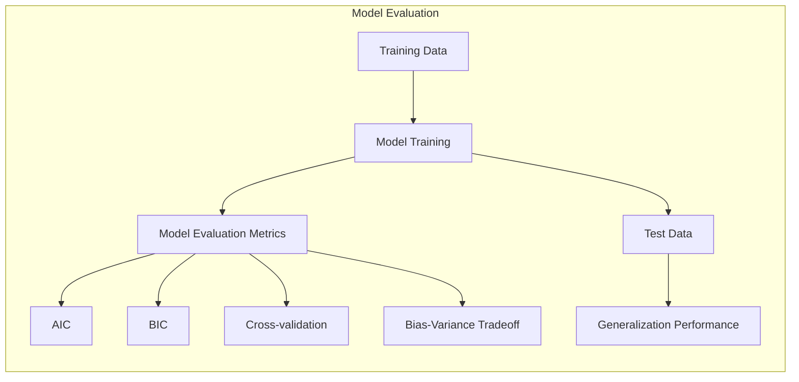
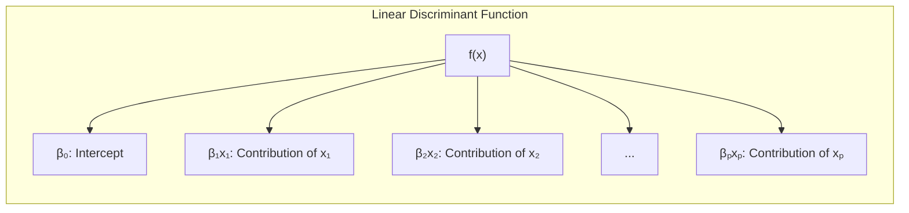
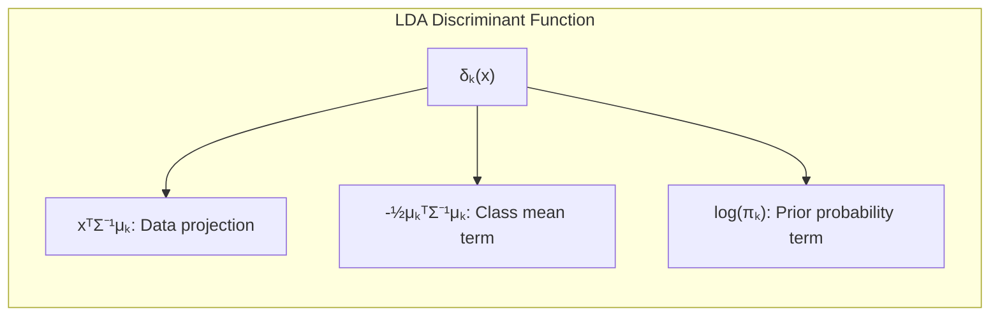
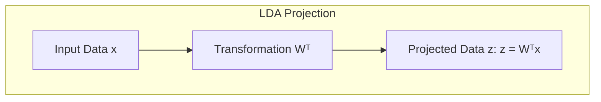
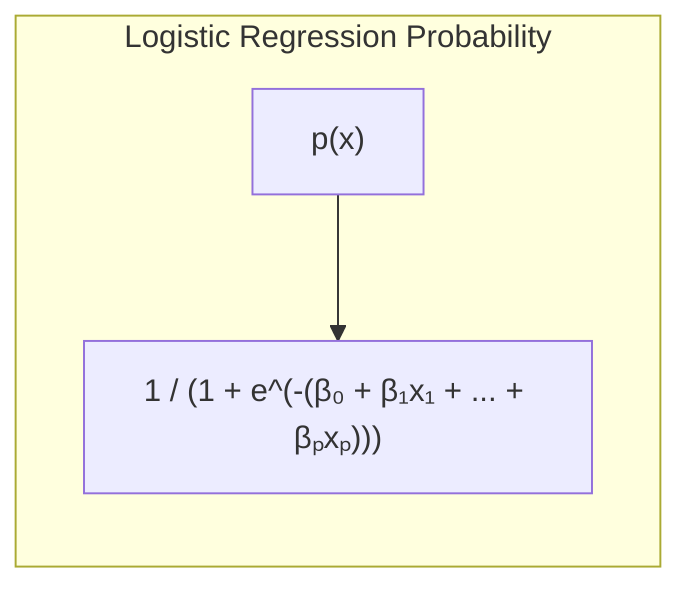
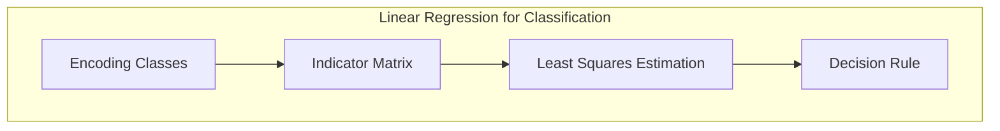
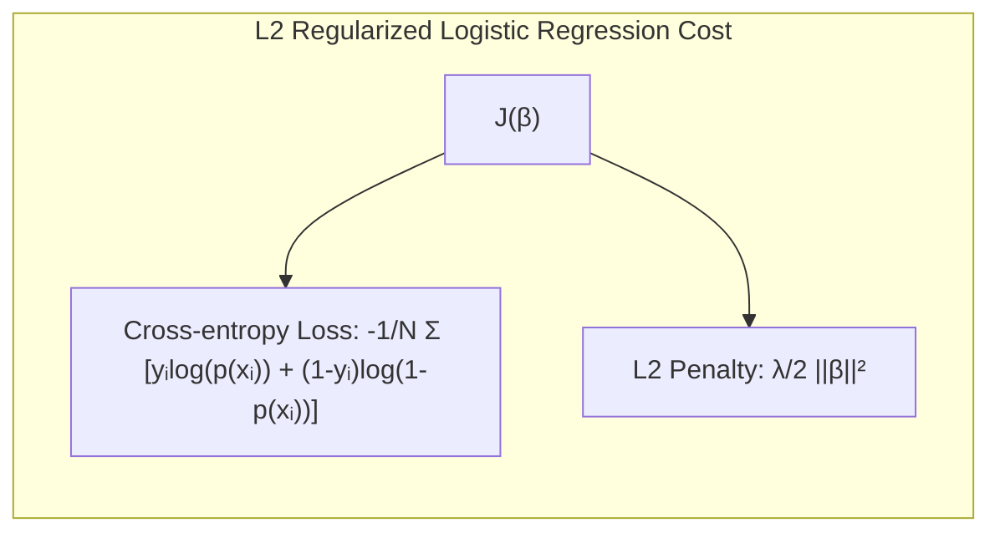
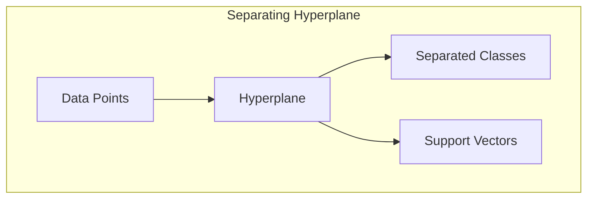
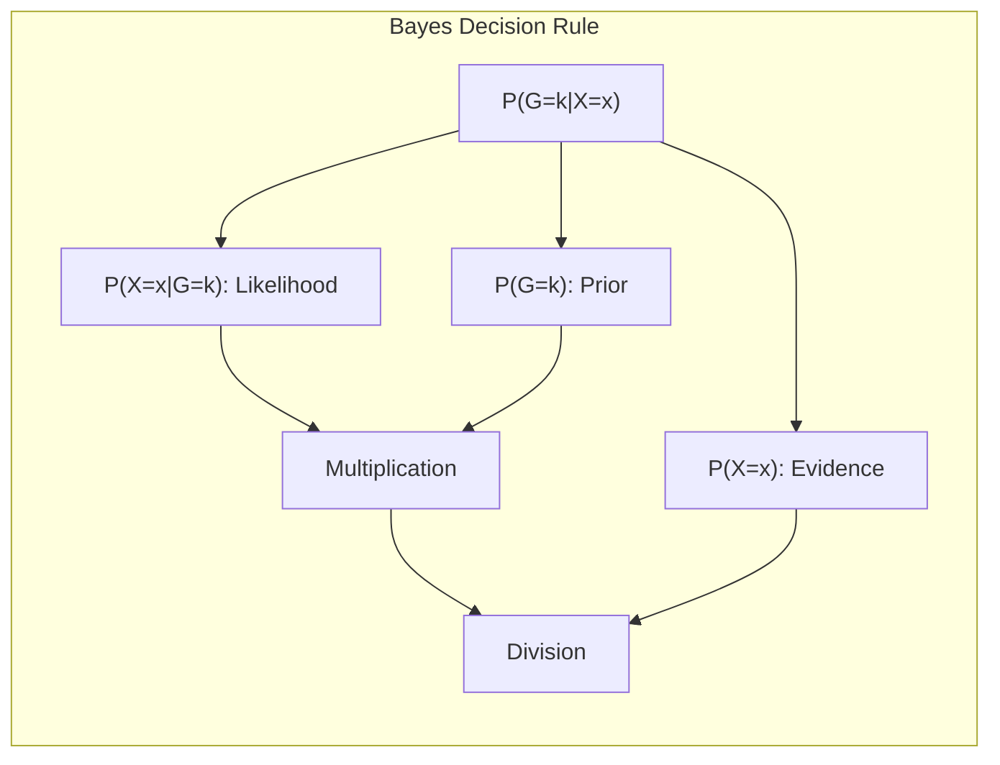
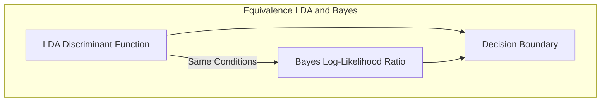

## Model Selection with AIC: A Practical Guide



### Introdução

A avaliação do desempenho de um método de aprendizado é crucial, pois orienta a seleção do modelo mais adequado e fornece uma medida da qualidade da escolha final [^7.1]. O critério de informação Akaike (**AIC**) é uma das ferramentas para avaliar e selecionar modelos, que equilibra a qualidade do ajuste de um modelo aos dados com a sua complexidade, evitando o overfitting [^7.1]. Este capítulo explora os fundamentos do AIC, como ele se relaciona com o compromisso viés-variância e como ele pode ser usado para realizar a seleção de modelos de forma eficaz.

### Conceitos Fundamentais

**Conceito 1: Problema de Classificação e Generalização**

O problema de classificação visa construir um modelo que possa predizer a qual classe uma nova observação pertence, baseado em um conjunto de treinamento [^7.1]. A performance deste modelo em dados não vistos, conhecida como *generalização*, é a métrica chave para avaliar a qualidade do modelo. Um modelo com boa generalização deve minimizar os erros em dados independentes do conjunto de treinamento. A complexidade do modelo influencia este desempenho: modelos complexos podem se ajustar perfeitamente aos dados de treinamento, mas generalizam mal devido a um *overfitting* [^7.2]. Métodos lineares, embora mais simples, podem apresentar *bias* elevado se a relação entre os dados não for linear, mas apresentam menor *variância*, ou seja, são menos sensíveis a pequenas mudanças nos dados de treinamento [^7.2].

> 💡 **Exemplo Numérico:** Imagine que estamos tentando classificar imagens de gatos e cachorros. Um modelo muito complexo (por exemplo, uma rede neural com muitas camadas) pode memorizar as características exatas de cada gato e cachorro no conjunto de treinamento, atingindo uma precisão perfeita nesse conjunto. No entanto, quando apresentado a novas imagens, o modelo falha, pois não generalizou o suficiente, isso é o overfitting. Por outro lado, um modelo muito simples (por exemplo, um classificador linear baseado em poucas características) pode não conseguir capturar todas as diferenças entre gatos e cachorros, levando a erros no treinamento e também em novos dados, isso seria um alto bias.

**Lemma 1: Decomposição da Função Discriminante Linear**

A função discriminante linear, em sua forma geral, pode ser decomposta em uma soma de termos que representam a contribuição de cada variável no processo de decisão de classe. Esta decomposição nos permite entender a importância de cada variável individualmente [^7.3]. Por exemplo, para uma função discriminante linear dada por:
$$f(x) = \beta_0 + \beta_1 x_1 + \beta_2 x_2 + \ldots + \beta_p x_p$$
cada $\beta_i$ quantifica o efeito da variável $x_i$ na decisão final de classe.



> 💡 **Exemplo Numérico:** Suponha que tenhamos um modelo linear para classificar se um paciente tem uma doença cardíaca com base em duas variáveis: pressão arterial ($x_1$) e níveis de colesterol ($x_2$). Se o modelo é $f(x) = -2 + 0.05x_1 + 0.02x_2$, um aumento de 1 unidade na pressão arterial aumentaria o valor da função discriminante em 0.05, enquanto um aumento de 1 unidade no colesterol aumentaria em 0.02. O termo $\beta_0 = -2$ seria um "baseline" ou intercepto.

**Conceito 2: Linear Discriminant Analysis (LDA)**

A **Linear Discriminant Analysis (LDA)** é um método de classificação linear que assume que os dados para cada classe seguem uma distribuição Gaussiana com a mesma matriz de covariância [^7.3]. A LDA busca o melhor hiperplano que separa as classes, maximizando a distância entre as médias das classes e minimizando a variância dentro de cada classe. A função discriminante linear na LDA é definida como:
$$ \delta_k(x) = x^T \Sigma^{-1} \mu_k - \frac{1}{2} \mu_k^T \Sigma^{-1} \mu_k + \log \pi_k$$
onde $\mu_k$ é a média da classe *k*, $\Sigma$ é a matriz de covariância comum, e $\pi_k$ é a probabilidade *a priori* da classe *k* [^7.3.1]. A LDA também pode ser utilizada em problemas de redução de dimensionalidade, projetando os dados em um subespaço que maximize a separabilidade das classes [^7.3.3].



> 💡 **Exemplo Numérico:** Considere um problema com duas classes, A e B, e duas variáveis $x_1$ e $x_2$. As médias das classes são $\mu_A = [1, 2]$ e $\mu_B = [3, 4]$, e a matriz de covariância comum é $\Sigma = \begin{bmatrix} 1 & 0.5 \\ 0.5 & 1 \end{bmatrix}$. Para um novo ponto $x = [2, 3]$, calculamos as funções discriminantes $\delta_A(x)$ e $\delta_B(x)$. A classe com o maior valor de função discriminante é a classe predita. O cálculo envolve a inversa de $\Sigma$, que nesse caso é $\Sigma^{-1} = \begin{bmatrix} 4/3 & -2/3 \\ -2/3 & 4/3 \end{bmatrix}$. Além disso, se $\pi_A = \pi_B = 0.5$, então $\log \pi_A = \log \pi_B = \log 0.5$.
>
> $\delta_A(x) = [2, 3] \begin{bmatrix} 4/3 & -2/3 \\ -2/3 & 4/3 \end{bmatrix} [1, 2]^T - \frac{1}{2} [1, 2] \begin{bmatrix} 4/3 & -2/3 \\ -2/3 & 4/3 \end{bmatrix} [1, 2]^T + \log 0.5 = -1.33$
>
> $\delta_B(x) = [2, 3] \begin{bmatrix} 4/3 & -2/3 \\ -2/3 & 4/3 \end{bmatrix} [3, 4]^T - \frac{1}{2} [3, 4] \begin{bmatrix} 4/3 & -2/3 \\ -2/3 & 4/3 \end{bmatrix} [3, 4]^T + \log 0.5 = 2.66$
>
> Como $\delta_B(x) > \delta_A(x)$, o ponto $x = [2, 3]$ seria classificado como pertencente à classe B.

**Corolário 1: Projeção em Subespaços**

A função discriminante linear da LDA pode ser vista como uma projeção dos dados em um subespaço de menor dimensão que maximiza a separabilidade das classes. A projeção é dada por:
$$ z = W^T x$$
onde *W* são as direções que maximizam a variância entre as classes e minimizam a variância dentro das classes [^7.3.1]. Essa projeção simplifica o problema de classificação ao reduzir a dimensionalidade dos dados.



> 💡 **Exemplo Numérico:** Suponha que temos dados em 3 dimensões ($x_1$, $x_2$, $x_3$) e usamos LDA para projetar esses dados em uma única dimensão ($z$). O vetor *W* resultante da LDA seria um vetor 3x1. Por exemplo, se $W = [0.5, -0.3, 0.8]^T$, um ponto $x = [1, 2, 3]$ seria projetado como $z = W^T x = 0.5*1 - 0.3*2 + 0.8*3 = 2.3$. Assim, toda a informação relevante para a classificação seria condensada em um único valor $z$.

**Conceito 3: Logistic Regression**

A **Logistic Regression** é um método probabilístico para classificação, que modela a probabilidade de uma observação pertencer a uma classe usando a função sigmoide [^7.4]. A regressão logística estima os parâmetros do modelo maximizando a função de verossimilhança, que mede a compatibilidade entre o modelo e os dados [^7.4.3]. A probabilidade de uma observação *x* pertencer à classe 1 é dada por:
$$ p(x) = \frac{1}{1 + e^{-(\beta_0 + \beta_1 x_1 + \ldots + \beta_p x_p)}} $$
onde os parâmetros $\beta_i$ são estimados usando o método de máxima verossimilhança [^7.4.1]. A regressão logística é uma alternativa à LDA quando as suposições de normalidade e covariância comum não são satisfeitas, permitindo modelar a probabilidade de uma classe de maneira mais flexível.



> 💡 **Exemplo Numérico:** Suponha que temos um modelo de regressão logística com duas variáveis: $x_1$ (idade) e $x_2$ (tempo de exercício semanal). Os coeficientes são $\beta_0 = -3$, $\beta_1 = 0.05$, e $\beta_2 = 0.2$. Para uma pessoa com 50 anos ($x_1 = 50$) que se exercita 3 horas por semana ($x_2 = 3$), a probabilidade de pertencer à classe 1 (por exemplo, ter um risco cardiovascular alto) é:
>
> $p(x) = \frac{1}{1 + e^{-(-3 + 0.05 * 50 + 0.2 * 3)}} = \frac{1}{1 + e^{-(-3+2.5+0.6)}} = \frac{1}{1 + e^{-0.1}} \approx 0.525$.
>
> Isso significa que há uma probabilidade de 52.5% dessa pessoa ter um risco cardiovascular alto segundo o modelo.

> ⚠️ **Nota Importante**: A função logística é usada para mapear uma combinação linear de variáveis a uma probabilidade entre 0 e 1, e a escolha entre regressão logística e LDA deve ser feita considerando as suposições de cada método [^7.4.1].

> ❗ **Ponto de Atenção**: Em situações onde as classes são desbalanceadas, a regressão logística pode ser mais robusta e fornecer probabilidades mais calibradas do que outros métodos lineares [^7.4.2].

> ✔️ **Destaque**: Tanto a LDA quanto a regressão logística produzem fronteiras de decisão lineares, mas os coeficientes estimados em ambos os modelos, em geral, diferem por conta de suas formulações e objetivos distintos [^7.5].

### Regressão Linear e Mínimos Quadrados para Classificação


A regressão linear pode ser usada para classificação através da regressão de uma *matriz de indicadores*, onde cada coluna representa uma classe e cada entrada indica se a observação pertence ou não à classe [^7.2]. A regressão linear sobre a matriz de indicadores estima os coeficientes através do método dos mínimos quadrados. Dada uma observação *x*, a classe predita é a correspondente à coluna que resulta na maior predição. As limitações desse método incluem sua dificuldade em modelar fronteiras de decisão não lineares, e o fato de que as predições podem não ser diretamente interpretadas como probabilidades [^7.2]. A regressão de indicadores pode levar a extrapolações fora do intervalo [0, 1], enquanto a regressão logística geralmente fornece estimativas de probabilidade mais estáveis [^7.4].

> 💡 **Exemplo Numérico:** Suponha que temos três classes (A, B, C) e duas observações. A matriz de indicadores Y é:
> $$Y = \begin{bmatrix} 1 & 0 & 0 \\ 0 & 1 & 0 \end{bmatrix}$$
> As linhas representam as observações e as colunas, as classes. Para a primeira observação, ela pertence à classe A, e para a segunda, à classe B. Se os dados preditores forem $X = \begin{bmatrix} 1 & 2 \\ 3 & 4 \end{bmatrix}$ (com uma coluna de 1's para o intercepto implícito), a regressão linear ajustaria cada coluna de Y separadamente usando mínimos quadrados, gerando coeficientes para prever cada classe. As predições seriam, para cada classe, valores reais. A classe com maior valor predito seria a classe atribuída à observação.
>
>  ```python
> import numpy as np
> from sklearn.linear_model import LinearRegression
>
> X = np.array([[1, 2], [3, 4]])
> Y = np.array([[1, 0, 0], [0, 1, 0]])
>
> model = LinearRegression()
> model.fit(X, Y)
>
> predictions = model.predict(X)
> print("Predictions:", predictions)
> ```
>
> Digamos que o modelo tenha aprendido pesos tais que para uma nova observação $x_{new} = [2, 3]$, as predições sejam $\hat{y}_{new} = [0.8, 0.3, 0.1]$. A classe predita seria a classe A, pois possui o maior valor.

**Lemma 2: Equivalência entre Projeções**

Em certas condições, as projeções dos dados em hiperplanos de decisão gerados por regressão linear e por discriminantes lineares são equivalentes. Essa equivalência ocorre quando a variância residual dos modelos de regressão linear é constante para todas as classes [^7.2]. Essa condição garante que os métodos lineares se aproximem, gerando resultados similares na prática.

**Corolário 2: Simplificação da Análise**

A equivalência entre as projeções, conforme explicitado no Lemma 2, permite simplificar a análise do modelo, pois em certas situações, podemos usar o método mais simples (regressão linear) com resultados similares ao método mais complexo (LDA), facilitando a interpretação dos parâmetros e a computação da solução [^7.3].

Em alguns casos, a regressão de indicadores, embora mais simples, pode ser suficiente para gerar uma fronteira de decisão linear eficaz. No entanto, é importante ter em mente suas limitações e considerar alternativas como a regressão logística em cenários onde a estabilidade das estimativas e a interpretação das predições como probabilidades são necessárias [^7.4].

### Métodos de Seleção de Variáveis e Regularização em Classificação

A seleção de variáveis e a regularização são técnicas cruciais para evitar *overfitting* e melhorar a generalização de modelos de classificação, especialmente em contextos com muitas variáveis preditoras [^7.5]. A regularização L1 e L2 são comumente aplicadas em modelos logísticos, adicionando termos de penalização à função de custo que restringem a magnitude dos coeficientes. A penalização L1 promove a esparsidade, zerando coeficientes menos relevantes, enquanto a penalização L2 reduz a magnitude de todos os coeficientes, diminuindo a variância do modelo [^7.4.4]. A função de custo em regressão logística com regularização L2, por exemplo, é dada por:
$$ J(\beta) = - \frac{1}{N} \sum_{i=1}^N [y_i \log(p(x_i)) + (1-y_i) \log(1-p(x_i))] + \frac{\lambda}{2} \|\beta\|^2 $$
onde $\lambda$ é o parâmetro de regularização que controla a força da penalidade.



> 💡 **Exemplo Numérico:** Considere um modelo de regressão logística com regularização L2, onde $N = 100$, e $\lambda = 0.1$. Os dados de treinamento consistem em pares $(x_i, y_i)$, onde $y_i$ é 0 ou 1. O modelo é $p(x_i) = \frac{1}{1 + e^{-(\beta_0 + \beta_1 x_{i1} + \beta_2 x_{i2})}}$. O objetivo da otimização é encontrar os valores de $\beta_0, \beta_1, \beta_2$ que minimizem $J(\beta)$. Se o modelo aprendesse coeficientes como $\beta_0 = -1, \beta_1 = 0.5, \beta_2 = -0.2$ sem regularização, a adição do termo $\frac{0.1}{2} ((-1)^2 + (0.5)^2 + (-0.2)^2)$ penalizaria esses valores, e o otimizador tenderia a encontrar valores menores, ou seja, o modelo seria levado a ter menor variância.

**Lemma 3: Esparsidade com L1**
A penalização L1 em classificação logística leva a modelos com coeficientes esparsos. Isso ocorre porque a norma L1 tem um canto em $\beta = 0$, o que torna a probabilidade de um coeficiente ser exatamente zero não-nula durante o processo de otimização [^7.4.4]. Matematicamente, a penalização L1 adiciona o termo $\lambda \|\beta\|_1 = \lambda \sum_{j=1}^p |\beta_j|$ à função de custo, incentivando valores de $\beta_j$ nulos.

**Prova do Lemma 3:**
Para comprovar essa propriedade, vamos analisar o comportamento do gradiente da função de custo regularizada com L1. O gradiente em relação ao $\beta_j$ é dado por:
$$ \frac{\partial J}{\partial \beta_j} = \frac{\partial}{\partial \beta_j} \left( - \frac{1}{N} \sum_{i=1}^N L(y_i, p(x_i; \beta)) + \lambda |\beta_j| \right) $$
Onde $L$ é a função de perda (ex: log-verossimilhança).
O gradiente da norma L1 é dado por:
$$\frac{\partial |\beta_j|}{\partial \beta_j} = \text{sign}(\beta_j)$$
Quando $\beta_j = 0$, o gradiente é indefinido, mas o subgradiente assume os valores [-1, 1]. A otimização irá convergir para $\beta_j = 0$ se a derivada do termo de perda for menor que $\lambda$ em valor absoluto. $\blacksquare$

**Corolário 3: Interpretabilidade do Modelo**

A esparsidade induzida pela penalização L1 leva a modelos mais interpretáveis, pois apenas as variáveis mais relevantes são retidas. Isso simplifica a análise e a compreensão do modelo, além de reduzir o risco de *overfitting* [^7.4.5].

> 💡 **Exemplo Numérico:** Em um problema de classificação de spam com 1000 variáveis (palavras), usar a regularização L1 na regressão logística pode levar a um modelo onde apenas 50 coeficientes $\beta_j$ são não nulos, ou seja, apenas 50 palavras seriam relevantes para classificar um email como spam ou não-spam. Isso simplifica o modelo e torna mais fácil a interpretação dos resultados, e pode aumentar a generalização.

> ⚠️ **Ponto Crucial**: Regularizações L1 e L2 podem ser combinadas através do Elastic Net para se aproveitar as vantagens de ambas, controlando a esparsidade e a estabilidade do modelo simultaneamente [^7.5].

### Separating Hyperplanes e Perceptrons

O conceito de *separating hyperplanes* envolve a busca por um hiperplano que divida o espaço de dados em regiões associadas a classes distintas [^7.5.2]. O objetivo é encontrar o hiperplano que maximiza a margem de separação entre as classes, o que pode ser alcançado através da otimização do dual de Wolfe. Esta abordagem leva a soluções que são combinações lineares de *support vectors*, ou seja, os dados mais próximos à fronteira de decisão. Um exemplo de algoritmo para encontrar esses hiperplanos é o **Perceptron de Rosenblatt**, que ajusta iterativamente um hiperplano linear baseado nos erros de classificação. O Perceptron converge sob condições de separabilidade linear dos dados, conforme discutido em [^7.5.1].



> 💡 **Exemplo Numérico:** Imagine um problema de classificação binária em duas dimensões, onde a classe A é representada por pontos no plano com coordenadas como (1, 1), (2, 1), (1, 2) e a classe B com pontos (3, 3), (4, 3), (3, 4). Um hiperplano separador, ou seja, uma reta nesse caso, poderia ser representado por $w_1x_1 + w_2x_2 + b = 0$. O perceptron, ao ser treinado, ajustaria os valores de $w_1$, $w_2$ e $b$ de forma iterativa, até conseguir separar os dados. Por exemplo, após algumas iterações, o perceptron poderia encontrar a reta dada por $x_1 + x_2 - 5 = 0$.

### Pergunta Teórica Avançada: Diferenças entre LDA e Regra de Decisão Bayesiana com Covariâncias Iguais

**Pergunta:** Quais as diferenças fundamentais entre a formulação da Linear Discriminant Analysis (LDA) e a Regra de Decisão Bayesiana quando se considera distribuições Gaussianas com matrizes de covariância iguais?

**Resposta:**
A LDA e a Regra de Decisão Bayesiana (Bayes Decision Rule) partem de pressupostos diferentes, mas convergem para uma solução similar quando as distribuições das classes são Gaussianas e compartilham a mesma matriz de covariância [^7.3]. A LDA, busca um discriminante linear através da maximização da separabilidade entre as classes, enquanto a Regra de Decisão Bayesiana classifica uma observação na classe que possui a maior probabilidade *a posteriori*, dada pela regra de Bayes:
$$ P(G=k|X=x) = \frac{P(X=x|G=k)P(G=k)}{P(X=x)} $$
onde *G* é a variável de classe e *X* é a variável de entrada.



Sob a premissa de que as distribuições das classes são Gaussianas com covariâncias iguais, a LDA é equivalente à decisão Bayesiana. A fronteira de decisão nesse caso é linear e os coeficientes da função discriminante da LDA são proporcionais à diferença entre as médias das classes, ponderadas pela inversa da matriz de covariância comum. A derivação dos limites de decisão em ambos os métodos levam à mesma projeção linear e, portanto, ao mesmo limite de decisão [^7.3.3]. A escolha da média e da covariância em ambos os métodos impactam diretamente a fronteira de decisão linear, e por isso a escolha correta desses parâmetros é crucial para o desempenho do classificador [^7.3].

**Lemma 4: Equivalência Formal**

A equivalência formal entre LDA e Regra de Decisão Bayesiana sob a hipótese de covariâncias iguais pode ser demonstrada igualando a função discriminante da LDA com a razão de verossimilhança (log-odds) da Regra de Decisão Bayesiana. A função discriminante na LDA é dada por:
$$ \delta_k(x) = x^T \Sigma^{-1} \mu_k - \frac{1}{2} \mu_k^T \Sigma^{-1} \mu_k + \log \pi_k $$
Já a regra Bayesiana calcula a razão de verossimilhança como:
$$ \log \frac{P(X=x|G=k)}{P(X=x|G=l)} =  x^T \Sigma^{-1} (\mu_k - \mu_l) - \frac{1}{2} (\mu_k^T \Sigma^{-1} \mu_k - \mu_l^T \Sigma^{-1} \mu_l) $$
Quando a função discriminante da LDA é utilizada para tomar decisões, ela se torna equivalente à Regra de Decisão Bayesiana sob essas condições [^7.3]. $\blacksquare$



**Corolário 4: Fronteiras Quadráticas**

Ao relaxar a hipótese de covariâncias iguais, ou seja, permitir que cada classe possua sua própria matriz de covariância, as fronteiras de decisão se tornam quadráticas, dando origem à Quadratic Discriminant Analysis (QDA) [^7.3.1].

> 💡 **Exemplo Numérico:** Considere novamente o exemplo de duas classes A e B, mas agora com matrizes de covariância diferentes: $\Sigma_A = \begin{bmatrix} 1 & 0 \\ 0 & 1 \end{bmatrix}$ e $\Sigma_B = \begin{bmatrix} 2 & 0 \\ 0 & 0.5 \end{bmatrix}$. As médias $\mu_A = [1, 1]$ e $\mu_B = [3, 3]$ permanecem as mesmas. Ao utilizarmos QDA, a fronteira de decisão seria quadrática, e não linear como na LDA, refletindo a maior variabilidade da classe B em comparação com a classe A, modelada pela matriz de covariância de cada classe.

> ⚠️ **Ponto Crucial**: A escolha de covariâncias iguais na LDA ou covariâncias diferentes na QDA impacta significativamente a forma da fronteira de decisão (linear vs. quadrática) e, consequentemente, a complexidade e performance do modelo [^7.3.1].

### Conclusão

Este capítulo apresentou uma análise aprofundada do **AIC** para seleção de modelos, e métodos lineares para classificação. Os conceitos discutidos, desde a introdução do problema de classificação, regressão linear para classificação, regularização, até as diferenças entre LDA e Regra Bayesiana, fornecem uma base sólida para a compreensão e aplicação do AIC e de métodos lineares na modelagem estatística. O compromisso viés-variância é um conceito fundamental para entender o comportamento do AIC na prática, guiando a escolha de modelos que minimizem o erro de generalização.

### Footnotes
[^7.1]: "The generalization performance of a learning method relates to its prediction capability on independent test data. Assessment of this performance is extremely important in practice, since it guides the choice of learning method or model, and gives us a measure of the quality of the ultimately chosen model." *(Trecho de Model Assessment and Selection)*
[^7.2]: "Figure 7.1 illustrates the important issue in assessing the ability of a learning method to generalize. Consider first the case of a quantitative or interval scale response." *(Trecho de Model Assessment and Selection)*
[^7.3]: "The story is similar for a qualitative or categorical response G taking one of K values in a set G, labeled for convenience as 1, 2, ..., K. Typically we model the probabilities pk(X) = Pr(G = k|X) (or some monotone transformations fr(X)), and then Ĝ(X) = arg maxk Îk(X)." *(Trecho de Model Assessment and Selection)*
[^7.3.1]: "For a linear model family such as ridge regression, we can break down the bias more finely. Let ß denote the parameters of the best-fitting linear approximation to f:" *(Trecho de Model Assessment and Selection)*
[^7.3.2]:  "Here the expectation is taken with respect to the distribution of the input variables X. Then we can write the average squared bias as" *(Trecho de Model Assessment and Selection)*
[^7.3.3]: "If we are in a data-rich situation, the best approach for both problems is to randomly divide the dataset into three parts: a training set, a validation set, and a test set." *(Trecho de Model Assessment and Selection)*
[^7.4]: "In this chapter we describe a number of methods for estimating the expected test error for a model. Typically our model will have a tuning parameter or parameters a and so we can write our predictions as fa(x)." *(Trecho de Model Assessment and Selection)*
[^7.4.1]: "Typically we model the probabilities pk(X) = Pr(G = k|X) (or some monotone transformations fk(X)), and then Ĝ(X) = arg maxk fk(X). In some cases, such as 1-nearest neighbor classification" *(Trecho de Model Assessment and Selection)*
[^7.4.2]: "The quantity -2 × the log-likelihood is sometimes referred to as the deviance." *(Trecho de Model Assessment and Selection)*
[^7.4.3]: "The log-likelihood can be used as a loss-function for general response densities, such as the Poisson, gamma, exponential, log-normal and others." *(Trecho de Model Assessment and Selection)*
[^7.4.4]: "For a linear model fit fβ(x) = xTβ, where the parameter vector β with p components is fit by least squares, we have" *(Trecho de Model Assessment and Selection)*
[^7.4.5]: "Figure 7.2 shows the bias-variance tradeoff schematically." *(Trecho de Model Assessment and Selection)*
[^7.5]: "The methods of this chapter approximate the validation step either analytically (AIC, BIC, MDL, SRM) or by efficient sample re-use (cross-validation and the bootstrap)." *(Trecho de Model Assessment and Selection)*
[^7.5.1]: "Here we assume for simplicity that training inputs xi are fixed, and the randomness arises from the yi." *(Trecho de Model Assessment and Selection)*
[^7.5.2]: "As in Chapter 2, if we assume that Y = f(X) + ε where E(ε) = 0 and Var(ε) = σ2, we can derive an expression for the expected prediction error of a regression fit f(X) at an input point X = x0, using squared-error loss:" *(Trecho de Model Assessment and Selection)*
<!-- END DOCUMENT -->
