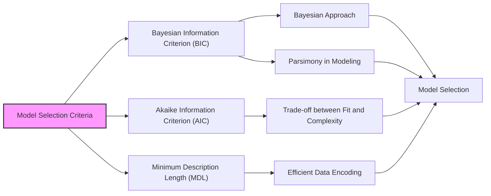
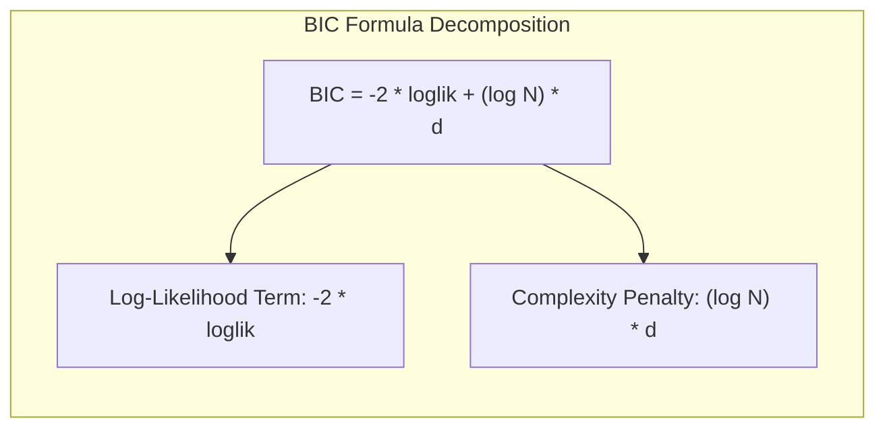
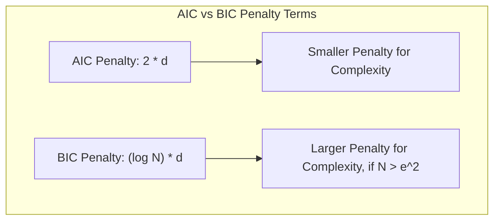
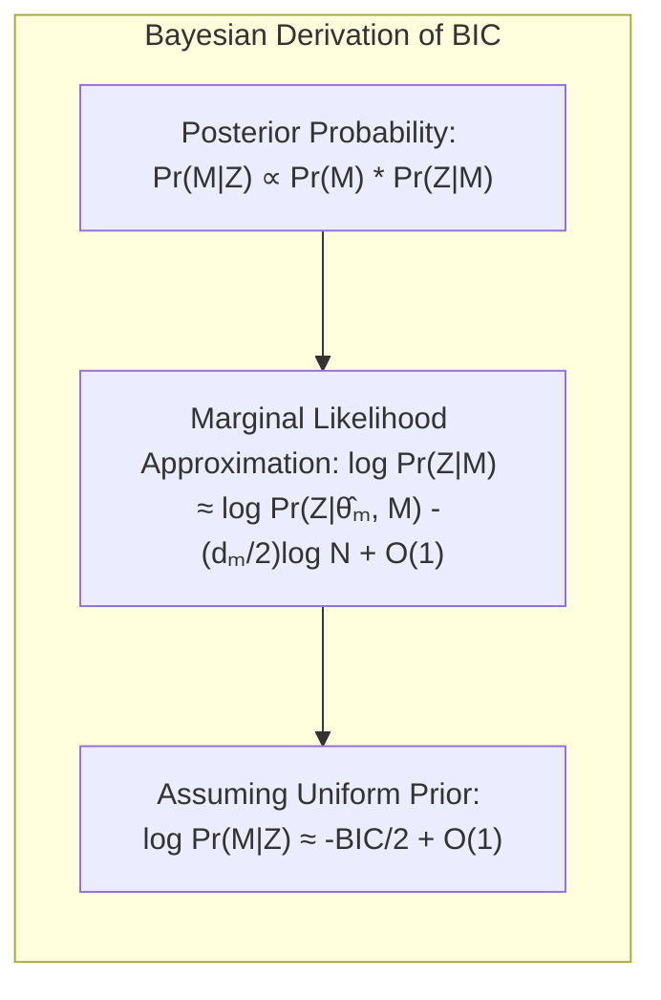
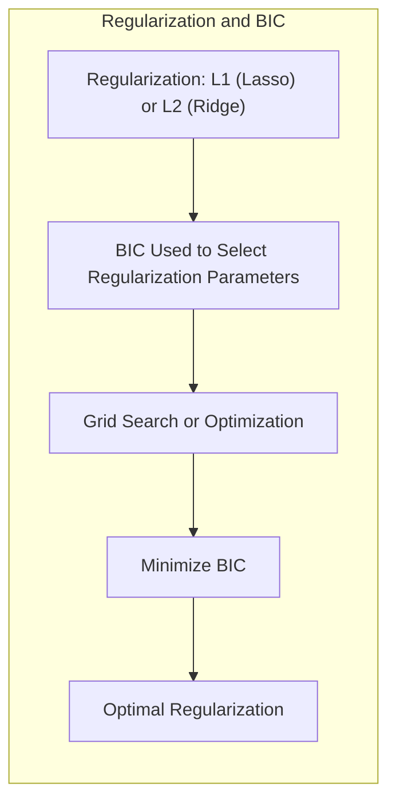
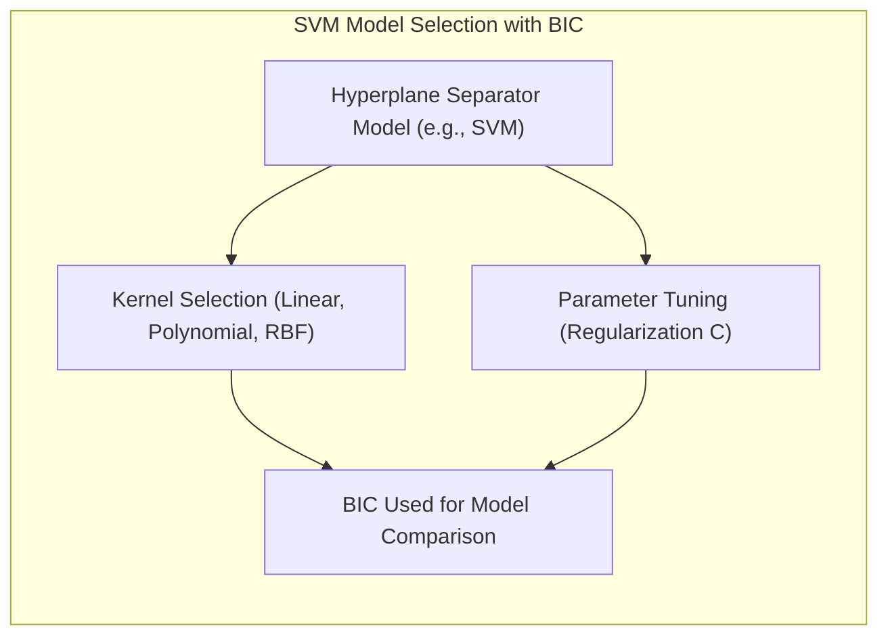
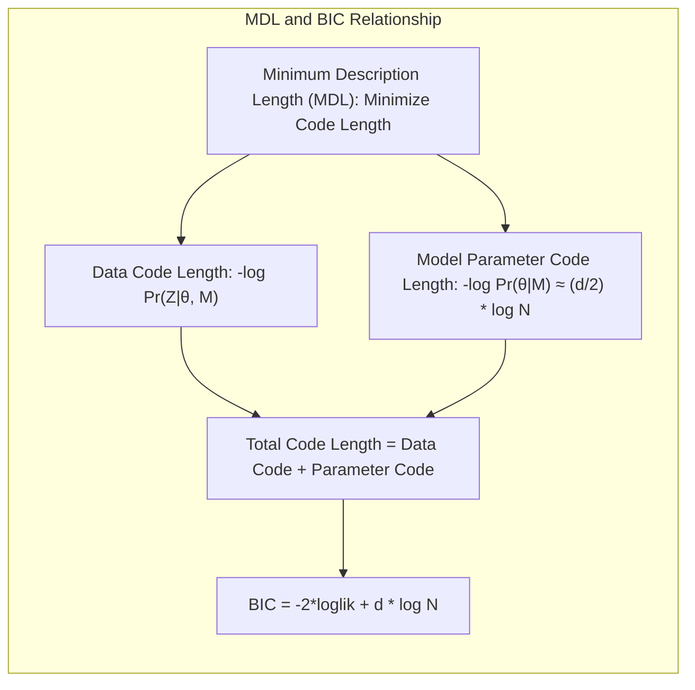

Okay, here's the enhanced text with all mathematical expressions formatted using LaTeX notation, and currency symbols properly escaped:

## Bayesian Information Criterion (BIC)



### Introdução
O presente capítulo explora o **Bayesian Information Criterion (BIC)**, um método fundamental para avaliação e seleção de modelos em aprendizado estatístico. O BIC, como discutido no texto [^7.7], é uma medida que busca equilibrar a qualidade do ajuste de um modelo aos dados com a sua complexidade, evitando o overfitting. Assim como o AIC, o BIC fornece uma pontuação que auxilia na escolha do melhor modelo para um dado conjunto de dados, sendo amplamente usado em inferência estatística e aprendizado de máquina.

O BIC é particularmente útil quando se compara modelos com diferentes números de parâmetros ou quando se busca a parsimônia na modelagem, preferindo modelos mais simples que expliquem os dados de maneira razoável. Esta característica torna o BIC uma ferramenta essencial para selecionar modelos que generalizem bem para dados não vistos [^7.7].

### Conceitos Fundamentais

**Conceito 1: Fundamentos do BIC**
O BIC surge do contexto da inferência Bayesiana para seleção de modelos, o qual, em sua essência, avalia a probabilidade de um modelo ter gerado os dados observados, tomando também a complexidade do modelo em consideração [^7.7]. Em outras palavras, o BIC tenta quantificar o tradeoff entre a capacidade de um modelo ajustar-se aos dados e a sua complexidade. O modelo com menor BIC é geralmente preferido.
O BIC é calculado como:
$$BIC = -2 \cdot loglik + (log N) \cdot d$$
onde:
- **loglik** é o valor máximo da log-verossimilhança do modelo [^7.7].
- **N** é o número de observações no conjunto de dados [^7.7].
- **d** é o número de parâmetros no modelo [^7.7].
O termo $(-2 \cdot loglik)$ mede o quão bem o modelo se ajusta aos dados, e o termo $(log N \cdot d)$ penaliza a complexidade do modelo.



> 💡 **Exemplo Numérico:**
>
> Suponha que temos um modelo de regressão linear com 3 parâmetros (d=3) ajustado a um conjunto de dados com 100 observações (N=100). A log-verossimilhança máxima do modelo é -250 (loglik = -250).
>
> O BIC seria calculado como:
>
> $BIC = -2 \cdot (-250) + (log(100)) \cdot 3$
>
> $BIC = 500 + (4.605) \cdot 3$
>
> $BIC = 500 + 13.815$
>
> $BIC = 513.815$
>
> Agora, vamos supor que temos um segundo modelo com 5 parâmetros (d=5) no mesmo conjunto de dados (N=100), com uma log-verossimilhança ligeiramente melhor: -245 (loglik = -245).
>
> O BIC para este modelo seria:
>
> $BIC = -2 \cdot (-245) + (log(100)) \cdot 5$
>
> $BIC = 490 + (4.605) \cdot 5$
>
> $BIC = 490 + 23.025$
>
> $BIC = 513.025$
>
> Apesar do segundo modelo apresentar um melhor ajuste aos dados (-245 vs -250), o seu BIC é ligeiramente menor (513.025 vs 513.815), indicando que o primeiro modelo, mais simples, é preferível, nesse caso específico, segundo o BIC. A diferença do segundo modelo ser melhor é pequena e não compensa a complexidade adicionada.

**Lemma 1:** *A penalidade do BIC cresce com o tamanho da amostra N* [^7.7]. O termo $(log N \cdot d)$ impõe uma penalidade mais forte para modelos complexos (alto valor de d) em amostras maiores (alto valor de N).

_Prova:_
O termo de penalização no BIC é dado por $(log N) \cdot d$. Como $log N$ é uma função crescente de $N$, um aumento em $N$ implica um aumento na penalidade pela complexidade do modelo. Consequentemente, modelos mais simples são preferidos em datasets maiores, devido à maior penalidade por complexidade.  $\blacksquare$

**Conceito 2: Comparação com AIC**
O AIC, ou Akaike Information Criterion, é um critério de seleção de modelos similar ao BIC, mas com uma diferença crucial na penalização por complexidade. O AIC é definido como [^7.5]:
$$AIC = -2 \cdot loglik + 2 \cdot d$$
A diferença entre AIC e BIC reside no termo de penalização: enquanto o AIC usa $2 \cdot d$, o BIC usa $(log N) \cdot d$ [^7.7], [^7.5]. Como $log N$ é maior que 2 para a maioria dos tamanhos de amostra relevantes em modelagem estatística (especialmente quando $N > e^2 \approx 7.4$), o BIC tende a penalizar modelos mais complexos de forma mais agressiva que o AIC [^7.7]. Essa diferença na penalização por complexidade leva a AIC a ser mais propenso a selecionar modelos mais complexos do que o BIC [^7.7].



> 💡 **Exemplo Numérico:**
>
> Usando os mesmos modelos do exemplo anterior, vamos calcular o AIC para comparação:
>
> Modelo 1 (d=3, loglik=-250):
> $AIC = -2 \cdot (-250) + 2 \cdot 3 = 500 + 6 = 506$
>
> Modelo 2 (d=5, loglik=-245):
> $AIC = -2 \cdot (-245) + 2 \cdot 5 = 490 + 10 = 500$
>
> Nesse caso, o AIC favoreceria o modelo 2 (AIC = 500), o modelo mais complexo, pois não penaliza tanto a complexidade quanto o BIC. Isso demonstra que o AIC tende a escolher modelos mais complexos do que o BIC, especialmente em amostras grandes. Comparando com o exemplo anterior do BIC, o modelo 1 era o preferido pelo BIC, demonstrando que o BIC favorece modelos mais simples.

**Corolário 1:** *Para amostras suficientemente grandes, o BIC tende a escolher modelos mais simples que o AIC* [^7.7]. Se $N > e^2 \approx 7.4$, a penalidade de complexidade do BIC será maior que a do AIC, tornando o BIC mais propenso a escolher modelos mais simples.

_Prova:_
Como o termo de penalização do BIC é $(log N) \cdot d$ e do AIC é $2 \cdot d$, para $N > e^2$, $(log N) \cdot d > 2 \cdot d$.  Assim, o BIC impõe uma penalidade maior por parâmetros extras, levando à escolha de modelos mais parcimoniosos. $\blacksquare$

**Conceito 3: Derivação Bayesiana do BIC**
O BIC surge como uma aproximação da probabilidade posterior de um modelo sob a abordagem Bayesiana [^7.7], [^7.8]. Na inferência Bayesiana, busca-se a probabilidade posterior $Pr(M|Z)$ de um modelo $M$ dados os dados observados $Z$, expressa por:
$$Pr(M|Z) \propto Pr(M) \cdot Pr(Z|M)$$
onde $Pr(M)$ é a probabilidade *a priori* do modelo e $Pr(Z|M)$ é a verossimilhança marginal dos dados dado o modelo [^7.7].
A probabilidade marginal pode ser aproximada usando a aproximação de Laplace, levando a:
$$log \, Pr(Z|M) \approx log \, Pr(Z|\hat{\theta}_m, M) - \frac{d_m}{2}log \, N + O(1)$$
onde $\hat{\theta}_m$ é a estimativa de máxima verossimilhança dos parâmetros do modelo $M$ e $d_m$ é o número de parâmetros livres no modelo [^7.8].
Considerando que $ -2 \cdot log \, Pr(Z|\hat{\theta}_m, M)$ é o deviance,  que é equivalente à $-2 \cdot loglik$, chegamos à formulação do BIC [^7.7]. Assumindo que $Pr(M)$ é constante (prior uniforme sobre modelos), a probabilidade *a posteriori* $Pr(M|Z)$ é proporcional a:
$$log \, Pr(M|Z) \approx - \frac{BIC}{2} + O(1)$$


**Lemma 2:** *Maximizar a probabilidade a posteriori é equivalente a minimizar o BIC, sob prior uniforme de modelos* [^7.8]. A derivação Bayesiana do BIC mostra que escolher o modelo com o menor BIC é uma forma de selecionar o modelo com a maior probabilidade a posteriori, sob uma prior uniforme.

_Prova:_
A probabilidade posterior do modelo é proporcional a $Pr(M|Z) \propto exp(-\frac{BIC}{2})$.  A maximização da probabilidade *a posteriori*  $Pr(M|Z)$ é equivalente a maximizar $exp(-\frac{BIC}{2})$, que por sua vez é equivalente a minimizar o BIC. $\blacksquare$

### Regressão Linear e Mínimos Quadrados para Classificação

```mermaid
  vennDiagram
      %%{init: {'theme': 'forest'}}%%
      diagramTitle Classificação por Regressão
      sets 3
      setLabels "Regressão Linear", "Regressão Logística", "LDA"
      areas 1101, 1011, 0111
```

O BIC é especialmente útil na comparação entre modelos de classificação, tais como regressão linear em matriz de indicadores e outros métodos [^7.7]. A regressão linear aplicada à classificação pode ser vista como uma forma de estimar as probabilidades de cada classe através de uma regressão nos indicadores de classe [^7.2]. O BIC pode ser usado para comparar modelos de regressão linear com diferentes números de preditores, ajudando a evitar overfitting ao penalizar modelos mais complexos [^7.7]. A seleção do melhor modelo pode ser feita minimizando o BIC, o que garante que o modelo escolhido não seja excessivamente complexo em relação ao conjunto de dados.
Em contraste, modelos como a **Logistic Regression**, que modelam diretamente a probabilidade de classe através da função sigmoide e da maximização da verossimilhança, também podem ser comparados usando BIC [^7.4]. A regressão logística muitas vezes fornece estimativas mais estáveis de probabilidade quando comparada com a regressão de indicadores que podem resultar em extrapolações fora do intervalo [0,1] [^7.2], [^7.4].

> 💡 **Exemplo Numérico:**
>
> Considere um problema de classificação binária com 200 observações (N=200). Temos dois modelos para comparar:
>
> Modelo 1: Regressão linear com 4 preditores (d=5, incluindo o intercepto). A log-verossimilhança é -100.
>
> Modelo 2: Regressão logística com 2 preditores (d=3, incluindo o intercepto). A log-verossimilhança é -110.
>
> Calculando os BICs:
>
> Modelo 1: $BIC = -2 * (-100) + log(200) * 5 = 200 + 5.298 * 5 = 200 + 26.49 = 226.49$
>
> Modelo 2: $BIC = -2 * (-110) + log(200) * 3 = 220 + 5.298 * 3 = 220 + 15.894 = 235.894$
>
> Neste caso, o modelo de regressão linear, apesar de ter uma verossimilhança melhor, apresenta um BIC menor, mostrando que o BIC favorece modelos menos complexos e que o aumento de verossimilhança do primeiro modelo não compensa o aumento na complexidade.

**Lemma 3:** *Em problemas de classificação, a penalização de complexidade do BIC favorece modelos mais simples que sejam capazes de discriminar bem as classes, mas sem serem complexos demais* [^7.7].

_Prova:_
Modelos complexos, como regressões lineares com muitos preditores ou funções não-lineares, podem sobreajustar o ruído nos dados de treinamento e ter uma baixa performance de generalização. O BIC, ao penalizar a complexidade, leva a uma seleção que equilibra o ajuste aos dados e a capacidade de generalização, mesmo em cenários de classificação com classes sobrepostas ou com ruído [^7.7]. $\blacksquare$

A aplicação do BIC em regressão linear para classificação envolve calcular o log-likelihood do modelo, o número de parâmetros, e o tamanho da amostra, o que permite calcular um BIC que permite avaliar diferentes conjuntos de preditores ou modelos de diferentes complexidades, como modelos lineares com e sem regularização [^7.5].

### Métodos de Seleção de Variáveis e Regularização em Classificação

Na seleção de variáveis em modelos classificatórios, a regularização desempenha um papel fundamental para evitar overfitting e melhorar a capacidade de generalização [^7.5]. Penalidades como L1 (Lasso) e L2 (Ridge) são frequentemente adicionadas à função de custo para controlar a complexidade do modelo e a magnitude dos coeficientes, conforme descrito no texto [^7.3], [^7.5].
O BIC pode ser aplicado para selecionar os melhores parâmetros de regularização ou a melhor combinação de regularizadores em modelos logísticos, utilizando uma abordagem de grid search ou otimização para encontrar os valores que minimizam o BIC [^7.5], [^7.7].



> 💡 **Exemplo Numérico:**
>
> Suponha que estamos ajustando um modelo de regressão logística com regularização L1 (Lasso) para um problema de classificação. Temos 150 amostras (N=150) e estamos comparando três valores diferentes para o parâmetro de regularização (lambda): 0.01, 0.1 e 1.
>
> Após o treinamento, obtemos os seguintes resultados:
>
> | lambda | Log-verossimilhança | Número de coeficientes não-zero (d) |
> |--------|---------------------|------------------------------------|
> | 0.01   | -70                 | 8                                  |
> | 0.1    | -75                 | 5                                  |
> | 1      | -85                 | 2                                  |
>
> Calculando os BICs:
>
> Lambda = 0.01: $BIC = -2*(-70) + log(150)*8 = 140 + 5.011 * 8 = 140 + 40.088 = 180.088$
>
> Lambda = 0.1: $BIC = -2*(-75) + log(150)*5 = 150 + 5.011 * 5 = 150 + 25.055 = 175.055$
>
> Lambda = 1: $BIC = -2*(-85) + log(150)*2 = 170 + 5.011 * 2 = 170 + 10.022 = 180.022$
>
>  Neste caso, o BIC indica que o valor de lambda = 0.1 é o melhor, pois ele atinge o menor valor de BIC, mostrando que o modelo intermediário (lambda=0.1) apresenta um melhor balanço entre ajuste e complexidade. O BIC ajuda a escolher o melhor valor do parâmetro de regularização, selecionando o modelo com o melhor desempenho e complexidade apropriada.

**Corolário 2:** *O uso do BIC como critério de seleção permite encontrar um bom equilíbrio entre a capacidade preditiva e a complexidade dos modelos regularizados, levando a melhor generalização.*. A regularização e o BIC atuam juntos na seleção de modelos, com o primeiro reduzindo a complexidade do modelo e o segundo favorecendo modelos menos complexos e generalizáveis.

_Prova:_
O BIC penaliza modelos com muitos parâmetros, enquanto a regularização reduz a magnitude dos coeficientes, efetivamente reduzindo a complexidade do modelo. Ao usar o BIC na seleção de modelos regularizados, o objetivo é encontrar o nível ideal de regularização que minimize a complexidade e maximize o ajuste aos dados, levando a melhor generalização [^7.5]. $\blacksquare$

A aplicação do BIC em modelos com regularização envolve a estimação do número efetivo de parâmetros ($df$) para o cálculo do BIC [^7.6], [^7.7]. Este número não é necessariamente igual ao número de parâmetros originais, especialmente em modelos com regularização forte, onde os parâmetros podem ser induzidos a serem zero. O BIC penaliza o aumento de $df$, promovendo modelos menos complexos.

### Separating Hyperplanes e Perceptrons

O BIC pode ser usado na escolha de modelos classificatórios como hiperplanos separadores ou em métodos relacionados ao Perceptron, conforme descrito no texto [^7.9]. Em modelos de hiperplanos separadores (por exemplo, SVM), o BIC pode ser usado para ajustar o parâmetro de regularização C ou para comparar diferentes kernels.  A escolha do kernel (linear, polinomial, RBF) e seus parâmetros pode ser guiada pelo BIC [^7.9].



> 💡 **Exemplo Numérico:**
>
> Suponha que estamos treinando um SVM com diferentes kernels em um conjunto de dados de classificação com 100 amostras (N=100).  Vamos comparar um kernel linear e um kernel RBF (Radial Basis Function).
>
> Após o treinamento, obtemos os seguintes resultados:
>
> | Kernel    | Log-verossimilhança | Número de parâmetros efetivos (df) |
> |-----------|---------------------|----------------------------------|
> | Linear    | -60                 | 5                               |
> | RBF       | -50                 | 15                               |
>
> Calculando os BICs:
>
> Kernel Linear: $BIC = -2*(-60) + log(100)*5 = 120 + 4.605 * 5 = 120 + 23.025 = 143.025$
>
> Kernel RBF: $BIC = -2*(-50) + log(100)*15 = 100 + 4.605 * 15 = 100 + 69.075 = 169.075$
>
> Apesar do kernel RBF ter uma melhor log-verossimilhança, o kernel linear é preferido segundo o BIC devido à sua menor complexidade (menor número de parâmetros efetivos). A complexidade extra do modelo RBF não compensa sua melhora em ajuste nesse caso.

**Lemma 4:** *O BIC auxilia na escolha do kernel adequado em modelos de hiperplanos separadores* [^7.9]. A seleção do kernel é fundamental e o uso do BIC permite balancear a complexidade do modelo e o ajuste aos dados para uma melhor generalização.

_Prova:_
Um kernel muito complexo (muitos parâmetros) leva a um sobreajuste, enquanto um kernel muito simples não modela corretamente os dados. O BIC, ao penalizar a complexidade do modelo, auxilia na escolha de um kernel com complexidade adequada ao problema [^7.9]. $\blacksquare$

Nos perceptrons, o BIC pode ser usado para escolher entre diferentes arquiteturas ou para selecionar a quantidade de épocas de treinamento. Modelos mais complexos, como redes neurais profundas, podem necessitar de regularização adicional para garantir a capacidade de generalização.

### Pergunta Teórica Avançada (Exemplo): Qual a relação entre o BIC e o Minimum Description Length (MDL)?

**Resposta:**
O BIC e o Minimum Description Length (MDL) são motivados por princípios diferentes, mas levam a critérios de seleção de modelos formalmente equivalentes, conforme descrito no texto [^7.8]. O MDL surge da ideia de que o melhor modelo é aquele que permite codificar os dados de forma mais eficiente, isto é, com a menor descrição. A codificação eficiente está relacionada ao conceito de entropia, que mede a informação contida nos dados [^7.8].



Em essência, no MDL, o melhor modelo é aquele que, ao mesmo tempo, codifica os dados de forma concisa (bom ajuste) e tem uma descrição concisa (simplicidade), em outras palavras, o modelo com menor comprimento de código para os dados e seus parâmetros [^7.8]. O MDL busca minimizar a soma do comprimento do código para os dados e do comprimento do código para os parâmetros do modelo.

Formalmente, o comprimento do código para os dados é dado por $-log \, Pr(Z|\theta,M)$, e o comprimento do código para os parâmetros do modelo é dado por $-log \, Pr(\theta|M)$. Juntando essas duas quantidades, temos:

$$length = - log \, Pr(Z|\theta, M) - log \, Pr(\theta|M)$$
Para obter um critério de seleção de modelos, aproximamos o segundo termo usando a aproximação de Laplace [^7.8], que leva a um termo de penalidade da forma $(log \, N) \cdot \frac{d}{2}$, onde $d$ é o número de parâmetros do modelo e $N$ o número de dados.

Ao assumir que o número de bits usados para codificar o modelo não dependem do tamanho dos dados $N$, o segundo termo (comprimento do código dos parâmetros) se torna aproximadamente $-\frac{d}{2} \log N$. Assim, chegamos à função de custo do MDL:

$$length = - log \, Pr(Z|\theta, M) + \frac{d}{2}log \, N$$

Multiplicando por -2 e considerando a log-verossimilhança $loglik = log \, Pr(Z|\theta, M)$, chegamos ao critério BIC:

$$BIC = -2 \, loglik + d \, log \, N$$
**Lemma 5:** *A minimização do MDL é equivalente à minimização do BIC, sob certas aproximações* [^7.8]. A relação entre MDL e BIC se manifesta na penalização da complexidade do modelo, com o termo $(log N) \cdot d$.

_Prova:_
Como descrito acima, o critério MDL e o BIC são derivados a partir de princípios diferentes, mas o resultado final é o mesmo, ou seja, ambos objetivam selecionar modelos que equilibrem o ajuste aos dados e a complexidade, e ambos chegam na mesma forma funcional de $ -2 \, loglik + (log \, N) d$, o BIC [^7.8]. $\blacksquare$

Essa conexão entre MDL e BIC reforça que selecionar o modelo com menor BIC é consistente com o princípio de codificar os dados da maneira mais eficiente possível, de forma que a minimização da descrição dos dados leva a modelos que generalizam melhor, por serem mais simples.

### Conclusão

O **Bayesian Information Criterion (BIC)** é um método robusto e fundamentado para avaliação e seleção de modelos estatísticos, amplamente utilizado no aprendizado de máquina. Originado da inferência Bayesiana, o BIC penaliza a complexidade do modelo de uma maneira que tende a escolher modelos mais simples, que são menos propensos a overfitting. O BIC, quando comparado com outros critérios como o AIC, é preferido em situações onde se tem amostras grandes e onde a simplicidade do modelo é uma preocupação primária. No entanto, a decisão de utilizar o BIC ou outra técnica de avaliação de modelo deve sempre ser guiada pelas características específicas do problema e da base de dados.

<!-- END DOCUMENT -->
