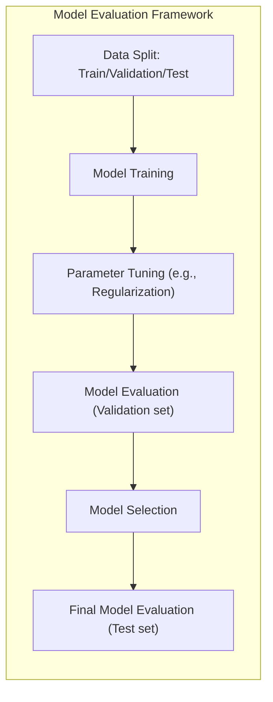
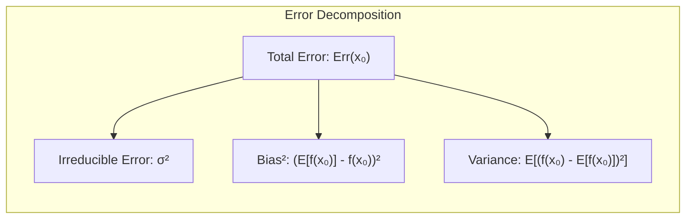
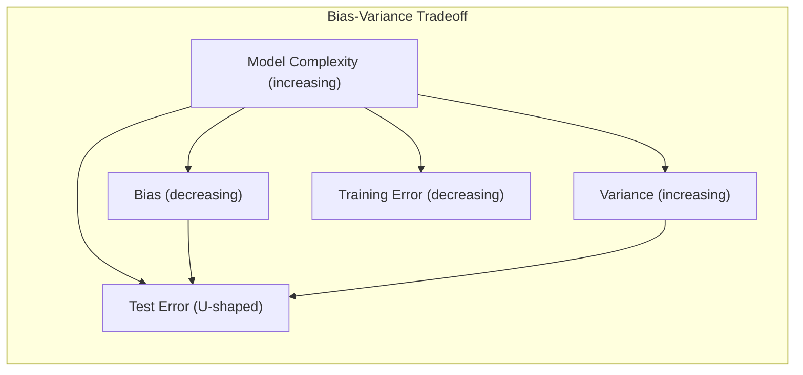
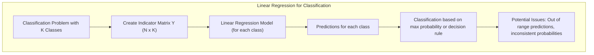
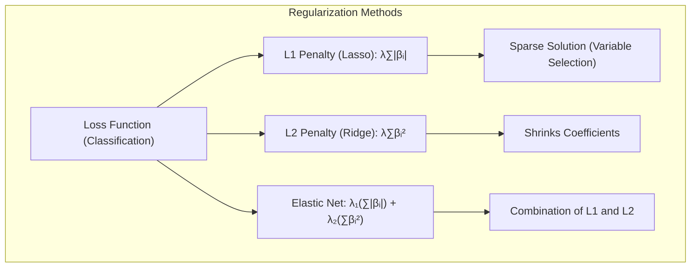
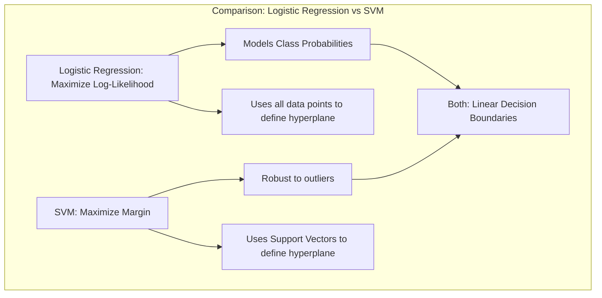
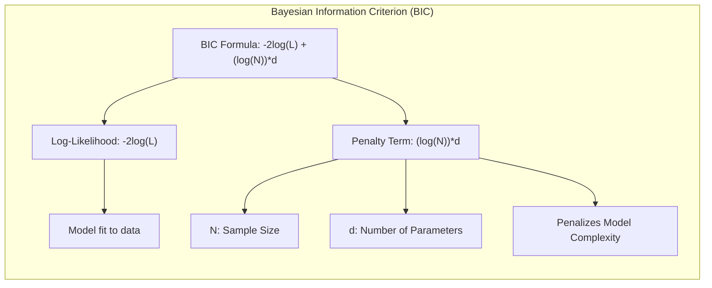
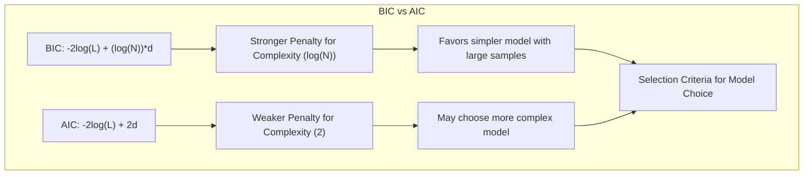

## Avaliação e Seleção de Modelos: Critério de Schwarz



### Introdução

A capacidade de um método de aprendizado predizer resultados em dados de teste independentes, conhecida como **generalização**, é crucial na prática [^7.1]. A avaliação do desempenho do modelo guia a escolha do método de aprendizado e fornece uma métrica da qualidade do modelo final. Este capítulo aborda os principais métodos de avaliação e como eles são usados na seleção de modelos, começando pela discussão da interação entre **bias**, **variance** e **complexidade do modelo** [^7.1].

### Conceitos Fundamentais

**Conceito 1: Generalização e Erro de Predição**. O problema central na avaliação de modelos é medir a capacidade do modelo de generalizar a dados novos [^7.1]. O erro de predição, definido pela função de perda $L(Y, f(X))$, quantifica o desvio entre a resposta alvo $Y$ e a predição $f(X)$ [^7.2]. A escolha da função de perda é crucial e depende da natureza da resposta, como o **erro quadrático** ($L(Y, f(X)) = (Y-f(X))^2$) para respostas quantitativas ou o **erro absoluto** ($L(Y, f(X)) = |Y - f(X)|$) [^7.2]. O objetivo é minimizar o erro de predição em dados não vistos. O desempenho em dados de treinamento pode ser enganoso, pois o modelo pode se ajustar excessivamente aos dados de treinamento (overfitting), resultando em baixa generalização. Métodos lineares, embora tenham baixo bias, podem ter alta variância se a quantidade de dados for pequena, o que indica a necessidade de métodos de regularização.

**Lemma 1:** *A decomposição do erro de predição.* O erro esperado de predição em um ponto específico $x_0$ pode ser decomposto em três componentes: **variância do alvo**, **bias quadrado** e **variância do modelo** [^7.3]. Matematicamente, $$ Err(x_0) = \mathbb{E}[(Y - f(x_0))^2|X=x_0] = \sigma^2 + [Ef(x_0) - f(x_0)]^2 + E[f(x_0) - Ef(x_0)]^2 $$ onde $\sigma^2$ é a variância do erro irredutível, $[Ef(x_0) - f(x_0)]^2$ é o bias quadrado, e $E[f(x_0) - Ef(x_0)]^2$ é a variância do modelo [^7.3]. Isso destaca o tradeoff fundamental entre bias e variância. $\blacksquare$



> 💡 **Exemplo Numérico:**
> Suponha que a verdadeira relação entre $X$ e $Y$ seja $Y = 2X + 3 + \epsilon$, onde $\epsilon$ é um erro aleatório com média 0 e desvio padrão 1 (ou seja, $\sigma = 1$). Considere um modelo linear $f(X) = \beta X + \alpha$. Vamos avaliar o erro de predição em $x_0 = 2$.
> 1.  **Variância do Alvo** ($\sigma^2$): Como $\sigma = 1$, a variância do alvo é $\sigma^2 = 1$.
> 2.  **Bias Quadrado** ($[Ef(x_0) - f(x_0)]^2$): Suponha que o modelo ajustado seja $f(X) = 2.5X + 2$. Então $f(2) = 2.5(2) + 2 = 7$. O valor esperado da predição correta para $x_0 = 2$ é $E[Y|X=2] = 2(2) + 3 = 7$. O bias é $E[f(2)] - f(2) = 7 - 7= 0$ . Então, o bias quadrado é $0^2 = 0$. Agora, se o modelo fosse $f(X) = 1.5X + 4$, teríamos $f(2) = 1.5(2) + 4 = 7$, e o bias seria $E[f(2)] - f(2) = 7-7=0$
> 3.  **Variância do Modelo** ($E[f(x_0) - Ef(x_0)]^2$): Assumindo que ajustamos o modelo com amostras diferentes e obtivemos modelos um pouco diferentes, como $f_1(X) = 2.4X + 2.2$ e $f_2(X) = 2.6X + 1.8$. Para $x_0 = 2$, temos $f_1(2) = 7$ e $f_2(2) = 7$. $Ef(2) = (7+7)/2 = 7$. Então, $E[f(x_0) - Ef(x_0)]^2 = ((7-7)^2 + (7-7)^2)/2 = 0$.
>  Considerando que tenhamos $f_1(X) = 2.4X + 2.2$ e $f_2(X) = 1.6X + 4.5$, em $x_0 = 2$ temos $f_1(2) = 2.4*2 + 2.2 = 7$ e $f_2(2) = 1.6*2+4.5= 7.7$. O valor esperado de f(2) é $Ef(2) = (7+7.7)/2 = 7.35$. A variância do modelo será $E[f(x_0) - Ef(x_0)]^2 =  ((7-7.35)^2 + (7.7-7.35)^2)/2 = 0.1225$. O erro de predição nesse caso seria $Err(x_0) = 1 + 0 + 0.1225=1.1225$.
>
> Este exemplo ilustra como o erro de predição é decomposto em diferentes fontes. O bias é a diferença entre a média das previsões do modelo e o valor verdadeiro, e a variância é a variabilidade das previsões do modelo. O erro irredutível é devido à natureza aleatória dos dados.

**Conceito 2: Bias, Variance e Complexidade do Modelo**. O *bias* representa o erro sistemático do modelo ao aproximar a função verdadeira, enquanto a *variância* quantifica a sensibilidade da estimativa a variações nos dados de treinamento. Modelos com alta complexidade tendem a ter baixo bias mas alta variância, enquanto modelos simples podem ter alto bias e baixa variância [^7.2]. O objetivo é encontrar um nível de complexidade que minimize o erro total, ou seja, a soma do bias e da variância. Na prática, isso significa usar métodos de regularização ou seleção de variáveis para controlar a complexidade e evitar overfitting. A complexidade do modelo é frequentemente controlada por parâmetros de ajuste [^7.2].

**Corolário 1:** *O tradeoff bias-variância*. O **tradeoff bias-variância** implica que modelos mais complexos (que têm mais parâmetros de ajuste) tendem a diminuir o *bias* e aumentar a *variância*, e vice-versa [^7.3]. Em geral, o *erro de treinamento* diminui à medida que aumentamos a complexidade do modelo, mas o *erro de teste* tende a ter um comportamento em forma de U, indicando que existe um nível ótimo de complexidade [^7.2]. Portanto, a escolha do modelo envolve equilibrar o bias e a variância, o que justifica o uso de métodos de seleção de modelo como a validação cruzada [^7.10] e critérios como o AIC [^7.5] e BIC [^7.7].



> 💡 **Exemplo Numérico:**
> Suponha que estejamos tentando ajustar uma curva a um conjunto de pontos.
>
> *   **Modelo Simples (Alto Bias, Baixa Variância):** Um modelo linear, $f(X) = \beta_0 + \beta_1X$, pode não capturar a curvatura dos dados, resultando em um erro sistemático (alto bias), mas será relativamente consistente em diferentes conjuntos de dados de treinamento (baixa variância).
>
> *   **Modelo Complexo (Baixo Bias, Alta Variância):** Um modelo polinomial de alta ordem, como $f(X) = \beta_0 + \beta_1X + \beta_2X^2 + \beta_3X^3 + \ldots$, pode se ajustar muito bem aos dados de treinamento, quase perfeitamente (baixo bias), mas pode variar muito em diferentes conjuntos de dados de treinamento (alta variância) e não generalizar bem para novos dados.
>
> O objetivo é encontrar um modelo com complexidade intermediária, que capture a tendência dos dados sem se ajustar excessivamente ao ruído presente nas amostras de treinamento, o que pode ser visualizado como o ponto mais baixo de uma curva em U no erro de teste.

**Conceito 3: Seleção e Avaliação de Modelos**. A **seleção de modelos** visa escolher o melhor modelo dentre um conjunto de modelos candidatos [^7.1]. A **avaliação de modelos**, por outro lado, busca estimar o erro de predição do modelo final, após sua seleção [^7.1]. Ambos os objetivos são cruciais para garantir um bom desempenho em dados não vistos. A seleção de modelos pode envolver o ajuste de parâmetros de regularização ou a escolha do número de variáveis preditoras. A avaliação do modelo envolve a estimativa de seu erro de generalização em novos dados. Para isso, é comum dividir os dados disponíveis em conjuntos de treinamento, validação e teste [^7.1]. É importante ressaltar que o uso repetido do conjunto de teste para a seleção do modelo pode levar a uma estimativa otimista do erro de generalização [^7.2].

### Regressão Linear e Mínimos Quadrados para Classificação



A regressão linear pode ser usada para classificação codificando as classes como variáveis indicadoras. Para um problema de classificação com $K$ classes, criamos uma matriz de indicadores $Y$, onde cada linha representa uma observação e cada coluna indica se a observação pertence a uma determinada classe [^7.1, 7.2]. Um modelo de regressão linear é então ajustado para prever cada coluna de $Y$, e as predições são usadas para classificar novas observações [^7.2]. No entanto, a regressão de indicadores pode levar a problemas, como predições fora do intervalo [0, 1] e estimativas de probabilidade inconsistentes [^7.4]. Apesar das limitações, a regressão de indicadores pode ser útil quando o objetivo é a fronteira de decisão linear e não as probabilidades em si.

**Lemma 2:** *Equivalência em condições específicas*. Em certas condições, a regressão linear aplicada à matriz de indicadores produz as mesmas projeções nos hiperplanos de decisão que a análise discriminante linear (LDA) [^7.3]. Especificamente, se as classes tiverem a mesma matriz de covariância, a regressão linear e o LDA produzem resultados equivalentes em termos de fronteiras de decisão.

**Corolário 2:** *Simplificação da análise*. O Lemma 2 simplifica a análise de modelos lineares, mostrando a equivalência entre abordagens que, à primeira vista, parecem distintas, como a regressão de indicadores e a análise discriminante linear. Essa equivalência é útil pois a regressão linear é uma técnica bem estabelecida com um vasto arsenal de ferramentas de diagnóstico e regularização.

A regressão de indicadores sofre de algumas limitações [^7.2, 7.4]. Por exemplo, ela pode levar a extrapolações fora do intervalo [0,1], e pode apresentar problemas com o masking, principalmente quando há uma grande quantidade de classes [^7.3]. Métodos probabilísticos, como a regressão logística [^7.4], oferecem alternativas mais apropriadas nesses casos. Em geral, a escolha entre a regressão de indicadores e outros métodos de classificação depende do problema em questão, das necessidades e das suposições que podemos fazer [^7.4].

### Métodos de Seleção de Variáveis e Regularização em Classificação



A regularização é uma técnica para controlar a complexidade do modelo e reduzir o overfitting, adicionando termos de penalização à função de perda [^7.5]. Em modelos de classificação, a regularização pode ser aplicada por meio de penalizações L1 ou L2 aos coeficientes do modelo [^7.4.4]. A penalização L1 (Lasso) promove a esparsidade, ou seja, leva muitos coeficientes a zero, atuando como um método de seleção de variáveis [^7.4.4]. A penalização L2 (Ridge) reduz a magnitude dos coeficientes e estabiliza a solução. Elas podem ser combinadas como Elastic Net para aproveitar vantagens de ambos os tipos de regularização [^7.5].

**Lemma 3:** *Esparsidade com L1*. A penalização L1 na classificação logística leva a coeficientes esparsos. Isso ocorre porque a função de penalização L1, definida por $\sum |\beta_i|$, tem um ponto não diferenciável na origem, o que força alguns coeficientes a serem exatamente zero durante o processo de otimização, diferentemente da penalização L2 que busca reduzir os coeficientes mas não os torna zero [^7.4.4].

**Prova do Lemma 3:** Em uma regressão logística com penalização L1, a função objetivo é a soma da log-verossimilhança e o termo de penalização L1. Para cada componente $\beta_i$ do vetor de parâmetros, a derivada parcial da penalização é $\pm 1$, dependendo do sinal de $\beta_i$, o que leva à esparsidade da solução [^7.4.4]. $\blacksquare$

> 💡 **Exemplo Numérico:**
>
> Considere um problema de classificação binária com 5 variáveis preditoras ($X_1, X_2, X_3, X_4, X_5$). Vamos comparar os resultados da regressão logística com e sem penalização L1 (Lasso).
>
> ```python
> import numpy as np
> from sklearn.linear_model import LogisticRegression
> from sklearn.preprocessing import StandardScaler
>
> # Dados de exemplo (substituir por dados reais)
> np.random.seed(42)
> X = np.random.rand(100, 5)
> y = np.random.randint(0, 2, 100)
>
> # Padronizar as variáveis
> scaler = StandardScaler()
> X_scaled = scaler.fit_transform(X)
>
> # Regressão logística sem penalização
> logreg = LogisticRegression(penalty=None, solver='lbfgs')
> logreg.fit(X_scaled, y)
> coef_sem_penalizacao = logreg.coef_[0]
>
> # Regressão logística com penalização L1 (Lasso)
> logreg_lasso = LogisticRegression(penalty='l1', C=0.5, solver='liblinear') # C é o inverso de lambda
> logreg_lasso.fit(X_scaled, y)
> coef_com_penalizacao = logreg_lasso.coef_[0]
>
> print("Coeficientes sem penalização:", coef_sem_penalizacao)
> print("Coeficientes com penalização L1:", coef_com_penalizacao)
> ```
>
> **Interpretação:**
>
> *   Os coeficientes sem penalização mostram a importância de cada variável preditora no modelo de regressão logística, porém, todas as variáveis são consideradas.
>
> *   Os coeficientes com penalização L1 (Lasso) mostram que algumas variáveis têm coeficientes iguais a zero, o que significa que elas são excluídas do modelo, simplificando a análise.  As variáveis restantes, cujos coeficientes são diferentes de zero, são as mais importantes para a classificação.
>
> Isso demonstra como a penalização L1 promove a esparsidade, realizando a seleção de variáveis automaticamente.

**Corolário 3:** *Interpretabilidade com esparsidade*. O Lemma 3 demonstra que a regularização L1 resulta em modelos mais interpretáveis devido à esparsidade nos coeficientes. Isso facilita a identificação das variáveis mais relevantes para a classificação e simplifica a análise do modelo, permitindo maior compreensão do que gera um resultado [^7.4.5].

A escolha do método de regularização depende do problema em questão e da natureza dos dados. Quando há muitas variáveis e poucas amostras, a regularização é essencial para evitar overfitting [^7.5]. Métodos como Elastic Net combinam as vantagens da L1 (seleção de variáveis) e L2 (estabilidade), oferecendo uma solução flexível e eficaz [^7.5]. A escolha do parâmetro de regularização é crucial e pode ser feita usando validação cruzada [^7.10] ou outros critérios de avaliação de modelo [^7.7].
> ⚠️ **Ponto Crucial**: A regularização não apenas melhora a generalização do modelo, mas também facilita a sua interpretação e análise, permitindo o entendimento das relações entre as variáveis. [^7.4.4, 7.5]

### Separating Hyperplanes e Perceptrons

O conceito de hiperplanos separadores ótimos se baseia na ideia de maximizar a margem de separação entre as classes. A construção desses hiperplanos leva a um problema de otimização, cuja solução envolve combinações lineares de pontos de suporte [^7.5.2]. O algoritmo do Perceptron de Rosenblatt é um exemplo clássico de um método iterativo para encontrar um hiperplano separador [^7.5.1]. O Perceptron converge para uma solução se os dados forem linearmente separáveis.

### Pergunta Teórica Avançada: Qual a relação entre a minimização da função de custo na regressão logística e a maximização da margem em SVMs?
**Resposta:**
Embora ambos os métodos utilizem modelos lineares para classificação, seus objetivos e abordagens são distintos. Na regressão logística, o objetivo é modelar a probabilidade de uma observação pertencer a uma classe, utilizando a função logit e maximizando a log-verossimilhança. O modelo ajusta um hiperplano para separar as classes com base nas probabilidades estimadas. Já os SVMs, maximizam a margem entre as classes por meio da construção de um hiperplano ótimo, considerando apenas os pontos mais próximos das fronteiras de decisão (vetores de suporte). A solução do SVM é encontrada pela resolução do problema dual de Wolfe, que resulta em um modelo mais robusto contra outliers [^7.5.2].


**Lemma 4:** *Dualidade de Wolfe*. A otimização do hiperplano separador em SVMs pode ser reformulada em um problema dual de Wolfe [^7.5.2]. Essa reformulação permite resolver o problema de forma mais eficiente e introduz a ideia de vetores de suporte.
**Corolário 4:** *Interpretação geométrica*. A formulação dual de Wolfe em SVMs oferece uma interpretação geométrica do problema de classificação, em que os vetores de suporte definem a fronteira de decisão, maximizando a margem entre as classes. A regressão logística, por outro lado, usa todos os pontos na definição do hiperplano [^7.4.3].

> ⚠️ **Ponto Crucial**: SVMs e Regressão Logística abordam problemas de classificação de forma distinta, com SVMs maximizando margens e regressão logística modelando probabilidades, o que leva a diferentes propriedades e comportamentos para cada modelo.

### O Critério de Informação Bayesiano (BIC)



O **Critério de Informação Bayesiano (BIC)**, também conhecido como Critério de Schwarz [^7.7], é um critério para seleção de modelos baseado em uma abordagem Bayesiana. O BIC visa encontrar o modelo com a maior probabilidade *a posteriori*, dado os dados [^7.7]. O BIC penaliza modelos mais complexos com base no número de parâmetros e no tamanho da amostra, o que faz com que ele tenda a favorecer modelos mais simples, sendo um critério de seleção de modelos consistente [^7.7].

A formulação matemática do BIC é dada por [^7.7]:
$$ BIC = -2\log L + (\log N)d $$
onde $L$ é o valor da função de verossimilhança maximizada do modelo ajustado, $N$ é o tamanho da amostra e $d$ é o número de parâmetros do modelo. O termo $-2\log L$ quantifica o ajuste do modelo aos dados, enquanto o termo $(\log N)d$ penaliza a complexidade do modelo. O BIC é derivado de uma aproximação para a probabilidade marginal dos dados em um modelo específico [^7.7].
A comparação entre dois modelos é feita usando a diferença do BIC entre eles. O modelo com o menor BIC é geralmente preferido. O termo de penalização $(\log N)d$ é maior que a penalização do AIC (que é $2d$) para $N > e^2$, o que explica porque o BIC tende a selecionar modelos mais simples, sendo mais rigoroso com a inclusão de parâmetros adicionais [^7.7].
> 💡 **Exemplo Numérico:**
>
> Considere dois modelos de regressão linear, Modelo 1 e Modelo 2, ajustados a um mesmo conjunto de dados com $N = 100$ amostras.
>
> *   **Modelo 1:** Tem 3 parâmetros ($d_1 = 3$) e a log-verossimilhança máxima obtida é $L_1 = -250$.
>
> *   **Modelo 2:** Tem 6 parâmetros ($d_2 = 6$) e a log-verossimilhança máxima obtida é $L_2 = -230$.
>
> Vamos calcular o BIC para cada modelo:
>
> **Modelo 1:**
>
> $BIC_1 = -2 \log(L_1) + (\log(N))d_1$
>
> $BIC_1 = -2(-250) + (\log(100))3$
>
> $BIC_1 = 500 + (4.605)3$
>
> $BIC_1 = 500 + 13.815$
>
> $BIC_1 \approx 513.815$
>
> **Modelo 2:**
>
> $BIC_2 = -2 \log(L_2) + (\log(N))d_2$
>
> $BIC_2 = -2(-230) + (\log(100))6$
>
> $BIC_2 = 460 + (4.605)6$
>
> $BIC_2 = 460 + 27.63$
>
> $BIC_2 \approx 487.63$
>
> Neste caso, o Modelo 2 tem um BIC menor ($487.63 < 513.815$), indicando que ele é o modelo preferido.
>
> Agora, vamos aumentar o tamanho da amostra para N= 1000:
>
> **Modelo 1:**
>
> $BIC_1 = -2 \log(L_1) + (\log(N))d_1$
>
> $BIC_1 = -2(-250) + (\log(1000))3$
>
> $BIC_1 = 500 + (6.907)3$
>
> $BIC_1 = 500 + 20.721$
>
> $BIC_1 \approx 520.721$
>
> **Modelo 2:**
>
> $BIC_2 = -2 \log(L_2) + (\log(N))d_2$
>
> $BIC_2 = -2(-230) + (\log(1000))6$
>
> $BIC_2 = 460 + (6.907)6$
>
> $BIC_2 = 460 + 41.442$
>
> $BIC_2 \approx 501.442$
>
> Novamente, o Modelo 2 tem o menor BIC, mas a diferença entre os BIC é menor, o que demonstra que o BIC penaliza modelos mais complexos com o aumento do tamanho da amostra.
>
> Se tivéssemos uma amostra muito grande, $N = 10000$:
>
> **Modelo 1:**
>
> $BIC_1 = -2 \log(L_1) + (\log(N))d_1$
>
> $BIC_1 = -2(-250) + (\log(10000))3$
>
> $BIC_1 = 500 + (9.210)3$
>
> $BIC_1 = 500 + 27.63$
>
> $BIC_1 \approx 527.63$
>
> **Modelo 2:**
>
> $BIC_2 = -2 \log(L_2) + (\log(N))d_2$
>
> $BIC_2 = -2(-230) + (\log(10000))6$
>
> $BIC_2 = 460 + (9.210)6$
>
> $BIC_2 = 460 + 55.26$
>
> $BIC_2 \approx 515.26$
>
> Agora o modelo 1 é favorecido, mostrando a tendência do BIC de favorecer modelos mais simples quando a amostra é grande, o que é coerente com a teoria e a propriedade de consistência do BIC.



O BIC, ao contrário do AIC, é um critério de seleção de modelo que, quando usado em modelos aninhados e com uma amostra muito grande, seleciona o modelo correto com probabilidade tendendo a 1, o que o torna um critério consistente, o que não ocorre com o AIC [^7.7]. O BIC é usado tanto para modelos probabilísticos quanto em modelos de classificação [^7.7], assumindo a mesma penalização por complexidade, o que o torna consistente para problemas de classificação [^7.7]. A formulação do BIC depende do uso da função de log-verossimilhança, o que impede a aplicação direta em problemas com funções de perda que não sejam baseadas nessa premissa.
> 💡 **Nota:** O BIC é um critério de seleção de modelos consistente e é geralmente preferido quando o objetivo é identificar o modelo verdadeiro entre um conjunto de modelos candidatos, especialmente quando a amostra é grande. O BIC, porém, pode não ser o melhor critério quando o objetivo é apenas a capacidade preditiva. [^7.7]

### Conclusão
Este capítulo explorou métodos fundamentais para avaliação e seleção de modelos, com foco na compreensão do tradeoff entre bias e variância. O Critério de Informação Bayesiano (BIC), abordado em detalhes, oferece uma abordagem Bayesiana para seleção de modelos, penalizando a complexidade e priorizando modelos mais simples quando a amostra é grande. Além disso, foram exploradas a regressão linear para classificação, técnicas de regularização, hiperplanos separadores e a interação entre bias e variância em diferentes contextos, como a regressão logística e SVMs. A importância da validação cruzada e do bootstrap como ferramentas para estimar o erro de generalização também foi destacada. Estes métodos são cruciais para garantir a construção de modelos robustos e capazes de generalizar para dados não vistos, sendo ferramentas essenciais no arsenal de um profissional em Estatística e Aprendizado de Máquina.

### Footnotes
[^7.1]: "The generalization performance of a learning method relates to its prediction capability on independent test data. Assessment of this performance is extremely important in practice, since it guides the choice of learning method or model, and gives us a measure of the quality of the ultimately chosen model." *(Trecho de Model Assessment and Selection)*
[^7.2]: "Figure 7.1 illustrates the important issue in assessing the ability of a learning method to generalize. Consider first the case of a quantitative or interval scale response. We have a target variable Y, a vector of inputs X, and a prediction model f(X) that has been estimated from a training set T." *(Trecho de Model Assessment and Selection)*
[^7.3]: "As in Chapter 2, if we assume that Y = f(X) + ε where E(ε) = 0 and Var(ε) = σ², we can derive an expression for the expected prediction error of a regression fit f(X) at an input point X = x0, using squared-error loss:" *(Trecho de Model Assessment and Selection)*
[^7.4]: "The story is similar for a qualitative or categorical response G taking one of K values in a set G, labeled for convenience as 1, 2, ..., K. Typically we model the probabilities pk(X) = Pr(G = k|X) (or some monotone transformations fk(X)), and then Ĝ(X) = arg maxk Îk(X)." *(Trecho de Model Assessment and Selection)*
[^7.4.4]: "For linear models fit by ordinary least squares, the estimation bias is zero. For restricted fits, such as ridge regression, it is positive, and we trade it off with the benefits of a reduced variance. The model bias can only be reduced by enlarging the class of linear models to a richer collection of models, by including interactions and transformations of the variables in the model." *(Trecho de Model Assessment and Selection)*
[^7.5]: "The methods of this chapter approximate the validation step either analytically (AIC, BIC, MDL, SRM) or by efficient sample re-use (cross-validation and the bootstrap)." *(Trecho de Model Assessment and Selection)*
[^7.5.2]: "Before jumping into these topics, we first explore in more detail the nature of test error and the bias-variance tradeoff." *(Trecho de Model Assessment and Selection)*
[^7.7]: "The Bayesian information criterion (BIC), like AIC, is applicable in settings where the fitting is carried out by maximization of a log-likelihood. The generic form of BIC is" *(Trecho de Model Assessment and Selection)*
[^7.10]: "Probably the simplest and most widely used method for estimating prediction error is cross-validation. This method directly estimates the expected extra-sample error Err = E[L(Y, f(X))], the average generalization error when the method f(X) is applied to an independent test sample from the joint distribution of X and Y." *(Trecho de Model Assessment and Selection)*
