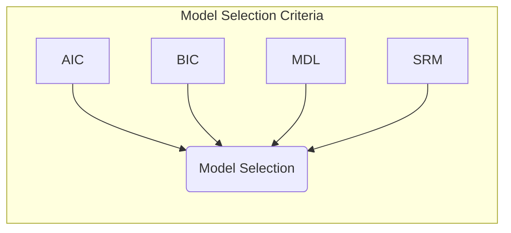
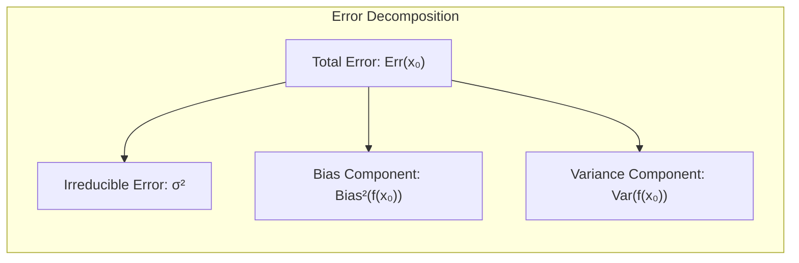
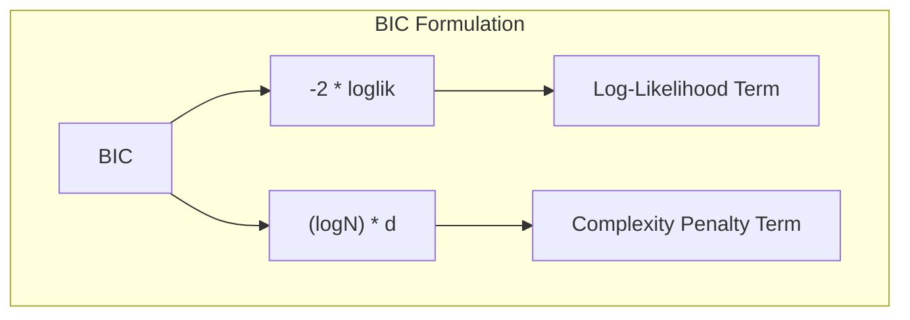
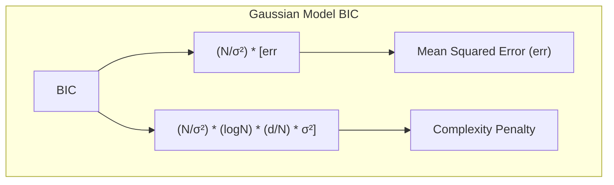
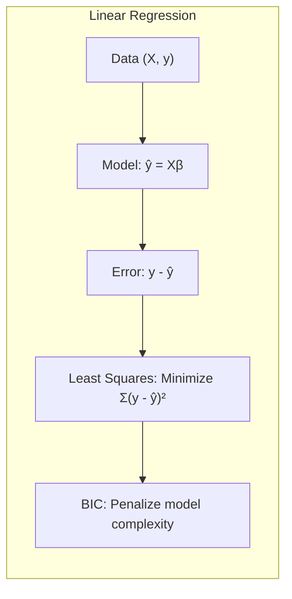
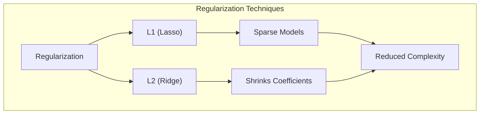
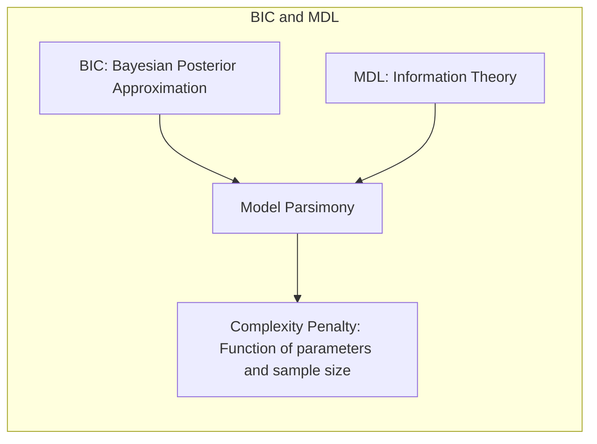

Okay, let's enhance this text with practical numerical examples to clarify the concepts of BIC, especially in the context of Gaussian models and linear regression.

## Bayesian Information Criterion (BIC) para Modelos Gaussianos

### Introdução
A seleção de modelos é um passo crucial na construção de modelos preditivos precisos e generalizáveis. O **Bayesian Information Criterion (BIC)**, juntamente com o Akaike Information Criterion (AIC), o Minimum Description Length (MDL) e o Structural Risk Minimization (SRM), são ferramentas essenciais para este processo [^7.1]. Este capítulo explora o BIC, particularmente no contexto de modelos Gaussianos, detalhando sua formulação, derivação, e aplicação. O foco será em como o BIC, como um método de seleção de modelos, auxilia na busca pelo modelo que melhor equilibra a complexidade e o ajuste aos dados.

### Conceitos Fundamentais

**Conceito 1: O Problema da Seleção de Modelos**
A seleção de modelos lida com a tarefa de escolher o modelo mais adequado a partir de um conjunto de modelos candidatos. Este processo é vital para evitar o *overfitting*, um cenário onde o modelo se ajusta bem aos dados de treino, mas falha ao generalizar para novos dados. A complexidade do modelo, o número de parâmetros e o ajuste aos dados são os fatores principais a serem considerados [^7.2]. O **trade-off entre viés e variância** é crucial, onde modelos mais complexos tendem a ter menor viés e maior variância, e vice-versa. O objetivo é encontrar um ponto ótimo onde o erro de generalização é minimizado.

**Lemma 1:** *O erro de predição (ou erro de generalização) pode ser decomposto em termos de viés, variância e um termo de erro irredutível. O objetivo da seleção de modelos é minimizar a soma do viés ao quadrado e a variância, considerando a complexidade do modelo.* [^7.3]
$$ Err(x_0) = \sigma^2 + Bias^2(f(x_0)) + Var(f(x_0)) $$
A derivação formal deste lemma é apresentada no tópico [^7.3], e demonstra a importância de equilibrar a complexidade do modelo. $\blacksquare$

> 💡 **Exemplo Numérico:** Suponha que temos um conjunto de dados e dois modelos para ajustar. O Modelo A tem um viés maior, mas baixa variância, enquanto o Modelo B tem um viés menor, mas alta variância. Se o erro irredutível ($\sigma^2$) é 0.5, e o viés do Modelo A é 0.8 com uma variância de 0.1 e o viés do Modelo B é 0.2 com uma variância de 0.7, então o erro total para o Modelo A é $0.5 + 0.8^2 + 0.1 = 1.24$ e para o Modelo B é $0.5 + 0.2^2 + 0.7 = 1.24$. Neste caso, ambos os modelos tem o mesmo erro de generalização, mas idealmente, buscaríamos um modelo com menor viés e variância se possível. Esse exemplo demonstra como um bom modelo equilibra estes dois componentes.

**Conceito 2: O BIC (Bayesian Information Criterion)**
O BIC é um critério para seleção de modelos que se baseia em princípios Bayesianos. Ele estima a probabilidade posterior de um modelo dado os dados observados e penaliza modelos mais complexos para evitar o *overfitting* [^7.7].  Em essência, o BIC tenta encontrar um modelo que explique bem os dados, mas que seja parcimonioso, com um número menor de parâmetros. A forma genérica do BIC é dada por:
$$BIC = -2 \cdot loglik + (logN) \cdot d$$
Onde:
-   $loglik$ é o log-likelihood do modelo ajustado aos dados, que mede o quão bem o modelo se ajusta aos dados.
-   $N$ é o número de amostras ou observações.
-   $d$ é o número de parâmetros do modelo.
    O termo $(log N) \cdot d$ penaliza modelos mais complexos, e a magnitude desta penalização aumenta com o número de dados e o número de parâmetros do modelo.

**Corolário 1:** *O BIC penaliza modelos complexos de forma mais severa que o AIC, especialmente quando o número de amostras (N) é grande.* [^7.7]
A penalização imposta pelo BIC, com fator $log(N)$, tende a ser maior que a penalização imposta pelo AIC, com fator $2$. Assim, o BIC tende a favorecer modelos mais simples quando comparado ao AIC, especialmente em grandes conjuntos de dados. [^7.7] $\blacksquare$

> 💡 **Exemplo Numérico:** Consideremos dois modelos: Modelo 1 com log-likelihood de -150 e 3 parâmetros, e Modelo 2 com log-likelihood de -140 e 6 parâmetros. Com 100 observações (N=100), o BIC para o Modelo 1 é  $-2 * (-150) + (log(100) * 3) \approx 300 + 4.605 * 3 \approx 313.815$ e o BIC para o Modelo 2 é $-2 * (-140) + (log(100) * 6) \approx 280 + 4.605 * 6 \approx 307.63$. Neste caso, o modelo 2 é preferido pelo BIC. Agora, se o número de observações fosse 1000 (N=1000), o BIC para o Modelo 1 seria $300 + log(1000) * 3 \approx 300+6.907*3 \approx 320.721$ e o BIC para o Modelo 2 seria $280 + log(1000)*6 \approx 280 + 6.907*6 \approx 321.442$. Neste caso, o BIC favoreceria o Modelo 1, devido a maior penalidade pelo número de parametros dado o número de observações. Este exemplo ilustra como a penalização do BIC aumenta com o tamanho da amostra, favorecendo modelos mais simples em grandes conjuntos de dados.

**Conceito 3: O BIC em Modelos Gaussianos**
Em modelos Gaussianos, onde se assume que os dados são normalmente distribuídos, o log-likelihood pode ser relacionado à soma dos erros quadrados (squared error loss). Utilizando essa relação, podemos expressar o BIC para modelos Gaussianos da seguinte maneira:
$$ BIC = \frac{N}{\sigma^2} \left[ err + (logN) \frac{d}{N} \sigma^2 \right] $$
Onde:
-   $N$ é o número de observações.
-   $err$ é o erro médio quadrático dos resíduos (mean squared error), que mede a inadequação do modelo aos dados de treino.
-   $d$ é o número de parâmetros no modelo.
-  $\sigma^2$ é a variância do erro, que pode ser estimada a partir dos dados.
O termo adicional $(logN) \cdot d \cdot \sigma^2 /N$ é a penalização que aumenta com a complexidade do modelo e com o tamanho da amostra.

> 💡 **Exemplo Numérico:** Suponha que temos um modelo Gaussiano com 100 observações (N=100), um erro médio quadrático de 2 (err=2), 4 parâmetros (d=4) e uma variância estimada do erro $\sigma^2=3$. O BIC seria: $BIC = \frac{100}{3} [2 + (log(100) \cdot \frac{4}{100} \cdot 3)] \approx 33.33 [2 + 4.605 \cdot 0.04 \cdot 3] \approx 33.33 [2 + 0.55] \approx 33.33 * 2.55 \approx 84.99$. Se outro modelo com 100 observações tem um erro quadrático menor, digamos err=1.5, mas 8 parâmetros, então o BIC seria: $BIC = \frac{100}{3} [1.5 + (log(100) \cdot \frac{8}{100} \cdot 3)] \approx 33.33[1.5 + 4.605 \cdot 0.08 \cdot 3] \approx 33.33[1.5 + 1.105] \approx 33.33 * 2.605 \approx 86.83$. Apesar do modelo com mais parâmetros ter um erro menor, seu BIC é maior devido a penalização por complexidade, indicando que o primeiro modelo pode ser uma escolha melhor dado o equilíbrio entre ajuste e complexidade.

### Regressão Linear e Mínimos Quadrados para Classificação

O BIC, embora originado em um contexto Bayesiano, é frequentemente usado em problemas de regressão. Em regressão linear, o objetivo é encontrar um modelo que minimize a soma dos quadrados dos erros (least squares). O BIC adiciona uma penalização baseada no número de parâmetros, ajudando a evitar o overfitting e a selecionar modelos que generalizem bem. A regressão linear pode ser vista como um caso especial de modelo Gaussiano, onde os erros são assumidos serem normalmente distribuídos com média zero e variância constante [^7.2]. O BIC, portanto, se aplica de forma natural a este cenário.

**Lemma 2:** *Em um contexto de regressão linear, o BIC penaliza modelos com mais parâmetros, equilibrando a capacidade de ajuste aos dados (log-likelihood) com a complexidade do modelo.* [^7.7]

A penalização do BIC, neste contexto, é proporcional ao número de parâmetros do modelo e ao logaritmo do número de amostras. Isso significa que, em conjuntos de dados grandes, a penalização por modelos mais complexos é mais severa do que para conjuntos de dados menores. $\blacksquare$

> 💡 **Exemplo Numérico:** Suponha que temos um modelo linear com uma variável preditora (d=2, intercepto e coeficiente da variável) e um modelo com três variáveis preditoras (d=4, intercepto e 3 coeficientes). Após ajustar os modelos com 50 observações (N=50), obtemos um erro médio quadrático (MSE) de 4 para o primeiro modelo e 3 para o segundo modelo, a variância estimada do erro sendo aproximadamente 4. O BIC para o primeiro modelo é: $BIC_1 = \frac{50}{4} [4 + (log(50) \cdot \frac{2}{50} \cdot 4)] \approx 12.5 [4 + 3.912 * 0.16] = 12.5 [4 + 0.626] = 12.5 * 4.626 = 57.825$. O BIC para o segundo modelo é: $BIC_2 = \frac{50}{4} [3 + (log(50) \cdot \frac{4}{50} \cdot 4)] \approx 12.5 [3 + 3.912 * 0.32] = 12.5 [3 + 1.252] = 12.5 * 4.252 = 53.15$. Neste cenário, o BIC favoreceria o modelo com mais parâmetros, dado que o ganho no ajuste compensa a penalidade. Se o número de observações fosse 500, e considerando os mesmos valores de MSE, teríamos: $BIC_1 = \frac{500}{4} [4 + (log(500) \cdot \frac{2}{500} \cdot 4)] \approx 125 [4 + 6.215 * 0.016] = 125[4 + 0.099] = 125*4.099 = 512.375$ e $BIC_2 = \frac{500}{4} [3 + (log(500) \cdot \frac{4}{500} \cdot 4)] \approx 125 [3 + 6.215 * 0.032] = 125[3 + 0.199] = 125 * 3.199 = 399.875$. Note que o efeito da penalidade foi maior neste cenário, e que o BIC agora favorece o modelo com menos parâmetros.

**Corolário 2:** *A escolha de um modelo com BIC mínimo não garante necessariamente o modelo com melhor desempenho preditivo, mas tende a ser um bom compromisso entre ajuste e complexidade.*
O BIC fornece uma ferramenta objetiva para comparar modelos e escolher o mais adequado, dado um conjunto de dados. É uma abordagem baseada em princípios teóricos, que se torna mais útil em cenários com muitos modelos e grandes conjuntos de dados [^7.7].

### Métodos de Seleção de Variáveis e Regularização em Classificação

A seleção de variáveis e a regularização são técnicas que visam aprimorar a qualidade de modelos de classificação e regressão, reduzindo a complexidade e evitando o overfitting. No contexto de modelos lineares, como regressão logística e discriminante, o BIC pode ser usado para selecionar o conjunto ótimo de variáveis ou a magnitude da regularização. As penalidades L1 e L2 podem ser consideradas como uma forma de restringir o espaço de busca do modelo.

**Lemma 3:** *A regularização, como L1 e L2, pode ser vista como uma forma de controlar a complexidade do modelo, afetando diretamente o número efetivo de parâmetros (e portanto, o valor do BIC).* [^7.7]

A regularização L1 (Lasso) tende a gerar modelos esparsos, onde muitos coeficientes são zerados, reduzindo o número efetivo de parâmetros, e a L2 (Ridge) encolhe os coeficientes em direção a zero, tornando-os menores, aumentando a estabilidade do modelo. Ambas as formas de regularização reduzem a complexidade do modelo e impactam o valor do BIC. $\blacksquare$

> 💡 **Exemplo Numérico:** Consideremos um modelo de regressão com 10 variáveis preditoras. Aplicamos a regularização L1 (Lasso) com dois valores diferentes para o parâmetro de regularização λ. Com λ = 0.1, 3 coeficientes são zerados (d = 8, intercepto e 7 coeficientes diferentes de zero) e o MSE é 2.5. Com λ=0.5, 7 coeficientes são zerados (d=4, intercepto e 3 coeficientes diferentes de zero) e o MSE é 3. Com 100 observações (N=100) e $\sigma^2=2.5$: O BIC para o primeiro caso é: $BIC_1 = \frac{100}{2.5}[2.5 + log(100) \frac{8}{100} 2.5] = 40[2.5 + 4.605*0.08*2.5] = 40[2.5+0.921] = 136.84$ e para o segundo caso é: $BIC_2 = \frac{100}{2.5}[3 + log(100) \frac{4}{100} 2.5] = 40[3 + 4.605*0.04*2.5]=40[3+0.4605] = 138.42$. Neste caso, a regularização mais forte resultou em um modelo mais simples, mas com um BIC maior, indicando que o modelo com menos regularização é preferível. Isso demonstra como o BIC pode auxiliar na escolha do parâmetro de regularização ideal.

**Corolário 3:** *O BIC pode ser usado para otimizar a força da regularização, encontrando o valor do parâmetro de regularização que minimiza o critério, e por consequência, seleciona o modelo que melhor equilibra o ajuste aos dados e a complexidade.* [^7.7]

O uso de BIC no contexto da regularização pode levar à escolha de modelos que, em geral, são mais estáveis e generalizáveis. A regularização imposta por essas penalidades é capaz de ajustar o bias-variance tradeoff.

### Separating Hyperplanes e Perceptrons

Embora o BIC tenha sido originalmente desenvolvido no contexto de modelos probabilísticos, o conceito pode ser estendido para modelos geométricos, como **separating hyperplanes**, em particular, os **Support Vector Machines (SVMs)**. Embora o BIC não tenha uma aplicação direta na forma original para este contexto, as penalidades associadas à complexidade do modelo podem ser usadas para auxiliar na escolha do hiperplano ideal. Modelos mais simples (e mais generalizáveis) seriam aqueles que utilizam um número menor de vetores de suporte, e, nesse caso, os métodos que utilizam regularização podem reduzir a complexidade do modelo.

### Pergunta Teórica Avançada: Qual a conexão entre o BIC e o MDL (Minimum Description Length) para modelos Gaussianos?

**Resposta:**
O BIC e o MDL compartilham uma base teórica comum, que é a busca por modelos parcimoniosos. No contexto Bayesiano, o BIC emerge como uma aproximação da probabilidade posterior de um modelo, enquanto o MDL é derivado de uma perspectiva de teoria da informação [^7.8]. Ambos os critérios buscam um balanço entre o ajuste do modelo aos dados e a sua complexidade, utilizando uma penalização que é proporcional ao número de parâmetros e ao tamanho da amostra. Em modelos Gaussianos, a equivalência entre o log-likelihood e o erro quadrático médio (MSE) cria uma ligação direta entre o BIC e o MDL.

**Lemma 4:** *O BIC é uma aproximação do logaritmo negativo da probabilidade posterior marginal do modelo, o que, sob certas condições, é equivalente à formulação do MDL.* [^7.8]
A prova dessa equivalência envolve aproximar a integral da probabilidade posterior utilizando a aproximação de Laplace, que leva à fórmula do BIC. A penalização da complexidade é derivada da necessidade de codificar os parâmetros do modelo, além dos dados em si. $\blacksquare$

**Corolário 4:** *Em termos práticos, tanto o BIC quanto o MDL tendem a selecionar modelos mais simples do que aqueles escolhidos pelo AIC, especialmente quando o número de dados é grande.*
Esta conexão ressalta a importância de penalizar a complexidade do modelo para evitar o overfitting e melhorar a generalização para novos dados. Ambos os critérios, em suas respectivas abordagens, chegam a uma forma semelhante de equilibrar os dois conceitos.

### Conclusão
O BIC é um poderoso critério para a seleção de modelos, especialmente quando aplicado a modelos Gaussianos. Sua base teórica, tanto em uma abordagem Bayesiana quanto através da teoria da informação com o MDL, fornece uma justificativa sólida para a sua utilização. Embora não seja perfeito (especialmente ao estimar o erro de generalização), o BIC oferece um bom equilíbrio entre ajuste aos dados e complexidade do modelo. A sua aplicação em regressão linear, juntamente com regularização, torna o BIC uma ferramenta muito versátil e prática para muitos problemas de modelagem. <!-- END DOCUMENT -->

### Footnotes
[^7.1]: "The generalization performance of a learning method relates to its predic- tion capability on independent test data. Assessment of this performance is extremely important in practice, since it guides the choice of learning method or model, and gives us a measure of the quality of the ultimately chosen model." *(Trecho de Model Assessment and Selection)*
[^7.2]: "Figure 7.1 illustrates the important issue in assessing the ability of a learn- ing method to generalize. Consider first the case of a quantitative or interval scale response." *(Trecho de Model Assessment and Selection)*
[^7.3]: "As in Chapter 2, if we assume that Y = f(X) + ε where E(ε) = 0 and Var(ε) = σε, we can derive an expression for the expected prediction error of a regression fit f(X) at an input point X = x0, using squared-error loss:" *(Trecho de Model Assessment and Selection)*
[^7.7]: "The Bayesian information criterion (BIC), like AIC, is applicable in settings where the fitting is carried out by maximization of a log-likelihood. The generic form of BIC is BIC = -2 loglik + (logN) d." *(Trecho de Model Assessment and Selection)*
[^7.8]: "The minimum description length (MDL) approach gives a selection cri- terion formally identical to the BIC approach, but is motivated from an optimal coding viewpoint." *(Trecho de Model Assessment and Selection)*
