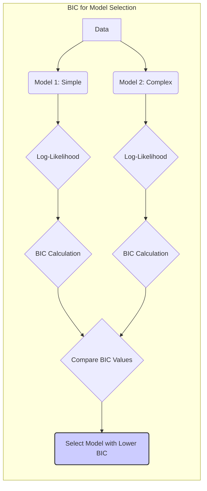
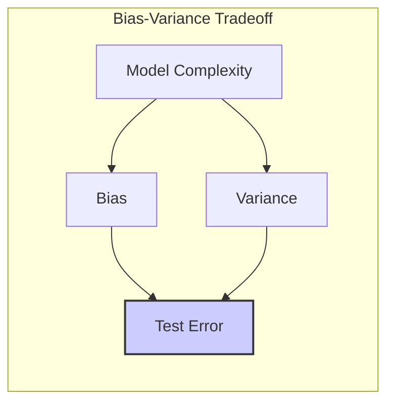
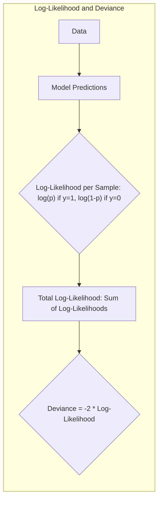
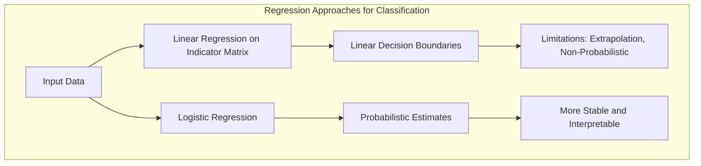
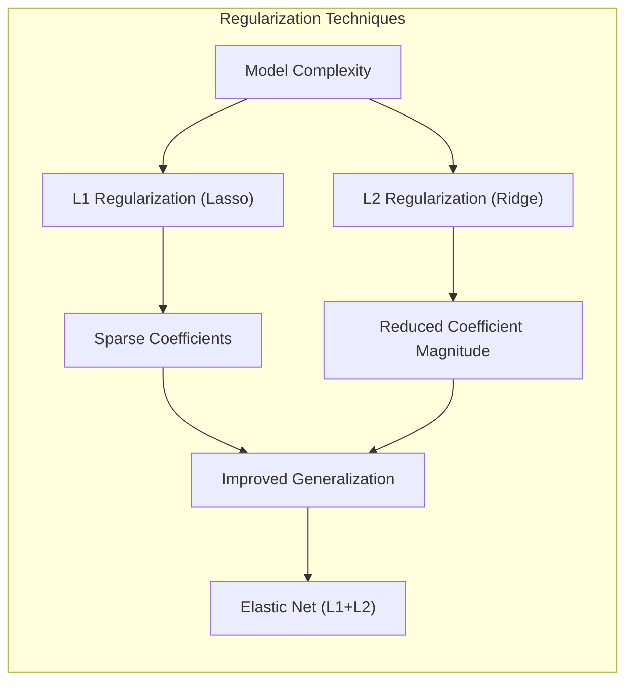
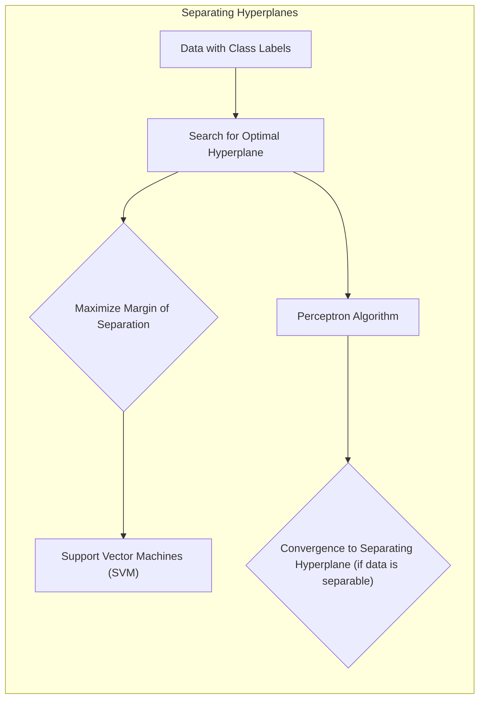
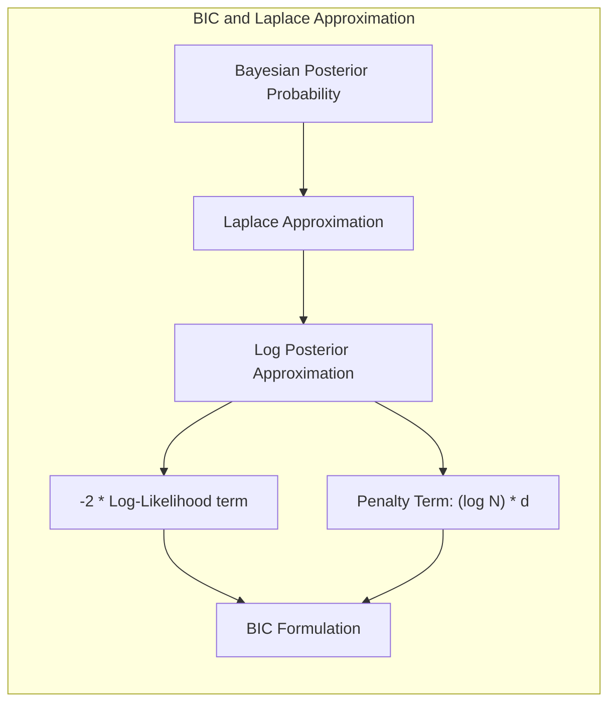

Okay, let's enhance this text with practical numerical examples where appropriate, following your guidelines.

## Bayesian Information Criterion (BIC) para Classificação



### Introdução

Este capítulo explora o uso do **Bayesian Information Criterion (BIC)** como uma ferramenta para seleção de modelos no contexto de classificação. O BIC, derivado de princípios Bayesianos, oferece uma abordagem para balancear a complexidade do modelo com seu ajuste aos dados [^7.7]. A importância da avaliação do desempenho de um modelo de aprendizado é central na prática, pois ela guia a escolha do melhor método e nos dá uma medida da qualidade do modelo escolhido [^7.1]. Este capítulo se aprofunda nos conceitos-chave de avaliação de desempenho, particularmente aqueles que envolvem o BIC em modelos de classificação, e como eles são usados para selecionar modelos ideais [^7.1].

### Conceitos Fundamentais

**Conceito 1: Generalização e Avaliação de Modelos**

A capacidade de um modelo de aprendizado de generalizar, ou seja, de realizar previsões corretas em dados de teste independentes, é um fator crítico [^7.1]. O processo de avaliação dessa capacidade é essencial, pois nos orienta na escolha do melhor método e quantifica a qualidade do modelo final. A avaliação de modelos busca quantificar o quão bem um modelo ajustado aos dados de treino se comporta em novos dados, não vistos durante o processo de treinamento. O objetivo é escolher um modelo que não apenas se ajuste bem aos dados de treino, mas que também generalize bem para dados futuros [^7.1].

**Lemma 1:** *A generalização do erro de um modelo é medida por sua performance em dados independentes de teste.*
A avaliação do desempenho de um modelo é um processo empírico, e a generalização reflete a sua capacidade de fazer previsões em dados não observados [^7.1].

**Conceito 2: Trade-off entre Viés, Variância e Complexidade do Modelo**

A complexidade de um modelo impacta diretamente o equilíbrio entre viés e variância [^7.2]. Modelos mais complexos tendem a ter menor viés, mas maior variância, pois se adaptam mais aos ruídos nos dados de treinamento. Por outro lado, modelos mais simples têm maior viés, mas menor variância, pois são menos suscetíveis aos ruídos. O objetivo é encontrar um nível de complexidade que minimize o erro de generalização, ou seja, que encontre um equilíbrio entre viés e variância [^7.2]. A complexidade do modelo deve ser escolhida para atingir o ponto em que o erro de teste esperado é mínimo [^7.2].

> 💡 **Exemplo Numérico:** Considere um cenário de classificação com duas classes.
> - **Modelo Simples (Linear):** Um modelo linear pode ter um viés alto, pois pode não conseguir capturar relações não lineares nos dados, resultando em um erro de treinamento e teste relativamente alto. No entanto, sua variância é baixa, sendo menos sensível a variações no conjunto de treinamento.
> - **Modelo Complexo (Árvore de Decisão Profunda):** Uma árvore de decisão profunda pode ter um viés muito baixo no treinamento, ajustando-se muito bem aos dados de treinamento. No entanto, ela pode ter uma alta variância, generalizando mal para dados não vistos, o que resulta em um bom desempenho de treinamento, mas ruim no teste.
>
> O BIC nos ajuda a escolher entre esses modelos, penalizando o modelo complexo devido ao seu maior número de parâmetros.
>
> ```mermaid
> graph LR
>     A[Modelo Simples] -->|Baixa Variância, Alto Viés| B(Erro Alto no Teste);
>     C[Modelo Complexo] -->|Alta Variância, Baixo Viés| D(Erro Alto no Teste);
>     E[Modelo Ideal] -->|Baixa Variância, Baixo Viés| F(Erro Mínimo no Teste);
>     style E fill:#ccf,stroke:#333,stroke-width:2px
> ```



**Corolário 1:** *O erro de teste esperado, que avalia a performance de generalização de um modelo, é uma função da sua complexidade. Atingir um erro mínimo envolve um trade-off entre viés e variância.*
Este trade-off é central para o problema da seleção de modelos, e o BIC oferece um critério para balancear esses dois fatores [^7.2].

**Conceito 3: Log-Verossimilhança e Deviance**

Em modelos de classificação, uma função de perda comum é a **log-verossimilhança**, também relacionada à **deviance** [^7.2]. A log-verossimilhança mede o quão bem um modelo prediz as probabilidades de classe corretas. Para uma resposta qualitativa ou categórica, G, que assume K valores, o modelo estima as probabilidades $p_k(X) = Pr(G = k|X)$ [^7.2]. A log-verossimilhança é usada para quantificar o ajuste do modelo aos dados, e o objetivo é maximizar esta função para modelos de classificação [^7.2].

> 💡 **Exemplo Numérico:** Suponha um problema de classificação binária com duas classes (0 e 1). Temos um conjunto de dados com 5 amostras, com as classes verdadeiras e as probabilidades previstas por um modelo, conforme abaixo:
>
> | Amostra | Classe Verdadeira (y) | Probabilidade Prevista P(y=1)  |
> |---|---|---|
> | 1 | 1 | 0.9 |
> | 2 | 0 | 0.2 |
> | 3 | 1 | 0.7 |
> | 4 | 0 | 0.1 |
> | 5 | 1 | 0.6 |
>
> A log-verossimilhança para cada amostra é calculada como:
> - Se $y_i = 1$: $log(p_i)$
> - Se $y_i = 0$: $log(1 - p_i)$
>
> Os resultados são:
> - Amostra 1: $log(0.9) \approx -0.105$
> - Amostra 2: $log(1 - 0.2) = log(0.8) \approx -0.223$
> - Amostra 3: $log(0.7) \approx -0.357$
> - Amostra 4: $log(1 - 0.1) = log(0.9) \approx -0.105$
> - Amostra 5: $log(0.6) \approx -0.511$
>
> A log-verossimilhança total do modelo é a soma das log-verossimilhanças das amostras:
> $LogLik = -0.105 - 0.223 - 0.357 - 0.105 - 0.511 = -1.301$
>
> A deviance é definida como -2 * log-verossimilhança, então a deviance nesse exemplo é:
> $Deviance = -2 * (-1.301) = 2.602$
>
> Um modelo com uma log-verossimilhança maior (e deviance menor) se ajusta melhor aos dados.



> ⚠️ **Nota Importante**: A deviance, definida como -2 vezes a log-verossimilhança, é uma medida comum para avaliar o ajuste de modelos estatísticos [^7.2].

### Regressão Linear e Mínimos Quadrados para Classificação



A regressão linear, quando aplicada a uma matriz de indicadores, pode ser utilizada para classificação, apesar de suas limitações [^4.2]. A ideia básica envolve codificar as classes em variáveis binárias (matriz de indicadores) e aplicar regressão linear. Contudo, essa abordagem ignora a natureza categórica das variáveis de resposta, não fornecendo estimativas de probabilidade adequadas e sofrendo de problemas de extrapolação fora do intervalo [0,1] [^4.2]. Em situações onde o foco principal é a fronteira de decisão linear e não as estimativas de probabilidade, a regressão em matriz de indicadores pode ser suficiente [^4.2].

**Lemma 2:** *Em certas condições, a projeção nos hiperplanos de decisão gerados por regressão linear sobre uma matriz de indicadores é equivalente à projeção obtida por discriminantes lineares.*
Essa equivalência sugere uma relação entre essas abordagens em casos específicos, mas suas limitações são importantes [^4.2], [^4.3].

**Corolário 2:** *Essa equivalência pode simplificar a análise do modelo em cenários específicos, oferecendo uma interpretação linear das decisões de classificação.*
A regressão de indicadores, apesar de sua simplicidade, não se ajusta bem em situações onde o objetivo é estimar probabilidades com precisão.

Comparativamente, a regressão logística é mais adequada para modelar probabilidades, fornecendo estimativas mais estáveis e interpretáveis [^4.4]. Enquanto a regressão de indicadores tenta ajustar uma linha reta (ou hiperplano) às classes, a regressão logística usa a função logística para modelar as probabilidades das classes [^4.4].

### Métodos de Seleção de Variáveis e Regularização em Classificação



A seleção de variáveis e a regularização são técnicas cruciais para melhorar a generalização de modelos de classificação, especialmente quando há um grande número de preditores [^4.5]. A **regularização L1** (Lasso) e a **regularização L2** (Ridge) são comumente usadas para controlar a complexidade do modelo e evitar o *overfitting* [^4.4.4]. A regularização L1 penaliza a soma dos valores absolutos dos coeficientes, o que pode levar a coeficientes esparsos (i.e., alguns coeficientes são exatamente zero), promovendo a seleção de variáveis [^4.5]. A regularização L2 penaliza a soma dos quadrados dos coeficientes, o que reduz a magnitude dos coeficientes, tornando o modelo mais estável e menos sensível a pequenas mudanças nos dados de treinamento [^4.5].

> 💡 **Exemplo Numérico:** Vamos considerar um cenário de classificação com 10 preditores (X1, X2, ..., X10). Ajustamos um modelo de regressão logística com e sem regularização L1 (Lasso), e observe os coeficientes resultantes:
>
> **Modelo sem regularização:**
>
> | Preditores | Coeficientes |
> |------------|--------------|
> | X1         | 1.2          |
> | X2         | -0.8         |
> | X3         | 0.5          |
> | X4         | -0.3         |
> | X5         | 0.7          |
> | X6         | -0.2         |
> | X7         | 0.4          |
> | X8         | -0.1         |
> | X9         | 0.2          |
> | X10        | -0.6         |
>
> **Modelo com regularização L1 (Lasso):**
>
> | Preditores | Coeficientes |
> |------------|--------------|
> | X1         | 1.0          |
> | X2         | -0.6         |
> | X3         | 0.0          |
> | X4         | 0.0         |
> | X5         | 0.5          |
> | X6         | 0.0        |
> | X7         | 0.0          |
> | X8         | 0.0          |
> | X9         | 0.0          |
> | X10        | -0.3         |
>
> Observe que a regularização L1 zerou os coeficientes de vários preditores (X3, X4, X6, X7, X8 e X9), indicando que eles não são tão relevantes para o modelo. Isso simplifica o modelo e pode melhorar a generalização, além de facilitar a interpretação.

**Lemma 3:** *A penalização L1 em classificação logística leva a coeficientes esparsos, facilitando a seleção de variáveis relevantes para o modelo.*
Essa propriedade de esparsidade é particularmente útil quando há muitos preditores e apenas alguns são verdadeiramente importantes [^4.4.4].

**Prova do Lemma 3:** A regularização L1 adiciona um termo de penalização à função de custo, dado por $ \lambda \sum_{j=1}^p |\beta_j| $, onde $\lambda$ é o parâmetro de regularização e $\beta_j$ são os coeficientes do modelo. A natureza da penalização L1 força alguns dos coeficientes a serem exatamente zero durante a otimização, gerando um modelo esparso. A otimização com L1 geralmente envolve métodos de otimização não suaves, como *subgradients* [^4.4.3], demonstrando o efeito da penalização L1 na seleção de variáveis. $\blacksquare$

**Corolário 3:** *A esparsidade dos coeficientes, induzida pela regularização L1, leva a modelos mais interpretáveis, facilitando a identificação dos preditores mais relevantes.*
O uso da regularização L1 resulta em um modelo mais simples e focado nos preditores mais importantes, melhorando a interpretabilidade e a generalização [^4.4.5].

> ⚠️ **Ponto Crucial**: É possível combinar a regularização L1 e L2, criando um método chamado Elastic Net, para aproveitar vantagens de ambos os tipos de regularização [^4.5].

### Separating Hyperplanes e Perceptrons



A ideia de maximizar a **margem de separação** entre as classes leva ao conceito de **hiperplanos ótimos**, que são a base dos *Support Vector Machines* (SVMs) e de outros métodos de classificação linear [^4.5.2]. Hiperplanos ótimos são obtidos resolvendo um problema de otimização que busca maximizar a distância entre o hiperplano e os pontos de dados mais próximos (os chamados vetores de suporte). Este problema de otimização pode ser resolvido através da formulação dual de Wolfe, que muitas vezes é mais computacionalmente tratável [^4.5.2]. As soluções para esses problemas de otimização são combinações lineares dos pontos de suporte, destacando a importância desses pontos na definição da fronteira de decisão [^4.5.2].

O **Perceptron de Rosenblatt** é um algoritmo de aprendizado de máquina que, sob condições específicas de separabilidade dos dados, garante convergência para um hiperplano que separa as classes [^4.5.1]. A convergência do Perceptron depende da existência de uma fronteira de separação linear perfeita.

### Pergunta Teórica Avançada: Qual a relação entre a formulação do BIC e a aproximação de Laplace para a probabilidade posterior de um modelo?

**Resposta:**

O **Bayesian Information Criterion (BIC)** é um critério de seleção de modelo derivado de uma aproximação da probabilidade posterior de um modelo, dada pelos dados [^7.7]. Em essência, o BIC busca o modelo que maximiza a probabilidade posterior aproximada, que é uma combinação da verossimilhança dos dados sob o modelo e da complexidade do modelo. A complexidade é penalizada na forma de um termo que cresce com o número de parâmetros e o tamanho da amostra, evitando o *overfitting* [^7.7]. A aproximação de Laplace é um método para aproximar a integral da probabilidade posterior utilizando uma função gaussiana, centrada no máximo da função de verossimilhança, que é utilizada para derivar o BIC.



**Lemma 4:** *A aproximação de Laplace para a integral da probabilidade posterior de um modelo, dada pelos dados, leva à formulação do BIC, mostrando a conexão entre esses dois conceitos.*
A aproximação de Laplace da integral que define a probabilidade posterior de um modelo ($Pr(Z|M_m)$), usando o método *Laplace’s method* e algumas simplificações (Ripley, 1996), pode ser derivada da seguinte forma:
$$ log \, Pr(Z|M_m) = log \, Pr(Z|\hat{\theta}_m,M_m) - \frac{d_m}{2} log \, N + O(1) $$.
Onde $\hat{\theta}_m$ é a estimativa de máxima verossimilhança e $d_m$ é o número de parâmetros livres no modelo $M_m$ [^7.7].

> 💡 **Exemplo Numérico:** Suponha que temos dois modelos de classificação para os mesmos dados:
>
> - **Modelo 1 (M1):** Um modelo logístico com 3 parâmetros e uma log-verossimilhança máxima de -500.
> - **Modelo 2 (M2):** Um modelo mais complexo com 7 parâmetros e uma log-verossimilhança máxima de -480.
>
> Temos 100 amostras no nosso dataset. Vamos calcular o BIC para cada modelo:
>
> Para o **Modelo 1 (M1):**
> $$ BIC_{M1} = -2 * (-500) + (log(100)) * 3 = 1000 + 4.605 * 3 \approx 1000 + 13.815 \approx 1013.815$$
>
> Para o **Modelo 2 (M2):**
> $$ BIC_{M2} = -2 * (-480) + (log(100)) * 7 = 960 + 4.605 * 7 \approx 960 + 32.235 \approx 992.235 $$
>
> Como o BIC do Modelo 2 é menor que o BIC do Modelo 1, o BIC indica que o Modelo 2 (mais complexo) é preferível neste caso, pois, mesmo com mais parâmetros, o ganho em verossimilhança compensa a penalidade do BIC.
>
> Se tivéssemos um dataset menor, com apenas 30 amostras, o BIC do Modelo 1 seria:
> $$BIC_{M1} = -2 * (-500) + (log(30)) * 3 = 1000 + 3.401 * 3 \approx 1000 + 10.203 = 1010.203$$
> E o BIC do Modelo 2 seria:
> $$BIC_{M2} = -2 * (-480) + (log(30)) * 7 = 960 + 3.401 * 7 \approx 960 + 23.807 = 983.807$$
>
> Em um dataset ainda menor, com 10 amostras, o BIC do Modelo 1 seria:
> $$BIC_{M1} = -2 * (-500) + (log(10)) * 3 = 1000 + 2.303 * 3 \approx 1000 + 6.909 = 1006.909$$
> E o BIC do Modelo 2 seria:
> $$BIC_{M2} = -2 * (-480) + (log(10)) * 7 = 960 + 2.303 * 7 \approx 960 + 16.121 = 976.121$$
>
> Observe como o tamanho da amostra (N) influencia a penalidade imposta no BIC. Com amostras pequenas, a penalidade sobre modelos complexos (Modelo 2) é reduzida.

**Corolário 4:** *O BIC pode ser interpretado como uma aproximação da probabilidade posterior de um modelo, que penaliza a complexidade do modelo para evitar o overfitting.*

The formulation of the BIC is given by:
$$ BIC = -2 \, loglik + (log \, N) \, d $$.
Where loglik is the maximized log-likelihood of the model and *d* is the number of parameters of the model. The penalty for complexity ($log \, N * d$) emerges directly from the Laplace approximation.

> ⚠️ **Ponto Crucial**: A motivação Bayesiana do BIC justifica sua capacidade de escolher modelos mais simples quando a evidência nos dados não suporta uma complexidade maior, o que é crucial na seleção de modelos de classificação [^7.7].

### Conclusão

O BIC oferece um critério prático e fundamentado teoricamente para a seleção de modelos de classificação. Ele equilibra o ajuste aos dados com a complexidade do modelo, penalizando modelos complexos em favor de modelos mais simples, que tendem a generalizar melhor. Ao combinar princípios Bayesianos com uma análise de complexidade, o BIC se torna uma ferramenta valiosa no arsenal de um profissional de estatística e aprendizado de máquina, que busca modelos robustos e interpretáveis.

### Footnotes

[^7.1]: "The generalization performance of a learning method relates to its prediction capability on independent test data. Assessment of this performance is extremely important in practice, since it guides the choice of learning method or model, and gives us a measure of the quality of the ultimately chosen model." *(Trecho de "Model Assessment and Selection")*
[^7.2]: "Figure 7.1 illustrates the important issue in assessing the ability of a learning method to generalize. Consider first the case of a quantitative or interval scale response. We have a target variable Y, a vector of inputs X, and a prediction model f(X) that has been estimated from a training set T." *(Trecho de "Model Assessment and Selection")*
[^7.7]: "The Bayesian information criterion (BIC), like AIC, is applicable in settings where the fitting is carried out by maximization of a log-likelihood. The generic form of BIC is BIC = -2 loglik + (log N) · d" *(Trecho de "Model Assessment and Selection")*
[^4.2]: "We begin the chapter with a discussion of the interplay between bias, variance and model complexity." *(Trecho de "Linear Regression of an Indicator Matrix")*
[^4.3]: "We now turn to a direct linear method for classification, called linear discriminant analysis (LDA)." *(Trecho de "Linear Discriminant Analysis (LDA)")*
[^4.4]: "Logistic regression is another popular approach for binary classification, where we model directly the probabilities pk(x)." *(Trecho de "Logistic Regression")*
[^4.4.4]: "An alternative, often better strategy is to fit a regularized version of the logistic regression model, by adding a penalty term to the likelihood." *(Trecho de "Logistic Regression")*
[^4.5]: "In order to handle all these situations, we will introduce the notion of a separating hyperplane. This geometric idea turns out to be central for linear classification." *(Trecho de "Separating Hyperplanes")*
[^4.5.1]: "Here we describe the oldest of these classifiers, called the perceptron, invented by Rosenblatt in 1957." *(Trecho de "Separating Hyperplanes")*
[^4.5.2]: "The maximum margin method is described here. It solves the problem by maximizing the distance between separating hyperplane and data." *(Trecho de "Separating Hyperplanes")*
