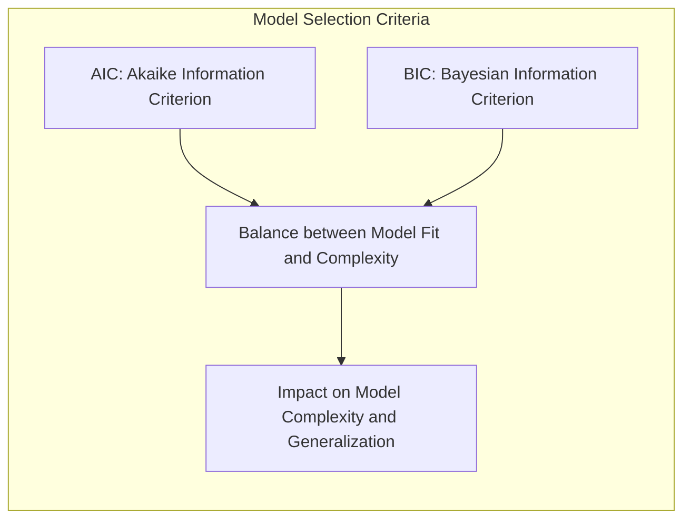
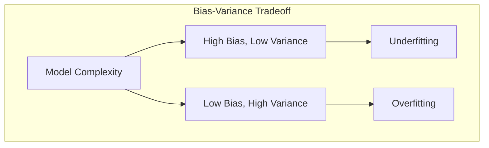
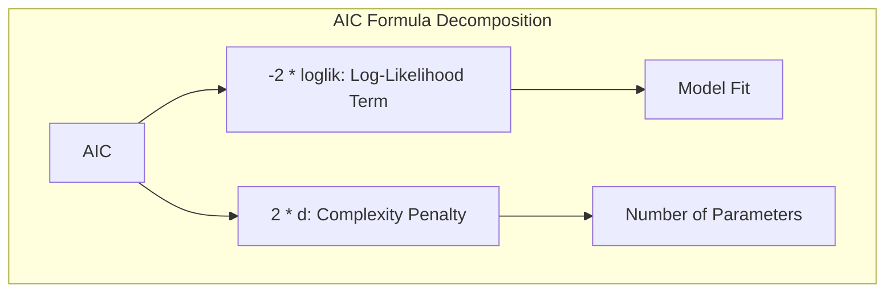
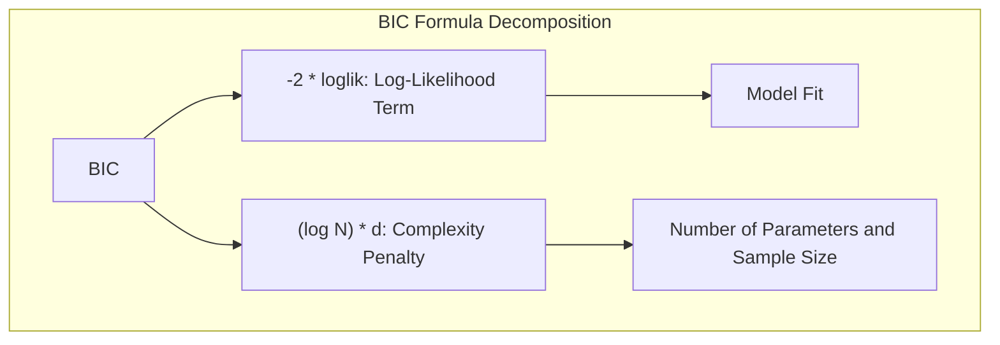
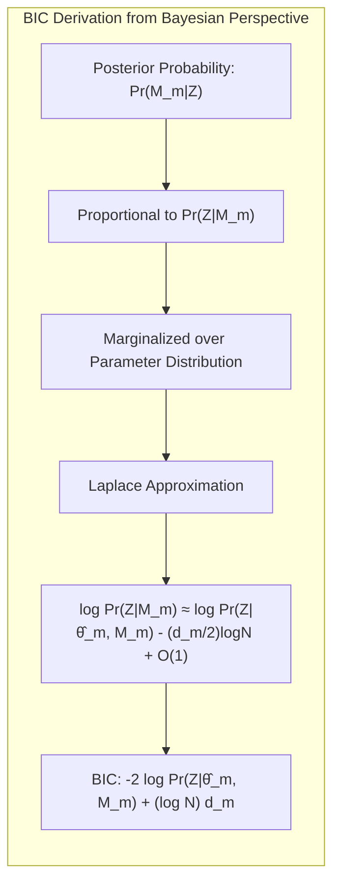
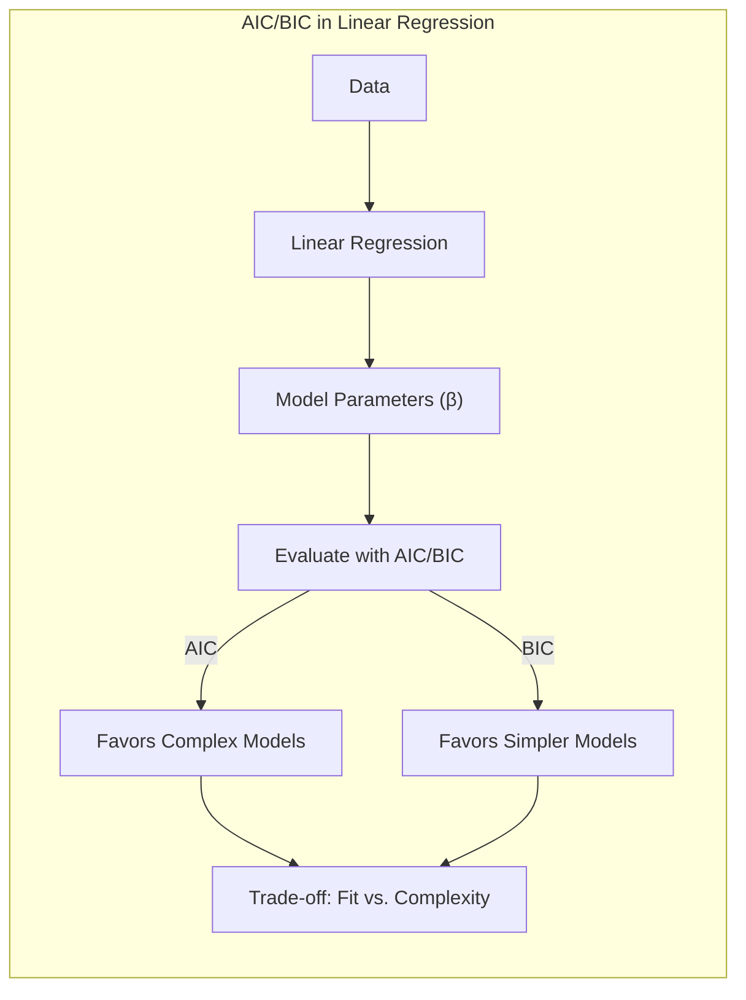
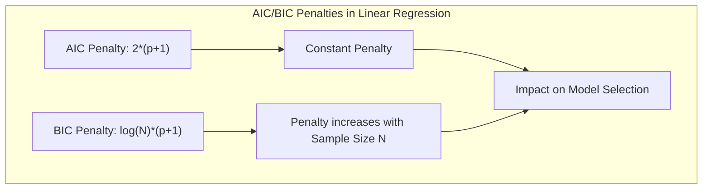
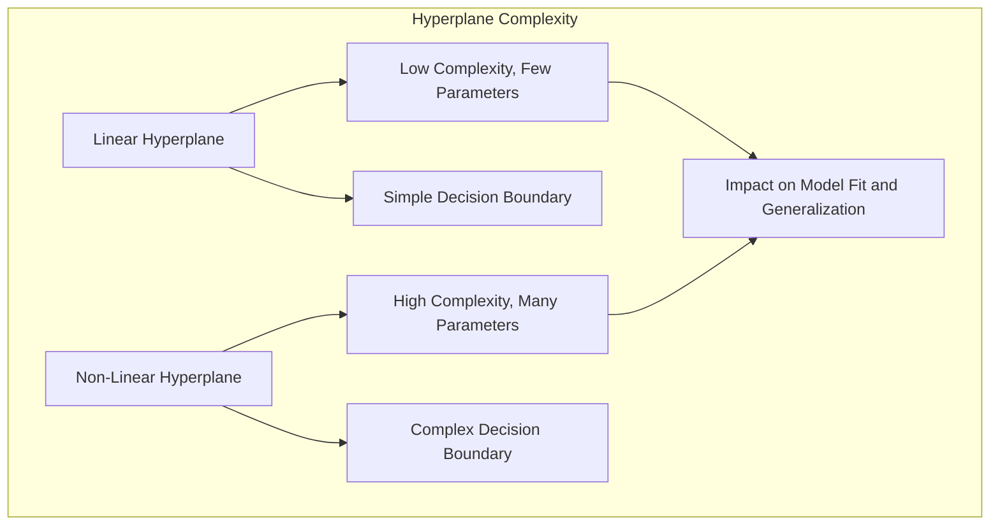
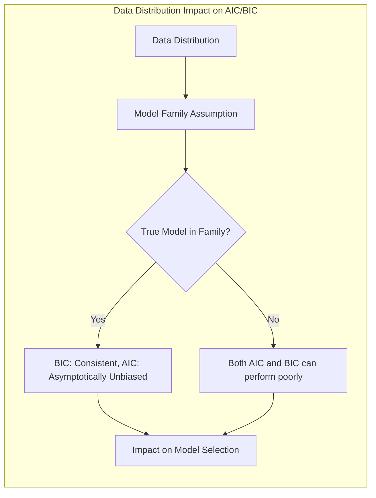
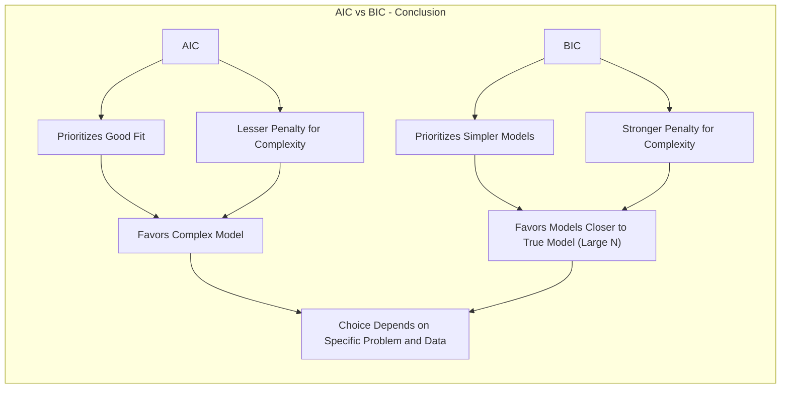

Okay, here's the revised text with all mathematical expressions formatted using LaTeX notation, and currency symbols escaped:

## Model Selection: A Detailed Comparison Between BIC and AIC

### Introdução
A escolha de um modelo adequado é um passo crítico em qualquer análise de dados. Tanto o **Akaike Information Criterion (AIC)** quanto o **Bayesian Information Criterion (BIC)** são ferramentas amplamente utilizadas para a seleção de modelos estatísticos. Eles oferecem abordagens distintas para estimar a qualidade de um modelo, equilibrando a complexidade do modelo e seu ajuste aos dados [^7.1]. Este capítulo explora em detalhes os fundamentos teóricos, as derivações e as diferenças práticas entre AIC e BIC, extraindo informações detalhadas das seções do texto [^7.7] e [^7.8].

### Conceitos Fundamentais

**Conceito 1: Generalização e Complexidade do Modelo:** A capacidade de um modelo de generalizar a novos dados (não vistos) é uma medida crucial de seu desempenho. Modelos mais complexos, embora possam ajustar-se perfeitamente aos dados de treinamento, podem sofrer de overfitting, generalizando mal. A seção [^7.2] detalha essa relação entre viés, variância e complexidade do modelo. Os modelos mais complexos tendem a ter um viés menor, mas uma variância mais alta, e modelos mais simples tendem a ter um viés maior, mas uma variância menor. Encontrar o equilíbrio ideal é o objetivo da seleção de modelos.

**Lemma 1:** O ajuste de um modelo aos dados de treinamento, medido pelo log-likelihood, melhora à medida que a complexidade do modelo aumenta. No entanto, modelos mais complexos também se ajustam melhor ao ruído nos dados de treinamento. Este é o problema de overfitting, que resulta em uma má generalização para novos dados. Como mostrado em [^7.2], o erro de treinamento (training error) é uma medida inadequada para o erro de teste (test error), pois o erro de treinamento continua a diminuir com a complexidade do modelo, mas o erro de teste não.

**Conceito 2: AIC - Akaike Information Criterion:** O AIC é uma medida da qualidade relativa de um modelo estatístico para um dado conjunto de dados. O AIC penaliza modelos mais complexos, adicionando um termo proporcional ao número de parâmetros do modelo [^7.5]. A formulação do AIC é dada por:
$$ AIC = -2 \cdot loglik + 2 \cdot d $$
onde $loglik$ é o log-likelihood do modelo e $d$ é o número de parâmetros do modelo. Conforme detalhado em [^7.5], o termo $2 \cdot d$ busca adicionar um aumento que corresponda à quantidade de "optimismo" em relação ao ajuste com os dados de treinamento, para um ajuste não viciado para os dados de teste.
O AIC é amplamente utilizado para comparação de modelos em diversos contextos, especialmente quando se busca um bom tradeoff entre o ajuste do modelo e sua complexidade.

> 💡 **Exemplo Numérico:** Imagine que você está comparando dois modelos para prever o preço de casas. O Modelo 1 tem 3 parâmetros (intercepto e dois preditores) e um log-likelihood de -500. O Modelo 2 tem 5 parâmetros e um log-likelihood de -480.
>
> Calculando o AIC para cada modelo:
>  $\\text{AIC}_{\\text{Modelo 1}} = -2 \cdot (-500) + 2 \cdot 3 = 1000 + 6 = 1006$
>  $\\text{AIC}_{\\text{Modelo 2}} = -2 \cdot (-480) + 2 \cdot 5 = 960 + 10 = 970$
>
>  Nesse caso, o Modelo 2 tem um AIC menor e, portanto, é preferível segundo o critério AIC, mesmo com mais parâmetros. Isso ilustra como o AIC busca um bom ajuste aos dados, penalizando a complexidade, mas não de forma tão severa quanto o BIC.

**Corolário 1:** Conforme discutido em [^7.5], para modelos Gaussianos com variância $\sigma^2$ conhecida, o AIC se torna equivalente ao $C_p$ statistic, onde $C_p = err + 2 \cdot d \cdot \frac{\sigma^2}{N}$. Nesse contexto, $err$ é o erro de treinamento e $N$ é o número de amostras. Ambos, AIC e $C_p$, penalizam modelos que utilizam um número maior de parâmetros, mas o AIC possui uma aplicabilidade maior, pois utiliza o log-likelihood ao invés do erro quadrático.

**Conceito 3: BIC - Bayesian Information Criterion:** O BIC é derivado de uma perspectiva Bayesiana e tenta aproximar a probabilidade posterior de um modelo, dados os dados observados. O BIC penaliza modelos mais complexos mais fortemente que o AIC. A fórmula do BIC é:

$$ BIC = -2 \cdot loglik + (\log N) \cdot d $$
onde $N$ é o tamanho da amostra. A penalidade por complexidade do modelo no BIC é dada por $(\log N) \cdot d$, que cresce mais rapidamente com $N$ do que a penalidade de $2 \cdot d$ do AIC [^7.7].

> 💡 **Exemplo Numérico:** Usando os mesmos Modelos 1 e 2 do exemplo anterior, vamos calcular o BIC. Suponha que o tamanho da amostra (N) seja 100.
>
> $\text{BIC}_{\text{Modelo 1}} = -2 \cdot (-500) + (\log 100) \cdot 3 = 1000 + (4.605) \cdot 3 \approx 1000 + 13.815 = 1013.815$
>
> $\text{BIC}_{\text{Modelo 2}} = -2 \cdot (-480) + (\log 100) \cdot 5 = 960 + (4.605) \cdot 5 \approx 960 + 23.025 = 983.025$
>
> Nesse caso, o Modelo 2 ainda é preferível segundo o BIC. No entanto, se aumentarmos o tamanho da amostra, a penalidade para complexidade do BIC se torna maior. Vamos supor que N = 1000
>
> $\text{BIC}_{\text{Modelo 1}} = -2 \cdot (-500) + (\log 1000) \cdot 3 = 1000 + (6.908) \cdot 3 \approx 1000 + 20.724 = 1020.724$
>
> $\text{BIC}_{\text{Modelo 2}} = -2 \cdot (-480) + (\log 1000) \cdot 5 = 960 + (6.908) \cdot 5 \approx 960 + 34.540 = 994.540$
>
> O BIC ainda favorece o modelo 2, mas a diferença entre os modelos diminuiu. Se a amostra fosse ainda maior, em algum momento o BIC começaria a favorecer o Modelo 1, ao penalizar modelos com maior complexidade. Isso demonstra como o BIC favorece modelos mais simples com um maior número de amostras.

### Derivação Teórica e Comparação

A penalidade do BIC, $(\log N) \cdot d$, é derivada a partir de uma aproximação da probabilidade posterior do modelo, dada uma amostra de dados $Z$. A seção [^7.7] detalha o processo da derivação bayesiana, onde  $Pr(M_m|Z)$ é a probabilidade posterior do modelo $M_m$, onde se assume um prior uniforme em relação aos modelos. A probabilidade posterior, $Pr(M_m|Z)$, é proporcional a $Pr(Z|M_m)$, que é marginalizada sobre a distribuição do parâmetro $\theta_m$. Uma aproximação de Laplace para essa integral resulta na expressão:

$$ \log Pr(Z|M_m) =  \log Pr(Z|\hat\theta_m, M_m) - \frac{d_m}{2} \log N + O(1) $$

onde $\hat\theta_m$ é a estimativa de máxima verossimilhança dos parâmetros do modelo $M_m$ e $d_m$ é o número de parâmetros do modelo. O BIC, conforme descrito em [^7.7], é derivado ao multiplicarmos por -2 e ignorarmos o termo $O(1)$, resultando em:

$$ BIC = -2 \log Pr(Z|\hat\theta_m, M_m) + (\log N) d_m $$

Em comparação com o AIC, a penalização do BIC por complexidade do modelo aumenta à medida que o tamanho da amostra aumenta. Portanto, BIC tende a favorecer modelos mais simples em comparação com o AIC, principalmente em conjuntos de dados maiores [^7.7]. O AIC, por outro lado, busca obter o melhor ajuste para os dados de treinamento, independentemente da complexidade do modelo, resultando em uma tendencia de modelos mais complexos [^7.8].

### Regressão Linear e Mínimos Quadrados: Uma Perspectiva AIC/BIC

**Explicação:** Este diagrama ilustra como o AIC e o BIC influenciam a escolha de modelos na regressão linear. O AIC tende a favorecer modelos mais complexos, enquanto o BIC favorece modelos mais simples.

Ao aplicar regressão linear, tanto AIC quanto BIC avaliam o balanceamento entre o ajuste aos dados de treinamento e a complexidade do modelo [^7.2]. Na perspectiva de mínimos quadrados, o termo $loglik$ do AIC e BIC se torna equivalente ao erro quadrático médio (mean squared error) e um termo referente ao número de parâmetros do modelo ($d$). O AIC e BIC tentam minimizar o erro preditivo, selecionando modelos que maximizem o ajuste com os dados, mas que também penalizem modelos que se tornem complexos demais [^7.5].
**Lemma 2:** Ao aplicar a regressão linear, os parâmetros do modelo ($\beta$) são estimados usando mínimos quadrados, e a complexidade do modelo está relacionada ao número de parâmetros incluídos no modelo. Para um modelo linear ajustado utilizando mínimos quadrados, o AIC pode ser expresso como:
$$AIC = N \cdot log(MSE) + 2 \cdot (p+1)$$
onde $N$ é o número de amostras, $MSE$ é o erro quadrático médio e $p$ é o número de preditores. Similarmente, o BIC pode ser expresso como:
$$BIC = N \cdot log(MSE) + log(N) \cdot (p+1)$$
**Corolário 2:** A diferença entre AIC e BIC na regressão linear reside na forma com que penalizam a complexidade. O AIC impõe uma penalidade mais branda, preferindo modelos com um $MSE$ ligeiramente menor mesmo que tenham um número maior de parâmetros, enquanto o BIC penaliza a complexidade do modelo de forma mais rigorosa, preferindo modelos mais simples com um $MSE$ comparável. Modelos com muitos preditores, usando AIC, podem apresentar overfitting, enquanto modelos com menos preditores, usando BIC, podem apresentar underfitting, dependendo da base de dados.

> 💡 **Exemplo Numérico:** Considere um modelo de regressão linear com 100 amostras. O Modelo A tem 3 preditores e um MSE de 10, enquanto o Modelo B tem 6 preditores e um MSE de 8.
>
> Calculando o AIC:
> $\text{AIC}_{\text{Modelo A}} = 100 \cdot \log(10) + 2 \cdot (3+1) \approx 100 \cdot 2.30 + 8 = 230 + 8 = 238$
> $\text{AIC}_{\text{Modelo B}} = 100 \cdot \log(8) + 2 \cdot (6+1) \approx 100 \cdot 2.07 + 14 = 207 + 14 = 221$
>
> Calculando o BIC:
> $\text{BIC}_{\text{Modelo A}} = 100 \cdot \log(10) + \log(100) \cdot (3+1) \approx 230 + 4.605 \cdot 4 \approx 230 + 18.42 = 248.42$
> $\text{BIC}_{\text{Modelo B}} = 100 \cdot \log(8) + \log(100) \cdot (6+1) \approx 207 + 4.605 \cdot 7 \approx 207 + 32.235 = 239.235$
>
> Neste exemplo, o AIC prefere o Modelo B, que tem um MSE menor e mais parâmetros, enquanto o BIC também prefere o Modelo B, mas a diferença entre os valores é menor. Se o número de amostras aumentasse, o BIC tenderia a favorecer modelos mais simples.

### Métodos de Seleção de Variáveis e Regularização

Em problemas de classificação, a escolha de variáveis relevantes e a regularização são cruciais para melhorar o desempenho de modelos. Métodos de regularização, como L1 e L2, adicionam penalidades à função de perda, que têm um impacto no BIC e no AIC. As seções [^7.6] e [^7.7] abordam como a complexidade do modelo é definida em contextos de regularização. A penalidade é dada pelo traço da matriz de projeção $S$, dado por $df(S)=trace(S)$.  Em modelos regularizados, a penalidade tanto do AIC, quanto do BIC, é dada pelo número efetivo de parâmetros $df(S)$ [^7.6], que pode ser derivado do conceito de effective degrees of freedom, conforme apresentado na seção [^7.6].
**Lemma 3:** A penalização L1, ao induzir esparsidade, tende a reduzir a complexidade do modelo tanto na perspectiva do AIC quanto do BIC. Os modelos regulares por L1, como o LASSO,  tendem a eliminar preditores irrelevantes, reduzindo o número efetivo de parâmetros do modelo. A escolha da força de regularização é guiada pelo AIC e/ou BIC, conforme apresentado em [^7.7].
**Corolário 3:** A penalização L2, como na regressão de ridge, reduz a magnitude dos coeficientes, o que também tem um impacto na complexidade do modelo. A penalização L2 não resulta em uma remoção de preditores, mas ao reduzir os parâmetros, reduz o número efetivo de parâmetros $df(S)$ do modelo.  A força de regularização também é definida ao usar AIC ou BIC para selecionar o melhor modelo. Ao se adotar o BIC, o modelo com a força de regularização ideal é aquele que minimiza o BIC, o que tende a resultar em modelos mais simples do que o AIC.

> 💡 **Exemplo Numérico:** Vamos comparar modelos de regressão com regularização L1 (LASSO) e L2 (Ridge). Considere um modelo linear com 10 preditores inicialmente, e 100 amostras.
>
> *   **LASSO:** Com uma penalidade L1 (LASSO) forte ($\lambda_1$), o modelo elimina 5 preditores, resultando em um $df(S)$ efetivo de 5, com um $MSE$ de 12. Com uma penalidade mais branda ($\lambda_2$), o modelo elimina apenas 2 preditores, resultando em $df(S)$ de 8, com um $MSE$ de 10.
>  *   $\\text{AIC}_{\lambda_1} = 100 \cdot \log(12) + 2 \cdot (5+1) \approx 248.48 + 12 = 260.48$
>  *   $\\text{AIC}_{\lambda_2} = 100 \cdot \log(10) + 2 \cdot (8+1) \approx 230.25 + 18 = 248.25$
>  *   $\\text{BIC}_{\lambda_1} = 100 \cdot \log(12) + \log(100) \cdot (5+1) \approx 248.48 + 4.605 \cdot 6 \approx  248.48 + 27.63 = 276.11$
>  *   $\\text{BIC}_{\lambda_2} = 100 \cdot \log(10) + \log(100) \cdot (8+1) \approx 230.25 + 4.605 \cdot 9 \approx  230.25 + 41.445 = 271.695$
>
> *   **Ridge:** Com uma penalidade L2 (Ridge) forte, o modelo não elimina nenhum preditor, mas os coeficientes diminuem, resultando num $df(S)$ efetivo de 7, com um MSE de 11. Com uma penalidade L2 mais branda, o $df(S)$ é de 9, com MSE de 9.
>
>   *   $\\text{AIC}_{\\text{Ridge forte}} = 100 \cdot \log(11) + 2 \cdot (7+1) \approx 240 + 16 = 256$
>   *   $\\text{AIC}_{\\text{Ridge branda}} = 100 \cdot \log(9) + 2 \cdot (9+1) \approx 219.7 + 20 = 239.7$
>  *   $\\text{BIC}_{\\text{Ridge forte}} = 100 \cdot \log(11) + \log(100) \cdot (7+1) \approx 240 + 4.605 \cdot 8 \approx 240 + 36.84 = 276.84$
>  *   $\\text{BIC}_{\\text{Ridge branda}} = 100 \cdot \log(9) + \log(100) \cdot (9+1) \approx 219.7 + 4.605 \cdot 10 \approx 219.7 + 46.05 = 265.75$
>
>   O AIC prefere o LASSO com $\lambda_2$ (menor penalidade L1) e Ridge com penalidade branda, enquanto o BIC prefere LASSO com $\lambda_2$ e Ridge com penalidade branda. Isso demonstra que tanto AIC quanto BIC são afetados pelas penalidades L1 e L2, e a escolha entre eles depende do objetivo do modelo e do tamanho da amostra. Modelos com pouca regularização tendem a ter um erro melhor, enquanto modelos mais regularizados tendem a ser mais simples.

> ⚠️ **Ponto Crucial:** A escolha entre AIC e BIC em problemas de classificação e regressão regularizados depende do tamanho da amostra e da preferência entre modelos mais complexos (AIC) ou mais simples (BIC). Como indicado em [^7.7], o BIC é consistente para selecionar o modelo verdadeiro quando $N \to \infty$, o que não ocorre com o AIC.

###  Separating Hyperplanes e a Complexidade do Modelo

Em problemas de classificação, a escolha do hiperplano separador também tem um impacto no AIC e no BIC. A complexidade de um hiperplano linear, como discutido em [^7.8], é dada pelo número de parâmetros necessários para descrever sua equação. Hiperplanos lineares têm um número limitado de parâmetros, enquanto hiperplanos não lineares podem ter um número maior de parâmetros, que podem ser expressos em termos da VC dimension [^7.9].

Modelos com hiperplanos mais complexos tendem a se ajustar melhor aos dados de treinamento, mas podem sofrer de overfitting. O AIC e BIC desempenham um papel crucial na escolha do melhor hiperplano, penalizando modelos mais complexos para evitar o overfitting.

**Lemma 4:** A capacidade de um hiperplano de separar os dados está diretamente relacionada à sua complexidade. Hiperplanos lineares são menos complexos, enquanto hiperplanos não lineares podem ser altamente complexos, dada a sua VC dimension [^7.9]. A complexidade também está relacionada ao número de pontos que o modelo consegue shatter [^7.9].
**Corolário 4:** A escolha entre hiperplanos lineares e não lineares é guiada por métricas como AIC e BIC, que penalizam modelos complexos. Modelos com hiperplanos lineares e um número menor de parâmetros, mesmo que ofereçam um ajuste inferior aos dados de treinamento, podem ter um desempenho melhor com novos dados, ao evitarem o overfitting. Ao escolher o hiperplano separador, o AIC pode tender a um hiperplano com um ajuste melhor, mesmo que a um custo de complexidade maior.  Já o BIC tenderá a escolher hiperplanos mais simples, ao priorizar modelos com menor complexidade.

> 💡 **Exemplo Numérico:** Suponha que temos um problema de classificação binária com 100 amostras. Temos duas opções de modelos: um hiperplano linear (Modelo L) e um hiperplano não linear (Modelo NL). O Modelo L possui 3 parâmetros e um log-likelihood de -400. O Modelo NL possui 7 parâmetros e um log-likelihood de -350.
>
> Calculando o AIC:
> $\text{AIC}_{\text{Modelo L}} = -2 \cdot (-400) + 2 \cdot 3 = 800 + 6 = 806$
> $\text{AIC}_{\text{Modelo NL}} = -2 \cdot (-350) + 2 \cdot 7 = 700 + 14 = 714$
>
> Calculando o BIC:
> $\text{BIC}_{\text{Modelo L}} = -2 \cdot (-400) + \log(100) \cdot 3 = 800 + 4.605 \cdot 3 \approx 800 + 13.815 = 813.815$
> $\text{BIC}_{\text{Modelo NL}} = -2 \cdot (-350) + \log(100) \cdot 7 = 700 + 4.605 \cdot 7 \approx 700 + 32.235 = 732.235$
>
> Neste caso, o AIC e o BIC favorecem o modelo não linear, que teve um ajuste melhor aos dados de treinamento. Contudo, se tivéssemos um número maior de amostras, o BIC tenderia a favorecer o modelo linear, ao penalizar mais modelos complexos.

### Pergunta Teórica Avançada: Qual o impacto da distribuição dos dados no desempenho do AIC e do BIC?

**Resposta:**
A distribuição dos dados tem um impacto significativo no desempenho do AIC e BIC. Sob a premissa de que os dados são gerados por um modelo na família de modelos que está sendo comparada, o BIC é consistente, o que significa que, conforme o tamanho da amostra aumenta, o BIC seleciona o modelo verdadeiro com alta probabilidade. No entanto, se o modelo verdadeiro não estiver incluído na família de modelos considerados, tanto AIC quanto BIC podem ter um desempenho fraco. Além disso, se as premissas que justificam o BIC (como priors bayesianos) não forem válidas, o AIC pode ter um desempenho melhor.
**Lemma 5:** Sob condições de regularidade, o AIC é uma estimativa assintoticamente não viciada do erro preditivo, enquanto o BIC é uma estimativa consistente do modelo verdadeiro. Em outras palavras, o AIC tende a minimizar o erro preditivo, enquanto o BIC tende a selecionar o modelo verdadeiro à medida que o tamanho da amostra tende ao infinito [^7.7].
**Corolário 5:** Se a distribuição dos dados for tal que a suposição de que o modelo verdadeiro está na família de modelos for razoável, o BIC tenderá a selecionar o modelo correto para um tamanho de amostra grande. Por outro lado, se a distribuição dos dados não corresponde às suposições dos modelos, o AIC e o BIC podem selecionar modelos com base em medidas de ajuste, ao invés de modelos que correspondem à realidade.

> ❗ **Ponto de Atenção:** É importante notar que AIC e BIC não são medidas absolutas da qualidade de um modelo, mas sim medidas relativas da qualidade do modelo, dada uma determinada família de modelos.  Não são medidas que indicam a precisão de um modelo com relação à realidade, mas sim entre os modelos comparados.
> ✔️ **Destaque:** Ambos os métodos (AIC e BIC) são ferramentas úteis para comparar modelos, mas é importante entender suas diferenças e limitações. Em alguns cenários, a combinação dos dois métodos é uma boa solução, selecionando o modelo que possui o melhor desempenho nas duas métricas.

### Conclusão

Tanto AIC quanto BIC são métricas valiosas para seleção de modelos, mas suas abordagens e penalidades resultam em diferentes comportamentos em relação à complexidade do modelo. O AIC prioriza um bom ajuste para os dados de treinamento, utilizando penalidades mais brandas para a complexidade do modelo, enquanto o BIC prioriza modelos mais simples, com penalidades mais severas, com foco em um modelo que se aproxime mais da realidade com o aumento do tamanho da amostra. A escolha entre AIC e BIC deve ser guiada pelo problema específico, as características dos dados e o objetivo da modelagem. Em problemas de classificação e regressão, tanto AIC quanto BIC são capazes de selecionar modelos adequados, mas o BIC se torna mais relevante ao se ter um grande número de amostras, ao se aproximar da realidade.
<!-- END DOCUMENT -->
[^7.1]: "The generalization performance of a learning method relates to its predic- tion capability on independent test data. Assessment of this performance is extremely important in practice, since it guides the choice of learning method or model, and gives us a measure of the quality of the ultimately chosen model." *(Trecho de Model Assessment and Selection)*
[^7.2]: "Figure 7.1 illustrates the important issue in assessing the ability of a learn- ing method to generalize. Consider first the case of a quantitative or interval scale response. We have a target variable Y, a vector of inputs X, and a prediction model f(X) that has been estimated from a training set T." *(Trecho de Model Assessment and Selection)*
[^7.3]: "Test error, also referred to as generalization error, is the prediction error over an independent test sample" *(Trecho de Model Assessment and Selection)*
[^7.4]: "Training error is the average loss over the training sample" *(Trecho de Model Assessment and Selection)*
[^7.5]: "The methods described in the next section-Cp, AIC, BIC and others work in this way, for a special class of estimates that are linear in their parameters." *(Trecho de Model Assessment and Selection)*
[^7.6]: "The concept of 'number of parameters' can be generalized, especially to models where regularization is used in the fitting. Suppose we stack the outcomes Y1, Y2,..., yn into a vector y, and similarly for the predictions ŷ. Then a linear fitting method is one for which we can write ŷ = Sy," *(Trecho de Model Assessment and Selection)*
[^7.7]: "The Bayesian information criterion (BIC), like AIC, is applicable in settings where the fitting is carried out by maximization of a log-likelihood. The generic form of BIC is BIC = -2 loglik + (log N) · d." *(Trecho de Model Assessment and Selection)*
[^7.8]: "The minimum description length (MDL) approach gives a selection cri- terion formally identical to the BIC approach, but is motivated from an optimal coding viewpoint. We first review the theory of coding for data compression, and then apply it to model selection." *(Trecho de Model Assessment and Selection)*
[^7.9]: "The Vapnik-Chervonenkis (VC) theory provides such a general measure of complexity, and gives associated bounds on the optimism. Here we give a brief review of this theory." *(Trecho de Model Assessment and Selection)*
