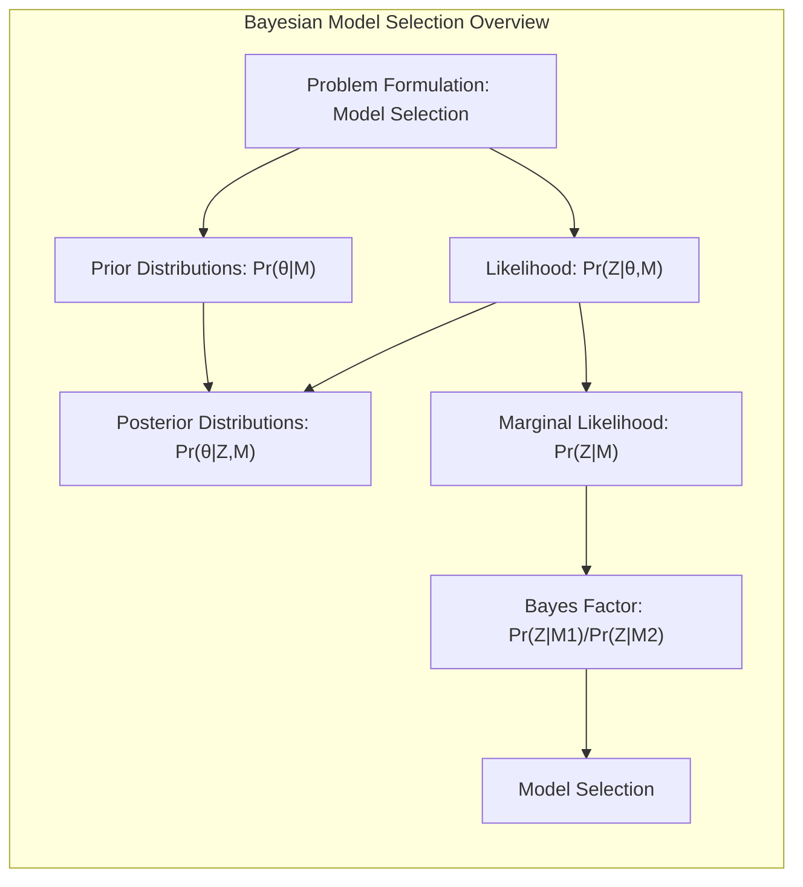
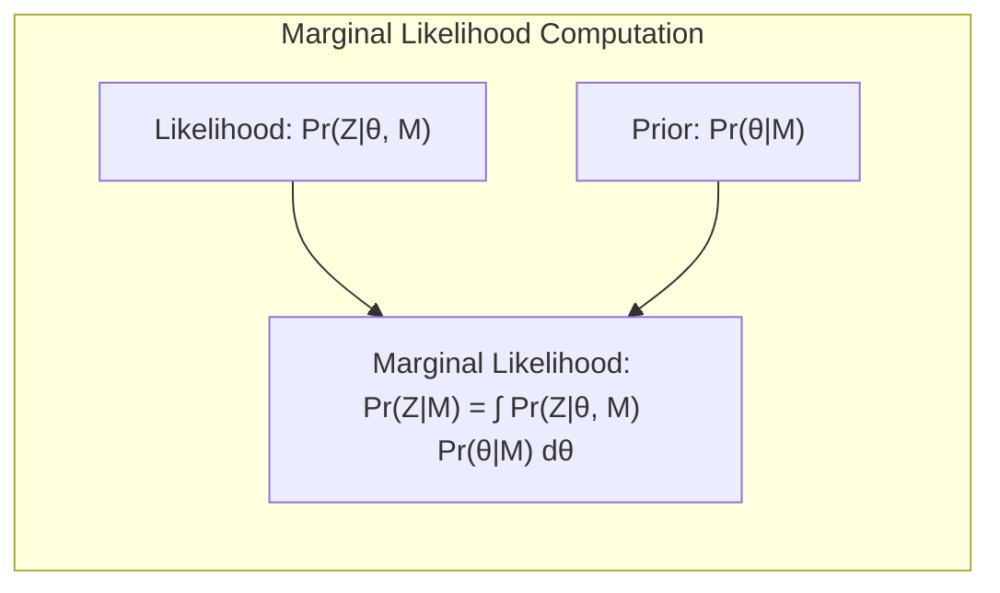
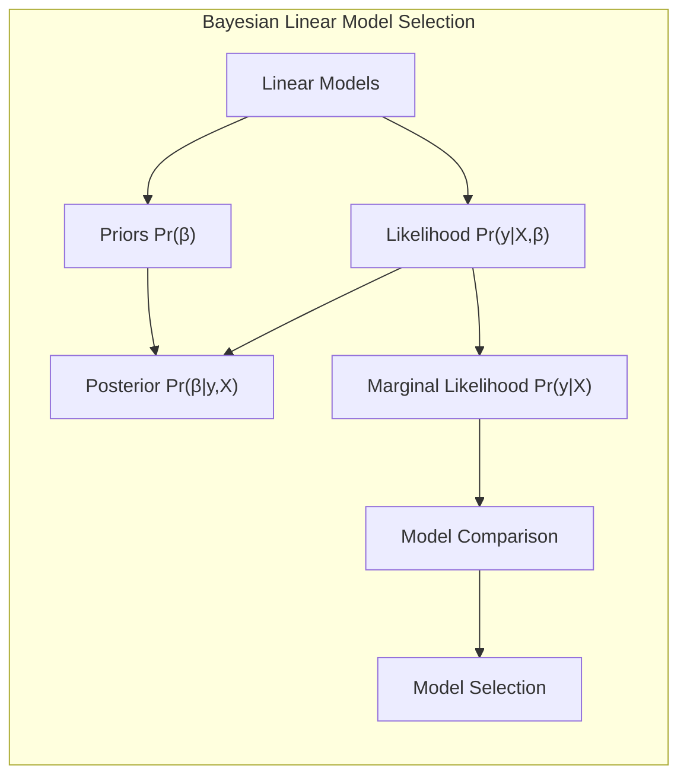
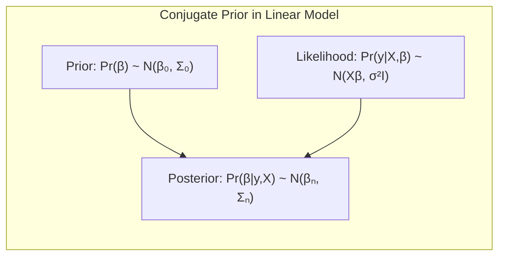
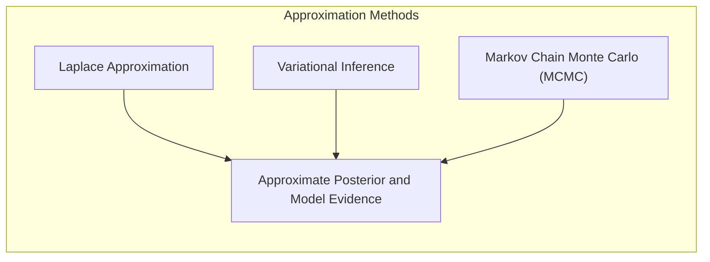
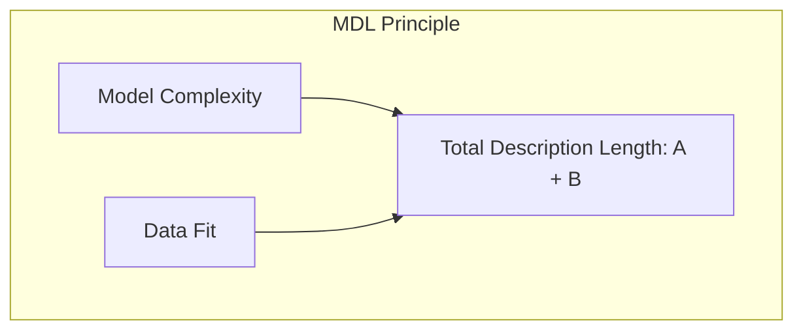
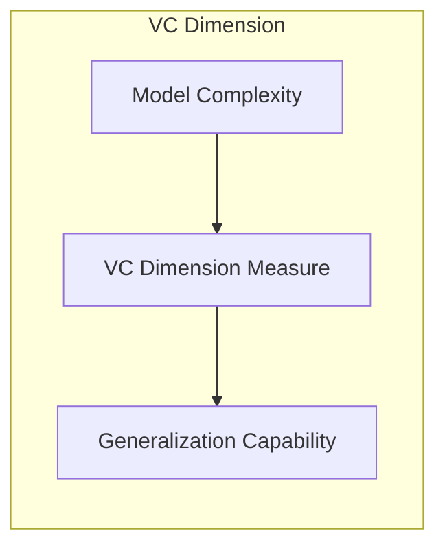

Okay, here's the enhanced text with added Mermaid diagrams, following your guidelines:

## Bayesian Model Selection

### Introdução
A seleção de modelos é um aspecto crucial na construção de modelos estatísticos e de machine learning. O objetivo é escolher o modelo que melhor equilibra a complexidade e a adequação aos dados, evitando o *overfitting* ou *underfitting*. Dentro desse contexto, a abordagem Bayesiana oferece uma estrutura sólida para lidar com a incerteza inerente ao processo de seleção de modelos. Ao contrário das abordagens frequentistas que se baseiam em estimativas pontuais, a abordagem Bayesiana utiliza distribuições de probabilidade para quantificar a incerteza sobre os parâmetros dos modelos e as próprias escolhas de modelos [^7.1]. Este capítulo explora os fundamentos e métodos da seleção de modelos Bayesiana, com foco em seus princípios teóricos e aplicações práticas.

### Conceitos Fundamentais
**Conceito 1:**  O problema de seleção de modelos Bayesianos é formulado como a busca pela melhor estrutura do modelo dentre um conjunto de modelos candidatos, dado um conjunto de dados. A abordagem Bayesiana trata os parâmetros do modelo como variáveis aleatórias, sobre as quais se define uma distribuição a priori. Os dados são utilizados para atualizar essa distribuição a priori para uma distribuição a posteriori, que quantifica a incerteza sobre os parâmetros após observar os dados [^7.7]. Modelos mais complexos (com mais parâmetros) são penalizados naturalmente pelo mecanismo Bayesiano, que prioriza modelos mais simples, a não ser que os dados forneçam uma forte evidência da necessidade de maior complexidade.

**Lemma 1:** *Seja  $M_m$ um modelo com parâmetros $\theta_m$ e $Z$ o conjunto de dados. A probabilidade a posteriori do modelo $M_m$ é proporcional ao produto da probabilidade a priori do modelo $Pr(M_m)$ e a verossimilhança marginal $Pr(Z|M_m)$*, ou seja:
$$
    Pr(M_m|Z) \propto Pr(M_m) \cdot Pr(Z|M_m)
$$
Essa é a base para a seleção de modelos Bayesiana: escolhemos o modelo que maximiza a probabilidade a posteriori, ou seja, o modelo que é mais plausível dados os dados observados e nossas crenças iniciais.

**Prova:** A demonstração segue diretamente do teorema de Bayes:
$$
    Pr(M_m|Z) = \frac{Pr(Z|M_m)Pr(M_m)}{Pr(Z)}
$$
Onde $Pr(Z)$ é a probabilidade marginal dos dados e é constante para todos os modelos, então a probabilidade a posteriori é proporcional a $Pr(M_m) \cdot Pr(Z|M_m)$. $\blacksquare$

**Conceito 2:** A **distribuição a priori**, *$Pr(\theta_m|M_m)$*, representa nossas crenças sobre os valores dos parâmetros de um modelo antes de observarmos os dados. As *prior distributions* podem ser informativas (baseadas em conhecimento prévio) ou não informativas (quando não se tem conhecimento prévio). A escolha da prior distribution afeta a distribuição a posteriori e, por consequência, a seleção do modelo. Uma escolha comum de prior distribution é usar distribuições Gaussianas ou Gamma, que permitem representar a incerteza sobre os parâmetros [^7.7].
> 💡 **Exemplo Numérico:** Suponha que estamos modelando a relação entre a altura e o peso de pessoas.  Para o coeficiente de inclinação (o quanto o peso aumenta por unidade de altura), podemos definir uma *prior* Gaussiana com média 0.7 e desvio padrão de 0.2, ou seja, $\beta \sim N(0.7, 0.2^2)$.  Esta *prior* representa nossa crença inicial de que o peso aumenta em torno de 0.7 unidades para cada unidade de altura, com uma incerteza quantificada pelo desvio padrão.  Se não tivéssemos conhecimento prévio, poderíamos usar uma *prior* menos informativa, com um desvio padrão maior, como por exemplo, $\beta \sim N(0, 1^2)$.

**Corolário 1:** A **verossimilhança marginal** *$Pr(Z|M_m)$*, também conhecida como evidência do modelo, é obtida pela integração da verossimilhança dos dados,  *$Pr(Z|\theta_m,M_m)$*, sobre a distribuição a priori dos parâmetros:
$$
    Pr(Z|M_m) = \int Pr(Z|\theta_m, M_m) Pr(\theta_m|M_m) \, d\theta_m
$$
 Essa integral pode ser difícil de calcular analiticamente, especialmente para modelos complexos, o que leva ao uso de métodos de aproximação [^7.7]. Métodos de aproximação como o **Laplace approximation** e o **Markov Chain Monte Carlo (MCMC)** são utilizados para obter estimativas da evidência do modelo.

**Conceito 3:** O **Bayes factor** é uma ferramenta fundamental na seleção de modelos Bayesianos, especialmente quando comparamos dois modelos. Ele é definido como a razão das verossimilhanças marginais de dois modelos, e quantifica a evidência dos dados em favor de um modelo em relação ao outro [^7.7]. *Se o Bayes factor for maior que um, os dados favorecem o modelo no numerador; se for menor que um, favorecem o modelo no denominador*. Matematicamente, dados dois modelos $M_m$ e $M_l$, o Bayes factor $BF(Z)$ é expresso como:
$$
    BF(Z) = \frac{Pr(Z|M_m)}{Pr(Z|M_l)}
$$
O Bayes factor é independente das priors dos modelos, desde que os dados sejam os mesmos.
> 💡 **Exemplo Numérico:** Considere dois modelos de regressão linear: $M_1$ (apenas uma variável preditora) e $M_2$ (duas variáveis preditoras). Após calcular a verossimilhança marginal para cada modelo, obtemos: $Pr(Z|M_1) = 0.02$ e $Pr(Z|M_2) = 0.06$. O Bayes factor é então $BF(Z) = \frac{0.06}{0.02} = 3$. Este resultado indica que os dados são 3 vezes mais prováveis sob o modelo $M_2$ do que sob o modelo $M_1$, fornecendo evidências a favor do modelo com duas variáveis preditoras.  Se, por outro lado, tivéssemos $Pr(Z|M_1) = 0.06$ e $Pr(Z|M_2) = 0.02$, então $BF(Z) = \frac{0.02}{0.06} \approx 0.33$, indicando que os dados favorecem o modelo $M_1$.

> ⚠️ **Nota Importante:**  A seleção de modelos Bayesianos não é apenas sobre escolher o melhor modelo, mas também sobre quantificar a incerteza sobre a escolha do modelo, *o que é uma das grandes vantagens da abordagem Bayesiana*. **Referência ao tópico [^7.7]**.
> ❗ **Ponto de Atenção:** O cálculo da verossimilhança marginal muitas vezes envolve integrais complexas, levando ao uso de métodos de aproximação, tais como o Laplace approximation ou MCMC, *que podem ser computacionalmente intensos*. **Conforme indicado em [^7.7]**.
> ✔️ **Destaque**: O Bayes factor permite comparar diretamente dois modelos, *quantificando a evidência dos dados em favor de um modelo em relação ao outro*. **Baseado no tópico [^7.7]**.

### Modelos Lineares e Seleção Bayesiana

A aplicação dos princípios Bayesianos em modelos lineares é uma área bem estabelecida, com diversas abordagens e técnicas para a seleção de modelos. Em modelos lineares, como regressão linear ou logística, a complexidade do modelo é geralmente controlada pelo número de variáveis preditoras ou pela inclusão de termos de interação ou polinômios. Na abordagem Bayesiana, a seleção de modelos lineares envolve a definição de distribuições a priori para os parâmetros do modelo, o cálculo da verossimilhança dos dados dado o modelo e a obtenção da distribuição a posteriori dos parâmetros.

**Lemma 2:** *Em um modelo linear da forma $y = X\beta + \epsilon$, com $\epsilon \sim N(0,\sigma^2)$,  a distribuição a priori conjugada para $\beta$ é uma Gaussiana. Ao utilizar essa prior conjugada, a distribuição a posteriori de $\beta$ também será uma Gaussiana, facilitando o cálculo da verossimilhança marginal.* [^7.7].

**Prova:** A *prior distribution* para $\beta$ é definida como $Pr(\beta) = N(\beta_0, \Sigma_0)$, onde $\beta_0$ é a média a priori e $\Sigma_0$ é a matriz de covariância a priori. A verossimilhança dos dados é dada por $Pr(y|X,\beta) = N(X\beta, \sigma^2I)$. Multiplicando a prior distribution pela verossimilhança e completando os quadrados, obtém-se que a distribuição a posteriori também é Gaussiana: $Pr(\beta|y,X) = N(\beta_n,\Sigma_n)$. Os detalhes da derivação completa podem ser consultados em livros de estatística Bayesiana. $\blacksquare$

**Corolário 2:** *O **Bayesian Information Criterion (BIC)**, também conhecido como Schwarz criterion, é uma aproximação da evidência do modelo para modelos onde a verossimilhança é obtida por meio de maximização de um log-likelihood. O BIC é definido como:*
$$
    BIC = -2 \cdot \text{loglik} + (\text{log} N) \cdot d
$$
*Onde  “loglik” é o log-likelihood maximizado, N é o tamanho da amostra e d é o número de parâmetros do modelo.* *O BIC penaliza modelos mais complexos, dando preferência a modelos mais simples a não ser que os dados forneçam uma forte evidência da necessidade de maior complexidade*. O BIC é uma aproximação assintótica da evidência do modelo, que funciona bem para grandes amostras [^7.7].
> 💡 **Exemplo Numérico:** Suponha que temos dois modelos de regressão linear:
> - Modelo 1 ($M_1$): $y = \beta_0 + \beta_1 x_1 + \epsilon$ (2 parâmetros)
> - Modelo 2 ($M_2$): $y = \beta_0 + \beta_1 x_1 + \beta_2 x_2 + \epsilon$ (3 parâmetros)
>
>  Ajustamos ambos os modelos a um conjunto de dados com tamanho $N = 100$. Após a maximização do log-likelihood, obtemos:
>  - Para $M_1$:  $\text{loglik}_1 = -150$
>  - Para $M_2$: $\text{loglik}_2 = -140$
>
>  Calculando o BIC para cada modelo:
>
> $\text{BIC}_1 = -2 \cdot (-150) + \log(100) \cdot 2 = 300 + 4.605 \cdot 2 \approx 309.21$
> $\text{BIC}_2 = -2 \cdot (-140) + \log(100) \cdot 3 = 280 + 4.605 \cdot 3 \approx 293.82$
>
>  O BIC para o modelo $M_2$ (293.82) é menor que o BIC para o modelo $M_1$ (309.21). Assim, o BIC favorece o modelo $M_2$ neste caso, indicando que a inclusão da segunda variável preditora justificou o aumento na complexidade, pois houve uma melhora na adequação aos dados que compensou a penalização por adicionar um parâmetro.
>
> Se, por outro lado, tivéssemos  $\text{loglik}_2 = -145$, então:
>
> $\text{BIC}_2 = -2 \cdot (-145) + \log(100) \cdot 3 = 290 + 4.605 \cdot 3 \approx 303.82$
>
> Neste caso, o BIC favoreceria o modelo $M_1$, por ser o modelo mais simples que apresenta uma adequação aos dados razoável.

**Comparação e Limitações:**
"Em modelos lineares, podemos calcular o Bayes factor explicitamente ou usar aproximações como o BIC ou o MDL, *que são especialmente úteis para modelos complexos ou quando o cálculo da verossimilhança marginal é difícil*, conforme discutido em [^7.7]." "No entanto, em modelos com distribuições a priori não conjugadas ou com estruturas complexas, métodos computacionais como MCMC são necessários para a obtenção de amostras da distribuição a posteriori e para a aproximação da evidência do modelo. O uso do BIC pode levar a uma seleção de modelos muito parcimoniosa, e modelos com um número maior de parâmetros podem ter um *performance* melhor do ponto de vista preditivo, mesmo não sendo selecionados pelo BIC."

### Métodos de Aproximação e Seleção de Modelos Bayesianos

Em modelos complexos, o cálculo exato da verossimilhança marginal (evidência do modelo) é geralmente intratável, o que leva à necessidade de métodos de aproximação.  Esses métodos visam obter estimativas da distribuição a posteriori e da evidência do modelo sem a necessidade de calcular integrais complexas.  Os métodos mais comumente utilizados são: **Laplace approximation, Variational Inference e Markov Chain Monte Carlo (MCMC)**.

**Lemma 3:** A **Laplace approximation** utiliza uma aproximação Gaussiana centrada no modo da distribuição a posteriori (MAP) para aproximar a distribuição a posteriori. A aproximação de Laplace usa a segunda derivada (Hessiana) da função de log-verossimilhança para calcular a covariância da gaussiana que aproxima a posterior. Em modelos lineares com prior conjugada a aproximação é exata [^7.7].

**Prova:** A aproximação de Laplace se baseia numa expansão de Taylor da log-posterior em torno de seu máximo ($\hat{\theta}_{MAP}$). Dado $l(\theta) = \log[Pr(Z|\theta, M)Pr(\theta|M)]$, onde $Z$ é o conjunto de dados, e  $Pr(\theta|M)$  a distribuição a priori, a aproximação de Taylor de segunda ordem de  $l(\theta)$  em torno de  $\hat{\theta}_{MAP}$  é:
$$
l(\theta) \approx l(\hat{\theta}_{MAP}) + \frac{1}{2}(\theta - \hat{\theta}_{MAP})^T H(\theta - \hat{\theta}_{MAP})
$$
Onde $H$ é a Hessiana de  $l(\theta)$  em  $\hat{\theta}_{MAP}$.  Exponenciando ambos os lados, chegamos a uma aproximação Gaussiana da posterior com média  $\hat{\theta}_{MAP}$  e covariância   $-H^{-1}$.  $\blacksquare$
> 💡 **Exemplo Numérico:** Suponha que temos um modelo de regressão logística e, após calcular a log-posterior, encontramos que o valor dos parâmetros que maximizam a posterior (MAP) é $\hat{\theta}_{MAP} = [1.2, -0.5]$. Ao calcular a Hessiana da log-posterior no MAP, obtivemos:
>
> $ H = \begin{bmatrix} -2 & 0.5 \\ 0.5 & -1 \end{bmatrix} $
>
> A matriz de covariância da aproximação Gaussiana será a inversa da Hessiana multiplicada por -1:
>
> $ -H^{-1} =  \begin{bmatrix} 0.67 & 0.33 \\ 0.33 & 1.33 \end{bmatrix}$
>
> A aproximação de Laplace da distribuição a posteriori é então uma distribuição Gaussiana com média $\hat{\theta}_{MAP} = [1.2, -0.5]$ e matriz de covariância  $-H^{-1}$. Essa aproximação nos permite obter uma estimativa da distribuição a posteriori sem ter que calcular integrais complexas.

**Corolário 3:** *O **Minimum Description Length (MDL)**, do ponto de vista de *coding theory*, leva a um critério de seleção de modelos que coincide com o BIC, *que se conecta com a perspectiva bayesiana* [^7.8].  O MDL busca o modelo que minimiza o comprimento total da mensagem, que inclui o comprimento para codificar os parâmetros do modelo e o comprimento para codificar os dados dado o modelo.

**MCMC:** Os métodos MCMC são uma classe de algoritmos que simulam amostras da distribuição a posteriori, permitindo a estimação de diversas propriedades da mesma. Algoritmos como o **Gibbs sampling** e o **Metropolis-Hastings** são amplamente utilizados na inferência Bayesiana para modelos complexos [^7.7]. O uso de MCMC permite evitar a complexidade de integrais complexas. Métodos variacionais também são usados para aproximar a posterior e a evidência de modelo.
> 💡 **Exemplo Numérico:** Imagine que estamos modelando a distribuição de tempos de espera em uma fila usando um modelo exponencial, onde o parâmetro $\lambda$ é desconhecido.  Devido à complexidade da integral da verossimilhança marginal, optamos por usar MCMC para amostrar da distribuição posterior de $\lambda$. Definimos uma *prior* Gamma para $\lambda$. Executando o algoritmo MCMC (e.g., Metropolis-Hastings), obtemos uma cadeia de amostras de $\lambda$ que representam sua distribuição posterior. Após um período de *burn-in*, podemos calcular a média e a variância dessas amostras para obter estimativas pontuais e quantificar a incerteza sobre $\lambda$, ou seja, após simularmos, por exemplo, 1000 amostras de $\lambda$, podemos calcular a média dessas 1000 amostras para obter uma estimativa da média da posterior e o desvio padrão para quantificar a incerteza. Adicionalmente, podemos estimar a probabilidade dos dados dado o modelo, calculando a média da verossimilhança dos dados nas amostras da posterior.

> ⚠️ **Ponto Crucial:** A Laplace approximation é computacionalmente mais eficiente do que MCMC, *mas pode não ser precisa para distribuições a posteriori não-Gaussianas*. **Conforme discutido em [^7.7]**.
> ❗ **Ponto de Atenção:** O MDL, *enquanto uma ferramenta baseada em teoria de codificação*, leva a critérios assintóticos de seleção de modelos idênticos ao BIC, *estabelecendo uma conexão entre as duas abordagens*. **Baseado em [^7.8]**.
> ✔️ **Destaque**:  MCMC é capaz de lidar com problemas que envolvem modelos complexos, *mas possui um custo computacional elevado*, em comparação com aproximações como a Laplace approximation. **Referência ao tópico [^7.7]**.

### Vapnik-Chervonenkis (VC) Dimension e Seleção Bayesiana

A *Vapnik-Chervonenkis (VC) dimension* é uma medida de complexidade de uma classe de funções, que tem implicações na capacidade de generalização de um modelo. A teoria de VC estabelece limites para a capacidade de generalização de um modelo em termos de sua VC dimension e o tamanho da amostra. Na seleção de modelos Bayesiana, a VC dimension pode ser usada como uma ferramenta para quantificar a complexidade de um modelo, *mas não é uma medida diretamente associada com os parâmetros de uma distribuição posterior*.

**Pergunta Teórica Avançada:** Como a VC dimension se relaciona com a penalização da complexidade em modelos Bayesianos?

**Resposta:** Embora a VC dimension e o conceito de penalização em métodos Bayesiano sejam diferentes, ambos buscam controlar a complexidade do modelo para evitar overfitting. *A VC dimension é uma propriedade da classe de funções, enquanto a penalização Bayesiana se relaciona com as prior distributions e a verossimilhança marginal*. A VC dimension fornece limites teóricos sobre a capacidade de um modelo generalizar a partir de um certo número de dados, enquanto a penalização Bayesiana é uma abordagem prática para equilibrar complexidade e adequação aos dados, penalizando modelos mais complexos, a não ser que os dados justifiquem [^7.9]. Embora a VC dimension seja uma medida *intrínseca* de complexidade do modelo, ela é uma medida *combinatória*, enquanto o BIC usa uma medida *paramétrica*.

**Lemma 4:** *A VC dimension de uma classe de funções {f(x,a)} é definida como o maior número de pontos que podem ser "shattered" por membros dessa classe. Um conjunto de pontos é dito "shattered" se, para qualquer atribuição binária aos pontos, existe um membro da classe de funções que separa os pontos com rótulos diferentes*. O conceito de shattered points está intimamente ligado à capacidade de memorização e complexidade do modelo.
> 💡 **Exemplo Numérico:** Considere a classe de funções de classificação em 1D que consistem em intervalos $[a, \infty)$. Um único ponto pode ser "shattered" por essa classe, pois podemos atribuir a esse ponto o rótulo 0, com o intervalo sendo $[+\infty, \infty)$ ou o rótulo 1 com o intervalo sendo $[-\infty, \infty)$. No entanto, dois pontos não podem ser "shattered", pois não é possível encontrar um intervalo $[a, \infty)$ que separe um ponto com rótulo 0 e outro com rótulo 1 quando o ponto com rótulo 0 é menor do que o ponto com rótulo 1. Assim, a VC dimension dessa classe de funções é 1. Um exemplo com 2 dimensões seria a classe de funções que consiste em retas no plano. Nesse caso, podemos mostrar que 3 pontos em configuração não-colinear podem ser shattered, mas 4 pontos não. Portanto, a VC dimension de retas no plano é 3.

**Corolário 4:** A VC dimension é uma medida teórica da capacidade de um modelo se ajustar a dados de treinamento. A escolha de um modelo muito complexo (alta VC dimension) pode resultar em overfitting, enquanto um modelo muito simples pode resultar em underfitting [^7.9]. Embora a VC dimension e a penalização Bayesiana atuem de formas diferentes, elas estão relacionadas na busca por generalização e na prevenção do overfitting. Os métodos Bayesiano, como o BIC e MDL, também podem ser vistos como métodos que tentam modelar a complexidade do modelo.

> ⚠️ **Ponto Crucial:** A VC dimension é uma medida teórica da complexidade de uma classe de funções e não é um conceito inerente ao processo bayesiano. **Referência ao tópico [^7.9]**.
> ❗ **Ponto de Atenção:**  Modelos com alta VC dimension podem apresentar overfitting, mas isso não significa que sejam necessariamente ruins, *já que modelos com menor VC dimension também podem underfittar*. **Baseado em [^7.9]**.
> ✔️ **Destaque:**  Embora a VC dimension e o BIC sejam formas distintas de quantificar a complexidade de um modelo, *ambas as medidas se conectam com a noção de capacidade de generalização e prevenção de overfitting*. **Conforme discutido em [^7.9]**.

### Conclusão

A seleção de modelos Bayesianos oferece uma abordagem rigorosa e flexível para a escolha de modelos estatísticos e de machine learning. Por meio da utilização de distribuições a priori, da verossimilhança marginal e de ferramentas como o Bayes factor, a abordagem Bayesiana permite quantificar a incerteza sobre a escolha do modelo e integrar conhecimento prévio. Métodos como o BIC, MDL, Laplace approximation e MCMC são utilizados para lidar com as dificuldades computacionais inerentes à seleção de modelos. Embora a VC dimension seja uma medida importante da complexidade de uma classe de funções, ela se conecta com o conceito de penalização de complexidade em métodos Bayesianos. A seleção Bayesiana de modelos não deve ser vista como a busca por um único melhor modelo, mas sim como um processo que permite avaliar múltiplos modelos, quantificar incertezas, e escolher modelos que melhor equilibram a adequação e a complexidade.

### Footnotes
[^7.1]: *“The generalization performance of a learning method relates to its prediction capability on independent test data. Assessment of this performance is extremely important in practice, since it guides the choice of learning method or model, and gives us a measure of the quality of the ultimately chosen model.”* *(Trecho de Model Assessment and Selection)*
[^7.2]: *“Figure 7.1 illustrates the important issue in assessing the ability of a learning method to generalize.”* *(Trecho de Model Assessment and Selection)*
[^7.3]: *“Test error, also referred to as generalization error, is the prediction error over an independent test sample”* *(Trecho de Model Assessment and Selection)*
[^7.4]:  *“Training error is the average loss over the training sample”* *(Trecho de Model Assessment and Selection)*
[^7.5]:  *“The quantity -2 × the log-likelihood is sometimes referred to as the deviance.”* *(Trecho de Model Assessment and Selection)*
[^7.6]: *“In this chapter we describe a number of methods for estimating the expected test error for a model.”* *(Trecho de Model Assessment and Selection)*
[^7.7]:  *“The Bayesian information criterion (BIC), like AIC, is applicable in settings where the fitting is carried out by maximization of a log-likelihood. The generic form of BIC is BIC = -2loglik + (log N) d. The BIC statistic (times 1/2) is also known as the Schwarz criterion”* *(Trecho de Model Assessment and Selection)*
[^7.8]: *“The minimum description length (MDL) approach gives a selection criterion formally identical to the BIC approach, but is motivated from an optimal coding viewpoint.”* *(Trecho de Model Assessment and Selection)*
[^7.9]: *“The Vapnik-Chervonenkis dimension is a way of measuring the complexity of a class of functions by assessing how wiggly its members can be.”* *(Trecho de Model Assessment and Selection)*

<!-- END DOCUMENT -->
