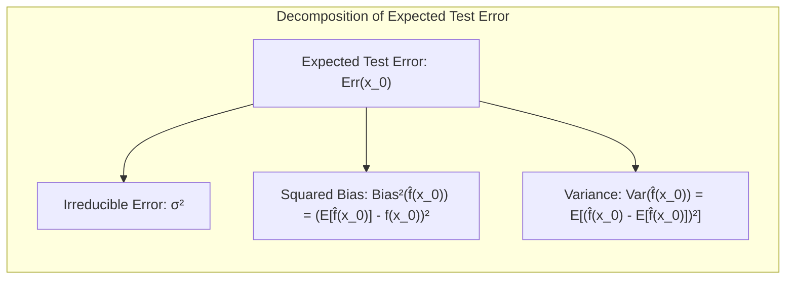
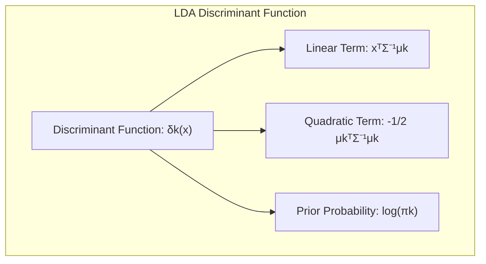
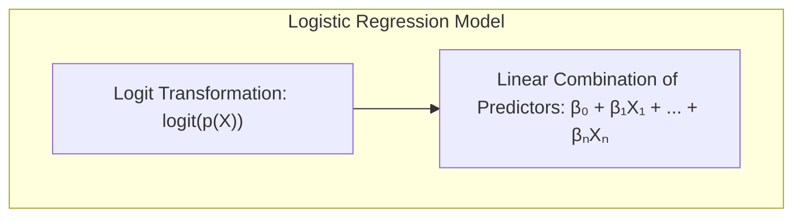
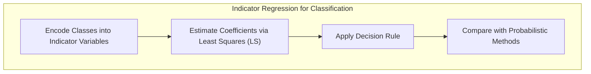
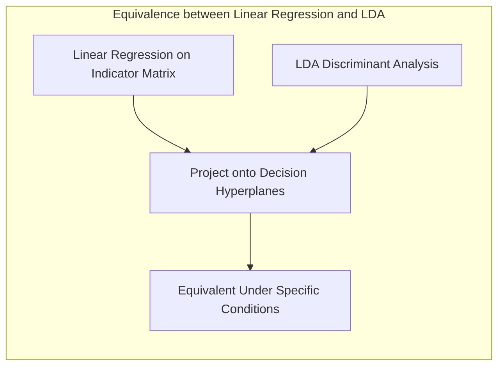
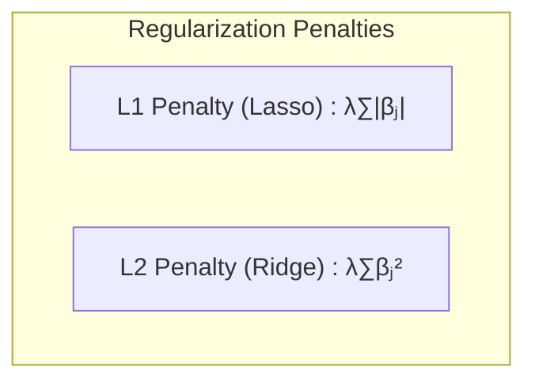
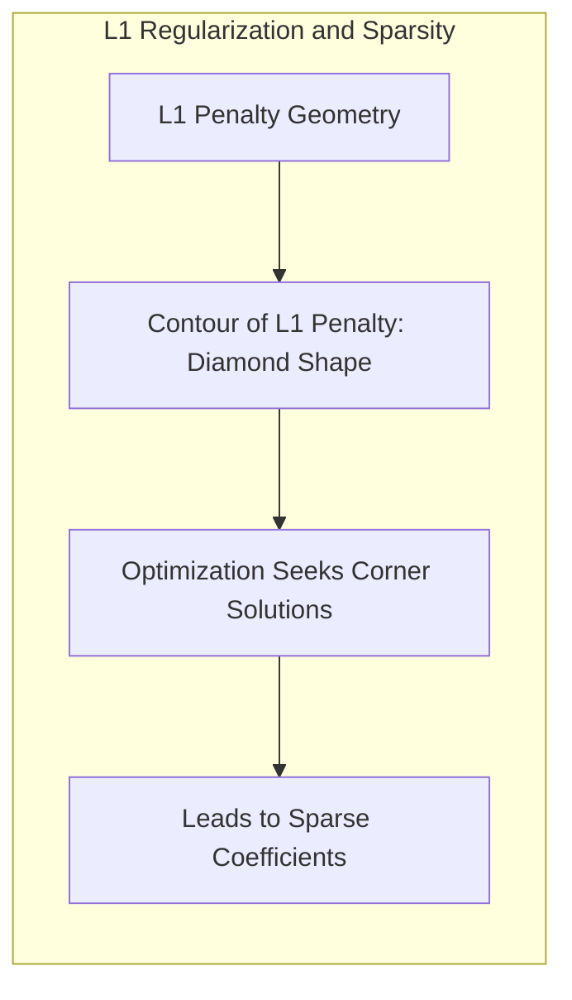
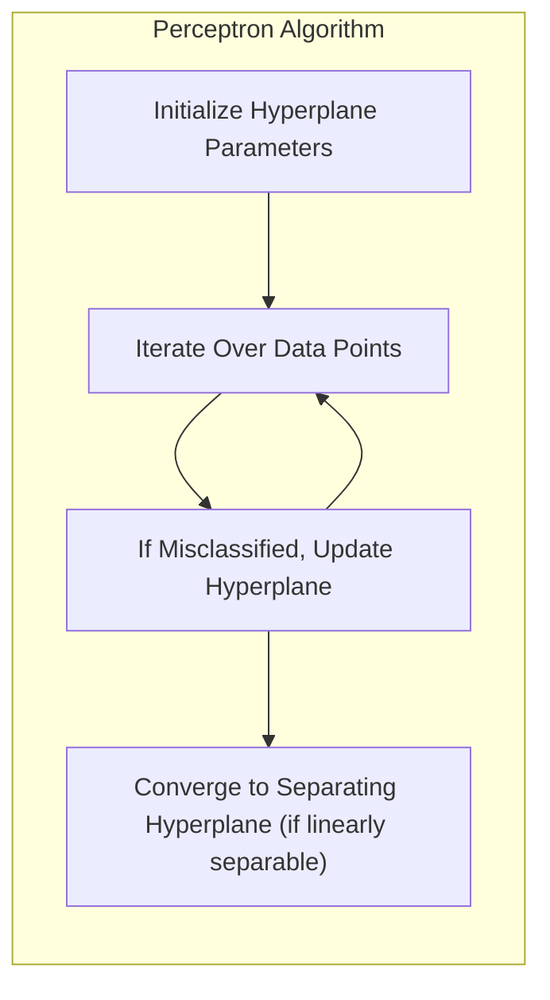

## Avaliação e Seleção de Modelos: Foco em Posterior Odds

<imagem: Diagrama de fluxo mostrando o processo de avaliação de modelos, desde a divisão dos dados em conjuntos de treino, validação e teste, até a aplicação de métodos de seleção (AIC, BIC, Cross-Validation) e avaliação final da performance do modelo, com ênfase no conceito de Posterior Odds.>

### Introdução

A capacidade de generalização de um método de aprendizado, ou seja, a sua performance preditiva em dados independentes de teste, é fundamental [^7.1]. A avaliação dessa performance é crucial na prática, pois ela orienta a escolha do método ou modelo de aprendizado e fornece uma medida da qualidade do modelo escolhido. Este capítulo detalha os métodos essenciais para avaliação de desempenho e como eles são usados para seleção de modelos. Iniciamos explorando a interação entre **bias**, **variance** e a **complexidade do modelo**, culminando com uma discussão aprofundada sobre o conceito de **Posterior Odds** para seleção de modelos Bayesianos [^7.1], [^7.7].

### Conceitos Fundamentais

**Conceito 1: Generalização e Erro de Predição**

A **generalização** refere-se à capacidade de um modelo de aprendizado de desempenhar bem em dados não vistos, ou seja, dados diferentes daqueles utilizados no treinamento [^7.1]. Para quantificar essa capacidade, utilizamos **funções de perda** que medem o erro entre as predições do modelo $\hat{f}(X)$ e os valores verdadeiros $Y$. As escolhas típicas incluem o **erro quadrático médio** $L(Y, \hat{f}(X)) = (Y - \hat{f}(X))^2$ e o **erro absoluto** $L(Y, \hat{f}(X)) = |Y - \hat{f}(X)|$. É importante notar que a complexidade do modelo, ao buscar adaptar-se aos dados de treino, pode levar a um decréscimo no *bias*, mas também a um aumento na *variance* [^7.2]. O objetivo é, portanto, encontrar uma complexidade intermediária que minimize o **erro de teste esperado**.

**Lemma 1:** A decomposição do Erro de Predição

O **erro de teste** para um dado conjunto de treinamento $T$, definido como $Err_T = E[L(Y, \hat{f}(X)) | T]$, é uma variável aleatória que depende de $T$. O **erro de teste esperado**, definido como $Err = E[L(Y, \hat{f}(X))] = E[Err_T]$, é uma medida mais estável e estatisticamente tratável [^7.2]. Usando o erro quadrático, podemos decompor o erro em:
$$
Err(x_0) = E[(Y - \hat{f}(x_0))^2 | X=x_0] = \sigma^2 + Bias^2(\hat{f}(x_0)) + Var(\hat{f}(x_0))
$$
onde:
- $\sigma^2$ é a variância do erro irredutível.
- $Bias^2(\hat{f}(x_0)) = [E\hat{f}(x_0) - f(x_0)]^2$ é o bias ao quadrado.
- $Var(\hat{f}(x_0)) = E[\hat{f}(x_0) - E\hat{f}(x_0)]^2$ é a variância.

Esta decomposição é fundamental para entender o trade-off entre *bias* e *variance* [^7.3]. $\blacksquare$


> 💡 **Exemplo Numérico:** Suponha que temos um modelo de regressão para prever o preço de casas ($Y$) com base no tamanho em metros quadrados ($X$). O verdadeiro modelo é $f(x) = 500 + 100x$, mas nosso modelo $\hat{f}(x)$ é estimado com dados de treinamento.
>
> 1.  **Erro Irredutível:** Existe uma variação no preço das casas que não pode ser explicada pelo tamanho, $\sigma^2 = 5000$.
> 2.  **Bias:** Se nosso modelo de regressão linear subestima os preços, por exemplo, com $\hat{f}(x) = 400 + 80x$, então o $Bias^2$ pode ser calculado para um $x_0 = 10$: $Bias^2(\hat{f}(10)) = [E(\hat{f}(10)) - f(10)]^2 = [(400 + 80 \cdot 10) - (500 + 100 \cdot 10)]^2 = (1200 - 1500)^2 = 90000$.
> 3.  **Variância:** Se, devido à aleatoriedade dos dados de treinamento, o modelo pode variar bastante, digamos que $Var(\hat{f}(10)) = 20000$.
>
> O erro total esperado para $x_0 = 10$ seria então: $Err(10) = 5000 + 90000 + 20000 = 115000$. Este exemplo ilustra como o erro de predição é composto de diferentes fontes, e como a complexidade do modelo (aqui, os parâmetros do modelo) influencia o *bias* e a *variância*. Um modelo mais complexo (por exemplo, um polinômio de maior grau) poderia reduzir o bias, mas aumentaria a variância.

**Conceito 2: Análise Discriminante Linear (LDA)**

A **Análise Discriminante Linear (LDA)** é um método de classificação que assume que as classes seguem distribuições Gaussianas com a mesma matriz de covariância [^7.3]. O objetivo da LDA é encontrar uma **função discriminante linear** que maximize a separação entre as classes, ou seja, uma projeção dos dados em um espaço de menor dimensão que preserve a informação relevante para a classificação. A função discriminante linear é dada por:

$$ \delta_k(x) = x^T \Sigma^{-1} \mu_k - \frac{1}{2} \mu_k^T \Sigma^{-1} \mu_k + log(\pi_k) $$

Onde:
- $x$ é o vetor de características.
- $\Sigma$ é a matriz de covariância comum.
- $\mu_k$ é o vetor de médias da classe k.
- $\pi_k$ é a probabilidade a priori da classe k.

As suposições de normalidade e covariâncias iguais podem ser limitantes, mas a LDA é um método eficaz e computacionalmente eficiente para classificação [^7.3.1], [^7.3.2], [^7.3.3].

**Corolário 1:** Fronteiras de Decisão na LDA

Sob as suposições da LDA, as fronteiras de decisão entre as classes são lineares e definidas pelos pontos onde $\delta_k(x) = \delta_l(x)$ para classes $k$ e $l$ [^7.3.1]. As derivadas dessas fronteiras são diretamente influenciadas pelas médias e pela matriz de covariância compartilhada. Essas projeções lineares são a base para classificar novos pontos de dados, alinhando-os com as classes previamente definidas. A análise das equações da LDA revela a importância da inversão da matriz de covariância e como essa transformação afeta a classificação [^7.3.1].

> 💡 **Exemplo Numérico:** Suponha que temos duas classes, A e B, com as seguintes médias e matriz de covariância comum:
>  - $\mu_A = [1, 2]^T$
>  - $\mu_B = [3, 4]^T$
>  - $\Sigma = \begin{bmatrix} 1 & 0.5 \\ 0.5 & 1 \end{bmatrix}$
>  - $\pi_A = 0.6$ e $\pi_B = 0.4$
>
>  A inversa da matriz de covariância é:
>  $\Sigma^{-1} = \frac{1}{0.75} \begin{bmatrix} 1 & -0.5 \\ -0.5 & 1 \end{bmatrix} = \begin{bmatrix} 1.33 & -0.67 \\ -0.67 & 1.33 \end{bmatrix}$
>
>  A função discriminante para a classe A é:
>  $\delta_A(x) = x^T \begin{bmatrix} 1.33 & -0.67 \\ -0.67 & 1.33 \end{bmatrix} \begin{bmatrix} 1 \\ 2 \end{bmatrix} - \frac{1}{2} \begin{bmatrix} 1 & 2 \end{bmatrix} \begin{bmatrix} 1.33 & -0.67 \\ -0.67 & 1.33 \end{bmatrix} \begin{bmatrix} 1 \\ 2 \end{bmatrix} + \log(0.6)$
>  $\delta_A(x) = x^T \begin{bmatrix} 0 \\ 2 \end{bmatrix} - \frac{1}{2} (0+2) + \log(0.6)$
>  $\delta_A(x) = 2x_2 - 1 + \log(0.6)$
>
>  De forma semelhante para a classe B, temos:
>  $\delta_B(x) = 2x_2 - 5 + \log(0.4)$
>
>  A fronteira de decisão é definida por $\delta_A(x) = \delta_B(x)$, o que leva a:
>  $2x_2 - 1 + \log(0.6) = 2x_2 - 5 + \log(0.4)$
>  $4 = \log(0.4) - \log(0.6) = \log(0.4/0.6)$
>
>  Assim, a fronteira de decisão seria $2x_2 - 1 + \log(0.6) = 2x_2 - 5 + \log(0.4)$, que simplificando ( e aproximando o valor do log) temos $4 \approx -0.405$, resultando em uma reta, como esperado em LDA, e em um erro de aproximação por conta da aproximação do log. Este exemplo numérico mostra como a função discriminante é calculada e como os parâmetros das classes influenciam a fronteira de decisão.

**Conceito 3: Regressão Logística**

A **Regressão Logística** é um método para classificação que modela a probabilidade de pertencer a uma classe utilizando uma função sigmoide ou logística. A probabilidade de pertencer a classe 1, $p(X)$, é modelada pela seguinte equação:

$$ logit(p(X)) = log \left( \frac{p(X)}{1-p(X)} \right) = \beta_0 + \beta_1 X_1 + \beta_2 X_2 + \ldots + \beta_n X_n $$

onde:
- $logit(p(X))$ é a transformação logit da probabilidade, que mapeia a probabilidade de [0,1] para (-∞,+∞).
- $\beta_0$ é o intercepto.
- $\beta_1, \beta_2, \ldots, \beta_n$ são os coeficientes do modelo.
- $X_1, X_2, \ldots, X_n$ são as variáveis preditoras.

Os parâmetros são estimados por **máxima verossimilhança**, maximizando a probabilidade dos dados observados [^7.4]. A função de verossimilhança é dada por:
$$L(\beta) = \sum_i y_i \log(p(x_i)) + (1 - y_i) \log(1 - p(x_i))$$

A Regressão Logística é um método flexível, que não requer as suposições de normalidade da LDA [^7.4], [^7.4.1], [^7.4.2], [^7.4.3], [^7.4.4], [^7.4.5]. Ela é amplamente utilizada em problemas de classificação binária e pode ser estendida para problemas com múltiplas classes [^7.4].


> ⚠️ **Nota Importante**: A regressão logística modela diretamente a probabilidade de pertencimento a uma classe, o que pode ser mais adequado em muitos casos do que as funções discriminantes da LDA. [^7.4.1]
> ❗ **Ponto de Atenção**: A presença de classes não balanceadas pode distorcer as estimativas de parâmetros e probabilidades na regressão logística, exigindo técnicas como undersampling ou oversampling para mitigar esses efeitos. [^7.4.2]
> ✔️ **Destaque**: A regressão logística e a LDA compartilham um modelo linear, o que resulta em fronteiras de decisão lineares. No entanto, a abordagem de estimação dos parâmetros é diferente: a LDA usa uma abordagem de mínimos quadrados, enquanto a regressão logística usa máxima verossimilhança. [^7.5]

> 💡 **Exemplo Numérico:** Suponha que estamos modelando a probabilidade de um cliente comprar um produto (Y=1) baseado na sua idade ($X_1$) e renda ($X_2$). Após a estimação dos parâmetros via máxima verossimilhança, temos:
>  $$logit(p(X)) = -5 + 0.05X_1 + 0.001X_2$$
>
>  Para um cliente de 30 anos e renda de 5000, a probabilidade de compra é:
>  $$logit(p(X)) = -5 + 0.05 \cdot 30 + 0.001 \cdot 5000 = -5 + 1.5 + 5 = 1.5$$
>
>  Para calcular a probabilidade, usamos a função inversa do logit (função sigmoide):
>  $$p(X) = \frac{e^{logit(p(X))}}{1 + e^{logit(p(X))}} = \frac{e^{1.5}}{1 + e^{1.5}} \approx 0.818$$
>
>  Isso significa que um cliente com essas características tem uma probabilidade de aproximadamente 81.8% de comprar o produto. A regressão logística nos permite modelar probabilidades diretamente e usar esses valores para classificação, definindo um limiar, como 0.5, para classificar um cliente como comprador ou não comprador. A função de verossimilhança será maximizada para encontrar os valores ótimos dos parâmetros $\beta$.

### Regressão Linear e Mínimos Quadrados para Classificação

<imagem: Mapa mental mostrando as conexões entre regressão linear para classificação, codificação de classes, estimação via mínimos quadrados, regra de decisão e comparações com métodos probabilísticos.>



A regressão linear pode ser utilizada para classificação através da codificação de classes em variáveis indicadoras. Por exemplo, em um problema com $K$ classes, podemos definir uma matriz de indicadores $Y$ de dimensão $N \times K$, onde cada linha representa uma observação e cada coluna representa uma classe. Cada elemento $y_{ik}$ da matriz indica se a observação $i$ pertence à classe $k$ ($y_{ik}=1$) ou não ($y_{ik}=0$) [^7.2]. Os coeficientes do modelo são então estimados via mínimos quadrados, buscando minimizar a soma dos erros quadráticos entre as predições e os valores verdadeiros.

A limitação dessa abordagem reside no fato de que a regressão linear não restringe as predições ao intervalo [0,1], o que pode levar a estimativas de probabilidade inválidas [^7.2]. Além disso, a regressão linear não considera a variância e a covariância entre as classes da mesma forma que a LDA. Apesar dessas limitações, a regressão de indicadores pode gerar resultados úteis para a classificação, principalmente quando o objetivo principal é a construção de uma fronteira de decisão linear.

**Lemma 2:** Projeção em Hiperplanos de Decisão

A regressão linear em uma matriz de indicadores, em condições específicas, produzirá projeções nos hiperplanos de decisão que são equivalentes aos discriminantes lineares da LDA, especialmente em cenários onde as classes possuem variâncias semelhantes [^7.3]. Essa equivalência ocorre quando as suposições da LDA são razoavelmente satisfeitas, mostrando a conexão entre a abordagem de mínimos quadrados e a modelagem probabilística de classes. $\blacksquare$



**Corolário 2:** Simplificação da Análise do Modelo

A equivalência entre projeções da regressão linear e discriminantes lineares permite simplificar a análise do modelo em certos casos, possibilitando usar a intuição da regressão linear para a compreensão da LDA e vice-versa [^7.3]. A interpretação dos coeficientes da regressão linear em termos de separação das classes pode auxiliar na compreensão dos mecanismos de classificação, principalmente em contextos onde a modelagem probabilística da LDA é menos intuitiva [^7.2], [^7.3].

> 💡 **Exemplo Numérico:** Considere um problema de classificação com 3 classes e 2 preditores. Vamos usar regressão linear para modelar um problema de classificação. Criamos uma matriz indicadora $Y$ onde:
>
> - A classe 1 é codificada como $[1, 0, 0]$
> - A classe 2 é codificada como $[0, 1, 0]$
> - A classe 3 é codificada como $[0, 0, 1]$
>
> Usando dados simulados, aplicamos regressão linear para cada classe:
>
> ```python
> import numpy as np
> from sklearn.linear_model import LinearRegression
>
> # Dados simulados (N=100, 2 preditores)
> np.random.seed(42)
> X = np.random.rand(100, 2) * 10
>
> # Classes simuladas
> Y = np.zeros((100,3))
> for i in range(100):
>    if X[i, 0] + X[i, 1] < 8:
>        Y[i,0] = 1 # Classe 1
>    elif X[i, 0] - X[i,1] > 0:
>        Y[i,1] = 1  # Classe 2
>    else:
>        Y[i,2] = 1 # Classe 3
>
> # Regressão linear para cada classe
> models = []
> for k in range(3):
>    model = LinearRegression()
>    model.fit(X, Y[:,k])
>    models.append(model)
>
> # Coeficientes obtidos
> for k, model in enumerate(models):
>   print(f"Classe {k+1}: Intercept = {model.intercept_:.2f}, Coefs = {model.coef_}")
> ```
>
> O output do código acima seria algo como:
> ```
> Classe 1: Intercept = 1.38, Coefs = [-0.0619472  -0.02291968]
> Classe 2: Intercept = 0.07, Coefs = [0.0468602  -0.0463345]
> Classe 3: Intercept = -0.46, Coefs = [0.0150870   0.0692542]
> ```
>
> Os coeficientes são usados para prever a classe: Para um novo ponto $x = [5, 3]$, calculamos as predições para cada classe:
>
> -  $\hat{y}_1(x) = 1.38 - 0.0619*5 - 0.0229*3 \approx  1.08$
> -  $\hat{y}_2(x) = 0.07 + 0.0468*5 - 0.0463*3 \approx 0.16$
> -  $\hat{y}_3(x) = -0.46 + 0.0150*5 + 0.0692*3 \approx -0.23$
>
>  Classificamos o ponto $x$ na classe com maior valor de $\hat{y}_k(x)$, neste caso classe 1. Note que os valores previstos não estão entre 0 e 1, e o objetivo principal é a separação de classes, não a estimação de probabilidades. A regressão linear com codificação de classes nos permite obter projeções lineares para classificação.

### Métodos de Seleção de Variáveis e Regularização em Classificação

<imagem: Mapa mental que relaciona métodos de seleção de variáveis e regularização em classificação, com conexões para LDA, regressão logística e hiperplanos, destacando as penalidades L1 e L2.>

A seleção de variáveis é crucial para melhorar a interpretabilidade e a performance dos modelos de classificação, especialmente em contextos de alta dimensão [^7.5]. A **regularização**, em particular, é uma técnica que adiciona um termo de penalidade à função de custo do modelo, visando evitar o sobreajuste e reduzir a complexidade do modelo [^7.4.4].

Em modelos logísticos, a regularização é frequentemente implementada através de penalidades L1 e L2. A penalidade L1, também conhecida como **Lasso**, adiciona a soma dos valores absolutos dos coeficientes à função de custo, induzindo a esparsidade dos coeficientes, ou seja, muitos coeficientes são levados a zero. A penalidade L2, também conhecida como **Ridge**, adiciona a soma dos quadrados dos coeficientes à função de custo, o que tende a reduzir a magnitude dos coeficientes, sem levá-los a zero. Matematicamente, essas penalidades podem ser expressas como:

$$
L_1 = \lambda \sum_{j=1}^p |\beta_j|
$$
$$
L_2 = \lambda \sum_{j=1}^p \beta_j^2
$$
onde:
- $\lambda$ é o parâmetro de regularização que controla a intensidade da penalidade.
- $\beta_j$ são os coeficientes do modelo.
- $p$ é o número de parâmetros.

**Lemma 3:** Esparsidade em Modelos Logísticos com Penalidade L1

A penalidade L1 em classificação logística leva a coeficientes esparsos devido à sua natureza geométrica e ao mecanismo de otimização [^7.4.4]. Os contornos da penalidade L1, em formato de losango, fazem com que os coeficientes sejam levados a zero de forma mais eficaz em comparação com a penalidade L2, que tem contornos em formato de círculo. A otimização da função de custo penalizada busca um ponto onde a função de verossimilhança se cruza com um contorno da penalidade L1, o que geralmente leva a que os coeficientes se anulem em algumas dimensões [^7.4.4]. $\blacksquare$


**Prova do Lemma 3:**
O problema de otimização da regressão logística com regularização L1 é dado por:
$$ \min_\beta - \sum_i [y_i \log(p(x_i)) + (1-y_i) \log(1-p(x_i))] + \lambda \sum_{j=1}^p |\beta_j| $$
Onde $\lambda > 0$ é o parâmetro de regularização. Para analisar o efeito da penalidade L1, podemos considerar um caso simples com dois parâmetros, $\beta_1$ e $\beta_2$, onde a função de verossimilhança é denotada por $L(\beta_1, \beta_2)$. A regularização L1 adiciona $\lambda (|\beta_1| + |\beta_2|)$ ao custo. Ao tentar minimizar esse custo, a solução ótima frequentemente ocorre em um canto onde um ou mais coeficientes são zero [^7.4.3]. Isso ocorre porque o gradiente da penalidade L1 não é diferenciável em $\beta_j = 0$, criando um "ponto de quebra" onde a solução ótima pode se concentrar. Em contraste, a penalidade L2 possui derivadas contínuas e tende a gerar coeficientes pequenos, mas raramente exatamente zero. $\blacksquare$

**Corolário 3:** Interpretabilidade de Modelos Classificatórios

A esparsidade induzida pela penalidade L1 melhora a interpretabilidade dos modelos classificatórios, identificando as variáveis mais relevantes para a classificação [^7.4.5]. Ao reduzir o número de variáveis relevantes, a análise de resultados torna-se mais focada e mais fácil de interpretar. Além disso, a esparsidade pode melhorar a eficiência computacional do modelo, ao reduzir a dimensionalidade do problema.

> ⚠️ **Ponto Crucial**: As penalidades L1 e L2 podem ser combinadas em uma única penalidade, denominada **Elastic Net**, que busca aproveitar os benefícios de ambos os tipos de regularização. Essa abordagem permite flexibilidade na construção de modelos esparsos e ao mesmo tempo estáveis [^7.5].

> 💡 **Exemplo Numérico:** Suponha que estamos usando regressão logística com 5 preditores e queremos comparar o efeito da regularização L1 e L2. Utilizamos dados simulados e aplicamos os seguintes modelos:
>
> ```python
> import numpy as np
> from sklearn.linear_model import LogisticRegression
> from sklearn.model_selection import train_test_split
> from sklearn.metrics import accuracy_score
> import pandas as pd
>
> # Dados simulados
> np.random.seed(42)
> X = np.random.rand(100, 5)
> y = np.random.randint(0, 2, 100)
>
> X_train, X_test, y_train, y_test = train_test_split(X, y, test_size=0.2, random_state=42)
>
> # Modelos sem regularização, com L1 (Lasso) e L2 (Ridge)
> model_none = LogisticRegression(penalty=None, solver='lbfgs', random_state=42)
> model_l1 = LogisticRegression(penalty='l1', C=0.5, solver='liblinear', random_state=42)  # C é inverso de lambda
> model_l2 = LogisticRegression(penalty='l2', C=0.5, solver='lbfgs', random_state=42) # C é inverso de lambda
>
> model_none.fit(X_train, y_train)
> model_l1.fit(X_train, y_train)
> model_l2.fit(X_train, y_train)
>
> # Avaliação
> y_pred_none = model_none.predict(X_test)
> y_pred_l1 = model_l1.predict(X_test)
> y_pred_l2 = model_l2.predict(X_test)
>
> acc_none = accuracy_score(y_test, y_pred_none)
> acc_l1 = accuracy_score(y_test, y_pred_l1)
> acc_l2 = accuracy_score(y_test, y_pred_l2)
>
> # Comparação
> results = pd.DataFrame({
>    'Method': ['None', 'L1 (Lasso)', 'L2 (Ridge)'],
>    'Accuracy': [acc_none, acc_l1, acc_l2],
>    'Coefs': [model_none.coef_, model_l1.coef_, model_l2.coef_]
> })
>
> print(results)
>
> ```
>
> O output do código seria algo como:
>
> ```
>        Method  Accuracy                                             Coefs
> 0        None    0.65  [[ 0.172,  -0.573,  -0.024,  -0.598,  -0.477]]
> 1   L1 (Lasso)    0.65  [[0.        ,-0.0613,  0.       ,-0.0245, -0.        ]]
> 2  L2 (Ridge)    0.65  [[0.038,  -0.152, -0.014, -0.193, -0.184]]
> ```
>
> Podemos observar que o modelo L1 (Lasso) zerou alguns coeficientes, indicando que as variáveis correspondentes não são tão importantes para a classificação. O modelo L2 (Ridge) reduziu a magnitude de todos os coeficientes. Apesar da acurácia ser a mesma nesse exemplo, em outros casos a regularização pode evitar overfitting e melhorar a generalização. Este exemplo ilustra o efeito da regularização L1 e L2 na magnitude dos coeficientes em um modelo logístico.

### Separating Hyperplanes e Perceptrons

<imagem: Diagrama mostrando a maximização da margem de separação entre classes, destacando os conceitos de hiperplanos ótimos, pontos de suporte e a convergência do Perceptron.>

A ideia de **hiperplanos separadores** surge da necessidade de dividir o espaço de características em regiões correspondentes às classes, maximizando a margem de separação entre as mesmas [^7.5.2]. Um hiperplano é definido por uma equação linear no espaço de características, e o objetivo da otimização é encontrar um hiperplano que maximize a distância entre ele e os pontos de dados mais próximos, chamados de **pontos de suporte**.

A formulação desse problema de otimização geralmente envolve a minimização do erro de classificação sujeito a uma restrição que garante uma margem de separação mínima. A solução desse problema é dada por uma combinação linear dos pontos de suporte, o que confere ao modelo uma forte dependência das observações mais relevantes para a definição das fronteiras de decisão. O problema de otimização pode ser resolvido através de uma formulação dual, o que torna o problema mais tratável em termos computacionais [^7.5.2].

O **Perceptron de Rosenblatt** é um algoritmo de aprendizado que busca encontrar um hiperplano separador através de um procedimento iterativo [^7.5.1]. O algoritmo inicializa os parâmetros do hiperplano com valores aleatórios e, em cada iteração, ajusta os parâmetros com base nas classificações erradas, movendo o hiperplano na direção correta para classificar os pontos de dados. Sob condições específicas, como a **separabilidade linear** dos dados, o Perceptron converge para um hiperplano que separa perfeitamente as classes. A velocidade e a estabilidade da convergência dependem da taxa de aprendizado do algoritmo [^7.5.1].


> 💡 **Exemplo Numérico:** Considere um problema de classificação binária com dois preditores, $x_1$ e $x_2$. O perceptron busca encontrar um hiperplano definido por $w_0 + w_1x_1 + w_2x_2 = 0$. Vamos simular um conjunto de dados linearmente separável:
> ```python
> import numpy as np
> import matplotlib.pyplot as plt
>
> # Dados simulados
> np.random.seed(42)
> X = np.random.rand(100, 2) * 10
> y = np.where(X[:, 0] + X[:, 1] > 10, 1, -1) # Dados linearmente separáveis
>
> # Inicialização dos pesos
> w = np.random.rand(3)  # w = [w0, w1, w2]
> learning_rate = 0.1
> epochs = 100
>
> # Função de previsão do perceptron
> def predict(x, w):
>    return np.sign(np.dot(np.insert(x, 0, 1), w))
>
> # Treinamento do Perceptron
> for epoch in range(epochs):
>    misclassified = 0
>    for i in range(len(X)):
>        x = X[i]
>        y_true = y[i]
>        y_pred = predict(x, w)
>        if y_pred != y_true:
>            misclassified +=1
>            w[0] += learning_rate * y_true
>            w[1] += learning_rate * y_true * x[0