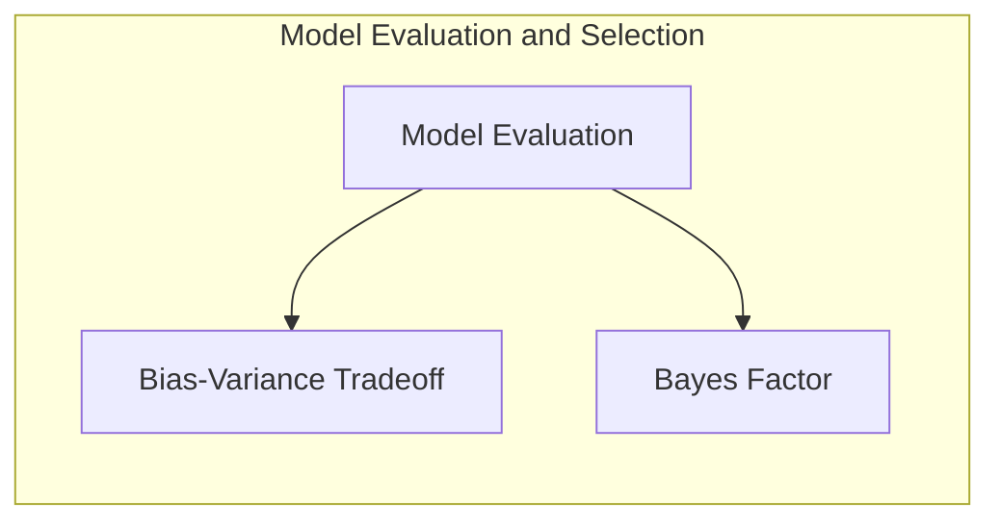
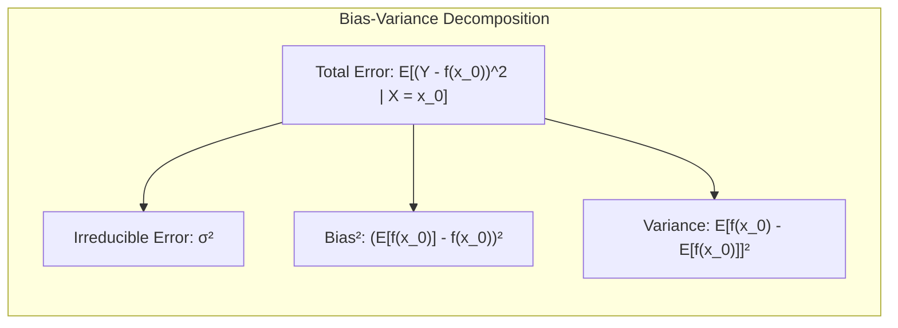
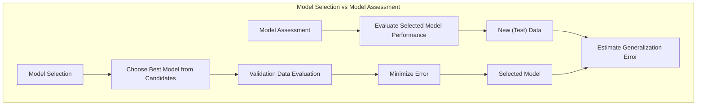
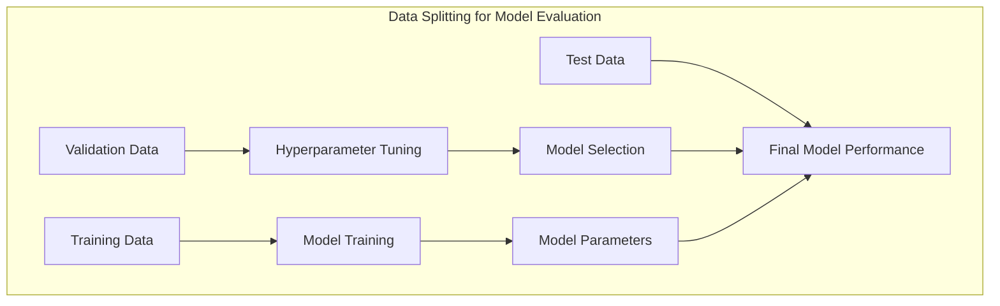
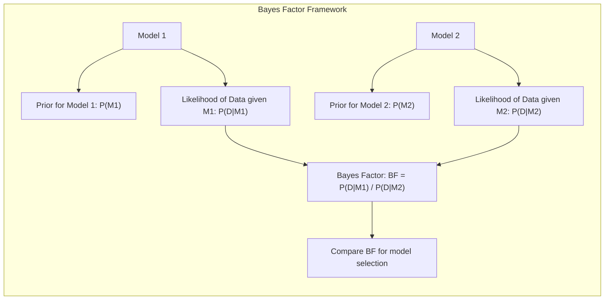
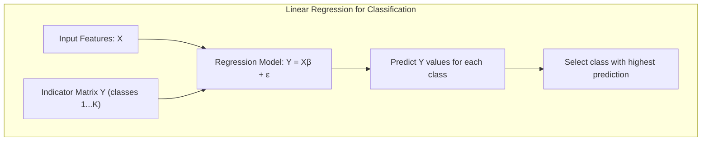
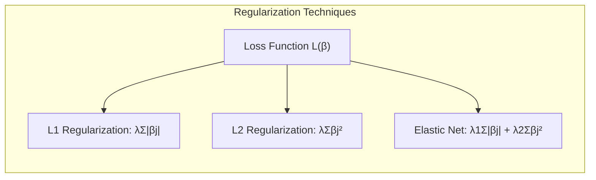
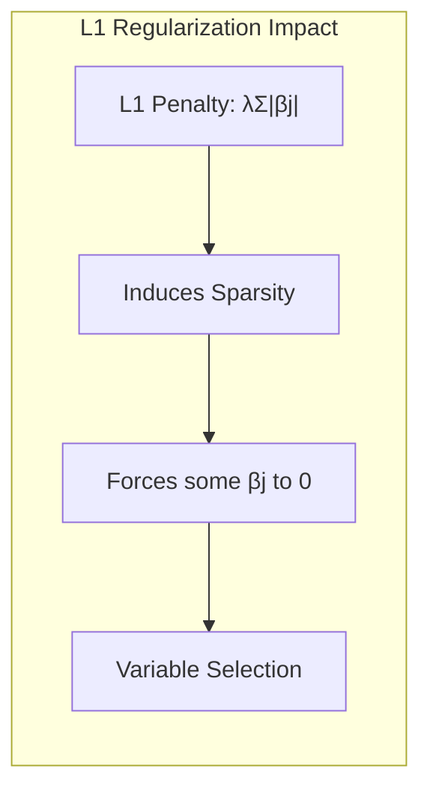
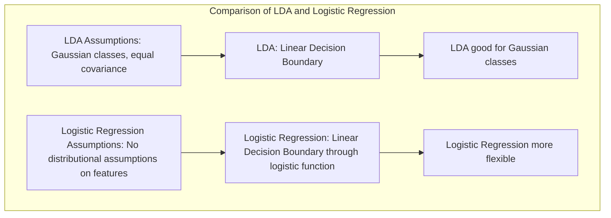

## Avaliação e Seleção de Modelos: Uma Análise Detalhada do Bayes Factor



### Introdução

A avaliação da capacidade de generalização de um método de aprendizado é essencial para sua aplicação prática [^7.1]. Essa avaliação orienta a escolha do método ou modelo de aprendizado e fornece uma medida da qualidade do modelo escolhido. Modelos com bom desempenho em dados de treinamento nem sempre se generalizam bem para dados independentes. Este capítulo explora os principais métodos para avaliação de desempenho, incluindo a discussão sobre bias, variance e a complexidade do modelo. O **Bayes Factor**, que será o foco principal deste capítulo, oferece uma estrutura Bayesiana para a seleção e comparação de modelos, complementando abordagens mais tradicionais [^7.1].

### Conceitos Fundamentais

**Conceito 1: Generalização, Bias e Variance**

O conceito de **generalização** refere-se à capacidade de um modelo de aprendizado de fazer previsões precisas em dados não vistos, ou seja, dados que não foram usados no treinamento do modelo. Um modelo com boa generalização deve ser capaz de capturar padrões subjacentes nos dados sem se ajustar excessivamente ao ruído ou peculiaridades específicas do conjunto de treinamento [^7.1].

O **bias** é a diferença entre a previsão média de um modelo e o valor verdadeiro. Um modelo com alto bias tende a simplificar demais os dados, não capturando as complexidades do padrão subjacente. O **variance**, por sua vez, mede a variabilidade das previsões do modelo quando treinado com diferentes conjuntos de dados de treinamento. Modelos com alto variance são muito sensíveis às variações nos dados de treinamento e tendem a se ajustar demais ao ruído [^7.2].

A relação entre bias e variance é fundamental na seleção de modelos. Modelos mais complexos tendem a ter baixo bias e alto variance, enquanto modelos mais simples tendem a ter alto bias e baixo variance. O objetivo é encontrar um equilíbrio que minimize tanto o bias quanto o variance, levando a uma boa generalização [^7.2].

> 💡 **Exemplo Numérico:**
> Vamos considerar um cenário onde queremos modelar a relação entre o tamanho de uma casa (em metros quadrados) e seu preço.
>
> *   **Modelo Simples (Alto Bias, Baixo Variance):** Um modelo linear simples, como $\text{Preço} = \beta_0 + \beta_1 \times \text{Tamanho}$, pode não capturar as nuances dos preços (alto bias), mas será consistente entre diferentes amostras (baixo variance).
>
> *   **Modelo Complexo (Baixo Bias, Alto Variance):** Um modelo polinomial de alta ordem, $\text{Preço} = \beta_0 + \beta_1 \times \text{Tamanho} + \beta_2 \times \text{Tamanho}^2 + \ldots$, pode ajustar-se perfeitamente aos dados de treinamento (baixo bias), mas poderá variar muito se treinado em diferentes conjuntos de dados (alto variance).
>
> Para ilustrar, vamos usar alguns valores numéricos. Suponha que os preços reais de algumas casas, em milhares de reais, sejam: 
>
> | Tamanho (m²) | Preço (milhares R$) |
> |--------------|-------------------|
> | 50           | 200               |
> | 75           | 300               |
> | 100          | 450               |
> | 125          | 500               |
> | 150          | 600               |
>
> Um modelo linear simples, como $Preco = 100 + 3*Tamanho$ (estimado usando mínimos quadrados), terá um bias maior (pois não capta a curvatura dos dados), enquanto um modelo complexo como um polinômio de grau 3 terá um bias baixo no treinamento, mas um alto variance ao usar diferentes conjuntos de treinamento.
>
> ```python
> import numpy as np
> import matplotlib.pyplot as plt
> from sklearn.linear_model import LinearRegression
> from sklearn.preprocessing import PolynomialFeatures
> from sklearn.metrics import mean_squared_error
>
> # Dados de exemplo
> tamanho = np.array([50, 75, 100, 125, 150]).reshape(-1, 1)
> preco = np.array([200, 300, 450, 500, 600])
>
> # Modelo Linear
> modelo_linear = LinearRegression()
> modelo_linear.fit(tamanho, preco)
> preco_linear_pred = modelo_linear.predict(tamanho)
> mse_linear = mean_squared_error(preco, preco_linear_pred)
>
> # Modelo Polinomial (grau 3)
> poly = PolynomialFeatures(degree=3)
> tamanho_poly = poly.fit_transform(tamanho)
> modelo_poly = LinearRegression()
> modelo_poly.fit(tamanho_poly, preco)
> preco_poly_pred = modelo_poly.predict(tamanho_poly)
> mse_poly = mean_squared_error(preco, preco_poly_pred)
>
> # Plotando os resultados
> plt.figure(figsize=(10, 6))
> plt.scatter(tamanho, preco, label='Dados Reais', color='blue')
> plt.plot(tamanho, preco_linear_pred, label=f'Modelo Linear (MSE={mse_linear:.2f})', color='red')
> plt.plot(tamanho, preco_poly_pred, label=f'Modelo Polinomial (MSE={mse_poly:.2f})', color='green')
> plt.xlabel('Tamanho (m²)')
> plt.ylabel('Preço (milhares R$)')
> plt.title('Comparação de Modelos: Bias e Variance')
> plt.legend()
> plt.grid(True)
> plt.show()
>
> print(f"MSE do Modelo Linear: {mse_linear:.2f}")
> print(f"MSE do Modelo Polinomial: {mse_poly:.2f}")
> ```
>
> Este exemplo ilustra como um modelo mais simples (linear) pode ter um erro maior (devido ao bias), enquanto um modelo complexo (polinomial) pode se ajustar perfeitamente aos dados de treinamento, mas com alto risco de overfitting, o que resultaria em um alto variance em novos dados.



**Lemma 1: Decomposição do Erro Quadrático Médio (MSE)**

O erro quadrático médio (MSE) de uma previsão pode ser decomposto em termos de bias e variance. Dado um modelo de previsão $f(X)$ para um valor alvo $Y$, o MSE pode ser expresso como:

$$ Err(x_0) = E[(Y - f(x_0))^2 | X = x_0] = \sigma^2 + [E[f(x_0)] - f(x_0)]^2 + E[f(x_0) - E[f(x_0)]]^2 $$

onde:
-   $\sigma^2$ é o erro irredutível.
-   $[E[f(x_0)] - f(x_0)]^2$ é o bias ao quadrado.
-   $E[f(x_0) - E[f(x_0)]]^2$ é a variance [^7.3].

A prova desse lemma se baseia na adição e subtração de $E[f(x_0)]$ no termo $(Y-f(x_0))^2$ e na expansão da expressão, resultando na decomposição em três termos. O primeiro termo $\sigma^2$ representa o ruído inerente nos dados, enquanto os outros dois representam as componentes de bias e variance, respectivamente. $\blacksquare$



**Conceito 2:  Model Selection e Model Assessment**

**Model selection** refere-se ao processo de escolher o melhor modelo de um conjunto de modelos candidatos. Isso geralmente envolve a estimação do desempenho de diferentes modelos usando dados de validação, e a escolha do modelo que apresenta o menor erro. **Model assessment**, por outro lado, refere-se ao processo de estimar a precisão da previsão de um modelo final escolhido em dados não vistos [^7.2]. Enquanto model selection visa escolher o melhor modelo, model assessment avalia a capacidade desse modelo de generalizar bem para dados novos [^7.2].

> 💡 **Exemplo Numérico:**
>
> Imagine que você tem três modelos diferentes para prever a demanda de um produto:
>
> 1.  **Modelo A:** Uma regressão linear simples com duas variáveis.
> 2.  **Modelo B:** Um modelo polinomial de grau 2 com as mesmas duas variáveis.
> 3.  **Modelo C:** Um modelo de árvore de decisão com as mesmas variáveis.
>
> **Model Selection:** Você divide seus dados em treinamento, validação e teste. Primeiro, treina os três modelos no conjunto de treinamento. Em seguida, você usa o conjunto de validação para avaliar o desempenho de cada modelo, calculando o MSE em cada caso. Suponha que os resultados sejam:
>
> | Modelo | MSE (Validação) |
> |--------|---------------|
> | A      | 25             |
> | B      | 15             |
> | C      | 20             |
>
> Com base no MSE no conjunto de validação, o Modelo B é selecionado como o melhor modelo para ser usado.
>
> **Model Assessment:** Agora que você selecionou o Modelo B, você avalia o desempenho desse modelo no conjunto de teste. Digamos que o MSE no conjunto de teste seja 17. Esse valor (17) é uma estimativa da performance do modelo B em dados novos. O Model assessment nos da uma ideia do quão bem o modelo se generaliza.
>
> Este exemplo destaca a diferença crucial entre selecionar o melhor modelo de um grupo (model selection) e avaliar o desempenho do modelo selecionado em dados não vistos (model assessment).

**Corolário 1: Importância da Divisão dos Dados**

Uma prática comum em machine learning é dividir os dados em três conjuntos: treinamento, validação e teste. O conjunto de treinamento é usado para ajustar os parâmetros do modelo; o conjunto de validação é usado para avaliar o desempenho do modelo durante a seleção e otimização dos hiperparâmetros; e o conjunto de teste é usado para avaliar o desempenho final do modelo escolhido em dados novos [^7.2]. A utilização adequada dessa divisão garante uma avaliação não enviesada da performance do modelo.



**Conceito 3: Bayes Factor como Ferramenta de Seleção de Modelos**

O **Bayes Factor** (BF) é uma métrica utilizada na inferência Bayesiana para comparar a verossimilhança de duas hipóteses, ou modelos, com base nos dados observados. Ao contrário de outras métricas, como o AIC e o BIC, que se baseiam em aproximações assintóticas, o BF é uma medida direta da razão entre as verossimilhanças marginais dos modelos, considerando suas priors [^7.7]. O BF quantifica a evidência nos dados para favorecer um modelo em relação a outro.

> ⚠️ **Nota Importante**: O uso de priors informativas e não-informativas pode impactar drasticamente a interpretação do Bayes Factor. O tipo de prior escolhida deve ser sempre justificada em relação ao problema em estudo [^7.7].

> ❗ **Ponto de Atenção**: O cálculo do Bayes Factor pode ser computacionalmente intensivo para modelos complexos. A escolha de métodos de aproximação e amostragem adequados é crucial para uma avaliação precisa [^7.7].

> ✔️ **Destaque**: O Bayes Factor não apenas classifica modelos, mas quantifica o grau de evidência para cada modelo, facilitando uma decisão mais informada [^7.7].



### Regressão Linear e Mínimos Quadrados para Classificação

A regressão linear pode ser usada para problemas de classificação, embora com certas limitações. Em vez de prever um valor contínuo, a regressão de uma matriz indicadora cria um modelo linear para cada classe. Para uma variável resposta com $K$ classes, podemos codificar a variável como $K$ variáveis indicadoras, onde a $k$-ésima variável é 1 se a observação pertencer à $k$-ésima classe e 0 caso contrário [^7.2].

O modelo de regressão é ajustado para cada variável indicadora separadamente. Para classificar uma nova observação, calculamos a previsão de cada variável indicadora. A classe prevista para essa observação é a da variável indicadora com a maior previsão. Em termos matemáticos, o modelo pode ser expresso como:
$$ Y = X\beta + \epsilon $$
Onde $Y$ é a matriz de indicadores, $X$ é a matriz de características e $\beta$ é a matriz de coeficientes.

No entanto, essa abordagem tem problemas, como dificuldade em lidar com problemas de separabilidade linear, e os modelos podem produzir previsões fora do intervalo $[0,1]$. Além disso, não considera as probabilidades condicionais, sendo apenas um classificador linear com regra de decisão.

> 💡 **Exemplo Numérico:**
>
> Suponha que temos três classes (A, B, C) e duas características ($X_1$, $X_2$). Temos as seguintes observações:
>
> | Observação | $X_1$ | $X_2$ | Classe |
> |------------|-------|-------|--------|
> | 1          | 1     | 2     | A      |
> | 2          | 1.5   | 1.8   | A      |
> | 3          | 2     | 4     | B      |
> | 4          | 2.5   | 3.8   | B      |
> | 5          | 4     | 1     | C      |
> | 6          | 4.2   | 1.2   | C      |
>
> Para usar regressão linear para classificação, criaríamos três variáveis indicadoras (Y_A, Y_B, Y_C):
>
> | Observação | $X_1$ | $X_2$ | Y_A | Y_B | Y_C |
> |------------|-------|-------|-----|-----|-----|
> | 1          | 1     | 2     | 1   | 0   | 0   |
> | 2          | 1.5   | 1.8   | 1   | 0   | 0   |
> | 3          | 2     | 4     | 0   | 1   | 0   |
> | 4          | 2.5   | 3.8   | 0   | 1   | 0   |
> | 5          | 4     | 1     | 0   | 0   | 1   |
> | 6          | 4.2   | 1.2   | 0   | 0   | 1   |
>
> Agora, treinamos três modelos de regressão linear, um para cada variável indicadora:
>
> $$ Y_A = \beta_{0A} + \beta_{1A}X_1 + \beta_{2A}X_2 + \epsilon_A $$
> $$ Y_B = \beta_{0B} + \beta_{1B}X_1 + \beta_{2B}X_2 + \epsilon_B $$
> $$ Y_C = \beta_{0C} + \beta_{1C}X_1 + \beta_{2C}X_2 + \epsilon_C $$
>
> Após o treinamento, obtemos os seguintes coeficientes (valores ilustrativos):
>
> |       | $\beta_0$ | $\beta_1$ | $\beta_2$ |
> |-------|----------|----------|----------|
> | Y\_A  | 0.8     | -0.2      | -0.1      |
> | Y\_B  | -0.1     | 0.3     | 0.2     |
> | Y\_C  | 0.2     | 0.1      | -0.2      |
>
> Para classificar uma nova observação, por exemplo, $(X_1 = 3, X_2 = 2)$, calculamos as previsões para cada classe:
>
> $$ Y_A = 0.8 - 0.2*3 - 0.1*2 = 0.0 $$
> $$ Y_B = -0.1 + 0.3*3 + 0.2*2 = 1.2 $$
> $$ Y_C = 0.2 + 0.1*3 - 0.2*2 = 0.1 $$
>
> Como $Y_B$ tem o maior valor (1.2), a observação é classificada como pertencente à classe B.
>
> Note que as previsões podem não estar entre 0 e 1, o que é um problema dessa abordagem. Além disso, o processo ignora as probabilidades condicionais, sendo meramente uma regra de decisão linear.



**Lemma 2:  Relação entre Projeções de Regressão Linear e Discriminantes Lineares**

Em certas condições, as projeções nos hiperplanos de decisão gerados pela regressão linear são equivalentes às projeções obtidas com análise discriminante linear (LDA). Especificamente, quando as classes têm covariâncias iguais, a fronteira de decisão linear gerada pela regressão de indicadores se aproxima da fronteira obtida por LDA [^7.3].

**Prova:** Seja $X$ a matriz de características, e $Y$ a matriz indicadora das classes.  A regressão linear minimiza $\|Y - X\beta\|_2^2$.  Ao mesmo tempo, LDA projeta as amostras em um espaço que maximiza a separabilidade entre as classes, e esta projeção pode ser escrita em termos da matriz de covariância e as médias amostrais das classes. Se as covariâncias forem iguais, a regra de decisão de LDA pode ser escrita em termos de funções lineares das variáveis preditoras, que são equivalentes às projeções obtidas por regressão linear, desde que as regras de decisão sejam adequadas [^7.3]. $\blacksquare$

**Corolário 2: Condições para Equivalência entre Regressão e LDA**

A equivalência entre regressão linear e LDA é válida quando a variância dentro das classes é aproximadamente a mesma e as fronteiras de decisão são lineares. Em situações em que as classes têm variâncias diferentes, a LDA (ou sua versão quadrática) podem ser mais adequadas [^7.3].

> ⚠️ **Nota Importante**: O uso da regressão linear para classificação pode levar a previsões fora do intervalo [0,1] e não oferece uma boa interpretação de probabilidade, o que é um problema na maioria das aplicações de classificação. Os resultados devem ser analisados com cautela, e métodos probabilísticos podem ser mais adequados na maioria dos casos.

> ❗ **Ponto de Atenção**: A regressão de indicadores não considera a probabilidade de pertencimento a uma classe, o que pode levar a decisões incorretas se as classes não forem linearmente separáveis. A escolha adequada do método de classificação deve considerar a distribuição dos dados [^7.3].

### Métodos de Seleção de Variáveis e Regularização em Classificação

Em problemas de classificação com muitas variáveis, é fundamental selecionar as variáveis mais relevantes para construir um modelo mais simples e generalizável. A regularização é uma técnica que adiciona penalidades à função de custo do modelo para evitar overfitting e controlar a complexidade do modelo [^7.6].

A regularização $L_1$ adiciona uma penalidade proporcional à soma dos valores absolutos dos coeficientes do modelo, induzindo a esparsidade, o que significa que alguns coeficientes são exatamente zero. A regularização $L_2$, por sua vez, adiciona uma penalidade proporcional à soma dos quadrados dos coeficientes, o que leva a coeficientes menores, mas não exatamente zero [^7.6].

A combinação das penalidades $L_1$ e $L_2$ resulta na regularização Elastic Net, que combina os benefícios das duas abordagens, controlando a esparsidade e a estabilidade dos coeficientes [^7.5]. A regularização é especialmente útil quando o número de variáveis é maior do que o número de observações, evitando overfitting e melhorando o desempenho do modelo em dados não vistos.

> 💡 **Exemplo Numérico:**
>
> Vamos usar um exemplo de classificação binária com 10 variáveis preditoras ($X_1, X_2, ..., X_{10}$) e uma variável resposta ($Y$ = 0 ou 1). Suponha que temos um conjunto de dados com 100 amostras. Usaremos regressão logística com regularização.
>
> 1.  **Regressão Logística sem Regularização:** Ajustamos um modelo de regressão logística aos dados de treinamento sem adicionar nenhuma penalidade. Os coeficientes estimados podem ser grandes, levando a overfitting.
> 2.  **Regressão Logística com Regularização L1 (Lasso):** Ajustamos um modelo de regressão logística usando a penalidade $L_1$:
> $$L(\beta) = - \sum_{i=1}^N [y_i \log p(x_i) + (1 - y_i) \log (1 - p(x_i))] + \lambda \sum_{j=1}^{10} |\beta_j| $$
>
>     O parâmetro $\lambda$ controla a intensidade da regularização. Com um $\lambda$ grande, muitos coeficientes se tornam exatamente zero, selecionando um subconjunto de variáveis.
> 3.  **Regressão Logística com Regularização L2 (Ridge):** Ajustamos um modelo de regressão logística usando a penalidade $L_2$:
> $$L(\beta) = - \sum_{i=1}^N [y_i \log p(x_i) + (1 - y_i) \log (1 - p(x_i))] + \lambda \sum_{j=1}^{10} \beta_j^2 $$
>
>     A penalidade $L_2$ reduz a magnitude dos coeficientes, mas não os torna exatamente zero.
> 4.  **Regressão Logística com Elastic Net:** Ajustamos o modelo usando uma combinação de penalidades L1 e L2:
> $$L(\beta) = - \sum_{i=1}^N [y_i \log p(x_i) + (1 - y_i) \log (1 - p(x_i))] + \lambda_1 \sum_{j=1}^{10} |\beta_j| + \lambda_2 \sum_{j=1}^{10} \beta_j^2 $$
>
>     Essa penalidade controla tanto a esparsidade quanto a magnitude dos coeficientes.
>
> Vamos supor que, após o treinamento (usando validação cruzada para escolher os parâmetros de regularização), obtemos os seguintes coeficientes (valores hipotéticos):
>
> | Variável | Sem Regularização | L1 (λ=0.1) | L2 (λ=0.1) | Elastic Net (λ1=0.05, λ2=0.05)|
> |----------|------------------|------------|------------|----------------------------------|
> | $X_1$    | 1.2             | 0.8        | 0.9       | 0.7                              |
> | $X_2$    | -0.8            | 0.0         | -0.7      | 0.0                             |
> | $X_3$    | 0.5             | 0.0         | 0.4       | 0.0                              |
> | $X_4$    | 2.1             | 1.5       | 1.8      | 1.4                              |
> | $X_5$    | -1.5            | -0.9       | -1.3      | -0.8                             |
> | $X_6$    | 0.9             | 0.0         | 0.7       | 0.0                              |
> | $X_7$    | -0.3            | 0.0         | -0.2      | 0.0                              |
> | $X_8$    | 1.0             | 0.6        | 0.8       | 0.5                              |
> | $X_9$    | -0.7            | 0.0         | -0.6      | 0.0                             |
> | $X_{10}$   | 0.4            | 0.0         | 0.3       | 0.0                              |
>
> A regularização L1 (Lasso) fez com que vários coeficientes fossem exatamente zero, indicando que essas variáveis (X2, X3, X6, X7, X9 e X10) são menos relevantes para a classificação. A regularização L2 (Ridge) reduziu os valores, mas não eliminou nenhum. Elastic Net combinou os dois efeitos. A escolha entre os métodos de regularização depende do problema específico e do objetivo: Lasso para esparsidade e seleção de variáveis, Ridge para estabilidade e redução de magnitude, e Elastic Net para combinar ambos os benefícios.




```python
import numpy as np
import matplotlib.pyplot as plt
from sklearn.linear_model import LogisticRegression
from sklearn.model_selection import train_test_split
from sklearn.metrics import accuracy_score
from sklearn.preprocessing import StandardScaler
from sklearn.pipeline import Pipeline

# Dados de exemplo
np.random.seed(42)
X = np.random.rand(100, 10)  # 100 amostras, 10 variáveis
y = np.random.randint(0, 2, 100)  # classes 0 ou 1

# Dividir os dados em treinamento e teste
X_train, X_test, y_train, y_test = train_test_split(X, y, test_size=0.3, random_state=42)

# Modelos
modelo_sem_regularizacao = LogisticRegression(penalty=None, solver='liblinear')
modelo_l1 = LogisticRegression(penalty='l1', C=0.5, solver='liblinear')  # Lasso
modelo_l2 = LogisticRegression(penalty='l2', C=0.5, solver='liblinear')  # Ridge
modelo_elastic = LogisticRegression(penalty='elasticnet', solver='saga', C=0.5, l1_ratio=0.5) # ElasticNet

# Treinar os modelos
modelo_sem_regularizacao.fit(X_train, y_train)
modelo_l1.fit(X_train, y_train)
modelo_l2.fit(X_train, y_train)
modelo_elastic.fit(X_train, y_train)

# Avaliar os modelos
y_pred_sem_regularizacao = modelo_sem_regularizacao.predict(X_test)
y_pred_l1 = modelo_l1.predict(X_test)
y_pred_l2 = modelo_l2.predict(X_test)
y_pred_elastic = modelo_elastic.predict(X_test)


acc_sem_regularizacao = accuracy_score(y_test, y_pred_sem_regularizacao)
acc_l1 = accuracy_score(y_test, y_pred_l1)
acc_l2 = accuracy_score(y_test, y_pred_l2)
acc_elastic = accuracy_score(y_test, y_pred_elastic)

print(f"Acurácia (Sem Regularização): {acc_sem_regularizacao:.2f}")
print(f"Acurácia (L1): {acc_l1:.2f}")
print(f"Acurácia (L2): {acc_l2:.2f}")
print(f"Acurácia (Elastic Net): {acc_elastic:.2f}")
```

**Lemma 3:  Efeito da Penalização L1 na Esparsidade**

A penalização $L_1$ em classificação logística leva à esparsidade dos coeficientes. Isso ocorre porque, durante a otimização da função de custo, a penalização $L_1$ força alguns coeficientes a serem exatamente zero.

**Prova:** A função de custo de regressão logística com penalização $L_1$ pode ser escrita como:

$$ L(\beta) = - \sum_{i=1}^N [y_i \log p(x_i) + (1 - y_i) \log (1 - p(x_i))] + \lambda \sum_{j=1}^p |\beta_j| $$

onde $\lambda$ é o parâmetro de regularização.  A penalidade $\lambda \sum_{j=1}^p |\beta_j|$ causa uma "compressão" dos coeficientes, forçando alguns a serem zero. Isso acontece devido ao gradiente da norma $L_1$, que tem um valor constante de $\pm 1$ em cada direção, o que leva a soluções esparsas [^7.4.4]. $\blacksquare$

**Corolário 3: Interpretabilidade e Seleção de Variáveis**

A esparsidade induzida pela penalização $L_1$ facilita a interpretação do modelo, pois seleciona um subconjunto de variáveis preditoras mais relevantes, além de melhorar o desempenho do modelo ao reduzir a complexidade [^7.4.5].

> ⚠️ **Ponto Crucial**: A escolha do parâmetro de regularização $\lambda$ é crucial para controlar o grau de esparsidade e a complexidade do modelo. Essa escolha pode ser feita usando técnicas de validação cruzada.

### Separating Hyperplanes e Perceptrons

A ideia de **separating hyperplanes** (hiperplanos separadores) é fundamental na classificação linear. Um hiperplano separador é uma fronteira de decisão linear que divide o espaço de características em regiões distintas, de forma que as observações de classes diferentes sejam separadas [^7.5.2]. O objetivo é encontrar o hiperplano que melhor separa as classes, ou seja, que maximiza a margem de separação, a distância entre o hiperplano e as observações mais próximas de cada classe.

The algorithm of the **Perceptron** is an iterative method that learns to find a separating hyperplane, updating the weights of the hyperplane based on incorrectly classified samples. The Rosenblatt's Perceptron is one of the simplest supervised learning algorithms that converges to a solution (if linearly separable) through an iterative process that adjusts weights until the samples are correctly classified.

### Pergunta Teórica Avançada: Qual a influência da diferença nas distribuições das classes sobre a escolha do método de classificação, especialmente em relação a LDA e Regressão Logística?

**Resposta:**

A escolha entre LDA e regressão logística depende crucialmente da distribuição das classes e das suposições feitas sobre esses dados [^7.3]. LDA pressupõe que as classes seguem distribuições Gaussianas com a mesma matriz de covariância, levando a uma fronteira de decisão linear. A regressão logística, por outro lado, não faz nenhuma suposição sobre a distribuição das variáveis preditoras, mas modela a probabilidade de pertencimento a uma classe usando uma função logística, que também resulta em uma fronteira de decisão linear [^7.4].

Em situações em que as classes são aproximadamente gaussianas e têm covariâncias similares, LDA pode ser uma escolha apropriada. No entanto, se as covariâncias são diferentes, LDA pode ser menos eficiente do que modelos quadráticos. A regressão logística pode ser mais robusta em situações onde os dados não seguem a suposição gaussiana, e quando se deseja prever probabilidades.



**Lemma 4: Relação