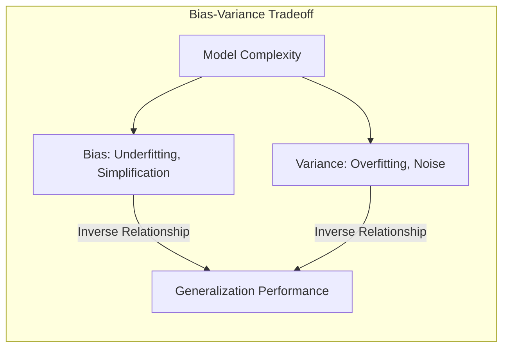
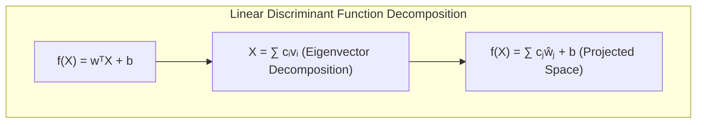
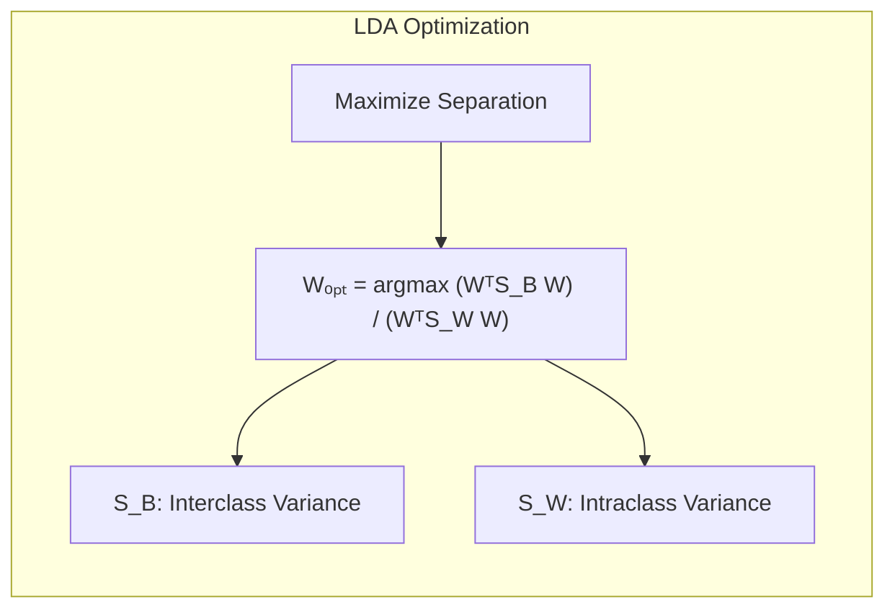
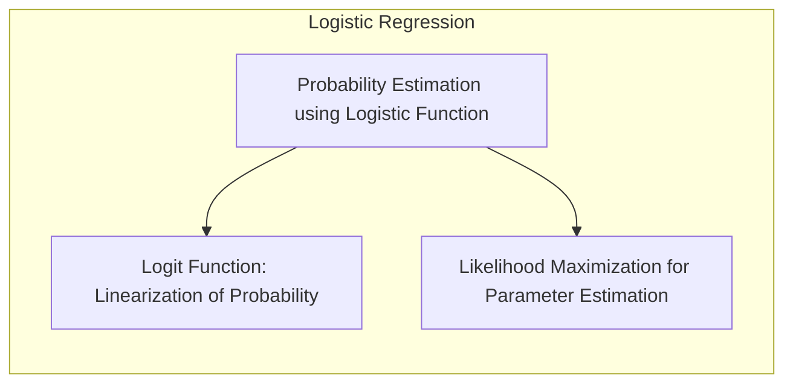
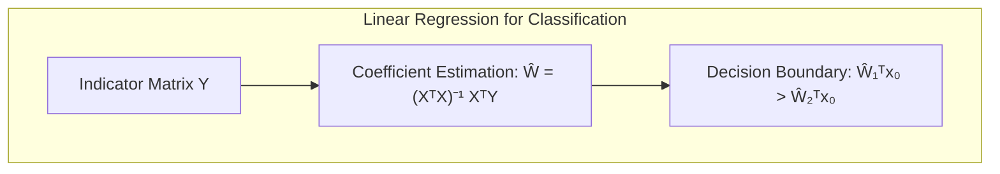
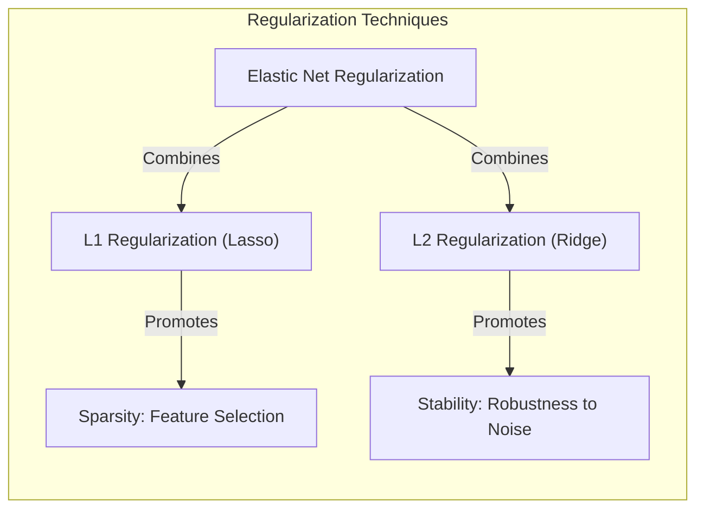
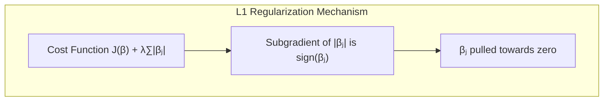

## Avaliação e Seleção de Modelos: Foco na Aproximação de Laplace

<imagem: Mapa mental abrangente que conecta os principais conceitos abordados no capítulo, como Bias-Variance Tradeoff, métodos de avaliação (AIC, BIC, Cross-validation, Bootstrap), e aproximações como a de Laplace, demonstrando suas interrelações e o papel crucial na seleção de modelos>

### Introdução
A **performance de generalização** de um método de aprendizado refere-se à sua capacidade de prever com precisão dados de teste independentes [^7.1]. A avaliação dessa performance é de suma importância na prática, pois guia a escolha do método de aprendizado ou modelo e fornece uma medida da qualidade do modelo escolhido [^7.1]. Este capítulo explora os principais métodos para avaliação de performance e como eles são usados na seleção de modelos, iniciando com uma discussão sobre a relação entre **bias, variância e complexidade do modelo** [^7.1]. A complexidade do modelo, como discutido em [^7.2], afeta diretamente o tradeoff entre bias e variância e, consequentemente, a performance de generalização.

### Conceitos Fundamentais

**Conceito 1:** O **problema de classificação** envolve o aprendizado de um modelo $f(X)$ a partir de um conjunto de dados de treinamento $T$, de forma que $f(X)$ seja capaz de prever a classe ou valor correto de uma nova amostra de dados não vista. Métodos lineares são frequentemente usados devido à sua simplicidade e interpretabilidade, mas podem apresentar **bias** se a relação verdadeira entre as variáveis de entrada e saída não for linear [^7.2]. O viés surge quando o modelo é muito simplificado e não consegue capturar adequadamente a complexidade dos dados, enquanto a **variância** surge quando o modelo é muito complexo e se ajusta ao ruído presente no conjunto de dados de treinamento, levando a uma má generalização [^7.2]. Por exemplo, um modelo linear simples pode apresentar alto viés se a relação entre as variáveis for altamente não-linear, enquanto um modelo muito complexo, como um polinômio de alta ordem, pode apresentar alta variância se for ajustado a um conjunto de dados com ruído. Encontrar um modelo com um equilíbrio adequado entre bias e variância é crucial para a boa performance de generalização [^7.2].



> 💡 **Exemplo Numérico:** Imagine que queremos prever o preço de uma casa com base em seu tamanho (em metros quadrados). Temos um conjunto de dados com 10 casas.
>
> *   **Modelo 1 (Simples):** $preço = \beta_0 + \beta_1 \cdot tamanho$.  Este modelo linear pode ter um **alto bias** se a relação entre tamanho e preço não for linear (por exemplo, se casas muito grandes tiverem um aumento de preço menos acentuado do que as casas pequenas).
>
> *   **Modelo 2 (Complexo):** $preço = \beta_0 + \beta_1 \cdot tamanho + \beta_2 \cdot tamanho^2 + \beta_3 \cdot tamanho^3$. Este modelo polinomial pode se ajustar muito bem aos dados de treino (baixo bias), mas pode apresentar **alta variância**. Ele pode capturar ruídos ou variações aleatórias nos dados de treinamento e apresentar um desempenho ruim para novas casas.
>
>   ```python
>   import numpy as np
>   import matplotlib.pyplot as plt
>   from sklearn.linear_model import LinearRegression
>   from sklearn.preprocessing import PolynomialFeatures
>   from sklearn.pipeline import make_pipeline
>
>   # Dados de exemplo (tamanho em m^2, preço em R$)
>   tamanho = np.array([50, 60, 70, 80, 90, 100, 110, 120, 130, 140]).reshape(-1, 1)
>   preco = np.array([150000, 180000, 220000, 250000, 280000, 300000, 320000, 330000, 340000, 350000]) + np.random.normal(0, 20000, 10)
>
>   # Modelo 1: Regressão Linear
>   modelo1 = LinearRegression()
>   modelo1.fit(tamanho, preco)
>
>   # Modelo 2: Regressão Polinomial de grau 3
>   modelo2 = make_pipeline(PolynomialFeatures(3), LinearRegression())
>   modelo2.fit(tamanho, preco)
>
>   # Plot dos resultados
>   tamanho_plot = np.linspace(40, 150, 100).reshape(-1, 1)
>   preco_modelo1 = modelo1.predict(tamanho_plot)
>   preco_modelo2 = modelo2.predict(tamanho_plot)
>
>   plt.figure(figsize=(8, 6))
>   plt.scatter(tamanho, preco, color='blue', label='Dados Reais')
>   plt.plot(tamanho_plot, preco_modelo1, color='red', label='Modelo Linear (Alto Bias)')
>   plt.plot(tamanho_plot, preco_modelo2, color='green', label='Modelo Polinomial (Alta Variância)')
>   plt.xlabel("Tamanho (m²)")
>   plt.ylabel("Preço (R$)")
>   plt.legend()
>   plt.title("Ilustração do Bias-Variância Tradeoff")
>   plt.show()
>   ```
>
>   Neste exemplo, o modelo linear simplificado não se ajusta bem aos dados, sugerindo um viés. Já o modelo polinomial segue os dados de treinamento de forma mais precisa, mas pode apresentar um comportamento instável para novos dados, o que exemplifica a alta variância.

**Lemma 1:** Dado um modelo de classificação linear $f(X) = w^T X + b$, onde $w$ são os pesos e $b$ o bias, a função discriminante pode ser decomposta em termos de suas projeções nas direções dos autovetores da matriz de covariância das classes, isso permite uma análise mais detalhada da direção do hiperplano de decisão e da separabilidade das classes.
$$
f(X) = \sum_{i=1}^p w_i x_i + b
$$
onde $x_i$ são os componentes do vetor de entrada $X$ e $w_i$ são os pesos correspondentes. Cada componente $w_i x_i$ pode ser interpretado como uma projeção de $X$ na direção de $w_i$. Decompondo $X$ em uma base ortonormal dada por seus autovetores $v_i$, podemos expressar:
$$
X = \sum_{i=1}^p c_i v_i
$$
onde $c_i$ são os coeficientes de projeção de $X$ nos autovetores $v_i$. Substituindo na função discriminante, temos:
$$
f(X) = \sum_{i=1}^p w_i \sum_{j=1}^p c_j v_{i,j} + b = \sum_{j=1}^p c_j \sum_{i=1}^p w_i v_{i,j} + b = \sum_{j=1}^p c_j  \hat{w}_j + b
$$
onde $\hat{w}_j = \sum_{i=1}^p w_i v_{i,j}$ é a projeção do vetor de pesos $w$ no autovetor $v_j$. $\blacksquare$



**Conceito 2:** **Linear Discriminant Analysis (LDA)** é uma técnica de classificação que assume que as classes seguem uma distribuição normal com a mesma matriz de covariância [^7.3]. O objetivo do LDA é encontrar uma projeção linear dos dados que maximize a separação entre as classes [^7.3.1]. A **fronteira de decisão** do LDA é um hiperplano, determinado pela média das médias das classes e pela matriz de covariância comum [^7.3.2]. O LDA é um método de classificação útil quando as suposições de normalidade e covariâncias iguais são razoáveis, o que o torna uma abordagem menos complexa e, em geral, com boa performance em problemas bem definidos [^7.3.3]. A função discriminante linear derivada pelo LDA é ótima, no sentido que maximiza a separação entre as classes, sob as premissas do modelo [^7.3].

**Corolário 1:** A função discriminante linear do LDA pode ser vista como uma projeção dos dados em um subespaço de dimensão reduzida, maximizando a separabilidade entre classes, o que é equivalente a encontrar a melhor direção de projeção que separa as classes [^7.3.1]. Especificamente, o LDA procura a projeção dos dados no subespaço que maximiza a razão entre a variância interclasses e a variância intraclasses. Essa projeção pode ser expressa como:
$$
W_{opt} = \underset{W}{\mathrm{argmax}} \frac{|W^T S_B W|}{|W^T S_W W|}
$$
onde $S_B$ é a matriz de variância interclasses e $S_W$ é a matriz de variância intraclasses. A solução para este problema é dada pelos autovetores de $(S_W^{-1} S_B)$. Essa projeção reduz a dimensionalidade, enquanto mantém o máximo de informações relevantes para a classificação, o que implica em um melhor desempenho computacional em datasets com muitas variáveis. $\blacksquare$



> 💡 **Exemplo Numérico:**  Suponha que temos dados de duas classes, cada uma com duas variáveis. Queremos aplicar LDA para encontrar a melhor projeção linear que separa essas classes. Vamos usar dados sintéticos para ilustrar o processo.
>
> ```python
> import numpy as np
> import matplotlib.pyplot as plt
> from sklearn.discriminant_analysis import LinearDiscriminantAnalysis
>
> # Dados de exemplo
> np.random.seed(42)
> mean1 = [2, 2]
> cov1 = [[1, 0.5], [0.5, 1]]
> class1 = np.random.multivariate_normal(mean1, cov1, 100)
>
> mean2 = [5, 5]
> cov2 = [[1, -0.5], [-0.5, 1]]
> class2 = np.random.multivariate_normal(mean2, cov2, 100)
>
> X = np.concatenate((class1, class2))
> y = np.array([0] * 100 + [1] * 100) # Classes 0 e 1
>
> # Aplicar LDA
> lda = LinearDiscriminantAnalysis()
> lda.fit(X, y)
> X_lda = lda.transform(X)
>
> # Plot dos dados originais e projetados
> plt.figure(figsize=(12, 6))
> plt.subplot(1, 2, 1)
> plt.scatter(class1[:, 0], class1[:, 1], label='Classe 0', marker='o')
> plt.scatter(class2[:, 0], class2[:, 1], label='Classe 1', marker='x')
> plt.xlabel('Feature 1')
> plt.ylabel('Feature 2')
> plt.title('Dados Originais')
> plt.legend()
>
> plt.subplot(1, 2, 2)
> plt.scatter(X_lda[:100, 0], [0] * 100, label='Classe 0', marker='o')
> plt.scatter(X_lda[100:, 0], [0] * 100, label='Classe 1', marker='x')
> plt.xlabel('LDA Componente 1')
> plt.yticks([])
> plt.title('Dados Projetados por LDA')
> plt.legend()
>
> plt.tight_layout()
> plt.show()
>
> # Imprimir os coeficientes do LDA
> print("Coeficientes do LDA:", lda.coef_)
> ```
>
>  O código gera dados sintéticos, aplica LDA e mostra a projeção dos dados em uma única dimensão (após o LDA), onde as classes estão mais separadas. Os coeficientes do LDA representam a direção no espaço original que maximiza a separação das classes.

**Conceito 3:** A **Regressão Logística** é um método para classificação que estima a probabilidade de uma amostra pertencer a uma determinada classe usando a função logística [^7.4]. A função **logit** é utilizada para transformar a probabilidade em uma escala log-odds, tornando o problema linear [^7.4.1]. A função logística mapeia qualquer valor real entre 0 e 1, o que permite a interpretação da saída como uma probabilidade de pertinência à classe [^7.4.1]. O modelo é ajustado por meio da **maximização da verossimilhança** [^7.4.2], encontrando os parâmetros que melhor se ajustam aos dados de treinamento. A regressão logística é uma alternativa ao LDA quando as suposições de normalidade e covariâncias iguais não são válidas [^7.4.3]. Ao invés de assumir uma distribuição normal, a regressão logística modela a probabilidade de pertinência à classe diretamente, por meio da função logística, e o aprendizado se dá pelo ajuste dos parâmetros do modelo para maximizar a verossimilhança dos dados observados, comumente utilizando algoritmos de otimização como o gradiente descendente [^7.4.4]. A regressão logística também oferece flexibilidade com relação à separabilidade linear dos dados, pois pode ser facilmente adaptada para modelar relações não-lineares entre os preditores e a variável resposta através de transformações dos preditores [^7.4.5].

> ⚠️ **Nota Importante**: É crucial entender que, enquanto o LDA se baseia em suposições sobre as distribuições das classes, a regressão logística modela diretamente a probabilidade de pertinência à classe, o que a torna mais robusta em certos cenários. **Referência ao tópico [^7.4.1]**.

> ❗ **Ponto de Atenção**: Em situações de classes não balanceadas, a regressão logística pode ser mais sensível, pois a maximização da verossimilhança pode levar a modelos que favorecem a classe majoritária. É importante utilizar técnicas como o balanceamento de classes ou a utilização de pesos para corrigir este problema. **Conforme indicado em [^7.4.2]**.

> ✔️ **Destaque**: As estimativas dos parâmetros em LDA e em regressão logística estão fortemente relacionadas, com ambas as abordagens buscando encontrar o hiperplano que melhor separa as classes. Em certos casos, como quando as classes possuem distribuições normais com covariâncias iguais, a regressão logística e o LDA podem produzir resultados semelhantes. **Baseado no tópico [^7.5]**.



### Regressão Linear e Mínimos Quadrados para Classificação
<imagem: Diagrama de fluxo detalhado em Mermaid, mostrando o processo de regressão de indicadores, desde a codificação das classes até a aplicação da regra de decisão, e destacando a conexão com métodos probabilísticos como LDA e regressão logística>

```mermaid
flowchart TD
    A[Codificar Classes com Matriz Indicadora] --> B{Estimar Coeficientes via Mínimos Quadrados}
    B --> C[Aplicar Regra de Decisão Baseada em Previsões]
    C --> D{Comparar com Métodos Probabilísticos (LDA, Regressão Logística)}
    D --> E{Avaliar e Selecionar o Melhor Modelo}
    style A fill:#f9f,stroke:#333,stroke-width:2px
    style B fill:#ccf,stroke:#333,stroke-width:2px
    style C fill:#cfc,stroke:#333,stroke-width:2px
    style D fill:#ffc,stroke:#333,stroke-width:2px
    style E fill:#aaf,stroke:#333,stroke-width:2px
```

A **regressão linear** pode ser aplicada para problemas de classificação utilizando uma **matriz de indicadores**, onde cada coluna representa uma classe e os valores indicam a pertinência a esta classe. A regressão linear estima os coeficientes que minimizam a soma dos erros quadrados entre os valores observados e as previsões do modelo. Assim, podemos utilizar o modelo linear para calcular o valor da resposta para cada classe, onde cada resposta pode ser vista como um score que indica a pertinência do objeto a cada classe. A classe predita para um novo objeto é aquela com o maior valor de resposta. No entanto, a regressão linear pode apresentar algumas limitações, como o fato de as previsões não serem necessariamente probabilidades, podendo assumir valores fora do intervalo [0, 1], o que as torna difíceis de interpretar como probabilidades [^7.1], [^7.2]. Adicionalmente, a regressão linear assume que a resposta é uma combinação linear das variáveis de entrada, o que pode não ser verdade para dados de classificação.

**Lemma 2:** A solução de mínimos quadrados para um problema de regressão linear com matriz de indicadores pode ser expressa como:
$$
\hat{W} = (X^T X)^{-1} X^T Y
$$
onde $X$ é a matriz de dados, $Y$ é a matriz de indicadores das classes, e $\hat{W}$ são os coeficientes estimados.
O hiperplano de decisão gerado por essa abordagem pode ser derivado da análise dos scores preditos para cada classe.
Para uma classificação em duas classes, um novo dado $x_0$ será alocado à classe 1 se:
$$
\hat{W}_1^T x_0 > \hat{W}_2^T x_0
$$
onde $\hat{W}_1$ e $\hat{W}_2$ são os vetores de pesos associados à classe 1 e 2, respectivamente. A diferença dos scores de classes definirá a fronteira de decisão linear. Sob certas condições, a fronteira de decisão obtida por este método de mínimos quadrados é equivalente àquela obtida por análise discriminante linear (LDA), quando a matriz de covariância é assumida ser igual para todas as classes. $\blacksquare$



> 💡 **Exemplo Numérico:** Suponha que temos 3 amostras e 2 classes, com dados de entrada bidimensionais. A matriz de dados X e a matriz de indicadores Y são:
>
> $$X = \begin{bmatrix} 1 & 2 \\ 2 & 1 \\ 3 & 3 \end{bmatrix} \quad Y = \begin{bmatrix} 1 & 0 \\ 0 & 1 \\ 1 & 0 \end{bmatrix}$$
>
> *   **Passo 1: Calcule** $X^T X$:
>  $$
>   X^T X = \begin{bmatrix} 1 & 2 & 3 \\ 2 & 1 & 3 \end{bmatrix} \begin{bmatrix} 1 & 2 \\ 2 & 1 \\ 3 & 3 \end{bmatrix} = \begin{bmatrix} 14 & 13 \\ 13 & 14 \end{bmatrix}
>   $$
> *   **Passo 2: Calcule** $(X^T X)^{-1}$:
> $$
> (X^T X)^{-1} = \frac{1}{14^2 - 13^2}\begin{bmatrix} 14 & -13 \\ -13 & 14 \end{bmatrix} = \frac{1}{27} \begin{bmatrix} 14 & -13 \\ -13 & 14 \end{bmatrix} =  \begin{bmatrix} 0.5185 & -0.4815 \\ -0.4815 & 0.5185 \end{bmatrix}
> $$
> *   **Passo 3: Calcule** $X^T Y$:
>  $$
>   X^T Y = \begin{bmatrix} 1 & 2 & 3 \\ 2 & 1 & 3 \end{bmatrix} \begin{bmatrix} 1 & 0 \\ 0 & 1 \\ 1 & 0 \end{bmatrix} = \begin{bmatrix} 4 & 2 \\ 5 & 1 \end{bmatrix}
>  $$
> *   **Passo 4: Calcule** $\hat{W} = (X^T X)^{-1} X^T Y$:
>  $$
> \hat{W} = \begin{bmatrix} 0.5185 & -0.4815 \\ -0.4815 & 0.5185 \end{bmatrix}  \begin{bmatrix} 4 & 2 \\ 5 & 1 \end{bmatrix} = \begin{bmatrix} 0.67 & 0.55 \\ 0.67 & -0.55 \end{bmatrix}
>  $$
>
>  As colunas de $\hat{W}$ são os coeficientes para cada classe. Para classificar um novo ponto $x_0 = [2, 2]$, calculamos os scores para cada classe.
>   
> *   **Score para a Classe 1:** $\hat{W}_1^T x_0 =  \begin{bmatrix} 0.67 & 0.67 \end{bmatrix} \begin{bmatrix} 2 \\ 2 \end{bmatrix} = 2.68$
> *   **Score para a Classe 2:** $\hat{W}_2^T x_0 = \begin{bmatrix} 0.55 & -0.55 \end{bmatrix} \begin{bmatrix} 2 \\ 2 \end{bmatrix} = 0$
>
>   Como o score da classe 1 é maior, $x_0$ seria classificado como pertencente à classe 1.
>
>   ```python
>   import numpy as np
>
>   # Dados de exemplo
>   X = np.array([[1, 2], [2, 1], [3, 3]])
>   Y = np.array([[1, 0], [0, 1], [1, 0]])
>
>   # Cálculo dos coeficientes
>   XTX = X.T @ X
>   XTX_inv = np.linalg.inv(XTX)
>   XTY = X.T @ Y
>   W_hat = XTX_inv @ XTY
>
>   # Novo ponto para classificar
>   x0 = np.array([2, 2])
>
>   # Calcular os scores
>   score_classe1 = W_hat[:, 0] @ x0
>   score_classe2 = W_hat[:, 1] @ x0
>
>   print("Matriz de Coeficientes W_hat:\n", W_hat)
>   print("Score para a Classe 1:", score_classe1)
>   print("Score para a Classe 2:", score_classe2)
>
>   if score_classe1 > score_classe2:
>       print("O ponto x0 é classificado como Classe 1.")
>   else:
>       print("O ponto x0 é classificado como Classe 2.")
>   ```

**Corolário 2:** Sob condições de homocedasticidade, o hiperplano de decisão derivado da regressão linear de indicadores coincide com o derivado por LDA. Isso mostra a relação entre o método de mínimos quadrados e LDA, e pode simplificar a análise de modelos lineares em certos cenários. Especificamente, se as classes têm variâncias iguais e distribuições normais, a fronteira de decisão encontrada pela regressão de indicadores será a mesma que a encontrada pelo LDA [^7.3]. A regressão de indicadores pode ser vista como uma aproximação do LDA, com a vantagem da sua computação mais simples, baseada em estimativas de mínimos quadrados, ao invés de estimativas baseadas na distribuição de classes, assumida pelo LDA. $\blacksquare$

A regressão logística, por outro lado, modela a probabilidade de pertinência à classe utilizando a função logística, que é mais adequada para problemas de classificação do que um modelo linear que pode produzir valores fora do intervalo [0,1]. A regressão logística utiliza a função logit para linearizar o problema e a maximização da verossimilhança para estimar os parâmetros do modelo. Em alguns cenários, como apontado em [^7.4], a regressão logística pode fornecer estimativas mais estáveis de probabilidade, enquanto a regressão de indicadores pode levar a extrapolações fora de [0,1]. No entanto, há situações em que a regressão de indicadores, de acordo com [^7.2], é suficiente e até mesmo vantajosa quando o objetivo principal é a fronteira de decisão linear.

### Métodos de Seleção de Variáveis e Regularização em Classificação
<imagem: Mapa mental que interconecta regularização L1, regularização L2, Elastic Net, sparsity, e estabilidade do modelo, mostrando suas relações com LDA e regressão logística, conforme discutido nos tópicos [^7.5]>


A **seleção de variáveis** e a **regularização** são técnicas fundamentais em classificação, especialmente quando há um grande número de variáveis ou quando se busca modelos mais simples e interpretáveis [^7.5]. A **regularização L1** adiciona a soma dos valores absolutos dos coeficientes à função de custo, promovendo a **sparsity** no modelo, ou seja, forçando que muitos coeficientes sejam zero [^7.4.4]. Isso é útil para seleção de variáveis, pois as variáveis com coeficientes nulos são efetivamente removidas do modelo. Por outro lado, a **regularização L2** adiciona a soma dos quadrados dos coeficientes à função de custo, levando a coeficientes menores, mas não necessariamente zero [^7.4.4]. A regularização L2 promove a **estabilidade** do modelo, reduzindo o impacto de pequenas variações nos dados de treinamento. Uma combinação dessas técnicas, conhecida como **Elastic Net**, combina as vantagens de ambos os métodos, usando tanto a norma L1 quanto a norma L2 para regularizar o modelo.

**Lemma 3:** A penalização L1 na regressão logística leva à esparsidade dos coeficientes.
Na regressão logística regularizada com L1, a função de custo a ser minimizada é dada por:
$$
J(\beta) = -\frac{1}{N} \sum_{i=1}^N \left[ y_i \log(\sigma(\beta^T x_i)) + (1-y_i) \log(1 - \sigma(\beta^T x_i)) \right] + \lambda \sum_{j=1}^p |\beta_j|
$$
onde $\sigma(\cdot)$ é a função logística, $\beta$ é o vetor de parâmetros do modelo, $x_i$ é a i-ésima amostra do conjunto de treinamento, $y_i$ é a classe correspondente, e $\lambda$ é o parâmetro de regularização. O termo $\lambda \sum_{j=1}^p |\beta_j|$ é a penalização L1. A sub-derivada do termo de penalização L1 é $\lambda \cdot \text{sign}(\beta_j)$. Se o vetor de parâmetros $\beta$ for inicializado com um valor não-zero, então a penalização L1 irá "puxá-los" em direção a zero durante o processo de otimização. Quando $\beta_j$ atingir zero, a sub-derivada mudará seu sinal, e esse parâmetro permanecerá em zero, portanto promovendo a esparsidade dos parâmetros. $\blacksquare$



**Prova do Lemma 3:** Para demonstrar como a penalização L1 leva à esparsidade, analisemos o gradiente da função de custo. Para o termo de regularização L1, a subderivada da norma L1 é $\lambda \text{sign}(\beta_j)$, onde sign é a função sinal que retorna -1 se $\beta_j$ < 0, 0 se $\beta_j$=0 e 1 se $\beta_j$ > 0. Durante a otimização, se um coeficiente $\beta_j$ é positivo, sua atualização será influenciada por $-\lambda$, levando-o em direção a zero. Se ele for negativo, sua atualização será influenciada por $+\lambda$, também levando-o em direção a zero. Quando o coeficiente $\beta_j$ atinge zero, ele é "puxado" em ambas as direções pela regularização, a não ser que haja um forte sinal do termo de verossimilhança que o leve para longe de zero. Assim, o efeito da penalidade L1 é empurrar os parâmetros para zero, resultando num modelo esparso [^7.4.4], [^7.4.3]. $\blacksquare$

> 💡 **Exemplo Numérico:** Considere um problema de regressão logística com 5 variáveis (features). Vamos comparar os coeficientes obtidos com e sem regularização L1.
>
> ```python
> import numpy as np
> import matplotlib.pyplot as plt
> from sklearn.linear_model import LogisticRegression
> from sklearn.preprocessing import StandardScaler
> from sklearn.model_selection import train_test_split
>
> # Criar dados sintéticos
> np.random.seed(42)
> X = np.random.rand(100, 5)
> y = np.random.randint(0, 2, 100)
>
> # Normalizar os dados
> scaler = StandardScaler()
> X = scaler.fit_transform(X)
>
> # Dividir os dados
> X_train, X_test, y_train, y_test = train_test_split(X, y, test_size=0.3, random_state=42)
>
> # Modelo de regressão logística sem regularização
> modelo_sem_regularizacao = LogisticRegression(penalty=None, solver='lbfgs')
> modelo_sem_regularizacao.fit(X_train, y_train)
>
> # Modelo de regressão logística com regularização L1
> modelo_com_regularizacao = LogisticRegression(penalty='l1', solver='liblinear', C=0.1)
> modelo_com_regularizacao.fit(X_train, y_train)
>
> # Obter os coeficientes
> coef_sem_regularizacao = modelo_sem_regularizacao.coef_[0]
> coef_com_regularizacao = modelo_com_regularizacao.coef_[0]
>
> # Plotar os coeficientes
> plt.figure(figsize=(10, 5))
> plt.bar(np.arange(5)-0.2, coef_sem_regularizacao, width=0.4, label='Sem Regularização', color='skyblue')
> plt.bar(np.arange(5)+0.2, coef_com_regularizacao, width=0.4, label='Com Regularização L1', color='salmon')
> plt.xticks(np.arange(5), ['Feature 1', 'Feature 2', 'Feature 3', 'Feature 4', 'Feature 5'])
> plt.xlabel("Features")
> plt.ylabel("Coeficientes")
> plt.title("Comparação de Coeficientes com e sem Regularização L1")
> plt.legend()
> plt.show()
>
> # Mostrar os coeficientes
> print("Coeficientes sem regularização:", coef_sem_regularizacao)
> print("Coeficientes com regularização L1:", coef_com_regularizacao)
>
>   ```
>   A figura e os resultados mostram que a regularização L1 zera alguns coeficientes, resultando em um modelo mais simples e com apenas as variáveis mais relevantes. O valor de `C` controla a força da regularização L1. Valores menores de `C` aumentam a regularização e tendem a gerar mais zeros nos coeficientes.

**Corolário 3:** A esparsidade induzida pela regularização L1 pode simplificar a interpretação do modelo, pois as variáveis com coeficientes nulos são consideradas irrelevantes para a classificação [^7.4.5]. Isso resulta em um modelo mais simples e fácil de analisar, focando nas variáveis que realmente importam para a decisão, além de reduzir os problemas de *overfitting*. A regularização L1 pode ser vista como um método de seleção automática de variáveis, onde apenas os preditores mais importantes são mantidos no modelo. $\blacksquare$

> ⚠️ **Ponto Crucial**: L1 e L2 podem ser combinadas (Elastic Net) para aproveitar vantagens de ambos os tipos de regularização, ou seja, induzir esparsidade e garantir estabilidade, o que é especialmente útil quando se lida com conjuntos de dados complexos e com um grande número de variáveis [^7.5].

### Separating Hyperplanes e Perceptrons
A busca por **hiperplanos separadores ótimos**