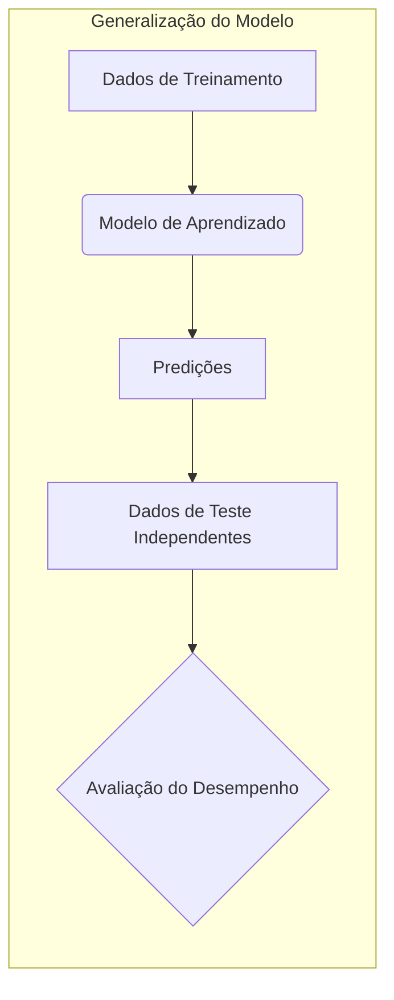
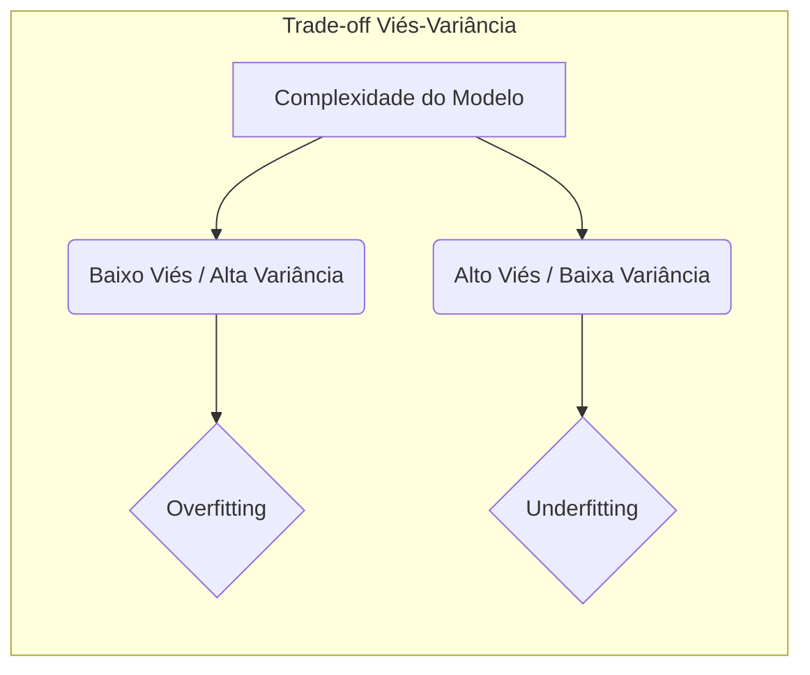
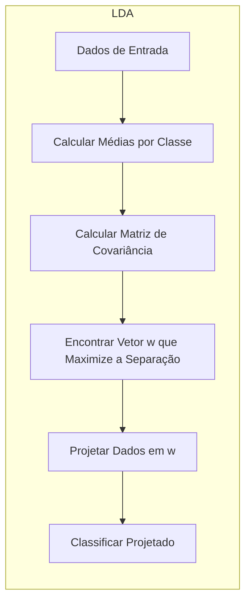
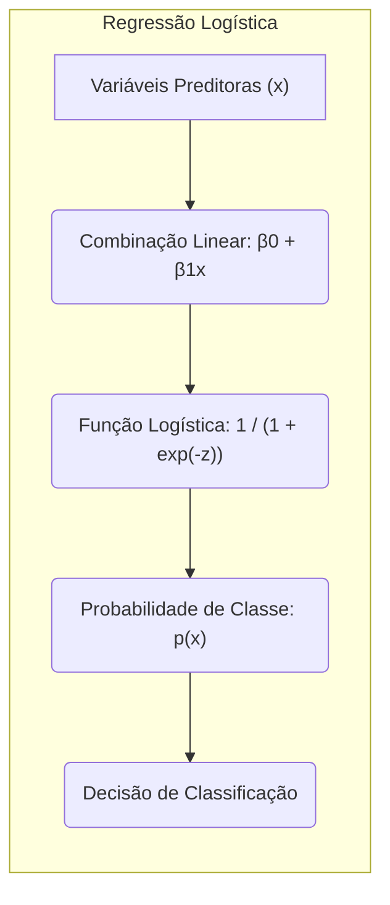
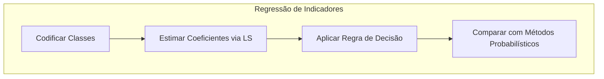
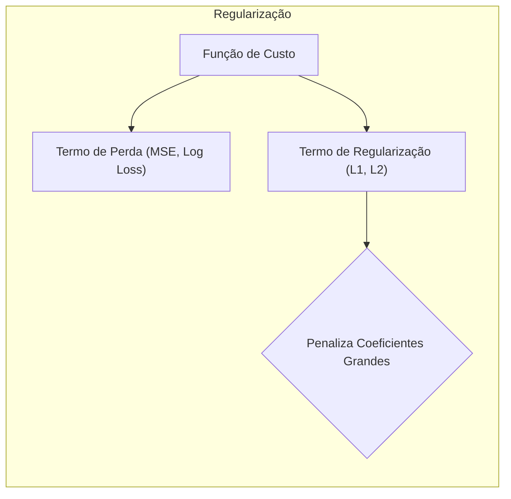
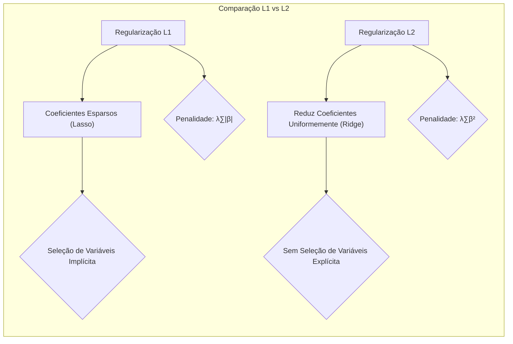
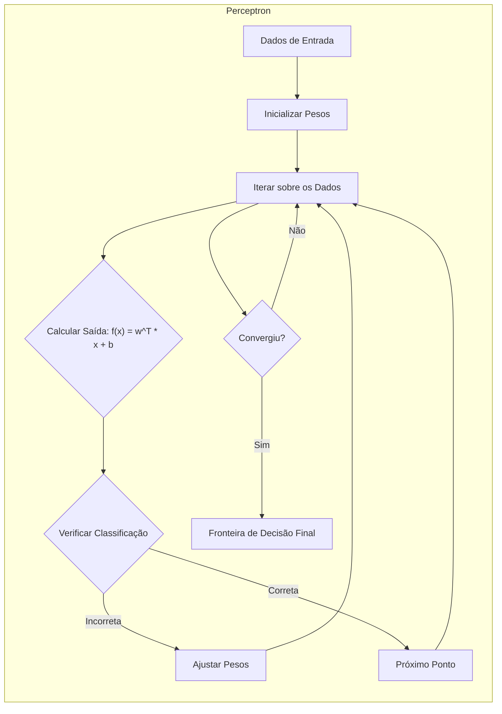

## Avaliação e Seleção de Modelos em Métodos de Ajuste Linear



### Introdução
O desempenho de **generalização** de um método de aprendizado refere-se à sua capacidade preditiva em dados de teste independentes. A avaliação desse desempenho é crucial na prática, pois orienta a escolha do método de aprendizado ou modelo e fornece uma medida da qualidade do modelo selecionado [^7.1]. Este capítulo explora métodos para avaliar o desempenho e como eles são usados para selecionar modelos, começando com a discussão da interação entre **viés**, **variância** e **complexidade do modelo** [^7.1].

### Conceitos Fundamentais
**Conceito 1: Problema de Classificação e Métodos Lineares**
O problema de classificação envolve atribuir um rótulo de classe a uma entrada com base em um conjunto de dados de treinamento. Modelos lineares, como a regressão linear aplicada a uma matriz indicadora de classe, são frequentemente utilizados devido à sua simplicidade e interpretabilidade. No entanto, o uso de tais modelos lineares pode levar a um trade-off entre **viés** (o quão distante a predição média do modelo está do valor real) e **variância** (a sensibilidade das predições do modelo a variações nos dados de treinamento) [^7.2]. Por exemplo, modelos excessivamente complexos podem se ajustar perfeitamente aos dados de treinamento (baixo viés), mas podem generalizar mal para novos dados (alta variância), um fenômeno conhecido como *overfitting*.

> 💡 **Exemplo Numérico:** Considere um dataset com 100 pontos, onde a relação real é quadrática ($y = x^2 + \epsilon$, com $\epsilon$ sendo um ruído aleatório). Se usarmos um modelo linear simples ($y = \beta_0 + \beta_1x$), teremos um alto viés porque o modelo não captura a curvatura dos dados. Se usarmos um modelo polinomial de grau 9 ($y = \beta_0 + \beta_1x + \ldots + \beta_9x^9$), poderemos obter um ajuste perfeito aos dados de treinamento (baixo viés no treinamento), mas a alta variância fará com que o modelo se ajuste muito ao ruído, generalizando mal para novos dados.
    
    ```python
    import numpy as np
    import matplotlib.pyplot as plt
    from sklearn.linear_model import LinearRegression
    from sklearn.preprocessing import PolynomialFeatures
    from sklearn.metrics import mean_squared_error

    # Generate synthetic data
    np.random.seed(42)
    X = np.sort(np.random.rand(100) * 10)
    y = X**2 + np.random.randn(100) * 5

    # Linear model
    linear_model = LinearRegression()
    linear_model.fit(X.reshape(-1, 1), y)
    y_linear_pred = linear_model.predict(X.reshape(-1, 1))
    mse_linear = mean_squared_error(y, y_linear_pred)

    # Polynomial model (degree 9)
    poly_features = PolynomialFeatures(degree=9)
    X_poly = poly_features.fit_transform(X.reshape(-1, 1))
    poly_model = LinearRegression()
    poly_model.fit(X_poly, y)
    y_poly_pred = poly_model.predict(X_poly)
    mse_poly = mean_squared_error(y, y_poly_pred)

    # Plotting
    plt.figure(figsize=(10, 5))
    plt.scatter(X, y, color='blue', label='Dados Originais')
    plt.plot(X, y_linear_pred, color='red', label=f'Linear (MSE={mse_linear:.2f})')
    plt.plot(X, y_poly_pred, color='green', label=f'Polinomial (MSE={mse_poly:.2f})')
    plt.xlabel('X')
    plt.ylabel('y')
    plt.title('Bias-Variance Tradeoff')
    plt.legend()
    plt.show()
    ```
    
    Este exemplo demonstra que, embora o modelo polinomial se ajuste melhor aos dados de treinamento (menor MSE), ele pode não generalizar bem para novos dados devido à sua alta complexidade e variância.



**Lemma 1:** Dada uma função discriminante linear $f(x) = w^Tx + b$, onde $w$ é o vetor de pesos e $b$ é o bias, a superfície de decisão $f(x) = 0$ divide o espaço de entrada em regiões distintas, cada uma correspondente a uma classe [^4.3]. A escolha de $w$ e $b$ determina a orientação e posição dessa superfície, influenciando o desempenho da classificação.

$$f(x) = w^Tx + b$$
$$f(x) = 0 \implies w^Tx = -b$$

*Prova:* A equação $w^Tx + b = 0$ define um hiperplano no espaço de características. A função discriminante $f(x)$ gera valores positivos para um lado deste hiperplano (uma classe) e valores negativos para o outro lado (outra classe). Portanto, a escolha adequada dos parâmetros $w$ e $b$ é fundamental para a separação eficaz das classes. $\blacksquare$

**Conceito 2: Linear Discriminant Analysis (LDA)**
A **Linear Discriminant Analysis (LDA)** é um método de classificação que assume que as classes são geradas a partir de distribuições Gaussianas com as mesmas matrizes de covariância [^4.3]. O objetivo da LDA é encontrar a melhor combinação linear das características para separar as classes, projetando os dados em um espaço de dimensão inferior maximizando a separação entre as médias das classes e minimizando a variância dentro de cada classe [^4.3.1], [^4.3.2], [^4.3.3].

> 💡 **Exemplo Numérico:** Imagine um dataset com duas classes, onde cada classe tem duas features. A Classe 1 tem média $\mu_1 = [2, 2]$ e a Classe 2 tem média $\mu_2 = [5, 5]$. Ambas as classes compartilham a mesma matriz de covariância, por exemplo, $\Sigma = \begin{bmatrix} 1 & 0.5 \\ 0.5 & 1 \end{bmatrix}$. A LDA irá encontrar um vetor $w$ que maximiza a distância entre as projeções das médias das classes e minimiza a variância dentro das classes. Em termos práticos, o vetor $w$ define a direção na qual os dados serão projetados para melhor separar as classes.
   
   ```python
   import numpy as np
   import matplotlib.pyplot as plt
   from sklearn.discriminant_analysis import LinearDiscriminantAnalysis

   # Generate synthetic data
   np.random.seed(42)
   mean1 = [2, 2]
   mean2 = [5, 5]
   cov = [[1, 0.5], [0.5, 1]]
   X1 = np.random.multivariate_normal(mean1, cov, 100)
   X2 = np.random.multivariate_normal(mean2, cov, 100)
   X = np.vstack((X1, X2))
   y = np.hstack((np.zeros(100), np.ones(100)))

   # Apply LDA
   lda = LinearDiscriminantAnalysis()
   lda.fit(X, y)
   X_lda = lda.transform(X)

    # Calculate the linear decision boundary
   w = lda.coef_[0]
   b = lda.intercept_[0]
   x_min, x_max = X[:, 0].min() - 1, X[:, 0].max() + 1
   y_min, y_max = X[:, 1].min() - 1, X[:, 1].max() + 1
   xx, yy = np.meshgrid(np.linspace(x_min, x_max, 100), np.linspace(y_min, y_max, 100))
   Z = lda.predict(np.c_[xx.ravel(), yy.ravel()])
   Z = Z.reshape(xx.shape)
   
   # Plotting
   plt.figure(figsize=(10, 5))
   plt.subplot(1, 2, 1)
   plt.scatter(X1[:, 0], X1[:, 1], color='blue', label='Class 0')
   plt.scatter(X2[:, 0], X2[:, 1], color='red', label='Class 1')
   plt.contourf(xx, yy, Z, alpha=0.3, cmap=plt.cm.RdBu)
   plt.xlabel('Feature 1')
   plt.ylabel('Feature 2')
   plt.title('Original Data with LDA Boundary')
   plt.legend()
    
   plt.subplot(1, 2, 2)
   plt.scatter(X_lda[y==0], np.zeros(100), color='blue', label='Class 0')
   plt.scatter(X_lda[y==1], np.zeros(100), color='red', label='Class 1')
   plt.xlabel('LDA Projection')
   plt.title('LDA Projection')
   plt.legend()
   plt.tight_layout()
   plt.show()
   ```
   
   Neste exemplo, a LDA projeta os dados em uma dimensão, maximizando a separação entre as médias das classes e minimizando a variância dentro de cada classe. A linha vertical em um gráfico separa as projeções.



**Corolário 1:** A função discriminante linear da LDA pode ser expressa como uma projeção dos dados para um espaço de menor dimensão, onde a separação entre as classes é maximizada. Essa projeção pode ser obtida através do cálculo dos autovetores da matriz de covariância conjunta, seguida pela projeção dos dados nestes autovetores [^4.3.1].

$$W = S_W^{-1}S_B$$
Onde $S_W$ é a matriz de covariância *within-class* e $S_B$ é a matriz de covariância *between-class*. Os autovetores de $W$ definem as direções de máxima separabilidade das classes.

**Conceito 3: Regressão Logística**
A **Regressão Logística** é um modelo estatístico que estima a probabilidade de uma entrada pertencer a uma classe específica, utilizando uma função logística para modelar a relação entre as variáveis preditoras e a probabilidade de saída [^4.4]. O modelo é ajustado maximizando a verossimilhança dos dados observados, ou seja, a probabilidade de observar os rótulos de classe dados os valores das características [^4.4.1], [^4.4.2]. A **função logit** transforma a probabilidade de uma classe em uma escala linear, que é modelada como uma combinação linear de parâmetros e características [^4.4.3].

A função logística é definida como:

$$p(x) = \frac{1}{1 + e^{-(\beta_0 + \beta_1x)}}$$

Onde $p(x)$ é a probabilidade de pertencer à classe 1 e $\beta_0$ e $\beta_1$ são os parâmetros do modelo.
> ⚠️ **Nota Importante**: A regressão logística é especialmente útil quando a variável resposta é binária ou categórica, e ela não assume uma distribuição gaussiana nos erros [^4.4.1].
> ❗ **Ponto de Atenção**: Em situações onde as classes não são balanceadas, a regressão logística pode precisar de ajustes para evitar o viés para a classe majoritária [^4.4.2].
> ✔️ **Destaque**: A regressão logística, assim como a LDA, busca uma fronteira linear entre as classes, mas usando uma função logística para estimar as probabilidades [^4.5].

> 💡 **Exemplo Numérico:** Considere um problema de classificação binária onde temos uma única variável preditora, 'idade' e a variável alvo é 'comprou_produto' (0 ou 1). Após o treinamento de um modelo de regressão logística, obtemos os coeficientes: $\beta_0 = -5$ e $\beta_1 = 0.2$. Então, para uma pessoa com 30 anos, a probabilidade de comprar o produto é:

> $$p(idade=30) = \frac{1}{1 + e^{-(-5 + 0.2*30)}} = \frac{1}{1 + e^{-1}} \approx \frac{1}{1 + 0.368} \approx 0.73 $$
> Isso indica uma probabilidade de 73% da pessoa comprar o produto.

    ```python
    import numpy as np
    import matplotlib.pyplot as plt
    from sklearn.linear_model import LogisticRegression
    from sklearn.metrics import classification_report, confusion_matrix

    # Generate synthetic data
    np.random.seed(42)
    age = np.random.randint(18, 65, 200)
    prob = 1 / (1 + np.exp(-(-5 + 0.2*age) )) # Logit function
    bought = np.random.binomial(1, prob)

    # Logistic regression model
    log_model = LogisticRegression()
    log_model.fit(age.reshape(-1, 1), bought)

    # Predictions
    age_range = np.linspace(18, 65, 100).reshape(-1, 1)
    y_prob = log_model.predict_proba(age_range)[:, 1]

    # Decision boundary
    decision_boundary = -log_model.intercept_[0] / log_model.coef_[0][0]
    # Metrics
    y_pred = log_model.predict(age.reshape(-1, 1))
    print("Classification Report:\n", classification_report(bought, y_pred))
    print("Confusion Matrix:\n", confusion_matrix(bought, y_pred))
    
    # Plotting
    plt.figure(figsize=(8, 6))
    plt.scatter(age, bought, color='blue', alpha=0.5, label='Data Points')
    plt.plot(age_range, y_prob, color='red', label='Probability Curve')
    plt.axvline(decision_boundary, color='green', linestyle='--', label='Decision Boundary')
    plt.xlabel('Age')
    plt.ylabel('Probability of Buying')
    plt.title('Logistic Regression Example')
    plt.legend()
    plt.grid(True)
    plt.show()
    ```

   Este exemplo ilustra como a regressão logística estima probabilidades de classe e define uma fronteira de decisão baseada nesses valores. O gráfico mostra os pontos de dados, a curva de probabilidade e a fronteira de decisão.



### Regressão Linear e Mínimos Quadrados para Classificação



**Explicação:** O diagrama acima representa o fluxo de dados em um modelo de regressão de indicadores para classificação, um método alternativo que busca uma fronteira de decisão linear no espaço de características [^4.2].

A regressão linear pode ser adaptada para problemas de classificação através da codificação das classes usando uma matriz de indicadores [^4.2]. Por exemplo, em um problema de classificação binária, uma classe pode ser representada por 0 e a outra por 1. O modelo de regressão linear é então ajustado usando o método dos mínimos quadrados, onde o objetivo é minimizar a soma dos quadrados dos erros entre as predições e os valores reais [^4.2]. No entanto, a regressão linear em matrizes de indicadores possui algumas limitações, como a dificuldade em lidar com classes não linearmente separáveis e a possibilidade de gerar predições fora do intervalo [0, 1].

**Lemma 2:** Em certas condições, a projeção nos hiperplanos de decisão gerados pela regressão linear com matriz de indicadores é equivalente à projeção gerada por discriminantes lineares, como a LDA [^4.2], [^4.3]. Essa equivalência ocorre quando os pressupostos de distribuição gaussiana e covariâncias iguais entre as classes, utilizados na LDA, são razoáveis [^4.3].
*Prova:* Suponha que a regressão linear minimize:
$$ \sum_{i=1}^{N} (y_i - \hat{y}_i)^2 $$
onde $y_i$ são os indicadores de classe e $\hat{y}_i$ são as predições do modelo de regressão. Para um problema de classificação binária, a LDA também define um hiperplano que separa as classes, e, sob certas condições, esse hiperplano coincide com o gerado pela regressão linear. $\blacksquare$

**Corolário 2:** A análise da equivalência entre as projeções nos hiperplanos de decisão, estabelecida no Lemma 2, sugere que, em muitas situações práticas, o uso da regressão linear com matrizes de indicadores pode fornecer resultados semelhantes aos da LDA, especialmente quando o objetivo principal é determinar a fronteira de decisão [^4.3].
"Em alguns cenários, conforme apontado em [^4.4], a regressão logística pode fornecer estimativas mais estáveis de probabilidade, enquanto a regressão de indicadores pode levar a extrapolações fora de [0,1]."
"No entanto, há situações em que a regressão de indicadores, de acordo com [^4.2], é suficiente e até mesmo vantajosa quando o objetivo principal é a fronteira de decisão linear."

> 💡 **Exemplo Numérico:** Para ilustrar a regressão de indicadores, vamos considerar um dataset simples com duas classes e duas features. O objetivo é prever a qual classe um ponto pertence, usando regressão linear para matrizes de indicadores.
    
   ```python
    import numpy as np
    import matplotlib.pyplot as plt
    from sklearn.linear_model import LinearRegression
    from sklearn.metrics import mean_squared_error

    # Generate synthetic data
    np.random.seed(42)
    X = np.random.rand(100, 2) * 10
    y = np.array([0 if x[0] + x[1] < 10 else 1 for x in X]) # Classes are roughly separated by x1 + x2 = 10

    # Linear Regression for indicator matrix
    model = LinearRegression()
    model.fit(X, y)
    
    # Decision Boundary
    x_min, x_max = X[:, 0].min() - 1, X[:, 0].max() + 1
    y_min, y_max = X[:, 1].min() - 1, X[:, 1].max() + 1
    xx, yy = np.meshgrid(np.linspace(x_min, x_max, 100), np.linspace(y_min, y_max, 100))
    Z = model.predict(np.c_[xx.ravel(), yy.ravel()])
    Z = np.round(Z)
    Z = Z.reshape(xx.shape)
    
    # Predictions
    y_pred = np.round(model.predict(X))
    mse = mean_squared_error(y, y_pred)

    # Plotting
    plt.figure(figsize=(8, 6))
    plt.scatter(X[:, 0], X[:, 1], c=y, cmap=plt.cm.RdBu, edgecolors='k', label='Data Points')
    plt.contourf(xx, yy, Z, alpha=0.3, cmap=plt.cm.RdBu)
    plt.xlabel('Feature 1')
    plt.ylabel('Feature 2')
    plt.title(f'Linear Regression for Classification (MSE={mse:.2f})')
    plt.legend()
    plt.show()
   ```
   
   Este exemplo demonstra como a regressão linear pode ser utilizada para classificação, apesar das limitações como a possível extrapolação fora do intervalo [0, 1]. A fronteira de decisão é linear, representada pelo contorno no gráfico, e a cor dos pontos indica a classe real.

### Métodos de Seleção de Variáveis e Regularização em Classificação


A seleção de variáveis e a regularização são técnicas importantes para melhorar a performance de modelos classificatórios, especialmente em situações onde existem muitas variáveis preditoras [^4.4.4], [^4.5]. A regularização adiciona termos de penalização à função de custo, que força os parâmetros do modelo a assumir valores menores, o que ajuda a evitar o *overfitting* e melhorar a generalização [^4.5.1]. As penalidades L1 (Lasso) e L2 (Ridge) são frequentemente utilizadas nesse contexto. A penalidade L1 tende a gerar modelos mais esparsos, definindo alguns coeficientes como exatamente zero, enquanto a penalidade L2 reduz os coeficientes de forma mais uniforme [^4.4.4]. O **Elastic Net**, é uma combinação das penalidades L1 e L2, que combina as vantagens de ambas [^4.5].

> 💡 **Exemplo Numérico:** Vamos considerar um modelo de regressão logística para prever se um paciente tem uma doença com base em 10 características. Para evitar o overfitting e melhorar a interpretabilidade, aplicamos regularização L1 (Lasso) e L2 (Ridge) e comparamos os resultados.

```python
import numpy as np
import pandas as pd
import matplotlib.pyplot as plt
from sklearn.model_selection import train_test_split
from sklearn.linear_model import LogisticRegression
from sklearn.preprocessing import StandardScaler
from sklearn.metrics import accuracy_score, classification_report
from sklearn.pipeline import Pipeline

# Generate synthetic data
np.random.seed(42)
n_samples = 200
n_features = 10
X = np.random.rand(n_samples, n_features)
true_coefs = np.array([3, -2, 0, 0.8, -0.5, 1.2, 0, 0, -0.3, 0.7]) # Only a few variables are relevant
y_prob = 1 / (1 + np.exp(-(np.dot(X, true_coefs))))
y = np.random.binomial(1, y_prob)

# Split data
X_train, X_test, y_train, y_test = train_test_split(X, y, test_size=0.3, random_state=42)

# Standardize features
scaler = StandardScaler()
X_train_scaled = scaler.fit_transform(X_train)
X_test_scaled = scaler.transform(X_test)

# Logistic Regression with L1 and L2 regularization
l1_model = LogisticRegression(penalty='l1', solver='liblinear', C=0.1, random_state=42)
l2_model = LogisticRegression(penalty='l2', C=0.1, random_state=42)

l1_model.fit(X_train_scaled, y_train)
l2_model.fit(X_train_scaled, y_train)

y_pred_l1 = l1_model.predict(X_test_scaled)
y_pred_l2 = l2_model.predict(X_test_scaled)

accuracy_l1 = accuracy_score(y_test, y_pred_l1)
accuracy_l2 = accuracy_score(y_test, y_pred_l2)
print(f"L1 accuracy: {accuracy_l1:.2f}")
print(f"L2 accuracy: {accuracy_l2:.2f}")

print("\nL1 Classification Report:\n", classification_report(y_test, y_pred_l1))
print("\nL2 Classification Report:\n", classification_report(y_test, y_pred_l2))


# Compare coefficients
coefs_l1 = l1_model.coef_.flatten()
coefs_l2 = l2_model.coef_.flatten()

# Create dataframe for comparison
comparison = pd.DataFrame({
    'Feature': [f'Feature {i+1}' for i in range(n_features)],
    'True Coef': true_coefs,
    'L1 Coef': coefs_l1,
    'L2 Coef': coefs_l2
})
print("\nCoefficient Comparison:")
print(comparison)

# Plot the coefficients
plt.figure(figsize=(10, 6))
plt.plot(range(1, n_features + 1), true_coefs, marker='o', linestyle='-', label='True Coefficients', color='blue')
plt.plot(range(1, n_features + 1), coefs_l1, marker='x', linestyle='--', label='L1 Coefficients', color='red')
plt.plot(range(1, n_features + 1), coefs_l2, marker='^', linestyle='-.', label='L2 Coefficients', color='green')
plt.xlabel('Feature Index')
plt.ylabel('Coefficient Value')
plt.title('Comparison of True, L1, and L2 Regularized Coefficients')
plt.legend()
plt.grid(True)
plt.show()

```

  Este exemplo mostra que a regularização L1 leva a coeficientes esparsos (alguns coeficientes são exatamente 0), enquanto a regularização L2 reduz todos os coeficientes, mas não necessariamente para zero. O código também compara os valores dos coeficientes com os valores verdadeiros e mostra o desempenho em termos de acurácia.



**Lemma 3:** A penalização L1 em modelos de classificação logística leva a coeficientes esparsos, o que significa que muitas das variáveis não terão influência na predição [^4.4.4].

*Prova:* A penalização L1 adiciona um termo proporcional à soma dos valores absolutos dos coeficientes à função de custo. Durante a otimização, o modelo tende a zerar os coeficientes que têm pouco impacto no desempenho do modelo, pois isso resulta em uma redução da função de custo total [^4.4.3]. $\blacksquare$
**Corolário 3:** A esparsidade dos coeficientes resultante da penalização L1 pode simplificar a interpretação dos modelos classificatórios, uma vez que apenas as variáveis mais relevantes permanecem no modelo [^4.4.5].
> ⚠️ **Ponto Crucial**: L1 e L2 podem ser combinadas (Elastic Net) para aproveitar vantagens de ambos os tipos de regularização, conforme discutido em [^4.5].

### Separating Hyperplanes e Perceptrons
A ideia de maximizar a **margem de separação** entre as classes leva ao conceito de **hiperplanos ótimos**, onde o objetivo é encontrar um hiperplano que não apenas separe as classes, mas também maximize a distância entre os pontos de dados mais próximos de cada classe [^4.5.2]. Esse problema de otimização pode ser formulado como um problema de programação quadrática, onde as soluções são encontradas a partir de combinações lineares dos pontos de suporte [^4.5.2]. O **Perceptron** de Rosenblatt é um algoritmo simples que aprende a separar linearmente os dados, ajustando os pesos de uma função linear iterativamente até que a convergência seja alcançada. Se os dados são linearmente separáveis, o Perceptron irá convergir para uma solução que separa perfeitamente as classes [^4.5.1].

> 💡 **Exemplo Numérico:** Vamos simular o treinamento de um perceptron para um dataset linearmente separável e mostrar como ele ajusta a fronteira de decisão iterativamente.
 
    ```python
    import numpy as np
    import matplotlib.pyplot as plt
    from sklearn.linear_model import Perceptron
    from sklearn.metrics import accuracy_score

    # Generate synthetic data (linearly separable)
    np.random.seed(42)
    X = np.random.rand(100, 2) * 10
    y = np.array([0 if x[0] - x[1] > 1 else 1 for x in X]) # linear separation

    # Train Perceptron
    perceptron = Perceptron(max_iter=1000, tol=1e-3, random_state=42)
    perceptron.fit(X, y)

    # Decision boundary
    w = perceptron.coef_[0]
    b = perceptron.intercept_[0]
    x_min, x_max = X[:, 0].min() - 1, X[:, 0].max() + 1
    y_min, y_max = X[:, 1].min() - 1, X[:, 1].max() + 1
    xx, yy = np.meshgrid(np.linspace(x_min, x_max, 100), np.linspace(y_min, y_max, 100))
    Z = perceptron.predict(np.c_[xx.ravel(), yy.ravel()])
    Z = Z.reshape(xx.shape)
    
    # Predictions
    y_pred = perceptron.predict(X)
    accuracy = accuracy_score(y, y_pred)
    print(f"Accuracy: {accuracy:.2f}")


    # Plotting
    plt.figure(figsize=(8, 6))
    plt.scatter(X[:, 0], X[:, 1], c=y, cmap=plt.cm.RdBu, edgecolors='k')
    plt.contourf(xx, yy, Z, alpha=0.3, cmap=plt.cm.RdBu)
    plt.xlabel('Feature 1')
    plt.ylabel('Feature 2')
    plt.title(f'Perceptron - Decision Boundary (Accuracy: {accuracy:.2f})')
    plt.show()
    ```

  Este exemplo ilustra como o perceptron ajusta iterativamente os pesos para encontrar uma fronteira de decisão linear. No gráfico, a fronteira é representada pelo contorno, separando os pontos de diferentes classes, e a acurácia é impressa para mostrar a performance.


### Pergunta Teórica Avançada: Quais as diferenças fundamentais entre a formulação de LDA e a Regra de Decisão Bayesiana considerando distribuições Gaussianas com covariâncias iguais?
**Resposta:**
A LDA e a Regra de Decisão Bayesiana (com covariâncias iguais) são métodos de classificação que compartilham muitos pressupostos, mas diferem na sua abordagem de derivação da fronteira de decisão [^4.3]. Ambas assumem que as classes provêm de distribuições Gaussianas com médias e covariâncias, mas enquanto a LDA estima essas médias e covariâncias usando os dados de treinamento e calcula a fronteira de decisão a partir delas, a Regra de Decisão Bayesiana parte da probabilidade condicional (baseada na distribuição Gaussiana) e atribui a cada ponto a classe com maior probabilidade posterior.

**Lemma 4:** Sob a hipótese de distribuições Gaussianas com covariâncias iguais para todas as classes, a fronteira de decisão obtida pela LDA é equivalente àquela obtida pela Regra de Decisão Bayesiana [^4.3], [^4.3.3].
*Prova:* A Regra de Decisão Bayesiana atribui um ponto $x$ à classe $k$ se $P(G=k|X=x)$ é máxima. Sob a hipótese de distribuições Gaussianas com covariâncias iguais, a probabilidade condicional $P(G=k|X=x)$ pode ser escrita como:

$$ P(G=k|X=x) \propto \exp\left(-\frac{1}{2}(x-\mu_k)^T \Sigma^{-1} (x-\mu_k) \right) P(G=k) $$

onde $\mu_k$ é a média da classe $k$ e $\Sigma$ é a matriz de covariância comum.  Tomando o log dessa expressão e desprezando os termos que não dependem de $k$, temos:
$$ \delta_k(x) = x^T\Sigma^{-1}\mu_k - \frac{1}{2}\mu_k^T \Sigma^{-1}\mu_k + \log P(G=k) $$
que é uma função linear de x. A LDA também resulta numa função discriminante linear similar, o que demonstra a equivalência entre as duas abordagens quando as condições são respeitadas.  $\blacksquare