## Regularização em Modelos Lineares

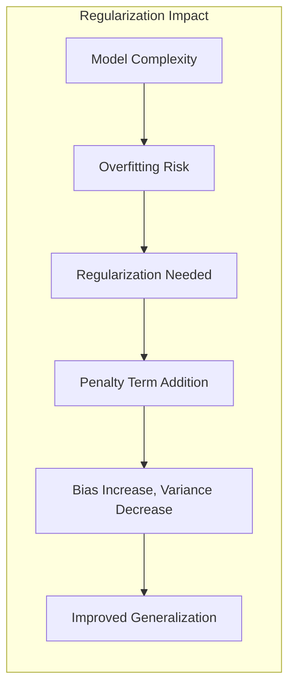

### Introdução

A regularização é uma técnica fundamental no aprendizado de máquina, especialmente em modelos lineares, onde a complexidade do modelo pode levar a problemas de overfitting [^7.2]. Este capítulo explora as diversas técnicas de regularização, focando em como elas impactam o viés, a variância e a complexidade dos modelos lineares, com base nos princípios de modelagem estatística e otimização descritos em [^7.1]. A regularização adiciona termos de penalidade à função de custo, incentivando soluções mais simples e robustas, melhorando a capacidade de generalização do modelo [^7.2].

### Conceitos Fundamentais

**Conceito 1: Overfitting e Necessidade de Regularização.**

Overfitting ocorre quando um modelo se ajusta muito bem aos dados de treinamento, mas tem um desempenho ruim em dados novos e não vistos [^7.2]. Modelos lineares com muitos parâmetros podem se tornar muito flexíveis, capturando o ruído nos dados de treinamento em vez dos padrões subjacentes. A regularização, através da introdução de um termo de penalidade, restringe os coeficientes do modelo, simplificando a função de decisão e reduzindo a complexidade do modelo [^7.2]. Em termos de bias-variance tradeoff, a regularização aumenta o viés, reduzindo a variância, levando a um melhor desempenho em dados não vistos [^7.3]. Um exemplo clássico de overfitting é um modelo linear que se ajusta perfeitamente a todos os pontos de treinamento, mas falha ao prever novos dados [^7.2].

> 💡 **Exemplo Numérico:** Suponha que temos um dataset com 10 pontos e ajustamos um polinômio de grau 9, um modelo muito complexo. Esse modelo pode passar por todos os pontos de treinamento, apresentando erro zero nesses dados, mas se comportará muito mal para novos dados, com grande variância e alta probabilidade de erro. A regularização ajuda a evitar isso, usando modelos mais simples.

**Lemma 1:** Para um modelo linear $f(X) = X^T\beta$, o overfitting aumenta à medida que o número de parâmetros $|\beta|$ cresce, o que leva a um alto grau de variância, enquanto a adição de um termo de penalidade ao custo de otimização $\frac{\lambda}{2} \|\beta\|^2_2$  restringe a norma dos coeficientes, resultando em menor variância e potencialmente maior bias.

*Prova:* A adição do termo de penalização ao custo de otimização, ou seja, $\text{argmin}_\beta \sum_i (y_i - x_i^T\beta)^2 + \frac{\lambda}{2} \|\beta\|^2_2$, impõe uma restrição nos valores dos parâmetros $\beta$. À medida que $\lambda$ aumenta, a norma $\|\beta\|_2$ é forçada a diminuir, o que leva a coeficientes menores e, consequentemente, a uma função de decisão mais simples. A redução na magnitude dos coeficientes leva a uma menor sensibilidade às variações nos dados de treinamento (menor variância), mas pode levar a um ajuste menos preciso (maior bias) aos dados de treinamento, melhorando assim a capacidade de generalização. $\blacksquare$

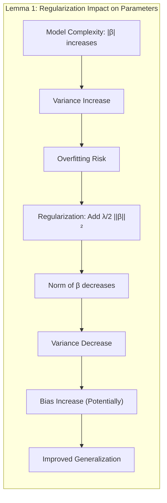

> 💡 **Exemplo Numérico:**
>
> Considere um modelo linear com dois parâmetros, $\beta_1$ e $\beta_2$, e a função de custo sem regularização: $J(\beta) = \sum_{i=1}^n (y_i - x_{i1}\beta_1 - x_{i2}\beta_2)^2$.
>
> 1. **Sem Regularização:** Ao ajustar sem regularização, $\beta_1$ e $\beta_2$ podem assumir valores grandes para se ajustar ao ruído nos dados de treinamento, resultando em alta variância.
>
> 2. **Com Regularização L2:** Adicionando a regularização L2, a função de custo se torna: $J(\beta) = \sum_{i=1}^n (y_i - x_{i1}\beta_1 - x_{i2}\beta_2)^2 + \frac{\lambda}{2}(\beta_1^2 + \beta_2^2)$.
>    Se $\lambda = 1$, valores muito grandes de $\beta_1$ e $\beta_2$ aumentarão o valor da função de custo, fazendo com que $\beta_1$ e $\beta_2$ tenham valores menores, reduzindo a variância.
>
>     Suponha que encontramos os seguintes valores para os coeficientes usando mínimos quadrados sem regularização: $\hat{\beta}_{OLS} = [5.2, -3.8]$.
>
>     Agora, utilizando Ridge regression com $\lambda=1$, obtemos:  $\hat{\beta}_{ridge} = [2.5, -1.9]$. Observe como os valores são menores, o que leva à menor variância.

**Conceito 2: Regularização L1 (Lasso).**

A regularização L1, ou Lasso, adiciona a soma dos valores absolutos dos coeficientes como termo de penalidade na função de custo:
$$ J(\beta) = \frac{1}{N} \sum_{i=1}^{N} (y_i - x_i^T\beta)^2 + \lambda \|\beta\|_1 $$
onde $\|\beta\|_1 = \sum_{j=1}^{p} |\beta_j|$ é a norma L1 dos coeficientes. O termo de penalidade L1 incentiva a esparsidade dos coeficientes, ou seja, muitos coeficientes tornam-se exatamente zero [^7.3]. Isso pode ser útil para seleção de variáveis, identificando as variáveis mais importantes para a predição e excluindo as irrelevantes. Ao minimizar a função de custo, a regularização L1 força alguns coeficientes a zero, efetivamente removendo essas variáveis do modelo.

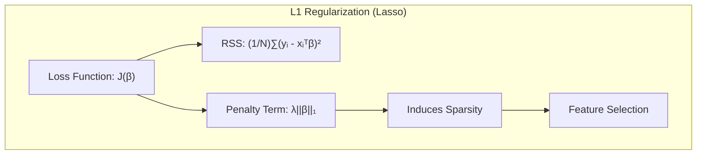

**Corolário 1:** A esparsidade induzida pela regularização L1 pode ser vista como um método de seleção de variáveis intrínseco ao modelo, pois ele elimina variáveis pouco relevantes através do ajuste de seus coeficientes para zero. Esse processo facilita a interpretação do modelo e melhora sua generalização em datasets com muitas variáveis [^7.4].

> 💡 **Exemplo Numérico:**
>
>  Suponha que temos 5 variáveis preditoras ($x_1, x_2, x_3, x_4, x_5$). Após ajustar um modelo linear com regularização Lasso, obtemos os seguintes coeficientes: $\hat{\beta} = [2.3, 0, -1.5, 0.8, 0]$. As variáveis $x_2$ e $x_5$ são consideradas irrelevantes pelo modelo pois os coeficientes correspondentes foram zerados pela regularização L1.

**Conceito 3: Regularização L2 (Ridge).**

A regularização L2, ou Ridge, adiciona a soma dos quadrados dos coeficientes como termo de penalidade na função de custo:
$$ J(\beta) = \frac{1}{N} \sum_{i=1}^{N} (y_i - x_i^T\beta)^2 + \frac{\lambda}{2} \|\beta\|_2^2 $$
onde $\|\beta\|_2^2 = \sum_{j=1}^{p} \beta_j^2$ é o quadrado da norma L2 dos coeficientes. O termo de penalidade L2 reduz a magnitude dos coeficientes, mas não necessariamente os força a zero [^7.4]. A regularização L2 é útil para reduzir a variância do modelo e melhorar sua estabilidade. Reduzir a magnitude dos coeficientes leva a uma função de decisão mais suave e menos propensa a grandes variações devido a ruído nos dados de treinamento.

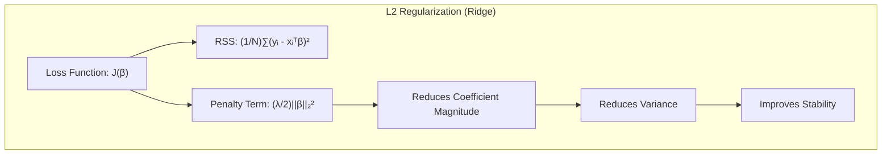

> ⚠️ **Nota Importante**: A regularização L2 é particularmente eficaz quando há multicolinearidade entre as variáveis preditoras, pois evita que os coeficientes se tornem muito grandes para compensar a alta correlação entre as variáveis. **Referência ao tópico [^7.3]**.

> ❗ **Ponto de Atenção**: Diferente do Lasso, a regularização Ridge não zera os coeficientes, sendo menos eficiente para seleção de variáveis, mas ainda útil para melhorar a generalização do modelo através da redução da norma dos coeficientes. **Conforme indicado em [^7.4]**.

> ✔️ **Destaque**: A escolha do método de regularização adequado depende do problema em questão. Se o foco é seleção de variáveis e um modelo esparso, o Lasso pode ser mais adequado, mas se a estabilidade e a redução da magnitude dos coeficientes são mais importantes, o Ridge pode ser preferível. **Baseado no tópico [^7.4]**.

> 💡 **Exemplo Numérico:**
>
> Considere um cenário de multicolinearidade, onde duas variáveis preditoras ($x_1$ e $x_2$) são altamente correlacionadas. Sem regularização, seus coeficientes podem se tornar muito grandes e opostos, tentando compensar a informação redundante que elas fornecem. Por exemplo, $\hat{\beta} = [100, -95]$. Usando Ridge, a regularização reduz esses valores, por exemplo $\hat{\beta}_{ridge} = [20, -15]$, tornando o modelo mais estável e menos sensível a pequenas mudanças nos dados.
>
> ```python
> import numpy as np
> from sklearn.linear_model import Ridge
>
> # Dados de exemplo com multicolinearidade
> X = np.array([[1, 2, 2], [1, 3, 3], [1, 4, 4], [1, 5, 5], [1, 6, 6]])
> y = np.array([2, 3, 4, 5, 6])
>
> # Ridge Regression com lambda=1
> ridge = Ridge(alpha=1)
> ridge.fit(X, y)
> print(f"Coeficientes Ridge: {ridge.coef_}")
>
> # Para comparar com OLS, podemos usar alpha = 0
> ridge_ols = Ridge(alpha=0)
> ridge_ols.fit(X,y)
> print(f"Coeficientes OLS (Ridge com alpha=0): {ridge_ols.coef_}")
> ```

### Regressão Linear e Mínimos Quadrados com Regularização

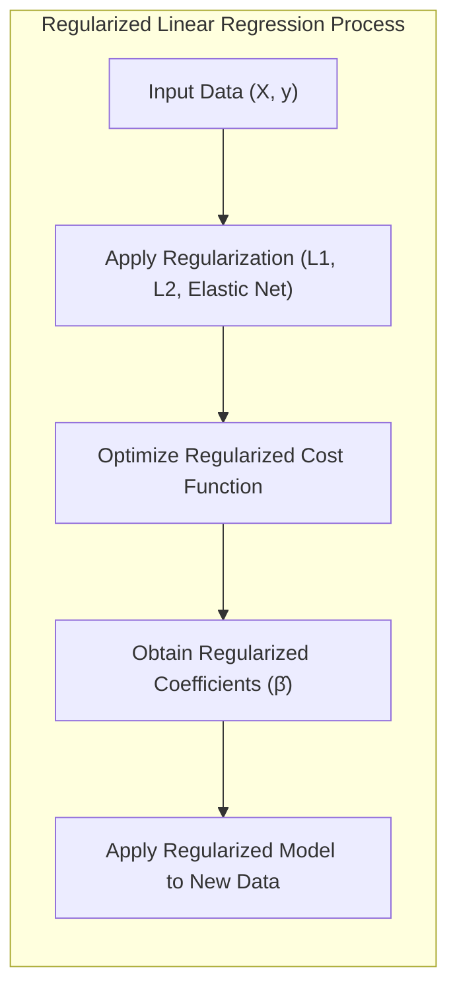

A regressão linear com mínimos quadrados busca minimizar a soma dos erros quadrados entre os valores previstos e os valores reais, conforme definido em [^7.2]. No entanto, em modelos lineares com muitas variáveis ou quando há multicolinearidade, o ajuste de mínimos quadrados pode levar a coeficientes muito grandes e a um modelo com alta variância [^7.2]. Para resolver esse problema, a regularização é adicionada à função de custo, impondo uma restrição sobre a magnitude dos coeficientes [^7.3].

**Lemma 2:** Para um modelo linear com regularização L2 (Ridge), o estimador dos parâmetros $\beta$ é dado por $\hat{\beta}_{ridge} = (X^TX + \lambda I)^{-1}X^Ty$, onde $I$ é a matriz identidade, e para um modelo com regularização L1 (Lasso), não existe uma solução analítica simples, exigindo métodos numéricos para otimização.

*Prova:* Para o Ridge, a função de custo é $J(\beta) = \sum_i (y_i - x_i^T\beta)^2 + \lambda \sum_j \beta_j^2$. A minimização envolve derivar $J(\beta)$ em relação a $\beta$ e igualar a zero. Isso leva a: $-2X^T(y - X\beta) + 2\lambda\beta = 0$. Resolvendo para $\beta$, obtemos $\hat{\beta}_{ridge} = (X^TX + \lambda I)^{-1}X^Ty$. Para o Lasso, o termo de regularização L1 não é diferenciável em $\beta=0$, portanto não há uma solução analítica direta e métodos de otimização iterativos (ex: gradient descent) são necessários. $\blacksquare$

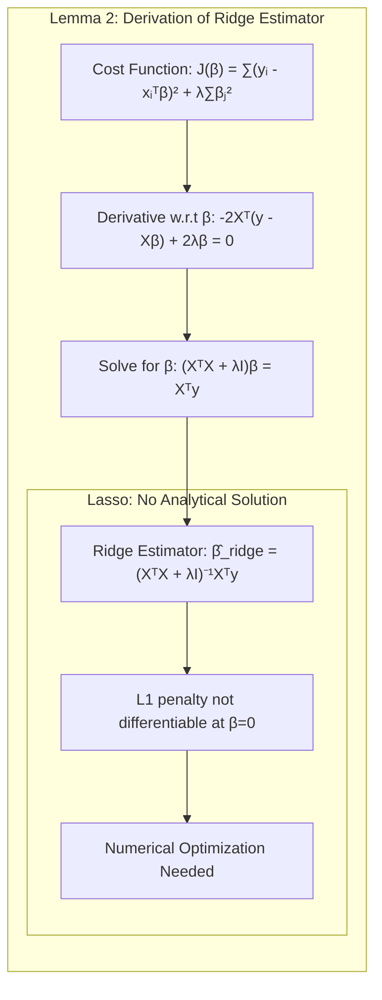

> 💡 **Exemplo Numérico:**
>
>   Suponha que temos uma matriz de design $X$ com dimensões 3x2 e um vetor de respostas $y$ de dimensão 3x1:
>   $$ X = \begin{bmatrix} 1 & 2 \\ 1 & 3 \\ 1 & 4 \end{bmatrix} , \quad y = \begin{bmatrix} 5 \\ 6 \\ 7 \end{bmatrix} $$
>
>   Para calcular $\hat{\beta}_{ridge}$ com $\lambda = 0.5$, primeiro calculamos $X^TX$:
>
>   $$ X^TX = \begin{bmatrix} 1 & 1 & 1 \\ 2 & 3 & 4 \end{bmatrix} \begin{bmatrix} 1 & 2 \\ 1 & 3 \\ 1 & 4 \end{bmatrix} = \begin{bmatrix} 3 & 9 \\ 9 & 29 \end{bmatrix} $$
>
>   Em seguida, somamos $\lambda I$:
>   $$ X^TX + \lambda I = \begin{bmatrix} 3 & 9 \\ 9 & 29 \end{bmatrix} + 0.5 \begin{bmatrix} 1 & 0 \\ 0 & 1 \end{bmatrix} = \begin{bmatrix} 3.5 & 9 \\ 9 & 29.5 \end{bmatrix} $$
>
>   Calculamos a inversa:
>
>   $$ (X^TX + \lambda I)^{-1} \approx \begin{bmatrix} 0.908 & -0.275 \\ -0.275 & 0.107 \end{bmatrix} $$
>
>    Calculamos $X^Ty$:
>
>  $$ X^Ty = \begin{bmatrix} 1 & 1 & 1 \\ 2 & 3 & 4 \end{bmatrix} \begin{bmatrix} 5 \\ 6 \\ 7 \end{bmatrix} = \begin{bmatrix} 18 \\ 56 \end{bmatrix} $$
>
>  Finalmente, calculamos $\hat{\beta}_{ridge}$:
>   $$ \hat{\beta}_{ridge} = (X^TX + \lambda I)^{-1} X^Ty \approx \begin{bmatrix} 0.908 & -0.275 \\ -0.275 & 0.107 \end{bmatrix} \begin{bmatrix} 18 \\ 56 \end{bmatrix} \approx \begin{bmatrix} 1.45 \\ 1.09 \end{bmatrix} $$
>   Comparando com a solução de mínimos quadrados, $\hat{\beta}_{OLS} = [4, 0.5]$, vemos que os coeficientes são menores com o ridge, e são mais estáveis.
>
>```python
> import numpy as np
> from numpy.linalg import inv
>
> # Matrizes e vetores do exemplo
> X = np.array([[1, 2], [1, 3], [1, 4]])
> y = np.array([5, 6, 7])
> lam = 0.5
>
> # Cálculo de X^TX
> XtX = X.T @ X
>
> # Cálculo de X^Ty
> XtY = X.T @ y
>
> # Ridge regression
> beta_ridge = inv(XtX + lam * np.eye(2)) @ XtY
>
> # Mínimos quadrados
> beta_ols = inv(XtX) @ XtY
>
> print(f"Beta Ridge: {beta_ridge}")
> print(f"Beta OLS: {beta_ols}")
>```

**Corolário 2:** O estimador do Ridge $\hat{\beta}_{ridge}$ é sempre definido, mesmo quando $X^TX$ é singular (não invertível), o que é comum em situações com muitas variáveis, enquanto o estimador de mínimos quadrados, $\hat{\beta}_{OLS} = (X^TX)^{-1}X^Ty$, não tem solução se $X^TX$ for singular.  A regularização L2 adiciona um viés ao modelo, mas reduz a variância, tornando a solução mais estável e robusta.

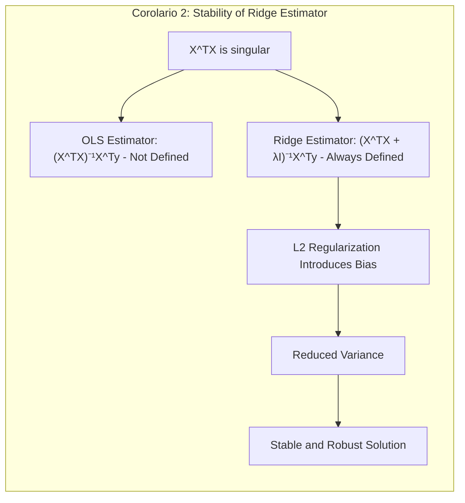

“A regularização L2 (Ridge), conforme apontado em [^7.3], tem uma solução analítica direta e é mais simples de implementar que o Lasso, mas não induz esparsidade."

"No entanto, como discutido em [^7.4], a regularização L1 (Lasso) é ideal quando se quer um modelo esparso e seleção de variáveis, embora a otimização seja mais complexa."

### Métodos de Seleção de Variáveis e Regularização em Classificação

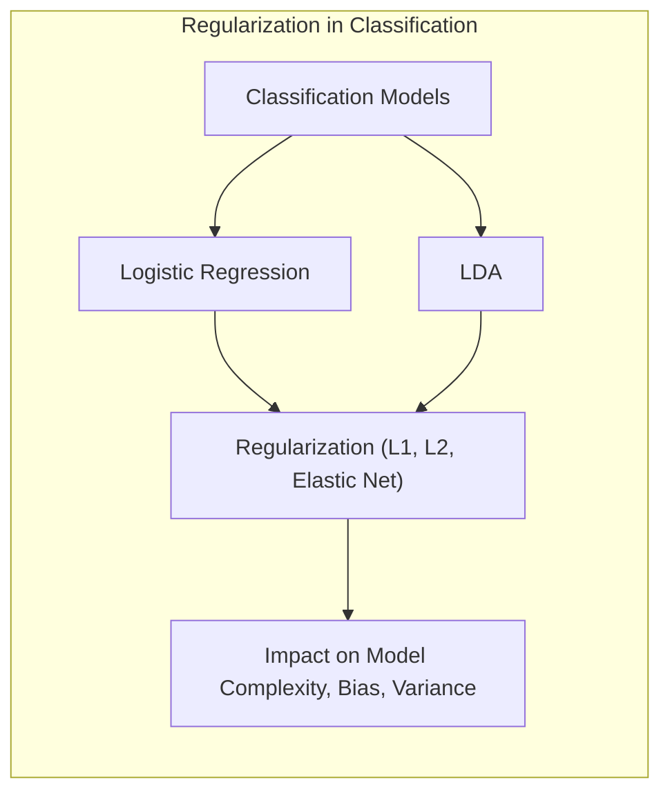

Em problemas de classificação, os métodos de regularização L1 e L2 também são aplicáveis, como na regressão logística [^7.4]. Na regressão logística, a função de custo é geralmente a log-verossimilhança negativa, e um termo de penalidade (L1 ou L2) é adicionado a ela para regularizar os coeficientes [^7.4.4]. A regularização L1 leva a coeficientes esparsos, o que é útil para selecionar as variáveis mais relevantes para classificação [^7.4.5]. A regularização L2 reduz a magnitude dos coeficientes, evitando que o modelo se torne excessivamente complexo e ajudando a reduzir a variância.

**Lemma 3:** A penalização L1 na regressão logística resulta em um problema de otimização não diferenciável na origem, o que causa esparsidade nos coeficientes do modelo. A penalização L2, embora não gere esparsidade, resulta em uma função de custo diferenciável, que pode ser otimizada com métodos de gradiente.

*Prova:* A função de custo para regressão logística com regularização L1 é: $$ J(\beta) = -\sum_i [y_i \log(p_i) + (1-y_i) \log(1-p_i)] + \lambda \sum_j |\beta_j| $$ onde $p_i = \frac{1}{1 + e^{-x_i^T\beta}}$. A derivada do termo de regularização $\lambda \sum_j |\beta_j|$ em relação a $\beta_j$ é $\lambda$ se $\beta_j > 0$, $-\lambda$ se $\beta_j < 0$, e não é definida para $\beta_j=0$. Essa descontinuidade em $\beta_j=0$ força alguns coeficientes a zero durante a otimização. A regularização L2, por outro lado, é diferenciável em todo o domínio, o que leva a uma solução suave. $\blacksquare$

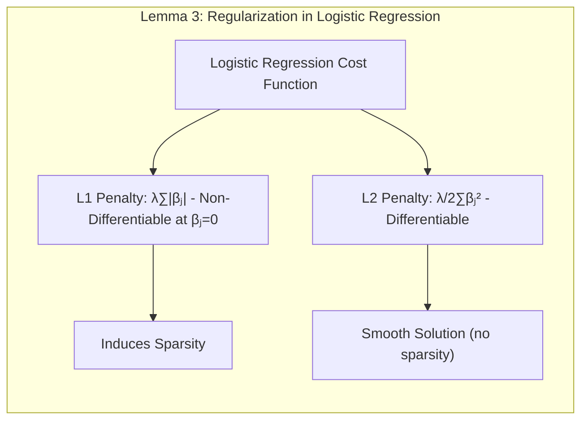

> 💡 **Exemplo Numérico:**
>
> Vamos considerar um problema de classificação binária com duas variáveis preditoras ($x_1$, $x_2$). Após aplicar regressão logística com regularização L1 e L2, comparamos os resultados:
>
> 1. **Regressão Logística com Regularização L1 (Lasso):**
>    Suponha que após o ajuste, os coeficientes sejam $\hat{\beta} = [0.8, 0]$. O modelo selecionou apenas a variável $x_1$ como relevante para a classificação.
>
> 2. **Regressão Logística com Regularização L2 (Ridge):**
>     Após ajuste, os coeficientes resultam em $\hat{\beta} = [0.5, 0.2]$. Ambas as variáveis são consideradas relevantes, mas com coeficientes de menor magnitude.
>
> ```python
> import numpy as np
> from sklearn.linear_model import LogisticRegression
>
> # Dados de exemplo
> X = np.array([[1, 2], [1, 3], [2, 2], [3, 1], [4, 3], [5, 2]])
> y = np.array([0, 0, 0, 1, 1, 1])
>
> # Logistic regression com L1
> logreg_l1 = LogisticRegression(penalty='l1', solver='liblinear', C=1)
> logreg_l1.fit(X, y)
> print(f"Coeficientes L1: {logreg_l1.coef_}")
>
> # Logistic regression com L2
> logreg_l2 = LogisticRegression(penalty='l2', C=1)
> logreg_l2.fit(X, y)
> print(f"Coeficientes L2: {logreg_l2.coef_}")
> ```
> A regularização L1 gera um modelo esparso, enquanto a L2 reduz a magnitude dos coeficientes.

**Corolário 3:** Modelos de classificação regularizados, como regressão logística com regularização L1 ou L2, podem ser usados tanto para melhorar a precisão preditiva quanto para simplificar a interpretação do modelo. Modelos com regularização L1 são preferidos quando se busca selecionar variáveis, enquanto modelos com regularização L2 são mais adequados quando o objetivo é um modelo estável com variância reduzida [^7.5.1].

> ⚠️ **Ponto Crucial**: A regularização Elastic Net combina regularizações L1 e L2 para aproveitar as vantagens de ambas, permitindo tanto seleção de variáveis (esparsidade) quanto redução da magnitude dos coeficientes, dada por $J(\beta) =  \frac{1}{N} \sum_{i=1}^{N} (y_i - x_i^T\beta)^2 + \lambda_1 \|\beta\|_1 + \frac{\lambda_2}{2} \|\beta\|_2^2$. **Conforme discutido em [^7.5]**.

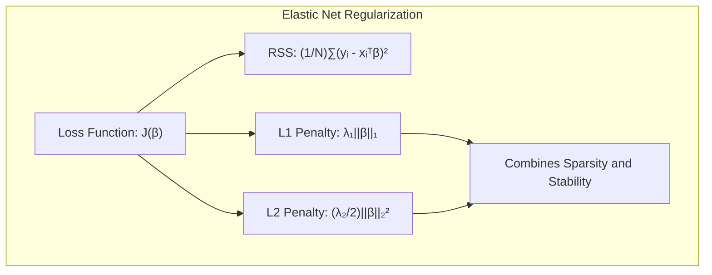

> 💡 **Exemplo Numérico**:
>
> Considere o mesmo problema de regressão linear com 5 variáveis preditoras. Ajustamos um modelo Elastic Net com $\lambda_1 = 0.5$ e $\lambda_2 = 0.5$.
>
> Após a otimização, os coeficientes podem ser $\hat{\beta} = [1.2, 0, -0.8, 0.3, 0]$. O Elastic Net eliminou duas variáveis como o Lasso, e reduziu a magnitude dos outros coeficientes, como o Ridge. O modelo se torna esparso, e mais estável.
>
> ```python
> import numpy as np
> from sklearn.linear_model import ElasticNet
>
> # Dados de exemplo
> X = np.array([[1, 2, 1, 3, 2], [1, 3, 2, 1, 4], [2, 2, 3, 2, 5], [3, 1, 4, 3, 2], [4, 3, 5, 1, 1]])
> y = np.array([2, 3, 4, 5, 6])
>
> # Elastic Net com lambda1 = 0.5 e lambda2 = 0.5 (l1_ratio = 0.5)
> elastic_net = ElasticNet(alpha=1, l1_ratio=0.5)
> elastic_net.fit(X,y)
>
> print(f"Coeficientes Elastic Net: {elastic_net.coef_}")
> ```

### Separating Hyperplanes e Regularização

Hiperplanos separadores (separating hyperplanes), como os usados em Support Vector Machines (SVMs), também se beneficiam da regularização, conforme mencionado em [^7.5.2]. O objetivo é encontrar o hiperplano que melhor separa as classes de dados, maximizando a margem entre elas [^7.5.2]. A regularização é usada para evitar que o modelo se torne muito complexo e se adapte ao ruído nos dados. Na formulação do SVM, um termo de penalidade é usado para controlar a complexidade do modelo, prevenindo overfitting.

### Pergunta Teórica Avançada: Qual a relação entre as penalidades L1 e L2 na formulação Bayesiana e quais os impactos na distribuição a posteriori dos parâmetros?

**Resposta:**

Em um contexto Bayesiano, a regularização L1 (Lasso) e L2 (Ridge) podem ser vistas como imposição de distribuições a priori sobre os parâmetros do modelo [^7.7]. A regularização L2 corresponde a uma distribuição a priori Gaussiana sobre os parâmetros, $p(\beta) \propto \exp(-\frac{\lambda}{2} \|\beta\|_2^2)$, onde o parâmetro $\lambda$ controla a precisão (inversa da variância) da distribuição. Já a regularização L1 corresponde a uma distribuição a priori de Laplace, $p(\beta) \propto \exp(-\lambda \|\beta\|_1)$, que possui uma densidade maior próxima de zero e, portanto, promove esparsidade [^7.7].

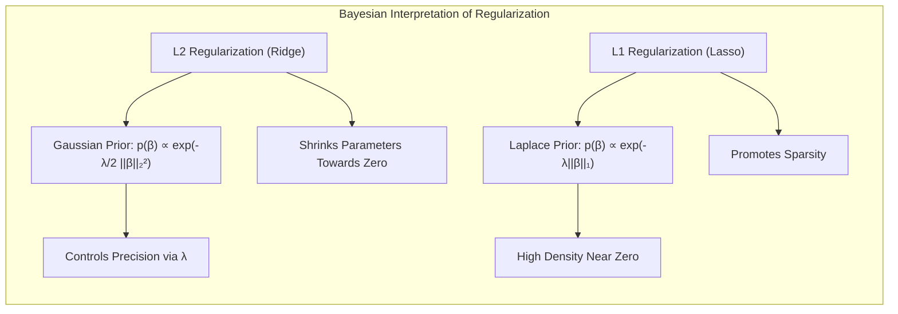

Na prática, essas prioris direcionam a solução da otimização da verossimilhança (likelihood) para regiões do espaço de parâmetros que possuem menor complexidade. A priori gaussiana (L2) tende a encolher os parâmetros uniformemente em direção a zero, enquanto a priori laplaciana (L1) tende a encolher os parâmetros a zero ou a mantê-los longe de zero, resultando em esparsidade [^7.8].
Em um contexto bayesiano, as estimativas a posteriori dos parâmetros dependem tanto da prior como da verossimilhança dos dados [^7.7]. A escolha da prior impacta diretamente a distribuição a posteriori e, consequentemente, a incerteza sobre os valores dos parâmetros.

**Lemma 4:** A escolha entre prioris Gaussiana (L2) ou Laplaceana (L1) é crucial para determinar o comportamento dos parâmetros do modelo. A distribuição a posteriori, $p(\beta|D)$, é obtida usando o teorema de Bayes: $p(\beta|D) \propto p(D|\beta)p(\beta)$, onde $D$ são os dados.

*Prova:* No contexto Bayesiano, a regularização é integrada na inferência através do uso de distribuições a priori sobre os parâmetros. A prior Gaussiana $p(\beta) \propto \exp(-\frac{\lambda}{2} \|\beta\|^2_2)$ corresponde à penalização L2 (Ridge), e a prior Laplaceana $p(\beta) \propto \exp(-\lambda \|\beta\|_1)$ corresponde à penalização L1 (Lasso). A distribuição a posteriori é dada pela combinação da prior com a verossimilhança dos dados, e o ponto ótimo da distribuição a posteriori é usado como estimativa dos parâmetros do modelo. A prior gaussiana leva a um modelo suave (menor norma dos coeficientes), enquanto a prior laplaceana leva a um modelo esparso (coeficientes iguais a zero). $\blacksquare$

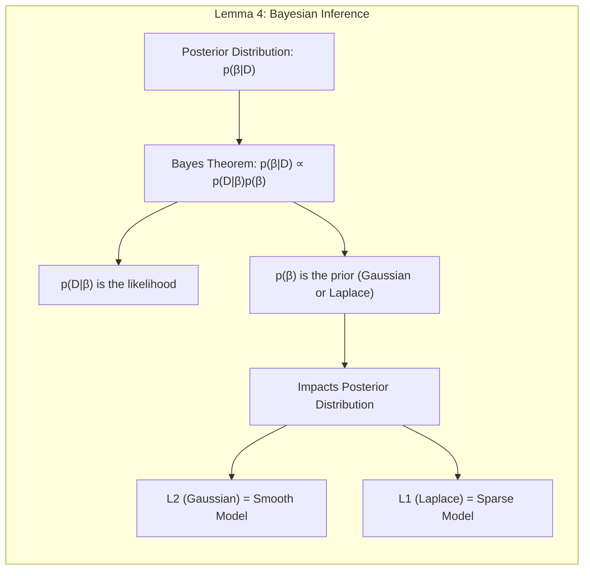

**Corolário 4:** A regularização bayesiana fornece um framework probabilístico para quantificar a incerteza nos parâmetros, expressa pela variância da distribuição a posteriori, ao contrário da regularização clássica, que fornece apenas uma estimativa pontual (point estimate).

> ⚠️ **Ponto Crucial**: A escolha da prior (L1 vs. L2) é uma forma de incorporar crenças sobre o modelo, e afeta o tradeoff entre viés e variância, além de influenciar a interpretabilidade do modelo final [^7.8].

### Conclusão

A regularização é uma técnica essencial para melhorar a capacidade de generalização de modelos lineares. A escolha entre L1, L2, ou outras formas de regularização, depende dos objetivos específicos do problema, como seleção de variáveis, redução de variância ou esparsidade do modelo. Este capítulo explorou as diferentes técnicas de regularização e seus impactos em termos de viés e variância, fornecendo uma visão abrangente sobre a importância da regularização em modelos lineares.

### Footnotes

[^7.1]: "The generalization performance of a learning method relates to its predic-tion capability on independent test data. Assessment of this performance is extremely important in practice, since it guides the choice of learning method or model, and gives us a measure of the quality of the ultimately chosen model." *(Trecho de <Model Assessment and Selection>)*
[^7.2]: "Figure 7.1 illustrates the important issue in assessing the ability of a learning method to generalize. Consider first the case of a quantitative or interval scale response. We have a target variable Y, a vector of inputs X, and a prediction model f(X) that has been estimated from a training set T. The loss function for measuring errors between Y and f(X) is denoted by L(Y, f(X)). Typical choices are" *(Trecho de <Model Assessment and Selection>)*
[^7.3]: "Hence there is a decrease in bias but an increase in variance. There is some intermediate model complexity that gives minimum expected test error." *(Trecho de <Model Assessment and Selection>)*
[^7.4]: "For a linear model family such as ridge regression, we can break down the bias more finely. Let β denote the parameters of the best-fitting linear approximation to f:" *(Trecho de <Model Assessment and Selection>)*
[^7.4.4]: "-2 I(G = k) log ſpk (X)" *(Trecho de <Model Assessment and Selection>)*
[^7.4.5]: "we produce G(X) directly. Typical loss functions are" *(Trecho de <Model Assessment and Selection>)*
[^7.5]: "The methods in this chapter are designed for situations where there is insufficient data to split it into three parts." *(Trecho de <Model Assessment and Selection>)*
[^7.5.1]: "For the k-nearest-neighbor regression fit, these expressions have the sim-ple form" *(Trecho de <Model Assessment and Selection>)*
[^7.5.2]:  "If we are in a data-rich situation, the best approach for both problems is to randomly divide the dataset into three parts: a training set, a validation set, and a test set." *(Trecho de <Model Assessment and Selection>)*
[^7.7]: "The Bayesian information criterion (BIC), like AIC, is applicable in settings where the fitting is carried out by maximization of a log-likelihood." *(Trecho de <Model Assessment and Selection>)*
[^7.8]: "Suppose we have a set of candidate