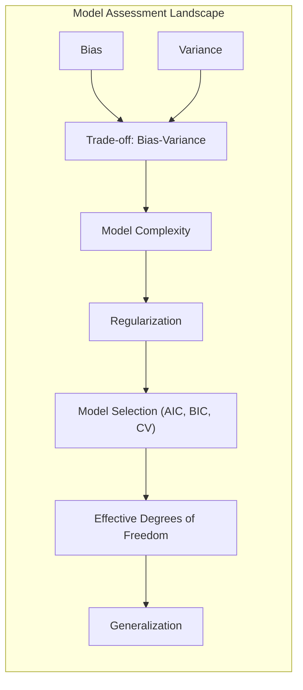
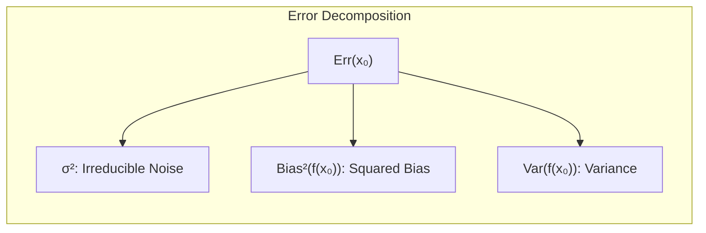
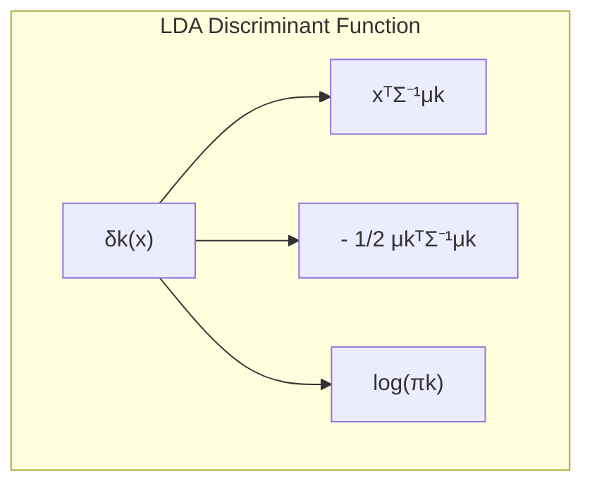
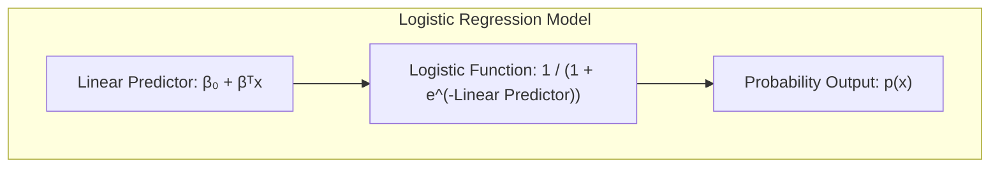
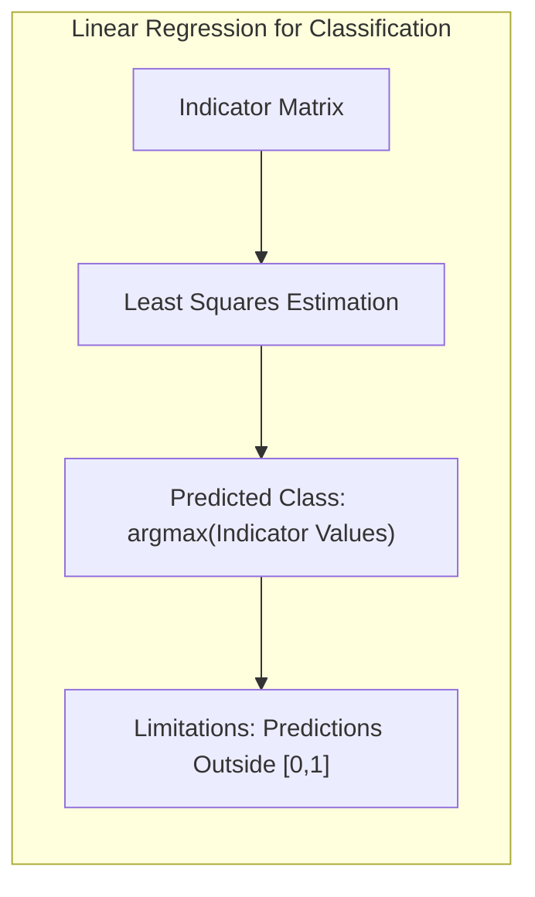
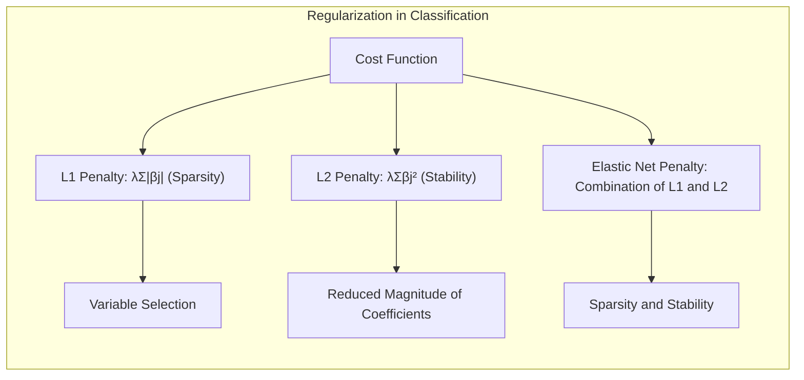

## Model Assessment and Selection: Focusing on the Effective Number of Parameters and Degrees of Freedom



### Introdução

A capacidade de um modelo de aprendizado de generalizar, ou seja, prever com precisão em dados não vistos, é crucial na prática [^7.1]. Avaliar esta capacidade guia a escolha do método ou modelo apropriado e nos dá uma medida da qualidade do modelo final [^7.1]. Este capítulo aborda métodos chave para avaliar o desempenho, incluindo sua relação com o viés, variância e complexidade do modelo [^7.1]. Um foco essencial será o conceito de número efetivo de parâmetros ou graus de liberdade, que quantifica a complexidade do modelo, especialmente em cenários com regularização.

### Conceitos Fundamentais

**Conceito 1: O Problema da Classificação e a Generalização**

O problema de classificação, em sua essência, busca atribuir uma classe (ou rótulo) a um objeto com base em suas características. Métodos lineares, como LDA e regressão logística, são abordagens comuns, mas carregam consigo um *trade-off* entre **viés** e **variância** [^7.1], [^7.2]. Um modelo muito simples (alto viés) pode não capturar a complexidade dos dados, enquanto um modelo muito complexo (alta variância) pode se ajustar excessivamente aos dados de treinamento, generalizando mal para novos dados [^7.2]. Este trade-off é ilustrado na Figura 7.1, onde a complexidade do modelo é variada e observamos o comportamento dos erros de treinamento e teste [^7.2]. O erro de treinamento tende a diminuir com a complexidade, mas o erro de teste tem um comportamento em forma de U, indicando um ponto ótimo onde a generalização é máxima [^7.2].

**Lemma 1:** *A decomposição do erro preditivo em termos de viés e variância oferece uma visão fundamental do comportamento dos modelos*. A decomposição para erro quadrático é dada por:
$$ Err(x_0) = \sigma^2 + Bias^2(f(x_0)) + Var(f(x_0)) $$
Onde:
-   $Err(x_0)$ é o erro preditivo esperado em $x_0$.
-   $\sigma^2$ é a variância do ruído inerente aos dados.
-   $Bias^2(f(x_0))$ é o quadrado do viés, representando o quão longe a predição média do modelo está do valor verdadeiro.
-   $Var(f(x_0))$ é a variância, refletindo a variabilidade das predições do modelo em diferentes conjuntos de treinamento [^7.3].
$\blacksquare$



> 💡 **Exemplo Numérico:** Vamos considerar um cenário onde tentamos modelar uma relação não linear entre uma variável preditora *x* e uma variável resposta *y*. Suponha que a relação verdadeira seja $y = 2x^2 + \epsilon$, onde $\epsilon$ é um ruído aleatório com variância $\sigma^2 = 1$.
>
> 1.  **Modelo Simples (Alto Viés):** Usamos um modelo linear $f(x) = \beta_0 + \beta_1 x$. Este modelo terá alto viés porque não consegue capturar a relação quadrática verdadeira. O viés será grande, pois a predição média estará longe do valor verdadeiro para muitos valores de *x*. A variância será baixa, pois o modelo linear não é muito sensível a mudanças nos dados de treinamento.
>
> 2.  **Modelo Complexo (Alta Variância):** Usamos um modelo polinomial de grau 10, $f(x) = \beta_0 + \beta_1 x + \ldots + \beta_{10} x^{10}$. Este modelo terá baixa viés no conjunto de treinamento, pois pode se ajustar muito bem aos dados, mas terá alta variância. Isso significa que pequenas mudanças nos dados de treinamento podem levar a grandes mudanças nas predições, resultando em uma generalização ruim.
>
> 3.  **Modelo Ideal:** Um modelo quadrático $f(x) = \beta_0 + \beta_1 x + \beta_2 x^2$ poderia ser um bom compromisso, equilibrando viés e variância. O viés seria baixo, pois pode capturar a relação quadrática, e a variância também seria controlada, pois não é um modelo excessivamente complexo.
>
> Suponha que, para um dado $x_0 = 2$, o valor verdadeiro seja $y_0 = 2*(2^2) = 8$. Em um cenário simulado, após treinar os modelos com um conjunto de dados com ruído, poderíamos ter:
>
>    -   **Modelo Linear:** $\hat{f}(x_0) = 5$.  $\text{Bias}^2(f(x_0)) = (8-5)^2 = 9$
>    -   **Modelo Polinomial (grau 10):**  $\hat{f}(x_0) = 7.8$ com um alto nível de variabilidade nas predições quando os dados de treinamento são alterados
>    -   **Modelo Quadrático:** $\hat{f}(x_0) = 7.9$. $\text{Bias}^2(f(x_0)) = (8-7.9)^2 = 0.01$.
>
> O erro esperado para o modelo linear seria aproximadamente $Err(x_0) = 1 + 9 + \text{Variância Linear}$. Para o modelo quadrático, teríamos $Err(x_0) = 1 + 0.01 + \text{Variância Quadrática}$
>
> ```python
> import numpy as np
> import matplotlib.pyplot as plt
> from sklearn.linear_model import LinearRegression
> from sklearn.preprocessing import PolynomialFeatures
> from sklearn.pipeline import make_pipeline
>
> # Dados simulados
> np.random.seed(0)
> x = np.sort(np.random.rand(50)) * 5
> y = 2 * x**2 + np.random.randn(50) * 2
>
> # Modelos
> model_linear = LinearRegression()
> model_poly2 = make_pipeline(PolynomialFeatures(2), LinearRegression())
> model_poly10 = make_pipeline(PolynomialFeatures(10), LinearRegression())
>
> model_linear.fit(x.reshape(-1, 1), y)
> model_poly2.fit(x.reshape(-1, 1), y)
> model_poly10.fit(x.reshape(-1, 1), y)
>
> # Predição em x_0 = 2
> x0 = np.array([2])
> y_pred_linear = model_linear.predict(x0.reshape(1, -1))
> y_pred_poly2 = model_poly2.predict(x0.reshape(1, -1))
> y_pred_poly10 = model_poly10.predict(x0.reshape(1, -1))
>
> print(f"Predição Linear em x=2: {y_pred_linear[0]:.2f}")
> print(f"Predição Polinomial (grau 2) em x=2: {y_pred_poly2[0]:.2f}")
> print(f"Predição Polinomial (grau 10) em x=2: {y_pred_poly10[0]:.2f}")
>
> # Plotagem
> x_plot = np.linspace(0, 5, 100)
> y_plot_linear = model_linear.predict(x_plot.reshape(-1, 1))
> y_plot_poly2 = model_poly2.predict(x_plot.reshape(-1, 1))
> y_plot_poly10 = model_poly10.predict(x_plot.reshape(-1, 1))
>
> plt.scatter(x, y, color='black', label='Dados Observados')
> plt.plot(x_plot, y_plot_linear, color='red', label='Regressão Linear')
> plt.plot(x_plot, y_plot_poly2, color='blue', label='Regressão Polinomial (grau 2)')
> plt.plot(x_plot, y_plot_poly10, color='green', label='Regressão Polinomial (grau 10)')
> plt.scatter(x0, 2 * x0**2, color='purple', label='Valor verdadeiro em x=2', marker='*', s=100)
> plt.legend()
> plt.xlabel("x")
> plt.ylabel("y")
> plt.title("Comparação de modelos com diferentes complexidades")
> plt.show()
> ```
> Este exemplo ilustra como diferentes modelos com diferentes complexidades (e consequentemente, diferentes graus de liberdade) podem se comportar de forma distinta, impactando o viés e a variância.

**Conceito 2: Linear Discriminant Analysis (LDA)**

A **Linear Discriminant Analysis (LDA)** é um método de classificação que busca projetar os dados em um espaço de menor dimensão, maximizando a separabilidade entre as classes [^7.3]. Assume que as classes seguem distribuições Gaussianas com a mesma matriz de covariância, o que resulta em uma fronteira de decisão linear [^7.3], [^7.3.1], [^7.3.2]. O objetivo é encontrar a direção que melhor separa as médias das classes, enquanto minimiza a variância dentro de cada classe [^7.3.3]. A função discriminante linear é da forma $\delta_k(x) = x^T \Sigma^{-1} \mu_k - \frac{1}{2} \mu_k^T \Sigma^{-1} \mu_k + \log \pi_k$, onde $\mu_k$ é a média da classe *k*, $\Sigma$ é a covariância comum e $\pi_k$ é a probabilidade a priori da classe *k* [^7.3].



**Corolário 1:** *Sob as suposições de normalidade e covariâncias iguais, as projeções definidas pela LDA são ótimas em termos de separação das classes*, conforme demonstrado pela análise teórica de seus fundamentos [^7.3.1]. Esta otimalidade é restrita pelas suposições e não se mantém quando as covariâncias diferem significativamente entre as classes [^7.3.3].

> 💡 **Exemplo Numérico:**  Considere um problema de classificação binária com duas classes, A e B. Suponha que tenhamos duas variáveis preditoras, $x_1$ e $x_2$. As médias das classes são $\mu_A = [1, 1]$ e $\mu_B = [3, 3]$, e a matriz de covariância comum é $\Sigma = \begin{bmatrix} 1 & 0.5 \\ 0.5 & 1 \end{bmatrix}$.  As probabilidades a priori são $\pi_A = 0.4$ e $\pi_B = 0.6$.
>
> A função discriminante para a classe A seria:
>
> $\delta_A(x) = x^T \Sigma^{-1} \mu_A - \frac{1}{2} \mu_A^T \Sigma^{-1} \mu_A + \log \pi_A$
>
> Similarmente para a classe B:
>
> $\delta_B(x) = x^T \Sigma^{-1} \mu_B - \frac{1}{2} \mu_B^T \Sigma^{-1} \mu_B + \log \pi_B$
>
> Primeiro, calculamos a inversa da matriz de covariância:
>
> $\Sigma^{-1} = \frac{1}{(1*1) - (0.5*0.5)} \begin{bmatrix} 1 & -0.5 \\ -0.5 & 1 \end{bmatrix} = \frac{1}{0.75} \begin{bmatrix} 1 & -0.5 \\ -0.5 & 1 \end{bmatrix} = \begin{bmatrix} 4/3 & -2/3 \\ -2/3 & 4/3 \end{bmatrix}$
>
> Agora podemos computar $\delta_A(x)$ e $\delta_B(x)$. Por exemplo, para um ponto $x = [2, 2]$:
>
>  $\delta_A(x) = [2, 2] \begin{bmatrix} 4/3 & -2/3 \\ -2/3 & 4/3 \end{bmatrix} [1, 1]^T - \frac{1}{2} [1, 1] \begin{bmatrix} 4/3 & -2/3 \\ -2/3 & 4/3 \end{bmatrix} [1, 1]^T + \log 0.4$
>
>  $\delta_A(x) = [2, 2] [2/3, 2/3]^T - \frac{1}{2} [1, 1] [2/3, 2/3]^T + \log 0.4 = 8/3 - 2/3 + \log 0.4  \approx 2 + \log 0.4 \approx 1.08$
>
>  $\delta_B(x) = [2, 2] \begin{bmatrix} 4/3 & -2/3 \\ -2/3 & 4/3 \end{bmatrix} [3, 3]^T - \frac{1}{2} [3, 3] \begin{bmatrix} 4/3 & -2/3 \\ -2/3 & 4/3 \end{bmatrix} [3, 3]^T + \log 0.6$
>
>  $\delta_B(x) = [2, 2] [2, 2]^T - \frac{1}{2} [3, 3] [2, 2]^T + \log 0.6 = 8 - 6 + \log 0.6 \approx 2 + \log 0.6 \approx 1.49$
>
> Como $\delta_B(x) > \delta_A(x)$, o ponto *x* seria classificado como pertencente à classe B.
>
> ```python
> import numpy as np
> from numpy.linalg import inv
>
> # Dados de exemplo
> mu_A = np.array([1, 1])
> mu_B = np.array([3, 3])
> Sigma = np.array([[1, 0.5], [0.5, 1]])
> pi_A = 0.4
> pi_B = 0.6
> x = np.array([2, 2])
>
> # Calcula a inversa da matriz de covariância
> Sigma_inv = inv(Sigma)
>
> # Calcula a função discriminante para a classe A
> delta_A = x @ Sigma_inv @ mu_A - 0.5 * mu_A @ Sigma_inv @ mu_A + np.log(pi_A)
>
> # Calcula a função discriminante para a classe B
> delta_B = x @ Sigma_inv @ mu_B - 0.5 * mu_B @ Sigma_inv @ mu_B + np.log(pi_B)
>
> print(f"Função discriminante para a classe A: {delta_A:.2f}")
> print(f"Função discriminante para a classe B: {delta_B:.2f}")
>
> if delta_A > delta_B:
>  print("O ponto x é classificado como classe A")
> else:
>  print("O ponto x é classificado como classe B")
> ```
> Este exemplo demonstra como a LDA calcula as funções discriminantes para classificar pontos em diferentes classes. A decisão de qual classe atribuir a um ponto é feita com base no valor da função discriminante.

**Conceito 3: Logistic Regression**

A **Logistic Regression** é um modelo que estima a probabilidade de um evento binário ocorrer. Em vez de modelar diretamente a classe, ela modela a probabilidade da classe por meio da função logística, cuja forma é $p(x) = \frac{1}{1 + e^{-(\beta_0 + \beta^T x)}}$ [^7.4]. O logit, dado por $\log(\frac{p(x)}{1-p(x)})$, é modelado como uma função linear das variáveis preditoras. Os parâmetros $\beta$ são estimados por máxima verossimilhança [^7.4.1], [^7.4.2], [^7.4.3]. A **Logistic Regression** não assume normalidade, mas a função logística impõe uma relação não linear entre as variáveis preditoras e a probabilidade [^7.4.4], [^7.4.5]. Enquanto a LDA é baseada em suposições Gaussianas, a regressão logística é mais flexível [^7.4].



> ⚠️ **Nota Importante**: A **Logistic Regression** oferece uma saída probabilística, permitindo a interpretação da confiança nas predições, algo que a LDA não entrega diretamente [^7.4.1].
> ❗ **Ponto de Atenção**: Em casos de classes não balanceadas, a regressão logística pode ser afetada, necessitando técnicas de balanceamento ou ajuste de pesos [^7.4.2].
> ✔️ **Destaque**: Em alguns cenários, as estimativas de parâmetros em LDA e em regressão logística podem ser relacionadas, principalmente em contextos de separação linear [^7.5].

> 💡 **Exemplo Numérico:** Vamos considerar um problema de classificação binária, onde temos uma variável preditora $x$ e uma variável resposta $y$ (0 ou 1). Suponha que após treinar o modelo de regressão logística, obtemos os seguintes coeficientes: $\beta_0 = -2$ e $\beta_1 = 1$. A probabilidade de *y* ser 1, dado *x*, é então dada por:
>
> $p(x) = \frac{1}{1 + e^{-(-2 + 1x)}}$
>
> Agora, vamos calcular a probabilidade para alguns valores de *x*:
>
> -   Se $x = 0$:
>
>     $p(0) = \frac{1}{1 + e^{-(-2 + 1*0)}} = \frac{1}{1 + e^2} \approx \frac{1}{1 + 7.39} \approx 0.12$
>
>     A probabilidade de *y* ser 1 quando $x = 0$ é aproximadamente 0.12.
>
> -   Se $x = 2$:
>
>     $p(2) = \frac{1}{1 + e^{-(-2 + 1*2)}} = \frac{1}{1 + e^0} = \frac{1}{1 + 1} = 0.5$
>
>      A probabilidade de *y* ser 1 quando $x = 2$ é 0.5.
>
> -   Se $x = 4$:
>
>      $p(4) = \frac{1}{1 + e^{-(-2 + 1*4)}} = \frac{1}{1 + e^{-2}} \approx \frac{1}{1 + 0.135} \approx 0.88$
>
>     A probabilidade de *y* ser 1 quando $x = 4$ é aproximadamente 0.88.
>
> Podemos ver que, à medida que *x* aumenta, a probabilidade de *y* ser 1 também aumenta. Podemos utilizar um limiar (por exemplo 0.5) para classificar as amostras.
>
> ```python
> import numpy as np
> import matplotlib.pyplot as plt
>
> # Coeficientes do modelo
> beta_0 = -2
> beta_1 = 1
>
> # Função de probabilidade
> def logistic_prob(x, beta_0, beta_1):
>  return 1 / (1 + np.exp(-(beta_0 + beta_1 * x)))
>
> # Valores de x para plotar
> x_values = np.linspace(-2, 6, 100)
> prob_values = logistic_prob(x_values, beta_0, beta_1)
>
> # Plotagem
> plt.plot(x_values, prob_values, label='Probabilidade p(x)')
> plt.axhline(y=0.5, color='r', linestyle='--', label='Limiar de 0.5')
> plt.xlabel("x")
> plt.ylabel("Probabilidade")
> plt.title("Regressão Logística")
> plt.legend()
> plt.grid(True)
> plt.show()
>
> # Exemplo de cálculo para um ponto específico
> x_test = 2
> probability = logistic_prob(x_test, beta_0, beta_1)
> print(f"Probabilidade de y=1 quando x={x_test}: {probability:.2f}")
>
> x_test = 0
> probability = logistic_prob(x_test, beta_0, beta_1)
> print(f"Probabilidade de y=1 quando x={x_test}: {probability:.2f}")
>
> x_test = 4
> probability = logistic_prob(x_test, beta_0, beta_1)
> print(f"Probabilidade de y=1 quando x={x_test}: {probability:.2f}")
> ```
> Este exemplo demonstra como a regressão logística modela a probabilidade de um evento binário usando a função logística. A probabilidade resultante pode ser usada para classificar novos pontos.

### Regressão Linear e Mínimos Quadrados para Classificação



**Explicação:** This diagram represents the workflow of using indicator regression for classification, focusing on indicator matrix, least squares estimation, decision rule based on maximal values and limitations of the method.

A regressão linear pode ser utilizada para classificação por meio da *regressão de indicadores*, onde cada classe é representada por uma variável binária (0 ou 1) em uma matriz indicadora [^7.2], [^7.1]. Os coeficientes do modelo são estimados por mínimos quadrados, e a classe predita é aquela cujo indicador possui o maior valor predito [^7.2]. Embora seja uma abordagem simples, esta técnica apresenta limitações. Uma delas é que as predições podem cair fora do intervalo [0, 1], dificultando a interpretação como probabilidades [^7.2]. Além disso, a regressão linear é sensível a *outliers* e pode levar a fronteiras de decisão inadequadas, especialmente se as classes não forem bem separadas [^7.2].

**Lemma 2:** *Em certas condições, as projeções de dados resultantes da regressão linear de uma matriz de indicadores podem ser equivalentes àquelas encontradas por LDA*, especialmente em cenários com duas classes e covariâncias iguais [^7.2], [^7.3]. No entanto, a regressão linear não impõe restrições de covariância e, portanto, é menos eficiente em cenários onde as classes são bem separadas e seguem aproximadamente distribuições Gaussianas.

**Corolário 2:** *A equivalência (sob certas condições) entre a regressão de indicadores e a LDA destaca a importância de entender as suposições subjacentes a cada método*. Se essas suposições forem violadas, a abordagem baseada em LDA pode levar a melhores resultados, especialmente em situações onde as classes são bem separadas e seguem distribuições Gaussianas, como demonstrado em [^7.3].

> *Em situações de classificação com classes bem separadas, a regressão de indicadores pode funcionar bem para a definição da fronteira de decisão, mas pode sofrer com a estimação de probabilidades fora do intervalo [0,1]*, conforme discutido em [^7.2].

> 💡 **Exemplo Numérico:** Considere um problema de classificação binária com duas classes. Temos um conjunto de dados com duas variáveis preditoras, $x_1$ e $x_2$, e a variável resposta $y$, que é 0 para a classe A e 1 para a classe B.
>
> A matriz de indicadores para a regressão linear seria formada por uma coluna com 1s para as amostras da classe B e 0s para as amostras da classe A. Em termos matemáticos, temos os dados $X = \begin{bmatrix} x_{11} & x_{12} \\ x_{21} & x_{22} \\ \ldots & \ldots \\ x_{n1} & x_{n2} \end{bmatrix}$ e os indicadores $Y = \begin{bmatrix} 0 \\ 1 \\ \ldots \\ 0/1 \end{bmatrix}$. Os coeficientes $\beta = (\beta_0, \beta_1, \beta_2)$ são encontrados por mínimos quadrados: $\hat{\beta} = (X^TX)^{-1}X^TY$.
>
> Suponha que após o treinamento da regressão linear, temos os seguintes coeficientes: $\beta_0 = 0.2$, $\beta_1 = 0.5$, e $\beta_2 = 0.3$. O modelo linear é dado por:
>
> $\hat{y} = 0.2 + 0.5x_1 + 0.3x_2$
>
> Para classificar um novo ponto, por exemplo, $x = [2, 3]$, calculamos a predição:
>
> $\hat{y} = 0.2 + 0.5(2) + 0.3(3) = 0.2 + 1 + 0.9 = 2.1$
>
> Como o valor predito está fora do intervalo [0, 1], não podemos interpretá-lo diretamente como uma probabilidade. Para classificação, usamos uma regra de decisão: se $\hat{y} > 0.5$, classificamos como classe B; caso contrário, classe A. Nesse caso, $\hat{y} = 2.1 > 0.5$, então classificamos o ponto como pertencente à classe B.
>
> Se outro ponto for $x = [0.5, 0.5]$, temos $\hat{y} = 0.2 + 0.5(0.5) + 0.3(0.5) = 0.2 + 0.25 + 0.15 = 0.6$. Novamente, como $\hat{y} > 0.5$, classificamos esse ponto como classe B.
>
> No entanto, para um ponto $x = [-1, -1]$, temos $\hat{y} = 0.2 + 0.5(-1) + 0.3(-1) = 0.2 - 0.5 - 0.3 = -0.6$. Aqui, $\hat{y} < 0$, então esse ponto seria classificado como classe A.
>
> ```python
> import numpy as np
> from sklearn.linear_model import LinearRegression
>
> # Dados de exemplo
> X = np.array([[1, 2], [2, 1], [2, 3], [3, 3], [4, 2], [4, 4]])
> Y = np.array([0, 0, 1, 1, 1, 1])
>
> # Treinamento do modelo de regressão linear
> model = LinearRegression()
> model.fit(X, Y)
>
> # Obtendo os coeficientes
> beta_0 = model.intercept_
> beta_1 = model.coef_[0]
> beta_2 = model.coef_[1]
>
> print(f"Coeficiente Beta_0: {beta_0:.2f}")
> print(f"Coeficiente Beta_1: {beta_1:.2f}")
> print(f"Coeficiente Beta_2: {beta_2:.2f}")
>
> # Predição para um novo ponto
> x_new = np.array([2, 3])
> y_pred = model.predict(x_new.reshape(1, -1))[0]
>
> print(f"Predição para x = [2, 3]: {y_pred:.2f}")
>
> # Classificação
> if y_pred > 0.5:
>  print("Classificado como classe B")
> else:
>  print("Classificado como classe A")
>
> x_new = np.array([0.5, 0.5])
> y_pred = model.predict(x_new.reshape(1, -1))[0]
> print(f"Predição para x = [0.5, 0.5]: {y_pred:.2f}")
> if y_pred > 0.5:
>  print("Classificado como classe B")
> else:
>  print("Classificado como classe A")
>
> x_new = np.array([-1, -1])
> y_pred = model.predict(x_new.reshape(1, -1))[0]
> print(f"Predição para x = [-1, -1]: {y_pred:.2f}")
> if y_pred > 0.5:
>  print("Classificado como classe B")
> else:
>  print("Classificado como classe A")
> ```
> Este exemplo demonstra como a regressão de indicadores pode ser utilizada para classificação, embora tenha algumas limitações, como predições fora do intervalo [0, 1]. A regra de decisão (usualmente um limiar) é utilizada para transformar as predições em classes.

### Métodos de Seleção de Variáveis e Regularização em Classificação



Em problemas de classificação, especialmente aqueles com um grande número de variáveis preditoras, a seleção de variáveis e a regularização desempenham um papel crítico para evitar o *overfitting* e melhorar a generalização do modelo [^7.4.4], [7.5]. A regularização introduz termos de penalidade na função de custo, que limitam a magnitude dos coeficientes e evitam ajustes excessivos aos dados de treinamento [^7.5]. A regularização $L_1$ impõe uma penalidade proporcional ao valor absoluto dos coeficientes, levando à *sparsity*, ou seja, alguns coeficientes são reduzidos a zero, eliminando variáveis irrelevantes [^7.4.4], [7.5.1]. A regularização $L_2$ impõe uma penalidade proporcional ao quadrado dos coeficientes, reduzindo sua magnitude e tornando o modelo mais estável [^7.5].

**Lemma 3:** *A penalização L1 em regressão logística leva a coeficientes esparsos*. Isso pode ser visto ao analisar as condições de otimalidade da função de custo penalizada. A penalidade L1 força os coeficientes a se anularem, desde que o impacto no erro seja inferior ao ganho da penalidade, conforme descrito em [^7.4.4].
**Prova:** O objetivo na regressão logística é minimizar a função de custo penalizada:
$$J(\beta) = -\frac{1}{N} \sum_{i=1}^N [y_i \log(p_i) + (1-y_i) \log(1-p_i)] + \lambda \sum_{j=1}^p |\beta_j|$$
Onde $p_i = \frac{1}{1+e^{-(\beta_0 + \sum_{j=1}^p \beta_j x_{ij})}}$ é a probabilidade predita, $\lambda$ é o parâmetro de regularização, e $p$ é o número de parâmetros. A derivada da função de custo com relação a um coeficiente $\beta_k$ é:
$$\frac{\partial J}{\partial \beta_k} = \frac{1}{N} \sum_{i=1}^N (p_i - y_i)x_{ik} + \lambda \frac{\beta_k}{|\beta_k|}$$
Para $\beta_k \neq 0$, o ótimo ocorre quando a derivada é igual a zero. Para $\beta_k = 0$, a condição de otimalidade exige que o subgradiente da norma $L_1$ esteja dentro do intervalo $[- \lambda, \lambda]$. Se a derivada do termo de verossimilhança for maior que $\lambda$ ou menor que $-\lambda$, o coeficiente $\beta_k$ será igual a zero. Esta condição promove a *sparsity*. $\blacksquare$

**Corolário 3:** *A *sparsity* induzida pela penalização L1 melhora a interpretabilidade dos modelos classificatórios, já que apenas um subconjunto de variáveis preditoras contribui significativamente para a decisão de classificação*, conforme indicado em [^7.4.5]. Essa seleção de variáveis auxilia na identificação dos fatores mais importantes para a classificação.

> ⚠️ **Ponto Crucial**: A regularização *Elastic Net* combina as penalizações $L_1$ e $L_2$, aproveitando as vantagens de ambas: *sparsity* e estabilidade. A combinação dessas penalidades é útil para obter modelos mais robustos e com melhor interpretabilidade [^7.5].

> 💡 **Exemplo Numérico:** Vamos considerar um problema de classificação binária com 5 variáveis preditor