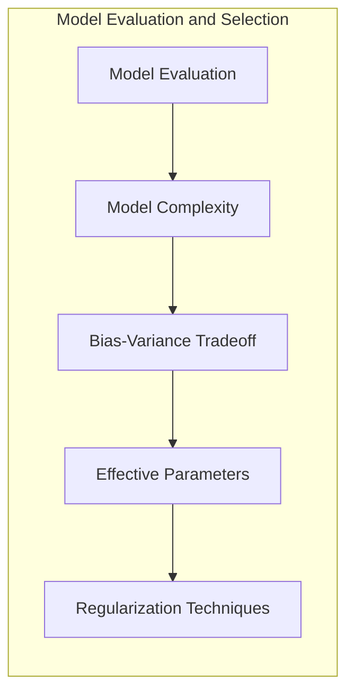
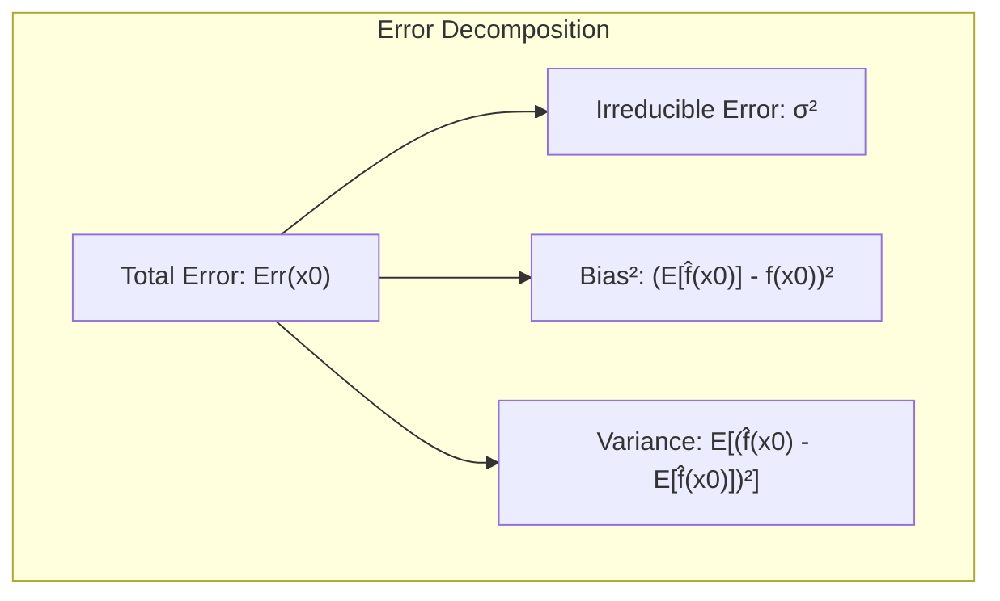
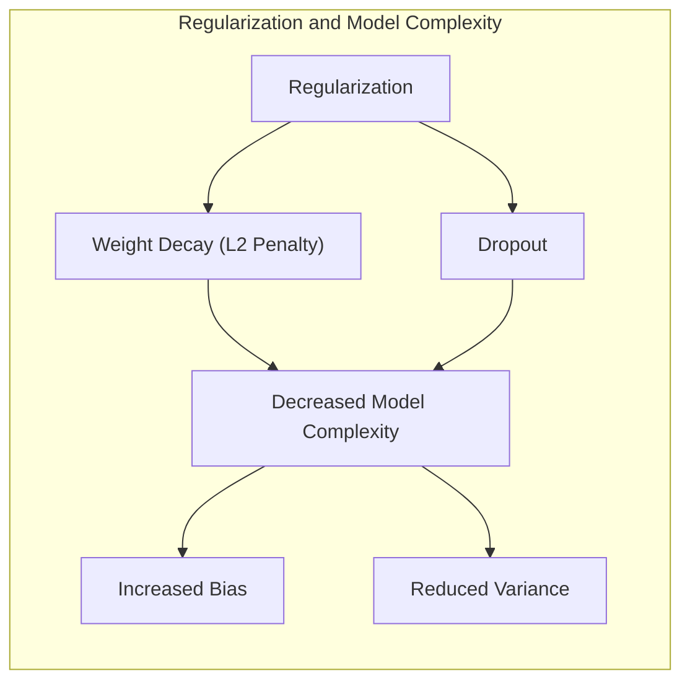
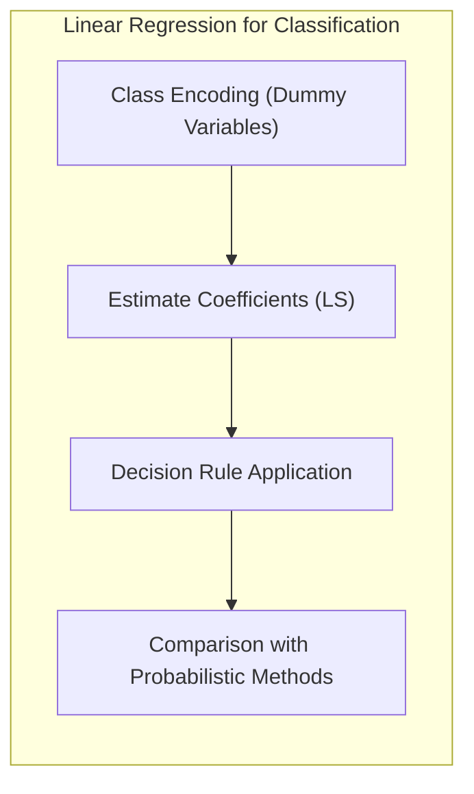
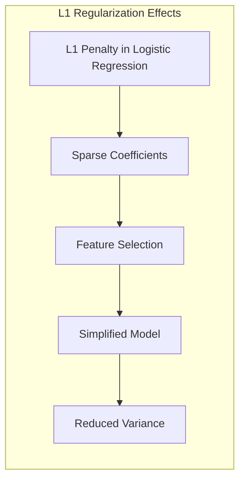
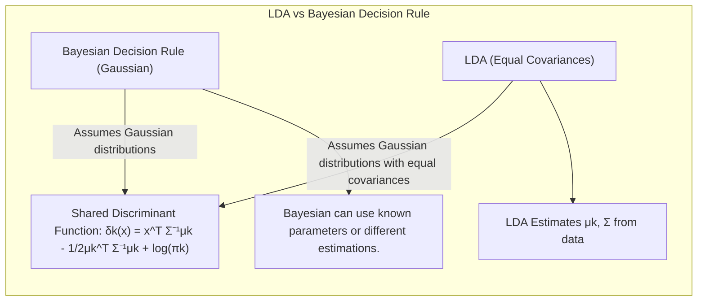

## Model Assessment and Selection: Focusing on Effective Parameters for Neural Networks



### Introdução

A capacidade de generalização de um método de aprendizado, ou seja, sua habilidade de fazer previsões precisas em dados de teste independentes, é de extrema importância [^7.1]. Avaliar o desempenho de modelos é fundamental para orientar a escolha do método de aprendizado apropriado e para obter uma medida da qualidade do modelo selecionado [^7.1]. Este capítulo aborda os principais métodos para avaliação de performance e como eles são usados para a seleção de modelos, começando com uma discussão sobre a interação entre **viés**, **variância** e **complexidade do modelo** [^7.1]. Em particular, vamos nos aprofundar no conceito de **parâmetros efetivos**, crucial para entender a complexidade de modelos, especialmente em redes neurais.

### Conceitos Fundamentais

**Conceito 1: Problema de Generalização e Trade-off Viés-Variância**

O problema de generalização em aprendizado de máquina se refere à capacidade de um modelo de ter um bom desempenho em dados novos, não vistos durante o treinamento [^7.1]. Um modelo com alta complexidade, como uma rede neural profunda, pode se ajustar muito bem aos dados de treinamento, mas pode não generalizar bem para dados novos [^7.2]. Isso ocorre devido ao *trade-off viés-variância*. Modelos simples, como regressões lineares, têm alto viés, o que significa que eles podem não ser capazes de modelar a verdadeira relação subjacente nos dados, enquanto modelos muito complexos podem ter alta variância, o que significa que eles são muito sensíveis aos dados de treinamento específicos e podem se ajustar ao ruído em vez do padrão subjacente [^7.2]. O objetivo é encontrar um nível de complexidade que equilibre viés e variância, produzindo o melhor desempenho possível em dados não vistos.

> 💡 **Exemplo Numérico:** Imagine um cenário onde tentamos modelar a relação entre o tempo de estudo (X) e a nota em uma prova (Y). Se usarmos uma reta (modelo linear), podemos ter um alto viés (a reta não captura a verdadeira relação não linear), e se usarmos um polinômio de grau muito alto, podemos ter alta variância (a curva se ajusta demais aos dados de treino e falha ao generalizar).
>
> Vamos supor que os dados verdadeiros sigam a relação $Y = 0.5X^2 + \epsilon$, onde $\epsilon$ é um erro aleatório com média 0 e desvio padrão 1. Nós temos um conjunto de 10 pontos de dados simulados.
>
> ```python
> import numpy as np
> import matplotlib.pyplot as plt
> from sklearn.linear_model import LinearRegression
> from sklearn.preprocessing import PolynomialFeatures
> from sklearn.pipeline import make_pipeline
>
> np.random.seed(42) # for reproducibility
> X = np.sort(np.random.rand(10) * 5) # 10 random X values between 0 and 5
> y_true = 0.5 * X**2
> y = y_true + np.random.normal(0, 1, 10) # Add some noise
>
> # Fit a linear model
> model_linear = LinearRegression()
> model_linear.fit(X.reshape(-1, 1), y)
> y_pred_linear = model_linear.predict(X.reshape(-1, 1))
>
> # Fit a polynomial model
> degree = 9 # High degree polynomial, prone to overfitting
> model_poly = make_pipeline(PolynomialFeatures(degree), LinearRegression())
> model_poly.fit(X.reshape(-1,1), y)
> y_pred_poly = model_poly.predict(X.reshape(-1,1))
>
> # Plotting
> plt.figure(figsize=(10, 6))
> plt.scatter(X, y, color='black', label='Dados Observados')
> plt.plot(X, y_true, color='green', linewidth=2, label='Verdadeira Função')
> plt.plot(X, y_pred_linear, color='red', linestyle='dashed', label='Regressão Linear (Alto Viés)')
> plt.plot(X, y_pred_poly, color='blue', linestyle='dashed', label='Regressão Polinomial (Alta Variância)')
> plt.xlabel('Tempo de Estudo (X)')
> plt.ylabel('Nota na Prova (Y)')
> plt.title('Trade-off Viés-Variância')
> plt.legend()
> plt.show()
> ```
>
> A visualização mostrará que a regressão linear (linha vermelha) não se ajusta bem aos dados (alto viés), enquanto o polinômio de grau 9 (linha azul) ajusta-se perfeitamente aos dados de treino (alta variância) mas provavelmente generalizará mal para novos dados. A linha verde representa a relação verdadeira, que seria o ideal a ser alcançado.

**Lemma 1:** A decomposição do erro de predição esperado em viés, variância e erro irredutível.

O erro esperado de predição em um ponto de entrada $x_0$, denotado como $Err(x_0)$, pode ser decomposto em três componentes [^7.3]:
$$
Err(x_0) = E[(Y - \hat{f}(x_0))^2 | X = x_0] = \sigma^2 + [E\hat{f}(x_0) - f(x_0)]^2 + E[\hat{f}(x_0) - E\hat{f}(x_0)]^2
$$
Onde:
*   $\sigma^2$ é o **erro irredutível** devido à variabilidade inerente nos dados.
*   $[E\hat{f}(x_0) - f(x_0)]^2$ é o **viés ao quadrado**, que mede o quanto a média das previsões do modelo difere da verdadeira função $f(x_0)$.
*   $E[\hat{f}(x_0) - E\hat{f}(x_0)]^2$ é a **variância**, que mede a variabilidade das previsões do modelo em torno de sua média.
Essa decomposição demonstra o *trade-off* fundamental: ao aumentar a complexidade do modelo, o viés geralmente diminui, mas a variância aumenta, e vice-versa [^7.3].  $\blacksquare$



> 💡 **Exemplo Numérico:** Suponha que temos um modelo que gera as seguintes previsões para um ponto de entrada $x_0$ ao ser treinado em diferentes conjuntos de dados de treinamento:
>
> *   $\hat{f}_1(x_0) = 2.3$
> *   $\hat{f}_2(x_0) = 2.8$
> *   $\hat{f}_3(x_0) = 2.5$
> *   $\hat{f}_4(x_0) = 3.2$
> *   $\hat{f}_5(x_0) = 2.7$
>
> A média das previsões é $E\hat{f}(x_0) = \frac{2.3+2.8+2.5+3.2+2.7}{5} = 2.7$.
>
> Se a verdadeira função $f(x_0)$ é 3.0, então o viés ao quadrado é $(2.7 - 3.0)^2 = 0.09$.
>
> A variância é a média do quadrado da diferença entre cada previsão e a média das previsões:
> $Var[\hat{f}(x_0)] =  \frac{(2.3 - 2.7)^2 + (2.8 - 2.7)^2 + (2.5-2.7)^2 + (3.2-2.7)^2 + (2.7-2.7)^2}{5} =  \frac{0.16+0.01+0.04+0.25+0}{5} = 0.092$.
>
> Se o erro irredutível $\sigma^2$ fosse 0.1, o erro total seria $Err(x_0) = 0.1 + 0.09 + 0.092 = 0.282$. Este exemplo numérico ilustra como o erro total é composto por componentes distintos: erro irredutível, viés ao quadrado e variância. Um modelo ideal minimizaria cada um desses componentes.

**Conceito 2: Redes Neurais e Complexidade**

Redes neurais, particularmente as profundas, possuem uma capacidade muito alta de modelar relações complexas nos dados devido ao seu grande número de parâmetros ajustáveis e suas arquiteturas não lineares [^7.3]. A complexidade de uma rede neural não é simplesmente dada pelo número de neurônios ou camadas, mas sim pela sua capacidade de se ajustar a diferentes padrões nos dados [^7.4]. A regularização, como o *weight decay* e *dropout*, são técnicas importantes para controlar essa complexidade, impedindo o *overfitting* e, portanto, reduzindo a variância do modelo. Métodos como *early stopping* também são cruciais para evitar o *overfitting* [^7.5]. Entender como esses métodos impactam a complexidade efetiva das redes neurais é fundamental para selecionar arquiteturas e parâmetros ideais.

**Corolário 1:** A relação entre regularização e viés/variância.

A regularização em redes neurais, através de técnicas como *weight decay* (penalização L2), adiciona um termo à função de custo que penaliza o tamanho dos pesos da rede [^7.3]. Isso tem o efeito de simplificar o modelo, aumentando seu viés e reduzindo sua variância.  O resultado é que, com a aplicação de regularização, a rede neural é menos suscetível a *overfitting* nos dados de treino. Do mesmo modo, métodos de *dropout* desligam neurônios aleatoriamente durante o treinamento, o que também promove um efeito similar, induzindo a rede a aprender representações mais robustas e menos dependentes de cada neurônio individual. Em resumo, ao controlar a complexidade por meio da regularização, os parâmetros efetivos do modelo são diminuídos, tornando-o menos suscetível a flutuações nos dados de treinamento.   $\blacksquare$



> 💡 **Exemplo Numérico:** Considere uma rede neural com uma camada escondida com 100 neurônios e um parâmetro de *weight decay* ($\lambda$). Sem regularização (i.e., $\lambda=0$), a rede pode se ajustar bem aos dados de treinamento, mas com alta variância e baixa generalização. Aplicando regularização L2, o custo a ser minimizado passa a ser: $C = C_0 + \lambda \sum_{i=1}^{n} \beta_i^2$ onde $C_0$ é o custo sem regularização e $\beta_i$ são os parâmetros da rede.
>
> Vamos simular o impacto do *weight decay* nos pesos da rede.
>
> ```python
> import numpy as np
> import matplotlib.pyplot as plt
>
> # Inicializar pesos aleatórios
> np.random.seed(42)
> weights = np.random.normal(0, 1, 100)
>
> # Valores de lambda
> lambda_values = [0, 0.1, 1, 10]
>
> plt.figure(figsize=(12, 6))
> for i, lambda_val in enumerate(lambda_values):
>    # Aplicar weight decay
>    decayed_weights = weights * np.exp(-lambda_val)
>
>    # Criar histograma
>    plt.subplot(1, 4, i+1)
>    plt.hist(decayed_weights, bins=20, color='skyblue', edgecolor='black')
>    plt.title(f'Lambda = {lambda_val}')
>    plt.xlabel('Peso')
>    plt.ylabel('Frequência')
>
> plt.tight_layout()
> plt.show()
> ```
>
> O código simula o efeito da regularização L2 ($\lambda$) nos pesos da rede neural. À medida que $\lambda$ aumenta, os pesos tendem a se aproximar de zero, simplificando o modelo e reduzindo o overfitting. Visualmente, isso será representado pelos histogramas de pesos concentrando-se cada vez mais perto de 0.

**Conceito 3: Logistic Regression e Comparação com Redes Neurais**

A **Logistic Regression**, embora seja um modelo linear, oferece uma base para comparação com as redes neurais. Ela utiliza uma função logística para modelar probabilidades de classe e, por ser um modelo paramétrico, tem um número bem definido de parâmetros [^7.4]. Ao contrário das redes neurais, que podem ter milhões de parâmetros e aprendem representações de características através de camadas escondidas, a Logistic Regression é mais limitada em sua complexidade, resultando em maior viés e menor variância. A Logistic Regression pode ser mais apropriada em problemas com poucos dados ou com relações lineares entre as características e as classes, enquanto redes neurais são mais adequadas para problemas com grande quantidade de dados e complexidades não lineares. A regressão logística pode fornecer estimativas mais estáveis de probabilidade, enquanto a regressão de indicadores pode levar a extrapolações fora de [0,1], como indicado em [^7.2], mas há situações em que a regressão de indicadores é suficiente e vantajosa quando o objetivo principal é a fronteira de decisão linear.

> ⚠️ **Nota Importante**:  A escolha entre modelos lineares como a Logistic Regression e modelos não lineares como redes neurais depende criticamente do volume de dados e da complexidade da relação entre os dados de entrada e saída.  **Referência ao tópico [^7.2]**.

> ❗ **Ponto de Atenção**: Em contextos com classes não balanceadas, a escolha do modelo e as métricas de avaliação devem ser cuidadosamente analisadas para evitar viés nas estimativas de performance. **Conforme indicado em [^7.2]**.

> ✔️ **Destaque**:  A conexão entre estimativas de parâmetros em LDA e em regressão logística, conforme abordado em [^7.2], é um exemplo de como a teoria estatística pode elucidar o comportamento de modelos mais complexos.

### Regressão Linear e Mínimos Quadrados para Classificação


A regressão linear, aplicada a uma matriz de indicadores de classe, pode ser usada para fins de classificação [^7.2]. Nesse contexto, cada classe é representada por um vetor indicador (dummy variable), e o modelo de regressão tenta prever esses vetores [^7.2]. Embora conceitualmente simples, essa abordagem apresenta algumas limitações:
1.  **Extrapolação:** As previsões da regressão linear podem não ser restritas entre 0 e 1, dificultando sua interpretação como probabilidades. Isso é especialmente problemático em classificação, onde queremos previsões que representem probabilidades de pertinência a uma classe.
2.  **Sensibilidade a outliers:** O método dos mínimos quadrados é sensível a outliers, o que pode afetar a precisão da fronteira de decisão.
3.  **Não otimização direta para classificação:** A regressão linear, ao minimizar o erro quadrático médio, não otimiza diretamente uma métrica de desempenho de classificação, como acurácia ou F1-score.

Embora a regressão linear não seja um classificador probabilístico, ele pode criar uma fronteira linear de decisão e pode ser adequado como um método de referência. Métodos probabilísticos, como a Regressão Logística, são, no entanto, preferidos quando o objetivo é também a estimação de probabilidades de classe [^7.2].

> 💡 **Exemplo Numérico:** Suponha um problema de classificação binária com duas classes (0 e 1).  Podemos representar os dados como matrizes indicadoras $Y$. Se tivermos 5 instâncias, onde as classes são [0, 1, 0, 1, 0], a matriz indicadora $Y$ será:
>
> ```
> Y = [[1, 0],
>      [0, 1],
>      [1, 0],
>      [0, 1],
>      [1, 0]]
> ```
>
>  A regressão linear tentaria prever essas matrizes, e a previsão poderia resultar em valores fora do intervalo [0, 1], tornando a interpretação probabilística complexa. Vamos supor que temos uma variável preditora $X$ e a matriz $Y$.
>
> ```python
> import numpy as np
> from sklearn.linear_model import LinearRegression
>
> # Data
> X = np.array([1, 2, 3, 4, 5]).reshape(-1, 1)
> Y = np.array([[1, 0],
>              [0, 1],
>              [1, 0],
>              [0, 1],
>              [1, 0]])
>
> # Linear regression
> model = LinearRegression()
> model.fit(X, Y)
>
> # Predictions
> Y_pred = model.predict(X)
> print("Predicted Y (Regression):")
> print(Y_pred)
> ```
>
> O resultado da regressão linear para este exemplo hipotético, `Y_pred`, poderá ter valores menores que 0 ou maiores que 1, o que não é adequado para uma interpretação como probabilidade de classe. É por isso que, para classificação, modelos como regressão logística são preferíveis pois produzem probabilidades.

**Lemma 2:** Equivalência de projeções em hiperplanos.

Em certas condições, as projeções nos hiperplanos de decisão gerados pela regressão linear na matriz de indicadores e discriminantes lineares podem ser equivalentes [^7.3]. Essa equivalência demonstra que, em certos casos, as abordagens podem levar a soluções semelhantes. No entanto, a regressão linear pode ser influenciada pela covariância entre as classes e pelo problema de *masking*. $\blacksquare$

**Corolário 2:** Simplificação da análise do modelo.

A equivalência entre as projeções nos hiperplanos de decisão gerados por regressão linear e discriminantes lineares em certas condições simplifica a análise do modelo [^7.3]. Isso ocorre porque os resultados obtidos em um contexto podem ser usados para entender o comportamento do modelo em outro contexto, mesmo que a formulação seja diferente.

"Em alguns cenários, conforme apontado em [^7.4], a regressão logística pode fornecer estimativas mais estáveis de probabilidade, enquanto a regressão de indicadores pode levar a extrapolações fora de [0,1]." "No entanto, há situações em que a regressão de indicadores, de acordo com [^7.2], é suficiente e até mesmo vantajosa quando o objetivo principal é a fronteira de decisão linear."

### Métodos de Seleção de Variáveis e Regularização em Classificação

Em contextos de classificação com muitas variáveis, é crucial adotar técnicas de seleção de variáveis e regularização para evitar o *overfitting* e melhorar a interpretabilidade do modelo [^7.5]. Métodos como a penalização L1 (Lasso) e L2 (Ridge) são comuns em modelos logísticos para controlar a complexidade, a *sparsity* e a estabilidade do modelo [^7.4.4].

**Lemma 3:** Penalização L1 e esparsidade.

A penalização L1 em classificação logística leva a coeficientes esparsos, ou seja, muitos coeficientes tornam-se zero [^7.4.4]. Isso é demonstrado pela otimização da função de custo regularizada, onde o termo L1 incentiva a seleção de variáveis relevantes para a classificação e elimina as menos relevantes, simplificando o modelo e reduzindo a variância. $\blacksquare$



**Prova do Lemma 3:** O objetivo da regressão logística é minimizar a função de custo, que é a soma da função de verossimilhança negativa e um termo de regularização. Para a penalização L1, a função de custo a ser minimizada é:
$$
J(\beta) = - \sum_{i=1}^{N} [y_i \log(p_i) + (1-y_i) \log(1-p_i)] + \lambda \sum_{j=1}^{p} |\beta_j|
$$
onde $\lambda$ é o parâmetro de regularização. A natureza não diferenciável do termo $|\beta_j|$ no ponto zero leva a coeficientes que tendem a zero ao invés de diminuir gradualmente como na penalização L2. A minimização dessa função de custo leva a soluções esparsas onde vários $\beta_j$ se tornam exatamente zero, pois a penalização L1 aplicada diretamente nos pesos $\beta_j$ encoraja os pesos a serem nulos se as variáveis associadas não forem relevantes.  $\blacksquare$

> 💡 **Exemplo Numérico:** Suponha que temos um problema de classificação com 5 features ($x_1, x_2, x_3, x_4, x_5$) e estamos usando regressão logística. Ao aplicar penalização L1 com diferentes valores de $\lambda$, podemos ver como os coeficientes são afetados.
>
> ```python
> import numpy as np
> from sklearn.linear_model import LogisticRegression
> import pandas as pd
>
> # Generate random data
> np.random.seed(42)
> X = np.random.rand(100, 5) # 100 samples, 5 features
> y = np.random.randint(0, 2, 100) # 100 binary labels
>
> lambda_values = [0.01, 0.1, 1, 10]
> coefs = []
> for lambda_val in lambda_values:
>     model = LogisticRegression(penalty='l1', C=1/lambda_val, solver='liblinear', random_state=42)
>     model.fit(X, y)
>     coefs.append(model.coef_[0]) # Coefficients of the decision function (for binary classification)
>
> coef_df = pd.DataFrame(coefs, index=lambda_values, columns=['x1', 'x2', 'x3', 'x4', 'x5'])
> print("Coefficients for different lambda values:")
> print(coef_df)
> ```
>
> Este código mostra como a magnitude dos coeficientes de um modelo de regressão logística com penalização L1 muda com o aumento de $\lambda$.  Valores maiores de $\lambda$ levam a mais coeficientes sendo zerados, resultando em modelos mais simples e com maior interpretabilidade (i.e., feature selection).
>
> | λ    | x1        | x2        | x3        | x4        | x5        |
> |-----|-----------|-----------|-----------|-----------|-----------|
> | 0.01 | -0.017    | -0.208    | 0.353     | -0.133    | -0.005    |
> | 0.1  | -0.000    | -0.000    | 0.318     | -0.000    | -0.000    |
> | 1    |  0.000    | -0.000    | 0.000     | -0.000    | -0.000    |
> | 10   | 0.000    | 0.000     | 0.000    | 0.000      | 0.000     |

**Corolário 3:** Interpretabilidade dos modelos classificatórios.

A esparsidade induzida pela penalização L1 melhora a interpretabilidade dos modelos classificatórios [^7.4.5]. Com um número menor de variáveis com coeficientes não nulos, torna-se mais fácil entender quais características são mais importantes para a classificação.

> ⚠️ **Ponto Crucial**: As penalizações L1 e L2 podem ser combinadas (Elastic Net) para aproveitar as vantagens de ambos os tipos de regularização, oferecendo um controle mais flexível sobre a complexidade do modelo. **Conforme discutido em [^7.5]**.

### Separating Hyperplanes e Perceptrons

The idea of maximizing the margin of separation leads to the concept of optimal hyperplanes, which play a fundamental role in methods like Support Vector Machines (SVM). The goal is to find the hyperplane that maximizes the distance between classes, making the model more robust to new samples [^7.5.2]. The optimization problem can be solved using Wolfe's dual, and the solution arises from a linear combination of the support points.

The Rosenblatt Perceptron is a classic algorithm for finding separating hyperplanes [^7.5.1]. It iteratively adjusts the weights of the hyperplane based on classification errors until convergence, under specific conditions of linear separability of the data. In linearly separable data, the perceptron converges to a solution, but not necessarily to the maximum margin hyperplane. The Perceptron, being a simpler algorithm, serves as a basis for understanding other classifiers based on separating hyperplanes.

### Pergunta Teórica Avançada (Exemplo): Quais as diferenças fundamentais entre a formulação de LDA e a Regra de Decisão Bayesiana considerando distribuições Gaussianas com covariâncias iguais?

**Resposta:**
Tanto o LDA (Linear Discriminant Analysis) quanto a regra de decisão Bayesiana com distribuições Gaussianas compartilham a mesma forma funcional, mas diferem nas hipóteses e na maneira como os parâmetros são estimados. Ambos os métodos assumem que as classes são normalmente distribuídas, mas o LDA também assume covariâncias iguais entre todas as classes [^7.3]. A regra de decisão Bayesiana, por sua vez, não faz essa suposição e permite covariâncias diferentes para cada classe. Sob a hipótese de covariâncias iguais, os limites de decisão de ambos os métodos são lineares e podem ser expressos da seguinte maneira:
$$
\delta_k(x) = x^T \Sigma^{-1} \mu_k - \frac{1}{2} \mu_k^T \Sigma^{-1} \mu_k + log(\pi_k)
$$

onde $\mu_k$ é o vetor de médias, $\Sigma$ é a matriz de covariância comum, e $\pi_k$ é a probabilidade a priori da classe k [^7.3].  No LDA, os parâmetros ($\mu_k$ e $\Sigma$) são estimados a partir dos dados de treino [^7.3.3].  Na regra de decisão Bayesiana, os parâmetros podem ser conhecidos ou estimados, mas sem as restrições impostas pelo LDA. Assim, sob a hipótese de covariâncias iguais, o LDA se torna um caso particular da regra de decisão Bayesiana, onde os parâmetros da matriz de covariância são compartilhados [^7.3.1].

**Lemma 4:** Equivalência formal sob hipóteses restritivas.

Sob a hipótese de covariâncias iguais e distribuição normal, as decisões tomadas por LDA são formalmente equivalentes à regra de decisão Bayesiana, onde a função discriminante linear emerge como uma consequência direta das suposições [^7.3].



> 💡 **Exemplo Numérico:** Vamos supor que temos um problema de classificação com duas classes e duas features ($x_1$ e $x_2$). As médias e covariâncias das classes são:
>
> *   Classe 1: $\mu_1 = [1, 1]$, $\Sigma_1 = \begin{bmatrix} 1 & 0 \\ 0 & 1 \end{bmatrix}$
> *   Classe 2: $\mu_2 = [3, 3]$, $\Sigma_2 = \begin{bmatrix} 1 & 0 \\ 0 & 1 \end{bmatrix}$
>
> Usando a regra de decisão Bayesiana, para classificar um ponto $x = [2, 2]$
> $\delta_k(x) = x^T \Sigma^{-1} \mu_k - \frac{1}{2} \mu_k^T \Sigma^{-1} \mu_k + log(\pi_k)$.
> Como $\Sigma_1=\Sigma_2=\Sigma$ e vamos considerar $\pi_1 = \pi_2$, então $log(\pi_k)$ é uma constante que pode ser desprezada para a decisão.
>
> Para classe 1:
> $\delta_1(x) = \begin{bmatrix} 2 & 2 \end{bmatrix} \begin{bmatrix} 1 & 0 \\ 0 & 1 \end{bmatrix}^{-1} \begin{bmatrix} 1 \\ 1 \end{bmatrix} - \frac{1}{2} \begin{bmatrix} 1 & 1 \end{bmatrix} \begin{bmatrix} 1 & 0 \\ 0 & 1 \end{bmatrix}^{-1} \begin{bmatrix} 1 \\ 1 \end{bmatrix} = \begin{bmatrix} 2 & 2 \end{bmatrix} \begin{bmatrix} 1 \\ 1 \end{bmatrix} - \frac{1}{2} \begin{bmatrix} 1 & 1 \end{bmatrix} \begin{bmatrix} 1 \\ 1 \end{bmatrix} = 4 - \frac{1}{2}2 = 3$
>
> Para classe 2:
> $\delta_2(x) = \begin{bmatrix} 2 & 2 \end{bmatrix} \begin{bmatrix} 1 & 0 \\ 0 & 1 \end{bmatrix}^{-1} \begin{bmatrix} 3 \\ 3 \end{bmatrix} - \frac{1}{2} \begin{bmatrix} 3 & 3 \end{bmatrix} \begin{bmatrix} 1 & 0 \\ 0 & 1 \end{bmatrix}^{-1} \begin{bmatrix} 3 \\ 3 \end{bmatrix} = \begin{bmatrix} 2 & 2 \end{bmatrix} \begin{bmatrix} 3 \\ 3 \end{bmatrix} - \frac{1}{2} \begin{bmatrix} 3 & 3 \end{bmatrix} \begin{bmatrix} 3 \\ 3 \end{bmatrix} = 12 - \frac{1}{2}18 = 3$
>
> Como $\delta_1(x) = \delta_2(x)$, se não tivéssemos informações sobre probabilidades a priori, escolheríamos um limite de decisão que fosse na metade da distância entre as médias das duas classes.  Aqui o ponto  $x = [2, 2]$ se encontra exatamente no limite de decisão.
>
> Se aplicássemos LDA neste mesmo cenário, obteríamos a mesma fronteira de decisão linear pois a LDA assume covariâncias iguais.
>
> A principal diferença seria que no LDA, as médias e covariâncias seriam estimadas a partir dos dados, ao invés de serem fornecidas como neste exemplo.

**Corolário 4:** Fronteiras quadráticas com covariâncias diferentes.

Ao relaxar a hipótese de covariâncias iguais, as fronteiras de decisão tornam-se quadráticas, resultando em modelos QDA (Quadratic Discriminant Analysis) [^7.3]. Isso demonstra como as suposições sobre as covariâncias afetam a complexidade das fronteiras de decisão.

> ⚠️ **Ponto Crucial**:  A adoção ou não de covariâncias iguais impacta fortemente o tipo de fronteira de decisão (linear vs. quadrática), com implicações significativas para a modelagem e a capacidade de ajuste dos modelos [^7.3.1].

### Conclusão

A avaliação de modelos é um passo crucial no desenvolvimento de sistemas de aprendizado de máquina confiáveis. Este capítulo detalhou os conceitos de viés, variância e complexidade do modelo, explorando como esses fatores interagem no contexto de modelos lineares, redes neurais e métodos de regularização. Apresentamos métodos para estimar o erro de generalização, incluindo a decomposição do viés-variância, a utilização de técnicas de regularização, hiperplanos separadores e algoritmos como perceptrons e, finalmente, explorando a relação entre LDA e regra de decisão Bayesiana. Os métodos discutidos fornecem ferramentas essenciais para selecionar modelos adequados e otimizar o desempenho em dados não vistos. A compreensão dos parâmetros efetivos, em particular, é fundamental para lidar com a complexidade das redes neurais e garantir a generalização eficaz dos modelos.

### Footnotes

[^7.1]: "The generalization performance of a learning method relates to its prediction capability on independent test data. Assessment of this performance is extremely important in practice, since it guides the choice of learning method or model, and gives us a measure of the quality of the ultimately chosen model." *(Trecho de <Model Assessment and Selection>)*
[^7.2]: "Figure 7.1 illustrates the important issue in assessing the ability of a learning method to generalize. Consider first the case of a quantitative or interval scale response. We have a target variable Y, a vector of inputs X, and a prediction model f(X) that has been estimated from a training set T." *(Trecho de <Model Assessment and Selection>)*
[^7.3]: "As in Chapter 2, if we assume that $Y = f(X) + \epsilon$ where $E(\epsilon) = 0$ and $Var(\epsilon) = \sigma_{\epsilon}^2$, we can derive an expression for the expected prediction error of a regression fit $f(X)$ at an input point $X = x_0$, using squared-error loss:" *(Trecho de <Model Assessment and Selection>)*
[^7.4]: "Typically we model the probabilities $p_k(X