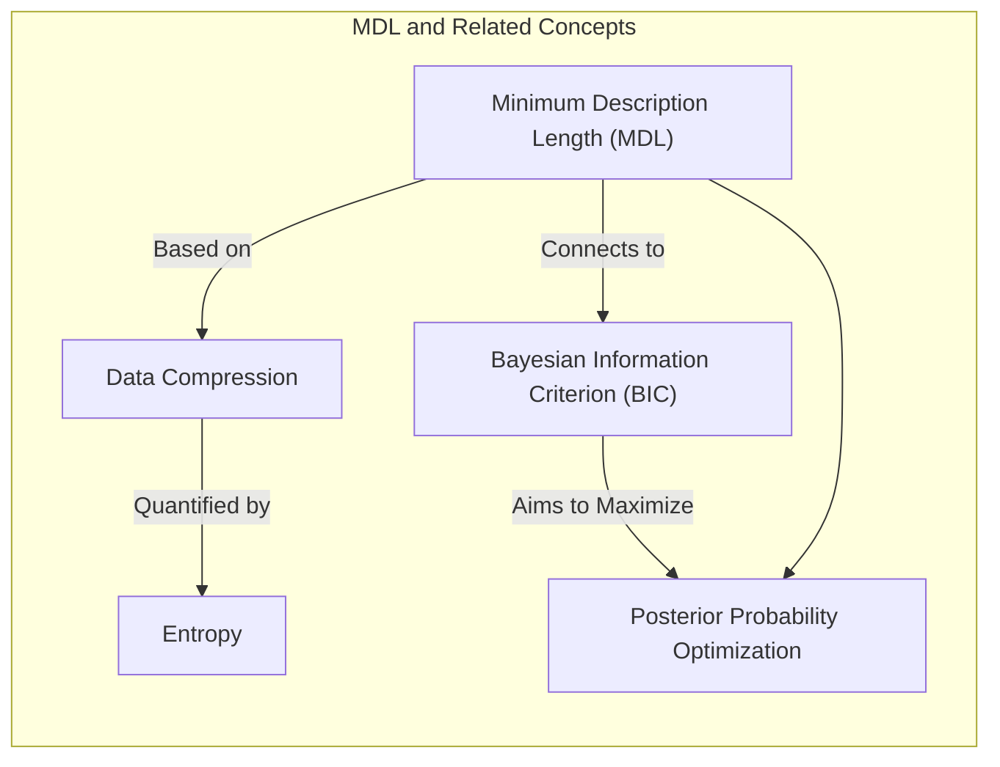
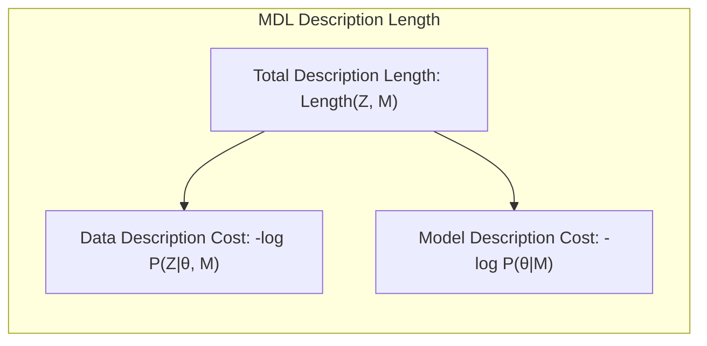
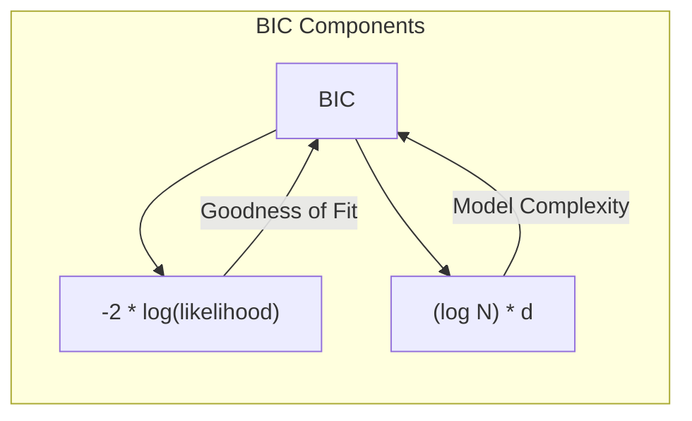
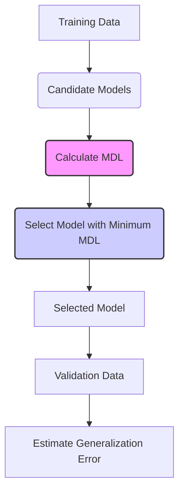
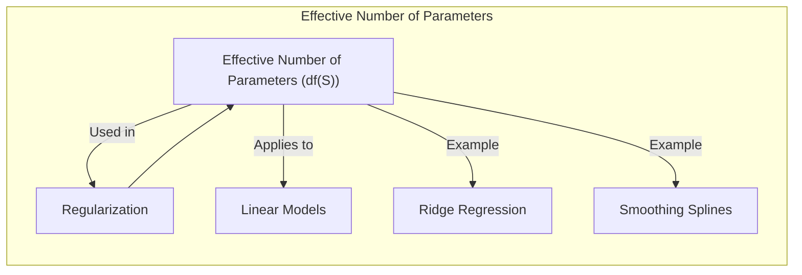
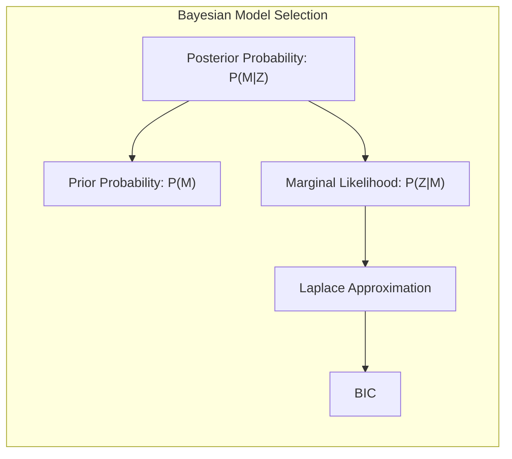
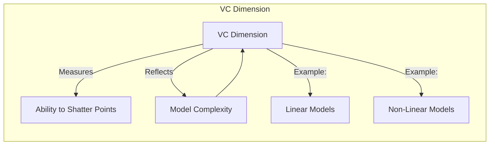

Okay, here's the enhanced text with Mermaid diagrams added, focusing on sophisticated technical representations as requested:

## Model Selection Using Minimum Description Length (MDL)

### Introdução
A avaliação de modelos e a seleção entre diferentes abordagens são etapas cruciais na construção de modelos de aprendizado de máquina eficazes e generalizáveis [^7.1]. O objetivo é encontrar um modelo que não apenas se ajuste bem aos dados de treinamento, mas que também possua um bom desempenho em dados não vistos. A complexidade do modelo, o trade-off entre viés e variância, e a estimação precisa do erro de generalização são aspectos fundamentais nesse processo [^7.2]. Este capítulo explorará o conceito de **Minimum Description Length (MDL)**, uma abordagem teórica que conecta a seleção de modelos a princípios de codificação e compressão de dados. O MDL oferece um critério para escolher modelos que equilibram a complexidade com a precisão do ajuste aos dados [^7.8]. Veremos como o MDL se relaciona com o **Bayesian Information Criterion (BIC)** e como ambos podem ser vistos como formas de maximizar a probabilidade posterior.

### Conceitos Fundamentais
**Conceito 1: Codificação e Compressão de Dados**
No coração do MDL está a ideia de que o melhor modelo é aquele que pode codificar os dados de forma mais eficiente [^7.8]. A codificação de dados, no contexto do MDL, é análoga à transmissão de uma mensagem; o modelo é o método de codificação e os dados são a mensagem. A meta é encontrar o código mais curto (ou o modelo mais conciso) que possa representar os dados sem perda significativa de informação. Essa analogia é crucial para entender a fundamentação teórica do MDL, conectando a seleção de modelos com a teoria da informação [^7.8].
**Lemma 1:** *Dado um conjunto de mensagens $\{z_1, z_2, ..., z_m\}$ com probabilidades associadas $Pr(z_i)$, a melhor estratégia de codificação utiliza códigos com tamanho $l_i = -\log_2 Pr(z_i)$, e a média do comprimento da mensagem (em bits) atinge o limite inferior da entropia $H = -\sum Pr(z_i)\log_2 Pr(z_i)$*. [^7.8]
**Prova:** A entropia, definida como $H = -\sum Pr(z_i)\log_2 Pr(z_i)$, quantifica a quantidade mínima de informação necessária para descrever uma variável aleatória. O teorema de Shannon estabelece que não é possível codificar um conjunto de mensagens usando, em média, menos bits do que sua entropia. Isso implica que a codificação ótima minimiza o comprimento esperado do código, o que está diretamente relacionado à minimização da incerteza sobre os dados. A demonstração envolve o uso da desigualdade de Gibbs e a otimização de códigos prefixados. $\blacksquare$

> 💡 **Exemplo Numérico:**
> Suponha que temos um conjunto de 4 mensagens, $z_1, z_2, z_3, z_4$, com as seguintes probabilidades:
>
> $Pr(z_1) = 0.5$, $Pr(z_2) = 0.25$, $Pr(z_3) = 0.125$, $Pr(z_4) = 0.125$.
>
> Usando a fórmula $l_i = -\log_2 Pr(z_i)$, os comprimentos ideais dos códigos seriam:
>
> $l_1 = -\log_2(0.5) = 1$ bit
> $l_2 = -\log_2(0.25) = 2$ bits
> $l_3 = -\log_2(0.125) = 3$ bits
> $l_4 = -\log_2(0.125) = 3$ bits
>
> A entropia desse conjunto de mensagens seria:
> $H = -(0.5 \log_2(0.5) + 0.25 \log_2(0.25) + 0.125 \log_2(0.125) + 0.125 \log_2(0.125)) = 1.75$ bits
>
> A média do comprimento do código é igual a entropia do conjunto.
> $ComprimentoMédio = (0.5 * 1) + (0.25 * 2) + (0.125 * 3) + (0.125 * 3) = 1.75$ bits
>
> Este exemplo demonstra como a teoria da informação sugere que mensagens mais frequentes devem ter códigos mais curtos, o que leva a uma compressão de dados mais eficiente.

**Conceito 2: Princípio do Comprimento Mínimo da Descrição**
O MDL postula que o modelo ótimo é aquele que minimiza o comprimento total da descrição dos dados, onde o comprimento da descrição é composto por duas partes: (1) o comprimento da descrição do modelo e (2) o comprimento da descrição dos dados quando codificados usando o modelo [^7.8]. Formalmente, dado um conjunto de dados $Z$ e um modelo $M$ com parâmetros $\theta$, o comprimento da descrição é dado por:
$$ Length(Z, M) = - \log Pr(Z|\theta, M) - \log Pr(\theta|M) $$
O primeiro termo, $-\log Pr(Z|\theta, M)$, é o custo de codificação dos dados usando o modelo (ou seja, a "complexidade" do ajuste). O segundo termo, $-\log Pr(\theta|M)$, é o custo de codificação do modelo em si (ou seja, a "complexidade" do modelo). O MDL busca o modelo $M$ e os parâmetros $\theta$ que minimizam essa soma [^7.8].

**Corolário 1:** *O MDL, ao minimizar o comprimento da descrição total, penaliza tanto modelos excessivamente complexos (que exigem longos códigos para seus parâmetros) quanto modelos excessivamente simplificados (que exigem longos códigos para os resíduos dos dados)*. A escolha de um bom modelo envolve o balanço entre a complexidade do modelo e o quão bem ele se ajusta aos dados.
**Prova:** O primeiro termo da equação do MDL, $-\log Pr(Z|\theta, M)$, é diretamente relacionado à verossimilhança do modelo. Modelos mais complexos tendem a ter um valor maior de verossimilhança, o que leva a um termo negativo menor. No entanto, o segundo termo, $-\log Pr(\theta|M)$, aumenta à medida que o modelo se torna mais complexo. Isso porque modelos mais complexos precisam de mais parâmetros, que, por sua vez, demandam maior esforço para serem codificados. O MDL equilibra esses dois termos: modelos complexos demais resultam em um segundo termo grande (devido à penalização da complexidade), enquanto modelos simples demais resultam em um primeiro termo grande (devido ao mau ajuste). O modelo ótimo é aquele que minimiza essa soma. $\blacksquare$

> 💡 **Exemplo Numérico:**
>
> Suponha que temos dois modelos para ajustar um conjunto de dados. O Modelo 1 é um modelo linear simples com 2 parâmetros (um intercepto e um coeficiente angular), e o Modelo 2 é um modelo polinomial de grau 3 com 4 parâmetros.
>
> Para um conjunto de dados específico, após o ajuste, temos as seguintes verossimilhanças e custos de codificação dos parâmetros:
>
> **Modelo 1 (Linear):**
>   - $-\log Pr(Z|\theta_1, M_1) = 10$  (custo de codificação dos dados com o modelo linear)
>   - $-\log Pr(\theta_1|M_1) = 2$ (custo de codificação dos 2 parâmetros do modelo)
>   - $Length(Z, M_1) = 10 + 2 = 12$
>
> **Modelo 2 (Polinomial):**
>   - $-\log Pr(Z|\theta_2, M_2) = 7$ (custo de codificação dos dados com o modelo polinomial)
>   - $-\log Pr(\theta_2|M_2) = 6$ (custo de codificação dos 4 parâmetros do modelo)
>   - $Length(Z, M_2) = 7 + 6 = 13$
>
> Apesar do Modelo 2 ajustar-se melhor aos dados (menor custo de codificação dos dados), o custo total da descrição é maior do que o Modelo 1, devido à maior complexidade do modelo. O MDL, portanto, escolheria o Modelo 1, que equilibra melhor ajuste e complexidade.

**Conceito 3: Relação com BIC**
É importante notar que o MDL, sob certas suposições, é formalmente equivalente ao **Bayesian Information Criterion (BIC)** [^7.7]. Ambos os critérios penalizam a complexidade do modelo e buscam o equilíbrio ideal entre o ajuste e a generalização. A principal diferença está na motivação: o MDL vem da teoria da informação e compressão, enquanto o BIC vem da estatística Bayesiana [^7.7]. O BIC é definido como:
$$ BIC = -2\log(likelihood) + (\log N)d $$
onde $N$ é o tamanho da amostra e $d$ é o número de parâmetros do modelo. O termo $-2\log(likelihood)$ quantifica o ajuste do modelo aos dados, enquanto $(\log N)d$ penaliza a complexidade do modelo, favorecendo modelos mais simples [^7.7].

> ⚠️ **Nota Importante**:  O BIC e o MDL são frequentemente usados para seleção de modelos, mas suas motivações e abordagens teóricas são distintas, embora resultem em um critério semelhante na prática. [^7.7, ^7.8]
> ❗ **Ponto de Atenção**:  Enquanto o BIC é derivado de uma aproximação de Laplace da probabilidade posterior do modelo, o MDL deriva de princípios de compressão e codificação da informação. [^7.7, ^7.8]
> ✔️ **Destaque**:  A semelhança formal entre MDL e BIC é devido ao fato de que tanto a probabilidade posterior Bayesiana quanto a eficiência de codificação de dados penalizam a complexidade do modelo. [^7.7, ^7.8]

> 💡 **Exemplo Numérico:**
>
> Consideremos um cenário de regressão linear com dois modelos concorrentes: um modelo com 2 parâmetros e outro com 5 parâmetros. Um conjunto de dados de tamanho $N=100$ é usado para o treinamento. Após o ajuste dos modelos, obtivemos as seguintes log-verossimilhanças:
>
> **Modelo 1 (2 parâmetros):** $-2\log(\mathcal{L}_1) = 150$
> **Modelo 2 (5 parâmetros):** $-2\log(\mathcal{L}_2) = 120$
>
> Aplicando a fórmula do BIC:
>
> **Modelo 1:** $BIC_1 = 150 + (\log(100) \times 2) = 150 + 4.605 \times 2 = 159.21$
>
> **Modelo 2:** $BIC_2 = 120 + (\log(100) \times 5) = 120 + 4.605 \times 5 = 143.025$
>
> Apesar de o Modelo 2 ter um melhor ajuste aos dados (menor valor de $-2\log(\mathcal{L})$), o BIC penaliza o Modelo 2 devido à sua maior complexidade. Neste caso, o BIC escolheria o Modelo 2 devido ao seu menor BIC, um exemplo que ilustra como o BIC busca o melhor equilíbrio entre ajuste e complexidade. Se o tamanho da amostra fosse menor, a penalidade do BIC aumentaria, favorecendo modelos mais simples.

### Estimativas do Erro de Predição In-Sample

**Explicação:** Este diagrama ilustra o processo de seleção de modelos usando MDL, desde a entrada de dados até a estimação final do erro.

A avaliação do desempenho de um modelo envolve a estimação do seu erro de predição, que é a capacidade do modelo de generalizar para novos dados não vistos. A estimativa do erro de predição in-sample envolve a avaliação do modelo nos dados utilizados para o treinamento e, como vimos, é otimista. O MDL oferece um critério para estimar o erro de predição in-sample, através do princípio da minimização do comprimento da descrição. As estimativas MDL são definidas como a soma do erro nos dados de treinamento e uma medida da complexidade do modelo. Essa medida da complexidade (ou otimismo) no contexto do MDL, está relacionada ao número de parâmetros ou ao número efetivo de parâmetros nos modelos regularizados [^7.5].
**Lemma 2:** *Para um modelo linear com $d$ parâmetros e ruído Gaussiano com variância $\sigma^2$, o otimismo da taxa de erro de treinamento (isto é, a diferença entre o erro in-sample e o erro de treinamento) é proporcional a $2d\sigma^2/N$, onde N é o número de dados de treinamento.* [^7.4]
**Prova:** Seja $err$ o erro de treinamento e $Err_{in}$ o erro in-sample. Do tópico [^7.4], sabemos que $E_y(Err_{in}) = E_y(err) + \frac{2}{N} \sum_{i=1}^N Cov(y_i, \hat{y}_i)$. No caso de modelos lineares com ruído gaussiano, essa expressão se simplifica para $E_y(Err_{in}) = E_y(err) + \frac{2d}{N} \sigma^2$. O termo $\frac{2d}{N}\sigma^2$ representa o otimismo da taxa de erro de treinamento. $\blacksquare$
**Corolário 2:** *A estimativa do erro in-sample usando MDL para um modelo linear com ruído gaussiano é dada por:*
$$ Err_{in} = err + \frac{2d\sigma^2}{N} $$
Onde $err$ é o erro nos dados de treinamento, $d$ é o número de parâmetros do modelo, $N$ é o número de observações e $\sigma^2$ é a variância do erro.
Essa expressão é a base para o critério $C_p$ de Mallows [^7.5], e mostra como o MDL penaliza modelos mais complexos, adicionando um termo proporcional ao número de parâmetros do modelo.
> ⚠️ **Ponto Crucial**: A estimativa MDL do erro in-sample ajusta o erro de treinamento pelo viés de ajuste do modelo aos dados de treinamento, incorporando um termo de complexidade do modelo. [^7.5]

> 💡 **Exemplo Numérico:**
>
> Vamos considerar um modelo de regressão linear com 3 parâmetros ($d=3$). Suponha que o erro de treinamento médio (MSE) no conjunto de treinamento foi $err = 2.5$ e o tamanho do conjunto de treinamento é $N=50$. A variância do erro é estimada em $\sigma^2 = 1$.
>
> Usando a fórmula de estimativa do erro in-sample com MDL:
>
> $Err_{in} = err + \frac{2d\sigma^2}{N} = 2.5 + \frac{2 \times 3 \times 1}{50} = 2.5 + 0.12 = 2.62$
>
> O erro in-sample estimado pelo MDL é 2.62, que é ligeiramente maior que o erro de treinamento (2.5). Esse aumento reflete o otimismo do erro de treinamento e corrige a estimativa do erro, incorporando um termo de penalização pela complexidade do modelo, prevenindo um *overfitting*.

### O Número Efetivo de Parâmetros

Em modelos regularizados, como ridge regression, ou em outros modelos não lineares, a noção de número de parâmetros se torna mais complexa [^7.6]. O **número efetivo de parâmetros** ($df(S)$) é uma generalização do conceito de número de parâmetros que busca quantificar a complexidade do modelo, considerando os efeitos da regularização ou de outros ajustes. Para modelos lineares onde a predição $\hat{y}$ é dada por $\hat{y} = S y$, o número efetivo de parâmetros é definido como o traço da matriz $S$:
$$df(S) = trace(S)$$
Onde $S$ é a matriz que mapeia as respostas $y$ para as predições $\hat{y}$. Isso se aplica a modelos lineares, ridge regression, splines de suavização, etc.
**Lemma 3:** *Se $S$ é uma matriz de projeção ortogonal para um espaço gerado por $M$ features, então o traço de $S$ é igual a $M$.* [^7.6]
**Prova:** Se $S$ é uma matriz de projeção ortogonal para um espaço gerado por $M$ features, então $S$ pode ser escrita como $S = U U^T$, onde $U$ é uma matriz com $M$ colunas ortonormais. Assim, $trace(S) = trace(U U^T) = trace(U^T U) = trace(I_M) = M$. $\blacksquare$
**Corolário 3:** *Em modelos com regularização ou suavização, o número efetivo de parâmetros é menor do que o número total de parâmetros, refletindo uma redução na complexidade do modelo.*
Em modelos como redes neurais, o número efetivo de parâmetros pode ser aproximado utilizando as derivadas segundas da função de custo (hessiana) [^7.7]. Essa formulação permite que o MDL seja utilizado em modelos mais complexos, que não possuem uma definição simples de "número de parâmetros" [^7.6].

> 💡 **Exemplo Numérico:**
>
> Considere um modelo de Ridge Regression. Na Ridge Regression, a matriz de projeção $S$ pode ser expressa como $S = X(X^TX + \lambda I)^{-1}X^T$, onde $X$ é a matriz de design, $\lambda$ é o parâmetro de regularização e $I$ é a matriz identidade. Suponha que $X$ seja uma matriz $50 \times 5$ (50 observações, 5 preditores) e temos dois casos:
>
> **Caso 1: Regularização fraca ($\lambda = 0.1$)**:
>
> Ao calcular $S$ e seu traço (usando alguma biblioteca de álgebra linear como `numpy`), obtemos $df(S) = trace(S) \approx 4.5$.
>
> **Caso 2: Regularização forte ($\lambda = 10$)**:
>
>  Ao calcular $S$ e seu traço, obtemos $df(S) = trace(S) \approx 2$.
>
>
> O número efetivo de parâmetros é menor do que o número total de preditores (5) e diminui com o aumento da regularização. No caso com $\lambda = 0.1$, o número efetivo de parâmetros é 4.5, que está próximo do número total de parâmetros. No caso com $\lambda = 10$, o número efetivo é 2, o que indica que o modelo está se comportando como um modelo com apenas 2 parâmetros, devido à forte regularização. Assim, quanto maior o parâmetro $\lambda$, menor a complexidade do modelo e menor o número efetivo de parâmetros.

### Abordagem Bayesiana e BIC
A abordagem Bayesiana para a seleção de modelos se baseia na ideia de que o melhor modelo é aquele que maximiza a probabilidade posterior do modelo, dado os dados [^7.7]. Dado um conjunto de modelos candidatos $M_m$ e dados $Z$, a probabilidade posterior do modelo é dada por:
$$ P(M_m|Z) \propto P(M_m) P(Z|M_m) $$
Onde $P(M_m)$ é a probabilidade a priori do modelo e $P(Z|M_m)$ é a probabilidade marginal dos dados dado o modelo.
Sob algumas condições, a probabilidade marginal $P(Z|M_m)$ pode ser aproximada usando uma aproximação de Laplace, resultando no BIC:
$$ BIC = -2\log(\mathcal{L}) + d\log(N) $$
Onde $\mathcal{L}$ é o valor máximo da verossimilhança, $d$ é o número de parâmetros do modelo e $N$ é o número de observações.
**Lemma 4:** *A aproximação de Laplace para a probabilidade marginal resulta em um termo que penaliza modelos mais complexos, favorecendo modelos mais simples, de forma semelhante ao MDL.* [^7.7]
**Prova:** A aproximação de Laplace envolve uma expansão de Taylor de segunda ordem da função log-verossimilhança em torno de seu máximo. Essa aproximação leva a um termo que penaliza a complexidade do modelo através do número de parâmetros e do tamanho da amostra. A derivação detalhada envolve conceitos de cálculo, probabilidade e estatística bayesiana. $\blacksquare$
**Corolário 4:** *O BIC, sendo uma aproximação da probabilidade posterior, pode ser visto como uma versão bayesiana do MDL, pois também busca o modelo que melhor equilibra o ajuste aos dados e a complexidade do modelo*. [^7.7]

> ⚠️ **Ponto Crucial**: BIC e MDL são muito similares em sua aplicação. Ambos penalizam modelos complexos e podem ser usados em cenários similares de seleção de modelos.

### Dimensão VC

A **Dimensão de Vapnik-Chervonenkis (VC)** é uma medida da complexidade de uma classe de funções que avalia a capacidade de uma função de quebrar um conjunto de pontos. Uma classe de funções pode quebrar um conjunto de pontos se, para cada combinação possível de rótulos binários nos pontos, existe uma função na classe que separa perfeitamente os pontos [^7.9].
A dimensão VC de uma classe de funções é o maior número de pontos que a classe pode quebrar. Modelos com maior dimensão VC são mais complexos e capazes de se ajustarem a dados mais variados.
**Lemma 5:** *A dimensão VC de funções lineares em um espaço $p$-dimensional é $p+1$*. [^7.9]
**Prova:** A dimensão VC corresponde ao número de parâmetros do modelo para modelos lineares. Em um espaço $p$-dimensional, um hiperplano é definido por $p+1$ parâmetros (os coeficientes das $p$ variáveis e o intercepto). Portanto, a dimensão VC de um hiperplano é $p+1$. $\blacksquare$
A dimensão VC é uma medida geral de complexidade, e pode ser utilizada em modelos mais gerais, incluindo aqueles não-lineares. O modelo sin(ax), que possui apenas um parâmetro mas tem dimensão VC infinita, demonstra como modelos com poucos parâmetros podem ser muito complexos e "quebrar" (shatter) qualquer conjunto de pontos [^7.9].
> ❗ **Ponto de Atenção**:  Modelos com alta dimensão VC têm maior capacidade de se ajustar aos dados de treinamento, mas também maior risco de overfitting.

> 💡 **Exemplo Numérico:**
>
> Considere os seguintes casos:
>
> *   **Caso 1: Regressão Linear em 1D:** Um modelo linear simples com um intercepto e um coeficiente angular ($y = ax + b$) tem dimensão VC igual a 2 (1 preditor + 1 intercepto). Esse modelo pode separar 2 pontos em qualquer configuração, mas não pode separar 3 pontos em uma configuração com rótulos alternados (exemplo: + - +).
>
> *  **Caso 2: Regressão Linear em 2D:**  Um modelo linear em 2 dimensões tem a forma $y = a_1x_1 + a_2x_2 + b$ com dimensão VC igual a 3 (2 preditores + 1 intercepto). Esse modelo pode separar 3 pontos em qualquer configuração, mas não 4 em uma configuração específica.
>
> *  **Caso 3: Modelo Quadrático em 1D:** Um modelo quadrático tem a forma $y = ax^2 + bx + c$. Sua dimensão VC é igual a 3 (3 parâmetros). Esse modelo pode separar 3 pontos quaisquer.
>
> Este exemplo demonstra como a dimensão VC quantifica a capacidade de um modelo de separar pontos, sendo mais alta para modelos mais complexos.
>
> *   **Caso 4:  Modelo não-linear sin(ax):** Apesar de ter apenas um parâmetro, a função sin(ax) pode separar qualquer número de pontos com rótulos arbitrários, e portanto sua dimensão VC é infinita.

### Conclusão
O **Minimum Description Length (MDL)** é uma abordagem de seleção de modelos com bases sólidas na teoria da informação e codificação de dados. Ele oferece um critério para escolher o melhor modelo, equilibrando o ajuste aos dados com a complexidade do modelo, evitando overfitting e permitindo uma boa generalização. O MDL está intimamente ligado ao **Bayesian Information Criterion (BIC)**, e ambos podem ser vistos como abordagens para maximizar a probabilidade posterior do modelo. O conceito de **número efetivo de parâmetros**, e de **dimensão VC**,  estendem os conceitos de complexidade para modelos não-lineares. A avaliação da capacidade de generalização do modelo é essencial para o aprendizado de máquina, e para isso, o MDL, o BIC e outros métodos são ferramentas valiosas no arsenal do estatístico ou do cientista de dados.

### Seções Teóricas Avançadas
**Pergunta 1: Como a escolha da função de custo (ou perda) afeta a derivação do MDL e BIC?**
**Resposta:** A função de perda influencia diretamente a formulação do MDL e BIC ao afetar o cálculo da verossimilhança dos dados sob o modelo. No MDL, a função de perda influencia o termo de codificação dos dados ($-\log Pr(Z|\theta, M)$), enquanto no BIC, ela aparece através do termo de log-verossimilhança. A escolha da função de perda, seja ela erro quadrático para regressão ou entropia cruzada para classificação, molda como o modelo se ajusta aos dados e como a complexidade do modelo é penalizada. O MDL é mais geral em sua aplicação e pode lidar com diferentes funções de perda. No caso do BIC, as funções de perda devem ser associadas a distribuições de probabilidades.
**Pergunta 2: Existe um ponto ótimo para o tamanho do conjunto de validação para a seleção do modelo via MDL?**
**Resposta:** Sim, existe um ponto ótimo. Teoricamente, se o conjunto de validação for muito pequeno, a avaliação do modelo pode ser imprecisa e com alta variância. Se for muito grande, parte da informação será subutilizada. O MDL, em particular, não define um tamanho do conjunto de validação, mas as decisões são guiadas pelo número ótimo de parâmetros que o MDL seleciona. Em geral, o melhor é ter um conjunto de treinamento grande e um conjunto de validação que seja suficientemente representativo dos dados, mas um tamanho maior que o necessário é uma boa heurística, quando as amostras são abundantes. No caso do MDL, o tamanho do conjunto de validação influencia a estimativa do erro de predição (isto é, o termo do ajuste aos dados), enquanto que o termo de complexidade não é afetado por ele, já que depende do modelo.
**Pergunta 3: Qual a relação entre MDL e o tradeoff viés-variância?**
**Resposta:** O princípio do MDL busca um equilíbrio entre viés e variância ao penalizar modelos complexos, evitando overfitting. Modelos complexos, embora possam se ajustar melhor aos dados de treinamento, têm maior variância e podem generalizar mal para novos dados. O MDL, através da minimização do comprimento total da descrição, naturalmente penaliza modelos excessivamente complexos (que têm alta variância) e modelos simplificados demais (que têm alto viés). O termo de verossimilhança penaliza o viés e o termo de complexidade do modelo penaliza a variância.

### Footnotes
[^7.1]: "The generalization performance of a learning method relates to its prediction capability on independent test data. Assessment of this performance is extremely important in practice, since it guides the choice of learning method or model, and gives us a measure of the quality of the ultimately chosen model." *(Trecho de *The Elements of Statistical Learning*)*
[^7.2]: "Figure 7.1 illustrates the important issue in assessing the ability of a learning method to generalize. Consider first the case of a quantitative or interval scale response." *(Trecho de *The Elements of Statistical Learning*)*
[^7.8]: "The minimum description length (MDL) approach gives a selection cri-terion formally identical to the BIC approach, but is motivated from an optimal coding viewpoint. We first review the theory of coding for data compression, and then apply it to model selection." *(Trecho de *The Elements of Statistical Learning*)*
[^7.7]: "The Bayesian information criterion (BIC), like AIC, is applicable in settings where the fitting is carried out by maximization of a log-likelihood. The generic form of BIC is BIC=-2loglik+(log N)d." *(Trecho de *The Elements of Statistical Learning*)*
[^7.4]: "Training error is the average loss over the training sample" *(Trecho de *The Elements of Statistical Learning*)*
[^7.5]: "The general form of the in-sample estimates is Errin = err + w, where w is an estimate of the average optimism. Using expression (7.24), applicable when d parameters are fit under squared error loss, leads to a version of the so-called Cp statistic" *(Trecho de *The Elements of Statistical Learning*)*
[^7.6]: "The concept of "number of parameters" can be generalized, especially to models where regularization is used in the fitting. Suppose we stack the outcomes Y1, Y2,..., yn into a vector y, and similarly for the predictions ŷ. Then a linear fitting method is one for which we can write ŷ= Sy." *(Trecho de *The Elements of Statistical Learning*)*
[^7.9]: "The Vapnik-Chervonenkis (VC) theory provides such a general measure of complexity, and gives associated bounds on the optimism. Here we give a brief review of this theory. " *(Trecho de *The Elements of Statistical Learning*)*
<!-- END DOCUMENT -->
