## Data as Message: Model Assessment and Selection through Information Theory
<imagem: Diagrama complexo mostrando o fluxo da Model Selection com várias etapas como coleta de dados, treinamento do modelo, avaliação e seleção, usando medidas como AIC, BIC, MDL, cross-validation e bootstrap. As setas mostram a interconexão dos métodos. Represente a informação como a mensagem principal que flui pelo diagrama, desde a coleta até a seleção do modelo, enfatizando a ideia de que o objetivo é encontrar o modelo que melhor “codifica” a informação nos dados.>

### Introdução
A avaliação e seleção de modelos são etapas cruciais no desenvolvimento de métodos de aprendizado estatístico. O desempenho de generalização, ou seja, a capacidade de um modelo de fazer previsões precisas em novos dados, orienta a escolha do método de aprendizado ou modelo apropriado e nos fornece uma medida da qualidade do modelo escolhido [^7.1]. Este capítulo explora métodos essenciais para avaliação de desempenho e como eles são utilizados para seleção de modelos. A discussão abordará a intrincada relação entre viés (bias), variância e complexidade do modelo, fornecendo uma base sólida para os conceitos a seguir. A ideia central é que os dados podem ser vistos como uma mensagem que deve ser decodificada pelo modelo, e a melhor forma de decodificá-la (ou seja, aprender o modelo) é aquela que gera o menor erro de previsão. Métodos como regularização e seleção de variáveis são cruciais nesse processo.

### Conceitos Fundamentais
**Conceito 1: Generalização e Erro de Predição**

O desempenho de generalização de um método de aprendizado refere-se à sua capacidade de prever com precisão dados de teste independentes, ou seja, aqueles que não foram utilizados no treinamento do modelo [^7.1]. O erro de predição mede o quão bem as previsões do modelo se encaixam nos valores observados, comumente avaliado por meio de funções de perda. A escolha da função de perda é crucial, e afeta a forma como a predição do modelo é comparada com os dados observados. Por exemplo, o erro quadrático médio, expresso como $$L(Y, f(X)) = (Y - f(X))^2$$ [^7.2], é uma função de perda amplamente utilizada para variáveis de resposta quantitativas, enquanto o erro absoluto é uma alternativa robusta à outliers [^7.2]. Ao lidar com dados qualitativos ou categóricos, as funções de perda são mais complexas, envolvendo usualmente o conceito de entropia (ou log-verossimilhança). A avaliação deste desempenho é crucial, já que orienta a escolha do modelo. Métodos lineares, apesar de sua simplicidade, podem ser suscetíveis a um compromisso entre viés e variância, necessitando de uma escolha cuidadosa de parâmetros e regularização.

**Lemma 1:** A decomposição do erro de predição.

Para uma dada observação $x_0$, o erro quadrático esperado de uma função $f(x)$ pode ser decomposto em termos de um viés ao quadrado, uma variância e o erro irredutível, expresso por:
$$Err(x_0) = \sigma^2 + [Ef(x_0) - f(x_0)]^2 + E[f(x_0) - Ef(x_0)]^2$$ [^7.3]
onde $\sigma^2$ é o erro irredutível, $[Ef(x_0) - f(x_0)]^2$ representa o **bias ao quadrado**, e $E[f(x_0) - Ef(x_0)]^2$ é a **variância** [^7.3]. Este lemma é fundamental para entender como a complexidade do modelo afeta seu desempenho, demonstrando a necessidade de um equilíbrio adequado para minimizar o erro de previsão. $\blacksquare$
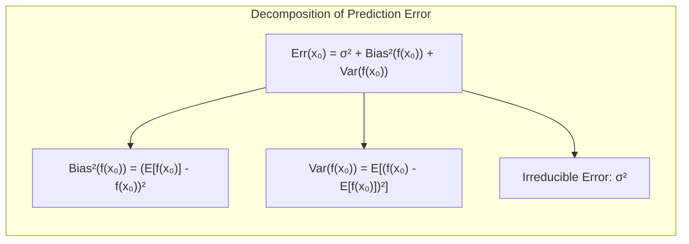

> 💡 **Exemplo Numérico:** Suponha que temos um modelo para prever o preço de casas, onde o valor real de uma casa ($y_0$) é de \\$ 500.000. Temos um modelo $f(x)$ que, em média, prevê um preço de \\$ 480.000 para casas similares ($Ef(x_0) = 480.000$). Além disso, devido à instabilidade do modelo com dados diferentes, as previsões variam com desvio padrão de \\$ 15.000, ou seja $E[f(x_0) - Ef(x_0)]^2 = 15.000^2 = 225.000.000$. Assumindo um erro irredutível $\sigma^2$ de \\$ 10.000.000, o erro total de previsão para essa casa ($Err(x_0)$) seria:
>
> $$Err(x_0) = 10.000.000 + (480.000 - 500.000)^2 + 225.000.000 = 10.000.000 + 400.000.000 + 225.000.000 = 635.000.000$$
>
> O viés ($20.000$) indica que o modelo, em média, subestima o preço da casa. A variância ($225.000.000$) indica que as previsões do modelo são bastante variáveis, e o erro irredutível é a variabilidade inerente nos dados. O objetivo é minimizar o erro total ajustando o modelo, o que pode envolver a redução do viés (tornando o modelo mais complexo) e/ou da variância (tornando o modelo mais estável).
>
> ```mermaid
>  graph LR
>      A[Erro Total] -->|635.000.000| B(Erro Irredutível 10.000.000);
>      A -->|635.000.000| C(Viés² 400.000.000);
>      A -->|635.000.000| D(Variância 225.000.000);
>      style A fill:#f9f,stroke:#333,stroke-width:2px
> ```

**Conceito 2: Linear Discriminant Analysis (LDA)**

A Linear Discriminant Analysis (LDA) é uma técnica de classificação que busca encontrar a melhor projeção linear para separar diferentes classes [^7.1]. O LDA assume que os dados dentro de cada classe seguem uma distribuição Gaussiana com a mesma matriz de covariância, mas médias distintas [^7.3]. A fronteira de decisão resultante é linear, e definida pela função discriminante $f_k(x) = x^T\Sigma^{-1}\mu_k - \frac{1}{2}\mu_k^T\Sigma^{-1}\mu_k + \log\pi_k$ [^7.3.2], onde $\mu_k$ e $\pi_k$ representam a média e a probabilidade *a priori* da classe k, e $\Sigma$ é a matriz de covariância comum. O objetivo é maximizar a separação entre as médias das classes e minimizar a variância dentro das classes.
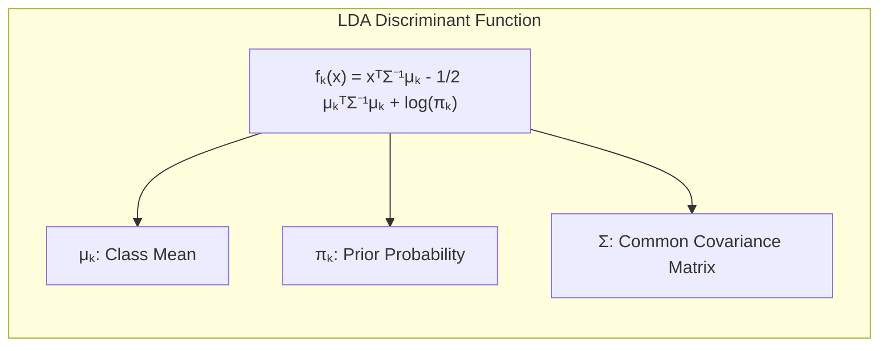
> 💡 **Exemplo Numérico:** Imagine um problema de classificação com duas classes (A e B), onde as médias das classes são $\mu_A = [1, 1]^T$ e $\mu_B = [3, 3]^T$. A matriz de covariância comum é $\Sigma = \begin{bmatrix} 1 & 0 \\ 0 & 1 \end{bmatrix}$. As probabilidades a priori são iguais, ou seja, $\pi_A = \pi_B = 0.5$.
>
> A função discriminante para a classe A é:
>
> $$f_A(x) = x^T \begin{bmatrix} 1 & 0 \\ 0 & 1 \end{bmatrix}^{-1} \begin{bmatrix} 1 \\ 1 \end{bmatrix} - \frac{1}{2} \begin{bmatrix} 1 \\ 1 \end{bmatrix}^T \begin{bmatrix} 1 & 0 \\ 0 & 1 \end{bmatrix}^{-1} \begin{bmatrix} 1 \\ 1 \end{bmatrix} + \log(0.5)$$
>
> $$f_A(x) = x^T \begin{bmatrix} 1 \\ 1 \end{bmatrix} - \frac{1}{2} \begin{bmatrix} 1 & 1 \end{bmatrix} \begin{bmatrix} 1 \\ 1 \end{bmatrix} + \log(0.5)$$
>
> $$f_A(x) = x_1 + x_2 - \frac{1}{2}(1 + 1) + \log(0.5) = x_1 + x_2 - 1 + \log(0.5)$$
>
> Analogamente, a função discriminante para a classe B é:
>
> $$f_B(x) = x_1 + x_2 - \frac{1}{2}(9+9) + \log(0.5) = x_1 + x_2 - 9 + \log(0.5)$$
>
> A fronteira de decisão é dada por $f_A(x) = f_B(x)$:
>
> $$x_1 + x_2 - 1 + \log(0.5) = x_1 + x_2 - 9 + \log(0.5)$$
>
>  $$-1 = -9$$
>  
>  O que nos leva a um ponto no espaço onde as funções são iguais:
>
> $$x_1 + x_2 - 1 = x_1 + x_2 - 9$$
> $$10 = 2x_1 + 2x_2$$
>
>  A fronteira de decisão é $x_1 + x_2 = 5$. Qualquer ponto acima da reta é classificado como pertencente à classe B, e abaixo à classe A.
> ```mermaid
>   graph LR
>      A[Classe A] -->|Média [1,1]| B(Função discriminante f_A(x));
>      C[Classe B] -->|Média [3,3]| D(Função discriminante f_B(x));
>      B --> E{Comparar f_A e f_B};
>      D --> E
>      E --> F[Classificação];
>       style A fill:#ccf,stroke:#333,stroke-width:2px
>      style C fill:#fcc,stroke:#333,stroke-width:2px
> ```

**Corolário 1:** Relação entre a função discriminante linear e projeções em subespaços.
A função discriminante linear no LDA pode ser interpretada como uma projeção dos dados originais em um subespaço de dimensão menor, onde a separação das classes é maximizada. Esta projeção simplifica o problema de classificação, reduzindo o número de variáveis relevantes e, potencialmente, melhorando a generalização [^7.3.1]. Em outras palavras, o LDA reduz a dimensionalidade dos dados, projetando-os sobre os subespaços que maximizam a separabilidade das classes.

**Conceito 3: Logistic Regression**

A regressão logística é um método probabilístico para classificação que modela a probabilidade de pertencer a uma determinada classe [^7.1]. Ao contrário do LDA, a regressão logística não assume que os dados sejam Gaussianos. Ela utiliza a função logística (sigmoid) para transformar uma combinação linear de preditores em uma probabilidade entre 0 e 1 [^7.4]. O modelo logístico tem a seguinte expressão:
$$p(X) = \frac{1}{1 + e^{-(\beta_0 + \beta_1X_1 + \ldots + \beta_pX_p)}}$$, onde $p(X)$ é a probabilidade de pertencer à classe de interesse [^7.4]. Os parâmetros ($\beta$) são estimados usando o método da máxima verossimilhança, maximizando a função de verossimilhança: $L(\beta) = \sum y_i \log p(x_i) + (1-y_i) \log(1 - p(x_i))$ [^7.4.2]. A fronteira de decisão também é linear, mas a interpretação dos coeficientes é diferente do LDA. Ambos LDA e regressão logística, apesar de suas diferenças, compartilham a propriedade de gerar fronteiras de decisão lineares, e suas aplicações dependem de diferentes conjuntos de suposições sobre os dados.
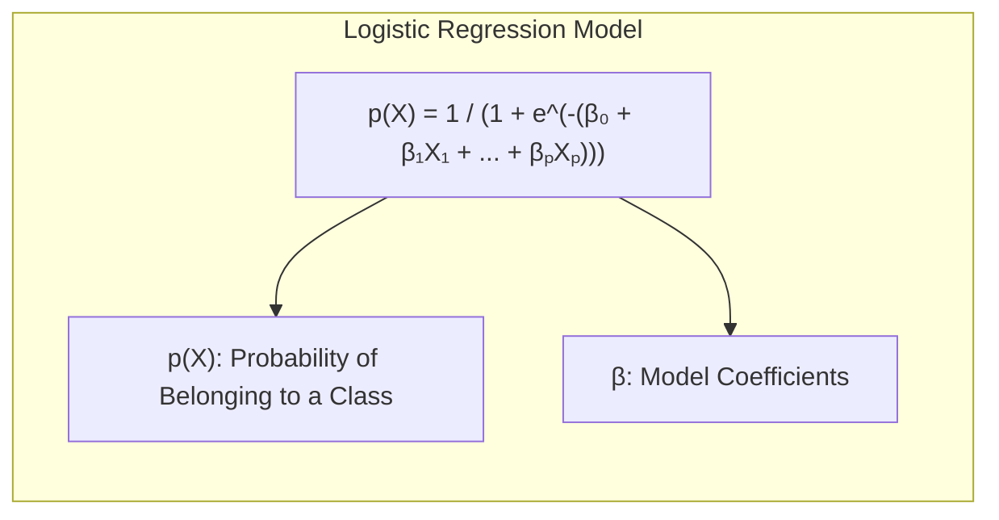
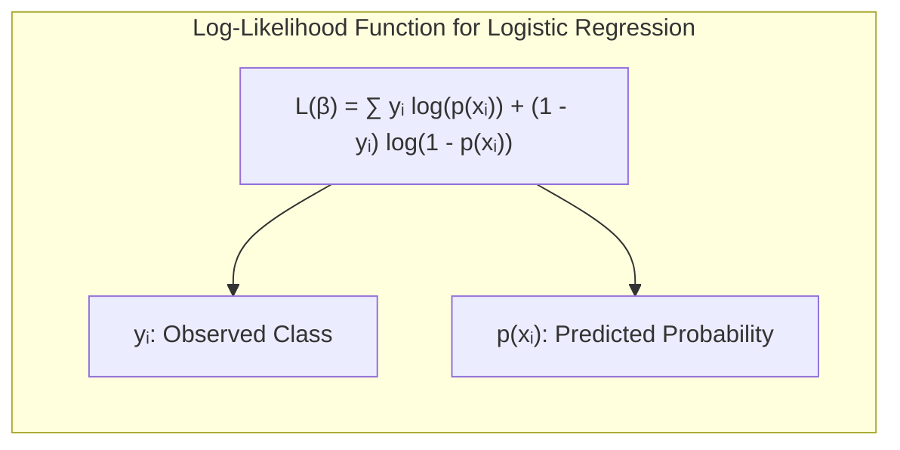

> 💡 **Exemplo Numérico:** Considere um problema de classificação binária com um único preditor ($X$). Após ajustar o modelo de regressão logística, obtemos os seguintes coeficientes: $\beta_0 = -3$ e $\beta_1 = 1.5$. Portanto, a probabilidade de pertencer à classe positiva é:
>
> $$p(X) = \frac{1}{1 + e^{-(-3 + 1.5X)}}$$
>
>  Se $X=2$:
>
>  $$p(X=2) = \frac{1}{1 + e^{-(-3 + 1.5*2)}} =  \frac{1}{1 + e^{0}} =  \frac{1}{2} = 0.5$$
>
>  Se $X=3$:
>
> $$p(X=3) = \frac{1}{1 + e^{-(-3 + 1.5*3)}} =  \frac{1}{1 + e^{1.5}} =  \frac{1}{1 + 4.48} \approx  0.18$$
>  
>  A probabilidade de pertencer à classe positiva é 0.5 quando X=2 e 0.18 quando X=3. A fronteira de decisão, neste caso, é dada quando a probabilidade é igual a 0.5, que ocorre quando $-3+1.5X = 0$, ou seja, $X = 2$. Pontos acima de $X=2$ serão classificados como classe positiva, e abaixo como classe negativa.
>
>  Para estimar esses parâmetros por máxima verossimilhança, os coeficientes são ajustados iterativamente para maximizar a probabilidade dos dados observados sob o modelo logístico.
>
> ```python
> import numpy as np
> from scipy.optimize import minimize
>
> # Dados de exemplo (X, y)
> X = np.array([1, 2, 3, 4, 5, 6])
> y = np.array([0, 0, 0, 1, 1, 1])
>
> def sigmoid(z):
>    return 1 / (1 + np.exp(-z))
>
> def log_likelihood(beta, X, y):
>    p = sigmoid(beta[0] + beta[1] * X)
>    return -np.sum(y * np.log(p) + (1 - y) * np.log(1 - p))
>
> # Otimização com minimize
> initial_beta = np.array([0, 0]) # valores iniciais
> result = minimize(log_likelihood, initial_beta, args=(X, y))
>
> # Coeficientes otimizados
> beta_0_opt = result.x[0]
> beta_1_opt = result.x[1]
>
> print(f'beta_0_opt: {beta_0_opt:.2f}')
> print(f'beta_1_opt: {beta_1_opt:.2f}')
> ```

>  Os coeficientes estimados por este código, usando um exemplo simplificado, seriam $\beta_0 = -3.49$ e $\beta_1 = 1.16$.

> ⚠️ **Nota Importante**: A escolha entre LDA e Regressão Logística depende da distribuição dos dados. LDA assume normalidade e covariância igual para cada classe, enquanto regressão logística não faz essas suposições [^7.3].
> ❗ **Ponto de Atenção**: Em situações de classes não balanceadas, a regressão logística pode apresentar resultados mais robustos do que o LDA, pois as probabilidades são calculadas diretamente [^7.4.2].
> ✔️ **Destaque**: As estimativas dos parâmetros em LDA e regressão logística podem ser correlacionadas, especialmente quando as premissas do LDA são aproximadamente satisfeitas, o que ocorre frequentemente na prática [^7.5].

### Regressão Linear e Mínimos Quadrados para Classificação
<imagem: Mapa mental mostrando a regressão linear de matriz de indicadores como um método de classificação, com nós para codificação de classes, estimação de coeficientes por mínimos quadrados, aplicação de regra de decisão e comparação com métodos probabilísticos. Diagrama de fluxo explicando como a regressão linear se encaixa como um classificador linear>

A regressão linear aplicada a uma matriz de indicadores é uma abordagem para classificação, onde cada classe é codificada como uma coluna em uma matriz binária [^7.2]. O objetivo é estimar coeficientes por mínimos quadrados. Apesar de fornecer uma fronteira de decisão linear, a regressão linear em matrizes de indicadores tem limitações [^7.1, ^7.2]. Os resultados podem levar a previsões que extrapolam o intervalo [0,1], e a função de perda por mínimos quadrados não é ideal para modelos de probabilidade. A regressão linear, nesse contexto, é mais uma forma de gerar a fronteira linear, não de obter probabilidades associadas às classes. Em um problema de classificação binária, por exemplo, se codificamos a classe positiva como 1 e a negativa como 0, a regressão linear busca uma função que se aproxime desses valores. A classe prevista é então determinada pela regra de decisão: se a predição for maior do que 0.5, é classificada como positiva, senão, como negativa. No entanto, esta abordagem pode gerar estimativas instáveis, especialmente quando o número de preditores é grande em relação ao número de observações.

> 💡 **Exemplo Numérico:** Imagine um problema de classificação binária onde temos um único preditor (X) e duas classes (0 e 1). Criamos uma matriz de indicadores onde a classe 0 é codificada como 0 e a classe 1 como 1. Após ajustar um modelo de regressão linear usando mínimos quadrados, obtemos a seguinte equação de predição: $\hat{Y} = 0.2 + 0.6X$.
>
> - Se $X=0$, a predição é $\hat{Y} = 0.2$. Como $0.2 < 0.5$, o ponto é classificado como classe 0.
> - Se $X=1$, a predição é $\hat{Y} = 0.8$. Como $0.8 > 0.5$, o ponto é classificado como classe 1.
> - Se $X=2$, a predição é $\hat{Y} = 1.4$. Embora a predição seja maior que 1, a regra de decisão ainda classificaria como classe 1. Isso demonstra como a regressão linear pode extrapolar além do intervalo [0,1], mesmo em problemas de classificação.

**Lemma 2:** Equivalência das projeções geradas por regressão linear e discriminantes lineares.
Sob certas condições, as projeções nos hiperplanos de decisão gerados por regressão linear e por discriminantes lineares podem ser equivalentes. Isto ocorre quando as classes são bem separadas e as suposições de linearidade são aproximadamente satisfeitas. Essa equivalência implica que a regressão linear pode, em alguns casos, gerar resultados similares à análise discriminante linear, mas sem a estrutura probabilística inerente ao LDA [^7.3]. $\blacksquare$
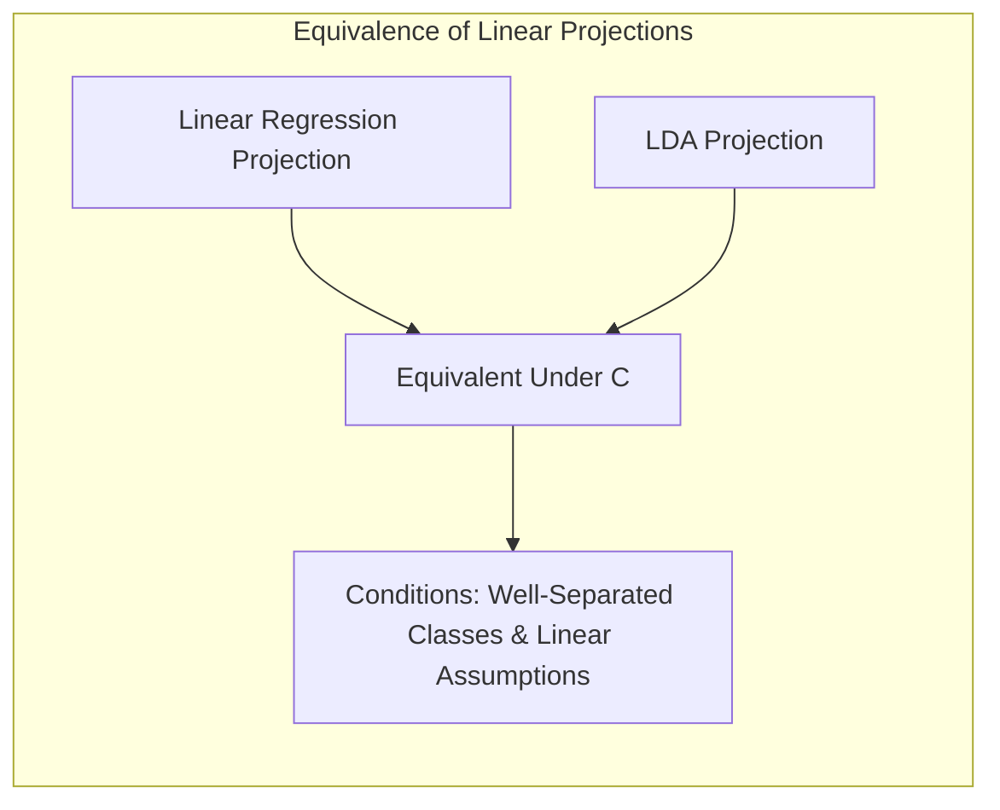

**Corolário 2:** Simplificação da análise do modelo por meio da equivalência.
Ao estabelecer a equivalência entre projeções, a análise do modelo pode ser simplificada, permitindo a utilização de ferramentas de álgebra linear para estudar as propriedades da fronteira de decisão, tais como a sua normal e distância da origem [^7.3].

> ⚠️ **Nota Importante**: A regressão de indicadores pode levar a extrapolações fora do intervalo [0,1], resultando em previsões sem interpretação probabilística. [^7.4]
> ❗ **Ponto de Atenção**: A regressão de indicadores é mais apropriada quando o objetivo principal é a separação linear das classes, e não a obtenção de probabilidades [^7.2].

### Métodos de Seleção de Variáveis e Regularização em Classificação
<imagem: Mapa mental que conecta seleção de variáveis, regularização (L1, L2, Elastic Net), e suas aplicações em regressão logística e métodos discriminantes lineares, mostrando como elas afetam o desempenho do modelo e a interpretabilidade dos coeficientes. A regularização se encaixa na função de custo, que combina verossimilhança e termos de penalização>
A seleção de variáveis e a regularização são técnicas cruciais para lidar com problemas de classificação em alta dimensão, onde um grande número de preditores pode levar a overfitting e modelos instáveis [^7.5]. A regularização adiciona termos de penalidade à função de custo, que são funções dos parâmetros do modelo. Na regressão logística, é comum utilizar as penalizações L1 e L2 [^7.4.4]. A penalização L1 (Lasso) adiciona uma penalidade proporcional à soma dos valores absolutos dos coeficientes, induzindo *sparsity* ou seja, forçando alguns coeficientes a serem exatamente zero [^7.4.4]. A penalização L2 (Ridge) adiciona uma penalidade proporcional à soma dos quadrados dos coeficientes, reduzindo a magnitude dos coeficientes sem necessariamente levá-los a zero. A combinação dessas penalizações é conhecida como Elastic Net, e proporciona um equilíbrio entre *sparsity* e estabilidade [^7.5]. A escolha do parâmetro de regularização é geralmente realizada via validação cruzada.

> 💡 **Exemplo Numérico:** Suponha que estamos ajustando um modelo de regressão logística com 5 preditores e temos os seguintes coeficientes sem regularização: $\beta = [1.2, -0.8, 2.5, -0.3, 0.9]$.
>
> **Regularização L1 (Lasso):** Adicionamos uma penalidade L1 à função de custo. Para $\lambda = 0.5$, os coeficientes podem ser reduzidos para $\beta_{L1} = [0.7, -0.3, 1.8, 0, 0.4]$, e para $\lambda=1$, os coeficientes podem ser reduzidos ainda mais, $\beta_{L1} = [0.4, 0, 1.2, 0, 0]$. A regularização L1 forçou alguns coeficientes a serem exatamente zero, o que simplifica o modelo e ajuda na interpretação.
>
> **Regularização L2 (Ridge):**  Adicionamos uma penalidade L2 à função de custo. Para $\lambda = 0.5$, os coeficientes podem ser reduzidos para $\beta_{L2} = [1.0, -0.6, 2.0, -0.2, 0.7]$. Os coeficientes são reduzidos, mas nenhum é exatamente zero.
>
> **Elastic Net:** Combinamos L1 e L2. Usando uma combinação dos dois com $\lambda = 0.5$ e um fator de mistura $\alpha=0.5$ , os coeficientes podem ser $\beta_{EN} = [0.8, -0.4, 1.9, 0, 0.6]$. O Elastic Net induz *sparsity*, mas com menor magnitude em relação ao Lasso.
>
>  O parâmetro $\lambda$ controla a força da regularização, e o $\alpha$ o balanço entre L1 e L2, e geralmente é ajustado via validação cruzada. O objetivo da regularização é equilibrar o ajuste do modelo aos dados de treinamento com a sua capacidade de generalizar para novos dados, evitando overfitting.
>
> | Método | Coeficientes $\beta$ (sem regularização) | Coeficientes $\beta$ (com regularização) |  $\lambda$ | Interpretação |
> | -------- | ------------------------------------ | ------------------------------------ | -------- | --------------- |
> | Sem Reg  |  [1.2, -0.8, 2.5, -0.3, 0.9]         |  [1.2, -0.8, 2.5, -0.3, 0.9]       |    -     | Base |
> | L1       |  [1.2, -0.8, 2.5, -0.3, 0.9]         |  [0.7, -0.3, 1.8, 0, 0.4]      |  0.5      | *Sparsity*, alguns coeficientes = 0  |
> | L1       |  [1.2, -0.8, 2.5, -0.3, 0.9]         |  [0.4, 0, 1.2, 0, 0]      |  1      |  *Sparsity*, mais coeficientes = 0   |
> | L2       |  [1.2, -0.8, 2.5, -0.3, 0.9]         | [1.0, -0.6, 2.0, -0.2, 0.7]      |  0.5     |  Redução da magnitude dos coeficientes |
> | Elastic Net       | [1.2, -0.8, 2.5, -0.3, 0.9]        |   [0.8, -0.4, 1.9, 0, 0.6]    | 0.5, $\alpha=0.5$  | Combinação de *sparsity* e estabilidade |
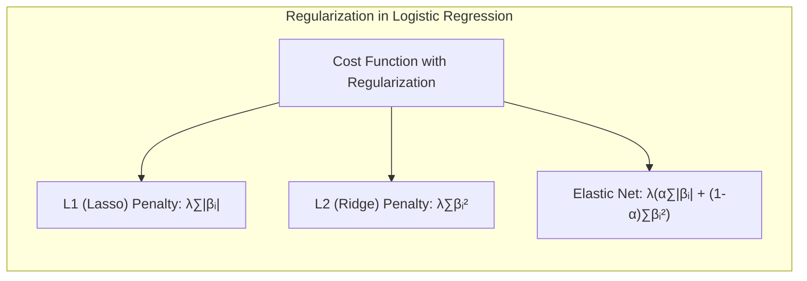

**Lemma 3:** Efeito da penalização L1 na classificação logística.
A penalização L1 na classificação logística leva a coeficientes esparsos devido à sua natureza, que promove soluções onde muitos coeficientes são zero. Isso simplifica o modelo, melhora a interpretabilidade e pode reduzir o risco de overfitting [^7.4.4]. $\blacksquare$
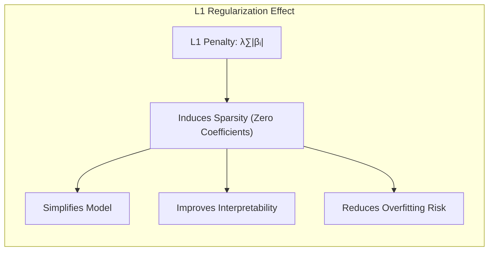

**Prova do Lemma 3:**
A penalização L1 adiciona um termo proporcional à soma dos valores absolutos dos coeficientes, na função objetivo da regressão logística, ou seja, na otimização do problema. A função de custo, ao adicionar essa penalização, torna-se não-diferenciável em coeficientes nulos, o que faz com que a solução ótima, para alguns casos, inclua coeficientes exatamente iguais a zero. Este é um efeito da geometria da penalidade, que é uma forma de induzir a *sparsity*, sem ter que realizar a seleção discreta de variáveis, que é um problema não-convexo [^7.4.3, ^7.4.4]. $\blacksquare$

**Corolário 3:** Implicações para a interpretabilidade dos modelos classificatórios.
A *sparsity* induzida pela penalização L1 simplifica os modelos de classificação, destacando os preditores mais relevantes e facilitando a interpretação dos resultados. Esta propriedade é particularmente útil em cenários com um grande número de preditores, permitindo que o cientista de dados foque nos preditores mais significativos [^7.4.5].
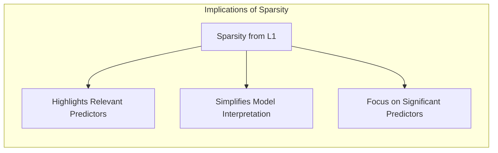

> ⚠️ **Ponto Crucial**: A penalização Elastic Net combina as vantagens das regularizações L1 e L2, buscando um equilíbrio entre a *sparsity* da L1 e a estabilidade da L2, o que é especialmente útil em dados com alta colinearidade [^7.5].

### Separating Hyperplanes e Perceptrons
<imagem: Diagrama mostrando a ideia de hyperplanes separadores, com a margem sendo maximizada. Use a linguagem Mermaid ou um diagrama em caixa para representar o dual de Wolfe e como os pontos de suporte são utilizados na solução. A sequência de ajuste de pesos no Perceptron também pode ser representada visualmente>
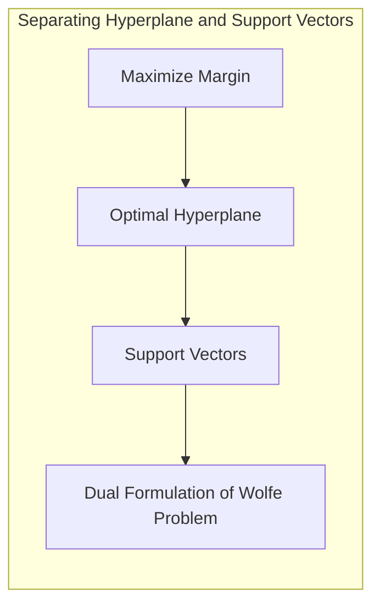

A ideia de maximizar a margem de separação entre classes leva ao conceito de hiperplanos ótimos em problemas de classificação [^7.5.2]. O objetivo é encontrar um hiperplano que não apenas separe as classes, mas também maximize a distância entre o hiperplano e os pontos de dados mais próximos (pontos de suporte). A formulação matemática do problema envolve a resolução de um problema de otimização que pode ser expressa na forma dual de Wolfe, onde os coeficientes da fronteira de decisão são combinações lineares dos pontos de suporte. O Perceptron de Rosenblatt é um algoritmo que busca encontrar um hiperplano que separe duas classes, ajustando os pesos iterativamente. A convergência do Perceptron é garantida sob condições específicas de separabilidade linear dos dados [^7.5.1].

### Pergunta Teórica Avançada: Quais as diferenças fundamentais entre a formulação de LDA e a Regra de Decisão Bayesiana considerando distribuições Gaussianas com covariâncias iguais?
**Resposta:**
Sob a suposição de distribuições Gaussianas com a mesma matriz de covariância, o LDA se torna uma aproximação da regra de decisão Bayesiana. No entanto, LDA estima os parâmetros a partir dos dados, enquanto a regra de decisão Bayesiana assume que esses parâmetros são conhecidos [^7.3]. A função discriminante do LDA surge da comparação das densidades de probabilidade Gaussianas de cada classe, sendo calculada como: $f_k(x) = x^T \Sigma^{-1} \mu_k - \frac{1}{2} \mu_k^T \Sigma^{-1} \mu_k + \log\pi_k$ [^7.3.2]. A regra de decisão Bayesiana, por outro lado, seleciona a classe com a maior probabilidade *a posteriori*, sendo expressa por: $P(G=k|X=x) \propto \pi_k f_k(x)$, onde $f_k(x)$ é a densidade da classe $k$. A fronteira de decisão é linear em ambos os casos, mas o LDA estima seus parâmetros a partir dos dados, enquanto a regra de decisão Bayesiana assume que eles são conhecidos.
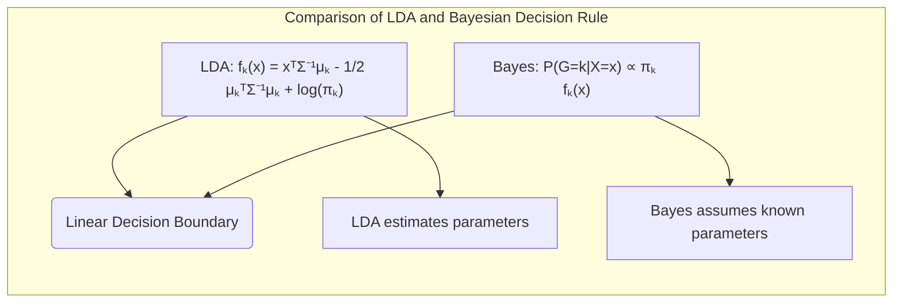

**Lemma 4:** Equivalência formal entre LDA e decisão Bayesiana em distribuições Gaussianas com covariância igual.
Quando a matriz de covariância é a mesma para todas as classes e as densidades são Gaussianas, a função discriminante do LDA coincide com a função logaritmo da razão de probabilidades a posteriori na decisão Bayesiana. Esta equivalência é um resultado direto da aplicação da fórmula de Bayes e da suposição de covariância comum [^7.3, ^7.3.3]. $\blacksquare$
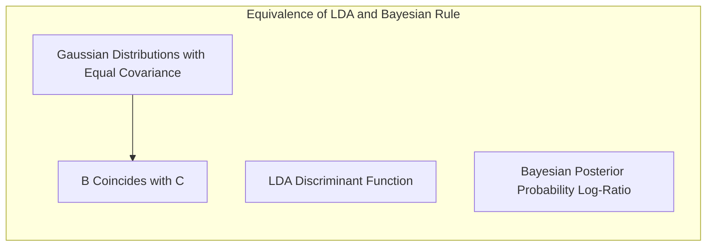

**Corolário 4:** Fronteiras quadráticas com covariâncias diferentes.
Quando a hipótese de covariâncias iguais é relaxada, a função discriminante resultante passa a ser quadrática, levando ao método QDA (Quadratic