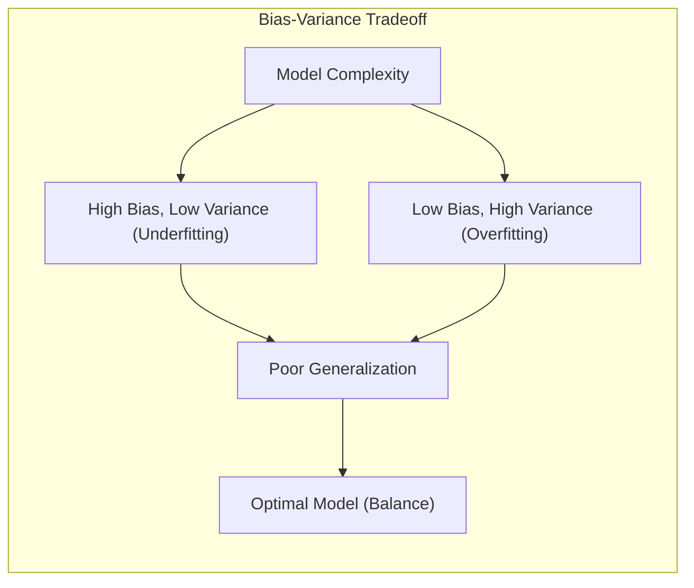
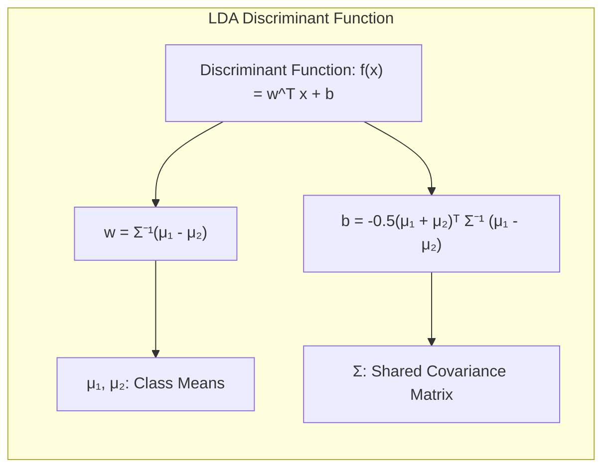
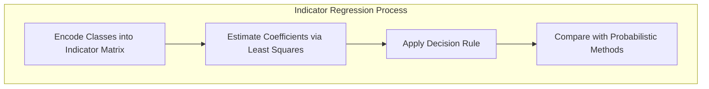
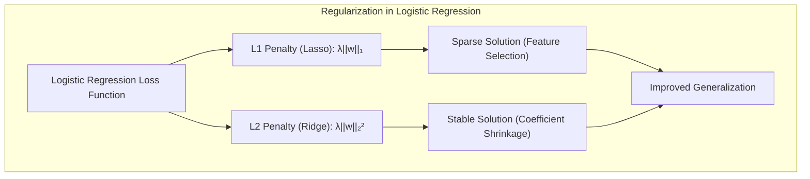
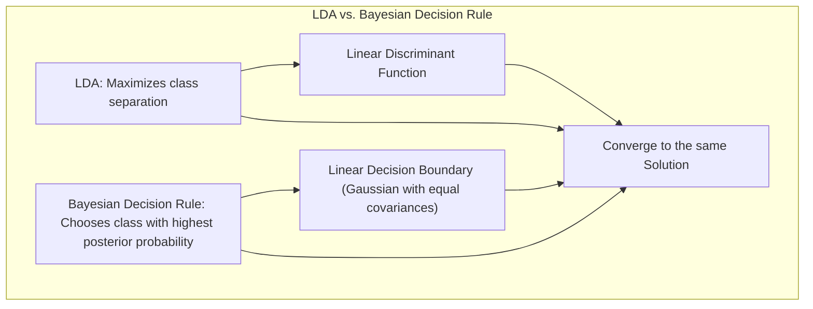
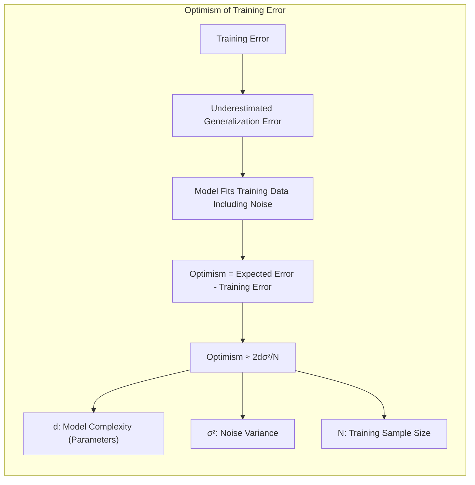
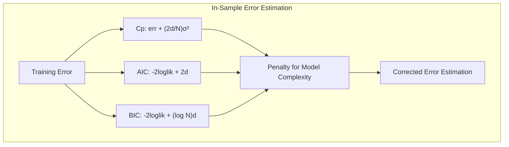
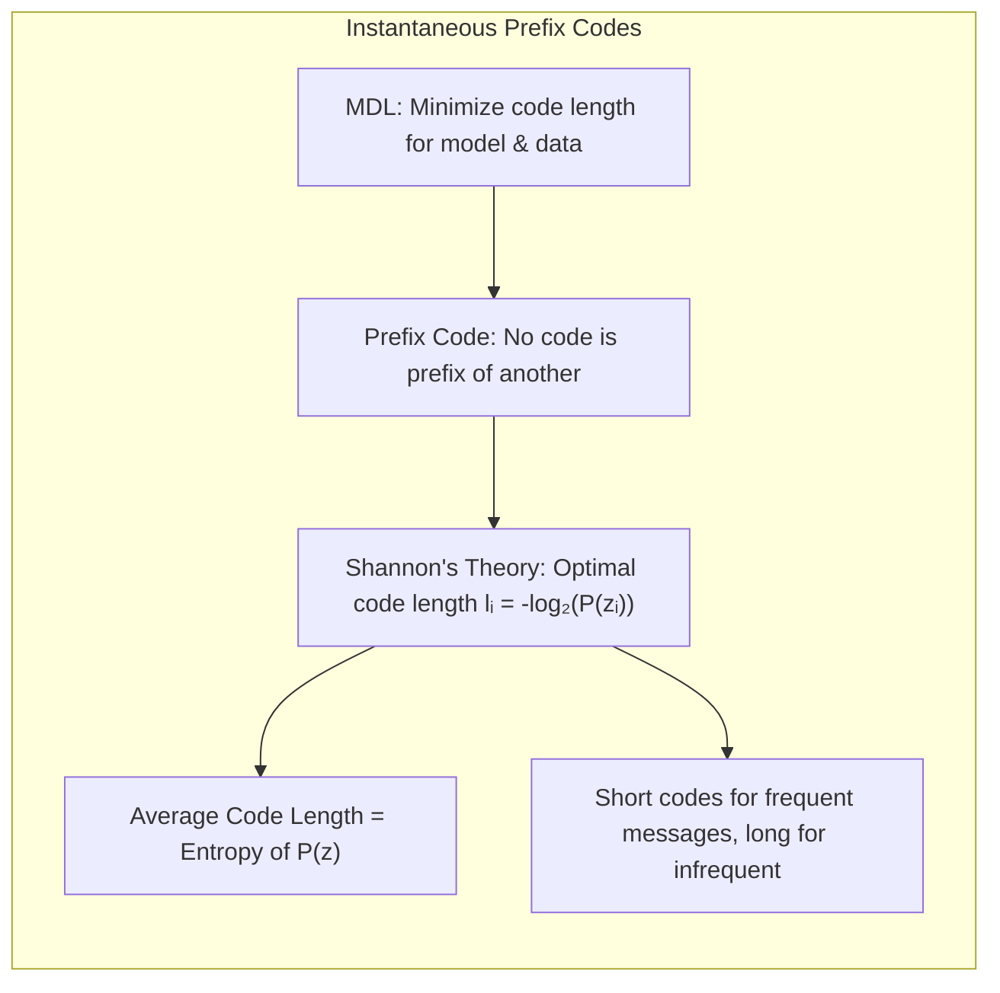

## Model Assessment and Selection: Focus on Instantaneous Prefix Codes
<imagem: Mapa mental abrangente que conecta conceitos de avaliação de modelos, incluindo a análise do trade-off bias-variância, métodos de seleção de modelos (AIC, BIC, MDL, cross-validation e bootstrap) e sua relação com a complexidade do modelo, culminando na discussão sobre códigos instantâneos de prefixo e sua importância para seleção de modelos via Minimum Description Length (MDL)>

### Introdução
A avaliação e seleção de modelos são etapas cruciais no processo de aprendizado de máquina, pois impactam diretamente a capacidade de generalização do modelo para novos dados [^7.1]. A escolha adequada de um modelo não se resume a obter o melhor desempenho nos dados de treinamento, mas sim a encontrar um equilíbrio entre a complexidade do modelo e sua capacidade de prever corretamente instâncias não vistas. Este capítulo explora as metodologias fundamentais para avaliar o desempenho de modelos e como essas metodologias podem ser utilizadas para orientar a seleção de modelos, com ênfase na análise do trade-off bias-variância e técnicas como AIC, BIC, MDL, cross-validation e bootstrap [^7.1]. Além disso, a discussão será direcionada para o entendimento de como conceitos de códigos instantâneos de prefixo (instantaneous prefix codes) se conectam com a seleção de modelos através do Minimum Description Length (MDL) [^7.8].

### Conceitos Fundamentais
A capacidade de um modelo de generalizar para dados não vistos é de extrema importância [^7.1]. Métodos de avaliação de modelos, como a análise do *trade-off bias-variância*, auxiliam na compreensão de como a complexidade do modelo afeta seu desempenho em dados de treinamento e teste [^7.2]. Um modelo com alta complexidade pode se ajustar muito bem aos dados de treinamento (baixo bias), mas corre o risco de sofrer de overfitting e generalizar mal (alta variância) [^7.2]. Por outro lado, um modelo simples pode sofrer de underfitting, com um alto bias e baixa variância [^7.2]. O objetivo é encontrar um ponto de equilíbrio que minimize o erro de generalização [^7.2].

**Conceito 1:** O **problema de classificação** envolve a atribuição de uma instância de dados a uma ou mais categorias pré-definidas. Técnicas lineares são frequentemente usadas como ponto de partida para construir fronteiras de decisão que separam as classes [^7.2]. O uso de modelos lineares implica em um trade-off entre bias e variância; modelos mais simples tendem a apresentar alto bias (viés) e baixa variância, enquanto modelos mais complexos podem exibir baixo bias e alta variância [^7.2].
**Lemma 1:** *Em um problema de classificação binária, se a função discriminante linear é definida como $f(x) = w^Tx + b$, onde $w$ é o vetor de pesos e $b$ é o bias, a fronteira de decisão é um hiperplano. A direção de $w$ determina a orientação do hiperplano e o valor de $b$ determina o deslocamento. Alterações nos parâmetros $w$ e $b$ ajustam a inclinação e a posição da fronteira, influenciando diretamente as classificações feitas pelo modelo*.
$$
\text{Fronteira de Decisão} = \{ x: w^Tx + b = 0 \}
$$
> 💡 **Exemplo Numérico:** Imagine que temos um problema de classificação binária em duas dimensões, onde $x = [x_1, x_2]^T$. Seja $w = [2, -1]^T$ e $b = -1$. A fronteira de decisão é dada por $2x_1 - x_2 - 1 = 0$, ou seja, $x_2 = 2x_1 - 1$. Um ponto como $(1, 0)$ estará abaixo da linha e será classificado como uma classe, enquanto o ponto $(2, 2)$ estará acima da linha e será classificado como a outra classe. Se aumentarmos o valor de $w_1$ para $3$, a nova fronteira será $3x_1 - x_2 - 1 = 0$, que corresponde a $x_2 = 3x_1 - 1$, alterando a inclinação da fronteira. Se diminuirmos $b$ para $-2$, a nova fronteira será $x_2 = 2x_1 - 2$, deslocando a linha para baixo. Essas mudanças nos parâmetros $w$ e $b$ impactam diretamente a classificação dos pontos.

**Conceito 2:** **Linear Discriminant Analysis (LDA)** é um método de classificação que assume que as classes são geradas a partir de distribuições Gaussianas com a mesma matriz de covariância [^7.3]. LDA busca projetar os dados em um subespaço de menor dimensão, maximizando a separabilidade entre as classes e minimizando a variância intra-classe [^7.3.1]. A função discriminante linear em LDA é obtida através da análise da média e covariância das classes, que são usadas para construir uma função linear que define a fronteira de decisão [^7.3.3].
**Corolário 1:** *Para um problema de classificação com duas classes, a função discriminante linear obtida por LDA pode ser expressa como* $f(x) = w^T x + b$, *onde* $w = \Sigma^{-1}(\mu_1 - \mu_2)$ *e* $b = -0.5(\mu_1 + \mu_2)^T \Sigma^{-1} (\mu_1 - \mu_2)$. *Aqui, $\mu_1$ e $\mu_2$ são as médias das duas classes e $\Sigma$ é a matriz de covariância comum*. [^7.3.2]

> 💡 **Exemplo Numérico:** Considere duas classes com médias $\mu_1 = [1, 1]^T$ e $\mu_2 = [3, 2]^T$, e uma matriz de covariância comum $\Sigma = \begin{bmatrix} 1 & 0.5 \\ 0.5 & 1 \end{bmatrix}$.
>
> $\text{Passo 1: Calcule } \Sigma^{-1}$:
> $\Sigma^{-1} = \frac{1}{(1)(1) - (0.5)(0.5)} \begin{bmatrix} 1 & -0.5 \\ -0.5 & 1 \end{bmatrix} = \frac{1}{0.75} \begin{bmatrix} 1 & -0.5 \\ -0.5 & 1 \end{bmatrix} = \begin{bmatrix} 4/3 & -2/3 \\ -2/3 & 4/3 \end{bmatrix}$
>
> $\text{Passo 2: Calcule } w$:
> $w = \Sigma^{-1}(\mu_1 - \mu_2) = \begin{bmatrix} 4/3 & -2/3 \\ -2/3 & 4/3 \end{bmatrix} \begin{bmatrix} 1 - 3 \\ 1 - 2 \end{bmatrix} = \begin{bmatrix} 4/3 & -2/3 \\ -2/3 & 4/3 \end{bmatrix} \begin{bmatrix} -2 \\ -1 \end{bmatrix} = \begin{bmatrix} -8/3 + 2/3 \\ 4/3 - 4/3 \end{bmatrix} = \begin{bmatrix} -2 \\ 0 \end{bmatrix}$
>
> $\text{Passo 3: Calcule } b$:
> $b = -0.5(\mu_1 + \mu_2)^T \Sigma^{-1} (\mu_1 - \mu_2) = -0.5([4, 3]) \begin{bmatrix} 4/3 & -2/3 \\ -2/3 & 4/3 \end{bmatrix} \begin{bmatrix} -2 \\ -1 \end{bmatrix} = -0.5([4, 3]) \begin{bmatrix} -2 \\ 0 \end{bmatrix} = -0.5(-8) = 4$
>
> A função discriminante linear é então $f(x) = -2x_1 + 4$. Um ponto com $x_1 > 2$ é classificado como pertencente à classe 1 e um ponto com $x_1 < 2$ é classificado como pertencente à classe 2.

**Conceito 3:** **Logistic Regression** é um modelo de classificação que estima a probabilidade de uma instância pertencer a uma classe específica [^7.4]. Ao contrário do LDA, que faz suposições sobre a distribuição dos dados, Logistic Regression modela diretamente a probabilidade usando a função sigmóide [^7.4.1]. O modelo é treinado através da maximização da verossimilhança dos dados observados, que leva à otimização de um problema convexo [^7.4.3]. O uso do *logit* (log-odds) transforma o problema em um modelo linear [^7.4.2]. Logistic Regression também pode ser regularizada para evitar overfitting [^7.4.4].
> ⚠️ **Nota Importante**: É crucial notar a diferença entre LDA, que modela as distribuições condicionais de classe, e a regressão logística, que modela diretamente a probabilidade de pertinência de uma classe. A escolha entre os dois métodos depende do contexto e das suposições que podem ser feitas sobre os dados. [^7.4.5]
> ❗ **Ponto de Atenção**: A regressão logística, por meio da função logit, transforma a probabilidade (que está no intervalo [0, 1]) em uma escala linear, permitindo que as relações entre as variáveis e a probabilidade de classe possam ser modeladas linearmente. [^7.4.1]
> ✔️ **Destaque**: As estimativas dos parâmetros em LDA e regressão logística estão relacionadas quando as classes são Gaussianas com covariâncias similares. A regressão logística pode ser mais flexível devido à não necessidade de supor normalidade e covariância [^7.5].

### Regressão Linear e Mínimos Quadrados para Classificação
<imagem: Diagrama de fluxo detalhado que representa o processo de regressão de indicadores, desde a codificação das classes até a aplicação da regra de decisão e comparação com métodos probabilísticos; e um mapa mental conectando regressão linear, LDA e logistic regression, mostrando suas diferenças e similaridades.>

A **regressão linear** pode ser adaptada para problemas de classificação através da criação de uma **matriz de indicadores**, em que cada coluna representa uma classe e os valores indicam a pertinência de uma instância a essa classe [^7.2]. Após ajustar um modelo de regressão linear à matriz de indicadores, uma regra de decisão é aplicada para classificar as instâncias com base nos valores previstos [^7.2]. Embora simples e direta, essa abordagem pode apresentar limitações em cenários com múltiplas classes ou quando as suposições da regressão linear não são satisfeitas [^7.2].

**Lemma 2:** *Em um problema de classificação binária, usando regressão linear com uma matriz de indicadores, a fronteira de decisão é definida pelo conjunto de pontos onde o valor previsto pelo modelo de regressão linear para a classe 1 é igual ao valor previsto para a classe 0, o que, em termos práticos, se traduz numa fronteira linear que pode ser equivalente aos hiperplanos discriminantes lineares em certas condições*. [^7.2]
$$
\text{Fronteira de Decisão} = \{ x: \hat{y}_1(x) = \hat{y}_0(x) \}
$$
**Corolário 2:** *A aplicação do método de mínimos quadrados na regressão de indicadores busca otimizar os coeficientes dos modelos lineares para cada classe, de forma que os valores previstos para a matriz de indicadores sejam o mais próximos possível dos valores observados. No contexto de classificação, os valores preditos (geralmente contínuos) são então transformados em classificações de classe usando uma regra de decisão apropriada.* [^7.2]
> 💡 **Exemplo Numérico:** Considere um problema de classificação binária com duas classes (0 e 1) e duas características $x_1$ e $x_2$. Temos os seguintes dados:
>
> | Instância | $x_1$ | $x_2$ | Classe |
> |-----------|-------|-------|--------|
> | 1         | 1     | 2     | 0      |
> | 2         | 2     | 3     | 0      |
> | 3         | 3     | 1     | 1      |
> | 4         | 4     | 2     | 1      |
>
> A matriz de indicadores para este problema seria:
>
> $Y = \begin{bmatrix} 1 & 0 \\ 1 & 0 \\ 0 & 1 \\ 0 & 1 \end{bmatrix}$, onde a primeira coluna indica a classe 0 e a segunda a classe 1. A matriz de características X é:
>
> $X = \begin{bmatrix} 1 & 1 & 2 \\ 1 & 2 & 3 \\ 1 & 3 & 1 \\ 1 & 4 & 2 \end{bmatrix}$, com uma coluna de 1's para o intercepto.
>
> Usando o método de mínimos quadrados, podemos calcular os coeficientes $\hat{\beta} = (X^T X)^{-1} X^T Y$.
>
> O cálculo de $\hat{\beta}$ resulta em coeficientes para cada classe. Suponha que, após o cálculo, obtivemos os seguintes coeficientes (para simplificação, vamos assumir estes valores):
>
> $\hat{\beta}_0 = \begin{bmatrix} 1.5 \\ -0.8 \\ 0.2 \end{bmatrix}$ para a classe 0, e
> $\hat{\beta}_1 = \begin{bmatrix} -0.5 \\ 0.8 \\ -0.2 \end{bmatrix}$ para a classe 1.
>
> Para a instância com $x_1=3$ e $x_2=1$, as previsões seriam:
>
> $\hat{y}_0 = 1.5 - 0.8*3 + 0.2*1 = -0.7$ (para a classe 0)
> $\hat{y}_1 = -0.5 + 0.8*3 - 0.2*1 = 1.7$ (para a classe 1)
>
> A regra de decisão é: classifique a instância na classe com o maior valor previsto. Neste caso, classificaríamos a instância como pertencente à classe 1, o que está correto.

É fundamental notar que a **regressão linear para classificação** pode sofrer de problemas como o "masking problem" (onde algumas classes podem ser mascaradas por outras), especialmente quando há correlação entre as classes [^7.3]. Além disso, as estimativas de probabilidade obtidas pela regressão linear podem ser instáveis e apresentar valores fora do intervalo [0, 1] [^7.4]. Em contraste, a **regressão logística** fornece uma abordagem mais estável, uma vez que modela diretamente as probabilidades usando a função sigmóide e evita essas extrapolações [^7.4]. Contudo, a regressão linear em matriz de indicadores pode ser suficiente quando o foco principal é a obtenção da fronteira de decisão linear [^7.2].

### Métodos de Seleção de Variáveis e Regularização em Classificação
<imagem: Diagrama ilustrativo da aplicação de penalizações L1 e L2 em um modelo logístico, mostrando como a regularização controla a esparsidade e estabilidade dos coeficientes; e um mapa mental conectando os métodos de regularização L1, L2 e Elastic Net com os conceitos de LDA, logistic regression e separação por hiperplanos.>

A **seleção de variáveis** e a **regularização** são técnicas importantes para lidar com modelos complexos e evitar o overfitting [^7.4.4]. Em modelos de classificação, como a Logistic Regression, as penalidades L1 e L2 são comumente utilizadas para controlar a magnitude dos coeficientes, o que leva a modelos mais simples e com maior capacidade de generalização [^7.4.4], [^7.5]. A penalização L1 (Lasso) promove a esparsidade do modelo, levando a que alguns coeficientes se tornem exatamente zero, o que auxilia na seleção de variáveis mais relevantes [^7.4.4]. A penalização L2 (Ridge) reduz a magnitude dos coeficientes, mas não os elimina, o que contribui para a estabilidade do modelo [^7.5.1].

**Lemma 3:** *Em uma regressão logística com penalidade L1, a função de custo é definida como a soma da log-verossimilhança negativa com um termo de penalidade proporcional à norma L1 dos coeficientes, que incentiva a esparsidade.*
$$
\text{Custo}(w) = -\sum_{i=1}^N [y_i \log(\sigma(w^Tx_i)) + (1-y_i) \log(1 - \sigma(w^Tx_i))] + \lambda \sum_{j=1}^p |w_j|
$$
**Prova do Lemma 3:** A penalidade L1 na função de custo força a esparsidade devido à forma da função |w|. A derivada de |w| em relação a w é -1 se w < 0 e +1 se w > 0, com uma descontinuidade em w=0, o que leva a coeficientes a serem "empurrados" para zero. O termo de penalização $\lambda \sum_{j=1}^p |w_j|$ adiciona um viés na solução que leva a alguns coeficientes a serem exatamente iguais a zero. Isso resulta em um modelo esparso onde apenas os preditores mais relevantes são retidos. $\blacksquare$
**Corolário 3:** *A penalização L1 resulta em modelos mais interpretáveis, dado que os coeficientes das variáveis menos relevantes são eliminados, simplificando o modelo e permitindo uma identificação mais clara das variáveis que têm impacto mais forte na classificação*. [^7.4.5]
> 💡 **Exemplo Numérico:** Vamos considerar um problema de classificação binária com 3 variáveis, $x_1$, $x_2$ e $x_3$, e vamos usar regressão logística com regularização L1 (Lasso). Suponha que sem regularização, os coeficientes sejam $w = [1.2, -0.8, 0.5]^T$. Aplicando a regularização L1 com um $\lambda = 0.5$, a função de custo penaliza coeficientes não nulos. O processo de otimização irá "empurrar" alguns coeficientes para zero. Digamos que o resultado seja $w_{L1} = [0.7, 0, 0.1]^T$. O coeficiente de $x_2$ se tornou zero, indicando que essa variável é menos importante para o modelo e foi eliminada, resultando em um modelo mais esparso e interpretável. Se tivéssemos usado L2 com $\lambda=0.5$ (Ridge), o resultado poderia ser $w_{L2} = [0.9, -0.5, 0.3]^T$. Neste caso, todos os coeficientes são reduzidos em magnitude, mas nenhum é zerado. A escolha entre L1 ou L2 (ou a combinação delas com Elastic Net) depende da necessidade de esparsidade e da estabilidade do modelo.

> ⚠️ **Ponto Crucial**:  A combinação das penalidades L1 e L2, conhecida como Elastic Net, permite aproveitar as vantagens de ambas as abordagens, combinando esparsidade e estabilidade [^7.5].

### Separating Hyperplanes e Perceptrons
A ideia de encontrar o **hiperplano** que melhor separa as classes em um problema de classificação linear leva ao conceito de **separating hyperplanes**, onde o objetivo é maximizar a margem de separação entre as classes [^7.5.2]. A formulação desse problema de otimização é normalmente realizada através do dual de Wolfe, que resulta em soluções representadas por combinações lineares dos pontos de suporte [^7.5.2]. O **Perceptron de Rosenblatt** é um algoritmo que busca iterativamente um hiperplano separador, que converge sob condições específicas de linear separabilidade dos dados [^7.5.1].

### Pergunta Teórica Avançada: Quais as diferenças fundamentais entre a formulação de LDA e a Regra de Decisão Bayesiana considerando distribuições Gaussianas com covariâncias iguais?
**Resposta:** LDA e a regra de decisão Bayesiana, quando aplicadas a dados Gaussianos com covariâncias iguais, convergem para a mesma solução sob as condições apropriadas [^7.3].
*   **LDA:** Assume que os dados de cada classe seguem uma distribuição normal multivariada, com a mesma matriz de covariância para todas as classes. A função discriminante linear é derivada analiticamente com o objetivo de maximizar a separação entre as médias das classes, enquanto minimiza a variância dentro de cada classe [^7.3.1]. A fronteira de decisão linear resultante é obtida projetando os dados num subespaço que otimiza a separabilidade das classes [^7.3.2].
*   **Regra de Decisão Bayesiana:** Busca classificar uma instância para a classe com maior probabilidade a posteriori. Quando as distribuições de classe são Gaussianas com covariâncias iguais, a regra de decisão Bayesiana também leva a fronteiras de decisão lineares [^7.3]. A decisão é baseada nas probabilidades a posteriori que, sob as suposições de normalidade com covariâncias iguais, podem ser expressas como uma função linear das features.

**Lemma 4:** *Quando as distribuições das classes são Gaussianas com mesma matriz de covariância, a função discriminante linear obtida por LDA é equivalente à função discriminante da regra de decisão Bayesiana, com a única diferença sendo a constante aditiva na função discriminante. Ou seja, as projeções nos hiperplanos de decisão são iguais, mas as constantes de decisão podem variar*. [^7.3]
**Corolário 4:** *Se relaxarmos a suposição de que todas as classes têm covariâncias iguais, a regra de decisão Bayesiana leva a fronteiras de decisão quadráticas em vez de lineares (Quadratic Discriminant Analysis - QDA), pois neste caso as funções discriminantes já não são mais lineares* [^7.3].
> ⚠️ **Ponto Crucial**: A escolha entre LDA e QDA depende crucialmente da validade da suposição sobre a covariância das classes. Se as covariâncias forem aproximadamente iguais, LDA pode ser preferível pela simplicidade e menor número de parâmetros. Caso contrário, QDA é mais apropriado mas pode levar a overfitting [^7.3.1], [^7.3.3].

As seções devem ser altamente relevantes, **avaliar a compreensão profunda de conceitos teóricos-chave**, podem envolver derivações matemáticas e provas, e focar em análises teóricas.

### Otimismo da Taxa de Erro de Treinamento
A taxa de erro de treinamento, que mede o desempenho do modelo nos dados utilizados para treiná-lo, frequentemente subestima o erro real de generalização [^7.4]. Isso acontece porque o modelo se ajusta aos dados de treinamento, aprendendo inclusive o ruído específico desses dados. O **otimismo** da taxa de erro de treinamento é definido como a diferença entre a taxa de erro no conjunto de treinamento e a taxa de erro esperada para dados não vistos [^7.4]. Em outras palavras, o otimismo quantifica o quanto a taxa de erro de treinamento é otimista em relação ao desempenho do modelo em novos dados [^7.4].

Para um modelo com d parâmetros ajustados via mínimos quadrados em um problema de regressão, o otimismo do erro de treinamento pode ser aproximado por $2d\sigma^2/N$, onde $\sigma^2$ é a variância do ruído e N é o tamanho da amostra de treinamento [^7.5]. Essa aproximação destaca como o otimismo aumenta com a complexidade do modelo e diminui com o tamanho da amostra [^7.5]. O conceito de otimismo é fundamental para entender porque o erro de treinamento sozinho não é uma métrica confiável para selecionar modelos [^7.4].

> 💡 **Exemplo Numérico:** Suponha que temos um modelo de regressão linear com 5 parâmetros ($d=5$) ajustado em um conjunto de dados com 100 amostras ($N=100$). A variância do ruído é estimada em $\sigma^2=1$. O otimismo do erro de treinamento é aproximadamente $2*5*1/100 = 0.1$. Isso significa que o erro de treinamento é cerca de 0.1 unidades menor do que o erro esperado em novos dados. Se aumentarmos o número de parâmetros para 10 ($d=10$), o otimismo aumenta para 0.2, mostrando como um modelo mais complexo se ajusta melhor aos dados de treinamento, mas é mais otimista em relação a novos dados. Por outro lado, se aumentarmos o tamanho da amostra para 1000, com $d=5$ e $\sigma^2=1$, o otimismo se torna $2*5*1/1000=0.01$, mostrando que amostras maiores levam a uma estimativa mais realista do erro.

### Estimativas de Erro de Predição In-Sample
A estimativa do erro de predição "in-sample" busca corrigir o viés do erro de treinamento através de técnicas que estimam o otimismo do modelo [^7.5]. Métodos como **Cp**, **AIC (Akaike Information Criterion)** e **BIC (Bayesian Information Criterion)** adicionam um termo de penalidade ao erro de treinamento, proporcional à complexidade do modelo [^7.5].

-   O **Cp** adiciona um fator proporcional ao número de parâmetros do modelo [^7.5].
$$
C_p = \text{err} + \frac{2d}{N}\sigma^2
$$
-   O **AIC** é similar ao Cp, mas é baseado na teoria da informação, e é mais geralmente aplicável quando a função de perda usada é uma log-verossimilhança [^7.5].
$$
AIC = -2\text{loglik} + 2d
$$
-   O **BIC** é também baseado na teoria da informação e adiciona uma penalidade mais forte que o AIC para modelos complexos, com um termo logarítmico no tamanho da amostra [^7.7].
$$
BIC = -2\text{loglik} + (\log N)d
$$

> 💡 **Exemplo Numérico:** Vamos comparar AIC e BIC para seleção de modelos. Suponha que temos dois modelos: um modelo A com 3 parâmetros (d=3) e um erro de treinamento (err) de 0.1 e um modelo B com 7 parâmetros (d=7) e um erro de treinamento de 0.05. Suponha também que o tamanho da amostra seja N=100 e $\sigma^2 = 0.1$. Para simplificação, vamos usar o erro de treinamento (err) como -loglik.
>
> **Modelo A:**
>
> *   $C_p = 0.1 + \frac{2*3}{100}*0.1 = 0.1 + 0.006 = 0.106$
> *   $AIC = -2*(-0.1) + 2*3 = 0.2 + 6 = 6.2$
> *   $BIC = -2*(-0.1) + \log(100)*3 = 0.2 + 2*3*2.3 = 0.2 + 13.8 = 14$
>
> **Modelo B:**
> *   $C_p = 0.05 + \frac{2*7}{100}*0.1 = 0.05 + 0.014 = 0.064$
> *   $AIC = -2*(-0.05) + 2*7 = 0.1 + 14 = 14.1$
> *   $BIC = -2*(-0.05) + \log(100)*7 = 0.1 + 2*7*2.3 = 0.1 + 32.2 = 32.3$
>
> O modelo B tem um erro de treinamento menor, mas é mais complexo. O Cp penaliza modelos complexos e mostra que o modelo A seria melhor. O AIC e o BIC penalizam a complexidade, mas o BIC penaliza mais fortemente. O AIC escolheria o modelo A e o BIC também. O AIC é uma melhor escolha para obter um modelo com melhor desempenho preditivo e o BIC para obter um modelo que se aproxime mais da verdade subjacente (modelo mais simples).

> 💡 **Informação Crucial**:  O AIC é apropriado quando se busca um modelo com bom desempenho preditivo, enquanto o BIC é mais adequado quando se busca um modelo que se aproxime da "verdade" subjacente, o que leva o BIC a preferir modelos mais simples que o AIC. [^7.7]

O método de **Minimum Description Length (MDL)** busca um modelo que possa comprimir os dados mais eficientemente [^7.8]. O MDL também conduz a uma formulação similar ao BIC, onde o objetivo é minimizar a soma do tamanho do código que representa o modelo e o tamanho do código que representa os dados com base nesse modelo [^7.8]. O MDL oferece uma perspectiva intuitiva de por que modelos muito complexos são desvantajosos, já que eles precisam de mais "bits" para codificar suas estruturas.

#### Códigos Instantâneos de Prefixo (Instantaneous Prefix Codes)
A seleção de modelos por MDL está intimamente ligada ao conceito de **códigos instantâneos de prefixo**. Um código instantâneo de prefixo é um conjunto de códigos em que nenhum código é um prefixo de outro [^7.8]. Essa propriedade garante que a decodificação de uma mensagem possa ser feita sem ambiguidade e instantaneamente [^7.8].

Considere um conjunto de mensagens a serem transmitidas com diferentes frequências; o MDL sugere atribuir códigos mais curtos a mensagens mais frequentes e códigos mais longos a mensagens menos frequentes [^7.8].  Isso é análogo a encontrar o modelo que melhor descreve os dados, minimizando tanto a complexidade do modelo quanto o erro de predição [^7.8]. A teoria de Shannon demonstra que o código ótimo para cada mensagem $z_i$  tem tamanho  $l_i = -\log_2 \Pr(z_i)$ , onde $\Pr(z_i)$ é a probabilidade da mensagem.  O comprimento médio das mensagens é dado por $E[\text{length}] = -\sum \Pr(z_i)\log_2 \Pr(z_i)$, que corresponde à entropia da distribuição  $\Pr(z)$ [^7.8]. A minimização do tamanho da mensagem é um objetivo fundamental tanto na teoria da informação quanto na seleção de modelos por MDL.

> 💡 **Exemplo Numérico:** Suponha que temos quatro mensagens com as seguintes probabilidades: $P(z_1) = 0.5$, $P(z_2) = 0.25$, $P(z_3) = 0.125$ e $P(z_4) = 0.125$.
>
> Os códigos ótimos, de acordo com a teoria de Shannon, seriam:
>
> $l_1 = -\log_2(0.5) = 1$ bit
> $l_2 = -\log_2(0.25) = 2$ bits
> $l_3 = -\log_2(0.125) = 3$ bits
> $l_4 = -\log_2(0.125) = 3$ bits
>
> Um código instantâneo de prefixo possível seria: $z_1: 0$, $z_2: 10$, $z_3: 110$, $z_4: 111$. Note que nenhum código é prefixo de outro. O comprimento médio do código seria $0.5*1 + 0.25*2 + 0.125*3 + 0.125*3 = 1.75$ bits. Isso corresponde