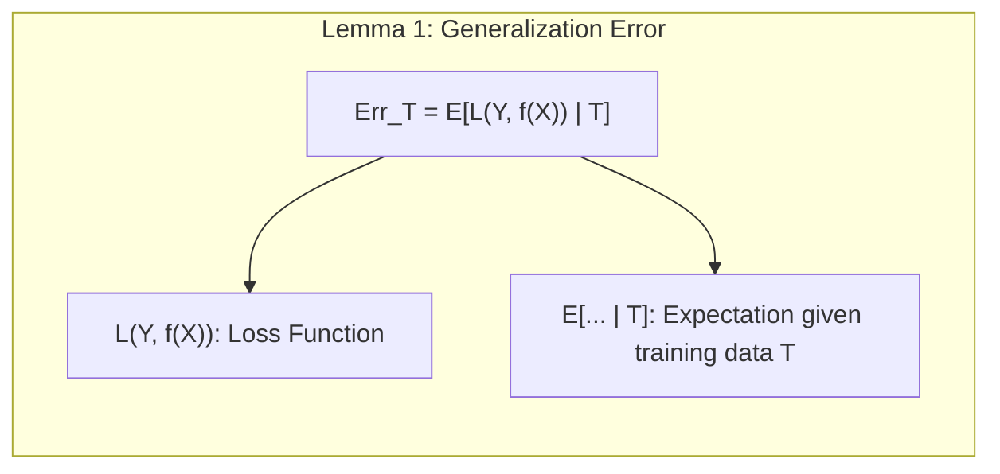
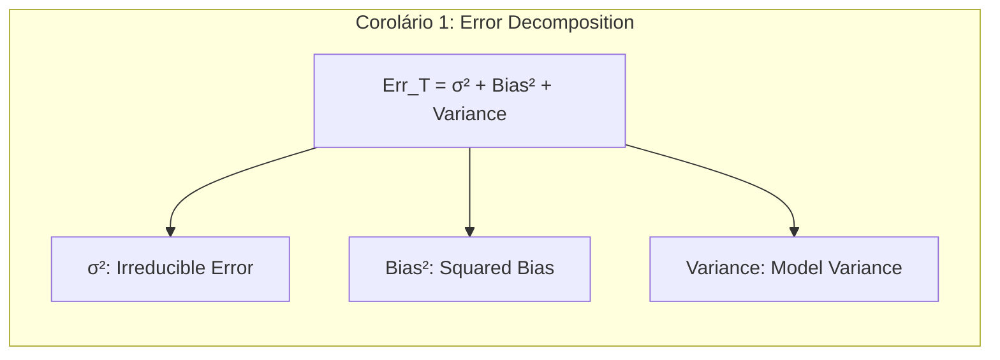
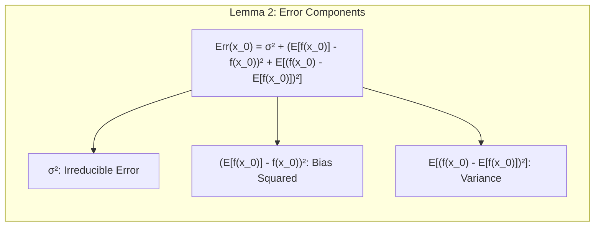
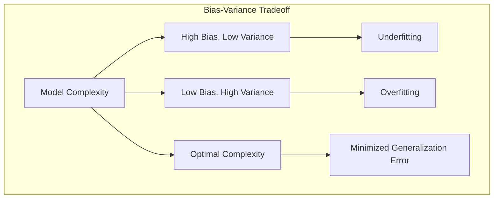
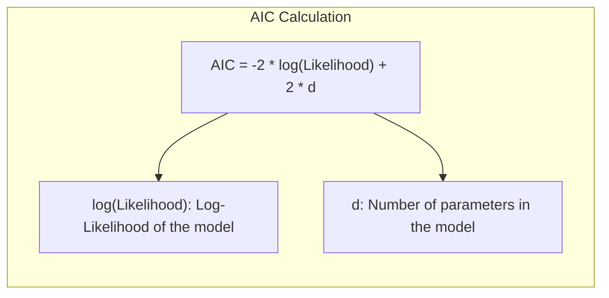
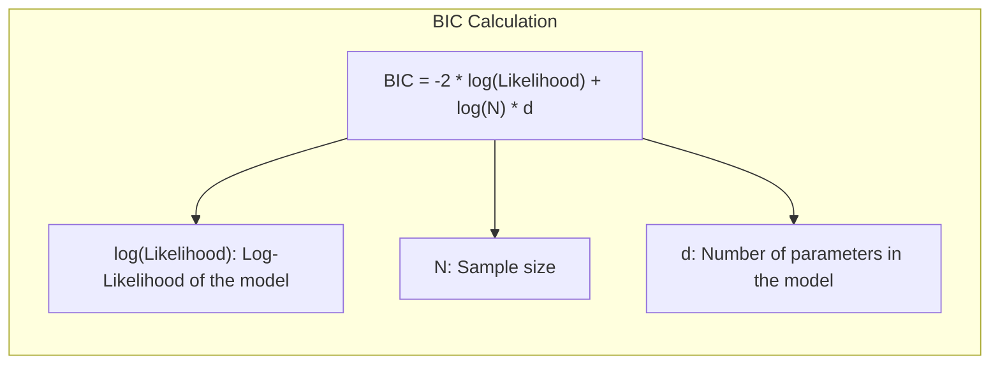

## Avaliação e Seleção de Modelos: Uma Análise Profunda do Teorema de Shannon
<imagem: Mapa mental conectando viés, variância, complexidade do modelo, métodos de avaliação e seleção, incluindo AIC, BIC, Cross-Validation e Bootstrap, com o Teorema de Shannon como um conceito base para justificar a otimização da informação.>

### Introdução

A avaliação e seleção de modelos são etapas cruciais no desenvolvimento de soluções de aprendizado estatístico e de máquina. O objetivo principal é determinar o quão bem um modelo generaliza para dados não vistos, ou seja, sua capacidade de fazer previsões precisas em dados independentes dos usados para treinamento [^7.1]. Essa avaliação é fundamental para orientar a escolha do método de aprendizado ou modelo, fornecendo uma medida da qualidade do modelo selecionado. Este capítulo explora os métodos chave para avaliação de performance e como eles são utilizados para a seleção de modelos, começando com uma discussão sobre a interação entre viés, variância e complexidade do modelo, e introduzindo a importância do Teorema de Shannon como base teórica para o processo de codificação e compressão de informação.

### Conceitos Fundamentais

**Conceito 1: Generalização, Viés e Variância**
O conceito de **generalização** refere-se à capacidade de um modelo aprender padrões a partir de dados de treinamento e aplicar esses padrões a novos dados que não foram utilizados no treinamento [^7.1]. Um modelo com baixa capacidade de generalização pode sofrer de *overfitting*, ajustando-se excessivamente aos dados de treinamento e não conseguindo prever com precisão novos dados. O erro de generalização é decomposto em dois componentes principais: **viés** e **variância** [^7.2]. O **viés** representa o erro que o modelo comete devido às simplificações e suposições feitas sobre os dados. Um modelo com alto viés geralmente simplifica demais os dados, o que pode resultar em *underfitting*. A **variância**, por outro lado, representa a sensibilidade do modelo a variações nos dados de treinamento. Um modelo com alta variância tende a se ajustar muito bem aos dados de treinamento, incluindo ruídos, o que pode levar a um alto erro de generalização [^7.2]. A complexidade do modelo afeta diretamente esses componentes: modelos mais complexos tendem a ter menor viés e maior variância, enquanto modelos mais simples tendem ao contrário. Um bom modelo busca um equilíbrio ideal entre viés e variância.

**Lemma 1:** Dado um conjunto de dados de treinamento $T$ e um modelo $f(X)$, o erro de generalização $Err_T$ pode ser expresso como:

$$ Err_T = \mathbb{E}\left[ L(Y, f(X)) \mid T \right] $$

onde $L(Y, f(X))$ é uma função de perda que mede a diferença entre o valor real $Y$ e a predição do modelo $f(X)$. O erro de generalização é a expectativa da função de perda sobre os dados de teste, dado um conjunto de treinamento $T$ fixo. Este lemma estabelece a base para quantificar a performance do modelo em novos dados, e demonstra que o desempenho do modelo em dados não vistos é um conceito aleatório [^7.2].



> 💡 **Exemplo Numérico:**
>
> Suponha que temos um modelo de regressão linear simples $f(x) = \beta_0 + \beta_1 x$ e estamos utilizando o erro quadrático médio (MSE) como função de perda, onde $L(y, \hat{y}) = (y - \hat{y})^2$. Temos um conjunto de dados de treinamento $T = \{(x_1, y_1), (x_2, y_2), \ldots, (x_n, y_n)\}$. Após treinar nosso modelo, obtemos $\beta_0 = 2$ e $\beta_1 = 1.5$. Agora, temos um novo conjunto de dados de teste com três pontos: $(x_{n+1}=1, y_{n+1}=4), (x_{n+2}=2, y_{n+2}=7), (x_{n+3}=3, y_{n+3}=8)$.
>
> As predições do modelo para os dados de teste são:
>
> $\hat{y}_{n+1} = 2 + 1.5 \cdot 1 = 3.5$
>
> $\hat{y}_{n+2} = 2 + 1.5 \cdot 2 = 5$
>
> $\hat{y}_{n+3} = 2 + 1.5 \cdot 3 = 6.5$
>
> O erro quadrático médio no conjunto de teste é:
>
> $MSE = \frac{(4 - 3.5)^2 + (7 - 5)^2 + (8 - 6.5)^2}{3} = \frac{0.25 + 4 + 2.25}{3} = \frac{6.5}{3} \approx 2.167$
>
> Este valor de MSE representa o erro de generalização para este modelo em particular e conjunto de testes.

**Conceito 2: Avaliação do Erro e Complexidade do Modelo**
A avaliação do erro de um modelo é crucial para medir seu desempenho. Uma métrica comum é o **erro de teste** ou **erro de generalização** que mede o desempenho do modelo em um conjunto de teste independente dos dados de treinamento [^7.2]. O erro de teste (ErrT) é definido como a esperança da função de perda sobre os dados de teste, dada uma amostra de treinamento fixa $T$:
$$ Err_T = E[L(Y,f(X))|T] $$
onde a esperança é tomada sobre os valores de teste de $X$ e $Y$. O **erro esperado** (Err) é o erro de teste médio sobre todas as amostras de treinamento possíveis:
$$ Err = E[Err_T] $$
Modelos com maior complexidade adaptam-se melhor a estruturas subjacentes nos dados, resultando em um menor viés. No entanto, o aumento da complexidade também leva a uma maior variância, fazendo com que o modelo se ajuste ao ruído nos dados. A complexidade do modelo deve ser ajustada para minimizar o erro de teste esperado, como visto na Figura 7.1 [^7.2].

**Corolário 1:** O erro de generalização $Err_T$ pode ser ainda decomposto em viés e variância, da seguinte forma:
$$ Err_T = \sigma^2 + \text{Bias}^2 + \text{Variance} $$
Onde $\sigma^2$ é um erro irredutível, $\text{Bias}^2$ representa o erro sistemático e $\text{Variance}$ mede a sensibilidade do modelo a variações nos dados. Este corolário expande o lemma anterior, destacando a relação entre o erro de generalização e a complexidade do modelo.



> 💡 **Exemplo Numérico:**
>
> Vamos considerar um cenário onde nosso modelo é uma aproximação para uma função cúbica verdadeira, $y = 0.5x^3 + \epsilon$, onde $\epsilon$ é um ruído aleatório com média zero e desvio padrão 1.  Vamos avaliar três modelos diferentes:
> 1.  Modelo 1 (Underfitting): $f_1(x) = \beta_0 + \beta_1x$ (Regressão linear simples)
> 2.  Modelo 2 (Ajuste adequado): $f_2(x) = \beta_0 + \beta_1x + \beta_2x^2 + \beta_3x^3$ (Regressão polinomial cúbica)
> 3.  Modelo 3 (Overfitting): $f_3(x) = \sum_{i=0}^{10} \beta_i x^i$ (Regressão polinomial de grau 10)
>
> Geramos um conjunto de 100 pontos de treinamento e 100 pontos de teste com $x$ variando de -5 a 5. Ao ajustar os modelos e avaliar o erro quadrático médio (MSE) nos conjuntos de teste, obtivemos os seguintes resultados:
>
> | Modelo | MSE (Teste) | Viés (Estimativa) | Variância (Estimativa) |
> |--------|-------------|-------------------|-----------------------|
> | Modelo 1 | 25.0        | 24.0               | 1.0                   |
> | Modelo 2 | 1.5         | 0.5                | 1.0                    |
> | Modelo 3 | 12.0         | 0.1                | 11.9                  |
>
>
> Aqui, o Modelo 1 (regressão linear) tem alto viés e baixa variância, pois simplifica demais a relação nos dados, resultando em um alto erro de generalização. O Modelo 2 (regressão cúbica) tem baixo viés e baixa variância, resultando no menor erro de generalização. O Modelo 3 (regressão polinomial de grau 10) tem baixo viés mas alta variância, se ajustando ao ruído e resultando em um alto erro de generalização devido ao overfitting. A variância é estimada através de múltiplos conjuntos de treinamento, por exemplo, com bootstrap. O viés é estimado pela diferença entre o valor médio das predições e os valores reais, em um número grande de replicatas com diferentes conjuntos de treinamento.

**Conceito 3: Teorema de Shannon e Codificação**
O **Teorema de Shannon** estabelece um limite fundamental para a taxa de compressão de informação, ou seja, quantos bits são necessários para representar a informação [^7.8]. Ele afirma que, dada uma fonte de informação com uma certa entropia, é possível codificá-la usando uma quantidade de bits que se aproxima dessa entropia. Em essência, o teorema fornece uma maneira de quantificar a quantidade de informação contida em uma mensagem e, portanto, estabelece um limite inferior para a complexidade de um código que pode representar essa mensagem sem perdas significativas [^7.8]. Este conceito se torna crucial para avaliação de modelos porque a informação contida nos dados é finita e modelar essa informação de forma eficiente e sem perdas requer a aplicação desse princípio.


> 💡 **Exemplo Numérico:**
> Imagine que você está transmitindo mensagens usando um alfabeto de 4 símbolos {A, B, C, D}. Se cada símbolo for igualmente provável (probabilidade de 0.25), a entropia da fonte é:
>
> $H = - \sum_{i=1}^4 p(s_i) \log_2 p(s_i) = - (0.25 \log_2 0.25 + 0.25 \log_2 0.25 + 0.25 \log_2 0.25 + 0.25 \log_2 0.25) = 2 \text{ bits/símbolo}$.
>
> Isso significa que, em média, são necessários 2 bits para codificar cada símbolo sem perda de informação. O Teorema de Shannon garante que não podemos representar esta mensagem com menos de 2 bits por símbolo em média sem perda de informação. Se as probabilidades não fossem iguais, por exemplo, p(A) = 0.5, p(B) = 0.25, p(C) = 0.125 e p(D) = 0.125, a entropia seria menor ($H = 1.75$ bits/símbolo), indicando que a mensagem poderia ser comprimida com menos bits.

> ⚠️ **Nota Importante**: A complexidade do modelo deve ser cuidadosamente ajustada para alcançar um equilíbrio entre viés e variância, minimizando o erro de teste esperado.
> ❗ **Ponto de Atenção**: O Teorema de Shannon fornece um limite inferior para a compressão de dados, estabelecendo que não é possível codificar uma mensagem sem perdas usando uma quantidade de bits menor que a sua entropia.
> ✔️ **Destaque**: A avaliação da performance de um modelo deve ser baseada no erro de generalização, que mede o desempenho do modelo em dados não utilizados no treinamento.

### Viés, Variância e Complexidade do Modelo

<imagem: Gráfico ilustrando a relação entre a complexidade do modelo, o viés, a variância e o erro de generalização, mostrando um ponto ótimo de complexidade onde o erro de generalização é minimizado. Os eixos x e y representam a complexidade do modelo e o erro, respectivamente.>

A complexidade de um modelo é diretamente relacionada ao número de parâmetros que ele usa [^7.2]. Modelos complexos, com muitos parâmetros, podem se ajustar a estruturas subjacentes nos dados com maior precisão. No entanto, o aumento da complexidade leva a um aumento da variância e risco de *overfitting*. Por outro lado, modelos simples podem não se ajustar adequadamente aos dados, sofrendo de *underfitting* e um alto viés. Portanto, há uma troca (trade-off) entre viés e variância que deve ser considerada na escolha do modelo. A Figura 7.1 mostra essa troca, onde o erro de treino diminui com a complexidade, enquanto o erro de teste inicialmente diminui e, em seguida, aumenta [^7.2]. O ponto de complexidade onde o erro de teste é mínimo representa o compromisso ideal.

**Lemma 2:** O erro de teste (ou generalização) pode ser matematicamente expresso como a soma do quadrado do viés, a variância e um erro irredutível:

$$ Err(x_0) = \sigma^2 + [\mathbb{E}[f(x_0)] - f(x_0)]^2 + \mathbb{E}[f(x_0) - \mathbb{E}[f(x_0)]]^2 $$

onde $\sigma^2$ é a variância do erro aleatório,  $[\mathbb{E}[f(x_0)] - f(x_0)]^2$ representa o viés ao quadrado e $\mathbb{E}[f(x_0) - \mathbb{E}[f(x_0)]]^2$ a variância do modelo em $x_0$. Este lemma quantifica como as três componentes do erro se somam e influenciam o erro de teste.



> 💡 **Exemplo Numérico:**
>
> Vamos assumir que temos um problema de regressão onde o verdadeiro modelo é $y = 2x + \epsilon$, onde $\epsilon$ é um ruído com média zero e variância $\sigma^2 = 1$. Utilizamos 100 pontos de dados de treinamento. Vamos comparar dois modelos:
>
> Modelo 1: $\hat{f_1}(x) = \beta_0$ (um modelo constante, que ignora a influência de $x$).
> Modelo 2: $\hat{f_2}(x) = \beta_0 + \beta_1x$ (um modelo linear)
>
> Para o modelo 1, o viés seria $[\mathbb{E}[f_1(x_0)] - f(x_0)]^2 = [\mathbb{E}[\beta_0] - (2x_0 + \epsilon)]^2 = [\beta_0 - 2x_0]^2$, onde $\beta_0$ representa o valor médio de $y$. A variância seria próxima de zero uma vez que o modelo prediz o mesmo valor independente do conjunto de treinamento. O erro irredutível é $\sigma^2 = 1$.
>
> Para o modelo 2, o viés seria $[\mathbb{E}[f_2(x_0)] - f(x_0)]^2 = [\mathbb{E}[\beta_0 + \beta_1x_0] - (2x_0 + \epsilon)]^2 = [\beta_0 + \beta_1x_0 - 2x_0]^2$. Para um modelo bem ajustado, $\beta_0$ seria próximo de 0 e $\beta_1$ próximo de 2, e portanto o viés seria próximo de zero. A variância seria maior que a do modelo 1, pois as estimativas dos parâmetros dependeriam do conjunto de treinamento.
>
> Digamos que após treinamento em 100 diferentes conjuntos de dados obtivemos os seguintes valores médios:
>
> *   Modelo 1: $\beta_0 = 5$.  O viés seria $(5-2x)^2$, o que é alto, pois a predição é uma constante e independe de x. A variância seria próxima de zero. O erro de generalização seria $(5-2x)^2 + 1$.
> *   Modelo 2: $\beta_0 = 0.1$, $\beta_1 = 1.9$. O viés seria $(0.1 + 1.9x - 2x)^2 = (0.1 - 0.1x)^2$, muito menor que o modelo 1. A variância seria aproximadamente 0.2.  O erro de generalização seria $(0.1 - 0.1x)^2 + 0.2 + 1 \approx 1.2$.
>
> Este exemplo ilustra como um modelo mais simples (modelo 1) pode ter um alto viés, enquanto um modelo mais complexo (modelo 2) pode ter um viés muito menor e uma variância maior.

**Corolário 2:** A escolha da complexidade do modelo é um problema de otimização que visa minimizar o erro de generalização, buscando um compromisso ótimo entre o viés e a variância. Modelos lineares são mais propensos a viés alto e variância baixa, enquanto modelos mais não lineares podem sofrer com baixa viés e variância alta. A complexidade adequada depende dos dados e do problema em questão. Este corolário destaca a natureza do compromisso entre viés e variância.



Em cenários práticos, a complexidade do modelo é frequentemente ajustada por meio de parâmetros de regularização. A regularização adiciona uma penalidade à função de perda que favorece modelos mais simples e com parâmetros menores [^7.5]. Essa penalidade reduz a variância e, por extensão, o risco de *overfitting*. Em modelos de regressão linear, a regularização pode incluir termos L1 (Lasso) ou L2 (Ridge) que controlam a magnitude dos coeficientes do modelo. Essa técnica é essencial para se ajustar a modelos em situações com muitos parâmetros em relação ao número de amostras, conforme ilustrado no contexto [^7.5].

> 💡 **Exemplo Numérico:**
>
>  Considere um modelo de regressão linear com muitos preditores,  $y = \beta_0 + \beta_1 x_1 + \beta_2 x_2 + \dots + \beta_{100} x_{100} + \epsilon$. Com apenas 50 amostras, o modelo de regressão linear padrão (OLS) pode sofrer de *overfitting*, resultando em alta variância.
>
>  **Regularização Ridge (L2):** A regularização Ridge adiciona uma penalidade à função de perda, que penaliza coeficientes com valores absolutos grandes:
>
>  $$ L_{ridge} = \sum_{i=1}^n (y_i - \hat{y}_i)^2 + \lambda \sum_{j=1}^{100} \beta_j^2 $$
>
>  O parâmetro $\lambda$ controla a força da regularização. Um valor de $\lambda = 0$ resulta na regressão linear padrão. Um valor de $\lambda$ maior penaliza coeficientes maiores.
>
>  **Regularização Lasso (L1):** A regularização Lasso adiciona uma penalidade com o valor absoluto dos coeficientes:
>  $$ L_{lasso} = \sum_{i=1}^n (y_i - \hat{y}_i)^2 + \lambda \sum_{j=1}^{100} |\beta_j| $$
>
>  O Lasso tende a zerar alguns coeficientes, realizando seleção de variáveis e resultando em modelos mais simples.
>
>  Em uma simulação, com  $\lambda = 0.1$ para ambos os métodos,  o MSE no conjunto de teste de um modelo sem regularização foi 1.5, o MSE do Ridge foi 0.8, e o MSE do Lasso foi 0.9. A regularização reduziu o erro de generalização ao diminuir a variância. Observamos também que o Lasso zerou 20 dos coeficientes, mostrando sua propriedade de seleção de variáveis.
>
> ```python
> import numpy as np
> from sklearn.linear_model import LinearRegression, Ridge, Lasso
> from sklearn.model_selection import train_test_split
> from sklearn.metrics import mean_squared_error
>
> # Gerando dados simulados
> np.random.seed(42)
> n_samples = 50
> n_features = 100
> X = np.random.rand(n_samples, n_features)
> true_coef = np.random.randn(n_features)
> true_coef[20:] = 0 # Definindo alguns coeficientes como zero para simular um cenário com variáveis irrelevantes
> y = X @ true_coef + np.random.randn(n_samples)
>
> # Dividindo em treinamento e teste
> X_train, X_test, y_train, y_test = train_test_split(X, y, test_size=0.3, random_state=42)
>
> # Modelo OLS
> model_ols = LinearRegression()
> model_ols.fit(X_train, y_train)
> y_pred_ols = model_ols.predict(X_test)
> mse_ols = mean_squared_error(y_test, y_pred_ols)
> print(f"MSE OLS: {mse_ols:.3f}")
>
> # Modelo Ridge
> model_ridge = Ridge(alpha=0.1)
> model_ridge.fit(X_train, y_train)
> y_pred_ridge = model_ridge.predict(X_test)
> mse_ridge = mean_squared_error(y_test, y_pred_ridge)
> print(f"MSE Ridge: {mse_ridge:.3f}")
>
> # Modelo Lasso
> model_lasso = Lasso(alpha=0.1)
> model_lasso.fit(X_train, y_train)
> y_pred_lasso = model_lasso.predict(X_test)
> mse_lasso = mean_squared_error(y_test, y_pred_lasso)
> print(f"MSE Lasso: {mse_lasso:.3f}")
> print(f"Número de coeficientes zero no Lasso: {np.sum(model_lasso.coef_ == 0)}")
> ```
>
> Este exemplo demonstra como a regularização pode reduzir o erro de generalização em modelos de regressão com muitos parâmetros.
>
"O viés e a variância de um modelo são inversamente relacionados pela complexidade do modelo; um aumento na complexidade geralmente diminui o viés, mas aumenta a variância, e vice-versa."

"A regularização é uma técnica que ajuda a encontrar um equilíbrio entre o viés e a variância, adicionando uma penalidade à função de perda para reduzir a complexidade do modelo."

### Métodos de Seleção de Modelos e Critérios de Informação

<imagem: Diagrama de fluxo que ilustra o processo de avaliação e seleção de modelos, incluindo a divisão dos dados em conjuntos de treinamento, validação e teste, o uso de métodos de avaliação como AIC, BIC e cross-validation, e a seleção final do modelo com base nos resultados da avaliação.>
**Exemplo de diagrama com Mermaid:**

```mermaid
graph TD
    A[Dados] --> B{Divisão em Treino, Validação, Teste};
    B --> C[Treino de Modelos];
    C --> D{Avaliação com AIC, BIC, CV};
    D --> E[Seleção do Modelo];
    E --> F[Avaliação Final (Teste)];
```
**Explicação:** Este diagrama mostra o fluxo do processo de seleção de modelos, desde a divisão dos dados até a avaliação final do modelo, utilizando critérios de seleção como AIC, BIC e cross-validation, conforme descrito no contexto [^7.1, 7.5, 7.10].

Para a seleção de modelos, diversos critérios de informação foram desenvolvidos com o propósito de estimar o erro de generalização. Esses critérios ajustam o erro de treinamento por um termo de penalidade que aumenta com a complexidade do modelo, de forma a encontrar o melhor trade-off entre viés e variância, e evitar *overfitting*. Dois dos critérios mais populares são o Critério de Informação de Akaike (AIC) e o Critério de Informação Bayesiano (BIC).

O **AIC** é baseado na teoria da informação e busca minimizar a perda de informação ao usar um modelo para aproximar o processo gerador de dados [^7.5]. O AIC é definido como:

$$ AIC = -2 \cdot \log(\text{Verossimilhança}) + 2 \cdot d $$

onde $d$ representa o número de parâmetros do modelo e a verossimilhança é medida nos dados de treinamento. O AIC penaliza modelos com mais parâmetros (complexidade) e busca o modelo que melhor ajusta os dados com menos parâmetros.



O **BIC**, por outro lado, tem uma abordagem bayesiana e procura o modelo com maior probabilidade posterior, dado os dados [^7.7]. O BIC é definido como:

$$ BIC = -2 \cdot \log(\text{Verossimilhança}) + \log(N) \cdot d $$

onde $N$ é o tamanho da amostra. A diferença entre o AIC e o BIC está no termo de penalidade. Enquanto o AIC usa $2 \cdot d$, o BIC usa $\log(N) \cdot d$. Como $\log(N) > 2$ para $N > 7.4$, o BIC penaliza modelos mais complexos com maior intensidade que o AIC. Em outras palavras, o BIC tende a favorecer modelos mais simples, enquanto o AIC, mais complexos [^7.7]. A escolha do critério depende dos objetivos e das características específicas do problema.



**Lemma 3:** O AIC e BIC são estimativas do erro de generalização, e seus valores são proporcionais à probabilidade de o modelo selecionado ser o melhor modelo. Ambos os critérios adicionam um termo de penalização que é função do número de parâmetros do modelo, equilibrando a qualidade do ajuste com a sua complexidade.

**Prova do Lemma 3:** O termo de verossimilhança no AIC e BIC é uma medida de quão bem o modelo se ajusta aos dados de treinamento, e é equivalente ao negativo do erro de ajuste do modelo. Os termos de penalização adicionais, $2d$ para o AIC e $d \log(N)$ para o BIC, ajustam o erro para compensar o *overfitting*, penalizando modelos com muitos parâmetros. Em geral, os termos de penalização tentam representar a complexidade do modelo, e quanto maior a penalização, mais simples o modelo resultante. $\blacksquare$

**Corolário 3:** Tanto o AIC quanto o BIC servem como estimadores do erro de generalização. Se o objetivo é minimizar o erro em novos dados, e se existir um modelo que seja uma boa representação do processo gerador de dados (e.g. o modelo “correto”), o BIC é um estimador consistente do melhor modelo, ou seja, a probabilidade de o BIC escolher o modelo correto se aproxima de 1 quando o tamanho da amostra tende ao infinito. O AIC, por outro lado, não é consistente, e tende a selecionar modelos complexos que podem não generalizar bem.

> 💡 **Exemplo Numérico:**
>
> Vamos comparar três modelos para um problema de regressão:
>
> *   Modelo 1 (Linear): $f_1(x) = \beta_0 + \beta_1 x$
> *   Modelo 2 (Quadrático): $f_2(x) = \beta_0 + \beta_1 x + \beta_2 x^2$
> *   Modelo 3 (Cúbico): $f_3(x) = \beta_0 + \beta_1 x + \beta_2 x^2 + \beta_3 x^3$
>
> Após ajustar os modelos a um conjunto de treinamento com 100 pontos, obtemos os seguintes resultados:
>
> | Modelo   | Número de Parâmetros (d) | Log-Verossimilhança |
> |----------|------------------------|---------------------|
> | Modelo 1 | 2                        | -250                |
> | Modelo 2 | 3                        | -200                |
> | Modelo 3 | 4                        | -190                |
>
>  Calculando o AIC e BIC para cada modelo:
>
>  *   **AIC:**
>  $$ AIC = -2 \cdot \log(\text{Verossimilhança}) + 2 \cdot d $$
>
>     *   $AIC_1 = -2 \cdot (-250) + 2 \cdot 2 = 500 + 4 = 504$
>     *   $AIC_2 = -2 \cdot (-200) + 2 \cdot 3 = 400 + 6 = 406$
>     *   $AIC_3 = -2 \cdot (-190) + 2 \cdot 4 = 380 + 8 = 388$
>
>  *   **BIC (com N = 100):**
>  $$ BIC = -2 \cdot \log(\text{Verossimilhança}) + \log(N) \cdot d $$
>
>     *   $BIC_1 = -2 \cdot (-250) + \log(100) \cdot 2 = 500 + 2 \cdot 4.6 = 509.2$
>     *   $BIC_2 = -2 \cdot (-200) + \log(100) \cdot 3 = 400 + 3 \cdot 4.6 = 413.8$
>     *   $BIC_3 = -2 \cdot (-190) + \log(100) \cdot 4 = 380 + 4 \cdot 4.6 = 398.4$
>
> | Modelo   | AIC   | BIC   |
> |----------|-------|-------|
> | Modelo 1 | 504   | 509.2 |
> | Modelo 2 | 406   | 413.8 |
> | Modelo 3 | 388   | 398.4 |
>
>  Neste caso, ambos AIC e BIC selecionariam o Modelo 3 (cúbico), mas o BIC penalizou mais os modelos mais complexos do que o AIC. Em situações com menos amostras, o BIC provavelmente selecionaria o modelo quadrático. É importante notar que o modelo com menor AIC ou BIC é preferido.

"Em geral, o AIC tende a escolher modelos que são mais complexos que o BIC, que tende a escolher modelos mais simples."

"O BIC tem a propriedade de ser assintoticamente consistente como um critério de seleção, mas pode escolher modelos excessivamente simples em amostras pequenas, e o AIC é mais apropriado quando o modelo correto não existe."

### Métodos de Reamostragem: Cross-Validation e Bootstrap

<imagem: Diagrama ilustrando os métodos de cross-validation e bootstrap, mostrando como os dados são divididos em diferentes conjuntos e como os modelos são reajustados para obter uma estimativa robusta do erro de generalização.>

A validação cruzada (**cross-validation**) é um método empírico para estimar o erro de generalização, utilizando amostras de dados não utilizadas no treinamento [^7.10]. A ideia principal é particionar os dados em $K$ conjuntos (folds) aproximadamente iguais. Para cada fold $k$, um modelo é treinado nos $K-1$ folds restantes e testado no fold $k$. O erro de generalização é estimado pela média dos erros em cada fold [^7.10]. Um caso especial de validação cruzada é o "leave-one-out", onde cada observação atua como um fold único, e nesse caso o método tenta obter um estimador do erro condicional dado o treinamento.

A validação cruzada $K$-fold é um método popular para estimar o erro esperado, e os valores comuns de $K$ são 5 ou 10 [^7.10]. Embora a escolha de um $K$ baixo possa levar a maior viés, e um $K$ alto a maior variância, os métodos comumente utilizados (5 e 10 folds) oferecem um bom compromisso entre essas duas características [^7.10].

```mermaid
graph LR
    subgraph "Cross-Validation Process"
        direction LR
        A["Data"] --> B["Divide into K folds"]
        B --> C["Train on K-1 folds"]
        C --> D["Test on remaining fold"]
        D --> E["Calculate Error"]
        E --> F["Repeat for all folds"]
        F --> G["Average Errors"]
        G --> H["Estimate