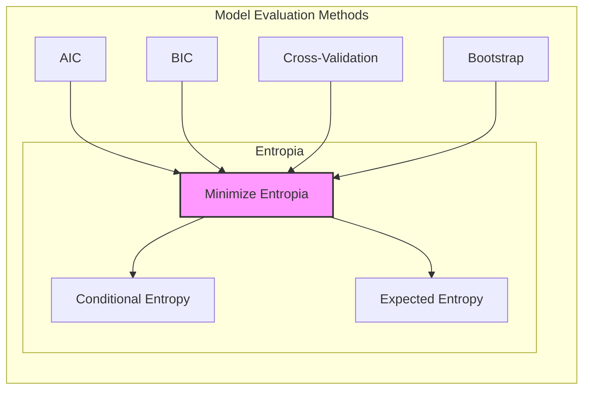
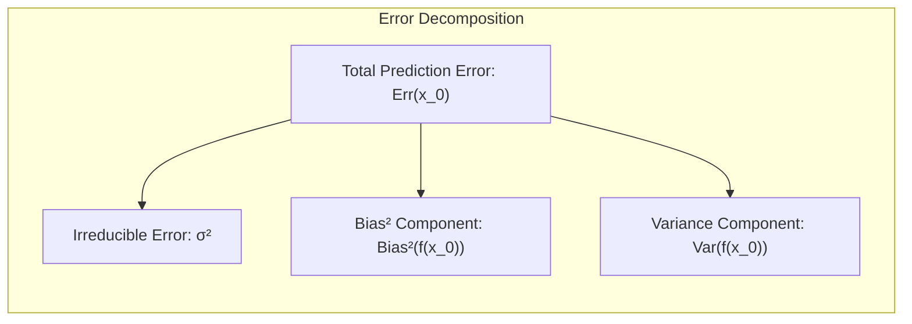
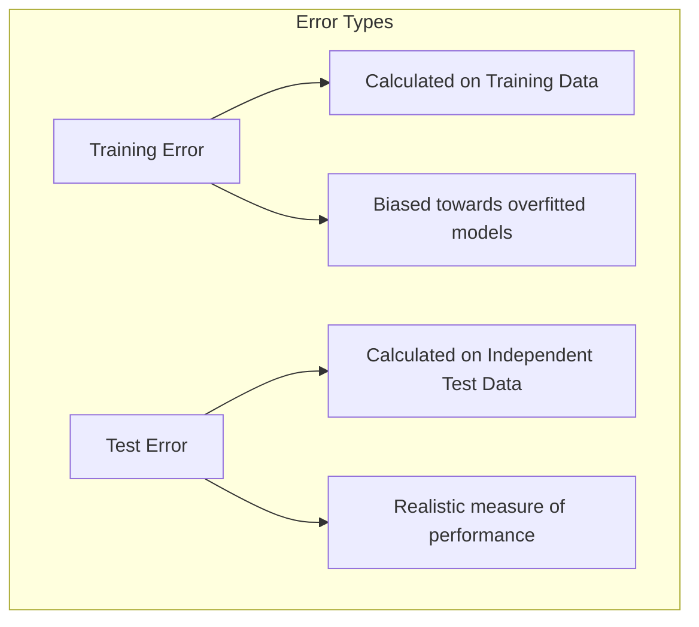
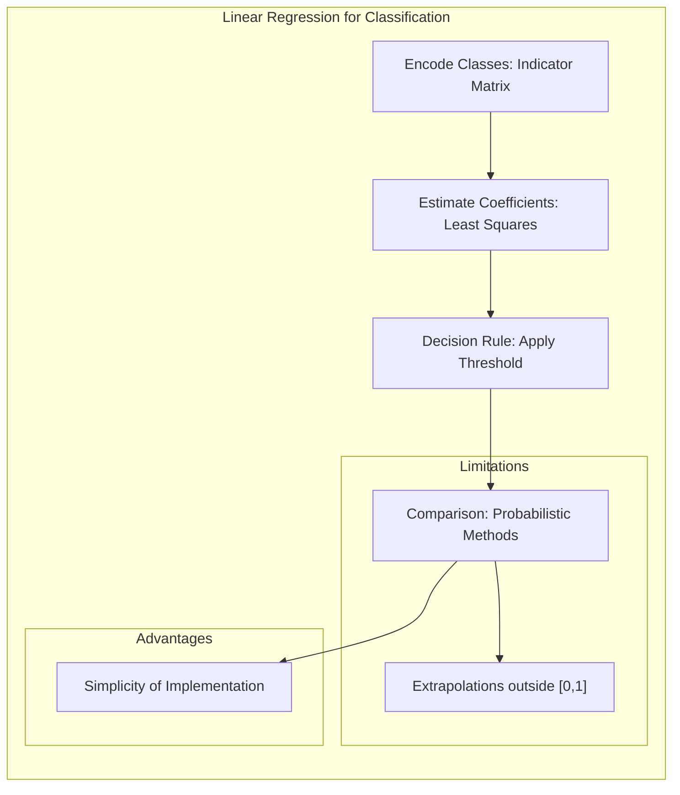
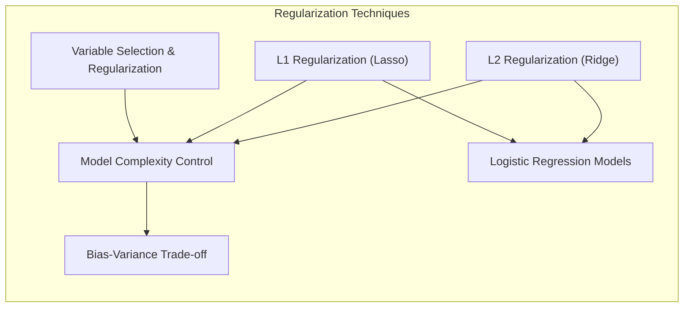
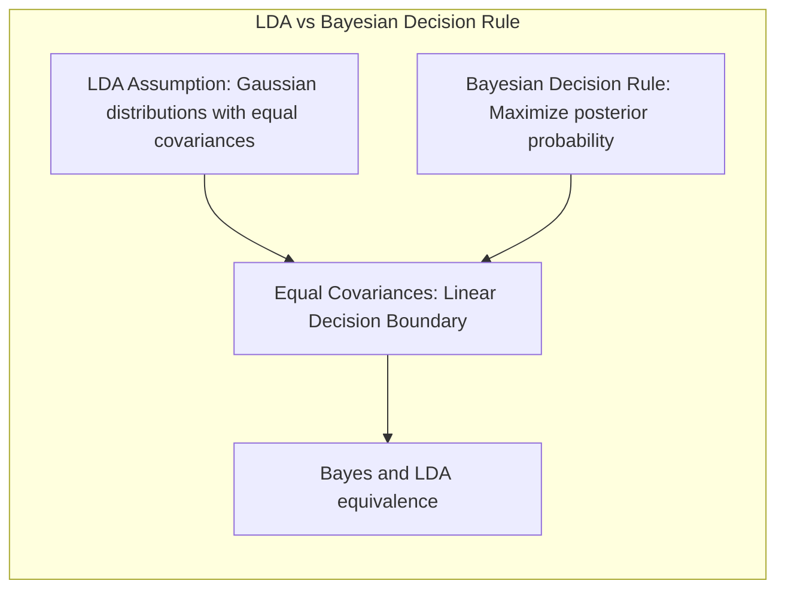

## Avaliação e Seleção de Modelos: Foco na Entropia



### Introdução

A **generalização** de um método de aprendizado refere-se à sua capacidade de prever resultados em dados de teste independentes. Avaliar essa performance é crucial na prática, pois direciona a escolha do método ou modelo de aprendizado e mensura a qualidade do modelo escolhido [^7.1]. Este capítulo se dedica a descrever e ilustrar os métodos de avaliação de performance e como eles são usados na seleção de modelos, com ênfase na interação entre **viés**, **variância** e **complexidade do modelo** [^7.1].

### Conceitos Fundamentais

**Conceito 1: Generalização e Erro de Predição**

A **generalização** é a habilidade de um modelo em prever resultados em dados não vistos durante o treinamento. O erro de predição é a métrica que quantifica o desempenho do modelo, medindo a discrepância entre os valores preditos e os valores reais. Um modelo com alta generalização deve apresentar baixo erro de predição em novos dados. O erro de predição é normalmente quantificado usando uma função de perda $L(Y, f(X))$ [^7.1]. As escolhas mais comuns são o **erro quadrático** $L(Y, f(X)) = (Y - f(X))^2$ e o **erro absoluto** $L(Y, f(X)) = |Y - f(X)|$ [^7.1].

> ⚠️ **Nota Importante**: A avaliação da capacidade de generalização é essencial para garantir que o modelo não esteja sobreajustando os dados de treinamento, o que levaria a um baixo desempenho em dados não vistos.

**Lemma 1:** *A relação entre o erro de predição esperado e a complexidade do modelo*. O erro de predição esperado $Err = E[L(Y, f(X))]$ é decomposto em viés ao quadrado e variância [^7.2]. Modelos com alta complexidade tendem a ter baixo viés, mas alta variância, e vice-versa. O erro de predição esperado é minimizado quando se encontra um equilíbrio entre o viés e a variância [^7.2].

$$Err(x_0) = \sigma^2 + Bias^2(f(x_0)) + Var(f(x_0))$$

Onde $\sigma^2$ é a variância do erro irredutível. O **viés** quantifica o quão longe a média das estimativas está do valor real e a **variância** quantifica a variação das estimativas em diferentes conjuntos de treinamento.



**Prova do Lemma 1:**
Expandindo o termo $E[(Y-f(x_0))^2 | X=x_0]$, temos:

$$E[(Y-f(x_0))^2 | X=x_0] = E[(Y-E[f(x_0)| X=x_0] + E[f(x_0)| X=x_0] - f(x_0))^2 | X=x_0]$$
$$= E[(Y-E[f(x_0)| X=x_0])^2 | X=x_0] + E[(E[f(x_0)| X=x_0]-f(x_0))^2| X=x_0] + 2E[(Y-E[f(x_0)| X=x_0])(E[f(x_0)| X=x_0]-f(x_0)) | X=x_0]$$
O terceiro termo é zero, pois $E[Y - E[f(x_0)] | X=x_0]=0$. Assim, temos
$$E[(Y-f(x_0))^2 | X=x_0] = E[(Y-E[f(x_0)| X=x_0])^2 | X=x_0] + E[(E[f(x_0)| X=x_0]-f(x_0))^2| X=x_0]$$
O primeiro termo é a variância do erro irredutível, enquanto o segundo termo pode ser decomposto:
$$E[(E[f(x_0)| X=x_0]-f(x_0))^2| X=x_0] = [E[f(x_0)| X=x_0] - f(x_0)]^2 + E[(f(x_0)-E[f(x_0)|X=x_0])^2 | X=x_0]$$
O primeiro termo é o bias ao quadrado e o segundo termo é a variância, o que completa a prova. $\blacksquare$

> 💡 **Exemplo Numérico:**
> Vamos considerar um cenário onde queremos modelar uma relação entre uma variável de entrada $X$ e uma variável de saída $Y$. Suponha que a relação verdadeira seja $Y = 2X + 3 + \epsilon$, onde $\epsilon$ é um erro aleatório com média zero e variância $\sigma^2 = 1$. Agora vamos comparar dois modelos:
>
> **Modelo 1 (Simples):**  $f_1(X) = 2.1X + 2.8$
> **Modelo 2 (Complexo):** $f_2(X) = 2X + 3 + 0.5X^2 + \eta$, onde $\eta$ é um erro aleatório com média zero e variância muito maior que $\epsilon$.
>
> Vamos analisar o erro para um ponto $x_0 = 1$:
>
> Para o **Modelo 1:**
>   - Valor real: $Y(1) = 2(1) + 3 = 5$
>   - Predição: $f_1(1) = 2.1(1) + 2.8 = 4.9$
>   - Viés: $E[f_1(1)] - Y(1) = 4.9 - 5 = -0.1$.  $Bias^2 = (-0.1)^2 = 0.01$
>   - Variância: Suponha que a variação das estimativas do modelo seja baixa, $Var(f_1(1)) = 0.1$.
>
> Para o **Modelo 2:**
>   - Valor real: $Y(1) = 5$
>   - Predição: $f_2(1) = 2(1) + 3 + 0.5(1)^2 + \eta = 5.5 + \eta $
>   - Viés: Se considerarmos que o termo quadrático consegue capturar a relação, $E[f_2(1)] - Y(1) = 5.5 - 5= 0.5 $. $Bias^2 = (0.5)^2 = 0.25$
>   - Variância: Como o modelo é muito mais sensível a variações nos dados de treinamento, supomos que $Var(f_2(1)) = 2$.
>
>  O erro total para cada modelo, para um ponto $x_0=1$:
>   - $Err_1(1) = 1 + 0.01 + 0.1 = 1.11$
>   - $Err_2(1) = 1 + 0.25 + 2 = 3.25$
>
> Notamos que o modelo mais simples (Modelo 1) tem um viés baixo e uma variância baixa, o que resulta em um erro total menor. Já o modelo mais complexo (Modelo 2) tem um viés maior e uma variância muito maior, o que aumenta significativamente o erro. Este exemplo ilustra como modelos mais complexos podem ter uma variância maior, e como é crucial o balanço entre viés e variância para minimizar o erro de predição.

**Conceito 2: Entropia e Perda Log-Verossimilhança**

A **entropia** é uma medida da incerteza ou desordem em uma distribuição de probabilidade [^7.2]. Na classificação, a entropia pode ser utilizada como função de perda. Para um resposta categórica $G$ que assume $K$ valores, a função de perda baseada na **entropia** é dada por:

$$ L(G, p(X)) = -2 \sum_{k=1}^K I(G=k) \log(p_k(X)) = -2 \log p_G(X) $$

Onde $p_k(X)$ é a probabilidade predita de que $G=k$, e $I$ é uma função indicadora. A expressão $-2 \log p_G(X)$ é chamada de **desvio** (deviance) e é proporcional à **perda log-verossimilhança** [^7.2]. O objetivo é minimizar a perda log-verossimilhança, que equivale a maximizar a verossimilhança dos dados.

**Corolário 1:** Em modelos de classificação, a minimização da função de perda da entropia (ou seja, a maximização da log-verossimilhança) busca encontrar o modelo cujas probabilidades preditas se alinham melhor com as probabilidades verdadeiras das classes, assim como em uma função de perda do tipo *cross-entropy* [^7.2].

> 💡 **Exemplo Numérico:**
>
> Suponha um problema de classificação binária onde temos duas classes, 0 e 1. Temos um modelo que produz as seguintes probabilidades preditas para dois dados de teste:
>
> - Dado 1:  Valor real $G_1 = 1$. Modelo prediz $p_1(X) = 0.8$ para classe 1 e $1 - p_1(X) = 0.2$ para classe 0.
> - Dado 2: Valor real $G_2 = 0$. Modelo prediz $p_2(X) = 0.3$ para classe 1 e $1 - p_2(X) = 0.7$ para classe 0.
>
> A perda log-verossimilhança para cada observação é dada por:
>
> - Dado 1: $L(G_1, p(X)) = -2 \log(p_1(X)) = -2 \log(0.8) \approx 0.446$
> - Dado 2: $L(G_2, p(X)) = -2 \log(1 - p_2(X)) = -2 \log(0.7) \approx 0.713$
>
> A perda log-verossimilhança total para essas duas observações seria:
>  $L_{total} = 0.446 + 0.713 = 1.159$
>
>  Um modelo ideal faria uma previsão de 1 para dado 1 e de 0 para dado 2, com probabilidades próximas de 1. Um modelo com perdas log-verossimilhança menores é preferível. Este exemplo demonstra como a função de perda penaliza previsões incorretas ou inseguras, incentivando o modelo a convergir para previsões mais confiantes e corretas.
>

**Conceito 3: Erro de Treinamento vs Erro de Teste**

O **erro de treinamento** é a média da função de perda nos dados de treinamento:

$$ err = \frac{1}{N} \sum_{i=1}^{N} L(Y_i, f(x_i)) $$

O **erro de teste** é o erro de predição em um conjunto de dados independente, e é uma medida mais realista do desempenho do modelo. Modelos muito complexos tendem a apresentar um erro de treinamento muito baixo, mas um erro de teste mais alto, um fenômeno conhecido como *overfitting* [^7.2]. O erro de teste esperado é dado por:

$$ Err = E[L(Y, f(X))] = E[Err_T] $$
Onde $Err_T$ é o erro de teste condicional ao conjunto de treinamento.



> ❗ **Ponto de Atenção**: O erro de treinamento não é uma boa estimativa do erro de teste. É necessário utilizar métodos como validação cruzada para estimar o erro de teste [^7.2].

> 💡 **Exemplo Numérico:**
>
> Vamos criar um exemplo simples para ilustrar a diferença entre erro de treinamento e erro de teste. Suponha que temos um conjunto de dados com 10 pontos e queremos ajustar um modelo polinomial. Dividimos os dados em 7 pontos para treinamento e 3 pontos para teste. Vamos comparar três modelos:
>
>   - **Modelo 1:**  $f_1(X) = \beta_0 + \beta_1 X$ (modelo linear).
>   - **Modelo 2:**  $f_2(X) = \beta_0 + \beta_1 X + \beta_2 X^2$ (modelo quadrático).
>   - **Modelo 3:** $f_3(X) = \beta_0 + \beta_1 X + \beta_2 X^2 + \beta_3 X^3 + \beta_4 X^4 + \beta_5 X^5 + \beta_6 X^6$ (modelo polinomial de grau 6).
>
> Vamos usar o erro quadrático como função de perda. Simulando os dados e ajustando os modelos, obtemos (valores hipotéticos):
>
> | Modelo     | Erro de Treinamento | Erro de Teste |
> |------------|--------------------|---------------|
> | Modelo 1   |      0.8      |     1.2     |
> | Modelo 2   |      0.5      |      0.8    |
> | Modelo 3   |      0.1      |      3.5    |
>
>Observamos que:
>   - O Modelo 3 (complexo) tem o menor erro de treinamento, mas o maior erro de teste, um claro sinal de *overfitting*. Ele se ajusta perfeitamente aos dados de treinamento mas falha em generalizar para dados não vistos.
>   - O Modelo 1 (simples) tem um erro de treinamento maior mas um erro de teste menor que o Modelo 3, mostrando uma melhor capacidade de generalização.
>   - O Modelo 2 apresenta um bom balanço entre ajuste e generalização, com erros de treinamento e teste aceitáveis.
>
>Este exemplo mostra que o erro de treinamento pode ser enganoso, e é crucial avaliar o modelo em dados de teste independentes para estimar seu desempenho em dados novos.

### Regressão Linear e Mínimos Quadrados para Classificação



A regressão linear pode ser usada para classificação, embora com algumas limitações [^7.1]. Uma abordagem é **codificar as classes** usando uma **matriz indicadora**, e realizar uma regressão sobre essas indicações [^7.2]. Para duas classes, $y_i = 1$ ou $y_i = 0$ podem ser os valores de resposta para o dado $i$. A regressão de indicadores trata o problema de classificação como um problema de regressão, ajustando um modelo linear aos dados de entrada e depois usando um limiar para tomar decisões de classe. Essa abordagem tem a vantagem de ser simples de implementar, mas pode levar a extrapolações fora de $[0,1]$ para as probabilidades preditas, o que não ocorre em abordagens probabilísticas como a regressão logística [^7.2].

**Lemma 2:** *Equivalência entre Projeções de Regressão Linear e Discriminantes Lineares em Condições Específicas*.
Em condições de covariâncias iguais entre as classes, os hiperplanos de decisão gerados por regressão linear em matriz de indicadores se aproximam dos discriminantes lineares. A regressão linear ajusta um hiperplano que tenta prever as classes e minimiza a soma dos erros quadráticos. Quando as classes estão bem separadas e a covariância é constante entre elas, a regressão linear tende a formar fronteiras de decisão lineares semelhantes àquelas obtidas por Linear Discriminant Analysis (LDA) [^7.2].

**Prova do Lemma 2:**
Seja $\mathbf{X}$ a matriz de dados, com $\mathbf{y}$ a variável de resposta codificada como 0 ou 1. A solução de mínimos quadrados para os coeficientes $\hat{\beta}$ é dada por $\hat{\beta} = (\mathbf{X^T X})^{-1} \mathbf{X^T y}$. O hiperplano de decisão em regressão linear é obtido através de um limiar em $ \mathbf{x}^T\hat{\beta}$. Em LDA, os coeficientes são dados por $\hat{\beta}_{LDA} = \Sigma^{-1}(\mu_1-\mu_0)$, onde $\mu_1$ e $\mu_0$ são as médias das classes 1 e 0 e $\Sigma$ é a matriz de covariância comum. Se as covariâncias forem idênticas e as classes forem aproximadamente gaussianas com desvios padrão similares, a regressão linear irá ajustar coeficientes que se aproximarão dos coeficientes obtidos pelo LDA, projetando os dados em um hiperplano semelhante. $\blacksquare$

> 💡 **Exemplo Numérico:**
>
> Suponha um conjunto de dados com duas classes, onde temos duas variáveis preditoras ($X_1$ e $X_2$). As classes são codificadas como 0 e 1.
>
> ```python
> import numpy as np
> from sklearn.linear_model import LinearRegression
>
> # Dados de exemplo
> X = np.array([[1, 2], [1.5, 1.8], [5, 8], [8, 8], [1, 0.6], [9,11], [10,10]])
> y = np.array([0, 0, 1, 1, 0, 1, 1])
>
> # Ajuste do modelo de regressão linear
> model = LinearRegression()
> model.fit(X, y)
>
> # Coeficientes obtidos
> beta_0 = model.intercept_
> beta_1 = model.coef_[0]
> beta_2 = model.coef_[1]
>
> print(f"Beta_0: {beta_0:.2f}")
> print(f"Beta_1: {beta_1:.2f}")
> print(f"Beta_2: {beta_2:.2f}")
>
> # Cálculo do Limiar de Decisão (geralmente 0.5)
> def predict(x, threshold=0.5):
>    prediction = beta_0 + beta_1 * x[0] + beta_2 * x[1]
>    return 1 if prediction >= threshold else 0
>
> # Testando com um novo dado
> new_x = np.array([4, 5])
> predicted_class = predict(new_x)
> print(f"Classe predita para {new_x}: {predicted_class}")
>
> ```
>
> Este código mostra como podemos usar regressão linear para classificação, obtendo os coeficientes do modelo e utilizando um limiar (neste caso, 0.5) para decidir a classe de cada ponto. O limiar transforma o problema de regressão em um problema de classificação.
>
> **Interpretação**: Os coeficientes $\beta_0$, $\beta_1$, e $\beta_2$ definem o hiperplano que separa as classes. O sinal e a magnitude dos coeficientes indicam a influência de cada variável na predição da classe. A regressão linear, ao minimizar o erro quadrático, encontra um hiperplano que tenta separar as classes da melhor forma possível.

**Corolário 2:** A equivalência entre regressão linear e LDA sob certas condições simplifica a análise do modelo, pois a regressão linear é mais fácil de implementar e calcular do que o LDA, especialmente quando as classes estão bem separadas e os dados são aproximadamente gaussianos [^7.3].
Em algumas situações, quando as classes não são bem separadas, o resultado da regressão linear para classificação pode não ser ótimo.

### Métodos de Seleção de Variáveis e Regularização em Classificação



Em modelos de classificação, a seleção de variáveis e regularização são técnicas para controlar a complexidade e evitar o *overfitting* [^7.4]. Regularização, como **penalizações L1 e L2**, são geralmente adicionadas à função de perda para penalizar coeficientes grandes e promover modelos mais simples e estáveis [^7.4.4]. A regularização L1, por exemplo, induz a esparsidade nos coeficientes, tornando o modelo mais interpretável. Regularização L2, por outro lado, promove um modelo mais estável, reduzindo a magnitude dos coeficientes [^7.5]. Em modelos logísticos, a regularização é adicionada à log-verossimilhança [^7.4.4].

**Lemma 3:** *A Penalização L1 em Regressão Logística Promove a Esparsidade*. A penalização L1 adiciona a soma dos valores absolutos dos coeficientes à função de perda, o que força alguns coeficientes a serem exatamente zero, resultando em modelos mais esparsos e menos complexos [^7.4.4].

**Prova do Lemma 3:**
A regressão logística com penalização L1 busca minimizar a função de custo:
$$J(\beta) = -\frac{1}{N} \sum_{i=1}^{N} [y_i \log(\sigma(\beta^Tx_i)) + (1-y_i)\log(1-\sigma(\beta^Tx_i))] + \lambda ||\beta||_1$$
onde $\sigma(z) = \frac{1}{1+e^{-z}}$, $y_i \in \{0,1\}$ e $\lambda$ é o parâmetro de regularização. A penalidade $L1$, $\lambda ||\beta||_1 = \lambda \sum_j |\beta_j|$,  não é diferenciável em $\beta_j = 0$, o que gera uma solução esparsa. Ou seja, durante a otimização, muitos coeficientes $\beta_j$ são forçados a serem exatamente zero para minimizar a função de custo. A intuição é que a penalidade $L1$ reduz coeficientes não essenciais a zero mais rapidamente que $L2$, pois possui derivada constante, levando a um modelo esparso com apenas as variáveis mais relevantes. $\blacksquare$

> 💡 **Exemplo Numérico:**
>
> Vamos demonstrar o efeito da regularização L1 (Lasso) na regressão logística usando um exemplo com 5 variáveis preditoras:
>
> ```python
> import numpy as np
> from sklearn.linear_model import LogisticRegression
> from sklearn.preprocessing import StandardScaler
>
> # Dados de exemplo com 5 variáveis preditoras
> np.random.seed(42)
> X = np.random.randn(100, 5)
> y = np.random.randint(0, 2, 100)
>
> # Padronização das variáveis
> scaler = StandardScaler()
> X_scaled = scaler.fit_transform(X)
>
> # Modelo sem regularização
> model_no_reg = LogisticRegression(penalty=None, solver='lbfgs', max_iter=1000)
> model_no_reg.fit(X_scaled, y)
>
> # Modelo com regularização L1 (Lasso)
> model_l1_reg = LogisticRegression(penalty='l1', C=0.1, solver='liblinear', max_iter=1000)
> model_l1_reg.fit(X_scaled, y)
>
> # Coeficientes
> coef_no_reg = model_no_reg.coef_[0]
> coef_l1_reg = model_l1_reg.coef_[0]
>
> print("Coeficientes sem regularização:", coef_no_reg)
> print("Coeficientes com regularização L1:", coef_l1_reg)
>
> # Comparando a quantidade de coeficientes não nulos
> non_zero_no_reg = np.sum(coef_no_reg != 0)
> non_zero_l1_reg = np.sum(coef_l1_reg != 0)
> print(f"Número de coeficientes não nulos sem regularização: {non_zero_no_reg}")
> print(f"Número de coeficientes não nulos com regularização L1: {non_zero_l1_reg}")
> ```
>
> Neste exemplo, observamos que a regularização L1 (Lasso) zera alguns coeficientes, resultando em um modelo mais esparso. Isso ocorre porque a penalidade L1 adiciona o valor absoluto dos coeficientes à função de custo, o que incentiva a que alguns coeficientes sejam zero durante o processo de otimização.
>
> **Interpretação**: Modelos com regularização L1 tendem a usar um número menor de variáveis para fazer previsões, resultando em modelos mais interpretáveis e com menor risco de *overfitting*. O parâmetro `C` controla a força da regularização, sendo um parâmetro de ajuste.

**Corolário 3:** A esparsidade induzida pela penalização L1 aumenta a interpretabilidade do modelo, pois as variáveis com coeficientes não nulos são as mais relevantes para a predição [^7.4.5]. A regularização L1 e L2 podem ser combinadas, resultando na regularização *Elastic Net*, que busca as vantagens de ambas as regularizações [^7.5].

> ⚠️ **Ponto Crucial**: A escolha entre L1, L2 ou Elastic Net depende do problema. L1 induz esparsidade, L2 estabiliza, e Elastic Net é um compromisso.

### Separating Hyperplanes e Perceptrons

A ideia de **hiperplanos separadores** surge da busca por maximizar a margem de separação entre classes, com o objetivo de construir fronteiras lineares ótimas [^7.5.2]. Esse problema pode ser formulado como um problema de otimização, onde se busca o hiperplano que melhor separa as classes, maximizando a margem entre elas e minimizando os erros de classificação. O **Perceptron de Rosenblatt** é um algoritmo que aprende esses hiperplanos [^7.5.1]. Ele converge para uma solução ótima quando os dados são linearmente separáveis.

### Pergunta Teórica Avançada: Quais as diferenças fundamentais entre a formulação de LDA e a Regra de Decisão Bayesiana considerando distribuições Gaussianas com covariâncias iguais?

**Resposta:**
A **Linear Discriminant Analysis (LDA)** assume que as classes seguem distribuições gaussianas com a mesma matriz de covariância. A regra de decisão Bayesiana, por sua vez, busca classificar um ponto para a classe com maior probabilidade a posteriori. Quando as classes seguem distribuições gaussianas com covariâncias iguais, as fronteiras de decisão resultantes de LDA são lineares e as probabilidades a posteriori derivadas da regra de Bayes levam a um classificador linear [^7.3].



**Lemma 4:** *Equivalência entre LDA e Regra de Decisão Bayesiana sob certas suposições*. Se assumirmos que as classes seguem distribuições gaussianas com covariâncias iguais, então a regra de decisão Bayesiana se reduz a uma função discriminante linear, semelhante à função discriminante do LDA [^7.3, 7.3.3].

**Prova do Lemma 4:**
Seja $p(x|G=k)$ a densidade gaussiana da classe $k$, com média $\mu_k$ e covariância comum $\Sigma$, e seja $p(G=k) = \pi_k$ a probabilidade a priori da classe $k$. A regra de Bayes é classificar $x$ na classe que maximiza $p(G=k|x) \propto p(x|G=k) p(G=k)$. Como as densidades são gaussianas, temos que:
$$p(x|G=k) = \frac{1}{(2\pi)^{p/2} |\Sigma|^{1/2}} exp(-\frac{1}{2}(x-\mu_k)^T\Sigma^{-1}(x-\mu_k))$$
Ao tomarmos o logaritmo e desconsiderarmos os termos constantes, temos:
$$log p(G=k|x) \propto -\frac{1}{2}x^T\Sigma^{-1}x + x^T\Sigma^{-1}\mu_k -\frac{1}{2}\mu_k^T\Sigma^{-1}\mu_k + log \pi_k$$
O termo $\frac{1}{2}x^T\Sigma^{-1}x$ é comum a todas as classes e pode ser desprezado, o que leva a uma função discriminante linear do tipo:
$$\delta_k(x) = x^T\Sigma^{-1}\mu_k - \frac{1}{2}\mu_k^T\Sigma^{-1}\mu_k + log \pi_k$$
Esta é a mesma função discriminante do LDA. $\blacksquare$

> 💡 **Exemplo Numérico:**
>
> Para ilustrar a equivalência entre LDA e a regra de decisão Bayesiana com distribuições Gaussianas com covariâncias iguais, vamos considerar um exemplo bidimensional com duas classes. Suponha que as classes tenham as seguintes características:
>
> - Classe 0: Média $\mu_0 = [1, 1]$, Covariância $\Sigma = [[1, 0], [0, 1]]$
> - Classe 1: Média $\mu_1 = [3, 3]$, Covariância $\Sigma = [[1, 0], [0, 1]]$
>
> Usando a regra de decisão Bayesiana:
>
> 1.  Calculamos a probabilidade a posteriori para cada classe dado um ponto $x$
>
>  $$p(G=k|x) \propto p(x|G=k) p(G=k)$$
>
> 2.  Assumindo probabilidades a priori iguais, $p(G=0)=p(G=1) = 0.5$, a decisão se resume a:
>  Classificar $x$ na classe $k$ se $p(x|G=k)$ é a maior. Ou, equivalentemente, classificar em $k$ se $\log p(x|G=k)$ é maior.
>
> 3. Como a densidade gaussiana é:
> $$p(x|G=k) = \frac{1}{(2\pi)^{p/2} |\Sigma|^{1/2}} exp(-\frac{1}{2}(x-\mu_k)^T\Sigma^{-1}(x-\mu_k))$$
> E como $\Sigma$ é a mesma para as duas classes, $\log p(x|G=k)$ se simplifica para
>
> $$  \log p(x|G=k) \propto  -\frac{1}{2}(x-\mu_k)^T\Sigma^{-1}(x-\mu_k) =  x^T\Sigma^{-1}\mu_k - \frac{1}{2}\mu_k^T\Sigma^{-1}\mu_k  $$
>
> 4. A fronteira de decisão entre as duas classes é quando
> $$ x^T\Sigma^{-1}\mu_0 - \frac{1}{2}\mu_0^T\Sigma^{-1}\mu_0 = x^T\Sigma^{-1}\mu_1 - \frac{1}{2}\mu_1^T\Sigma^{-1}\mu_1 $$
>
> Que se simplifica em:
>
> $$x^T\Sigma^{-1}(\mu_0 - \mu_1) = \frac{1}{2}(\mu_0^T\Sigma^{-1}\mu_0 - \mu_1^T\Sigma^{-1}\mu_1)$$
>
> Usando os valores numéricos, podemos calcular a equação da reta que separa as duas classes. Este resultado é idêntico à fronteira de decisão encontrada pelo LDA, que é um discriminante linear com coeficientes proporcionais a $\Sigma^{-1}(\mu_1-\mu_0)$.
>
> O ponto essencial é que, com covariâncias iguais, o logaritmo da verossimilhança das classes se reduz a uma função linear, o que nos leva a um classificador linear. A regra de decisão Bayesiana e o LDA, portanto, resultam na mesma fronteira de decisão linear.

**Corolário 4:** Se as covariâncias das classes não forem iguais, a fronteira de decisão não será mais linear. Nesse caso, temos o Quadratic Discriminant Analysis (QDA), que considera covariâncias distintas, resultando em fronteiras quadráticas [^7.3].

> ⚠️ **Ponto Crucial**: A igualdade das matrizes de covariância define se a fronteira de decisão será linear ou quadrática.

### Conclusão

Este capítulo apresentou uma visão detalhada dos conceitos fundamentais de avaliação e seleção de modelos, com foco em entropia, viés, variância, e complexidade de modelos. Exploramos as relações entre regressão linear e discriminantes lineares, métodos de regularização, hiperplanos separadores e perceptrons, e aprofundamos a discussão sobre a entropia e perda log-verossimilhança.