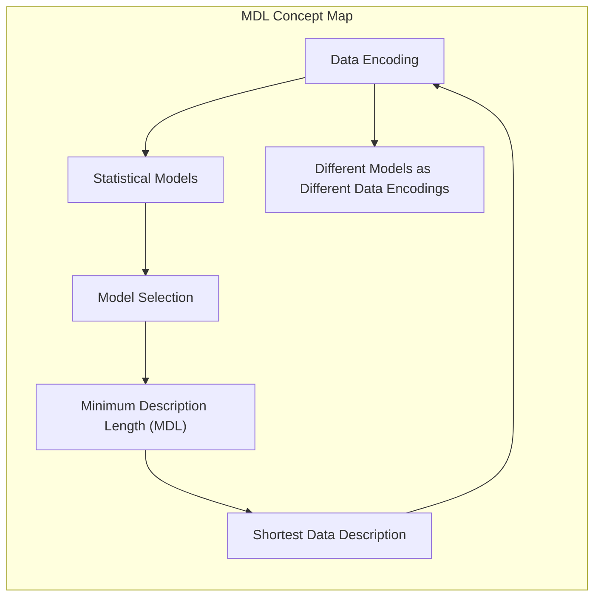
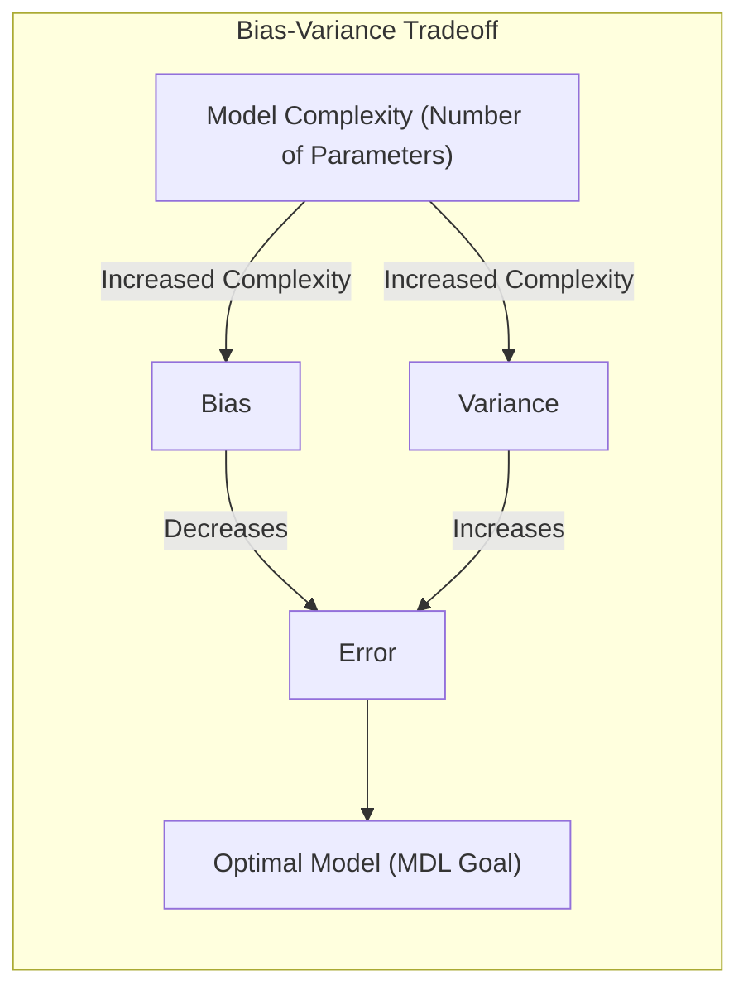
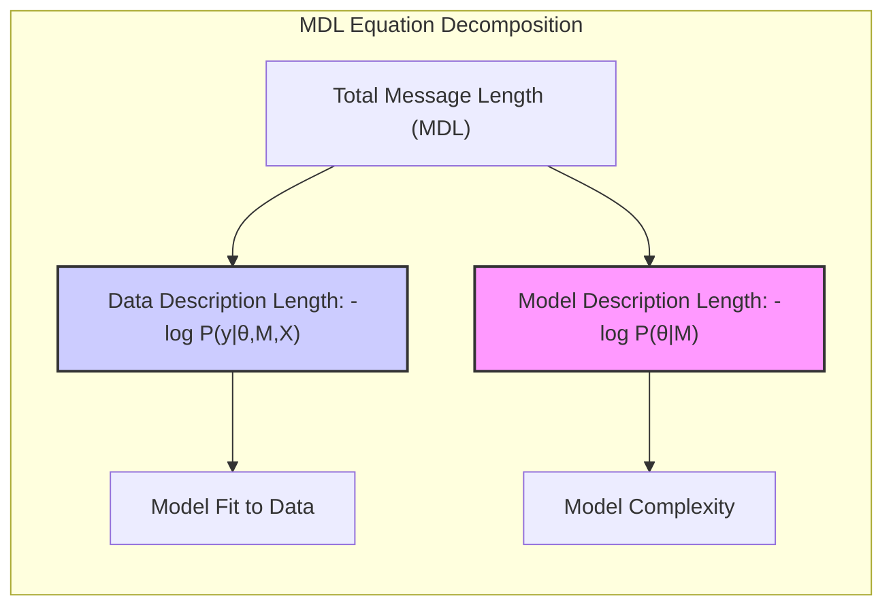
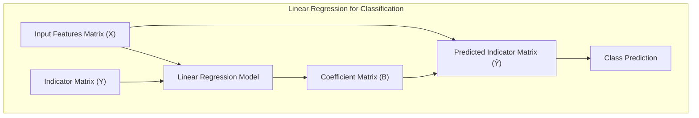
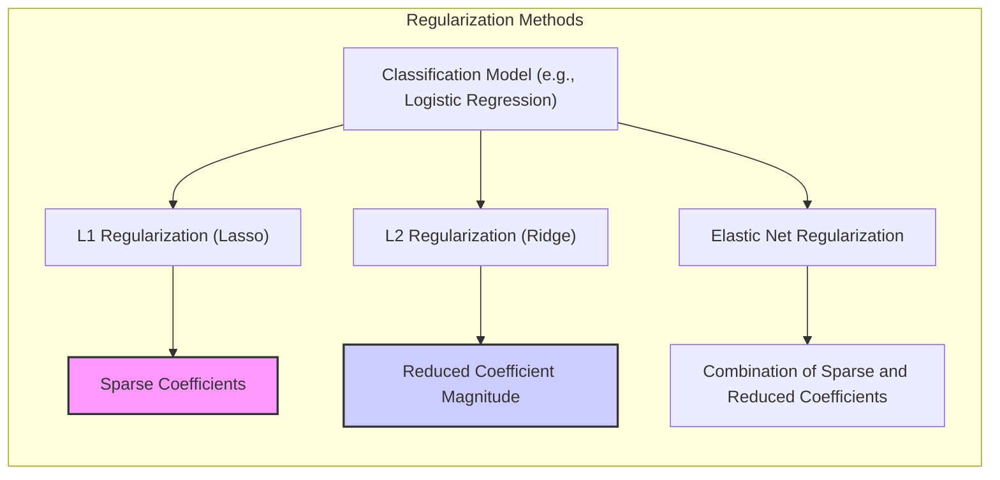
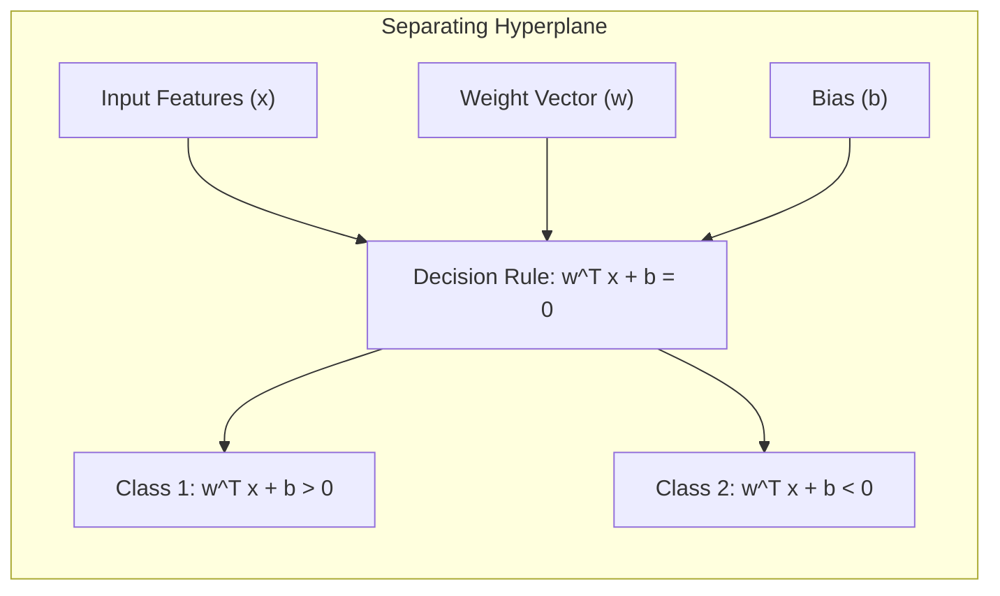

## Model Selection by Message Length



### Introdução

A necessidade de selecionar o modelo mais adequado para um conjunto de dados é uma etapa crucial na modelagem estatística e no aprendizado de máquina [^7.1]. O objetivo é encontrar um modelo que não apenas se ajuste bem aos dados de treinamento, mas que também generalize bem para novos dados não observados. O **princípio do Minimum Description Length (MDL)** oferece uma abordagem teórica para a seleção de modelos, fundamentada na ideia de que o melhor modelo é aquele que consegue comprimir os dados da forma mais eficiente possível [^7.8]. Este capítulo explora o conceito de MDL, explicando como ele se conecta com a teoria da codificação, a complexidade do modelo e a otimização da descrição dos dados.

### Conceitos Fundamentais

**Conceito 1: A Interpretação de Modelos como Códigos**

A essência da abordagem do MDL reside na interpretação de modelos como formas de codificar dados [^7.8]. Cada modelo, com seus parâmetros e estrutura, pode ser visto como um código que permite transmitir informações sobre os dados. Modelos mais simples, com menos parâmetros e estruturas mais restritas, correspondem a códigos mais curtos e concisos. Por outro lado, modelos mais complexos, com maior número de parâmetros e maior flexibilidade, implicam códigos mais longos e detalhados [^7.2]. A ideia fundamental é que, para um dado conjunto de dados, o modelo que oferece a descrição mais curta, ou seja, o código mais eficiente, é o que melhor captura as características essenciais dos dados e generaliza melhor para dados não vistos [^7.8].

**Lemma 1:** *Para uma dada família de modelos, quanto maior a complexidade (número de parâmetros) de um modelo, menor o seu viés, mas maior a sua variância* [^7.2]. Isso significa que modelos mais complexos se ajustam melhor aos dados de treinamento, mas podem se tornar sensíveis demais às especificidades desses dados e, portanto, generalizar pior para dados novos. O MDL procura encontrar um equilíbrio entre o viés e a variância, selecionando o modelo que consegue obter um bom ajuste aos dados com uma complexidade mínima, prevenindo o overfitting.

> 💡 **Exemplo Numérico:** Considere um dataset com 100 pontos amostrados de uma função linear com algum ruído. Um modelo linear simples (com 2 parâmetros: inclinação e intercepto) pode ter um viés maior se a verdadeira relação for ligeiramente não linear. No entanto, um modelo polinomial de grau 5 (com 6 parâmetros) pode se ajustar perfeitamente aos dados de treinamento, mas terá uma alta variância e generalizará mal para dados não vistos (overfitting). O MDL buscaria um modelo com um grau intermediário, talvez um polinômio de grau 2 ou 3, que equilibra viés e variância.



**Conceito 2: Codificação e Comprimento de Mensagem**

A teoria da codificação, como discutida em [^7.8], fornece as bases para entender como os dados podem ser comprimidos. De acordo com essa teoria, um dado com probabilidade $P(z)$ requer aproximadamente $-\log_2 P(z)$ bits para ser codificado. O MDL estende essa ideia ao campo da modelagem estatística, onde os modelos são usados para descrever e prever os dados. O objetivo é encontrar o modelo que minimize o comprimento médio da mensagem necessária para codificar os dados, levando em consideração tanto o ajuste do modelo aos dados quanto a complexidade do próprio modelo [^7.8].

**Corolário 1:** *O comprimento da mensagem (em bits) necessário para codificar um dado $z$ com probabilidade $P(z)$ é aproximadamente dado por $-\log_2 P(z)$* [^7.8]. Esta quantidade é a base do MDL, conectando a teoria da informação e a seleção de modelos. Um modelo que produz uma alta probabilidade para os dados observados (isto é, um bom ajuste) e que, ao mesmo tempo, possui baixa complexidade (isto é, um código curto) será preferido por este princípio.

> 💡 **Exemplo Numérico:** Suponha que você tenha um evento com probabilidade $P(z) = 0.25$. O comprimento da mensagem para codificar este evento seria $-\log_2(0.25) = 2$ bits. Agora, se outro evento tem uma probabilidade $P(z') = 0.01$, o comprimento da mensagem seria $-\log_2(0.01) \approx 6.64$ bits. Isso ilustra que eventos mais raros (menor probabilidade) requerem mais bits para codificar, enquanto eventos mais comuns requerem menos bits. No contexto de modelagem, um bom modelo atribuirá maiores probabilidades aos dados observados, resultando em um comprimento de mensagem menor.


**Conceito 3: O Princípio do Minimum Description Length**

O princípio do MDL estabelece que o melhor modelo é aquele que minimiza o comprimento total da mensagem, que é composto por dois componentes principais [^7.8], [^7.44]:

1.  **O comprimento da mensagem para codificar os dados sob o modelo:** Este componente é geralmente quantificado pelo negativo do logaritmo da verossimilhança dos dados sob o modelo, $- \log P(y|\theta, M, X)$. Modelos que se ajustam bem aos dados produzem altos valores de verossimilhança, o que resulta em um menor comprimento da mensagem [^7.44].
2.  **O comprimento da mensagem para codificar o próprio modelo:** Este componente representa a complexidade do modelo. Modelos mais complexos exigem mais bits para codificar os parâmetros e a estrutura do modelo, o que aumenta o comprimento total da mensagem. Esta quantidade está diretamente relacionada ao número de parâmetros e à sua descrição.

A equação fundamental do MDL busca o balanço entre esses dois componentes:

$$
\text{Length} = - \log P(y|\theta, M, X) - \log P(\theta|M)
$$

O primeiro termo, $- \log P(y|\theta, M, X)$, mede o quão bem o modelo se ajusta aos dados, enquanto o segundo termo, $- \log P(\theta|M)$, mede a complexidade do modelo. Modelos mais simples são preferidos a modelos mais complexos, a menos que a complexidade adicional traga um ganho considerável no ajuste aos dados.

> ⚠️ **Nota Importante**: O MDL é, em essência, uma aplicação do princípio da navalha de Occam, onde a explicação mais simples para um fenômeno é geralmente a melhor [^7.8].

> ❗ **Ponto de Atenção**: O MDL é uma abordagem que busca um compromisso entre o ajuste aos dados e a complexidade do modelo. O objetivo não é apenas ajustar os dados, mas sim encontrar o modelo que representa a explicação mais parcimoniosa para eles.

> ✔️ **Destaque**:  O princípio do MDL é uma ferramenta poderosa para a seleção de modelos, especialmente em situações onde a complexidade do modelo e a quantidade de dados são fatores importantes.



### Regressão Linear e Mínimos Quadrados para Classificação

A regressão linear pode ser utilizada para problemas de classificação através da codificação das classes em matrizes de indicadores [^4.2]. Nesta abordagem, cada classe é representada por um vetor binário, onde o elemento correspondente à classe em questão assume o valor 1, e os demais são 0. Um modelo de regressão linear é então ajustado para prever esses vetores de indicadores. A classe prevista para uma nova observação é determinada pelo vetor indicador que tem a maior previsão de valor [^4.2].

A formulação deste processo pode ser descrita da seguinte forma: seja $\mathbf{Y}$ a matriz de indicadores, onde cada linha corresponde a uma observação e cada coluna a uma classe. A regressão linear ajusta um modelo da forma:

$$\mathbf{\hat{Y}} = \mathbf{X}\mathbf{B}$$

onde $\mathbf{X}$ é a matriz de características (preditores), e $\mathbf{B}$ é a matriz de coeficientes. Para uma nova observação, a classe prevista corresponde ao índice da coluna de $\mathbf{\hat{Y}}$ que tem o maior valor [^4.2].

No entanto, essa abordagem apresenta algumas limitações. Uma delas é que a regressão linear não garante que as previsões $\mathbf{\hat{Y}}$ fiquem dentro do intervalo $[0, 1]$, o que pode levar a problemas de interpretação em termos de probabilidades [^4.1]. Além disso, quando há classes muito desbalanceadas, a regressão linear pode ter dificuldades em identificar as fronteiras de decisão adequadamente [^4.2].

Apesar dessas limitações, a regressão linear em matrizes de indicadores pode ser uma ferramenta útil, especialmente como ponto de partida ou como uma aproximação em certas situações.

**Lemma 2:** *A regressão linear em matrizes de indicadores, em certas condições, pode produzir projeções nos hiperplanos de decisão que são equivalentes àqueles gerados por discriminantes lineares* [^4.3]. Isso ocorre principalmente quando as classes são bem separadas e as variáveis têm distribuições gaussianas.

**Corolário 2:** *Nos casos onde a regressão linear é suficiente para obter uma separação linear das classes, a solução de mínimos quadrados aplicada na matriz de indicadores gera a mesma fronteira de decisão que discriminantes lineares baseados em projeções e variâncias* [^4.3]. Isso implica que, se o principal objetivo é obter a fronteira de decisão linear entre as classes e não a estimativa das probabilidades, a regressão linear pode ser uma escolha viável, tendo vantagens de implementação.

> 💡 **Exemplo Numérico:** Considere um problema de classificação com três classes, onde cada observação tem duas características (x1, x2). As classes podem ser codificadas como vetores indicadores:
> - Classe 1: [1, 0, 0]
> - Classe 2: [0, 1, 0]
> - Classe 3: [0, 0, 1]
>
> Se tivermos 5 amostras com as seguintes características e classes:
>
> | Amostra | x1   | x2   | Classe | Vetor Indicador |
> |--------|------|------|--------|-----------------|
> | 1      | 1.0  | 2.0  | 1      | [1, 0, 0]       |
> | 2      | 1.5  | 1.8  | 1      | [1, 0, 0]       |
> | 3      | 2.5  | 3.0  | 2      | [0, 1, 0]       |
> | 4      | 2.8  | 3.2  | 2      | [0, 1, 0]       |
> | 5      | 3.5  | 4.0  | 3      | [0, 0, 1]       |
>
> Podemos criar a matriz $\mathbf{X}$ (5x2) e a matriz de indicadores $\mathbf{Y}$ (5x3).
> ```python
> import numpy as np
> from sklearn.linear_model import LinearRegression
>
> X = np.array([[1.0, 2.0], [1.5, 1.8], [2.5, 3.0], [2.8, 3.2], [3.5, 4.0]])
> Y = np.array([[1, 0, 0], [1, 0, 0], [0, 1, 0], [0, 1, 0], [0, 0, 1]])
>
> model = LinearRegression()
> model.fit(X, Y)
> Y_hat = model.predict(X)
>
> print("Matriz de Coeficientes (B):", model.coef_)
> print("Matriz de Interceptos:", model.intercept_)
> print("Previsões (Y_hat):", Y_hat)
> ```
> Após o ajuste, para uma nova observação com x1=2 e x2=2.5, calculamos $\mathbf{\hat{y}} = \mathbf{x}\mathbf{B}$. O índice do maior valor em $\mathbf{\hat{y}}$ será a classe prevista.
> Este exemplo ilustra como a regressão linear tenta separar as classes por projeção.



“Em alguns cenários, conforme apontado em [^4.4], a regressão logística pode fornecer estimativas mais estáveis de probabilidade, enquanto a regressão de indicadores pode levar a extrapolações fora de [0,1].”
“No entanto, há situações em que a regressão de indicadores, de acordo com [^4.2], é suficiente e até mesmo vantajosa quando o objetivo principal é a fronteira de decisão linear.”

### Métodos de Seleção de Variáveis e Regularização em Classificação

A seleção de variáveis e a regularização são técnicas importantes para melhorar o desempenho e a interpretabilidade de modelos de classificação [^4.5]. Em muitos problemas, temos um grande número de variáveis preditoras, e nem todas elas são igualmente relevantes para a classificação. Além disso, modelos complexos com muitas variáveis podem ser propensos a overfitting, ou seja, ajustam-se bem aos dados de treinamento, mas generalizam mal para novos dados [^4.4.4].

Para lidar com esses problemas, podemos usar a regularização, que consiste em adicionar um termo de penalidade à função de custo do modelo [^4.4.4]. A penalidade força o modelo a minimizar não apenas o erro de treinamento, mas também a complexidade do modelo. Existem dois tipos principais de penalidades:

1.  **Penalidade L1 (Lasso):** Esta penalidade adiciona ao custo a soma dos valores absolutos dos coeficientes. A penalidade L1 tende a zerar os coeficientes de variáveis irrelevantes, levando a modelos esparsos e facilitando a interpretação [^4.4.4]. Matematicamente, a penalidade L1 pode ser expressa como $\lambda \sum_{j=1}^p |\beta_j|$, onde $\lambda$ é o parâmetro de regularização que controla o peso da penalidade.
2.  **Penalidade L2 (Ridge):** Esta penalidade adiciona ao custo a soma dos quadrados dos coeficientes. A penalidade L2 tende a reduzir a magnitude dos coeficientes, evitando que eles assumam valores extremos, o que também ajuda a reduzir o overfitting [^4.4.4]. Matematicamente, a penalidade L2 pode ser expressa como $\lambda \sum_{j=1}^p \beta_j^2$, onde $\lambda$ é o parâmetro de regularização.

A regularização pode ser integrada em modelos como a regressão logística, alterando a função de custo para incluir os termos de penalidade. Por exemplo, a função de custo para regressão logística com penalidade L1 é dada por:

$$
- \sum_{i=1}^N [y_i \log p(x_i) + (1-y_i) \log (1-p(x_i))] + \lambda \sum_{j=1}^p |\beta_j|
$$

A escolha entre as penalidades L1 e L2, ou uma combinação delas (Elastic Net) depende do problema em questão [^4.5]. A regularização L1 é particularmente útil quando se suspeita que apenas algumas variáveis são importantes para a classificação e que a esparsidade é desejada. A regularização L2 pode ser mais apropriada quando a maioria das variáveis é relevante, mas é necessário evitar o overfitting. O Elastic Net combina os benefícios de ambas as penalidades [^4.5].

**Lemma 3:** *A penalização L1 em modelos de classificação logística leva a coeficientes esparsos* [^4.4.4]. Isto significa que alguns coeficientes serão exatamente zero, o que resulta na seleção de um subconjunto de variáveis para o modelo.

**Prova do Lemma 3:** A penalização L1 impõe uma restrição na soma dos valores absolutos dos coeficientes, $\sum_{j=1}^p |\beta_j| \le t$. A otimização do problema com esta restrição (em contrapartida da L2) resulta numa solução em que alguns dos $\beta_j$ são exatamente iguais a zero (o vértice do poliedro de restrição de $\sum_{j=1}^p |\beta_j|$ tende a intersectar o elipsoide da função de perda), induzindo a esparsidade. A função de custo combinada, incluindo o log-verossimilhança e o termo L1, é convexa mas não diferenciável em alguns pontos. A otimização é realizada com métodos subgradientes, que exploram essa característica para alcançar soluções esparsas. Os detalhes da otimização são encontrados em [^4.4.3] e envolvem técnicas de programação convexa. $\blacksquare$

**Corolário 3:** *A esparsidade induzida pela regularização L1 facilita a interpretação do modelo, pois apenas as variáveis mais relevantes são selecionadas para a classificação* [^4.4.5]. Isso é particularmente útil em problemas com muitas variáveis preditoras, onde a identificação das variáveis mais relevantes pode levar a uma compreensão mais profunda do fenômeno em estudo.

> 💡 **Exemplo Numérico:** Vamos considerar um problema de classificação binária com regressão logística, onde temos 4 variáveis preditoras. Vamos comparar os resultados com regularização L1 (Lasso) com diferentes valores de $\lambda$:
>
> Suponha que após treinar o modelo, obtivemos os seguintes coeficientes $\beta$ para diferentes valores de $\lambda$:
>
> | Modelo          | $\lambda$ | $\beta_1$ | $\beta_2$ | $\beta_3$ | $\beta_4$ |
> |-----------------|-----------|-----------|-----------|-----------|-----------|
> | Sem Regularização | 0         | 0.8      | -0.5     | 1.2      | -0.3     |
> | L1 (Lasso)      | 0.1       | 0.6      | -0.3     | 1.0      | 0.0      |
> | L1 (Lasso)      | 0.5       | 0.0      | -0.1     | 0.8      | 0.0      |
> | L1 (Lasso)      | 1.0       | 0.0      | 0.0      | 0.5      | 0.0      |
>
> Com $\lambda = 0$ (sem regularização), todos os coeficientes são não nulos. Com $\lambda = 0.1$, o coeficiente $\beta_4$ é zerado, o que implica que a variável correspondente não é utilizada pelo modelo. À medida que aumentamos $\lambda$, mais coeficientes são zerados (aqui, $\beta_1$ e $\beta_2$ para $\lambda = 0.5$ e $\beta_1, \beta_2, \beta_4$ para $\lambda=1$), tornando o modelo mais esparso e fácil de interpretar.
>
> Agora, um exemplo com L2:
>
> | Modelo          | $\lambda$ | $\beta_1$ | $\beta_2$ | $\beta_3$ | $\beta_4$ |
> |-----------------|-----------|-----------|-----------|-----------|-----------|
> | Sem Regularização | 0         | 0.8      | -0.5     | 1.2      | -0.3     |
> | L2 (Ridge)      | 0.1       | 0.75      | -0.45    | 1.1      | -0.25     |
> | L2 (Ridge)      | 0.5       | 0.6     | -0.3    | 0.9      | -0.2     |
> | L2 (Ridge)      | 1.0       | 0.5    | -0.2     | 0.8      | -0.15     |
>
>  Com L2, os coeficientes são reduzidos em magnitude, mas não são necessariamente zerados.

> ⚠️ **Ponto Crucial**: A combinação das penalidades L1 e L2 (Elastic Net) permite que o modelo combine os benefícios da seleção de variáveis (L1) e da redução da magnitude dos coeficientes (L2), oferecendo uma solução robusta para modelos de classificação [^4.5].



### Separating Hyperplanes e Perceptrons

A ideia de **hiperplanos separadores** é fundamental para métodos de classificação linear [^4.5.2]. Em um espaço multidimensional, um hiperplano é uma superfície que divide o espaço em duas regiões. Em um problema de classificação binária, o objetivo é encontrar um hiperplano que separe as observações de uma classe das observações da outra [^4.5.2].

A formulação matemática de um hiperplano em um espaço de $p$ dimensões é dada por:

$$
\mathbf{w}^T \mathbf{x} + b = 0
$$

onde $\mathbf{w}$ é o vetor de pesos (normal ao hiperplano), $\mathbf{x}$ é o vetor de características (inputs), e $b$ é o termo de bias, que determina o deslocamento do hiperplano em relação à origem. Os pontos que satisfazem $\mathbf{w}^T \mathbf{x} + b > 0$ são classificados em uma classe, e os que satisfazem $\mathbf{w}^T \mathbf{x} + b < 0$ são classificados na outra.

Um hiperplano ideal é aquele que separa as classes com a maior margem possível [^4.5.2]. A margem é definida como a distância mínima entre o hiperplano e os pontos mais próximos de cada classe. Maximizar a margem permite que o modelo seja mais robusto e generalize melhor para novas observações.

Um dos algoritmos clássicos para encontrar hiperplanos separadores é o **Perceptron de Rosenblatt** [^4.5.1]. O Perceptron é um algoritmo iterativo que tenta encontrar um vetor de pesos $\mathbf{w}$ e um bias $b$ que separem as classes corretamente. O algoritmo começa com pesos aleatórios e itera até que todos os pontos sejam classificados corretamente. Em cada iteração, o algoritmo calcula as classificações atuais, ajusta o vetor de pesos de acordo com os pontos que foram classificados incorretamente, convergindo para o hiperplano ideal, quando este existe (dados linearmente separáveis) [^4.5.1].

> 💡 **Exemplo Numérico:** Considere um conjunto de dados com duas classes em um espaço 2D, onde $\mathbf{x} = [x_1, x_2]^T$. Inicializamos o vetor de pesos com $\mathbf{w} = [0.1, -0.2]^T$ e o bias com $b = 0$.
>  
>  Vamos seguir as iterações do perceptron usando as seguintes amostras, com os rótulos ajustados para serem +1 e -1:
>  
> | Amostra | $x_1$ | $x_2$ | Classe (y) |
> |---------|-------|-------|------------|
> |   1     |   2   |   1   |      +1    |
> |   2     |   3   |   3   |      +1    |
> |   3     |   1   |   3   |      -1    |
> |   4     |   2   |   4   |      -1    |
>
>
> $\text{Iteração 1: }$
>  
> $\text{Amostra 1: } \mathbf{w}^T\mathbf{x} + b = (0.1 \times 2) + (-0.2 \times 1) + 0 = 0 $. Como $0 \ngtr 0$, a classificação está incorreta.  Atualizamos os pesos: $\mathbf{w} = \mathbf{w} + \eta y\mathbf{x} =  [0.1, -0.2] + 1 \times [2, 1] = [2.1, -1.8]$.
>  
> $\text{Amostra 2: } \mathbf{w}^T\mathbf{x} + b = (2.1 \times 3) + (-1.8 \times 3) + 0 = 0.9 $. Como $0.9>0$, a amostra está classificada corretamente.
>
> $\text{Amostra 3: } \mathbf{w}^T\mathbf{x} + b = (2.1 \times 1) + (-1.8 \times 3) + 0 = -3.3 $. Como $-3.3<0$, a amostra está classificada corretamente.
>  
> $\text{Amostra 4: } \mathbf{w}^T\mathbf{x} + b = (2.1 \times 2) + (-1.8 \times 4) + 0 = -3 $. Como $-3 < 0$, a amostra está classificada corretamente.
>
> $\text{Iteração 2: }$
>
>  Aplicamos o mesmo procedimento para a segunda iteração e assim por diante, até que todas as amostras sejam classificadas corretamente. O perceptron ajustará $\mathbf{w}$ e $b$ iterativamente até encontrar um hiperplano que separe corretamente as classes.
>
> Após convergência, o hiperplano encontrado (definido por $\mathbf{w}$ e $b$) será usado para classificar novos pontos.
>



### Pergunta Teórica Avançada: Quais as diferenças fundamentais entre a formulação de LDA e a Regra de Decisão Bayesiana considerando distribuições Gaussianas com covariâncias iguais?

**Resposta:**
A **Linear Discriminant Analysis (LDA)** e a **Regra de Decisão Bayesiana** são abordagens para problemas de classificação, especialmente quando as distribuições das classes são Gaussianas [^4.3]. Quando as covariâncias das distribuições Gaussianas são iguais em todas as classes, a LDA se torna uma forma simplificada da Regra de Decisão Bayesiana [^4.3].

A Regra de Decisão Bayesiana, em geral, aloca cada observação à classe que tem a maior probabilidade *a posteriori*, ou seja, à classe que maximiza $P(G=k|X=x)$, onde $G$ é a variável de classe e $X$ é a variável de característica. Quando as distribuições condicionais $P(X|G=k)$ são Gaussianas com médias $\mu_k$ e covariâncias $\Sigma_k$, essa regra se traduz em:

$$
\text{assign x to class } k \text{ if } \delta_k(x) =  \text{argmax}_k \{-\frac{1}{2} (x-\mu_k)^T \Sigma_k^{-1}(x-\mu_k) + \log \pi_k\}
$$
onde $\pi_k$ é a probabilidade *a priori* da classe $k$.

A LDA, por sua vez, assume que as covariâncias de todas as classes são iguais, ou seja, $\Sigma_k = \Sigma$ para todas as classes [^4.3]. Sob essa suposição, o discriminante na regra Bayesiana se torna:
$$
\delta_k(x) = x^T \Sigma^{-1} \mu_k - \frac{1}{2}\mu_k^T \Sigma^{-1}\mu_k + \log \pi_k
$$
que é uma função linear de $x$. Esta formulação simplifica a estrutura do problema de classificação, uma vez que os termos quadráticos e de covariância são substituídos por termos lineares.

A principal diferença entre LDA e a Regra de Decisão Bayesiana é que a LDA impõe uma restrição mais forte sobre as covariâncias, o que simplifica o cálculo e a implementação. Quando essa hipótese de covariâncias iguais não é válida, a Regra de Decisão Bayesiana com covariâncias diferentes leva à **Quadratic Discriminant Analysis (QDA)**, que possui funções discriminantes quadráticas [^4.3].

**Lemma 4:** *Sob a suposição de covariâncias iguais nas distribuições gaussianas, a regra de decisão da LDA é equivalente à regra de decisão bayesiana* [^4.3], [^4.3.3].
Esta equivalência demonstra que LDA é um caso especial da regra Bayesiana, mas simplificada devido às restrições sobre as covariâncias.

**Corolário 4:** *Ao relaxar a suposição de covariâncias iguais (como no QDA), as fronteiras de decisão se tornam quadráticas e podem modelar separações mais complexas, ao preço de maior complexidade e mais parâmetros a serem estimados* [^4.3]. A escolha entre LDA e QDA depende do equilíbrio entre a simplicidade do modelo e a capacidade de capturar a complexidade dos dados.

> 💡 **Exemplo Numérico:** Considere um problema de classificação com duas classes, onde cada classe segue uma distribuição gaussiana.
>
> *   **Classe 1:** $\mu_1 = [1, 1]^T$, $\Sigma_1 = \begin{bmatrix} 1 & 0.5 \\ 0.5 & 1 \end{bmatrix}$
> *   **Classe 2:** $\mu_2 = [3, 3]^T$, $\Sigma_2 = \begin{bmatrix} 1 & -0.5 \\ -0.5 & 1 \end{bmatrix}$
>
>   Se aplicarmos a Regra de Decisão Bayesiana sem a restrição de covariâncias iguais (QDA), usaremos  $\Sigma_1$ e $\Sigma_2$.
>   Porém, se aplicarmos LDA, iremos estimar uma matriz de covariância comum $\Sigma$ (e.g., a média de  $\Sigma_1$ e $\Sigma_2$).
>   ```python
>    import numpy as np
>    from scipy.stats import multivariate_normal
>
>    # Parâmetros das distribuições gaussianas
>    mu1 = np.array([1, 1])
>    sigma1 = np.array([[1, 0.5], [0.5, 1]])
>    mu2 = np.array([3, 3])
>    sigma2 = np.array([[1, -0.5], [-0.5, 1]])
>
>    # Um ponto de teste
>    x = np.array([2, 2])
>    # Cálculo da densidade de probabilidade
>    p1 = multivariate_normal.pdf(x, mu1, sigma1)
>    p2 = multivariate_normal.pdf(x, mu2, sigma2)
>    print(f"Probabilidade para Classe 1 (QDA): {p1:.4f}")
>    print(f"Probabilidade para Classe 2 (QDA): {p2:.4f}")
>    # Se a priori probabilities forem iguais (0.5,0.5)
>    if p1 > p2:
>      print("Classificado como Classe 1 (QDA)")
>    else:
>      print("Classificado como Classe 2 (QDA)")
>
>    # LDA - Estimar uma matriz de covariância comum
>    sigma_lda = (sigma1 + sigma2) / 2
>    p1_lda = multivariate_normal.pdf(x, mu1, sigma_lda)
>    p2_lda = multivariate_normal.pdf(x, mu2, sigma_lda)
>    print(f"Probabilidade para Classe 1 (LDA): {p1_lda:.4f}")
>    print(f"Probabilidade para Classe 2 (LDA): {p2_lda:.4f}")
>    if p1_lda > p2_lda:
>      print("Classificado como Classe 1 (LDA)")
>    else:
>       print("Classificado como Classe 2 (LDA)")
>   ```
>   O resultado mostra que a diferença entre QDA e LDA surge devido à diferença nas matrizes de covariância utilizadas nos cálculos de densidade de probabilidade. QDA permite que cada classe tenha sua própria matriz de covariância, enquanto LDA assume uma única matriz de covariância para todas as classes.
>  
>   Este exemplo ilustra como a escolha entre LDA e QDA pode afetar a classificação dependendo dos dados.

```mermaid
graph LR
    subgraph "LDA vs Bayesian Decision Rule"
        direction TB
         A["Bayesian Decision Rule with Gaussian Distributions"]
        B["LDA (Equal Covariance Assumption)"]
        C["QDA (Unequal Covariances)"]
        A --> D["Discriminant Function