## Model Assessment and Selection: MDL as Negative Log Posterior

<imagem: Mapa mental complexo conectando MDL, BIC, AIC, cross-validation e bootstrap, com setas e legendas que explicam os tipos de erro que cada um estima e as situações onde cada método é mais apropriado.>

### Introdução
A avaliação e seleção de modelos são etapas cruciais no processo de aprendizado de máquina e estatística. A capacidade de um modelo generalizar para dados não vistos, e não apenas ajustar-se perfeitamente aos dados de treinamento, é o que define sua utilidade prática [^7.1]. Neste capítulo, exploramos o **Minimum Description Length (MDL)** como um critério de seleção de modelos, demonstrando como ele se relaciona com o conceito de **log-posterior negativo**. A discussão abrangente do viés, da variância, e da complexidade do modelo [^7.2] nos prepara para entender por que técnicas como o MDL, que equilibram ajuste e complexidade, são essenciais. O MDL, em particular, aborda a questão da seleção de modelos de uma perspectiva diferente, focando na compressão de dados e na transmissão eficiente de informações. A equivalência entre MDL e o BIC, ambos derivados de uma perspectiva bayesiana, é explorada em detalhes.

### Conceitos Fundamentais
#### Conceito 1: Generalização e Erro de Teste
O **desempenho de generalização** de um modelo refere-se à sua capacidade de fazer previsões precisas em dados independentes que não foram usados no treinamento. O objetivo de qualquer método de aprendizado de máquina é minimizar o erro em dados não vistos, o que é conhecido como **erro de teste ou erro de generalização** [^7.1]. Este erro pode ser estimado de várias formas, cada qual com suas nuances. A complexidade de um modelo e sua capacidade de generalizar estão intrinsecamente ligadas, com modelos mais complexos tendendo a se ajustar demais aos dados de treinamento, levando a um erro de teste pior. Este conceito é fundamental para a seleção do modelo ideal e é discutido em [^7.2].

**Lemma 1:** *O erro de teste esperado de um modelo pode ser decomposto em componentes de viés, variância e erro irredutível.*

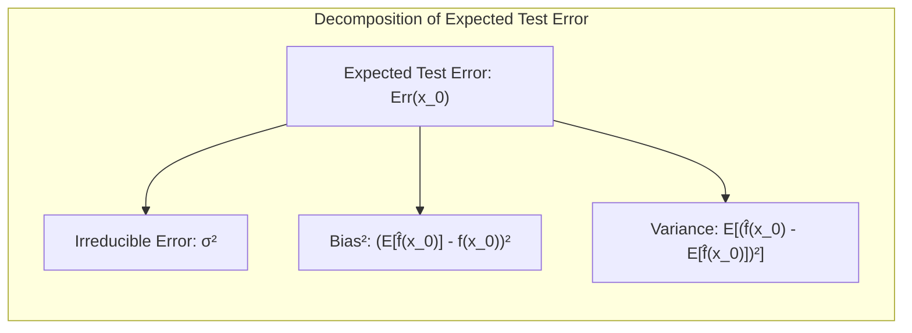

A demonstração do Lemma 1 [^7.3], baseia-se em uma derivação da decomposição de viés-variância do erro de predição, onde o erro esperado $Err(x_0)$ em um ponto de entrada $x_0$ é dado por:
$$Err(x_0) = \sigma^2 + [E\hat{f}(x_0) - f(x_0)]^2 + E[\hat{f}(x_0) - E\hat{f}(x_0)]^2$$
onde $\sigma^2$ representa o erro irredutível, $[E\hat{f}(x_0) - f(x_0)]^2$ o viés ao quadrado, e $E[\hat{f}(x_0) - E\hat{f}(x_0)]^2$ a variância. A prova consiste em manipular a equação de erro quadrático até chegar nessa decomposição.
$\blacksquare$

> 💡 **Exemplo Numérico:** Suponha que temos um modelo que tenta prever os valores de uma função $f(x) = 2x + 3$. Coletamos um conjunto de dados ruidoso com $\sigma^2 = 1$ e ajustamos um modelo linear $\hat{f}(x) = \beta x + \alpha$. Consideremos dois cenários:
>
> 1.  **Modelo Simples:** $\hat{f}_1(x) = 2.1x + 2.8$. Neste caso, o viés é $[E[\hat{f}_1(x)] - f(x)]^2 = [2.1x + 2.8 - (2x + 3)]^2 = (0.1x - 0.2)^2$. Para $x=2$, o viés é $(0.2 - 0.2)^2 = 0$. Se a variância, devido a incerteza nos parâmetros, é $E[\hat{f}_1(x) - E\hat{f}_1(x)]^2 = 0.2$. O erro esperado em $x=2$ seria $Err(2) = 1 + 0 + 0.2 = 1.2$.
> 2.  **Modelo Complexo (Overfitting):** $\hat{f}_2(x) = 1.9x + 3.2 + 0.05x^2$. Este modelo se ajusta muito bem aos dados de treino, mas tem alta variância. O viés é $[E[\hat{f}_2(x)] - f(x)]^2 = [1.9x + 3.2 + 0.05x^2 - (2x + 3)]^2 = (-0.1x + 0.2 + 0.05x^2)^2$. Para $x=2$ o viés é  $(-0.2 + 0.2 + 0.2)^2 = 0.04$. A variância, devido a incerteza nos parâmetros, seria maior $E[\hat{f}_2(x) - E\hat{f}_2(x)]^2 = 0.8$. O erro esperado em $x=2$ seria $Err(2) = 1 + 0.04 + 0.8 = 1.84$.
>
> Este exemplo ilustra como o modelo mais simples ($f_1$) tem menor erro de generalização em $x=2$ do que o modelo mais complexo ($f_2$). Apesar do modelo $f_2$ ter um viés menor em $x=2$, sua alta variância prejudica o seu erro total de generalização.

#### Conceito 2: Minimum Description Length (MDL)
O **Minimum Description Length (MDL)** é um princípio para seleção de modelos que busca o modelo mais parcimonioso que melhor se ajusta aos dados. O MDL trata a seleção de modelos como um problema de codificação de dados, onde o objetivo é encontrar a representação mais curta dos dados [^7.8]. O modelo ideal é aquele que permite a transmissão mais eficiente dos dados, ou seja, aquele que minimiza a descrição do modelo e o erro de predição. O MDL equilibra a complexidade do modelo com a sua precisão, penalizando modelos muito complexos que não trazem ganhos significativos na explicação dos dados [^7.8].

**Corolário 1:** *O MDL pode ser interpretado como um critério de seleção de modelos baseado na maximização da probabilidade posterior aproximada.*
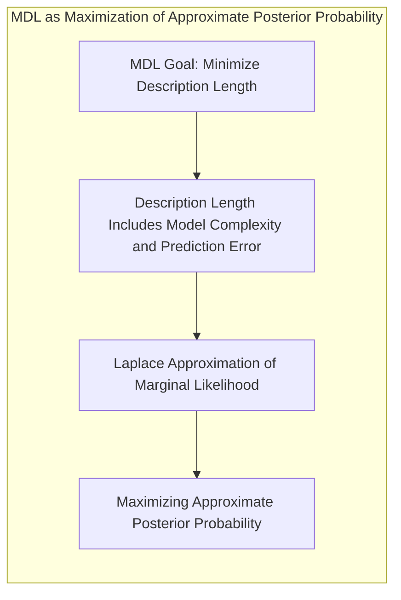
Esta interpretação surge do fato de que, sob certas condições, o MDL pode ser derivado da aplicação da aproximação de Laplace à integral que define a probabilidade marginal dos dados sob um modelo específico. A prova da equivalência entre o MDL e a maximização de uma posterior aproximada (derivada no contexto [^7.8]) envolve a demonstração de que ambos os critérios levam à mesma função de custo, onde o custo inclui tanto o erro de ajuste do modelo aos dados quanto a complexidade do modelo, expressa por sua descrição.
$\blacksquare$

> 💡 **Exemplo Numérico:** Imagine que temos duas formas de codificar um conjunto de 100 números. O primeiro modelo usa um polinômio de grau 1 (uma reta), ajustado por mínimos quadrados e requer 2 parâmetros (inclinação e intercepto). O segundo modelo usa um polinômio de grau 9, que precisa de 10 parâmetros.
>
> *   **Modelo 1 (Reta):** Após ajustar a reta, o resíduo (diferença entre o valor previsto e o valor real) pode ser codificado com 5 bits por ponto (aproximação). O comprimento total da descrição seria então: descrição do modelo (2 parâmetros * 10 bits/parâmetro) + descrição do erro (100 pontos * 5 bits/ponto) = 20 + 500 = 520 bits.
> *   **Modelo 2 (Polinômio de Grau 9):** O ajuste é melhor, com um resíduo que pode ser codificado com 2 bits por ponto (aproximação), mas o custo de codificar o modelo é maior: (10 parâmetros * 10 bits/parâmetro) + (100 pontos * 2 bits/ponto) = 100 + 200 = 300 bits.
>
> Aqui, apesar do modelo 2 ter um erro menor, o modelo 1 é mais simples (menos parâmetros) e o comprimento total da sua descrição (520 bits) é maior que o do modelo 2 (300 bits). No entanto, é importante notar que o MDL também levará em conta a complexidade do próprio modelo (tamanho da descrição dos parâmetros), então o modelo mais simples pode vir a ser o mais curto na descrição final dos dados. O exemplo ilustra como o MDL busca o equilíbrio entre a complexidade e o ajuste do modelo.

#### Conceito 3: Log-Posterior Negativo
O **log-posterior negativo** é uma função de custo usada na inferência bayesiana, obtida como o negativo do logaritmo da distribuição posterior de um modelo dado um conjunto de dados. Minimizar o log-posterior negativo é equivalente a maximizar a probabilidade posterior do modelo. O log-posterior negativo é composto de dois termos principais: o log-likelihood (que mede o ajuste do modelo aos dados) e o log-prior (que quantifica a probabilidade a priori do modelo). Modelos complexos com um bom ajuste aos dados terão um log-likelihood alto, mas se forem muito complexos, terão um log-prior baixo, e um log-posterior negativo mais alto. Este conceito está intimamente relacionado ao princípio do MDL e será explorado em [^7.8].
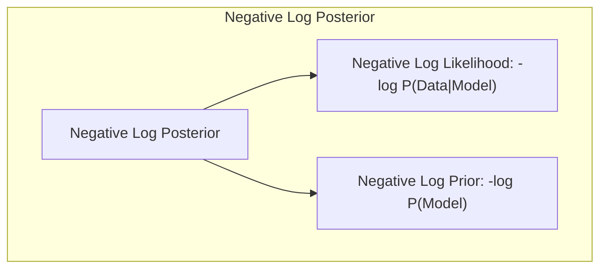

> ⚠️ **Nota Importante**: O log-posterior negativo é uma ferramenta chave para a inferência bayesiana, permitindo avaliar e comparar diferentes modelos. **Referência ao tópico [^7.8]**.
> ❗ **Ponto de Atenção**: A escolha do prior influencia fortemente a probabilidade posterior e, consequentemente, o desempenho da seleção de modelos.
> ✔️ **Destaque**: O MDL pode ser visto como uma aproximação da minimização do log-posterior negativo quando um prior uniforme é assumido para os modelos. **Baseado no tópico [^7.8]**.

> 💡 **Exemplo Numérico:** Suponha que estamos comparando dois modelos para ajustar um conjunto de dados de regressão. O primeiro modelo ($M_1$) é uma reta, e o segundo ($M_2$) é um polinômio de grau 2. Assumindo um prior Gaussiano para os parâmetros, vamos comparar os log-posterior negativos dos modelos:
>
> *   **Modelo 1 (Reta):**  O log-likelihood é -100 (medida do ajuste). O log-prior é -10 (penalidade por complexidade). O log-posterior negativo é 100 + 10 = 110.
> *   **Modelo 2 (Polinômio de Grau 2):** O log-likelihood é -95 (melhor ajuste). O log-prior é -20 (maior penalidade por complexidade). O log-posterior negativo é 95 + 20 = 115.
>
> Neste caso, embora o modelo 2 ($M_2$) tenha um melhor ajuste aos dados (menor log-likelihood negativo), a sua maior complexidade (penalizada por um log-prior mais baixo) faz com que seu log-posterior negativo seja maior que o do modelo 1 ($M_1$). O modelo com menor log-posterior negativo (neste caso, $M_1$) seria preferido, ilustrando o trade-off entre ajuste e complexidade.

### Regressão Linear e Mínimos Quadrados para Classificação
<imagem: Diagrama em Mermaid mostrando o fluxo de trabalho do MDL para escolha de modelos:
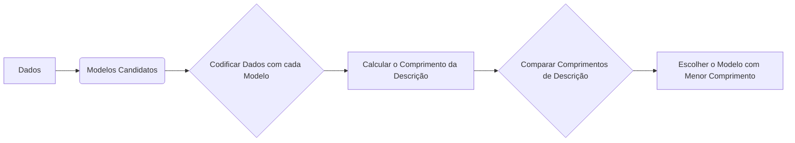
**Explicação:** Este diagrama ilustra como o MDL compara modelos calculando o comprimento da descrição dos dados, que envolve o ajuste do modelo aos dados e a complexidade do modelo, baseando-se nos conceitos [^7.8].

A **regressão linear** é um método popular para modelagem estatística, mas sua aplicação à classificação geralmente requer uma matriz de indicadores, onde cada classe é representada por um vetor. A regressão linear busca os coeficientes que minimizam a soma dos erros quadráticos, o que pode ser expressado como a minimização da expressão $(Y-X\beta)^T(Y-X\beta)$. A dificuldade é que este método não leva explicitamente em conta o fato de que os valores de saída $Y$ representam classes, não números contínuos, conforme observado em [^7.1], [^7.2]. Apesar disso, a regressão linear pode, em alguns casos, gerar bons resultados na classificação, especialmente quando as classes são linearmente separáveis ou aproximadamente linearmente separáveis. A regressão linear aplicada à classificação pode sofrer do problema do masking, onde a complexidade da fronteira de decisão se torna inadequada para a separação ótima. É neste contexto que surge a necessidade de modelos como o LDA, que consideram as propriedades estatísticas das classes de forma mais explícita, conforme referenciado em [^7.3].
Para ilustrar como o MDL opera em um contexto de regressão linear, imaginemos que os dados $y_i$ sejam modelados como $y_i = x_i^T \beta + \epsilon_i$, onde $\epsilon_i \sim N(0, \sigma^2)$. O objetivo do MDL seria encontrar um modelo (ou seja, um vetor $\beta$) que equilibre bem a qualidade do ajuste aos dados e a complexidade do modelo, que neste caso estaria relacionada ao número de variáveis em $\beta$. Modelos com muitos parâmetros são mais propensos a overfitting, que penaliza o desempenho de generalização. O princípio do MDL busca um equilíbrio entre esses dois fatores.

**Lemma 2:** *A escolha do modelo com menor descrição MDL é equivalente à escolha do modelo que maximiza a probabilidade posterior aproximada, com uma penalidade na complexidade do modelo.*
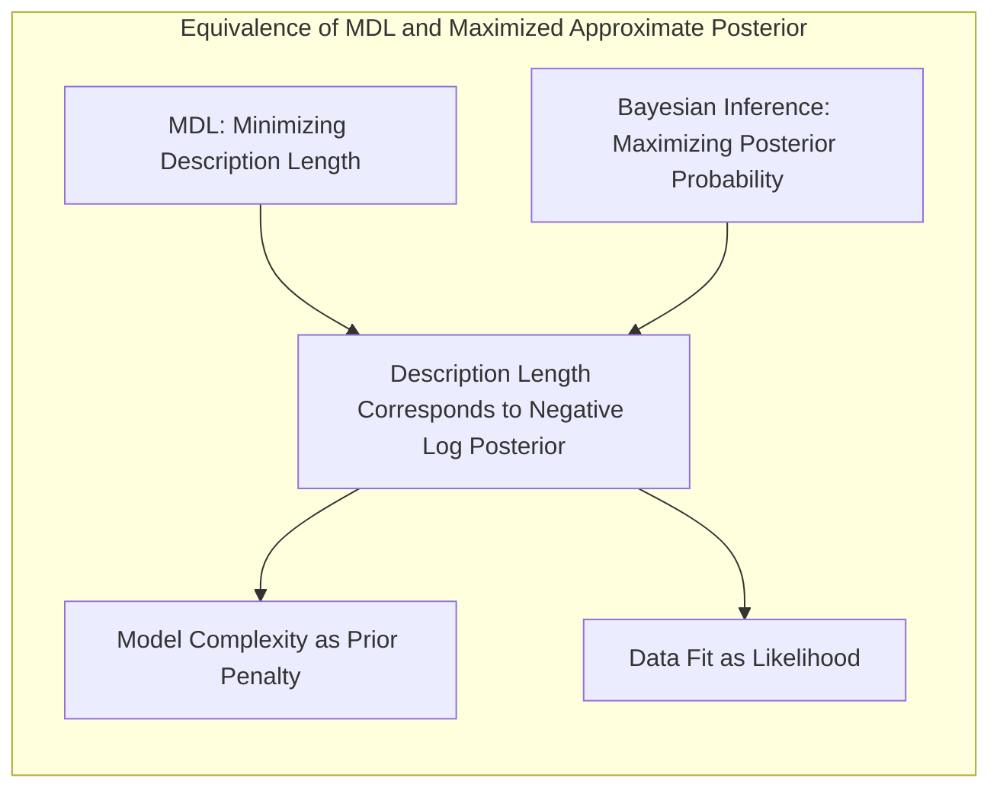
Esta equivalência surge quando se considera a descrição do modelo e dos dados sob uma perspectiva bayesiana. A demonstração deste lemma envolve o desenvolvimento da relação entre a codificação dos dados e a probabilidade marginal dos mesmos sob um determinado modelo. A parte do MDL relacionada ao comprimento da descrição dos dados corresponde ao log-likelihood, enquanto a descrição do modelo corresponderá a um termo penalizador similar ao log-prior na inferência bayesiana. Quando a distribuição anterior é uniforme, a escolha do modelo com menor MDL será equivalente à maximização da verossimilhança penalizada com um termo de complexidade.
$\blacksquare$

**Corolário 2:** *Em problemas de regressão linear, o MDL leva a uma forma similar ao critério BIC (Bayesian Information Criterion), onde a complexidade do modelo é dada pelo número de parâmetros.*
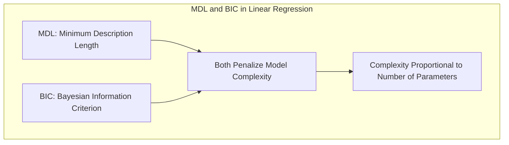
A derivação do corolário [^7.7]  envolve a demonstração de que o termo de complexidade em um modelo linear, sob o MDL, pode ser aproximado pelo número de parâmetros no modelo, multiplicado por uma função da cardinalidade dos dados, o que torna o critério MDL muito similar ao BIC.  A similaridade com o BIC demonstra como o MDL está conectado à inferência bayesiana e como penalidades na complexidade do modelo surgem naturalmente dessa perspectiva. $\blacksquare$

> 💡 **Exemplo Numérico:** Considere um problema de regressão linear com 100 pontos, onde queremos avaliar a inclusão de uma variável adicional.
>
> *   **Modelo 1 (Simples):** $y_i = \beta_0 + \beta_1 x_{i1} + \epsilon_i$. Após ajustar, o erro quadrático médio (MSE) é 2. A descrição do modelo (complexidade) é 2 parâmetros * 10 bits/parâmetro = 20 bits. O comprimento da descrição do erro (aproximado) é 100 * log2(2) ≈ 100 bits (baseado no erro). O comprimento total da descrição do MDL é 20 + 100 = 120 bits.
> *   **Modelo 2 (Complexo):** $y_i = \beta_0 + \beta_1 x_{i1} + \beta_2 x_{i2} + \epsilon_i$. Após ajustar, o MSE é 1.5 (melhor ajuste). A descrição do modelo é 3 parâmetros * 10 bits/parâmetro = 30 bits. O comprimento da descrição do erro é 100 * log2(1.5) ≈ 60 bits. O comprimento total da descrição do MDL é 30 + 60 = 90 bits.
>
> Se usarmos o BIC, teríamos aproximadamente:
>
> *   **Modelo 1:** -2 * log-likelihood + log(100) * 2. Assumindo que o log-likelihood é proporcional a -100 * MSE = -200, teríamos -2 * (-200) + log(100) * 2 = 400 + 9.21*2 = 418.42
> *   **Modelo 2:** -2 * log-likelihood + log(100) * 3. Assumindo que o log-likelihood é proporcional a -100 * MSE = -150, teríamos -2 * (-150) + log(100) * 3 = 300 + 9.21*3 = 327.63
>
> Em ambos os casos (MDL e BIC), o modelo 2 seria o escolhido, indicando que a redução no erro compensou o aumento na complexidade. No entanto, se o MSE do modelo 2 fosse apenas marginalmente melhor, o modelo 1 poderia ser preferido. Este exemplo demonstra como o MDL e o BIC equilibram ajuste e complexidade.

### Métodos de Seleção de Variáveis e Regularização em Classificação
A seleção de variáveis e a regularização são cruciais para evitar overfitting e melhorar a generalização em problemas de classificação. No contexto da **regressão logística**, a regularização envolve a adição de termos de penalização à função de custo, que é normalmente o log-likelihood negativo [^7.4.4]. Estas penalizações podem ser do tipo L1 (Lasso), que promovem a esparsidade do modelo, forçando certos coeficientes a zero, ou do tipo L2 (Ridge), que reduzem a magnitude dos coeficientes, melhorando a estabilidade do modelo [^7.5].
O MDL pode ser usado para selecionar o nível ideal de regularização através da busca do valor dos parâmetros de regularização que minimizam o comprimento da descrição do modelo e dos dados. Um modelo com muita regularização pode ter uma descrição curta, mas uma qualidade de ajuste ruim, enquanto um modelo sem regularização pode ter um ajuste excelente, mas uma descrição muito complexa. O MDL busca um equilíbrio ótimo entre esses dois extremos [^7.5.1] [^7.5.2]. A escolha do parâmetro de regularização é um problema de seleção de modelo, e os critérios de avaliação mencionados (AIC, BIC, etc) podem ser utilizados.

**Lemma 3:** *A penalização L1 na regressão logística induz esparsidade nos coeficientes, enquanto a penalização L2 reduz a magnitude dos coeficientes.*

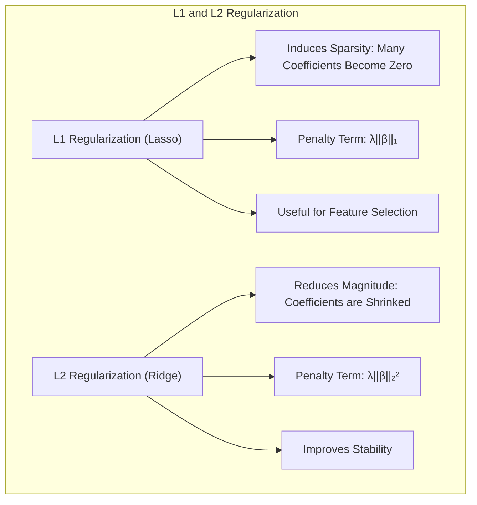

A demonstração deste lemma [^7.4.4] envolve a análise das propriedades das penalidades L1 e L2 sob o contexto da função de custo de regressão logística. A penalidade L1 (soma dos valores absolutos dos coeficientes) leva a soluções esparsas porque ela tem um ponto de não diferenciabilidade em zero, promovendo que muitos coeficientes sejam exatamente iguais a zero, enquanto a penalidade L2 (soma dos quadrados dos coeficientes) não promove esparsidade mas sim uma redução nas magnitudes dos coeficientes, tornando o modelo mais estável.
$\blacksquare$

**Prova do Lemma 3:** A prova formal do Lemma 3 se baseia nas propriedades de otimização das funções penalizadas L1 e L2. Especificamente, quando otimizamos $L(\beta) + \lambda \|\beta\|_1$ (onde $L$ é a função de custo logístico) a solução tenderá a ter muitos coeficientes $\beta_i=0$, especialmente para valores grandes de $\lambda$, enquanto para o termo L2, a solução tende a ter todos os coeficientes menores, sem que necessariamente sejam nulos. $\blacksquare$

**Corolário 3:** *O uso de penalidades L1 e L2 pode ser interpretado como a incorporação de priors na inferência bayesiana, onde o prior L1 induz esparsidade e o prior L2 induz coeficientes menores.*
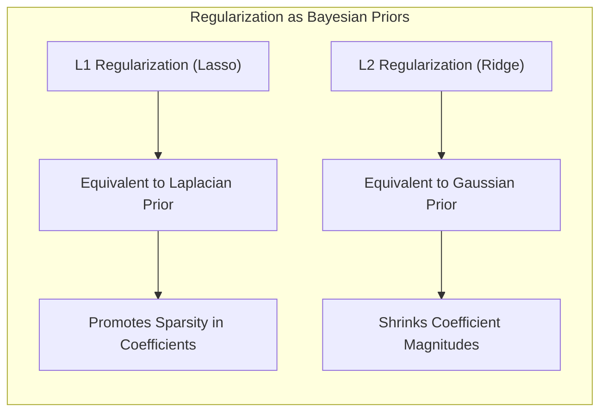
Este corolário [^7.4.5] liga as técnicas de regularização com os princípios bayesianos, mostrando como cada tipo de regularização (L1 ou L2) pode ser interpretado como a imposição de diferentes priors na inferência bayesiana. As penalidades L1 podem ser interpretadas como a imposição de um prior de Laplace nos coeficientes, enquanto as penalidades L2 podem ser interpretadas como a imposição de um prior Gaussiano. Essa conexão permite entender a regularização de uma perspectiva bayesiana, o que é útil no desenvolvimento de critérios de seleção de modelos como o MDL. $\blacksquare$

> ⚠️ **Ponto Crucial**: A regularização L1 (Lasso) pode ser vista como um tipo de seleção de variáveis, pois zera os coeficientes menos importantes. **Conforme discutido em [^7.5]**.

> 💡 **Exemplo Numérico:** Em um problema de classificação binária com regressão logística, considere os seguintes cenários:
>
> *   **Modelo 1 (Sem Regularização):** Ajusta todos os 100 coeficientes. O log-likelihood é -50. O comprimento da descrição dos parâmetros (complexidade) é 100 * 10 bits = 1000 bits. O comprimento da descrição do erro é aproximadamente 50. O comprimento total da descrição é 1000+50 = 1050.
> *   **Modelo 2 (Regularização L1 - Lasso):** A penalização L1 zera 50 coeficientes. O log-likelihood é -60. O comprimento da descrição dos parâmetros é 50 * 10 bits = 500 bits. O comprimento da descrição do erro é aproximadamente 60. O comprimento total da descrição é 500+60=560.
> *   **Modelo 3 (Regularização L2 - Ridge):** A penalização L2 reduz a magnitude de todos os 100 coeficientes, sem zerar nenhum. O log-likelihood é -55. O comprimento da descrição dos parâmetros é 100 * 10 bits = 1000 bits (os parâmetros precisam ser descritos com mais precisão devido à pequena magnitude). O comprimento da descrição do erro é aproximadamente 55. O comprimento total da descrição é 1000+55 = 1055.
>
> Neste exemplo, o Modelo 2 (Lasso) apresentou menor comprimento total da descrição, indicando que a penalização L1 conseguiu reduzir a complexidade do modelo (zerando coeficientes) sem aumentar muito o erro. O modelo 3 (Ridge) pode ser preferível se o erro de teste for menor do que o modelo 2. Este exemplo ilustra o trade-off entre complexidade e ajuste.

### Separating Hyperplanes e Perceptrons
O conceito de **hiperplanos separadores** é fundamental em classificação linear, onde o objetivo é encontrar uma fronteira linear que separe as classes. Esta fronteira é definida como um hiperplano no espaço de características. A ideia de maximizar a margem de separação entre as classes leva ao problema de otimização do **Support Vector Machine (SVM)**, que busca o hiperplano com a maior distância entre as classes mais próximas (os pontos de suporte) [^7.5.2].
The **Perceptron** is an algorithm to find a separating hyperplane which, under certain conditions, converges to a solution that linearly separates classes. The Perceptron of Rosenblatt [^7.5.1] is an iterative algorithm that adjusts the weights of a hyperplane based on misclassified examples. Under the hypothesis of linearly separable data, the Perceptron guarantees convergence to a hyperplane that separates the classes.
O MDL poderia ser usado na seleção do kernel (quando a extensão para kernels é adotada), penalizando kernels mais complexos e oferecendo um balanço adequado entre ajuste aos dados e generalização. A generalização de hiperplanos separadores a espaços não lineares envolve o uso do truque do kernel, onde os dados são mapeados em um espaço de maior dimensão, e um hiperplano é encontrado nesse espaço, correspondendo a uma fronteira não linear no espaço original.

### Pergunta Teórica Avançada: Como o MDL se relaciona com a teoria de codificação e o Teorema de Shannon?
**Resposta:**
O MDL se baseia na ideia de que o melhor modelo é aquele que permite a representação mais curta dos dados, o que se relaciona com a teoria de codificação. Segundo o Teorema de Shannon, para transmitir uma variável aleatória $z$ com distribuição de probabilidade $P(z)$, são necessários aproximadamente $-\log_2 P(z)$ bits de informação [^7.8]. No MDL, o “modelo” $M$ e os parâmetros $\theta$ são uma forma de codificar os dados. A complexidade do modelo pode ser vista como um termo de código para o próprio modelo, e o erro da predição do modelo pode ser visto como o termo de código do resíduo ou do erro. O objetivo do MDL é minimizar o tamanho total da descrição, que é a soma desses dois comprimentos, equivalente a maximizar a probabilidade posterior. Esta analogia com a teoria da informação conecta o MDL com o conceito fundamental de compressão de dados. O modelo ideal é, em essência, o melhor esquema de compressão dos dados.
A formulação do MDL, onde o comprimento total da descrição é dado por $-\log P(y|\theta,M) - \log P(\theta|M)$, coincide com a expressão para o log-posterior negativo, em que o primeiro termo é o log-likelihood, e o segundo o log-prior, demonstrando o vínculo entre o MDL e a inferência bayesiana. A equivalência entre o MDL e o BIC vem da aproximação de $-\log P(\theta|M)$, onde, sob certas condições (como uma distribuição a priori uniforme), o termo de complexidade pode ser aproximado pelo número de parâmetros, como explicitado em [^7.7].
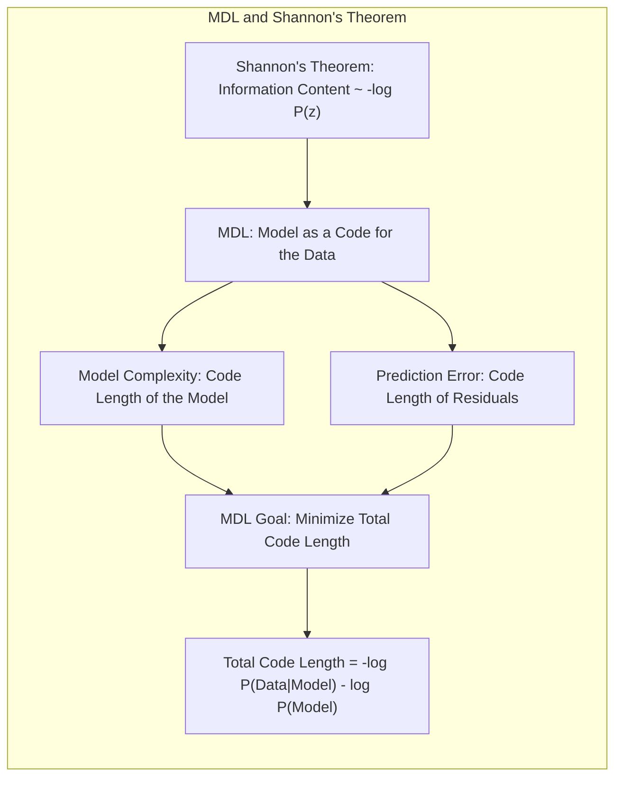

**Lemma 4:** *O comprimento da descrição de um modelo, no contexto do MDL, se relaciona com a sua complexidade, medida pelo número de parâmetros, e com a sua qualidade de ajuste, medida pelo erro.*
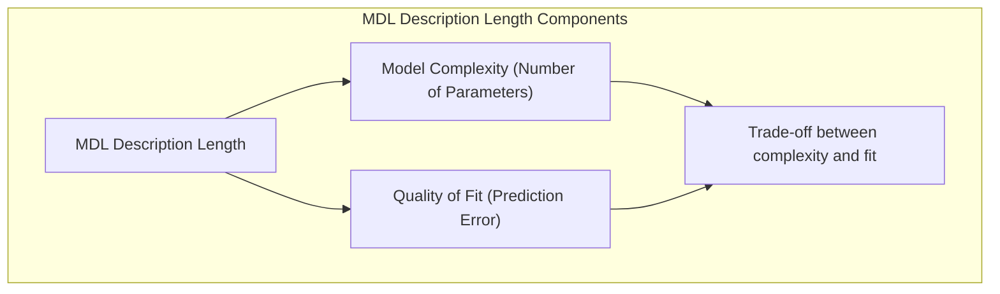
Esta conexão surge do fato de que o termo de descrição do modelo (log-prior) penaliza modelos complexos, enquanto o termo de descrição dos dados (log-likelihood) quantifica quão bem o modelo se ajusta aos dados. A demonstração do lemma envolve a análise da forma da função objetivo do MDL e a identificação das partes que correspondem à complexidade do modelo e ao erro de ajuste. O modelo que minimiza a soma dessas duas partes é o que melhor equilibra a complexidade e a precisão.
$\blacksquare$

**Corolário 4:** *O MDL pode ser interpretado como uma aplicação do Teorema de Shannon para seleção de modelos, onde a minimização do comprimento da descrição corresponde à maximização da compressão de dados.*
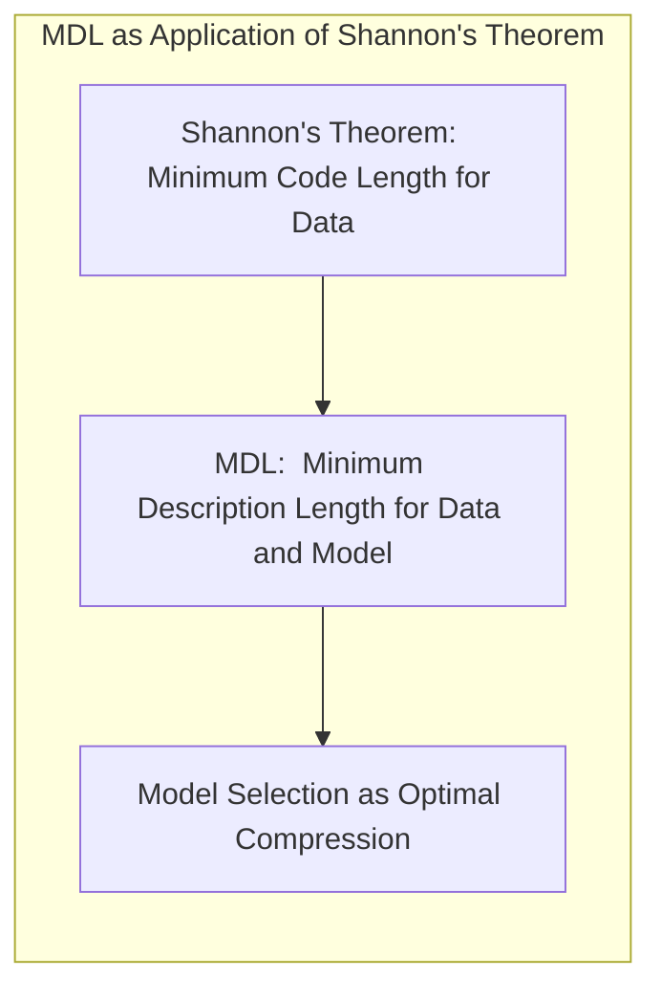
Este corolário enfatiza a interpretação do MDL como uma ferramenta para seleção de modelos baseada em compressão de dados. A demonstração do corolário envolve mostrar como o Teorema de Shannon, que diz respeito à quantidade mínima de informação necessária para representar um sinal ou uma variável aleatória, é aplicável na seleção de modelos. O MDL usa essa mesma ideia para encontrar modelos que "comprimam" os dados da forma mais eficiente possível, sem perder informação relevante.
$\blacksquare$

> ⚠️ **Ponto Crucial**: O MDL formaliza o trade-off entre viés e variância, favorecendo modelos que se ajustam bem aos dados sem serem excessivamente complexos. **Conforme discutido em [^7.3] e [^7.8]**.

### Conclusão
O princípio de Minimum Description Length (MDL) oferece uma perspectiva única e poderosa sobre a seleção de modelos. Ao enquadrar a seleção de modelos como um problema de compressão de dados, ele fornece um meio natural de equilibrar a complexidade e o ajuste do modelo, uma necessidade fundamental no aprendizado de máquina. Sua relação com o log-posterior negativo da inferência bayesiana fornece uma base teórica sólida, e a equivalência com o BIC destaca sua conexão com a teoria da informação e a estatística bayesiana. A compreensão dos conceitos abordados neste capítulo, incluindo a decomposição de viés-variância, a regularização, e o princípio do MDL, é fundamental para qualquer profissional que trabalhe com modelagem estatística e aprendizado de máquina. A comparação com outros métodos, como o AIC, a validação cruzada e o bootstrap, nos oferece um panorama abrangente dos principais métodos de avaliação e seleção de modelos.

<!-- END DOCUMENT -->
### Footnotes
[^7.1]: "The generalization performance of a learning method relates to its prediction capability on independent test data. Assessment of this performance is extremely important in practice, since it guides the choice of learning method or model, and gives us a measure of the quality of the ultimately chosen model." *(Trecho de Model Assessment and Selection)*
[^7.2]: "In this chapter we describe and illustrate the key methods for performance assessment, and show how they are used to select models. We begin the chapter with a discussion of the interplay between bias, variance and model complexity." *(Trecho de Model Assessment and Selection)*
[^7.3]:  "As in Chapter 2, if we assume that Y = f(X) + ε where E(ε) = 0 and Var(ε) = σε, we can derive an expression for the expected prediction error of a regression fit f(X) at an input point X = x0, using squared-error loss: ... Irreducible Error + Bias² + Variance." *(Trecho de Model Assessment and Selection)*
[^7.4.4]: "Typically we model the probabilities pk(X) = Pr(G = k|X) (or some monotone transformations fr(X)), and then Ĝ(X) = arg maxk Îk(X)... The log-likelihood can be used as a loss-function for general response densities...". *(Trecho de Model Assessment and Selection)*
[^7.5]: "The methods in this chapter are designed for situations where there is insufficient data to split it into three parts... In this chapter we describe a number of methods for estimating the expected test error for a model." *(Trecho de Model Assessment and Selection)*
[^7.5.1]: "For linear models fit by ordinary least squares, the estimation bias is zero. For restricted fits, such as ridge regression, it is positive, and we trade it off with the benefits of a reduced variance... The methods of this chapter approximate the validation step either analytically (AIC, BIC, MDL, SRM)..." *(Trecho de Model Assessment and Selection)*
[^7.5.2]: "If we are in a data-rich situation, the best approach for both problems is to randomly divide the dataset into three parts: a training set, a validation set, and a test set." *(Trecho de Model Assessment and Selection)*
[^7.7]: "The Bayesian information criterion (BIC), like AIC, is applicable in settings where the fitting is carried out by maximization of a log-likelihood. The generic form of BIC is BIC = -2loglik + (log N)d." *(Trecho de Model Assessment and Selection)*
[^7.