## Vapnik-Chervonenkis (VC) Theory: A Deep Dive into Model Complexity
<imagem: Mapa mental complexo mostrando a interconexão entre VC Dimension, Structural Risk Minimization, Generalização, Limites de Erro e sua aplicação em diversos modelos de aprendizado de máquina>

### Introdução

A **Vapnik-Chervonenkis (VC) theory** oferece um arcabouço teórico robusto para entender a capacidade de generalização de modelos de aprendizado de máquina, [^7.9]. Ao contrário de outras medidas de complexidade, como o número de parâmetros, a VC theory foca na capacidade de um modelo de "shatter" pontos de dados, proporcionando uma visão mais profunda sobre a flexibilidade e o risco de overfitting. Este capítulo explora os conceitos centrais da VC theory, como a VC dimension, o princípio da Structural Risk Minimization (SRM), e as implicações práticas para a seleção de modelos. A complexidade de modelos, [^7.1] desempenha um papel crucial na sua capacidade de generalizar, e esta teoria busca formalizar essa relação. Ao entender como as funções se comportam perante diferentes pontos, a VC theory provê limites teóricos para o erro de generalização, guiando o desenvolvimento de métodos de aprendizado mais robustos e eficazes.

### Conceitos Fundamentais

**Conceito 1: Shattering e VC Dimension**

O conceito de **shattering** é fundamental na VC theory [^7.9]. Dizemos que um conjunto de funções $\mathcal{F}$ *shatters* um conjunto de pontos $S = \{x_1, x_2, \ldots, x_n\}$ se, para qualquer atribuição binária de rótulos a esses pontos, existe uma função $f \in \mathcal{F}$ que classifica corretamente todos os pontos. Ou seja, se para todo conjunto de etiquetas $y_i \in \{0,1\}$, existe $f \in \mathcal{F}$ tal que $f(x_i) = y_i$, $\forall i = 1, \ldots, n$.
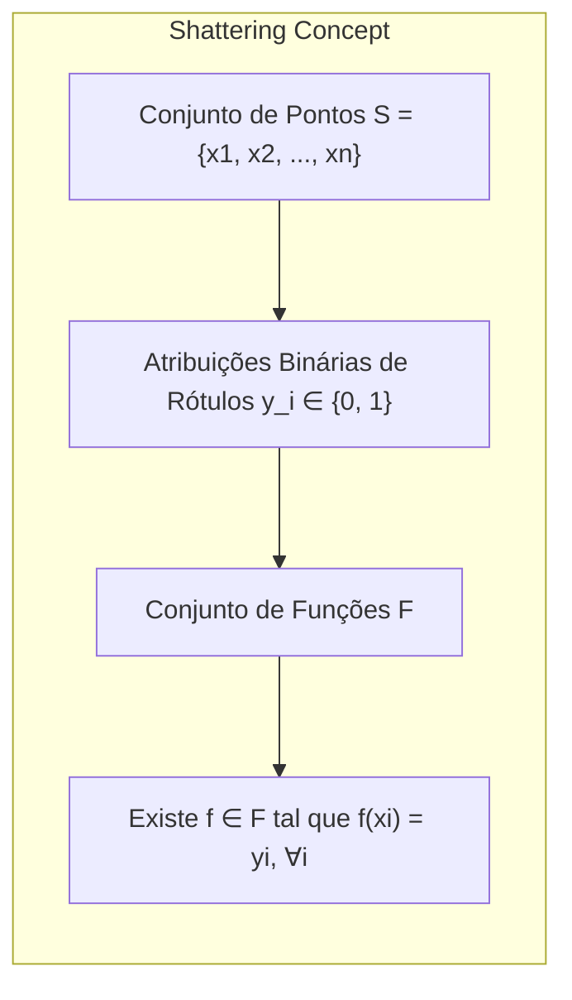
A **VC dimension** de um conjunto de funções $\mathcal{F}$, denotada como $h$, é o tamanho máximo de um conjunto de pontos que $\mathcal{F}$ pode *shatter*. Em termos formais:

$$h = \max\{n : \exists S \text{ tal que } |S| = n \text{ e } \mathcal{F} \text{ shatters } S \}$$

*Se não há limite para o tamanho do conjunto de pontos que $\mathcal{F}$ pode shatter, a VC dimension é considerada infinita*, [^7.9]. Por exemplo, um conjunto de funções lineares em um espaço bidimensional pode shatter três pontos, mas não quatro, portanto, sua VC dimension é 3.

> 💡 **Exemplo Numérico:**
> Considere um espaço bidimensional e um conjunto de funções lineares (retas). Podemos ter três pontos não colineares. Para qualquer atribuição de rótulos binários (+/-) a esses três pontos, sempre podemos encontrar uma reta que os separe corretamente. No entanto, com quatro pontos, existe pelo menos uma configuração onde nenhuma reta pode separá-los corretamente para todas as possíveis atribuições binárias. Isso ilustra que a VC dimension para retas em um espaço bidimensional é 3.
>
> ```mermaid
> graph LR
>     A[Ponto 1(+)] -- Reta 1 --> B[Ponto 2(-)]
>     B -- Reta 1 --> C[Ponto 3(+)]
>
>     D[Ponto 1(+)] -- Reta 2 --> E[Ponto 2(+)]
>     E -- Reta 2 --> F[Ponto 3(-)]
>
>     G[Ponto 1(-)] -- Reta 3 --> H[Ponto 2(+)]
>     H -- Reta 3 --> I[Ponto 3(-)]
>
>     J[Ponto 1(-)] -- Reta 4 --> K[Ponto 2(-)]
>     K -- Reta 4 --> L[Ponto 3(+)]
>
>    M[Ponto 1(+)] -- Não Separável --> N[Ponto 2(-)]
>    N -- Não Separável --> O[Ponto 3(+)]
>    O -- Não Separável --> P[Ponto 4(-)]
>
>     style A fill:#ccf,stroke:#333,stroke-width:2px
>     style B fill:#fcc,stroke:#333,stroke-width:2px
>     style C fill:#ccf,stroke:#333,stroke-width:2px
>
>     style D fill:#ccf,stroke:#333,stroke-width:2px
>     style E fill:#ccf,stroke:#333,stroke-width:2px
>     style F fill:#fcc,stroke:#333,stroke-width:2px
>
>     style G fill:#fcc,stroke:#333,stroke-width:2px
>     style H fill:#ccf,stroke:#333,stroke-width:2px
>     style I fill:#fcc,stroke:#333,stroke-width:2px
>
>     style J fill:#fcc,stroke:#333,stroke-width:2px
>     style K fill:#fcc,stroke:#333,stroke-width:2px
>     style L fill:#ccf,stroke:#333,stroke-width:2px
>
>     style M fill:#ccf,stroke:#333,stroke-width:2px
>     style N fill:#fcc,stroke:#333,stroke-width:2px
>     style O fill:#ccf,stroke:#333,stroke-width:2px
>     style P fill:#fcc,stroke:#333,stroke-width:2px
> ```
> Este diagrama mostra como três pontos podem ser separados por retas de diversas formas, mas quatro pontos podem não ser separáveis dependendo da sua disposição.

**Lemma 1:** A VC dimension de um conjunto de funções lineares em $p$ dimensões é $p+1$.

**Prova:** Em $p$ dimensões, um hiperplano linear é definido por $p+1$ parâmetros. Para shatter um conjunto de $p+1$ pontos, cada ponto deve ser separado por um hiperplano adequado. Adicionar um ponto extra torna essa separação impossível com um hiperplano linear, portanto a VC dimension é $p+1$. $\blacksquare$
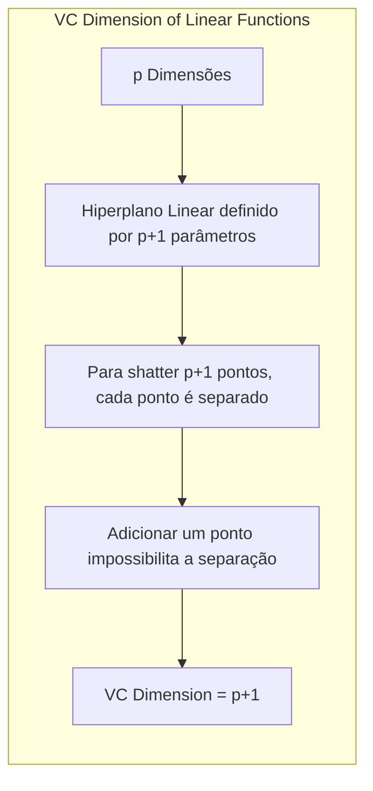

**Conceito 2: Structural Risk Minimization (SRM)**

O princípio da **Structural Risk Minimization (SRM)**, proposto por Vapnik, é um método para seleção de modelos que visa minimizar um limite superior no erro de generalização, em vez de apenas minimizar o erro no conjunto de treinamento, [^7.9]. Este princípio parte da ideia de que, ao escolher um modelo com a complexidade adequada (controlada pela VC dimension), podemos alcançar uma melhor generalização para dados não vistos.

A ideia central do SRM é que, ao invés de apenas buscar um modelo que minimize o erro nos dados de treinamento (o **empirical risk**), devemos também considerar a complexidade do modelo. O SRM propõe a escolha de um modelo que minimize o **structural risk**, que é uma combinação do empirical risk e da complexidade do modelo, medida pela VC dimension.

**Corolário 1:** A função que expressa o *structural risk* pode ser dada por:

$$R_{struct}(f) = R_{emp}(f) + \Omega(h)$$

Onde $R_{emp}(f)$ é o erro empírico (medido no conjunto de treinamento) e $\Omega(h)$ é uma função que aumenta com a complexidade ($h$). A VC dimension é a métrica de complexidade preferida nesta formulação.
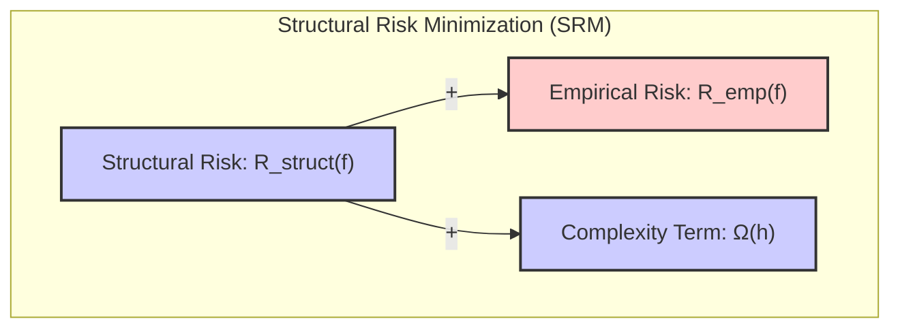

> 💡 **Exemplo Numérico:**
> Suponha que temos dois modelos: um modelo linear com $h=2$ (VC dimension 2) e um modelo polinomial de grau 3 com $h=4$ (VC dimension 4).
>
> Modelo Linear: $R_{emp}(f_{linear}) = 0.1$, e $\Omega(h) = 0.02 * h = 0.04$. Portanto, $R_{struct}(f_{linear}) = 0.1 + 0.04 = 0.14$
>
> Modelo Polinomial: $R_{emp}(f_{polinomial}) = 0.05$, e $\Omega(h) = 0.02 * h = 0.08$. Portanto, $R_{struct}(f_{polinomial}) = 0.05 + 0.08 = 0.13$
>
> Neste exemplo, apesar do modelo polinomial ter um erro empírico menor, o modelo linear tem um structural risk maior, indicando uma possível tendência a melhor generalização. A escolha ideal dependerá da magnitude do termo de complexidade e o trade-off que queremos estabelecer.

**Conceito 3: Limites no Erro de Generalização**

A VC theory fornece limites para o erro de generalização, ou seja, o erro que o modelo cometerá em dados não vistos. Esses limites dependem da VC dimension do modelo e do tamanho do conjunto de treinamento. Um desses limites, derivado a partir da VC theory [^7.9], pode ser expresso por:

$$Err_{test} \leq Err_{train} + \sqrt{\frac{h(\log(2N/h)+1) - \log(\eta/4)}{N}}$$

onde:
*   $Err_{test}$ é o erro de generalização esperado
*   $Err_{train}$ é o erro de treinamento
*   $h$ é a VC dimension do modelo
*   $N$ é o tamanho do conjunto de treinamento
*   $\eta$ é uma probabilidade de falha (geralmente um valor pequeno como 0.05)

Este limite mostra que o erro de generalização é limitado pela soma do erro no conjunto de treinamento e um termo de penalização que aumenta com a VC dimension e diminui com o tamanho do conjunto de treinamento. Isso ilustra o *trade-off* fundamental entre bias e variance [^7.2] na seleção de modelos: modelos com alta complexidade (alta VC dimension) podem reduzir o erro de treinamento, mas aumentam o risco de overfitting (e piora na generalização).
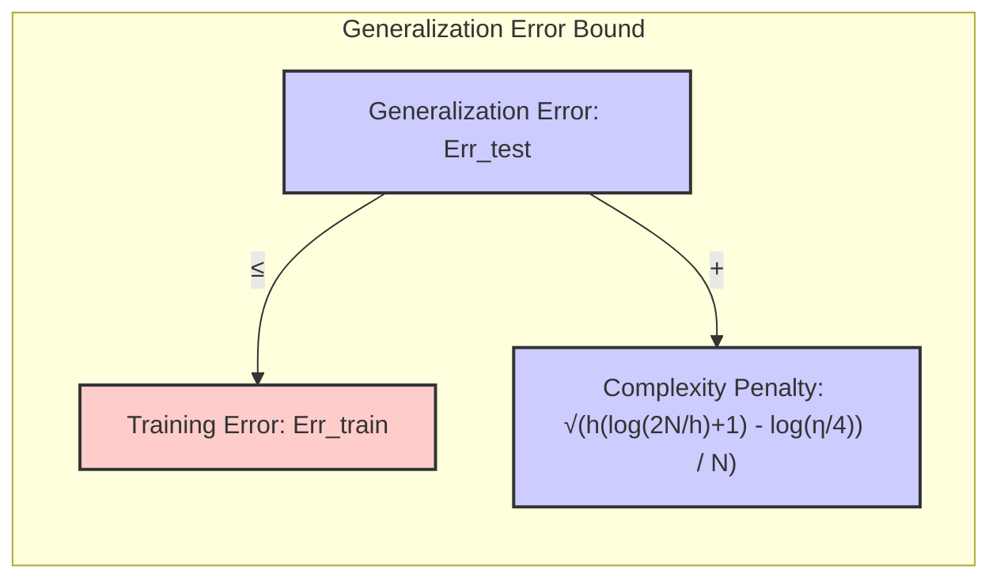

> 💡 **Exemplo Numérico:**
> Vamos calcular o limite de erro de generalização para um modelo com VC dimension ($h$) de 5, um erro de treinamento ($Err_{train}$) de 0.1, um tamanho de conjunto de treinamento ($N$) de 100 e uma probabilidade de falha ($\eta$) de 0.05.
>
> $$Err_{test} \leq 0.1 + \sqrt{\frac{5(\log(2*100/5)+1) - \log(0.05/4)}{100}}$$
>
> $$Err_{test} \leq 0.1 + \sqrt{\frac{5(\log(40)+1) - \log(0.0125)}{100}}$$
>
> $$Err_{test} \leq 0.1 + \sqrt{\frac{5(3.6888) - (-4.382)}{100}}$$
>
> $$Err_{test} \leq 0.1 + \sqrt{\frac{18.444 + 4.382}{100}}$$
>
> $$Err_{test} \leq 0.1 + \sqrt{\frac{22.826}{100}}$$
>
> $$Err_{test} \leq 0.1 + \sqrt{0.22826}$$
>
> $$Err_{test} \leq 0.1 + 0.47776$$
>
> $$Err_{test} \leq 0.57776$$
>
> Assim, o limite superior para o erro de generalização é aproximadamente 0.578. Agora, se aumentarmos o conjunto de treino para 1000:
>
> $$Err_{test} \leq 0.1 + \sqrt{\frac{5(\log(2*1000/5)+1) - \log(0.05/4)}{1000}}$$
>
> $$Err_{test} \leq 0.1 + \sqrt{\frac{5(\log(400)+1) - \log(0.0125)}{1000}}$$
>
> $$Err_{test} \leq 0.1 + \sqrt{\frac{5(6.907) - (-4.382)}{1000}}$$
>
> $$Err_{test} \leq 0.1 + \sqrt{\frac{34.535 + 4.382}{1000}}$$
>
> $$Err_{test} \leq 0.1 + \sqrt{\frac{38.917}{1000}}$$
>
> $$Err_{test} \leq 0.1 + \sqrt{0.0389}$$
>
> $$Err_{test} \leq 0.1 + 0.1972$$
>
> $$Err_{test} \leq 0.2972$$
>
> O limite de erro de generalização diminui para 0.297. Este exemplo demonstra como aumentar o tamanho do conjunto de treinamento reduz o limite superior do erro de generalização.

> ⚠️ **Nota Importante:** Os limites fornecidos pela VC theory são, em geral, *pessimistas*. Na prática, modelos costumam apresentar melhor generalização do que os limites teóricos sugerem [^7.9]. Mesmo assim, esses limites são úteis para entender o comportamento geral dos modelos e a relação entre sua complexidade e capacidade de generalização.

> ❗ **Ponto de Atenção:** A VC theory se aplica especialmente a problemas de *classificação binária*. Entretanto, os conceitos podem ser estendidos a outros tipos de problemas, utilizando indicadores (como visto em [^7.2]).

> ✔️ **Destaque:** A VC dimension não é uma propriedade do algoritmo em si, mas sim do *conjunto de funções* que o algoritmo pode produzir. Isso significa que dois algoritmos diferentes, que produzem conjuntos de funções com a mesma VC dimension, terão comportamentos semelhantes em termos de generalização.

### Aplicações da VC Theory em Classificação

<imagem: Diagrama detalhado mostrando o fluxo de decisão baseado em VC dimension, desde a escolha de funções de classificação até a avaliação da capacidade de generalização>

A VC theory tem aplicações significativas em diversos métodos de classificação [^7.9]. Abaixo estão algumas delas:

1.  **Seleção de Modelos:** A VC dimension pode ser utilizada para guiar a seleção de modelos, através do princípio do SRM. Ao escolher um modelo com a VC dimension apropriada para o tamanho do conjunto de treinamento, podemos obter um bom compromisso entre o ajuste aos dados de treinamento e a capacidade de generalização.
2.  **Análise de Complexidade:** A VC theory fornece uma medida formal de complexidade de um modelo, que é mais informativa do que o número de parâmetros ou outros métodos. Isso permite uma análise comparativa mais rigorosa entre diferentes modelos de classificação.
3. **Limites de Erro:** A VC theory oferece limites para o erro de generalização, permitindo uma avaliação da confiança nos resultados de um modelo em dados não vistos. É útil para modelar cenários onde a capacidade de prever cenários futuros é essencial, e onde a quantificação da incerteza é importante.
4. **Suporte a Algoritmos:** A VC Theory tem sido fundamental no desenvolvimento de algoritmos de classificação como o Support Vector Machine (SVM) [^7.9.1] que busca maximizar a margem de separação entre as classes. Este princípio pode ser visto como um caso especial de SRM.
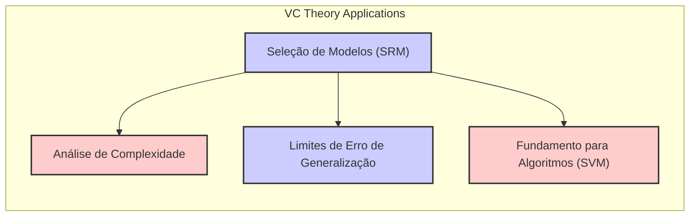

**Lemma 2:** A VC dimension de uma função indicadora linear no espaço $\mathbb{R}^d$ é $d+1$.

**Prova:** Podemos demonstrar através do teorema de Radom que $d+1$ pontos podem ser separados em todas as combinações possíveis por um hiperplano em $\mathbb{R}^d$. $\blacksquare$
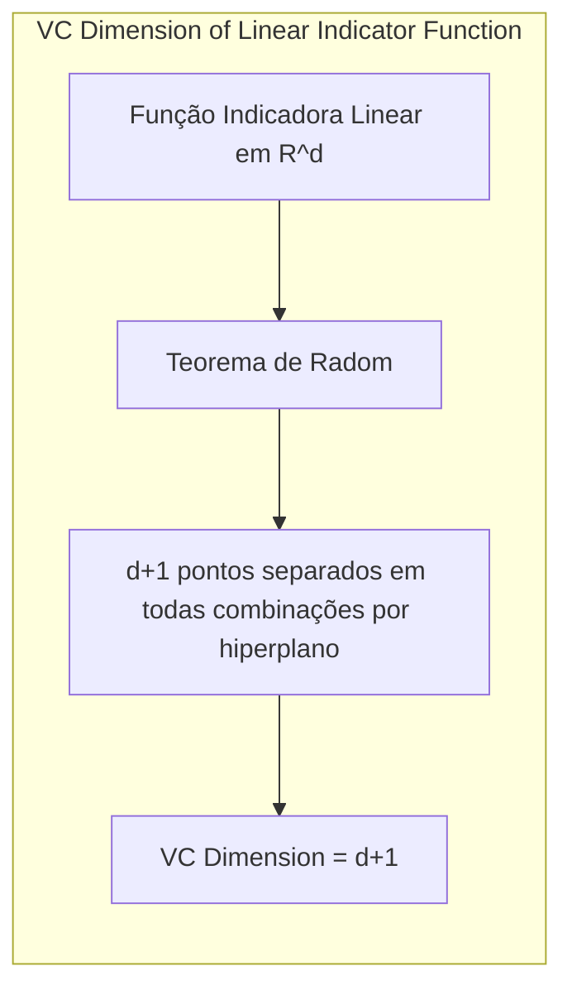

**Corolário 2:** Em um cenário de classificação binária, a generalização de um modelo linear depende da relação entre o número de atributos e o tamanho da amostra. Quanto maior o número de atributos, maior a complexidade do modelo (maior a VC dimension) e menor o número de amostras maior o risco de overfitting, como visto em [^7.2], [^7.10].

#### Exemplos Práticos

Como visto em [^7.9], a VC dimension é relevante para ilustrar como modelos como $f(x, a) = I(\sin(ax))$ podem shatter um número arbitrário de pontos, e nesse sentido, possuir VC dimension infinita. Em contraste, funções lineares possuem uma VC dimension que é limitada pelo número de parâmetros, o que pode levar a melhor generalização em amostras menores e maior estabilidade do modelo, como em [^7.2].
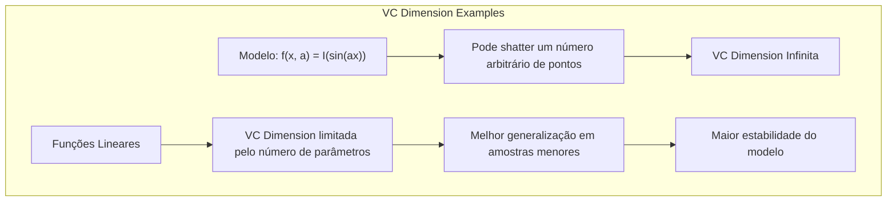

A aplicação de modelos com alta VC dimension, como redes neurais profundas, deve ser feita com cuidado. Ao utilizar técnicas de regularização, [^7.6], [^7.7], como o *weight decay*, as redes conseguem ter comportamentos que se assemelham a modelos de menor complexidade. Técnicas de regularização diminuem a flexibilidade do modelo e evitam o sobreajuste.

### Regressão Linear e Mínimos Quadrados Sob a Ótica da VC Theory

<imagem: Diagrama de Venn mostrando como o espaço de hipóteses de um modelo linear se relaciona com o conceito de VC dimension, ilustrando a diferença entre um modelo linear sem regularização e um modelo com regularização>

A regressão linear, e sua aplicação em problemas de classificação, podem ser analisados sob a perspectiva da VC theory [^7.2], [^7.3]. Em particular, o número de atributos de um modelo linear afeta diretamente sua VC dimension. Como o número de parâmetros de um modelo linear se relaciona diretamente com a sua VC dimension, modelos com muitos atributos tem maior flexibilidade para ajustar aos dados de treinamento, o que pode levar a *overfitting* quando o conjunto de dados é pequeno.

Na regressão linear com mínimos quadrados, por exemplo, o erro de treinamento é minimizado diretamente nos dados de treino, sem levar em conta a complexidade do modelo. Em modelos mais complexos, a VC theory propõe que devemos considerar tanto o erro nos dados de treino quanto a complexidade do modelo, através do princípio de Structural Risk Minimization. A regularização, [^7.6], [^7.7] presente em modelos como Ridge regression, busca controlar a complexidade e melhorar a capacidade de generalização, sendo um meio de controlar a VC dimension.

**Lemma 3:** Em um modelo de regressão linear com $p$ atributos e com ruído gaussiano aditivo, a VC dimension da classe de funções é igual ao número de atributos mais um (o intercepto).

**Prova:** Para uma regressão linear, a capacidade de separação de pontos depende diretamente da dimensão do espaço de entrada, que é $p$. Por definição da VC dimension, o número de pontos que podem ser separados linearmente é igual ao número de parâmetros necessários para definir a função, que é $p + 1$, dado a inclusão do intercepto. $\blacksquare$
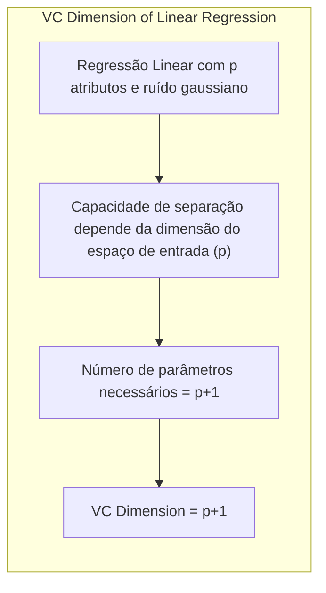

> 💡 **Exemplo Numérico:**
> Considere um modelo de regressão linear com 2 atributos (p=2):
>
> $$y = \beta_0 + \beta_1 x_1 + \beta_2 x_2 + \epsilon$$
>
> A VC dimension deste modelo é $2 + 1 = 3$. Isso significa que, no máximo, conseguimos ajustar perfeitamente três pontos no espaço de entrada. Cada ponto adicional aumenta a complexidade do modelo e, sem regularização, o modelo pode se ajustar perfeitamente aos dados de treinamento, levando a overfitting.
>
> Para visualizar, imagine um plano 3D. Três pontos não colineares definem um único plano. Um quarto ponto pode não estar nesse mesmo plano, e o modelo pode ter dificuldades em se ajustar a esses 4 pontos.
>
> Se adicionarmos mais atributos, a VC dimension do modelo aumenta, e o modelo terá ainda mais flexibilidade.

**Corolário 3:** A penalização imposta pela regularização, como no Ridge Regression, limita a capacidade do modelo de se ajustar perfeitamente aos dados, diminuindo sua VC dimension efetiva. O resultado é um modelo mais estável que não sofre de overfitting.

### Métodos de Seleção de Variáveis e Regularização na VC Theory

A seleção de variáveis e a regularização podem ser vistas como técnicas para controlar a complexidade de um modelo de classificação [^7.5], [^7.7]. Na perspectiva da VC theory, essas técnicas buscam reduzir a VC dimension efetiva de um modelo, o que pode melhorar sua capacidade de generalização.

Ao selecionar um subconjunto de variáveis, estamos efetivamente reduzindo a dimensão do espaço de entrada e, consequentemente, a VC dimension do modelo. Da mesma forma, as técnicas de regularização introduzem uma penalização na função objetivo, o que limita a flexibilidade do modelo e reduz sua capacidade de shatter pontos de dados. A penalização L1, [^7.5], por exemplo, promove a esparsidade e consequentemente pode reduzir a complexidade do modelo.
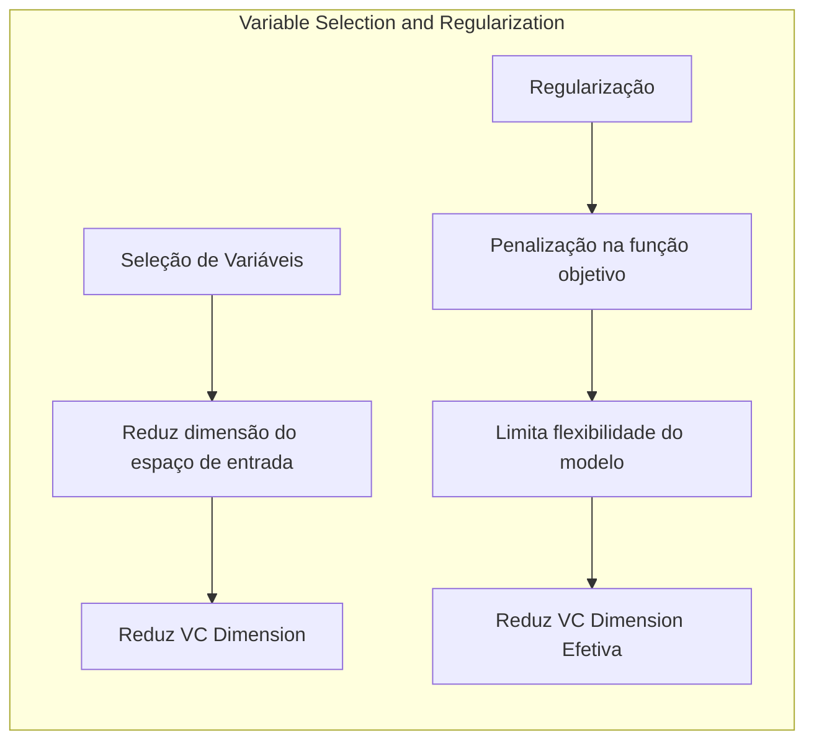

> 💡 **Exemplo Numérico:**
> Considere um modelo de regressão linear com 5 atributos:
> $$y = \beta_0 + \beta_1 x_1 + \beta_2 x_2 + \beta_3 x_3 + \beta_4 x_4 + \beta_5 x_5$$
> A VC dimension é 6.
>
> **Seleção de Variáveis:** Se, através de algum método de seleção de variáveis, escolhermos apenas $x_1$ e $x_3$, o modelo resultante seria:
> $$y = \beta_0 + \beta_1 x_1 + \beta_3 x_3$$
> A VC dimension deste novo modelo é 3, o que demonstra uma redução da complexidade, com um modelo mais simples.
>
> **Regularização L1 (Lasso):** Ao aplicar regularização L1, podemos forçar alguns dos coeficientes a serem exatamente zero:
>
> $$ \text{Minimize} \quad \sum_{i=1}^n (y_i - \hat{y}_i)^2 + \lambda \sum_{j=1}^5 |\beta_j| $$
>
>  Suponha que após a regularização L1, $\beta_2$ e $\beta_4$ se tornem zero. O modelo resultante é:
>  $$y = \beta_0 + \beta_1 x_1 + \beta_3 x_3 + \beta_5 x_5$$
>
>  Efetivamente, a penalização L1 fez uma seleção automática de atributos (similar ao caso anterior), reduzindo a VC dimension efetiva do modelo. O parâmetro $\lambda$ controla o quanto queremos penalizar coeficientes altos.

**Lemma 4:** A penalização L1 em um modelo linear induz a um número menor de coeficientes diferentes de zero, o que efetivamente reduz a complexidade do modelo, e sua VC dimension efetiva.

**Prova:** Ao adicionar a penalização L1 à função de custo, a otimização do modelo leva a zerar coeficientes menos relevantes para a função de decisão, ou seja, cria-se um modelo mais simples. O efeito é similar a uma redução da dimensão do espaço de atributos, e por definição, uma redução da VC dimension. $\blacksquare$
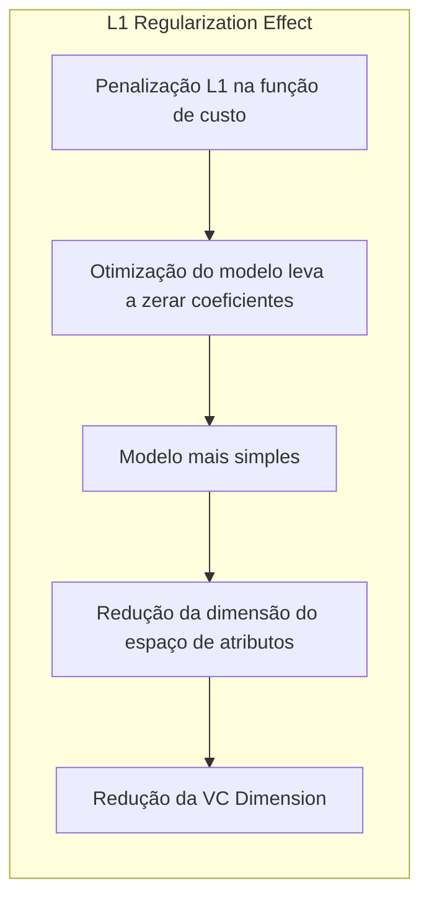

**Corolário 4:** Uma abordagem baseada na VC theory seria selecionar os modelos que minimizam um critério que penaliza tanto o erro de treinamento quanto a complexidade, como o princípio do Structural Risk Minimization.

> ⚠️ **Ponto Crucial**: A escolha do parâmetro de regularização é essencial e pode ser feita através de métodos como cross-validation [^7.10]. O valor ótimo do parâmetro de regularização deve balancear a complexidade do modelo e seu ajuste aos dados de treinamento.

### Separating Hyperplanes e VC Dimension

<imagem: Ilustração detalhada de hiperplanos separadores em diferentes dimensões, mostrando a relação entre a capacidade de separação e a VC dimension em classificadores lineares>

A ideia de **separating hyperplanes** está intimamente ligada à VC theory [^7.5.2]. Em um problema de classificação binária, um *separating hyperplane* é uma fronteira linear que separa as classes em um espaço de atributos. A capacidade de um classificador linear para separar dados está diretamente relacionada à sua VC dimension. Em [^7.9] é introduzida a ideia de que um classificador linear em $\mathbb{R}^p$ possui uma VC dimension de $p+1$, o que nos dá uma intuição clara de como a complexidade de um classificador linear se comporta.
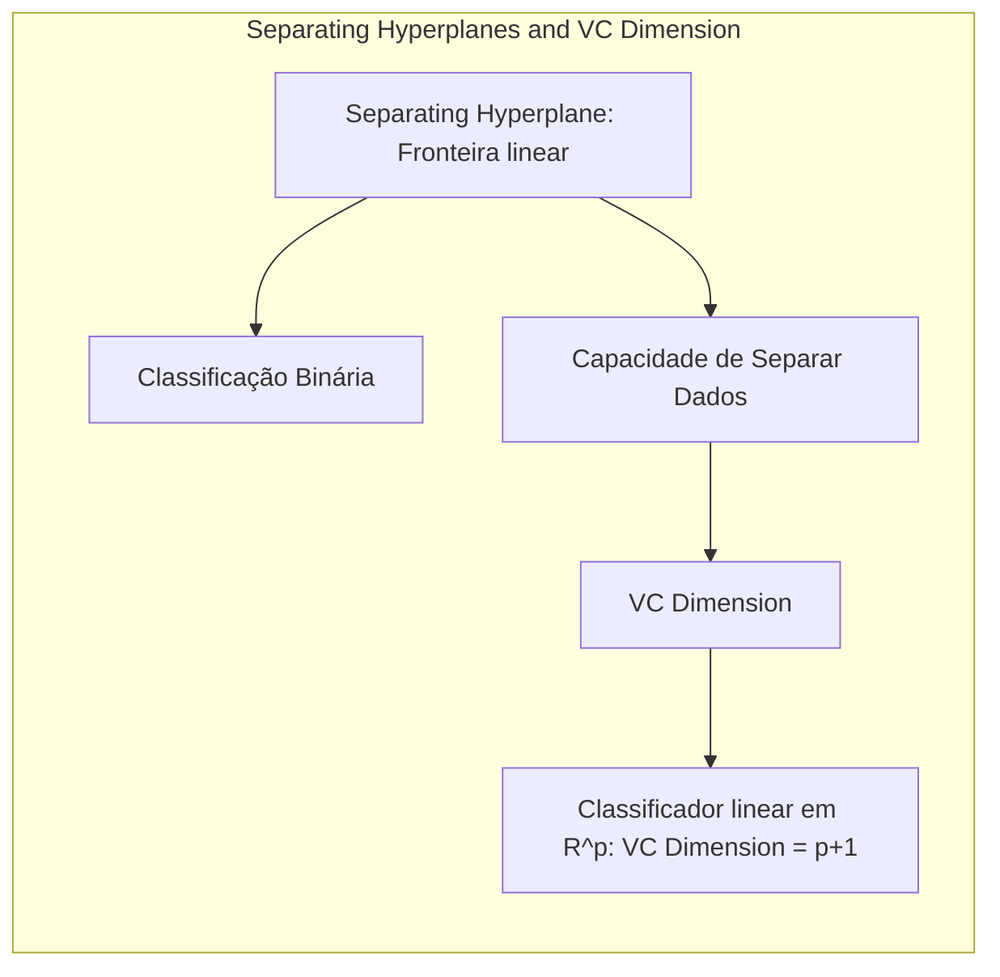

A formulação do problema de otimização dos *separating hyperplanes* através da maximização da margem de separação é diretamente influenciada por conceitos da VC theory. A margem, definida como a distância entre o hiperplano e os pontos mais próximos de cada classe, tem um papel crucial na minimização do erro de generalização. Ao maximizar a margem, o classificador busca um hiperplano que seja o mais "robusto" possível, minimizando o impacto de variações nos dados de treinamento.

A solução do problema de otimização dos *separating hyperplanes* pode ser descrita em termos dos pontos de suporte (support vectors), que são os pontos de dados mais próximos do hiperplano. Esses pontos desempenham um papel crucial na definição do hiperplano, e demonstram a relação da solução de problemas de classificação linear com conceitos como VC dimension e generalização.

### Pergunta Teórica Avançada

**Pergunta:** Quais as implicações da VC dimension infinita em um modelo para sua capacidade de generalização, e como isso se relaciona com os limites de erro apresentados na teoria?

**Resposta:**
Um modelo com VC dimension infinita significa que ele tem a capacidade de *shatter* qualquer conjunto de pontos, o que implica que o modelo pode se adaptar perfeitamente aos dados de treinamento [^7.9]. No entanto, como visto nos limites de erro de generalização, a capacidade de ajuste aos dados de treinamento não garante uma boa generalização. Em modelos com VC dimension infinita (como em certas famílias de redes neurais sem regularização), o erro de treinamento pode ser zero, mas o erro de generalização pode ser alto.
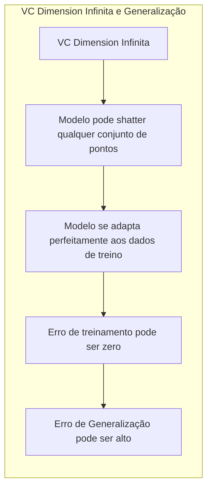

Os limites de erro, [^7.9], indicam que o erro de generalização é limitado pela soma do erro de treinamento e um termo de penalização relacionado à complexidade do modelo. Para um modelo com VC dimension infinita, esse termo de penalização também é infinito, o que significa que não há limite superior para o erro de generalização. Isso implica que, embora o modelo possa ter um bom ajuste aos dados de treinamento, ele não oferece garantias teóricas de que terá bom desempenho em dados não vistos.

O uso da regularização é essencial nesses casos. Ao restringir a capacidade do modelo de se adaptar aos dados de treinamento, o modelo passa a se comportar como se tivesse uma VC dimension efetiva menor (embora sua VC dimension intrínseca seja infinita). As técnicas de regularização promovem uma forma de controle de complexidade que auxilia na redução do risco de overfitting e melhora a capacidade de generalização, [^7.7].

> 💡 **Exemplo Numérico:**
> Uma rede neural profunda com muitas camadas e neurônios pode ter uma VC dimension muito alta, ou mesmo infinita, especialmente sem regularização. Se a rede conseguir ajustar perfeitamente os dados de treinamento (erro de treinamento zero), ela terá alta flexibilidade para mapear as entradas de treinamento para os rótulos, inclusive memorizando ruídos ou padrões irrelevantes nos dados de treino. No entanto, essa complexidade não garante que ela generalizará bem para dados não vistos, o que significa que o erro de generalização pode ser alto. A regularização, como o *dropout* ou *weight decay*, força a rede a aprender padrões mais gerais e a reduzir sua complexidade efetiva, melhorando a generalização.

**Lemma 5:** A regularização é uma técnica essencial para controlar o risco de overfitting, especialmente em modelos com alta VC dimension.

**Prova:** Como visto nos limites de erro da VC theory, a complexidade do modelo influencia diretamente o erro de generalização. A regularização atua como uma restrição, limitando a flexibilidade do modelo e, por consequência, reduzindo a sua VC dimension efetiva. $\blacksquare$
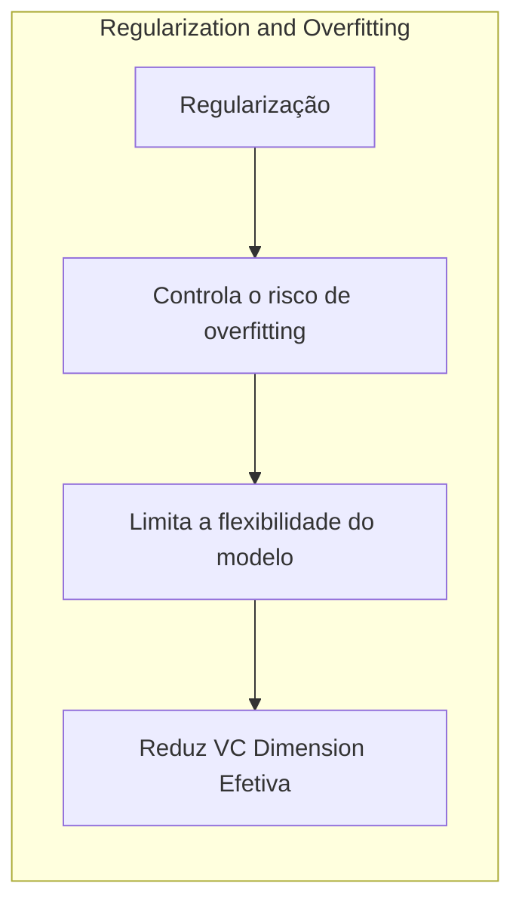

**Corolário 5:** Modelos com alta VC dimension requerem amostras de treinamento maiores para compensar o risco de overfitting. Ou, alternativamente, precisam de técnicas que restrinjam sua capacidade de ajuste.

> ⚠️ **Ponto Crucial:** A VC theory é um arcabouço teórico fundamental para entender a capacidade de generalização de modelos de aprendizado de máquina, e seus conceitos tem aplicações diretas no desenvolvimento de modelos mais robustos e eficazes.

### Conclusão

A Vapnik-Chervonenkis (VC) theory fornece um conjunto de ferramentas teóricas para entender a complexidade de modelos e sua capacidade de generalização, [^7.9]. Ao definir conceitos como *shattering* e VC dimension, a teoria oferece métricas para medir formalmente a complexidade de um modelo, e permite estimar limites teóricos para o erro de generalização, [^7.9].

A VC theory, juntamente com o princípio de Structural Risk Minimization (SRM), guia a escolha de modelos com base em um equilíbrio entre o ajuste aos dados de treinamento e a complexidade do modelo. Ao entender a