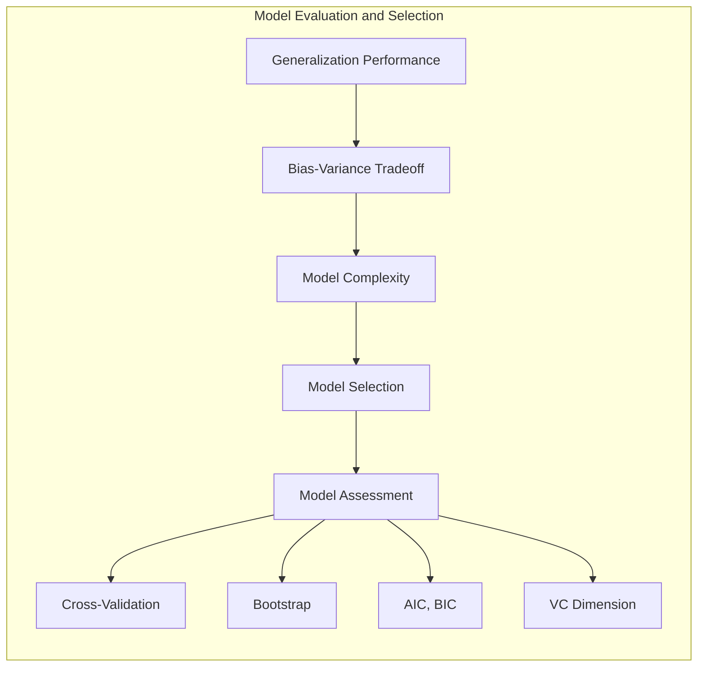
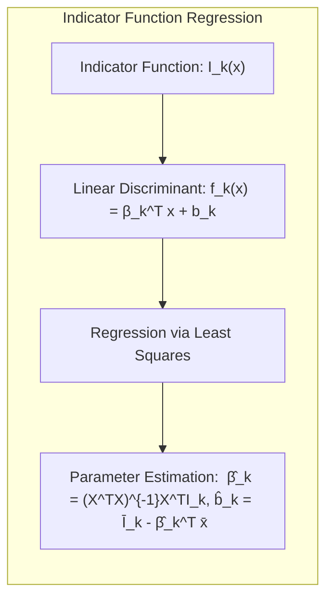
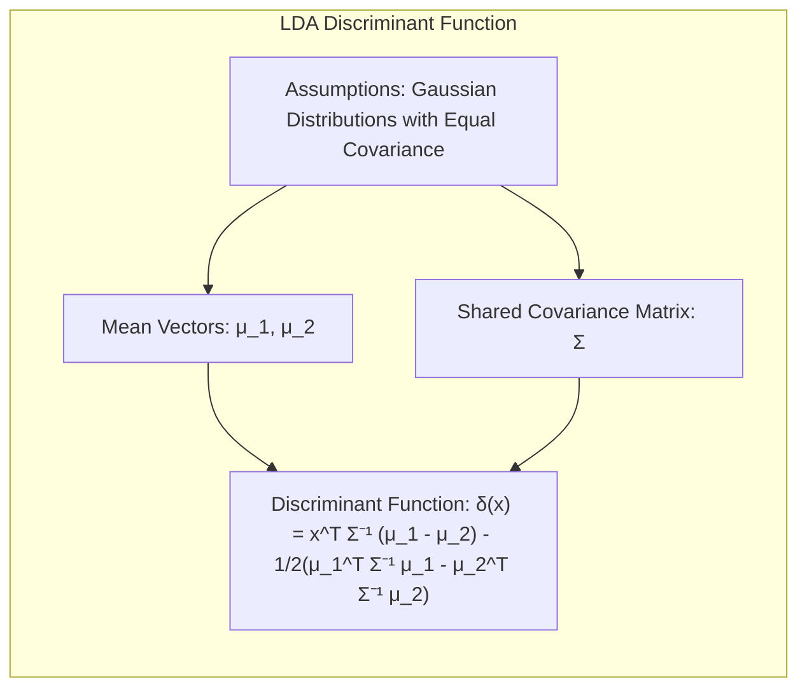
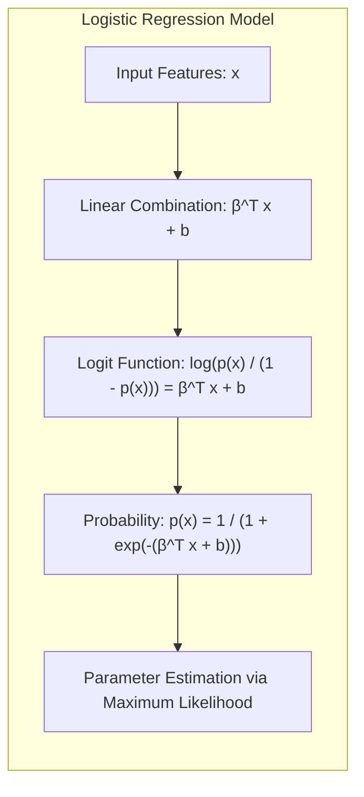
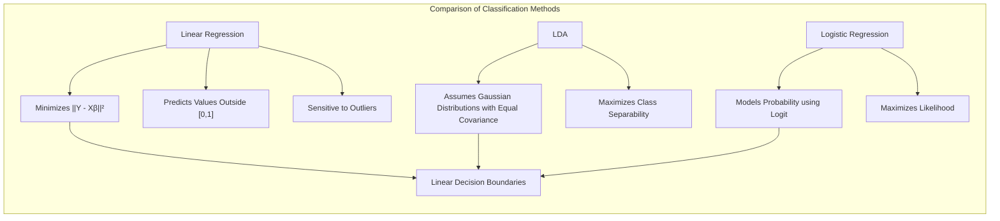
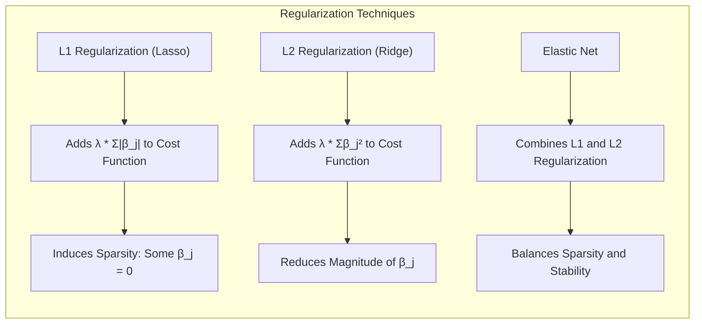
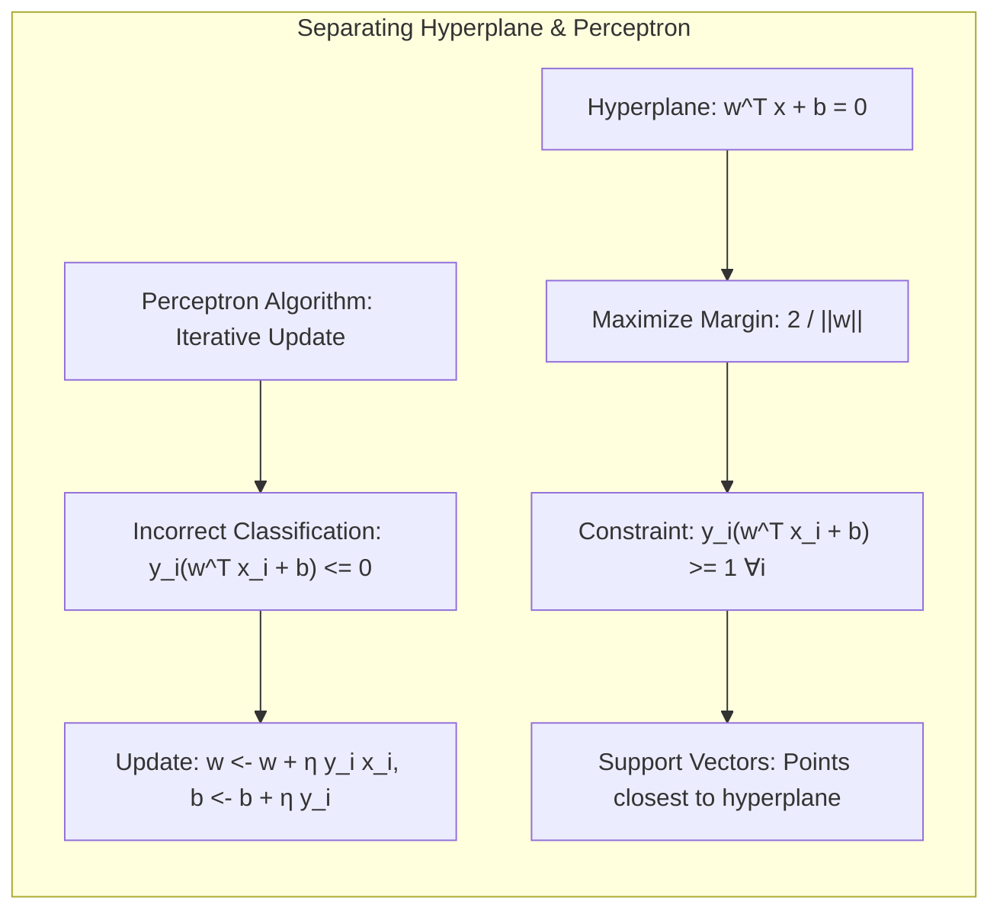
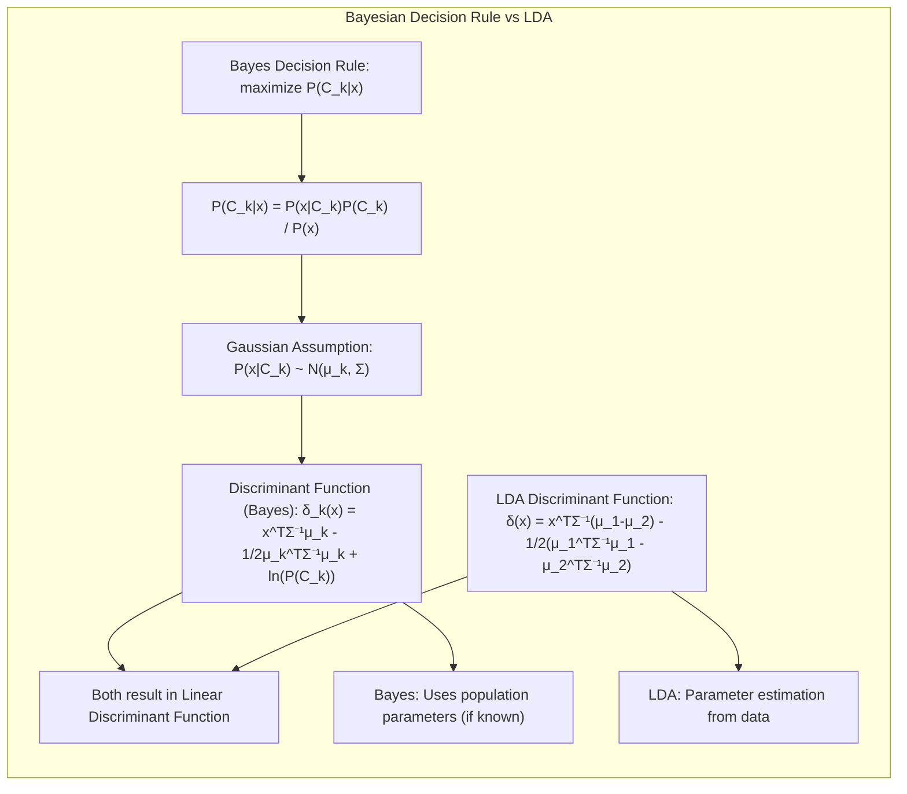

## Avaliação e Seleção de Modelos com Foco em Funções Indicadoras



### Introdução

A avaliação do desempenho de generalização de um método de aprendizado é fundamental para sua aplicação prática. A capacidade de um modelo de prever resultados em dados não vistos (independentes do conjunto de treinamento) é crucial. Este capítulo se dedica a apresentar os principais métodos para avaliar esse desempenho e como esses métodos auxiliam na seleção dos modelos mais apropriados [^7.1]. Iniciamos discutindo a relação entre viés (*bias*), variância e complexidade do modelo, elementos essenciais para a compreensão dos desafios na construção de modelos eficazes [^7.1].

### Conceitos Fundamentais

**Conceito 1:** O **problema de classificação** reside em atribuir uma classe (ou categoria) a uma observação, com base em um conjunto de atributos (ou *features*). Em sua forma mais básica, é possível usar funções indicadoras para representar cada classe, onde cada função indicadora associa o valor 1 à classe correspondente e 0 às demais. O uso de métodos lineares em classificação, como *Linear Discriminant Analysis (LDA)* e *Logistic Regression*, busca construir uma fronteira de decisão linear no espaço de atributos. No entanto, o uso de métodos lineares pode levar a um *tradeoff* entre viés e variância. Modelos lineares simples podem ter alto viés (falta de capacidade para modelar relações complexas), enquanto modelos mais complexos podem apresentar alta variância (sensibilidade excessiva ao conjunto de treinamento) [^7.2].

> 💡 **Exemplo Numérico:** Considere um problema de classificação com duas classes, onde a fronteira de decisão verdadeira é uma curva. Um modelo linear simples (como uma linha reta) terá um viés alto, pois não consegue capturar a complexidade da fronteira. Por outro lado, um modelo polinomial de alta ordem (muito flexível) pode se ajustar perfeitamente aos dados de treinamento, mas cometer erros em novos dados (alta variância).

**Lemma 1:** Considere um problema de classificação com $K$ classes, onde cada classe é representada por uma função indicadora $I_k(x)$, que assume o valor 1 se $x$ pertence à classe $k$ e 0 caso contrário. Uma função discriminante linear pode ser expressa como $f_k(x) = \beta_k^T x + b_k$, onde $\beta_k$ é o vetor de parâmetros e $b_k$ é o intercepto. A decisão de classe é dada por $argmax_k f_k(x)$. A regressão linear de uma matriz indicadora busca ajustar cada função discriminante através de mínimos quadrados, minimizando o erro quadrático entre as funções indicadoras e seus valores previstos. Este procedimento produz uma solução para os parâmetros $\beta_k$ e $b_k$, criando uma aproximação linear da função indicadora [^7.2].



$$ \hat{\beta}_k = (X^TX)^{-1}X^TI_k $$
$$ \hat{b}_k = \bar{I}_k - \hat{\beta}_k^T \bar{x} $$
Onde $X$ é a matriz de atributos, $I_k$ é o vetor indicador da classe $k$, $\bar{x}$ é a média dos atributos e $\bar{I}_k$ é a média dos valores do indicador.

> 💡 **Exemplo Numérico:** Suponha que temos um dataset com 5 observações e 2 classes, com os seguintes dados:
> ```python
> import numpy as np
>
> X = np.array([[1, 2], [1.5, 1.8], [5, 8], [8, 8], [1, 0.6]])
> I1 = np.array([1, 1, 0, 0, 1]) # Indicador para a classe 1
> I2 = np.array([0, 0, 1, 1, 0]) # Indicador para a classe 2
> ```
> Para estimar os parâmetros $\beta_1$ e $b_1$ para a classe 1:
> $\text{Step 1: } X^TX$
> ```python
> X_transpose_X = np.dot(X.T, X)
> print(X_transpose_X)
> # Output: [[ 91.25  111.8 ], [111.8  126.4 ]]
> ```
> $\text{Step 2: } (X^TX)^{-1}$
> ```python
> X_transpose_X_inv = np.linalg.inv(X_transpose_X)
> print(X_transpose_X_inv)
> # Output: [[ 0.416 -0.368] [-0.368  0.301]]
> ```
> $\text{Step 3: } X^TI_1$
> ```python
> X_transpose_I1 = np.dot(X.T, I1)
> print(X_transpose_I1)
> # Output: [3.5 4.4]
> ```
> $\text{Step 4: } \hat{\beta}_1 = (X^TX)^{-1}X^TI_1$
> ```python
> beta_hat_1 = np.dot(X_transpose_X_inv, X_transpose_I1)
> print(beta_hat_1)
> # Output: [0.095 0.067]
> ```
> $\text{Step 5: } \bar{x} \text{ e } \bar{I}_1$
> ```python
> x_mean = np.mean(X, axis=0)
> I1_mean = np.mean(I1)
> print(f'x_mean: {x_mean}, I1_mean: {I1_mean}')
> # Output: x_mean: [3.7   4.44], I1_mean: 0.6
> ```
> $\text{Step 6: } \hat{b}_1 = \bar{I}_1 - \hat{\beta}_1^T \bar{x}$
> ```python
> b_hat_1 = I1_mean - np.dot(beta_hat_1, x_mean)
> print(b_hat_1)
> # Output: 0.285
> ```
> Assim, a função discriminante para a classe 1 seria $f_1(x) = 0.095x_1 + 0.067x_2 + 0.285$. Podemos repetir o mesmo processo para a classe 2 para encontrar $f_2(x)$.

**Conceito 2:** A **Linear Discriminant Analysis (LDA)** é um método de classificação que assume que as classes seguem distribuições Gaussianas com a mesma matriz de covariância [^7.3]. A função discriminante em LDA é linear e é construída de forma a maximizar a separação entre as classes. O LDA é um classificador linear, e suas fronteiras de decisão são lineares. Uma característica do LDA é que ele projeta os dados em um subespaço de menor dimensão que maximiza a separabilidade das classes. O LDA é uma técnica útil quando as classes apresentam distribuições aproximadamente Gaussianas e a matriz de covariância é compartilhada entre as classes.

**Corolário 1:** A função discriminante linear de LDA, para duas classes, pode ser expressa como [^7.3.1]:
$$ \delta(x) = x^T \Sigma^{-1} (\mu_1 - \mu_2) - \frac{1}{2}(\mu_1^T \Sigma^{-1} \mu_1 - \mu_2^T \Sigma^{-1} \mu_2) $$
Onde $\mu_1$ e $\mu_2$ são os vetores de média para as classes 1 e 2, respectivamente, e $\Sigma$ é a matriz de covariância comum. Comparando esta função com a solução de mínimos quadrados para a função indicadora linear (lemma 1), podemos observar que ambas produzem funções discriminantes lineares. No entanto, o LDA é derivado sob a premissa de normalidade e covariâncias iguais, enquanto a regressão da função indicadora não possui tais premissas.



> 💡 **Exemplo Numérico:** Usando o mesmo dataset do exemplo anterior, vamos supor que já calculamos as médias e a matriz de covariância conjunta:
> ```python
> mu1 = np.array([1.17, 1.47]) # Média da classe 1
> mu2 = np.array([6.5, 8.0])  # Média da classe 2
> Sigma = np.array([[10, 2],[2, 8]]) # Matriz de covariância conjunta
> Sigma_inv = np.linalg.inv(Sigma)
> ```
> $\text{Step 1: } \Sigma^{-1}(\mu_1 - \mu_2)$
> ```python
> term1 = np.dot(Sigma_inv, (mu1 - mu2))
> print(term1)
> # Output: [-0.49  -0.76]
> ```
> $\text{Step 2: } \mu_1^T \Sigma^{-1} \mu_1$
> ```python
> term2 = np.dot(mu1.T, np.dot(Sigma_inv, mu1))
> print(term2)
> # Output: 0.17
> ```
> $\text{Step 3: } \mu_2^T \Sigma^{-1} \mu_2$
> ```python
> term3 = np.dot(mu2.T, np.dot(Sigma_inv, mu2))
> print(term3)
> # Output: 8.96
> ```
> $\text{Step 4: } \delta(x) = x^T \Sigma^{-1} (\mu_1 - \mu_2) - \frac{1}{2}(\mu_1^T \Sigma^{-1} \mu_1 - \mu_2^T \Sigma^{-1} \mu_2)$
> ```python
> def delta(x):
>  return np.dot(x.T, term1) - 0.5 * (term2 - term3)
>
> x_example = np.array([2, 3])
> print(delta(x_example))
> # Output: 2.107
> ```
> A função discriminante LDA para este exemplo seria $\delta(x) = -0.49x_1 -0.76x_2 + 4.395$. A classe de um novo ponto é decidida verificando se $\delta(x)>0$ (classe 1) ou $\delta(x)<0$ (classe 2).

**Conceito 3:** A **Regressão Logística** é um método de classificação que modela a probabilidade de uma observação pertencer a uma classe, usando a função *logit* [^7.4]. A função *logit* é o logaritmo da razão de chances (*odds*) e é modelada como uma função linear dos atributos. A regressão logística é frequentemente usada quando se deseja obter a probabilidade de pertencimento à classe, além de obter uma fronteira de decisão. A regressão logística ajusta seus parâmetros através da **maximização da verossimilhança**, utilizando um modelo logístico para aproximar a probabilidade de uma classe [^7.4.1].



> ⚠️ **Nota Importante**: A regressão logística modela a probabilidade de classe através de uma transformação *logit*, garantindo que as previsões estejam dentro do intervalo [0,1] [^7.4.1].
> ❗ **Ponto de Atenção**: Em problemas com classes não balanceadas, a regressão logística pode sofrer com o viés em direção à classe majoritária. Técnicas de rebalanceamento de classes podem ser necessárias [^7.4.2].
> ✔️ **Destaque**: Em casos em que as premissas do LDA são válidas, a regressão logística tende a gerar resultados comparáveis. Em casos onde essas premissas não são válidas, a regressão logística é uma escolha mais flexível [^7.5].

### Regressão Linear e Mínimos Quadrados para Classificação



A regressão linear aplicada a uma matriz de indicadores busca encontrar um modelo linear que se ajuste aos valores das funções indicadoras de cada classe. Matematicamente, se temos uma matriz de dados $X$ com $n$ observações e $p$ atributos, e $Y$ é uma matriz indicadora com $n$ observações e $K$ classes, o objetivo é minimizar:

$$ L(\beta) = ||Y - X\beta||^2 $$

Onde $\beta$ é a matriz de coeficientes a ser estimada. A solução para esta equação pode ser obtida através da equação normal, resultando em [^7.2]:

$$ \hat{\beta} = (X^TX)^{-1}X^TY $$

Essa abordagem pode ser útil quando a principal preocupação é encontrar uma fronteira de decisão linear, mas ela apresenta algumas limitações. Uma das limitações é o fato de que as previsões de regressão linear podem assumir valores fora do intervalo [0, 1], o que torna a interpretação probabilística inadequada. Além disso, a regressão linear é sensível a *outliers* e não é ideal para problemas onde as classes não são linearmente separáveis. A regressão de indicadores não modela diretamente as probabilidades de classe, sendo mais focada em construir uma superfície de decisão linear. Em contrapartida, a regressão logística modela diretamente as probabilidades, usando a função *logit* e a maximização da verossimilhança [^7.4].

**Lemma 2:** Em certas condições, os hiperplanos de decisão gerados pela regressão linear da matriz indicadora são equivalentes aos gerados pelo LDA. Especificamente, se as classes possuem matrizes de covariância iguais e as distribuições são aproximadamente Gaussianas, a projeção dos dados para o subespaço gerado pelo LDA é similar à obtida através da regressão linear. Este resultado é fundamentado pela teoria de *Generalized Linear Models*, que demonstra que, sob certas premissas, a regressão linear pode convergir para soluções similares às encontradas por outras abordagens discriminantes lineares [^7.3].

**Corolário 2:** Se o número de classes $K$ for igual a dois, a regressão linear da matriz indicadora se torna uma forma de *least squares classifier*. Nestes casos, o vetor de pesos $\hat{\beta}$ corresponde ao vetor que melhor separa as duas classes, resultando em uma fronteira de decisão linear similar àquela obtida através de LDA, sob condições de covariâncias iguais. A intuição é que a regressão linear procura o plano que melhor se ajusta aos valores das funções indicadoras, que, para duas classes, corresponde a uma separação linear das classes [^7.3].

> 💡 **Exemplo Numérico:** Para ilustrar a equivalência sob certas condições, considere um conjunto de dados onde as classes são aproximadamente Gaussianas e têm matrizes de covariância semelhantes. Ao aplicar tanto LDA quanto regressão linear sobre as funções indicadoras, os resultados em termos de fronteira de decisão (hiperplano) serão muito parecidos. A regressão linear tentará ajustar um plano para separar as classes, enquanto o LDA encontrará um plano que maximiza a separação das classes, e ambos os métodos produzirão um plano muito similar.

Apesar das similaridades, é importante destacar que o LDA assume normalidade e covariâncias iguais, enquanto a regressão de indicadores não faz tais premissas. No entanto, as premissas do LDA são cruciais para a derivação da solução ótima da fronteira de decisão. Em situações onde estas premissas são válidas, o LDA tende a performar melhor que a regressão de indicadores, em termos de classificação. Em situações onde estas premissas não são válidas, a regressão de indicadores pode ter resultados satisfatórios, embora as predições não sejam facilmente interpretáveis como probabilidades [^7.2]. A regressão logística oferece uma alternativa, pois modela explicitamente as probabilidades de classe, através da maximização da verossimilhança [^7.4].

### Métodos de Seleção de Variáveis e Regularização em Classificação



Em problemas de classificação, especialmente aqueles com alta dimensionalidade, a seleção de variáveis e a regularização são etapas cruciais para evitar o *overfitting* e melhorar a generalização do modelo. A regularização introduz um termo de penalização à função de custo, que restringe a magnitude dos parâmetros do modelo. Duas formas comuns de regularização são:
1. **Regularização L1 (Lasso):** Adiciona a soma dos valores absolutos dos coeficientes à função de custo, induzindo *sparsity* no modelo, ou seja, alguns coeficientes são levados a zero [^7.4.4].
2. **Regularização L2 (Ridge):** Adiciona a soma dos quadrados dos coeficientes à função de custo, penalizando coeficientes grandes e contribuindo para a estabilidade do modelo [^7.4.4].

Para a regressão logística, a função de custo com regularização L1 é dada por:

$$ J(\beta) = -\frac{1}{N} \sum_{i=1}^{N} [y_i \log(p(x_i)) + (1-y_i) \log(1-p(x_i))] + \lambda \sum_{j=1}^{p} |\beta_j|$$

Onde $\lambda$ é o parâmetro de regularização que controla o nível de penalização, e $p(x_i)$ é a probabilidade estimada para a observação $i$. A regularização L2 é similar, substituindo a soma dos valores absolutos pela soma dos quadrados [^7.4.4].

> 💡 **Exemplo Numérico:** Imagine que temos um problema de classificação com 10 *features* (atributos), e após aplicar regressão logística sem regularização, obtemos coeficientes $\beta = [0.8, -0.2, 0.05, 0.7, -0.9, 0.1, 0.01, -0.03, 0.2, 0.5]$.
>
> Ao aplicar regularização L1 (Lasso) com um valor de $\lambda = 0.5$, alguns desses coeficientes serão forçados a zero. Por exemplo, o resultado pode ser um vetor de coeficientes como $\beta_{L1} = [0.6, -0, 0, 0.4, -0.7, 0, 0, 0, 0, 0.3]$. Note como os coeficientes com magnitude menor foram "zerados".
>
> Ao aplicar regularização L2 (Ridge) com um valor de $\lambda = 0.5$, os coeficientes serão reduzidos, mas não serão exatamente zero: $\beta_{L2} = [0.5, -0.15, 0.03, 0.5, -0.6, 0.08, 0.005, -0.02, 0.15, 0.35]$. Observe que as magnitudes são menores, mas todos os coeficientes são diferentes de zero.
>
> A regularização L1 auxilia na seleção de variáveis, enquanto a regularização L2 ajuda na estabilização do modelo.

**Lemma 3:** A penalização L1 na regressão logística induz *sparsity* nos coeficientes, ou seja, ela força alguns coeficientes a serem exatamente zero [^7.4.4]. Isso ocorre porque a norma L1 tem um ponto de não diferenciabilidade em zero, o que faz com que muitos parâmetros convirjam para este ponto durante o processo de otimização. Este fenômeno é demonstrado através da teoria de otimização, que mostra que a solução para o problema com regularização L1 tende a concentrar a maior parte da magnitude nos parâmetros mais relevantes, descartando aqueles com menor impacto no modelo [^7.4.3].

**Prova do Lemma 3:** A penalização L1, dada por $\lambda \sum_{j=1}^{p} |\beta_j|$, introduz um termo que penaliza a complexidade do modelo de forma proporcional à soma dos valores absolutos dos seus parâmetros. Quando a função objetivo (que inclui o termo de verossimilhança e o termo de penalização) é minimizada, a otimização tende a empurrar os coeficientes menos relevantes em direção a zero, ao invés de apenas reduzi-los, como acontece com a regularização L2. A otimização com o termo da norma L1 converge para uma solução que muitas vezes se encontra em uma região não diferenciável, onde alguns coeficientes são iguais a zero. $\blacksquare$

**Corolário 3:** A *sparsity* induzida pela penalização L1 facilita a interpretação do modelo, pois identifica quais variáveis são mais relevantes para a classificação. Ao selecionar apenas os atributos com coeficientes diferentes de zero, reduzimos a dimensionalidade do problema, levando a modelos mais simples e com menor chance de *overfitting* [^7.4.5].

> ⚠️ **Ponto Crucial**: As regularizações L1 e L2 podem ser combinadas para formar o *Elastic Net*, que busca aproveitar as vantagens de ambas, promovendo tanto a *sparsity* quanto a estabilidade [^7.5].

### Separating Hyperplanes e Perceptrons



A ideia central dos *separating hyperplanes* é encontrar um hiperplano que divide o espaço de atributos em regiões associadas a cada classe, maximizando a margem de separação entre elas. Este hiperplano é determinado por um vetor de pesos $w$ e um intercepto $b$ de tal forma que a distância entre os dados e o hiperplano seja máxima. A formulação matemática desse problema é dada por [^7.5.2]:

$$ \text{maximize} \quad \frac{2}{||w||} $$

$$ \text{subject to} \quad y_i(w^T x_i + b) \geq 1, \quad \forall i $$

Onde $y_i \in \{-1, 1\}$ são os rótulos das classes e $x_i$ são os atributos. Este problema de otimização pode ser resolvido usando técnicas de otimização convexa, como a otimização dual de Wolfe, que envolve a maximização de uma função dual em relação aos multiplicadores de Lagrange [^7.5.2]. As soluções para este problema resultam em um vetor de pesos que pode ser expresso como uma combinação linear dos pontos de suporte, que são os pontos mais próximos do hiperplano de decisão.

O Perceptron de Rosenblatt é um algoritmo iterativo para encontrar um hiperplano separador. O algoritmo começa com um hiperplano inicial (geralmente aleatório) e itera sobre os dados, ajustando o hiperplano sempre que uma observação é classificada incorretamente [^7.5.1]. O algoritmo do Perceptron é dado por:

1. Inicialize $w$ e $b$ com valores aleatórios.
2. Para cada observação $(x_i, y_i)$ no conjunto de treinamento:
   - Se $y_i(w^T x_i + b) \leq 0$:
        - Atualize $w \leftarrow w + \eta y_i x_i$
        - Atualize $b \leftarrow b + \eta y_i$
3. Repita o passo 2 até a convergência.

Onde $\eta$ é a taxa de aprendizado. Sob certas condições de separabilidade, o algoritmo do Perceptron converge para um hiperplano que separa perfeitamente as classes. No entanto, o Perceptron pode não convergir em problemas onde as classes não são linearmente separáveis.

> 💡 **Exemplo Numérico:** Vamos usar um dataset muito simples com 3 pontos, 2 da classe 1 (y=1) e 1 da classe -1:
>
> ```python
> import numpy as np
> X = np.array([[1, 1], [2, 0.5], [3, 3]]) # 2 features
> y = np.array([1, 1, -1])
> eta = 0.1 # taxa de aprendizado
> w = np.array([0.1, 0.1]) # pesos iniciais
> b = 0 # intercept inicial
>
> for epoch in range(10):
>     for i in range(len(X)):
>        if y[i] * (np.dot(w, X[i]) + b) <= 0:
>             w = w + eta * y[i] * X[i]
>             b = b + eta * y[i]
>     print(f'Epoch: {epoch}, w: {w}, b: {b}')
> ```
>
> Após algumas iterações, o perceptron ajusta os pesos e o intercepto de forma a separar as classes, encontrando um hiperplano separador. É importante notar que a convergência do Perceptron depende da separabilidade dos dados e da taxa de aprendizado utilizada. Se os dados não forem linearmente separáveis, o algoritmo pode não convergir.

### Pergunta Teórica Avançada: Quais as diferenças fundamentais entre a formulação de LDA e a Regra de Decisão Bayesiana considerando distribuições Gaussianas com covariâncias iguais?



**Resposta:** A Regra de Decisão Bayesiana, em sua forma geral, define que uma observação $x$ deve ser classificada na classe $k$ que maximiza a probabilidade *a posteriori* $P(C_k|x)$, onde $C_k$ é a classe $k$. Pelo Teorema de Bayes, esta probabilidade pode ser reescrita como:

$$ P(C_k|x) = \frac{P(x|C_k)P(C_k)}{P(x)} $$

Onde $P(x|C_k)$ é a probabilidade de observar $x$ dado que pertence à classe $C_k$, $P(C_k)$ é a probabilidade *a priori* da classe $k$, e $P(x)$ é a probabilidade marginal de $x$. Assumindo distribuições Gaussianas para $P(x|C_k)$ com a mesma matriz de covariância $\Sigma$, temos:

$$ P(x|C_k) = \frac{1}{(2\pi)^{p/2}|\Sigma|^{1/2}} \exp(-\frac{1}{2}(x - \mu_k)^T\Sigma^{-1}(x - \mu_k)) $$

Onde $\mu_k$ é o vetor de médias para a classe $k$ e $p$ é a dimensão do vetor de atributos. Ao substituir esta expressão na regra de decisão Bayesiana e fazer algumas simplificações (como assumir $P(x)$ constante e usar o logaritmo), temos uma função discriminante linear, dada por:

$$ \delta_k(x) = x^T\Sigma^{-1}\mu_k - \frac{1}{2}\mu_k^T\Sigma^{-1}\mu_k + \ln P(C_k) $$

A regra de decisão Bayesiana, neste caso, classifica $x$ na classe que maximiza $\delta_k(x)$. Notavelmente, a função discriminante de LDA também é linear, e sob as mesmas premissas de normalidade e covariância igual, é similar à função discriminante bayesiana. A principal diferença entre LDA e a decisão Bayesiana é que o LDA estima os parâmetros a partir dos dados, enquanto a regra de decisão bayesiana utiliza os parâmetros verdadeiros da população (se conhecidos). Quando estimamos os parâmetros do LDA a partir de uma amostra, o LDA se torna uma aproximação da regra de decisão Bayesiana [^7.3].

**Lemma 4:** Sob a premissa de normalidade e covariância igual, a regra de decisão Bayesiana resulta em uma função discriminante linear, que é formalmente equivalente à função discriminante de LDA, a menos dos termos que envolvem as probabilidades *a priori*. A equivalência é expressa matematicamente pela igualdade da parte linear das funções discriminantes, demonstrando que ambos os métodos estão alinhados quando as premissas são válidas [^7.3].

**Corolário 4:** Quando a hipótese de covariâncias iguais entre classes é relaxada, a regra de decisão Bayesiana resulta em uma fronteira de decisão quadrática (*Quadratic Discriminant Analysis* - QDA) [^7.3]. Isso ocorre porque a matriz de covariância $\Sigma_k$ passa a depender da classe, e o termo quadrático $(x - \mu_k)^T\Sigma_k^{-1}(x - \mu_k)$ não se cancela ao comparar as funções discriminantes de diferentes classes.

> ⚠️ **Ponto Crucial**: A escolha entre LDA e QDA depende da validade das premissas de covariâncias iguais. Se esta premissa é válida, o LDA é mais simples e eficiente. Caso contrário, o QDA oferece mais flexibilidade, porém com maior número de parâmetros [^7.3.1].

### Conclusão

Este capítulo apresentou conceitos fundamentais para a avaliação e seleção de modelos, com ênfase nas funções indicadoras. Discutimos as diferenças entre viés e variância, e a sua relação com a complexidade do modelo. Além disso, exploramos métodos de classificação como LDA, regressão logística e *separating hyperplanes*, assim como a regressão de indicadores. Vimos como a regularização e a seleção de variáveis podem melhorar a capacidade de generalização dos modelos, e como as métricas de avaliação de modelos se diferenciam. Os exemplos e a discussão teórica apresentada, com o uso de lemmas e corolários, visam fornecer ao leitor um entendimento profundo das nuances envolvidas no processo de construção e avaliação de modelos estatísticos.

<!-- END DOCUMENT -->

### Footnotes
[^7.1]: "The generalization performance of a learning method relates to its prediction capability on independent test data. Assessment of this performance is extremely important in practice, since it guides the choice of learning method or model, and gives us a measure of the quality of the ultimately chosen model." *(Trecho de Model Assessment and Selection)*
[^7.2]: "Figure 7.1 illustrates the important issue in assessing the ability of a learning method to generalize. Consider first the case of a quantitative or interval scale response. We have a target variable Y, a vector of inputs X, and a prediction model f(X) that has been estimated from a training set T." *(Trecho de Model Assessment and Selection)*
[^7.3]: "The story is similar for a qualitative or categorical response G taking one of K values in a set G, labeled for convenience as 1, 2, ..., K. Typically we model the probabilities pk(X) = Pr(G = k|X) (or some monotone transformations fr(