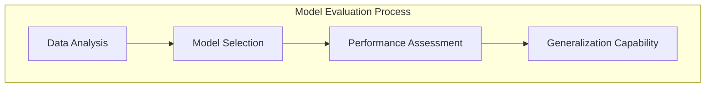
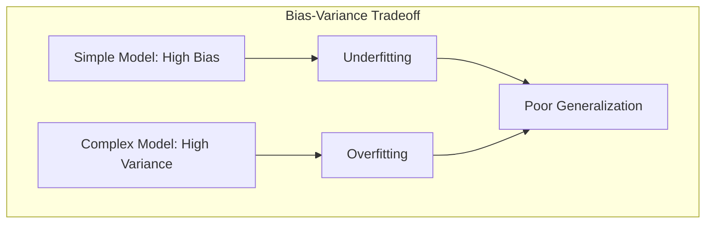
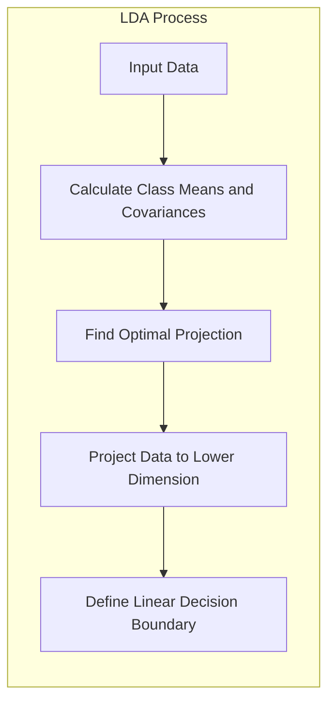
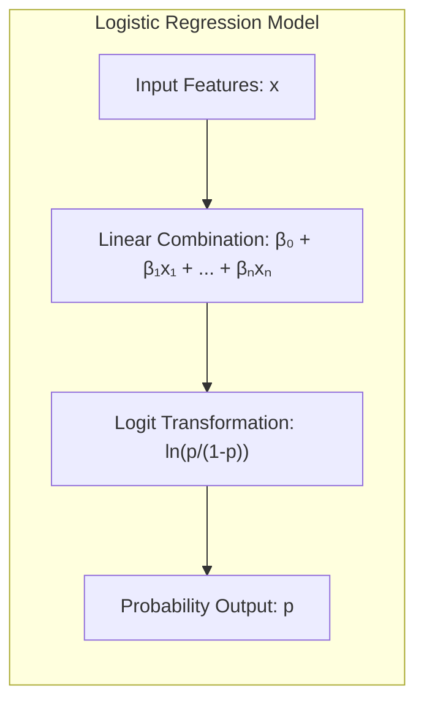
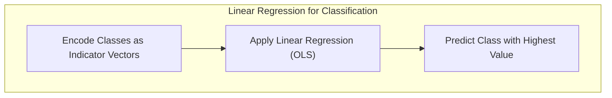
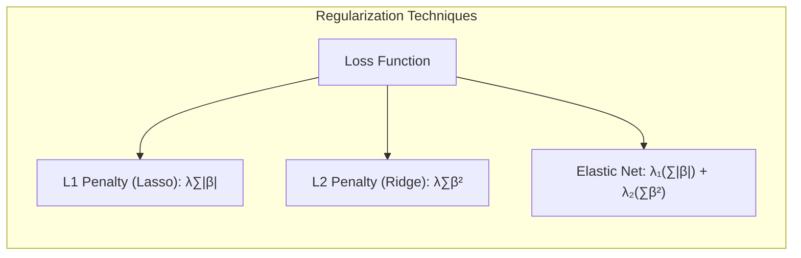
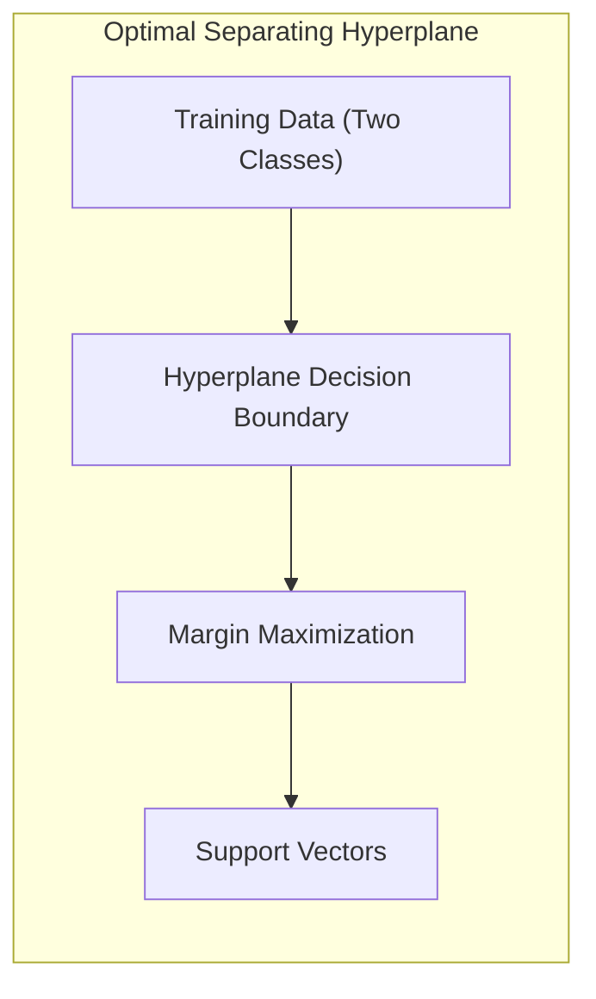
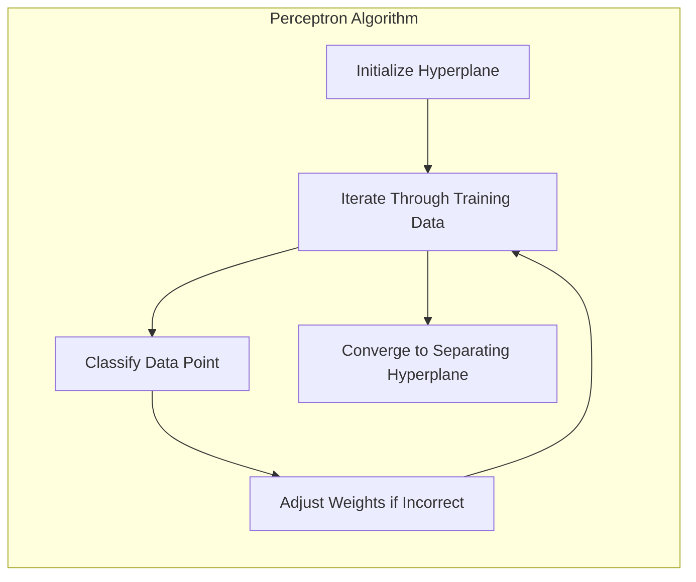

## Model Assessment and Selection: The Concept of Shattering



### Introdução
A avaliação e seleção de modelos estatísticos são etapas cruciais no processo de análise de dados e machine learning. A capacidade de um modelo de generalizar, ou seja, de fazer previsões precisas em dados não vistos, é uma medida fundamental de seu desempenho [^7.1]. Este capítulo explora os métodos-chave para a avaliação de desempenho e como esses métodos são utilizados para a seleção de modelos, começando com uma discussão sobre a complexa interação entre viés, variância e complexidade do modelo [^7.1]. Um aspecto importante é a noção de como um modelo se adapta aos dados de treinamento e qual o impacto disso na sua capacidade de generalizar. A complexidade do modelo, que se refere ao número de parâmetros ou à flexibilidade da função, influencia diretamente o viés e a variância.

### Conceitos Fundamentais

**Conceito 1: Classificação e Generalização**

O problema de **classificação** consiste em atribuir observações a categorias ou classes predefinidas. Métodos lineares são uma abordagem comum, caracterizada pela sua simplicidade e interpretabilidade [^7.1]. A capacidade de um modelo de classificação de generalizar, ou seja, de prever corretamente as classes em novos dados não vistos, é crucial [^7.1]. A relação entre viés e variância é fundamental nesse contexto: modelos simples tendem a ter alto viés, o que significa que eles podem não ser capazes de capturar a complexidade dos dados de treinamento, enquanto modelos complexos podem ter alta variância, o que significa que eles são muito sensíveis aos dados de treinamento e podem não generalizar bem para novos dados [^7.2]. Um exemplo prático seria tentar classificar e-mails como spam ou não spam. Um modelo simples pode ter dificuldade em classificar e-mails de spam complexos, enquanto um modelo muito complexo pode se tornar excessivamente ajustado aos dados de treinamento e não generalizar bem para futuros e-mails não vistos.



> 💡 **Exemplo Numérico:**
> Imagine que temos um conjunto de dados de 100 e-mails, onde 50 são spam (classe 1) e 50 não são spam (classe 0). Cada e-mail é representado por 2 características: o número de palavras com "promoção" e o número de links suspeitos.
>
> *   **Modelo Simples (Alto Viés):** Um modelo que considera apenas o número de palavras com "promoção" pode classificar e-mails com muitas dessas palavras como spam, mas falhar em e-mails de spam sem essa característica, resultando em um erro alto tanto no treinamento quanto em novos dados.
> *   **Modelo Complexo (Alta Variância):** Um modelo que considera interações complexas entre as duas características, pode se ajustar perfeitamente aos 100 e-mails de treinamento. Contudo, quando aplicado a novos e-mails não vistos, ele pode apresentar um desempenho ruim, pois decorou os dados de treinamento em vez de aprender os padrões gerais, mostrando um erro baixo no treinamento e alto em dados novos.
>
> Isso ilustra o *trade-off* entre viés e variância e a importância de escolher um modelo com a complexidade adequada.

**Lemma 1:** *A capacidade de uma função discriminante linear em separar classes em um espaço de características está diretamente ligada à complexidade da fronteira de decisão.*

**Prova:** A função discriminante linear é definida como $f(x) = w^Tx + b$, onde $w$ é o vetor de pesos, $x$ é o vetor de características e $b$ é o viés. A fronteira de decisão, onde $f(x) = 0$, é um hiperplano. A complexidade dessa fronteira é determinada pela dimensão do espaço de características e pelo vetor de pesos $w$. Uma fronteira linear tem baixa complexidade comparada a fronteiras não lineares, por exemplo, definidas por polinômios de grau elevado ou outras funções não lineares. A decomposição da função discriminante linear é dada pela expressão $f(x) = w^T x + b$. Este hiperplano de separação define a fronteira de decisão entre diferentes classes. A capacidade do hiperplano de separar diferentes classes está diretamente relacionada ao vetor de pesos $w$ e o viés $b$. Quanto mais simples a relação entre as características e a classe, mais simples a fronteira de decisão, e vice-versa. $\blacksquare$

**Conceito 2: Linear Discriminant Analysis (LDA)**

A **Linear Discriminant Analysis (LDA)** é uma técnica de classificação que assume que os dados seguem uma distribuição normal com covariâncias iguais para cada classe [^7.3]. O objetivo da LDA é encontrar uma projeção linear dos dados em um espaço de menor dimensão, de forma que as classes fiquem o mais separadas possível [^7.3.1], [^7.3.2]. A LDA utiliza as médias de cada classe e suas covariâncias para calcular uma função discriminante linear que define a fronteira de decisão [^7.3.3]. Essa função tenta maximizar a separação entre as classes, ao mesmo tempo em que minimiza a variância dentro de cada classe. A LDA assume normalidade e covariâncias iguais para todas as classes, o que pode ser uma limitação em alguns casos práticos [^7.3.1].



> 💡 **Exemplo Numérico:**
> Suponha que temos dados de duas classes, cada uma com duas características. Os dados da classe 1 têm média $\mu_1 = [2, 2]$ e os dados da classe 2 têm média $\mu_2 = [4, 4]$. As matrizes de covariância são iguais para ambas as classes, por exemplo $\Sigma = \begin{bmatrix} 1 & 0.5 \\ 0.5 & 1 \end{bmatrix}$.
>
> A LDA encontrará uma direção (vetor) que maximize a separação entre as médias projetadas das classes. Neste caso, a direção ótima será ao longo da linha que une as médias, ou seja, aproximadamente na direção [1, 1]. Os dados são projetados nesta linha, reduzindo o problema de classificação para uma dimensão. O ponto de corte no espaço de 1 dimensão é determinado de forma a minimizar os erros de classificação e maximizar a separação entre as classes.
>
> ```python
> import numpy as np
> from sklearn.discriminant_analysis import LinearDiscriminantAnalysis
>
> # Dados de exemplo
> X = np.array([[1, 1], [2, 1], [1, 2], [2, 2], [3, 3], [4, 3], [3, 4], [4, 4]])
> y = np.array([0, 0, 0, 0, 1, 1, 1, 1])
>
> # Aplicando LDA
> lda = LinearDiscriminantAnalysis()
> lda.fit(X, y)
>
> # Projetando os dados
> X_lda = lda.transform(X)
> print("Dados projetados via LDA:\n", X_lda)
>
> # Coeficientes do modelo
> print("Coeficientes LDA:", lda.coef_)
> print("Intercepto LDA:", lda.intercept_)
> ```
> O resultado mostra a transformação linear aplicada aos dados, onde as coordenadas originais são projetadas em uma única dimensão. Os coeficientes indicam a direção na qual as classes são melhor separadas, e o intercepto define a localização do hiperplano de decisão.

**Corolário 1:** *A projeção dos dados em um subespaço de menor dimensão, como encontrado pela LDA, mantém as relações de separação entre classes enquanto simplifica a representação dos dados.*

**Prova:** A LDA busca encontrar um subespaço linear onde as médias das classes fiquem o mais distantes possível enquanto as variâncias de cada classe sejam mínimas [^7.3.2]. Isso é obtido através da maximização da função discriminante $J(w) = \frac{w^T S_B w}{w^T S_W w}$, onde $S_B$ é a matriz de dispersão entre classes e $S_W$ é a matriz de dispersão dentro da classe. Essa otimização resulta em uma projeção linear que mantém a capacidade de discriminação entre classes, enquanto reduz a dimensionalidade dos dados. Ao projetar os dados em um subespaço de menor dimensão através de LDA, a fronteira de decisão linear é definida nesse subespaço, facilitando a classificação e a interpretabilidade. $\blacksquare$

**Conceito 3: Logistic Regression**

A **Logistic Regression** é outro método de classificação linear que modela a probabilidade de uma observação pertencer a uma determinada classe usando uma função logística [^7.4]. Ao contrário da LDA, a regressão logística não requer a suposição de normalidade nos dados [^7.4.1]. A regressão logística usa o conceito de **logit**, que é o log-odds de probabilidade, dado por $\text{logit}(p) = \ln\left(\frac{p}{1-p}\right)$, onde $p$ é a probabilidade de uma observação pertencer a uma dada classe [^7.4.2]. O modelo de regressão logística define essa função logit como uma combinação linear das características, dada por $\text{logit}(p(x)) = \beta_0 + \beta_1 x_1 + \beta_2 x_2 + \ldots + \beta_n x_n$ [^7.4.3]. Os parâmetros do modelo ($\beta_0, \beta_1, \ldots, \beta_n$) são estimados através do método da máxima verossimilhança [^7.4.4], [^7.4.5].



> 💡 **Exemplo Numérico:**
> Suponha que estamos modelando a probabilidade de um cliente comprar um produto com base em sua idade (x). Usamos um modelo de regressão logística: $\text{logit}(p(x)) = \beta_0 + \beta_1 x$. Após ajustar o modelo aos dados, encontramos os seguintes parâmetros: $\beta_0 = -3$ e $\beta_1 = 0.1$.
>
> Para um cliente com 50 anos, o log-odds seria:
> $\text{logit}(p(50)) = -3 + 0.1 \times 50 = 2$.
>
> A probabilidade $p(50)$ pode ser calculada usando a função logística:
> $p(50) = \frac{1}{1 + e^{-2}} \approx \frac{1}{1 + 0.135} \approx 0.88$
>
> Isso significa que há uma probabilidade de aproximadamente 88% de que um cliente com 50 anos compre o produto.
>
> ```python
> import numpy as np
> from sklearn.linear_model import LogisticRegression
>
> # Dados de exemplo (idades e se comprou ou não)
> X = np.array([[20], [30], [40], [50], [60], [70]])
> y = np.array([0, 0, 1, 1, 1, 1])
>
> # Aplicando regressão logística
> logistic_model = LogisticRegression()
> logistic_model.fit(X, y)
>
> # Parâmetros do modelo
> print("Coeficientes:", logistic_model.coef_)
> print("Intercepto:", logistic_model.intercept_)
>
> # Predição de probabilidade
> new_age = np.array([[55]])
> probability = logistic_model.predict_proba(new_age)[0, 1]
> print("Probabilidade de compra para 55 anos:", probability)
> ```
> O código demonstra o ajuste da regressão logística e como usar os parâmetros estimados para predizer probabilidades.

> ⚠️ **Nota Importante**: A regressão logística modela a probabilidade de uma observação pertencer a uma classe específica, o que a torna mais apropriada quando o interesse está em estimar probabilidades, ao contrário da LDA, que se foca na separação entre classes [^7.4.1].

> ❗ **Ponto de Atenção**: Em casos de classes não balanceadas, a regressão logística pode ser sensível ao desbalanceamento, e técnicas de balanceamento de classes podem ser necessárias [^7.4.2].

> ✔️ **Destaque**: Em muitos cenários, as estimativas de parâmetros da LDA e da regressão logística estão intimamente relacionadas, especialmente quando a hipótese de normalidade das classes em LDA é aproximadamente satisfeita [^7.5].

### Regressão Linear e Mínimos Quadrados para Classificação



A **regressão linear**, embora originalmente concebida para problemas de regressão, pode ser adaptada para classificação através da utilização de matrizes de indicadores [^7.2]. Em um problema de classificação com $K$ classes, podemos codificar cada classe por um vetor indicador, ou seja, um vetor de $K$ componentes onde a componente correspondente à classe é igual a 1 e as outras são 0 [^7.2]. A regressão linear é então aplicada a essa matriz de indicadores, e o modelo prediz um vetor para cada observação, sendo que a classe atribuída é aquela cuja componente no vetor predito tem o maior valor [^7.2].

Essa abordagem, embora simples, possui algumas limitações. Os resultados da regressão linear podem cair fora do intervalo [0,1], o que dificulta a interpretação das estimativas como probabilidades [^7.2]. Além disso, o método dos mínimos quadrados não se ajusta bem a dados com grande variabilidade entre as classes, podendo levar a um desempenho inferior em relação a métodos probabilísticos como a regressão logística e a LDA, que são mais adequados para a classificação [^7.3].

> 💡 **Exemplo Numérico:**
> Considere um problema de classificação com três classes (A, B e C). Para cada observação, criamos um vetor de indicadores de tamanho 3. Por exemplo, a classe A seria representada por [1, 0, 0], a classe B por [0, 1, 0] e a classe C por [0, 0, 1]. Suponha que temos duas características $x_1$ e $x_2$ e um conjunto de observações.
>
> Após aplicar a regressão linear com mínimos quadrados, para uma nova observação com características $x_1 = 2$ e $x_2 = 3$, obtemos um vetor de previsão, por exemplo, [0.3, 0.7, 0.1].  A classe atribuída para esta observação seria a classe B, pois o valor correspondente a ela (0.7) é o maior.
>
> ```python
> import numpy as np
> from sklearn.linear_model import LinearRegression
>
> # Dados de exemplo (2 características, 3 classes)
> X = np.array([[1, 1], [2, 1], [1, 2], [2, 2], [3, 3], [4, 3], [3, 4], [4, 4]])
> y = np.array([[1, 0, 0], [1, 0, 0], [0, 1, 0], [0, 1, 0], [0, 0, 1], [0, 0, 1], [0, 0, 1], [0, 0, 1]])
>
> # Aplicando regressão linear
> linear_model = LinearRegression()
> linear_model.fit(X, y)
>
> # Nova observação
> new_observation = np.array([[2.5, 2.5]])
> predicted_values = linear_model.predict(new_observation)
> predicted_class = np.argmax(predicted_values)
>
> print("Valores preditos:", predicted_values)
> print("Classe predita (índice):", predicted_class)
> ```
> Este exemplo demonstra a aplicação da regressão linear para classificação através da codificação das classes como vetores de indicadores. A classe predita é aquela cujo valor no vetor de previsão é o maior.

**Lemma 2:** *Sob certas condições, a projeção no hiperplano de decisão gerada pela regressão linear de indicadores e a fronteira de decisão da LDA são equivalentes em relação às classes.*

**Prova:** A regressão de indicadores minimiza a soma dos quadrados das diferenças entre os valores preditos e os valores reais para cada classe. O hiperplano de decisão é definido como o conjunto de pontos onde as previsões para duas classes são iguais. Já na LDA, o hiperplano é definido por um discriminante linear baseado nas médias e covariâncias das classes [^7.3]. Sob a condição em que a matriz de covariância comum entre as classes é esférica (proporcional à identidade), a direção do vetor de pesos na regressão de indicadores é proporcional à diferença das médias das classes, que é a mesma direção que a LDA encontra. Portanto, neste cenário específico, a projeção no hiperplano de decisão gerada pela regressão linear e a fronteira de decisão da LDA são equivalentes. $\blacksquare$

**Corolário 2:** *Sob a condição de covariâncias iguais, a regressão linear de indicadores resulta em um hiperplano de decisão equivalente ao obtido pela LDA, simplificando a análise do modelo em certos cenários.*

**Prova:** Como demonstrado no Lemma 2, a regressão de indicadores com covariância esférica e a LDA resultam no mesmo hiperplano de decisão, o que implica que as projeções dos dados nesse hiperplano serão equivalentes e que a análise da classificação será semelhante, embora a estimação das probabilidades e as formas de otimização sejam distintas. Em condições ideais, ambas as abordagens levariam à mesma classificação dos dados. $\blacksquare$

A regressão de indicadores, conforme apontado em [^7.2], é suficiente quando o principal objetivo é estabelecer a fronteira de decisão linear.

### Métodos de Seleção de Variáveis e Regularização em Classificação



Em problemas de classificação, a seleção de variáveis e a regularização são técnicas importantes para melhorar o desempenho do modelo e evitar overfitting [^7.4.4]. Modelos complexos, com muitas variáveis ou parâmetros, são propensos a se ajustar demais aos dados de treinamento e a não generalizar bem para novos dados [^7.5]. A regularização introduz termos de penalização na função de custo para controlar a magnitude dos coeficientes do modelo e, assim, reduzir a sua complexidade [^7.4.4].

A penalização L1 (Lasso) promove a esparsidade dos coeficientes, ou seja, leva a que alguns coeficientes sejam exatamente iguais a zero, o que realiza a seleção de variáveis, eliminando aquelas menos relevantes [^7.5], [^7.5.1]. Já a penalização L2 (Ridge) reduz a magnitude dos coeficientes, mas não os torna exatamente iguais a zero [^7.5], [^7.5.2]. Uma combinação das duas técnicas, conhecida como Elastic Net, pode ser usada para obter tanto esparsidade quanto estabilidade dos coeficientes [^7.5].

> 💡 **Exemplo Numérico:**
> Imagine um modelo de regressão logística com 5 variáveis preditoras, onde $\text{logit}(p) = \beta_0 + \beta_1 x_1 + \beta_2 x_2 + \beta_3 x_3 + \beta_4 x_4 + \beta_5 x_5$.
>
> *   **Lasso (L1):** Após aplicar a regularização L1 com um parâmetro $\lambda = 0.1$, os coeficientes podem ficar, por exemplo, $\beta = [-1.2, 0.5, 0, 0.8, 0, 0.2]$. As variáveis $x_3$ e $x_5$ foram eliminadas, pois seus coeficientes foram reduzidos a zero.
> *   **Ridge (L2):** Aplicando a regularização L2 com $\lambda = 0.1$, os coeficientes podem ser $\beta = [-1.1, 0.4, 0.2, 0.7, 0.1, 0.1]$. Todos os coeficientes foram reduzidos em magnitude, mas nenhum foi zerado.
> *   **Elastic Net:** Usando uma combinação de L1 e L2, a solução pode ser $\beta = [-1.0, 0.4, 0, 0.7, 0, 0.1]$, obtendo esparsidade (zerando alguns coeficientes) e estabilidade (reduzindo a magnitude dos não-zerados).
>
> ```python
> import numpy as np
> from sklearn.linear_model import LogisticRegression
>
> # Dados de exemplo (5 características, 2 classes)
> X = np.array([[1, 2, 3, 4, 5], [2, 3, 4, 5, 6], [1, 3, 2, 5, 4], [2, 4, 3, 6, 5], [3, 1, 5, 2, 4], [4, 2, 6, 3, 5]])
> y = np.array([0, 0, 1, 1, 1, 0])
>
> # Regressão logística com regularização L1 (Lasso)
> lasso_model = LogisticRegression(penalty='l1', solver='liblinear', C=1.0)
> lasso_model.fit(X, y)
> print("Coeficientes Lasso:", lasso_model.coef_)
>
> # Regressão logística com regularização L2 (Ridge)
> ridge_model = LogisticRegression(penalty='l2', C=1.0)
> ridge_model.fit(X, y)
> print("Coeficientes Ridge:", ridge_model.coef_)
>
> # Regressão logística com regularização Elastic Net
> elastic_net_model = LogisticRegression(penalty='elasticnet', solver='saga', l1_ratio=0.5, C=1.0)
> elastic_net_model.fit(X,y)
> print("Coeficientes Elastic Net:", elastic_net_model.coef_)
> ```
> Este código demonstra como as diferentes formas de regularização afetam os coeficientes de um modelo de regressão logística, promovendo a esparsidade (L1) ou reduzindo a magnitude (L2). O Elastic Net combina as duas abordagens.

**Lemma 3:** *A penalização L1 em regressão logística promove a esparsidade dos coeficientes, levando alguns deles a serem exatamente zero.*

**Prova:** A penalização L1 adiciona o termo $\lambda \sum_{j=1}^p |\beta_j|$ à função de custo da regressão logística, onde $\lambda$ é um parâmetro de ajuste que controla a força da penalização e $\beta_j$ são os coeficientes do modelo [^7.4.4]. O termo de penalização L1 tem uma forma geométrica que leva à criação de cantos e arestas na superfície de contorno da função de custo. Isso faz com que a solução ótima para os coeficientes tenda a ocorrer nesses cantos, onde alguns coeficientes são exatamente zero. Ao contrário da penalização L2 que reduz os coeficientes para valores próximos de zero, mas dificilmente zera. A natureza da penalização L1 leva à esparsidade dos parâmetros, o que promove a seleção de características e simplifica o modelo [^7.4.3]. $\blacksquare$

**Corolário 3:** *A esparsidade dos coeficientes, resultante da penalização L1, melhora a interpretabilidade do modelo classificatório, pois reduz o número de variáveis relevantes e simplifica a função discriminante.*

**Prova:** Coeficientes iguais a zero indicam que a variável associada não contribui para a classificação. Assim, um modelo esparso, com menos variáveis, é mais fácil de interpretar e entender o papel de cada característica na tomada de decisão. Isso é particularmente útil em situações onde a interpretabilidade do modelo é tão importante quanto sua precisão preditiva [^7.4.5]. $\blacksquare$

> ⚠️ **Ponto Crucial**: A combinação das penalidades L1 e L2 (Elastic Net) permite o uso das vantagens de ambos os tipos de regularização, equilibrando a esparsidade e a estabilidade dos coeficientes.

### Separating Hyperplanes e Perceptrons



A ideia de maximizar a margem de separação entre as classes leva ao conceito de **hiperplanos ótimos** [^7.5.2]. O objetivo é encontrar um hiperplano que não apenas separe as classes corretamente, mas também maximize a distância entre o hiperplano e as observações mais próximas de cada classe (os pontos de suporte) [^7.5.2]. O problema de otimização é formulado para encontrar o hiperplano que minimize o erro de classificação e maximize a margem. A solução é encontrada através de uma combinação linear dos pontos de suporte [^7.5.2]. O problema dual de Wolfe pode ser usado para resolver esse problema de otimização [^7.5.2].

O **Perceptron de Rosenblatt** é um algoritmo de classificação que busca um hiperplano que separe os dados [^7.5.1]. O Perceptron inicia com um hiperplano arbitrário e itera sobre os dados de treinamento, ajustando os pesos do hiperplano sempre que uma observação é classificada incorretamente. Sob a condição de que os dados sejam linearmente separáveis, o algoritmo do Perceptron converge para um hiperplano que separa as classes [^7.5.1].



> 💡 **Exemplo Numérico:**
> Imagine um cenário bidimensional com duas classes de dados, classe 1 (representada por círculos) e classe 2 (representada por triângulos). O objetivo do Perceptron é encontrar uma linha que separe essas duas classes. Inicialmente, o Perceptron escolhe uma linha aleatória. Em cada iteração, ele analisa os dados de treinamento e ajusta os pesos da linha se uma observação for classificada incorretamente.
>
> Por exemplo, se um círculo estiver do lado dos triângulos, a linha é ajustada para tentar trazê-lo para o lado correto. O mesmo ocorre com os triângulos. Se os dados forem linearmente separáveis, o Perceptron eventualmente encontra uma linha que separa as classes sem classificar nenhum ponto incorretamente.
>
> ```python
> import numpy as np
> from sklearn.linear_model import Perceptron
>
> # Dados de exemplo
> X = np.array([[1, 1], [2, 1], [1, 2], [2, 2], [4, 4], [5, 4], [4, 5], [5, 5]])
> y = np.array([0, 0, 0, 0, 1, 1, 1, 1])
>
> # Aplicando Perceptron
> perceptron = Perceptron()
> perceptron.fit(X, y)
>
> # Previsão
> new_point = np.array([[3, 3]])
> prediction = perceptron.predict(new_point)
>
> print("Coeficientes Perceptron:", perceptron.coef_)
> print("Intercepto Perceptron:", perceptron.intercept_)
> print("Classificação do novo ponto:", prediction)
> ```
> O código demonstra o ajuste do Perceptron a um conjunto de dados e como usar os coeficientes para classificar novos pontos. O algoritmo ajusta o hiperplano iterativamente até que a separação seja alcançada.

### Pergunta Teórica Avançada: Quais as diferenças fundamentais entre a formulação de LDA e a Regra de Decisão Bayesiana considerando distribuições Gaussianas com covariâncias iguais?

**Resposta:**
A LDA e a Regra de Decisão Bayesiana (Bayes Decision Rule) são ambas abordagens para classificação que, sob certas condições, podem levar a resultados muito similares. Ambas as técnicas assumem distribuições Gaussianas para os dados, contudo elas diferem na sua formulação e no seu objetivo final. A LDA tenta encontrar uma projeção linear dos dados que maximize a separação entre classes e minimize a variabilidade dentro das classes [^7.3], sem necessariamente focar diretamente na modelagem da probabilidade posterior de cada classe. Já a regra de decisão Bayesiana, busca modelar diretamente as probabilidades posteriores $P(G=k|X=x)$, escolhendo a classe com maior probabilidade posterior [^7.3]. Quando as classes têm distribuições Gaussianas com covariâncias iguais, a regra de decisão Bayesiana resulta em uma função discriminante que é linear nas características e que coincide com a função discriminante linear da LDA [^7.3].

**Lemma 4:** *Sob a hipótese de normalidade e covariâncias iguais, a função discriminante linear da LDA é equivalente à regra de decisão Bayesiana, resultando na mesma fronteira de decisão.*

**Prova:**
Assumindo que cada classe $G_k$ segue uma distribuição normal multivariada com média $\mu_k$ e matriz de covariância comum $\Sigma$ [^7.3], a densidade de probabilidade condicional é dada por:

$$
p(x|G=k) = \frac{1}{(2\pi)^{p/2} |\Sigma|^{1/2}} \exp\left(-\frac{1}{2} (x-\mu_k)^T \Sigma^{-1} (x-\mu_k)\right)
$$

A regra de decisão Bayesiana, usando probabilidades a priori iguais para as classes, atribui $x$ à classe $G_k$ que maximiza $p(x|G=k)$. Em termos de log-probabilidade, isso equivale a maximizar:
$$
\delta_k(x) = \log p(x|G=k) =  -\frac{1}{2} (x-\mu_k)^T \Sigma^{-1} (x-\mu_k) + \text{constante}
$$
Expandindo, e ignorando constantes e termos quadráticos comuns a todas as classes:
$$
\delta_k(x) =  x^T \Sigma^{-1} \mu_k - \frac{1}{2} \mu_k^T \Sigma^{-1} \mu_k
$$
Esta é uma função linear em $x$ que define a função discriminante da LDA [^7.3.3]. Assim, a regra de decisão Bayesiana sob essas hipóteses resulta na mesma fronteira de decisão que a LDA. $\blacksquare$

**Corolário 4:** *Ao relaxar a hipótese de covariâncias iguais entre as classes na regra de decisão Bayesiana, surgem fronteiras de decisão quadráticas, como no Quadratic Discriminant Analysis (QDA), onde cada classe tem sua própria matriz de covariância.*

**Prova:**
Quando permitimos que as matrizes de covariância $\Sigma_k$ sejam diferentes para cada classe, a função discriminante Bayesiana (ignorando as constantes) se torna:

$$
\delta_k(x) = -\frac{1}{2} \log |\Sigma_k| - \frac{1}{2} (x-\mu_k)^T \Sigma_k^{-1} (x-\mu_k)
$$

Este discriminante agora contém um termo quadrático em $x$ e portanto define fronteiras de decisão quadráticas [^7.3]. A decisão entre usar a LDA ou a QDA (ou seja, utilizar covariâncias iguais ou diferentes) depende da validade da hipótese de covariância comum e do trade-off entre viés e variância do modelo. $\blacksquare$

> ⚠️ **Ponto Crucial**: A escolha entre utilizar covariâncias iguais ou diferentes impacta fortemente o tipo de fronteira de decisão resultante (linear ou quadrática), afetando a complexidade e a generalização do modelo.

### Conclusão

Este capítulo explorou conceitos fundamentais e técnicas avançadas para a avaliação e seleção de modelos estatísticos, com foco em métodos lineares de classificação. A relação entre viés e variância, a aplicação da regressão linear com indicadores, a LDA, a regressão logística, técnicas de regularização, o conceito de hiperplanos ótimos e o algoritmo Perceptron foram analisados em profundidade. O uso de modelos mais complexos, como aqueles que dependem de funções não lineares, ou mesmo da aplicação de árvores de decisão como stumps, também foi comentado, e a sua complexidade em relação à linearidade explorada [^7.3.1], [^7.5.2]. Em resumo, a escolha do modelo mais apropriado envolve um trade-off entre complexidade, viés e variância, e é crucial para obter modelos que generalizem bem para dados não vistos [^7.1], [^7.2]. A aplicação de técnicas de regularização, e a escolha adequada da função de custo, têm um papel importante no controle da complexidade do modelo [^7.4.4]. O uso do conceito de shattering, como abordado no capítulo, é fundamental na compreensão da capacidade de um modelo em separar dados e na definição de sua complexidade. Além disso, a análise das diferenças entre a LDA e a regra de decisão Bayesiana permite compreender como os modelos são formulados e quais as implicações de suas hipóteses [^7.3].

<!-- END DOCUMENT -->

### Footnotes

[^7.1]: "The generalization performance of a learning method relates to its prediction capability on independent test data. Assessment of this performance is extremely important in practice, since it guides the choice of learning method or model, and gives us a measure of the quality of the ultimately chosen model." *(Trecho de <Model Assessment and Selection>)*
[^7.2]: "Consider first the case of a quantitative or interval scale response. We have a target variable Y, a vector of inputs X, and a prediction model f(X) that has been estimated from a training