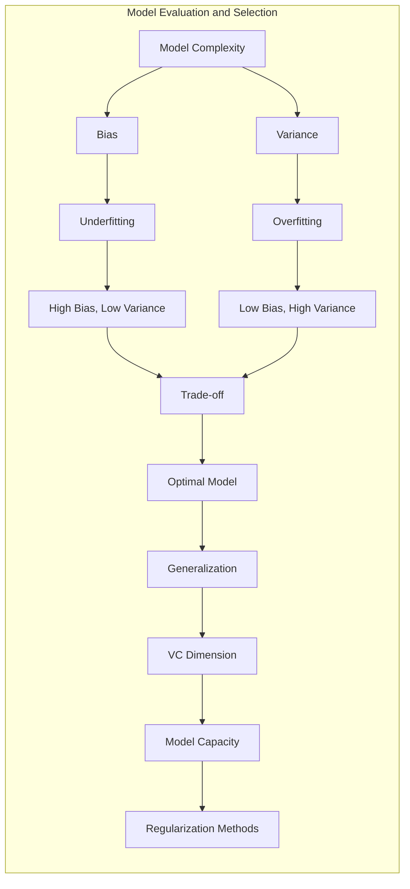
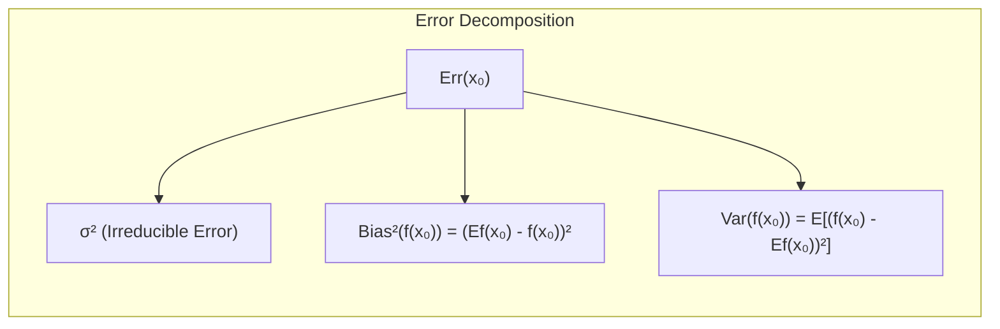
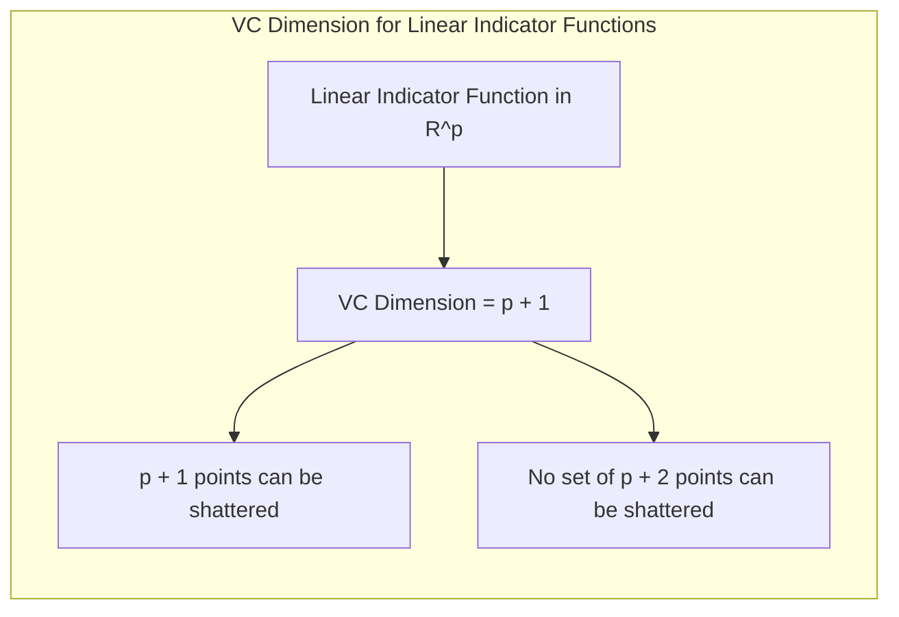
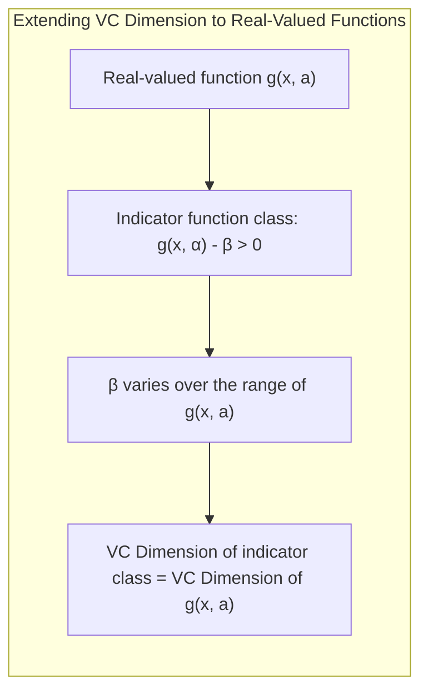
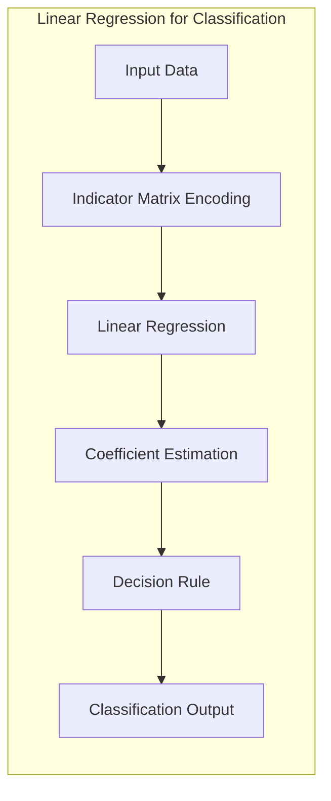
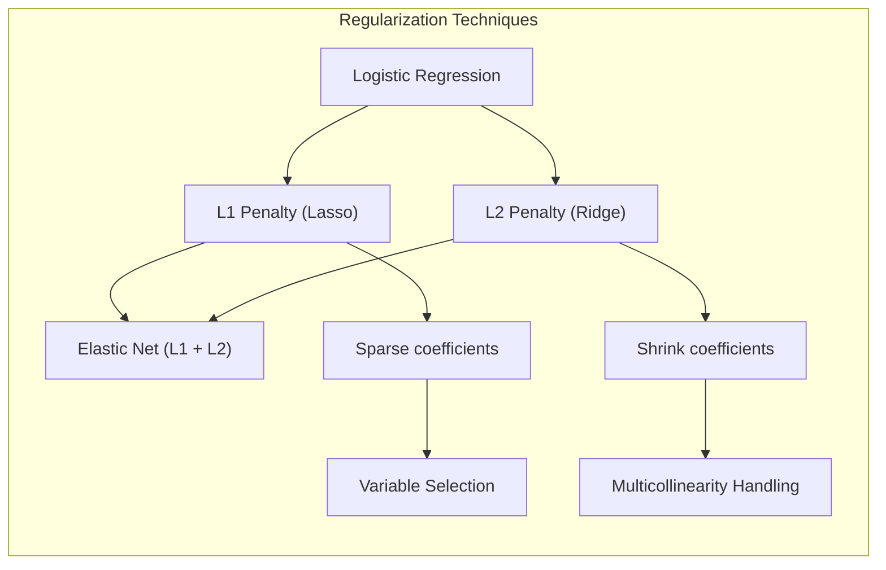
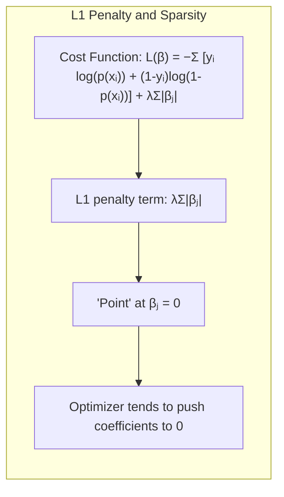
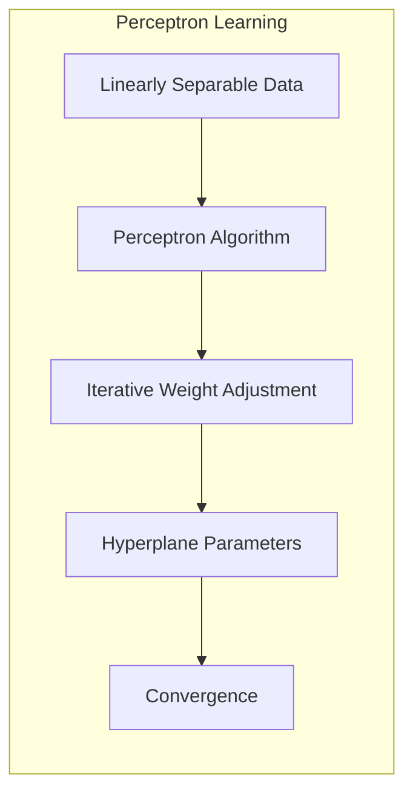
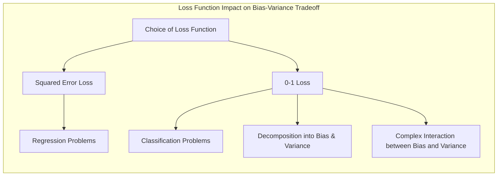
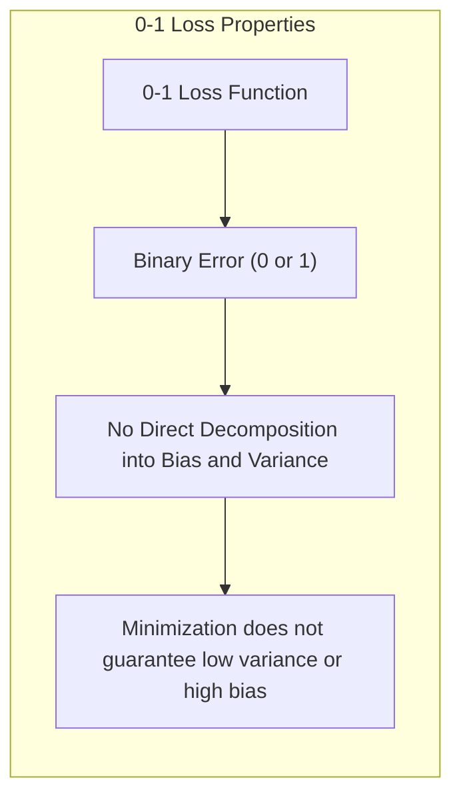

Okay, here's the revised text with all mathematical expressions formatted using LaTeX notation:

## Avaliação e Seleção de Modelos: Dimensão VC para Funções com Valores Reais

### Introdução

A capacidade de um modelo de aprendizado de generalizar, ou seja, seu desempenho em dados de teste independentes, é crucial. A avaliação desse desempenho guia a escolha do método de aprendizado e fornece uma medida da qualidade do modelo final [^7.1]. Este capítulo explora os métodos essenciais para avaliação de desempenho e como eles são usados na seleção de modelos. Começamos discutindo a relação entre **viés, variância e complexidade do modelo**, e aprofundaremos a teoria da Dimensão de Vapnik-Chervonenkis para funções com valores reais.

### Conceitos Fundamentais

**Conceito 1:** *Problema de Generalização e Complexidade do Modelo*

O problema central na avaliação de modelos é entender como um modelo treinado em um conjunto de dados específico se comportará em dados não vistos. Modelos simples podem ter alto viés, pois são incapazes de capturar padrões complexos nos dados, enquanto modelos complexos podem apresentar alta variância, sendo sensíveis ao ruído e com baixo desempenho em dados não vistos (overfitting) [^7.2]. O objetivo é encontrar um equilíbrio ideal, ou seja, um modelo com viés e variância aceitáveis.

**Lemma 1:** *Decomposição do Erro Quadrático*

O erro quadrático esperado de um modelo de regressão pode ser decomposto em três componentes: a variância do ruído (erro irredutível), o viés ao quadrado e a variância do modelo:

$$
Err(x_0) = \sigma^2 + [Ef(x_0) - f(x_0)]^2 + E[f(x_0) - Ef(x_0)]^2 = \sigma^2 + Bias^2(f(x_0)) + Var(f(x_0))
$$

onde:
- $Err(x_0)$ representa o erro de predição esperado no ponto de entrada $x_0$
- $\sigma^2$ é a variância do ruído (erro irredutível).
- $[Ef(x_0) - f(x_0)]^2$ é o viés ao quadrado, medindo a diferença entre o valor médio previsto pelo modelo ($Ef(x_0)$) e o valor verdadeiro $f(x_0)$.
- $E[f(x_0) - Ef(x_0)]^2$ é a variância do modelo, medindo a variabilidade das previsões do modelo em torno de sua média.

Essa decomposição é fundamental para entender o compromisso entre viés e variância na escolha da complexidade do modelo [^7.3].

> 💡 **Exemplo Numérico:** Vamos considerar um exemplo simples para ilustrar a decomposição do erro quadrático. Suponha que o valor verdadeiro de uma variável em $x_0$ seja $f(x_0) = 5$. Temos um modelo com ruído $\sigma^2 = 0.5$. Após várias execuções do modelo, obtemos as seguintes previsões: 4, 4.5, 5.5, e 6. A média das previsões, $Ef(x_0)$, é 5.
>
>  - **Viés ao quadrado:** $[Ef(x_0) - f(x_0)]^2 = (5-5)^2 = 0$.
>  - **Variância do modelo:** $E[f(x_0) - Ef(x_0)]^2 = \frac{(4-5)^2 + (4.5-5)^2 + (5.5-5)^2 + (6-5)^2}{4} = \frac{1 + 0.25 + 0.25 + 1}{4} = 0.625$.
>  - **Erro total:** $Err(x_0) = 0.5 + 0 + 0.625 = 1.125$
>
>  Este exemplo demonstra que o erro total é composto do erro irredutível, e a variância do modelo, pois o viés é zero nesse cenário específico.

**Conceito 2:** *Dimensão VC*

A **Dimensão de Vapnik-Chervonenkis (VC)** é uma medida da complexidade de uma classe de funções, representando o número máximo de pontos que podem ser "estilhaçados" por essa classe [^7.9]. Um conjunto de pontos é estilhaçado por uma classe de funções se, para cada possível atribuição de rótulos binários a esses pontos, existe uma função na classe que os separa perfeitamente [^7.9]. A Dimensão VC oferece um critério para medir a capacidade de um modelo de se ajustar a um dado conjunto de dados, fornecendo insights sobre o risco de overfitting.

**Corolário 1:** *Dimensão VC para Funções Indicadoras Lineares*

A dimensão VC de funções indicadoras lineares no espaço $R^p$ é $p+1$. Isso significa que $p+1$ pontos podem ser estilhaçados por hiperplanos em $p$ dimensões, mas nenhum conjunto de $p+2$ pontos pode ser estilhaçado [^7.9]. Funções indicadoras lineares são funções que geram valores binários (0 ou 1) indicando a classe a que um dado ponto pertence. A dimensão VC de uma função indicadora linear é igual ao número de parâmetros mais um (o intercepto).

> 💡 **Exemplo Numérico:** Em um espaço bidimensional ($R^2$), uma linha (hiperplano em 2D) pode estilhaçar até 3 pontos. Considere três pontos não colineares. Podemos desenhar linhas para separar cada combinação possível de classes (0 ou 1). No entanto, com 4 pontos em $R^2$ em configuração genérica, não conseguiremos separá-los para todas as combinações de rótulos binários com apenas uma linha. Portanto, a dimensão VC para funções lineares em $R^2$ é 3. A quantidade de parâmetros de um modelo linear em $R^2$ é 3: dois coeficientes e um intercepto ($ax + by + c = 0$).

**Conceito 3:** *Extensão da Dimensão VC para Funções com Valores Reais*

A definição de Dimensão VC é originalmente aplicada a funções indicadoras, mas ela pode ser estendida para funções com valores reais $g(x,a)$ considerando a classe de funções indicadoras que divide o espaço de saída em regiões onde $g(x, \alpha) - \beta > 0$, onde $\beta$ varia ao longo do range da função $g(x, a)$ [^7.9]. A dimensão VC desta classe de indicadoras é a dimensão VC da função $g(x,a)$. Isso permite medir a complexidade de classes de funções com valores reais, que são cruciais para modelar diversos fenômenos.

### Regressão Linear e Mínimos Quadrados para Classificação

A regressão linear pode ser usada para classificação ao aplicar o método de mínimos quadrados a uma matriz indicadora de classes [^7.1]. Cada coluna dessa matriz representa uma classe, e os elementos indicam se uma dada amostra pertence a essa classe. O modelo obtido por regressão linear pode ser usado para estimar a classe mais provável de cada nova amostra.

No entanto, a regressão linear em matrizes indicadoras tem limitações. As previsões podem cair fora do intervalo [0,1], tornando as interpretações de probabilidade inválidas [^7.2]. Além disso, a regressão linear não leva em conta a natureza categórica das variáveis de resposta. Apesar disso, a regressão linear em matrizes indicadoras pode ser eficiente em certos casos, quando o principal interesse é a fronteira de decisão linear.

**Lemma 2:** *A Equivalência Assintótica da Regressão Linear e LDA*

Em algumas condições específicas, quando o objetivo principal é obter uma fronteira de decisão, a regressão linear de uma matriz indicadora pode produzir fronteiras de decisão que se aproximam das encontradas via Linear Discriminant Analysis (LDA) [^7.2]. Ambos os métodos compartilham a mesma estrutura de decisão linear, mas os coeficientes dos modelos podem ser obtidos por diferentes critérios.

**Corolário 2:** *Fronteiras de Decisão Lineares*

As projeções lineares de regressão podem, em certos contextos, levar às mesmas fronteiras de decisão obtidas através de outros métodos como LDA [^7.2]. Isso destaca como diferentes abordagens de classificação podem convergir para soluções semelhantes sob certas condições.

### Métodos de Seleção de Variáveis e Regularização em Classificação

A seleção de variáveis e a regularização são cruciais para evitar o overfitting, especialmente quando lidamos com modelos complexos ou dados com muitas variáveis preditoras [^7.2]. Na regressão logística, métodos como a penalização L1 e L2 são usados para controlar a complexidade do modelo e melhorar a generalização [^7.3].

A penalização L1 (Lasso) tende a produzir modelos com coeficientes esparsos, ou seja, muitos coeficientes são exatamente zero, facilitando a seleção de variáveis relevantes [^7.3]. A penalização L2 (Ridge) encolhe os coeficientes em direção a zero, mas raramente os torna exatamente zero, o que é útil para evitar multicolinearidade e melhorar a estabilidade do modelo [^7.3].

> 💡 **Exemplo Numérico:** Suponha que estamos treinando um modelo de regressão logística para prever se um cliente irá comprar um produto (1) ou não (0), baseado em 5 variáveis preditoras: idade, renda, tempo de navegação no site, número de produtos adicionados ao carrinho e número de visitas à página. Usando um modelo de regressão logística sem regularização, obtemos:
>
> $$ \text{log}\left(\frac{p}{1-p}\right) = -0.5 + 0.02*\text{idade} + 0.001*\text{renda} + 0.1*\text{tempo\_navegação} + 0.2*\text{carrinho} - 0.05*\text{visitas}$$
>
>Aplicando penalização L1 (Lasso) com $\lambda = 0.1$, podemos obter:
>
> $$ \text{log}\left(\frac{p}{1-p}\right) = -0.3 + 0.01*\text{idade} + 0.08*\text{tempo\_navegação} + 0.15*\text{carrinho} $$
>
>Observe que a penalização L1 zerou os coeficientes de "renda" e "visitas", indicando que essas variáveis são menos relevantes para a predição, o que simplifica o modelo e o torna mais interpretável. Agora, aplicando L2 (Ridge) com $\lambda = 0.1$, podemos ter um resultado como:
>
> $$ \text{log}\left(\frac{p}{1-p}\right) = -0.4 + 0.015*\text{idade} + 0.0008*\text{renda} + 0.09*\text{tempo\_navegação} + 0.18*\text{carrinho} - 0.03*\text{visitas} $$
>
>Aqui, todos os coeficientes são reduzidos, mas nenhum é exatamente zero. Ridge ajuda a lidar com multicolinearidade, o que pode acontecer se variáveis como tempo de navegação e número de visitas estiverem correlacionadas.

**Lemma 3:** *Penalização L1 e Esparsidade*

A penalização L1 em modelos de regressão logística leva a coeficientes esparsos, o que significa que alguns coeficientes serão exatamente zero.

**Prova do Lemma 3:**
A penalização L1 adiciona um termo proporcional à soma dos valores absolutos dos coeficientes à função de custo da regressão logística:
$$
L(\beta) = - \sum_{i=1}^N [y_i \log(p(x_i)) + (1-y_i)\log(1-p(x_i))] + \lambda \sum_{j=1}^p|\beta_j|
$$

onde $\lambda$ controla a intensidade da penalização. A penalização L1 gera soluções esparsas porque a função $ |\beta_j| $ tem uma "ponta" em $ \beta_j = 0 $, o que faz com que o otimizador tenda a empurrar alguns coeficientes para exatamente zero [^7.3]. $\blacksquare$

**Corolário 3:** *Interpretabilidade de Modelos Classificatórios*

A esparsidade induzida pela penalização L1 facilita a interpretação dos modelos classificatórios, pois apenas as variáveis mais relevantes são mantidas no modelo final [^7.3]. Isso é especialmente útil em cenários com alta dimensionalidade onde a interpretabilidade é crucial.

> ⚠️ **Ponto Crucial:** A combinação das penalidades L1 e L2, Elastic Net, permite equilibrar a esparsidade da penalização L1 e a estabilidade da penalização L2, conforme discutido em [^7.3].

### Separating Hyperplanes e Perceptrons

A ideia de maximizar a margem de separação entre as classes leva ao conceito de **hiperplanos ótimos** [^7.2]. A distância entre a margem e o hiperplano de decisão é maximizada, melhorando a robustez do classificador a dados não vistos. A formulação matemática desse problema envolve otimização, utilizando a dualidade de Wolfe e o conceito de vetores de suporte [^7.3].

O **Perceptron de Rosenblatt** é um algoritmo de aprendizado para classificar dados linearmente separáveis. O Perceptron aprende os parâmetros de um hiperplano que separa as classes ajustando os pesos iterativamente até convergir, desde que os dados sejam linearmente separáveis [^7.3].

### Pergunta Teórica Avançada (Exemplo): Como a escolha da função de perda influencia o comportamento do *bias-variance tradeoff* em problemas de classificação?

**Resposta:**
A função de perda escolhida afeta profundamente o comportamento do *bias-variance tradeoff*. Por exemplo, a função de perda de erro quadrático é adequada para problemas de regressão, enquanto a função de perda 0-1 é mais apropriada para problemas de classificação. A perda 0-1 penaliza igualmente todas as classificações incorretas, enquanto o erro quadrático penaliza erros maiores de maneira proporcional ao quadrado da magnitude do erro. No contexto de classificação, a perda 0-1 não se decompõe em componentes de viés e variância da mesma forma que o erro quadrático, o que faz com que os modelos tenham uma interação mais complexa entre viés e variância em comparação com o erro quadrático [^7.3]. Especificamente, a minimização da perda 0-1 pode gerar modelos com alto viés (classificando a maioria dos pontos corretamente, mas com uma probabilidade de classe incorreta) e baixa variância, mesmo que o modelo não capture a estrutura real das probabilidades da classe [^7.3].

> 💡 **Exemplo Numérico:** Imagine que temos um problema de classificação binária com apenas um preditor ($x$) e a resposta verdadeira seja $y=1$ se $x>0$ e $y=0$ se $x \le 0$. Usando a perda 0-1, um classificador simples que sempre prediz $y=1$ terá um erro baixo (50% dos casos certos), mas alto viés, pois sempre prediz a mesma classe, não dependendo de $x$. Se usarmos um modelo mais complexo que tente capturar a dependência entre x e y, ele terá uma alta variância e maior chance de errar se treinado com poucos exemplos, apesar de que seu viés poderia ser baixo se treinado com mais dados.

**Lemma 4:** *Comportamento da Perda 0-1*

A função de perda 0-1 não se decompõe em componentes de viés e variância da mesma forma que o erro quadrático, e sua minimização não necessariamente leva a modelos com baixa variância ou alto viés.
**Prova do Lemma 4:** A decomposição do erro em viés e variância depende da função de perda. Para a perda 0-1, o erro é binário (0 ou 1), enquanto que a decomposição de viés e variância exige a definição de um valor médio (esperança). A perda 0-1 não fornece diretamente uma decomposição significativa do erro em componentes de viés e variância, pois a média da perda 0-1 não reflete o erro de predição contínuo do modelo.
$\blacksquare$

**Corolário 4:** *Diferenças nos Modelos de Classificação e Regressão*

As funções de perda usadas influenciam o comportamento do *bias-variance tradeoff*, o que significa que a escolha do modelo e seus parâmetros devem ser ajustados levando em consideração as diferenças nas propriedades dessas funções de perda, levando a escolhas distintas de parâmetros para classificação e regressão [^7.3].

> ⚠️ **Ponto Crucial**: A escolha da função de perda é crucial, e um modelo com baixa perda 0-1 não significa necessariamente baixo erro de previsão quando se considera outras métricas e o efeito do bias-variance tradeoff.

As perguntas devem ser altamente relevantes, **avaliar a compreensão profunda de conceitos teóricos-chave**, podem envolver derivações matemáticas e provas, e focar em análises teóricas.

### Conclusão

Este capítulo abordou a relação fundamental entre viés, variância e complexidade do modelo, com ênfase na dimensão VC para funções com valores reais e suas implicações na avaliação de modelos. Foram discutidos detalhes sobre a regressão linear em matriz de indicadores, seleção de variáveis, regularização, e métodos de *separating hyperplanes*. A análise aprofundada do comportamento de classificação com perda 0-1 reforça a complexidade de se obter modelos com boa generalização, e a necessidade de escolher métodos que equilibrem viés e variância. A compreensão desses conceitos teóricos é essencial para o desenvolvimento de modelos de aprendizado de máquina eficazes e robustos.

### Footnotes

[^7.1]: "The generalization performance of a learning method relates to its prediction capability on independent test data. Assessment of this performance is extremely important in practice, since it guides the choice of learning method or model, and gives us a measure of the quality of the ultimately chosen model." *(Trecho de "Model Assessment and Selection")*
[^7.2]: "Figure 7.1 illustrates the important issue in assessing the ability of a learning method to generalize. Consider first the case of a quantitative or interval scale response. We have a target variable Y, a vector of inputs X, and a prediction model f(X) that has been estimated from a training set T." *(Trecho de "Model Assessment and Selection")*
[^7.3]: "The story is similar for a qualitative or categorical response G taking one of K values in a set G, labeled for convenience as 1, 2, ..., K." *(Trecho de "Model Assessment and Selection")*
[^7.9]: "A difficulty in using estimates of in-sample error is the need to specify the number of parameters (or the complexity) d used in the fit. Although the effective number of parameters introduced in Section 7.6 is useful for some nonlinear models, it is not fully general. The Vapnik-Chervonenkis (VC) theory provides such a general measure of complexity, and gives associated bounds on the optimism." *(Trecho de "Model Assessment and Selection")*

<!-- END DOCUMENT -->
