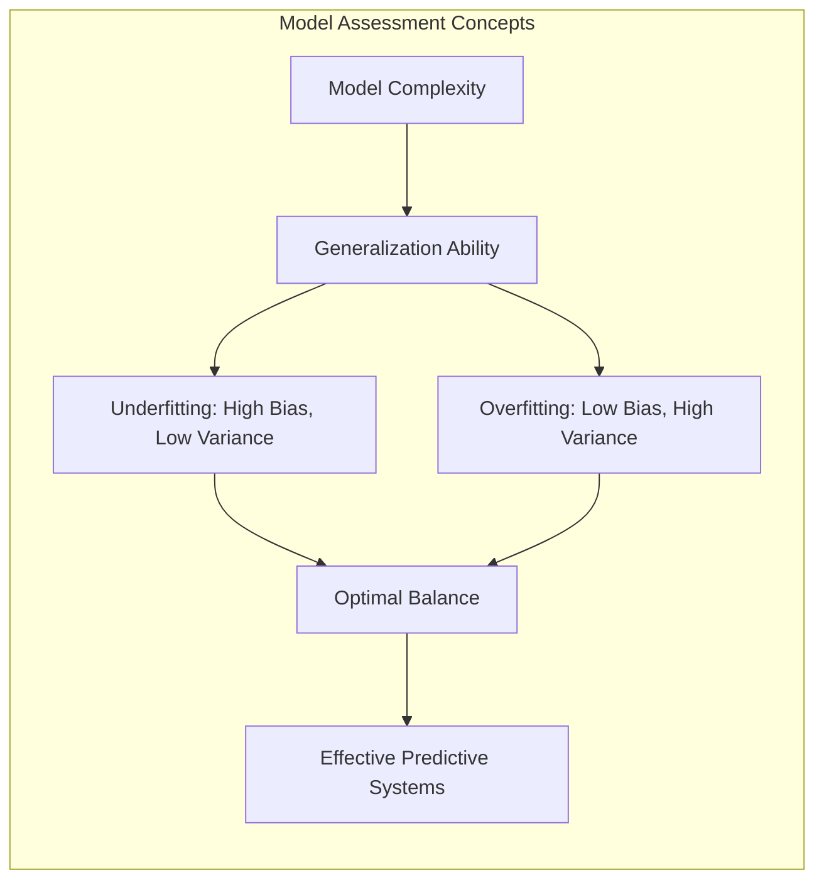
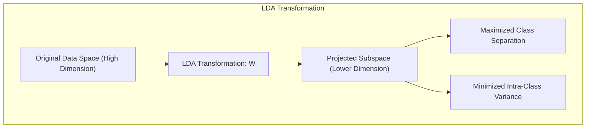
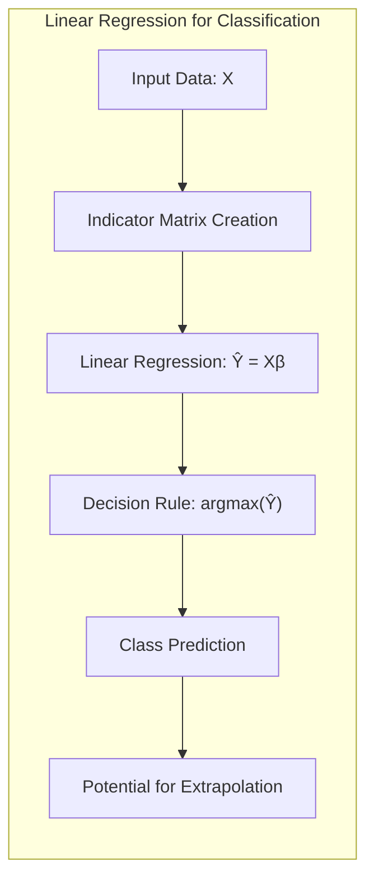
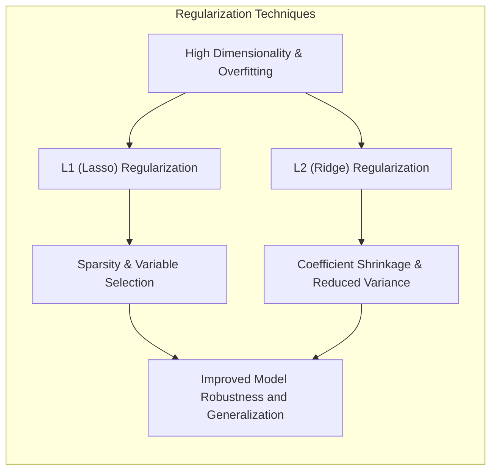
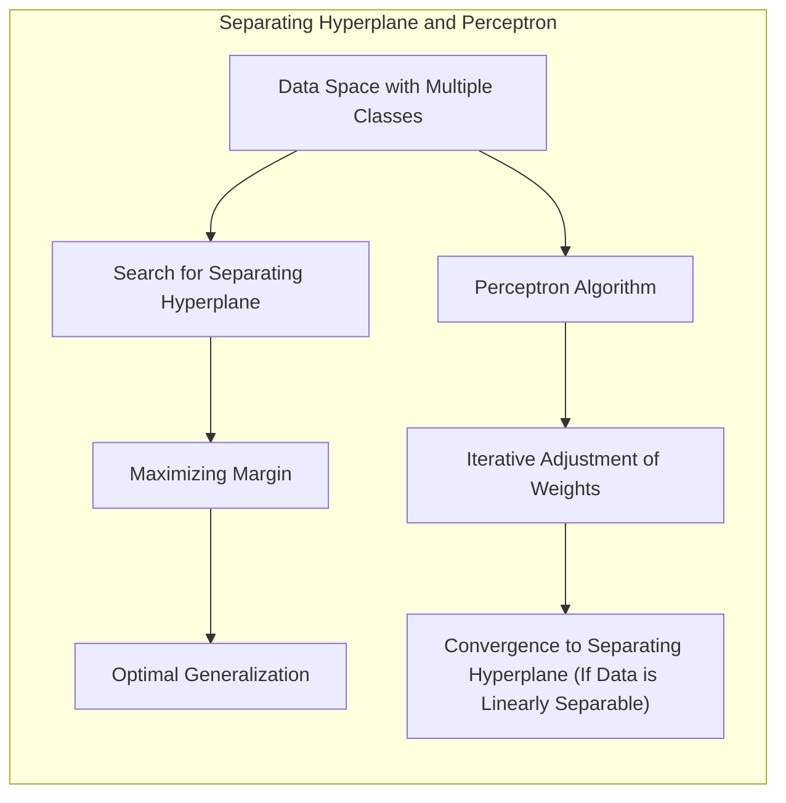
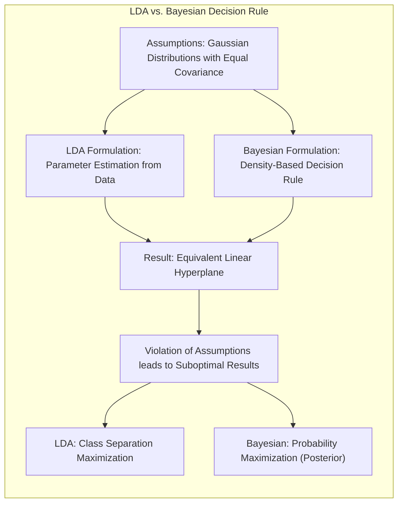
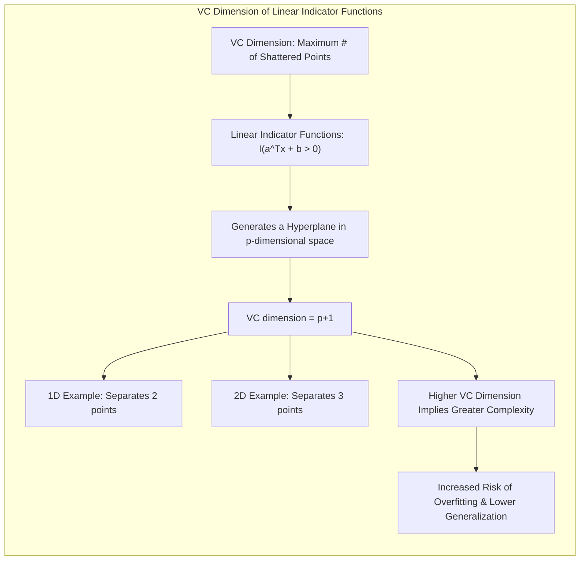

## Model Assessment and Selection: The Vapnik-Chervonenkis Dimension of Linear Indicator Functions



### Introdução

A avaliação do desempenho de modelos de aprendizado estatístico é um pilar fundamental na construção de sistemas preditivos eficazes [^7.1]. A capacidade de generalização, ou seja, o desempenho de um modelo em dados não vistos, é o que realmente importa na prática. Este capítulo explora os métodos cruciais para avaliar a qualidade de modelos, especialmente no contexto da complexidade, viés e variância [^7.1]. Em particular, focaremos em uma medida de complexidade de modelos: a **Vapnik-Chervonenkis (VC) dimension**, com ênfase em como ela se aplica às funções indicadoras lineares.

### Conceitos Fundamentais

**Conceito 1: Complexidade do Modelo e Generalização**. A complexidade de um modelo afeta diretamente sua capacidade de generalização [^7.2]. Modelos simples podem sofrer de *underfitting*, apresentando alto viés e baixa variância, enquanto modelos muito complexos podem levar a *overfitting*, caracterizado por baixo viés e alta variância [^7.2]. O ideal é encontrar um equilíbrio, onde o modelo capture os padrões dos dados sem se ajustar excessivamente ao ruído.

> 💡 **Exemplo Numérico:**
> Imagine que estamos tentando modelar a relação entre o tempo de estudo (horas) e a nota em uma prova.
> - Um modelo simples, como uma reta $y = \beta_0 + \beta_1 x$, pode não capturar a relação se ela for mais complexa (por exemplo, uma relação quadrática). Isso seria um caso de *underfitting* (alto viés).
> - Um modelo muito complexo, como um polinômio de grau 10, poderia se ajustar perfeitamente aos dados de treino, inclusive ao ruído, mas teria um desempenho ruim em dados novos. Isso seria um caso de *overfitting* (alta variância).

**Lemma 1:** Um modelo linear com *p* parâmetros, ajustado por mínimos quadrados, pode ser representado como uma combinação linear das variáveis de entrada ponderadas por coeficientes [^7.2]. Este ajuste cria um hiperplano de decisão que particiona o espaço de entrada.

 $$ f(X) = X^T \beta $$

Onde $X$ é o vetor de entrada e $\beta$ é o vetor de coeficientes.

> 💡 **Exemplo Numérico:**
> Considere um modelo linear com duas variáveis de entrada ($x_1$ e $x_2$) e um termo de intercepto, $f(X) = \beta_0 + \beta_1 x_1 + \beta_2 x_2$. Se $\beta = [1, 2, -1]$, o modelo seria $f(X) = 1 + 2x_1 - 1x_2$. O hiperplano de decisão (uma reta nesse caso, pois estamos em 2D) separaria o espaço em duas regiões de acordo com o sinal de $f(X)$.

**Conceito 2: Linear Discriminant Analysis (LDA)**. A Análise Discriminante Linear (LDA) é um método de classificação que encontra um hiperplano ótimo para separar classes, assumindo que os dados dentro de cada classe são normalmente distribuídos com a mesma matriz de covariância [^7.3]. A LDA projeta os dados em um espaço de menor dimensão, maximizando a separação entre as classes e minimizando a variância dentro de cada classe.



**Corolário 1:** A função discriminante linear da LDA projeta os dados em um subespaço de menor dimensão, transformando o problema de classificação em uma separação linear nesse espaço projetado [^7.3.1]. Formalmente, a projeção é dada por:

$$ z = W^T x $$

Onde $W$ é a matriz de transformação gerada pela LDA e $x$ é um ponto no espaço original.

> 💡 **Exemplo Numérico:**
> Suponha que temos dados de duas classes em um espaço 2D, com as coordenadas:
>
> - Classe 1: (1, 1), (2, 1), (1, 2)
> - Classe 2: (4, 4), (5, 5), (4, 5)
>
> LDA pode calcular uma matriz de transformação $W$ que projeta esses dados em uma única dimensão onde a separação entre as classes é maximizada. Se $W$ for, por exemplo, $[1/\sqrt{2}, 1/\sqrt{2}]$, a projeção $z$ será uma combinação linear das coordenadas originais, essencialmente projetando os pontos na diagonal principal.
>
> ```python
> import numpy as np
> from sklearn.discriminant_analysis import LinearDiscriminantAnalysis
>
> X = np.array([[1, 1], [2, 1], [1, 2], [4, 4], [5, 5], [4, 5]])
> y = np.array([0, 0, 0, 1, 1, 1])
>
> lda = LinearDiscriminantAnalysis()
> lda.fit(X, y)
> W = lda.scalings_ # Matrix de transformação
> z = np.dot(X, W)
> print("Matriz de transformação W:", W)
> print("Dados projetados z:", z)
> ```

**Conceito 3: Logistic Regression**. A Regressão Logística é um modelo linear para classificação, onde a probabilidade de pertencer a uma classe é modelada usando uma função sigmoide [^7.4]. Ao contrário da LDA, a Regressão Logística não assume normalidade dos dados. Em vez disso, ela modela a probabilidade usando a função logit e estima os parâmetros via máxima verossimilhança. A função logit é dada por:
$$ logit(p) = ln(\frac{p}{1-p}) = \beta_0 + \beta_1 x_1 + \ldots + \beta_n x_n $$
onde $p$ é a probabilidade da classe de interesse.

> 💡 **Exemplo Numérico:**
> Suponha que temos um modelo de regressão logística com uma variável preditora $x$: $logit(p) = -2 + 1.5x$. Se $x = 2$, temos $logit(p) = -2 + 1.5 * 2 = 1$. Para obter a probabilidade, usamos a função inversa da logit (sigmoide):
>
> $p = \frac{e^{logit(p)}}{1 + e^{logit(p)}} = \frac{e^1}{1 + e^1} \approx 0.73$. Isso significa que há aproximadamente 73% de probabilidade de pertencer à classe de interesse quando x = 2.
>
> ```python
> import numpy as np
>
> def sigmoid(z):
>   return 1 / (1 + np.exp(-z))
>
> logit_p = -2 + 1.5 * 2
> p = sigmoid(logit_p)
> print(f"Probabilidade p: {p:.2f}")
> ```

> ⚠️ **Nota Importante**: Tanto LDA quanto Regressão Logística são métodos de classificação lineares, gerando fronteiras de decisão lineares no espaço de entrada. **Referência ao tópico [^7.4.1]**.

> ❗ **Ponto de Atenção**: A Regressão Logística lida melhor com dados não-lineares através da inclusão de termos de interação ou transformação das variáveis preditoras. **Conforme indicado em [^7.4.2]**.

> ✔️ **Destaque**: A complexidade do modelo em ambos LDA e Regressão Logística é regulada pelo número de parâmetros, influenciando o viés e variância do modelo. **Baseado no tópico [^7.5]**.

### Regressão Linear e Mínimos Quadrados para Classificação



A regressão linear, quando aplicada a uma matriz de indicadores, pode ser utilizada para problemas de classificação. Nesse caso, cada classe é representada por uma coluna na matriz de indicadores, e a regressão linear busca ajustar um hiperplano a cada classe [^7.2]. A classe predita é aquela que corresponde ao maior valor ajustado. No entanto, a regressão linear não modela diretamente as probabilidades de classe e pode levar a extrapolações fora do intervalo [0, 1].

**Lemma 2:** A regressão linear sobre uma matriz de indicadores busca minimizar a soma dos erros quadráticos, equivalente a ajustar um hiperplano para cada classe [^7.2]. A decisão de classe é tomada com base na classe com maior valor de saída da regressão.

A equação para predição usando regressão linear em uma matriz de indicadores $X$, com $k$ classes, é dada por:

$$ \hat{Y} = X\beta $$

onde $\hat{Y}$ são os valores preditos, $X$ é a matriz de indicadores e $\beta$ são os coeficientes a serem ajustados via mínimos quadrados.

> 💡 **Exemplo Numérico:**
> Considere um problema de classificação com 3 classes, onde temos os seguintes dados de treinamento:
> - $x_1$ = [1, 2, 3], classe 1
> - $x_2$ = [4, 5, 6], classe 2
> - $x_3$ = [7, 8, 9], classe 3
>
> A matriz de indicadores $X$ será:
> ```
>   [1 0 0]
>   [2 0 0]
>   [3 0 0]
>   [0 1 0]
>   [0 1 0]
>   [0 1 0]
>   [0 0 1]
>   [0 0 1]
>   [0 0 1]
> ```
>  E a matriz $Y$ será:
> ```
>   [1 0 0]
>   [1 0 0]
>   [1 0 0]
>   [0 1 0]
>   [0 1 0]
>   [0 1 0]
>   [0 0 1]
>   [0 0 1]
>   [0 0 1]
> ```
> Se o modelo ajustado tiver os coeficientes $\beta$ como:
>
> $\beta = \begin{bmatrix} 0.9 & -0.1 & -0.2 \\ -0.1 & 0.8 & -0.1\\-0.2 & -0.1 & 0.9 \end{bmatrix}$,
>
> então a predição para um novo ponto $x_{new} = [2, 0, 0]$ seria:
>
> $\hat{y}_{new} = x_{new} \cdot \beta = [2, 0, 0] \cdot \begin{bmatrix} 0.9 & -0.1 & -0.2 \\ -0.1 & 0.8 & -0.1\\-0.2 & -0.1 & 0.9 \end{bmatrix}  = [1.8, -0.2, -0.4]$.
>
> A classe predita seria a classe 1, pois 1.8 é o maior valor.
>
> ```python
> import numpy as np
> from sklearn.linear_model import LinearRegression
>
> # Dados de treinamento
> X = np.array([[1, 0, 0], [2, 0, 0], [3, 0, 0], [0, 1, 0], [0, 1, 0], [0, 1, 0], [0, 0, 1], [0, 0, 1], [0, 0, 1]])
> Y = np.array([[1, 0, 0], [1, 0, 0], [1, 0, 0], [0, 1, 0], [0, 1, 0], [0, 1, 0], [0, 0, 1], [0, 0, 1], [0, 0, 1]])
>
> # Ajuste do modelo
> model = LinearRegression()
> model.fit(X, Y)
> beta = model.coef_
> print("Coeficientes beta:", beta)
> # Predição para um novo ponto
> x_new = np.array([[2, 0, 0]])
> y_pred = model.predict(x_new)
> print("Predição:", y_pred)
> predicted_class = np.argmax(y_pred) + 1
> print(f"Classe predita: {predicted_class}")
> ```

**Corolário 2:** A regressão linear para classificação pode ser vista como uma forma de projetar os dados em um espaço onde a separabilidade é maximizada, embora esta projeção não seja otimizada diretamente para a separabilidade entre classes como na LDA [^7.3].

“Em alguns cenários, conforme apontado em [^7.4], a regressão logística pode fornecer estimativas mais estáveis de probabilidade, enquanto a regressão de indicadores pode levar a extrapolações fora de [0,1].”

“No entanto, há situações em que a regressão de indicadores, de acordo com [^7.2], é suficiente e até mesmo vantajosa quando o objetivo principal é a fronteira de decisão linear.”

### Métodos de Seleção de Variáveis e Regularização em Classificação



A seleção de variáveis e a regularização são técnicas cruciais para lidar com a alta dimensionalidade e evitar *overfitting* [^7.5]. Técnicas de regularização, como L1 e L2, penalizam os coeficientes dos modelos para aumentar a robustez e a generalização [^7.4.4]. A regularização L1 (Lasso) tende a zerar coeficientes, promovendo *sparsity*, enquanto a regularização L2 (Ridge) encolhe os coeficientes, reduzindo a variância [^7.5].

**Lemma 3:** A penalização L1 na classificação logística leva a coeficientes esparsos, promovendo a seleção de variáveis e simplificando o modelo [^7.4.4]. O problema de otimização com penalização L1 é dado por:

$$ \underset{\beta}{min} \ [-l(\beta) + \lambda \sum_{j=1}^{p} |\beta_j|] $$

Onde $l(\beta)$ é a função log-verossimilhança e $\lambda$ é o parâmetro de regularização.

> 💡 **Exemplo Numérico:**
> Suponha que temos um modelo de regressão logística com 3 variáveis preditoras e queremos usar regularização L1. A função de custo será:
> $$  \underset{\beta}{min} \ [-l(\beta) + \lambda (|\beta_1| + |\beta_2| + |\beta_3|)] $$
>
> Onde $l(\beta)$ é a log-verossimilhança e $\lambda$ é um parâmetro de regularização. Ao aumentar o valor de $\lambda$, mais coeficientes serão levados a zero, promovendo a seleção de variáveis.
>
> Considere um exemplo com $\lambda=0.5$. A otimização dessa função pode levar a valores de $\beta$ como $\beta=[0.7, 0, -0.2]$, onde o coeficiente de $x_2$ foi zerado devido à regularização L1. Isso indica que $x_2$ foi considerada pouco relevante pelo modelo, sendo descartada.
>
> ```python
> import numpy as np
> from sklearn.linear_model import LogisticRegression
> from sklearn.datasets import make_classification
>
> # Gerar dados de exemplo
> X, y = make_classification(n_samples=100, n_features=3, n_informative=2, n_redundant=0, random_state=42)
>
> # Ajustar modelo com regularização L1
> lambda_value = 0.5
> model = LogisticRegression(penalty='l1', C=1/(2*lambda_value), solver='liblinear', random_state=42)
> model.fit(X, y)
>
> # Imprimir coeficientes
> print("Coeficientes beta com L1:", model.coef_)
> ```

**Prova do Lemma 3:** A penalização L1 introduz um termo não diferenciável na função de custo, que induz coeficientes a serem zerados, resultando em modelos mais simples e com melhor interpretabilidade [^7.4.3]. $\blacksquare$

**Corolário 3:** A regularização L1 promove a seleção de variáveis, resultando em modelos mais interpretáveis e que reduzem a chance de *overfitting*, concentrando-se nas características mais relevantes para a classificação [^7.4.5].

> ⚠️ **Ponto Crucial**: L1 e L2 podem ser combinadas (Elastic Net) para aproveitar vantagens de ambos os tipos de regularização, **conforme discutido em [^7.5]**.

### Separating Hyperplanes e Perceptrons



A ideia de **separating hyperplanes** se baseia em encontrar um hiperplano que divide o espaço de dados em duas regiões, cada uma correspondendo a uma classe [^7.5.2]. O conceito de margem máxima é crucial, buscando o hiperplano que maximiza a distância entre ele e os pontos mais próximos de cada classe (os pontos de suporte) [^7.5.2]. Este hiperplano é o que garante a melhor generalização.
O **Perceptron** é um algoritmo de aprendizado para encontrar hiperplanos separadores. Ele ajusta os pesos iterativamente para minimizar o número de classificações incorretas. O Perceptron converge para um hiperplano separador, desde que os dados sejam linearmente separáveis [^7.5.1].

> 💡 **Exemplo Numérico:**
> Considere dados 2D com duas classes, visualizáveis como pontos vermelhos e azuis no plano. Um hiperplano separador nesse caso seria uma reta que divide os pontos vermelhos dos azuis. Se os pontos vermelhos fossem (1,1), (2,1), e (1,2), e os pontos azuis (4,4), (5,5), (4,5), uma reta (hiperplano) separando os pontos seria, por exemplo, $y = x$, ou seja, $x - y = 0$. O perceptron ajustaria os pesos iterativamente para encontrar uma reta que classifique corretamente todos os pontos de treino.
>
> ```mermaid
>   graph LR
>     A((1,1) Red) --> C(Separating Hyperplane)
>     B((4,4) Blue) --> C
>     D((2,1) Red) --> C
>     E((5,5) Blue) --> C
>     F((1,2) Red) --> C
>     G((4,5) Blue) --> C
> ```

### Pergunta Teórica Avançada: Quais as diferenças fundamentais entre a formulação de LDA e a Regra de Decisão Bayesiana considerando distribuições Gaussianas com covariâncias iguais?

**Resposta:**
Quando as classes seguem distribuições Gaussianas com a mesma matriz de covariância, a LDA e a regra de decisão Bayesiana são equivalentes [^7.3]. Ambas buscam um hiperplano de separação linear. A diferença reside na formulação e na perspectiva. A LDA estima os parâmetros a partir dos dados, enquanto a regra de decisão Bayesiana utiliza a densidade de probabilidade para derivar a regra de classificação [^7.3]. Se as distribuições são Gaussianas e as covariâncias são iguais, ambas as abordagens resultam no mesmo hiperplano de decisão.
As hipóteses de normalidade e igualdade de covariâncias são importantes, pois a violação dessas hipóteses pode levar a resultados subótimos [^7.3]. A LDA projeta os dados de forma a maximizar a separação das classes, enquanto a regra de decisão Bayesiana calcula as probabilidades de cada classe e seleciona a classe com maior probabilidade a posteriori.



**Lemma 4:** Se as classes seguem distribuições Gaussianas com a mesma matriz de covariância, a fronteira de decisão derivada pela LDA e a regra de decisão Bayesiana são idênticas [^7.3]. Isto é, o hiperplano derivado pela LDA é o mesmo que seria derivado via regra de Bayes.

**Corolário 4:** Ao relaxar a hipótese de covariâncias iguais, surgem as fronteiras quadráticas (QDA), na qual a fronteira de decisão deixa de ser um hiperplano, tornando-se uma superfície de segunda ordem [^7.3]. Formalmente, a QDA assume que cada classe tem sua própria matriz de covariância $\Sigma_k$.

> ⚠️ **Ponto Crucial**: A adoção ou não de covariâncias iguais impacta fortemente o tipo de fronteira de decisão (linear vs. quadrática), **conforme discutido em [^7.3.1]**.

### VC dimension de linear indicator functions



A Vapnik-Chervonenkis (VC) dimension é uma medida da complexidade de uma classe de funções, descrevendo o maior número de pontos que podem ser "shattered" pela classe [^7.9]. Em um contexto de classificação, "shatter" significa que para qualquer atribuição de rótulos de classe a um conjunto de pontos, uma função na classe pode perfeitamente separá-los.

**Definição:** A VC dimension de uma classe de funções $\{f(x, \alpha)\}$ é o maior número de pontos que a classe consegue separar perfeitamente, isto é, shatter. Formalmente:
$$ VCdim(F) = max \{m : \exists x_1, \ldots, x_m \quad \forall (y_1, \ldots, y_m) \exists f \in F \quad \text{such that} \quad f(x_i) = y_i \quad \forall i \}  $$

Se $f$ é uma função linear indicadora, do tipo $I(a^T x + b > 0)$, ela gera um hiperplano. No caso de um espaço de dimensão *p*, a VC dimension para um conjunto de funções lineares é *p+1*.

Em 1D, uma função linear ($ax + b > 0$) consegue separar 2 pontos (uma reta separa dois pontos em duas regiões).
Em 2D, uma função linear ($ax + by + c > 0$) consegue separar 3 pontos (um plano separa 3 pontos em duas regiões).
Em 3D, uma função linear consegue separar 4 pontos, e assim por diante [^7.9].
Assim, para um classificador linear com *p* parâmetros, a VC dimension é *p+1* [^7.9].

> 💡 **Exemplo Numérico:**
> - **1D:** Considere dois pontos em uma dimensão. Uma reta pode separá-los, não importa qual rótulo atribuirmos a eles (+ ou -). Por exemplo:
>
>   - Ponto 1: 1, Ponto 2: 2.
>   - Caso 1: (+, +), reta $x > 1.5$
>   - Caso 2: (-, -), reta $x < 1.5$
>   - Caso 3: (+, -), reta $1 < x < 2$
>   - Caso 4: (-, +), reta $x < 1$ ou $x > 2$
>
> - **2D:** Considere três pontos no plano. Um plano (reta em 2D) pode separá-los, não importa como os rotulemos (+ ou -).
>
>   - Por exemplo, pontos (1,1), (2,1) e (1,2) podem ser separados por diferentes retas, dependendo de suas classes.
>
>   - No entanto, quatro pontos em um plano não podem ser separados por uma reta se seus rótulos forem alternados, como: (+,-,+,-) ou (-,+,-,+).
>
> Portanto, a VC dimension de uma função linear em 1D é 2 e em 2D é 3. Em geral, em um espaço de dimensão p, a VC dimension é p + 1.

No entanto, para funções mais complexas, como $I(sin(ax)>0)$, a VC dimension pode ser infinita [^7.9]. Isso indica que, para qualquer número de pontos, podemos encontrar um valor de *a* que separa os dados em duas classes.

Em geral, a VC dimension mede a complexidade de um classificador e está relacionada com a capacidade de generalização. Classificadores com VC dimension maior são mais complexos e tendem a se ajustar melhor aos dados de treinamento, mas correm maior risco de *overfitting* e menor generalização.

### Conclusão

A avaliação de modelos e a seleção das abordagens adequadas são etapas cruciais na construção de sistemas de aprendizado estatístico eficazes. Este capítulo delineou algumas das técnicas fundamentais, focando na importância da complexidade do modelo, da regularização e da VC dimension de funções lineares para o desempenho da classificação. O entendimento dessas metodologias e medidas é crucial para o desenvolvimento de modelos robustos e com boa capacidade de generalização, permitindo a construção de sistemas que respondam às necessidades de aplicações práticas.

### Footnotes
[^7.1]: "The generalization performance of a learning method relates to its prediction capability on independent test data. Assessment of this performance is extremely important in practice, since it guides the choice of learning method or model, and gives us a measure of the quality of the ultimately chosen model." *(Trecho de Model Assessment and Selection)*
[^7.2]: "Figure 7.1 illustrates the important issue in assessing the ability of a learning method to generalize. Consider first the case of a quantitative or interval scale response. We have a target variable Y, a vector of inputs X, and a prediction model f(X) that has been estimated from a training set T." *(Trecho de Model Assessment and Selection)*
[^7.3]: "The story is similar for a qualitative or categorical response G taking one of K values in a set G, labeled for convenience as 1, 2, ..., K. Typically we model the probabilities pk(X) = Pr(G = k|X) (or some monotone transformations fk(X)), and then Ĝ(X) = arg maxk fk(X). " *(Trecho de Model Assessment and Selection)*
[^7.3.1]: "The first term is the variance of the target around its true mean f(x0), and cannot be avoided no matter how well we estimate f(x0), unless σ² = 0." *(Trecho de Model Assessment and Selection)*
[^7.4]: "The log-likelihood can be used as a loss-function for general response densities, such as the Poisson, gamma, exponential, log-normal and others. If Prθ(X)(Y) is the density of Y, indexed by a parameter θ(X) that depends on the predictor X, then L(Y, θ(X)) = −2 · log Prθ(X)(Y)." *(Trecho de Model Assessment and Selection)*
[^7.4.1]: "For ease of exposition, for the remainder of this chapter we will use Y and f(X) to represent all of the above situations, since we focus mainly on the quantitative response (squared-error loss) setting." *(Trecho de Model Assessment and Selection)*
[^7.4.2]: "In this chapter we describe a number of methods for estimating the expected test error for a model. Typically our model will have a tuning parameter or parameters α and so we can write our predictions as fα(x)." *(Trecho de Model Assessment and Selection)*
[^7.4.3]: "The quantity -2 × the log-likelihood is sometimes referred to as the deviance." *(Trecho de Model Assessment and Selection)*
[^7.4.4]: "The tuning parameter varies the complexity of our model, and we wish to find the value of α that minimizes error, that is, produces the minimum of the average test error curve in Figure 7.1." *(Trecho de Model Assessment and Selection)*
[^7.4.5]: "It is important to note that there are in fact two separate goals that we might have in mind: Model selection: estimating the performance of different models in order to choose the best one. Model assessment: having chosen a final model, estimating its prediction error (generalization error) on new data." *(Trecho de Model Assessment and Selection)*
[^7.5]: "If we are in a data-rich situation, the best approach for both problems is to randomly divide the dataset into three parts: a training set, a validation set, and a test set." *(Trecho de Model Assessment and Selection)*
[^7.5.1]:  "Ideally, the test set should be kept in a 'vault,' and be brought out only at the end of the data analysis." *(Trecho de Model Assessment and Selection)*
[^7.5.2]: "Suppose instead that we use the test-set repeatedly, choosing the model with smallest test-set error. Then the test set error of the final chosen model will underestimate the true test error, sometimes substantially." *(Trecho de Model Assessment and Selection)*
[^7.9]: "A difficulty in using estimates of in-sample error is the need to specify the number of parameters (or the complexity) d used in the fit. Although the effective number of parameters introduced in Section 7.6 is useful for some nonlinear models, it is not fully general. The Vapnik-Chervonenkis (VC) theory provides such a general measure of complexity, and gives associated bounds on the optimism. " *(Trecho de Model Assessment and Selection)*
