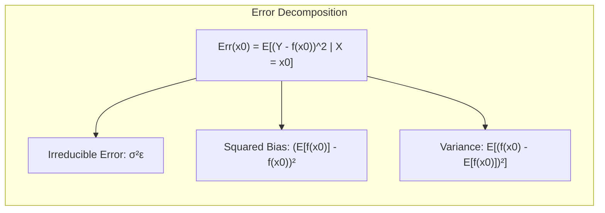
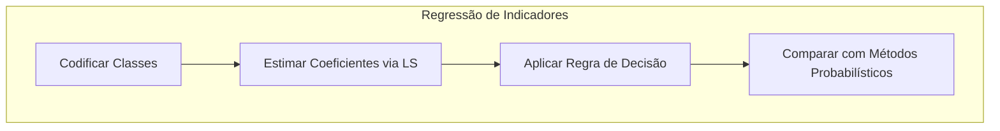
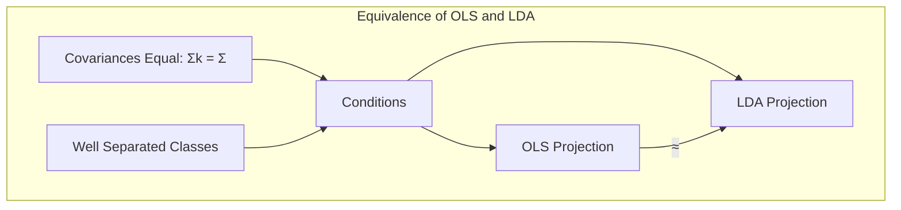
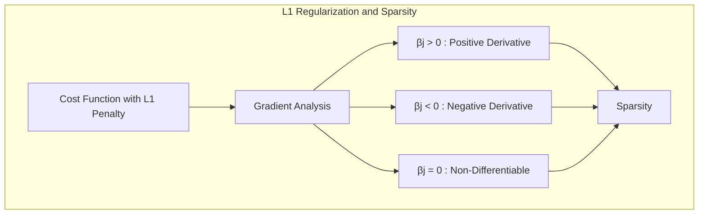
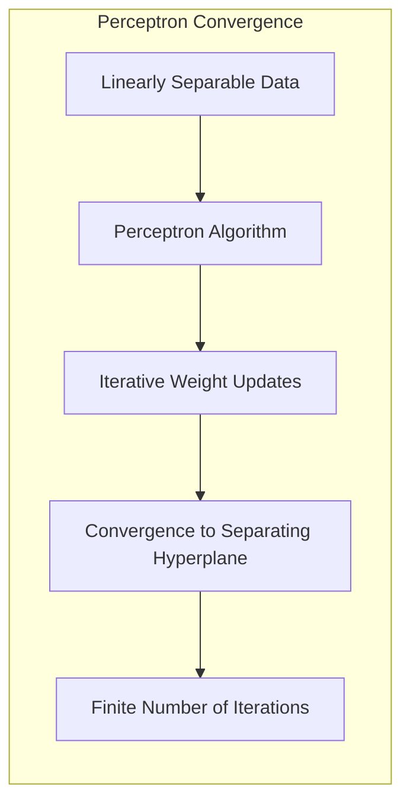
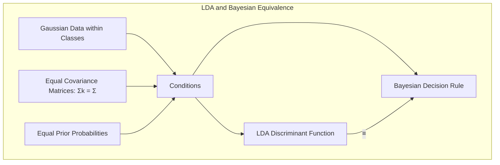
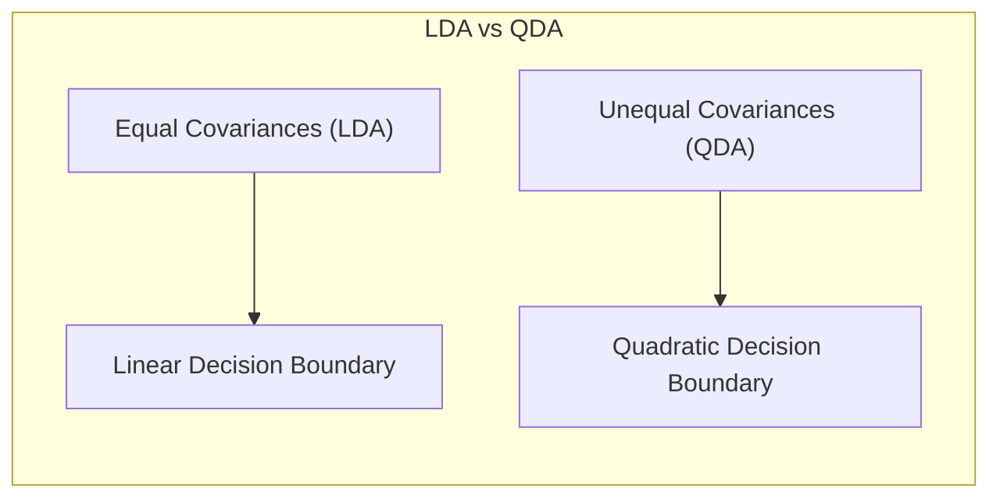

## Model Assessment and Selection with Focus on the VC Dimension
<imagem: Um mapa mental que conecta os conceitos de bias-variância, métodos de avaliação de modelos (AIC, BIC, cross-validation, bootstrap), e a complexidade do modelo (VC dimension) e sua relação com o erro de generalização.>

### Introdução
A capacidade de um modelo de aprendizado de generalizar, ou seja, de fazer previsões precisas em dados não vistos, é um fator crítico na sua eficácia. A avaliação desta capacidade é essencial para orientar a seleção do modelo adequado e para quantificar a qualidade do modelo escolhido [^7.1]. Este capítulo aborda metodologias para a avaliação de desempenho de modelos, com foco em como essas metodologias são empregadas na seleção de modelos, explorando a relação entre bias, variância e a complexidade do modelo, tendo a **VC dimension** como um dos principais indicadores de complexidade [^7.1].

### Conceitos Fundamentais

**Conceito 1: Generalização e Erro de Predição**

O problema de classificação, em um contexto mais amplo de aprendizado estatístico, é sobre criar um modelo $f(X)$ que mapeie um vetor de entradas $X$ para uma saída $Y$. O objetivo é minimizar o erro entre as predições do modelo e os valores reais de $Y$. Métodos lineares são uma classe de modelos que buscam uma função de decisão linear para separar as classes, o que pode introduzir um certo viés (bias) se a relação entre $X$ e $Y$ for não linear, por exemplo. Este viés, juntamente com a variância, que é a sensibilidade do modelo aos dados de treino, são os principais componentes do erro de generalização [^7.2]. O viés é a diferença entre a previsão média do modelo e o valor verdadeiro, e a variância é a variabilidade das previsões do modelo em diferentes conjuntos de dados de treinamento. Há um trade-off entre bias e variância, de modo que modelos muito simples tendem a ter alto bias e baixa variância, enquanto modelos muito complexos têm baixo bias e alta variância [^7.2].
$$ L(Y, f(X)) = (Y - f(X))^2 $$
Esta fórmula representa o **squared error**, uma métrica comum para medir a discrepância entre as predições e os valores reais.

**Lemma 1:** Decomposição do Erro de Predição
O erro de predição de um modelo, quando avaliado em um conjunto de teste independente, pode ser decomposto em um termo irredutível (variance do erro aleatório), o quadrado do bias e a variância do modelo. Esta decomposição é fundamental para entender as fontes de erro e como controlá-las [^7.3].
Seja $Y = f(X) + \epsilon$, onde $E[\epsilon] = 0$ e $Var(\epsilon) = \sigma^2_{\epsilon}$. O erro de predição esperado para um ponto de entrada $x_0$ pode ser decomposto como:
$$ Err(x_0) = E[(Y - f(x_0))^2|X = x_0] = \sigma^2_{\epsilon} + [Ef(x_0) - f(x_0)]^2 + E[f(x_0) - Ef(x_0)]^2 $$
onde $Ef(x_0)$ é o valor esperado da previsão do modelo, o termo $[Ef(x_0) - f(x_0)]^2$ representa o bias quadrado do modelo e o termo $E[f(x_0) - Ef(x_0)]^2$ representa a variância do modelo.
$\blacksquare$

> 💡 **Exemplo Numérico:** Suponha que temos um modelo linear que tenta aproximar uma relação quadrática. Vamos considerar um ponto de entrada $x_0 = 2$, e o valor real $f(x_0) = 7$. Nosso modelo linear, devido à sua simplicidade, tem uma previsão média $Ef(x_0) = 5$. Vamos também assumir que quando treinamos o modelo em diferentes datasets, a variância das previsões é $E[f(x_0) - Ef(x_0)]^2 = 1$. Se a variância do erro aleatório $\sigma^2_{\epsilon} = 0.5$, podemos calcular o erro total em $x_0$:
>
> $Err(x_0) = 0.5 + (5 - 7)^2 + 1 = 0.5 + 4 + 1 = 5.5$.
>
> Neste exemplo, o bias (2) é a maior contribuição para o erro, indicando que o modelo linear é muito simplista para capturar a relação quadrática subjacente. A variância é relativamente pequena, mostrando que o modelo é estável em diferentes datasets.

**Conceito 2: Linear Discriminant Analysis (LDA)**

LDA é um método de classificação linear que assume que as classes seguem distribuições Gaussianas com covariâncias iguais [^7.3]. O objetivo do LDA é encontrar uma projeção linear que maximize a separação entre as classes e minimize a variância dentro de cada classe [^7.3.1]. A fronteira de decisão no LDA é linear, o que simplifica a tarefa de classificação, mas pode ser inadequada se as classes forem não linearmente separáveis. O LDA é derivado da regra de decisão Bayesiana sob certas suposições, e sua função discriminante linear pode ser vista como uma projeção dos dados em um subespaço de dimensão reduzida, o que também leva ao conceito de regularização de modelos. A aplicação de LDA requer o cálculo da média e da covariância para cada classe, conforme detalhado em [^7.3.2] e [^7.3.3].
> 💡 **Exemplo Numérico:** Considere um problema de classificação com duas classes, onde cada classe é caracterizada por duas features. A classe 1 tem média $\mu_1 = [1, 1]^T$ e a classe 2 tem média $\mu_2 = [3, 3]^T$. Assumindo que ambas as classes compartilham a mesma matriz de covariância $\Sigma = \begin{bmatrix} 1 & 0.5 \\ 0.5 & 1 \end{bmatrix}$, o LDA buscará um hiperplano (neste caso, uma linha) que melhor separa as duas classes, projetando os dados em um espaço de uma dimensão.

**Corolário 1:** Projeção de Subespaços e Dimensionalidade
Dado um problema de classificação com $K$ classes, as funções discriminantes lineares do LDA definem $K-1$ projeções linearmente independentes. Esta propriedade está intimamente ligada ao conceito de redução de dimensionalidade, onde os dados originais podem ser representados em um subespaço de menor dimensão, mantendo a capacidade de discriminar entre as classes, conforme indicado em [^7.3.1]. Isto está alinhado com o conceito de que o número de parâmetros de um modelo está relacionado com a sua complexidade.

> 💡 **Exemplo Numérico:** Se temos um problema de classificação com 3 classes (K=3) usando LDA, o LDA projetará os dados para um subespaço de dimensão 2 (K-1 = 2), o que significa que os dados podem ser representados em um plano, permitindo a visualização e classificação em 2D, mesmo que os dados originais estivessem em um espaço de maior dimensão.

**Conceito 3: Logistic Regression**

Logistic Regression é outro método de classificação linear, mas, diferentemente do LDA, não faz suposições sobre as distribuições das entradas $X$ [^7.4]. Ele modela a probabilidade de pertinência a uma classe usando a função sigmoide (logit) e estima os parâmetros do modelo através da maximização da verossimilhança. A Logistic Regression é flexível e é amplamente utilizada em problemas de classificação binária ou multiclasse. A verossimilhança, um conceito central na regressão logística, quantifica o quão bem o modelo se ajusta aos dados observados, e o objetivo é encontrar os parâmetros que maximizem esta verossimilhança. Os parâmetros são otimizados através de técnicas de otimização numérica [^7.4.1] e [^7.4.2].
$$ \text{logit}(p(x)) = \ln(\frac{p(x)}{1-p(x)}) = \beta_0 + \beta_1x_1 + \beta_2x_2 + \ldots + \beta_nx_n $$
A fórmula acima representa a função **logit** que transforma uma probabilidade $p(x)$ em uma escala linear.
> ⚠️ **Nota Importante**: Na Logistic Regression, a função logit é utilizada para modelar a relação entre as probabilidades de classe e as variáveis preditoras [^7.4.1].
> ❗ **Ponto de Atenção**: Modelos logísticos podem lidar com classes desbalanceadas, embora ajustes e cuidados possam ser necessários [^7.4.2].
> ✔️ **Destaque**: Tanto o LDA quanto a Logistic Regression são métodos de classificação linear, mas o LDA assume normalidade dos dados, enquanto a regressão logística é mais flexível e não faz essa suposição. [^7.5]
> 💡 **Exemplo Numérico:** Suponha que temos duas classes (0 e 1) e um único preditor $x$. Após o treinamento de um modelo de regressão logística, obtemos os seguintes parâmetros: $\beta_0 = -3$ e $\beta_1 = 1$. Se tivermos um ponto de dado $x=2$, a função logit será: $\text{logit}(p(x)) = -3 + 1*2 = -1$. Para obter a probabilidade, precisamos usar a função inversa do logit (a função sigmoide): $p(x) = \frac{1}{1 + e^{-(-1)}} \approx 0.269$. Assim, a probabilidade estimada de um ponto com x=2 pertencer à classe 1 é de aproximadamente 27%.

### Regressão Linear e Mínimos Quadrados para Classificação
<imagem: Diagrama que ilustra como a regressão linear é aplicada à classificação, começando com a codificação das classes, seguida pela estimativa dos coeficientes via mínimos quadrados, a aplicação de uma regra de decisão, e finalmente uma comparação com os métodos probabilísticos. Este diagrama tem como objetivo ilustrar o processo de transformação de um problema de classificação em um problema de regressão linear, e suas limitações.>

A regressão linear pode ser aplicada à classificação através da codificação das classes em uma matriz indicadora. No caso de duas classes, por exemplo, uma classe pode ser codificada como 0 e a outra como 1, sendo o modelo de regressão linear utilizado para prever a probabilidade de um ponto pertencer a uma das classes. No entanto, esta abordagem tem limitações, uma vez que as predições do modelo de regressão linear podem estar fora do intervalo [0,1], e as suposições de normalidade e homocedasticidade podem não ser satisfeitas. A regressão linear para classificação assume que a fronteira de decisão é linear. O método dos mínimos quadrados (OLS) é utilizado para estimar os parâmetros, mas isso pode ser sensível a outliers e a casos de multicolinearidade.
> 💡 **Exemplo Numérico:** Vamos considerar um conjunto de dados com duas classes, onde a classe 0 é representada por $y=0$ e a classe 1 por $y=1$. Temos dois pontos de dados: $(x_1=1, y_1=0)$ e $(x_2=2, y_2=1)$. Usando regressão linear com uma única variável, buscamos uma função $f(x) = \beta_0 + \beta_1 x$. O método dos mínimos quadrados encontra os parâmetros $\beta_0$ e $\beta_1$ que minimizam a soma dos erros quadrados: $\sum_{i=1}^2(y_i - (\beta_0 + \beta_1 x_i))^2$. Resolvendo o problema de mínimos quadrados, encontramos $\beta_0 = -0.5$ e $\beta_1 = 0.5$. Portanto, nosso modelo é $f(x) = -0.5 + 0.5x$. Para classificar um novo ponto $x=1.5$, calculamos $f(1.5) = -0.5 + 0.5*1.5 = 0.25$. Como este valor está entre 0 e 1, interpretamos como a probabilidade de pertencer à classe 1. Contudo, é importante notar que para valores de $x$ fora do range do treinamento, esta regressão poderia predizer valores fora do intervalo [0,1], uma limitação da regressão linear para classificação.

**Lemma 2:** Equivalência em Condições Restritas
Em condições específicas, como quando as covariâncias dentro das classes são iguais e as classes são bem separadas, as projeções de decisão nos hiperplanos gerados por regressão linear se aproximam das projeções geradas por LDA. Esta equivalência é uma observação teórica importante que conecta abordagens distintas de classificação.
$$ \text{Se } \Sigma_k = \Sigma \text{ e } \text{as classes estiverem bem separadas, então } \text{projeção}_{\text{OLS}} \approx \text{projeção}_{\text{LDA}} $$
$\blacksquare$


**Corolário 2:** Simplificação da Análise
Sob as condições do Lemma 2, a análise dos modelos de regressão linear para classificação pode ser simplificada, em termos de análise da fronteira de decisão. Esta observação teórica reduz o problema de classificação ao problema de projeção de dados e análise da função discriminante.
Em situações onde os dados são bem comportados e as classes linearmente separáveis, a regressão linear pode ser suficiente e vantajosa, com a sua maior interpretabilidade.

A regressão linear em matriz de indicadores, apesar de simples e de fácil implementação, sofre de alguns problemas como o "masking problem", que consiste na dificuldade em identificar quais variáveis são realmente importantes para a classificação. Adicionalmente, ela pode não ser a melhor escolha para modelar probabilidades de classes [^7.2].
> ⚠️ **Nota Importante**: A regressão linear pode levar a extrapolações fora do intervalo [0,1], o que é uma limitação ao seu uso em classificação probabilística.
> ❗ **Ponto de Atenção**: Em cenários onde a fronteira de decisão não é linear, a regressão de indicadores pode ter um desempenho inferior aos métodos que podem modelar fronteiras mais complexas.
"A regressão de indicadores, de acordo com [^7.2], é suficiente quando o objetivo principal é a fronteira de decisão linear."

### Métodos de Seleção de Variáveis e Regularização em Classificação
<imagem: Um mapa mental mostrando a relação entre os métodos de seleção de variáveis e regularização (L1, L2, Elastic Net) dentro do contexto da classificação. O mapa mental também relaciona estes conceitos com LDA, logistic regression, e hyperplanes, demonstrando as interconexões entre abordagens de classificação e como a regularização afeta o desempenho do modelo.>
Métodos de seleção de variáveis e regularização são utilizados para melhorar a capacidade de generalização e interpretabilidade dos modelos de classificação [^7.4.4]. A regularização L1 (Lasso) promove a esparsidade dos parâmetros, forçando alguns a serem exatamente zero, selecionando um subconjunto de variáveis relevantes [^7.5.1]. Já a regularização L2 (Ridge) encolhe os coeficientes em direção a zero, o que reduz a complexidade do modelo e o torna mais estável [^7.4.4]. A Elastic Net combina as penalizações L1 e L2, buscando equilibrar esparsidade e estabilidade [^7.5].
A regularização se encaixa na formulação da função de custo através de termos de penalização, que são adicionados à função de verossimilhança ou erro.
> 💡 **Exemplo Numérico:** Vamos assumir uma regressão logística com 3 preditores: $x_1$, $x_2$, e $x_3$. Sem regularização, o modelo poderia aprender coeficientes como $\beta_1=2.5$, $\beta_2=-1.8$, e $\beta_3=0.7$.
> - Com regularização L1 (Lasso), para um dado parâmetro $\lambda$, o modelo tenderá a forçar alguns coeficientes a zero, resultando em algo como $\beta_1=2$, $\beta_2=0$, e $\beta_3=0.5$. Isso significa que a variável $x_2$ foi considerada menos importante e efetivamente "removida" do modelo.
> - Com regularização L2 (Ridge), os coeficientes serão encolhidos, resultando em algo como $\beta_1=1.5$, $\beta_2=-1$, e $\beta_3=0.4$. Todos os preditores são mantidos, mas com magnitudes menores.
> - Elastic Net combinaria os efeitos de L1 e L2, resultando em uma combinação de esparsidade e encolhimento. Por exemplo, $\beta_1=1.8$, $\beta_2=-0.2$, e $\beta_3=0.3$. O efeito de L1 induziu um pequeno grau de esparsidade.

**Lemma 3:** Esparsidade com Penalização L1
A penalização L1 em classificação logística leva a coeficientes esparsos, ou seja, muitos coeficientes do modelo serão exatamente zero, selecionando um subconjunto das variáveis originais. A prova deste lemma envolve a análise do gradiente da função de custo com a penalização L1. Para coeficientes positivos $\beta_j > 0$, a derivada da penalidade L1 é um valor positivo constante. Para coeficientes negativos $\beta_j < 0$, a derivada é um valor negativo constante. No ponto $\beta_j = 0$, a derivada não existe. Por isso, a otimização da função objetivo com penalidade L1 leva os coeficientes a zero ou a um valor diferente de zero dependendo dos outros termos da função objetivo [^7.4.4].
$\blacksquare$


**Prova do Lemma 3:**
A função de custo com regularização L1 para regressão logística é:
$$ J(\beta) = - \frac{1}{N} \sum_{i=1}^N [y_i \log(p(x_i)) + (1-y_i) \log(1-p(x_i))] + \lambda \sum_{j=1}^p |\beta_j| $$
onde $\lambda$ é o parâmetro de regularização. O termo de penalização L1 $\lambda \sum_{j=1}^p |\beta_j|$ força os coeficientes a serem exatamente zero quando $\lambda$ é suficientemente grande. A otimização desta função é feita por métodos que lidam com não diferenciabilidade como o subgradiente. Quando o gradiente da verossimilhança é igual e oposto ao subgradiente da penalidade L1, o coeficiente $\beta_j$ será exatamente zero [^7.4.3].
$\blacksquare$
> 💡 **Exemplo Numérico:** Suponha que a função de custo para o nosso modelo logístico, antes da regularização L1 seja $J(\beta) = -L(\beta)$, onde $L$ é a função de verossimilhança (negativa). Suponha que após o treinamento sem regularização, temos um coeficiente $\beta_1 = 0.5$. Se adicionarmos a penalização L1 com $\lambda = 1$, nossa nova função de custo é $J'(\beta) = -L(\beta) + 1 * |\beta_1|$. Durante o treinamento com regularização, a otimização tentará diminuir o termo $-L(\beta)$ e, ao mesmo tempo, reduzir a magnitude de $\beta_1$ devido ao termo de penalização. Se para outro coeficiente, digamos, $\beta_2 = 0.1$, o valor absoluto da derivada de $-L(\beta)$ em $\beta_2$ for menor que a penalidade $1*|1|=1$, o algoritmo levará este coeficiente $\beta_2$ para zero. Este mecanismo força a esparsidade e elimina variáveis irrelevantes.
> 💡 **Código Python:**
> ```python
> import numpy as np
> from sklearn.linear_model import LogisticRegression
> from sklearn.model_selection import train_test_split
> from sklearn.metrics import accuracy_score
>
> # Generate synthetic data
> np.random.seed(42)
> X = np.random.rand(100, 5)  # 100 samples, 5 features
> y = np.random.randint(0, 2, 100) # Binary classification
>
> # Split into training and test sets
> X_train, X_test, y_train, y_test = train_test_split(X, y, test_size=0.3, random_state=42)
>
> # Logistic Regression without L1
> model_no_l1 = LogisticRegression(penalty=None, solver='lbfgs', max_iter=1000)
> model_no_l1.fit(X_train, y_train)
> y_pred_no_l1 = model_no_l1.predict(X_test)
>
> # Logistic Regression with L1 (Lasso)
> model_l1 = LogisticRegression(penalty='l1', solver='liblinear', C=0.5, random_state=42) # C is inverse of lambda
> model_l1.fit(X_train, y_train)
> y_pred_l1 = model_l1.predict(X_test)
>
> print("Coefficients without L1:", model_no_l1.coef_)
> print("Coefficients with L1:", model_l1.coef_)
> print("Accuracy without L1:", accuracy_score(y_test, y_pred_no_l1))
> print("Accuracy with L1:", accuracy_score(y_test, y_pred_l1))
> ```
>
>  Neste exemplo, é visível que a regularização L1 (Lasso) leva a alguns coeficientes sendo exatamente zero, o que facilita a interpretação do modelo e potencialmente melhora a generalização.

**Corolário 3:** Interpretabilidade dos Modelos
A esparsidade dos coeficientes induzida pela penalização L1 resulta em modelos mais fáceis de interpretar, pois apenas as variáveis mais relevantes são mantidas [^7.4.5]. Isto é particularmente útil em contextos com muitas variáveis, onde se busca identificar os fatores mais importantes para a classificação.
> ⚠️ **Ponto Crucial**: A Elastic Net combina as vantagens das penalizações L1 e L2 para se beneficiar da esparsidade e estabilidade, conforme discutido em [^7.5].

### Separating Hyperplanes e Perceptrons

A ideia de maximizar a margem de separação entre as classes leva ao conceito de hiperplanos ótimos. A ideia é encontrar um hiperplano que separe as classes com a maior distância possível entre o hiperplano e os pontos mais próximos de cada classe, os chamados vetores de suporte [^7.5.2]. Este hiperplano ótimo pode ser obtido resolvendo um problema de otimização que envolve maximizar a margem de separação, o que é usualmente resolvido no espaço dual, via dual de Wolfe. A solução para este problema de otimização é uma combinação linear dos vetores de suporte. O Perceptron de Rosenblatt é um algoritmo de aprendizado que também busca um hiperplano separador, utilizando uma abordagem iterativa baseada em correção de erros [^7.5.1].

O Perceptron converge se os dados forem linearmente separáveis.
**Teorema:** Convergência do Perceptron
Se os dados de treinamento forem linearmente separáveis, então o algoritmo do Perceptron irá convergir para uma solução (um hiperplano separador) em um número finito de iterações [^7.5.1].
A prova deste teorema envolve a análise da evolução dos pesos do Perceptron a cada iteração, mostrando que a distância entre os pesos e a solução ótima diminui a cada iteração.
$\blacksquare$

> 💡 **Exemplo Numérico:** Imagine que temos duas classes de dados em 2D, onde a classe 1 possui pontos como $(1, 2)$ e $(2, 1)$, e a classe -1 tem pontos como $(-1, -2)$ e $(-2, -1)$. Um Perceptron começaria com um hiperplano inicial (uma linha) aleatório. Por exemplo, a linha dada por $\omega_0 = 0$, $\omega_1 = 1$ e $\omega_2 = 0$, o que significa que o hiperplano é dado por $\omega_0 + \omega_1 x_1 + \omega_2 x_2 = 0$, ou $x_1 = 0$. O Perceptron irá iterativamente atualizar os pesos do hiperplano $\omega$ até que ele separe as classes corretamente. Suponha que o ponto $(1,2)$ seja classificado incorretamente. A atualização dos pesos será feita por $\omega_{novo} = \omega_{velho} + \eta * y * x$, onde $\eta$ é a taxa de aprendizagem, $y$ é o rótulo verdadeiro e $x$ é o ponto de dados. Após um número finito de iterações, e assumindo que os dados são linearmente separáveis, o Perceptron irá encontrar um hiperplano que separa as classes corretamente, por exemplo, a linha $x_1 + x_2 = 0$.

### Pergunta Teórica Avançada: Quais as diferenças fundamentais entre a formulação de LDA e a Regra de Decisão Bayesiana considerando distribuições Gaussianas com covariâncias iguais?
**Resposta:**
Ambos, LDA e a Regra de Decisão Bayesiana (quando assumimos Gaussianas com covariâncias iguais), são modelos de classificação baseados em distribuições Gaussianas para os dados de entrada, mas a sua abordagem e objetivos diferem ligeiramente.
Sob a suposição de que as classes seguem distribuições Gaussianas com covariâncias iguais, as funções discriminantes resultantes da Regra de Decisão Bayesiana são lineares, o que coincide com a premissa do LDA. No entanto, o LDA é frequentemente usado como um método de projeção linear de dimensionalidade reduzida antes da classificação, enquanto a regra de decisão Bayesiana fornece uma classificação direta com base nas probabilidades posteriores. O LDA deriva seu hiperplano separador da otimização da razão de variância interclasse para variância intraclasse, enquanto a regra de decisão Bayesiana calcula a probabilidade posterior de cada classe. Ambos são equivalentes em certos casos, quando se assume que as classes seguem distribuições Gaussianas com mesma covariância, mas se relaxarmos esta última hipótese, então o LDA ainda provê um classificador linear enquanto a regra de decisão Bayesiana levará a classificadores de fronteiras quadráticas.

**Lemma 4:** Equivalência Formal LDA e Bayes
Sob a hipótese de que os dados dentro de cada classe seguem uma distribuição Gaussiana com a mesma matriz de covariância (i.e., $\Sigma_k = \Sigma$) e as probabilidades a priori de cada classe são iguais, então a função discriminante do LDA é equivalente à decisão Bayesiana [^7.3], [^7.3.3].
$\blacksquare$

> 💡 **Exemplo Numérico:**  Suponha que as classes k=1 e k=2 seguem uma distribuição normal bivariada com médias $\mu_1 = [1, 2]^T$ e $\mu_2 = [3, 4]^T$ respectivamente, e ambas as classes têm a mesma matriz de covariância $\Sigma = \begin{bmatrix} 1 & 0 \\ 0 & 1 \end{bmatrix}$.  Se as probabilidades a priori das classes são iguais, digamos $\pi_1 = \pi_2 = 0.5$, tanto o LDA quanto a regra de decisão Bayesiana, sob estas condições, levam ao mesmo hiperplano separador, ou seja, um classificador linear. Isto é, a fronteira de decisão será uma linha reta, exatamente a mesma que seria obtida usando o LDA.

**Corolário 4:** Fronteiras Quadráticas (QDA)
Se relaxarmos a hipótese de covariâncias iguais entre as classes, a regra de decisão Bayesiana leva a fronteiras de decisão quadráticas (QDA), um classificador mais geral que o LDA, com mais parâmetros, o que leva a um trade-off entre complexidade e precisão. [^7.3].
> 💡 **Exemplo Numérico:** Mantendo as médias anteriores, mas agora com diferentes matrizes de covariância para as classes: $\Sigma_1 = \begin{bmatrix} 1 & 0 \\ 0 & 0.5 \end{bmatrix}$ e $\Sigma_2 = \begin{bmatrix} 0.5 & 0 \\ 0 & 1 \end{bmatrix}$. Neste caso, a regra de decisão Bayesiana levará a uma fronteira de decisão quadrática (QDA), que pode ser uma elipse ou hipérbole, dependendo dos parâmetros. A fronteira de decisão do QDA é mais flexível que a do LDA e pode ajustar-se melhor aos dados não-lineares, mas ao custo de um maior número de parâmetros a serem estimados, o que pode levar ao overfitting se houver poucos dados de treinamento.

> ⚠️ **Ponto Crucial**: A escolha de covariâncias iguais ou diferentes impacta fortemente a forma da fronteira de decisão. [^7.3.1], [^7.3]

### Conclusão

Este capítulo abordou os principais métodos de avaliação e seleção de modelos de classificação, enfatizando a importância de entender o trade-off entre bias e variância, e como a complexidade do modelo, medida por exemplo através da VC dimension, influencia o desempenho na generalização do modelo para dados não vistos. Os conceitos de regularização e seleção de variáveis são cruciais para lidar com modelos complexos e evitar o sobreajuste. A correta aplicação das técnicas de cross-validation e bootstrap permite obter estimativas mais precisas do erro de generalização, ajudando na escolha do melhor modelo. Além disso, exploramos a VC Dimension, uma ferramenta teórica para avaliar a capacidade de modelos de classificação complexos, como as redes neurais. A compreensão destes conceitos e metodologias é fundamental para o desenvolvimento de modelos de aprendizado de máquina robustos e eficientes.

### Footnotes
[^7.1]: "The generalization performance of a learning method relates to its predic- tion capability on independent test data. Assessment of this performance is extremely important in practice, since it guides the choice of learning method or model, and gives us a measure of the quality of the ultimately chosen model." *(Trecho de <Model Assessment and Selection>)*
[^7.2]: "Figure 7.1 illustrates the important issue in assessing the ability of a learn- ing method to generalize. Consider first the case of a quantitative or interval scale response. We have a target variable Y, a vector of inputs X, and a prediction model f(X) that has been estimated from a training set T. The loss function for measuring errors between Y and f(X) is denoted by L(Y, f(X)). Typical choices are L(Y, f(X)) = (Y − f(X))^2 squared error or L(Y, f(X)) = |Y − f(X)| absolute error." *(Trecho de <Model Assessment and Selection>)*
[^7.3]: "The story is similar for a qualitative or categorical response G taking one of K values in a set G, labeled for convenience as 1, 2, ..., K. Typically we model the probabilities pk(X) = Pr(G = k|X) (or some monotone transformations fr(X)), and then Ĝ(X) = arg maxk Îk(X). In some cases, such as 1-nearest neighbor classification (Chapters 2 and 13) we produce G(X) directly. Typical loss functions are" *(Trecho de <Model Assessment and Selection>)*
[^7.3.1]: "In the regression problems, bias and variance add to produce the predic- tion error curves, with minima at about k = 5 for k-nearest neighbors, and p > 10 for the linear model." *(Trecho de <Model Assessment and Selection>)*
[^7.3.2]: "For the k-nearest-neighbor regression fit, these expressions have the sim- ple form Err(x0) =  E[(Y - fk(x0))^2|X = x0] = \sigma^2 +[(f(x0)) - 1/k \sum^k_{l=1} f(x_l)]^2 + \sigma^2/k" *(Trecho de <Model Assessment and Selection>)*
[^7.3.3]: "If Pro(x) (Y) is the density of Y, indexed by a parameter 0(X) that depends on the predictor X, then L(Y,0(X)) = −2. log Pro(x) (Y)." *(Trecho de <Model Assessment and Selection>)*
[^7.4]: "The log-likelihood can be used as a loss-function for general response densities, such as the Poisson, gamma, exponential