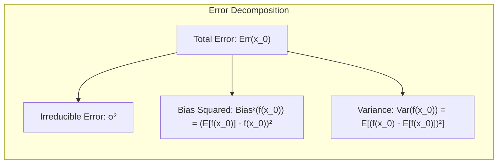
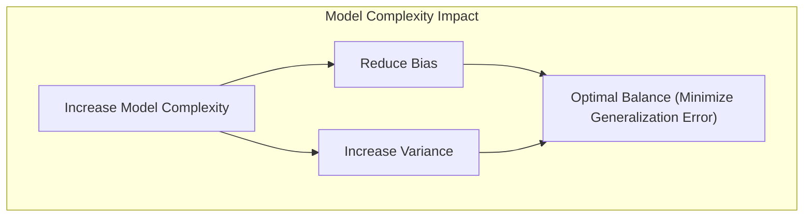
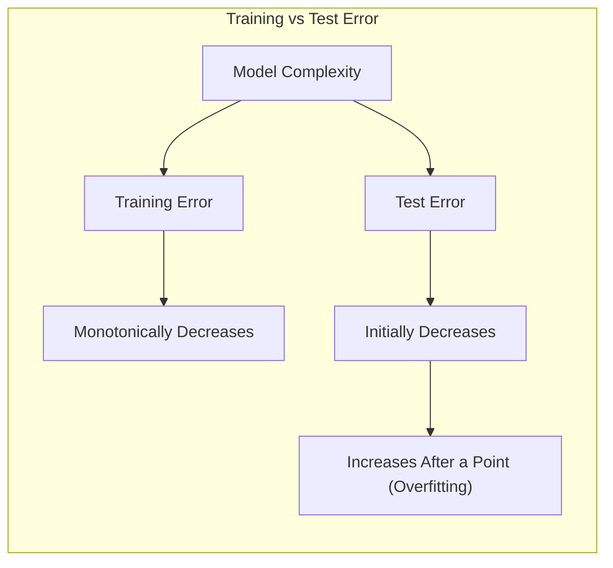
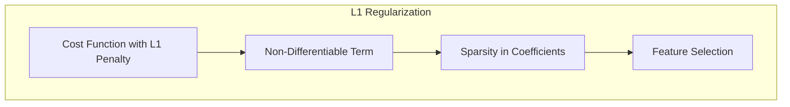
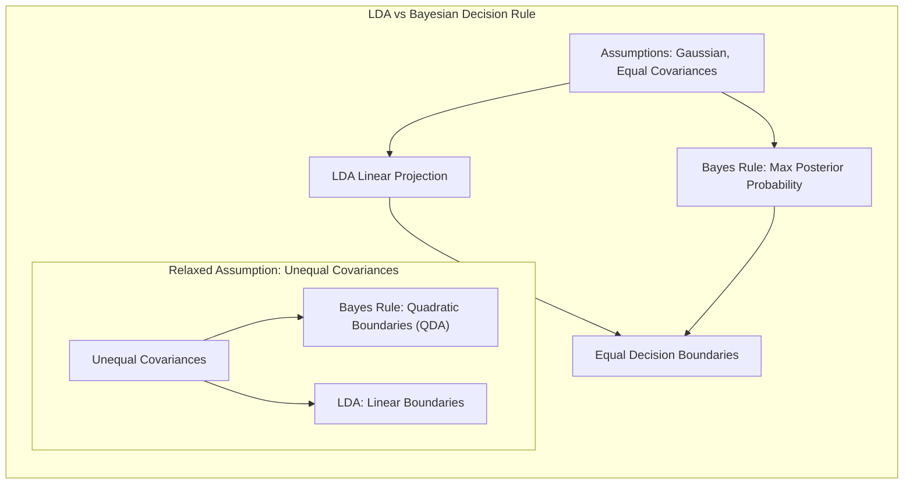

## Model Assessment and Selection: A Deep Dive into Infinite VC Dimension
<imagem: Mapa mental complexo que conecta os conceitos de bias-variância, overfitting, métodos de seleção de modelos e o conceito de VC Dimension, mostrando como a complexidade do modelo afeta a capacidade de generalização.>

### Introdução
A capacidade de um modelo de aprendizado de máquina generalizar para dados não vistos é fundamental para sua utilidade prática. A avaliação e seleção de modelos são cruciais para garantir que um modelo não apenas se ajuste bem aos dados de treinamento, mas também tenha um bom desempenho em dados futuros. Este capítulo aborda métodos para avaliar o desempenho do modelo, com foco no trade-off bias-variância, na importância da complexidade do modelo, e no uso de diferentes critérios de seleção de modelos, chegando à análise de métodos com **infinite VC dimension**. A compreensão desses conceitos é vital para qualquer profissional de estatística e aprendizado de máquina que lida com modelagem preditiva [^7.1].

### Conceitos Fundamentais
**Conceito 1: Generalização e Trade-off Bias-Variância**
A *generalização* refere-se à capacidade de um modelo de fazer previsões precisas em dados novos e não vistos. Um modelo de aprendizado de máquina bem-sucedido deve generalizar bem. O *trade-off bias-variância* é um conceito fundamental na modelagem preditiva que ilustra como a complexidade de um modelo afeta sua capacidade de generalização [^7.2]. Modelos com baixo bias e alta variância tendem a se ajustar aos dados de treinamento muito bem, mas não generalizam bem, enquanto modelos com alto bias e baixa variância podem não se ajustar suficientemente aos dados de treinamento e também podem generalizar mal. Encontrar o equilíbrio certo entre bias e variância é crucial para obter o melhor desempenho de generalização.

**Lemma 1:**
*Dado um modelo de aprendizado de máquina f(X), a perda esperada pode ser decomposta em bias ao quadrado, variância e um termo de erro irredutível. Formalmente, para um ponto de entrada $x_0$*:
$$ Err(x_0) = E[(Y - f(x_0))^2 | X = x_0] = \sigma^2 + [Ef(x_0) - f(x_0)]^2 + E[f(x_0) - Ef(x_0)]^2 $$
$$ Err(x_0) = \sigma^2 + Bias^2(f(x_0)) + Var(f(x_0)) $$
onde $\sigma^2$ representa o erro irredutível, $Bias^2$ é o *bias ao quadrado* e $Var$ é a *variância* [^7.3]. Este lemma formaliza a natureza da decomposição do erro, e como bias e variância atuam de forma conflitante.  $\blacksquare$



> 💡 **Exemplo Numérico:**
> Suponha que temos um modelo de regressão linear que tenta prever o preço de casas (Y) com base em sua área (X). Simulamos um conjunto de dados com 100 amostras, onde o preço verdadeiro é dado por $Y = 2X + 5 + \epsilon$, com $\epsilon \sim \mathcal{N}(0, 2^2)$.
>
> 1. **Modelo Simples (Alto Bias, Baixa Variância):** Consideremos um modelo que assume um preço fixo, ignorando o tamanho da casa, por exemplo, $\hat{Y} = 10$.
>    - Este modelo terá um *alto bias*, pois ignora a relação com X, ou seja, $Bias^2(f(x_0)) = (E[\hat{Y}] - Y)^2$ será alto.
>    - A *variância* será baixa, pois as predições são constantes: $Var(\hat{Y}) = 0$.
>
> 2. **Modelo Complexo (Baixo Bias, Alta Variância):** Consideremos um modelo polinomial de alto grau que se ajusta perfeitamente aos dados de treinamento (devido a uma complexidade muito alta).
>    - Este modelo terá *baixo bias*, pois se adapta aos dados de treinamento, ou seja, $(E[\hat{Y}] - Y)^2$ será baixo.
>    - A *variância* será alta, pois as predições podem variar muito com pequenas mudanças nos dados de treinamento. $Var(\hat{Y})$ será alto.
>
> 3. **Modelo Ideal:** O modelo ideal seria próximo a $\hat{Y} = 2X + 5$.
>
> ```python
> import numpy as np
> import matplotlib.pyplot as plt
>
> # Generate synthetic data
> np.random.seed(42)
> X = np.random.rand(100, 1) * 10
> epsilon = np.random.randn(100, 1) * 2
> Y = 2 * X + 5 + epsilon
>
> # Model 1: Simple (High Bias)
> Y_hat_simple = np.full((100,1),10)
>
> # Model 2: Complex (High Variance) - using a 10 degree polynomial model as an example
> from sklearn.preprocessing import PolynomialFeatures
> from sklearn.linear_model import LinearRegression
> poly = PolynomialFeatures(degree=10)
> X_poly = poly.fit_transform(X)
> model_complex = LinearRegression()
> model_complex.fit(X_poly, Y)
> Y_hat_complex = model_complex.predict(X_poly)
>
> # Model 3: Ideal (Linear Regression)
> model_ideal = LinearRegression()
> model_ideal.fit(X, Y)
> Y_hat_ideal = model_ideal.predict(X)
>
> # Calculate Bias and Variance (approximations)
> bias_simple = np.mean((Y_hat_simple - Y)**2)
> var_simple = np.var(Y_hat_simple)
> bias_complex = np.mean((Y_hat_complex - Y)**2)
> var_complex = np.var(Y_hat_complex)
> bias_ideal = np.mean((Y_hat_ideal - Y)**2)
> var_ideal = np.var(Y_hat_ideal)
>
>
> # Visualization
> plt.figure(figsize=(10, 6))
> plt.scatter(X, Y, color='blue', label='Dados Reais')
> plt.plot(X, Y_hat_simple, color='red', label='Modelo Simples (Alto Bias)')
> plt.plot(X, Y_hat_complex, color='green', label='Modelo Complexo (Alta Variância)')
> plt.plot(X, Y_hat_ideal, color='purple', label='Modelo Ideal')
> plt.xlabel('Tamanho da Casa (X)')
> plt.ylabel('Preço da Casa (Y)')
> plt.title('Trade-off Bias-Variância')
> plt.legend()
> plt.grid(True)
> plt.show()
>
> print(f"Bias^2 Modelo Simples: {bias_simple:.2f}, Variância: {var_simple:.2f}")
> print(f"Bias^2 Modelo Complexo: {bias_complex:.2f}, Variância: {var_complex:.2f}")
> print(f"Bias^2 Modelo Ideal: {bias_ideal:.2f}, Variância: {var_ideal:.2f}")
> ```
>
> Este exemplo ilustra como diferentes modelos lidam com o trade-off bias-variância. O modelo simples tem um alto bias, enquanto o modelo complexo tem uma alta variância. O modelo linear se aproxima do "modelo ideal", equilibrando os dois componentes de erro.

**Conceito 2:  Model Complexity e Overfitting**
A *complexidade do modelo* refere-se à flexibilidade de um modelo em se ajustar a diferentes formas nos dados. Modelos mais complexos, como redes neurais profundas ou modelos de árvore com muitas divisões, são mais flexíveis e capazes de capturar relações complexas nos dados [^7.2]. No entanto, essa flexibilidade também os torna propensos a *overfitting*. O *overfitting* ocorre quando um modelo se ajusta tão bem aos dados de treinamento que acaba capturando ruído aleatório nos dados, em vez de padrões reais. Isso resulta em um desempenho ruim de generalização em dados não vistos. A complexidade do modelo, medida por graus de liberdade ou número de parâmetros, é um fator chave que impacta este risco [^7.2].

**Corolário 1:**
*Aumentar a complexidade de um modelo pode reduzir o bias, mas também aumenta sua variância. Idealmente, encontramos o ponto ideal onde bias e variância estão equilibrados para minimizar o erro de generalização*. [^7.3] Este corolário reforça o princípio fundamental do trade-off bias-variância, e destaca a importância de encontrar a complexidade ideal.



> 💡 **Exemplo Numérico:**
> Considere um modelo de regressão polinomial para dados com uma relação linear verdadeira. Se usarmos um modelo linear (complexidade baixa), podemos ter um *bias* alto, pois o modelo não captura a relação real, que tem uma pequena não-linearidade. Se usarmos um modelo polinomial de alto grau (complexidade alta), podemos ter uma *variância* alta e *overfitting*, pois o modelo se ajusta ao ruído nos dados de treinamento, o que resulta em um erro maior nos dados de teste. O ideal seria um modelo de complexidade intermediária, que capturasse a relação principal sem *overfitting*.

**Conceito 3:  Funções de Perda e Erro de Treinamento vs. Erro de Teste**
A *função de perda* quantifica o erro entre as predições do modelo e os valores reais. Para respostas quantitativas, o *erro quadrático médio* e o *erro absoluto médio* são comumente usados, enquanto que para respostas qualitativas, a *perda 0-1* e a *entropia cruzada* são mais comuns [^7.2]. O *erro de treinamento* é a perda média nos dados de treinamento, enquanto o *erro de teste* (ou *erro de generalização*) é a perda média em um conjunto de dados independente e não visto. O erro de treinamento geralmente diminui à medida que a complexidade do modelo aumenta, enquanto o erro de teste primeiro diminui, atinge um mínimo e depois começa a aumentar devido ao overfitting [^7.2].

> ⚠️ **Nota Importante**: O *erro de treinamento* não é uma boa estimativa do *erro de teste* e pode levar a uma avaliação otimista do desempenho do modelo, conforme apontado em [^7.2].
> ❗ **Ponto de Atenção**: É crucial usar um *conjunto de teste* separado para avaliar o desempenho de generalização de um modelo e evitar o *overfitting* a métricas de treinamento [^7.2].
> ✔️ **Destaque**: Muitos métodos de seleção de modelos buscam estimar o *erro de teste esperado*, em vez do *erro de teste condicional*,  facilitando a análise estatística [^7.2].

> 💡 **Exemplo Numérico:**
> Suponha que estamos treinando um modelo de regressão linear com um conjunto de dados de 100 amostras. Inicialmente, dividimos os dados em 80 amostras para treinamento e 20 amostras para teste. A medida que ajustamos o modelo com diferentes níveis de complexidade (e.g., polinômios de diferentes graus), observamos:
> - O **erro de treinamento** diminui monotonamente com o aumento da complexidade. Isso ocorre porque um modelo mais complexo se ajusta melhor aos dados de treinamento.
> - O **erro de teste**, inicialmente, também diminui com o aumento da complexidade, mas, após certo ponto, começa a aumentar, indicando o *overfitting*.
>
> O gráfico abaixo ilustra este comportamento:
>
> ```mermaid
>  graph LR
>      A[Complexidade do Modelo] --> B(Erro de Treinamento);
>      A --> C(Erro de Teste);
>      B --> D{Diminui Monotonamente};
>      C --> E{Diminui Inicialmente};
>      E --> F{Aumenta Após um Ponto};
>
> ```
>
> Isso reforça a importância de avaliar o modelo usando um conjunto de teste separado, em vez de confiar apenas no erro de treinamento.



### Regressão Linear e Mínimos Quadrados para Classificação
<imagem: Diagrama mostrando o processo de regressão de indicadores para classificação, ilustrando a codificação de classes, estimativa de coeficientes, regra de decisão e comparação com abordagens probabilísticas.>

A regressão linear pode ser aplicada à classificação através da *regressão de indicadores*. Nesta abordagem, cada classe é representada por uma coluna em uma matriz de indicadores. A regressão linear é então realizada sobre essa matriz, e os coeficientes resultantes são usados para fazer previsões de classe. A classe prevista é tipicamente a que tem a maior saída da regressão linear [^7.1, 7.2]. Esta técnica é uma ponte entre problemas de regressão e classificação.

No entanto, a regressão de indicadores tem limitações. A principal é que as predições obtidas não são necessariamente probabilidades, e podem levar a extrapolações fora do intervalo [0,1]. Além disso, a influência de covariâncias entre classes pode impactar o resultado da regressão [^7.2, 7.3].

**Lemma 2:**
*A solução de mínimos quadrados para regressão de indicadores busca minimizar a soma dos erros quadráticos em cada classe, resultando em projeções que podem ser equivalentes às dos métodos de discriminantes lineares sob certas condições*. [^7.2] Este lemma ilustra as conexões e similaridades entre essas abordagens.

**Corolário 2:**
*Sob a condição de que a covariância entre as classes seja idêntica, os hiperplanos de decisão obtidos por regressão linear e discriminantes lineares são equivalentes, sugerindo uma ligação teórica entre as abordagens*. [^7.3] Este corolário destaca a equivalência teórica em situações específicas.


Apesar de suas limitações, a regressão de indicadores pode ser adequada em situações onde o foco principal é a fronteira de decisão linear, em vez das estimativas de probabilidade [^7.2].

> 💡 **Exemplo Numérico:**
> Considere um problema de classificação com 3 classes. Usamos a regressão de indicadores para transformar o problema em um problema de regressão linear. Para cada amostra, criamos um vetor de indicadores onde cada componente indica se a amostra pertence à classe correspondente. Por exemplo, se temos uma amostra que pertence à classe 2, seu vetor indicador será `[0, 1, 0]`. Em seguida, realizamos a regressão linear padrão e usamos a classe com a maior saída para classificar a amostra.
> ```python
> import numpy as np
> from sklearn.linear_model import LinearRegression
>
> # Generate synthetic data for 3 classes
> np.random.seed(42)
> X = np.random.rand(100, 2) # 100 samples, 2 features
> y = np.random.randint(0, 3, 100) # 3 classes
>
> # Create indicator matrix
> y_indicator = np.eye(3)[y]
>
> # Fit linear regression
> model = LinearRegression()
> model.fit(X, y_indicator)
>
> # Predict
> y_pred_indicator = model.predict(X)
> y_pred = np.argmax(y_pred_indicator, axis=1)
>
> # Evaluate (simple accuracy)
> accuracy = np.mean(y_pred == y)
> print(f'Accuracy: {accuracy:.2f}')
> ```
>Este exemplo mostra como aplicar a regressão de indicadores usando a função `LinearRegression` da biblioteca `scikit-learn`. A matriz de indicadores `y_indicator` é criada usando `np.eye(3)[y]`, e a função `np.argmax` é usada para obter a classe predita com base nos resultados da regressão.

### Métodos de Seleção de Variáveis e Regularização em Classificação
<imagem: Mapa mental que ilustra os métodos de seleção de variáveis e regularização, conectando conceitos de penalização L1, L2, Elastic Net, e como esses conceitos afetam a função de custo e a esparsidade dos modelos.>

Em problemas de classificação, especialmente quando o número de preditores é alto, a seleção de variáveis é crucial. A *regularização* é uma técnica que adiciona uma penalidade à função de perda para evitar o overfitting. As penalidades L1 e L2 são as mais comuns. A penalidade L1 (Lasso) promove a *esparsidade*, forçando alguns coeficientes a zero, enquanto a penalidade L2 (Ridge) encolhe os coeficientes em direção a zero [^7.4, 7.5]. Uma combinação de penalidades L1 e L2, chamada de *Elastic Net*, também é utilizada para aproveitar os benefícios de ambas [^7.5].

**Lemma 3:**
*A penalização L1 adicionada à função de perda na regressão logística resulta na esparsidade dos coeficientes, ou seja, muitos coeficientes serão zerados*. [^7.4.4] Este lemma demonstra a capacidade da regularização L1 de realizar seleção de variáveis.

**Prova do Lemma 3:**
Na otimização da função de custo com regularização L1, os parâmetros são atualizados iterativamente. A penalidade L1 introduz um termo não diferenciável na função objetivo,  que leva a soluções esparsas, uma vez que a derivada no ponto zero não existe, favorecendo parâmetros nulos em busca de um mínimo global [^7.4.3].  $\blacksquare$

**Corolário 3:**
*A esparsidade dos coeficientes, devido à penalização L1, melhora a interpretabilidade dos modelos classificatórios, identificando os preditores mais importantes para a decisão de classe*. [^7.4.5]  Este corolário destaca um benefício prático da regularização L1: melhorar a interpretação do modelo.



> ⚠️ **Ponto Crucial**: A combinação de penalidades L1 e L2 (Elastic Net) oferece um controle mais flexível sobre a complexidade do modelo e a esparsidade dos coeficientes, conforme discutido em [^7.5].

> 💡 **Exemplo Numérico:**
> Vamos simular dados de classificação binária com 10 preditores, onde apenas 3 são relevantes. Utilizaremos a regressão logística com penalidades L1 (Lasso) e L2 (Ridge) para comparar seus efeitos.
>
> ```python
> import numpy as np
> from sklearn.model_selection import train_test_split
> from sklearn.linear_model import LogisticRegression
> from sklearn.metrics import accuracy_score
> import pandas as pd
>
> # Generate synthetic data
> np.random.seed(42)
> X = np.random.randn(100, 10)
> # Only features 0, 2, and 5 are relevant
> true_coef = np.array([1, 0, 2, 0, 0, -1.5, 0, 0, 0, 0])
> p = 1 / (1 + np.exp(-np.dot(X, true_coef)))
> y = (np.random.rand(100) < p).astype(int)
>
> # Split data
> X_train, X_test, y_train, y_test = train_test_split(X, y, test_size=0.3, random_state=42)
>
> # Logistic Regression with L1 (Lasso)
> model_lasso = LogisticRegression(penalty='l1', solver='liblinear', C=0.1, random_state=42)
> model_lasso.fit(X_train, y_train)
> y_pred_lasso = model_lasso.predict(X_test)
> accuracy_lasso = accuracy_score(y_test, y_pred_lasso)
>
> # Logistic Regression with L2 (Ridge)
> model_ridge = LogisticRegression(penalty='l2', C=1.0, random_state=42)
> model_ridge.fit(X_train, y_train)
> y_pred_ridge = model_ridge.predict(X_test)
> accuracy_ridge = accuracy_score(y_test, y_pred_ridge)
>
> # Logistic Regression without penalty
> model_none = LogisticRegression(penalty=None)
> model_none.fit(X_train,y_train)
> y_pred_none = model_none.predict(X_test)
> accuracy_none = accuracy_score(y_test, y_pred_none)
>
> # Results
> results_df = pd.DataFrame({
>     "Method": ["Lasso", "Ridge", "None"],
>     "Accuracy": [accuracy_lasso, accuracy_ridge, accuracy_none],
>     "Coefficients": [model_lasso.coef_[0], model_ridge.coef_[0], model_none.coef_[0]]
> })
> print(results_df)
>
> print("\nLasso Coefficients:\n", model_lasso.coef_)
> print("\nRidge Coefficients:\n", model_ridge.coef_)
> print("\nNo Penalty Coefficients:\n", model_none.coef_)
> ```
>
> No exemplo, o Lasso (L1) tende a zerar os coeficientes menos importantes, enquanto o Ridge (L2) encolhe os coeficientes em direção a zero. O modelo sem penalidade usa todos os preditores. A tabela de resultados mostra as acurácias e coeficientes de cada método. Ao analisar os coeficientes, observamos como a regularização L1 promove esparsidade e a regularização L2 reduz a magnitude dos coeficientes. O modelo sem regularização é aquele onde todos os coeficientes são diferentes de zero.

### Separating Hyperplanes e Perceptrons
O conceito de *separating hyperplane* é fundamental na classificação linear. Um hiperplano é uma superfície que divide o espaço de características em duas regiões, correspondendo às classes. A ideia de *maximizar a margem de separação* leva à definição de hiperplanos ótimos, ou seja, hiperplanos que maximizam a distância entre os pontos de treinamento mais próximos do hiperplano (pontos de suporte) [^7.5.2]. O problema de otimização associado a encontrar o hiperplano de maior margem pode ser resolvido utilizando o dual de Wolfe e métodos relacionados. O *Perceptron de Rosenblatt* é um algoritmo que aprende um hiperplano de decisão linear iterativamente, atualizando seus pesos com base em exemplos classificados incorretamente [^7.5.1].

### Pergunta Teórica Avançada: Quais as diferenças fundamentais entre a formulação de LDA e a Regra de Decisão Bayesiana considerando distribuições Gaussianas com covariâncias iguais?

**Resposta:**
Sob o pressuposto de que as distribuições condicionais das classes são Gaussianas e que as matrizes de covariância são iguais, o *Linear Discriminant Analysis (LDA)* e a *Regra de Decisão Bayesiana* tornam-se equivalentes. O LDA busca encontrar uma projeção linear que maximize a separabilidade entre as classes, enquanto a Regra Bayesiana busca encontrar a classe com a maior probabilidade *a posteriori*, utilizando as probabilidades condicionais e as probabilidades *a priori* das classes [^7.3]. Quando as covariâncias são iguais, as fronteiras de decisão resultantes de ambos os métodos são lineares e idênticas. No entanto, se a suposição de covariâncias iguais for relaxada, a Regra de Decisão Bayesiana leva às fronteiras quadráticas (QDA), enquanto o LDA continua produzindo fronteiras lineares [^7.3.1, 7.3.3].

**Lemma 4:**
*Sob a suposição de distribuições Gaussianas e covariâncias iguais, as funções discriminantes do LDA e da Regra de Decisão Bayesiana são equivalentes, produzindo os mesmos hiperplanos de decisão*. [^7.3] Este lemma destaca uma importante ligação teórica entre os métodos.

**Corolário 4:**
*Quando as covariâncias entre as classes não são iguais, a Regra de Decisão Bayesiana resulta em fronteiras de decisão quadráticas, enquanto o LDA continua produzindo fronteiras lineares, mostrando que a suposição de covariâncias iguais é uma forte restrição do LDA*. [^7.3] Este corolário explica a diferença fundamental quando as suposições do LDA não são válidas.



> ⚠️ **Ponto Crucial:** A escolha entre LDA e QDA (Quadratic Discriminant Analysis) depende da validade da suposição de covariâncias iguais e do equilíbrio entre bias e variância, pois o QDA tem mais parâmetros e pode levar ao overfitting, como apontado em [^7.3.1, 7.3.3].

> 💡 **Exemplo Numérico:**
> Para ilustrar a diferença entre LDA e QDA, simulamos um cenário com duas classes e duas features.
>
> 1. **LDA:**
>     -   Assumimos que as classes têm médias diferentes, mas a mesma matriz de covariância.
>     -   O LDA encontrará uma fronteira linear para separar as classes.
> 2.  **QDA:**
>    -  Assumimos que as classes têm médias diferentes e matrizes de covariância diferentes.
>     -  O QDA pode encontrar fronteiras quadráticas para separar as classes, que podem se adequar melhor aos dados reais caso a suposição de igual covariância não seja válida.
>
> ```python
> import numpy as np
> import matplotlib.pyplot as plt
> from sklearn.discriminant_analysis import LinearDiscriminantAnalysis, QuadraticDiscriminantAnalysis
> from sklearn.model_selection import train_test_split
>
> # Generate synthetic data
> np.random.seed(42)
> mean1 = [2, 2]
> cov1 = [[1, 0.5], [0.5, 1]]
> mean2 = [5, 5]
> cov2 = [[1.5, -0.3], [-0.3, 1]]
>
> X1 = np.random.multivariate_normal(mean1, cov1, 50)
> X2 = np.random.multivariate_normal(mean2, cov2, 50)
> X = np.vstack((X1, X2))
> y = np.array([0] * 50 + [1] * 50)
>
> # Split data
> X_train, X_test, y_train, y_test = train_test_split(X, y, test_size=0.3, random_state=42)
>
> # LDA model
> lda = LinearDiscriminantAnalysis()
> lda.fit(X_train, y_train)
>
> # QDA model
> qda = QuadraticDiscriminantAnalysis()
> qda.fit(X_train, y_train)
>
> # Plotting decision boundaries
> x_min, x_max = X[:, 0].min() - 1, X[:, 0].max() + 1
> y_min, y_max = X[:, 1].min() - 1, X[:, 1].max() + 1
> xx, yy = np.meshgrid(np.linspace(x_min, x_max, 200),
>                      np.linspace(y_min, y_max, 200))
>
> Z_lda = lda.predict(np.c_[xx.ravel(), yy.ravel()]).reshape(xx.shape)
> Z_qda = qda.predict(np.c_[xx.ravel(), yy.ravel()]).reshape(xx.shape)
>
> plt.figure(figsize=(10, 6))
> plt.contourf(xx, yy, Z_lda, alpha=0.3, cmap=plt.cm.RdBu)
> plt.scatter(X[:, 0], X[:, 1], c=y, edgecolors='k', cmap=plt.cm.RdBu)
> plt.title('LDA Decision Boundary')
> plt.show()
>
> plt.figure(figsize=(10, 6))
> plt.contourf(xx, yy, Z_qda, alpha=0.3, cmap=plt.cm.RdBu)
> plt.scatter(X[:, 0], X[:, 1], c=y, edgecolors='k', cmap=plt.cm.RdBu)
> plt.title('QDA Decision Boundary')
> plt.show()
> ```
>
> Este exemplo mostra que a fronteira de decisão do LDA é linear, enquanto a do QDA pode se adaptar à forma dos dados.  Se a suposição de covariâncias iguais no LDA não é válida, o QDA geralmente produz resultados melhores.

### Optimism of the Training Error Rate
O erro de treinamento geralmente subestima o erro de teste, devido ao *optimism of the training error rate*. Métodos de ajuste geralmente se adaptam aos dados de treinamento, levando a uma avaliação otimista do desempenho. A diferença entre o erro de treinamento e o erro extra-sample é definida como *optimism*.  Este conceito é fundamental para compreender as limitações dos métodos de avaliação. A definição formal do *optimism* e a relação entre o erro de treinamento e o erro esperado são discutidas em [^7.4].

### Estimates of In-Sample Prediction Error
Os métodos de estimativa do erro *in-sample* buscam aproximar o erro de teste usando apenas informações do conjunto de treinamento. O *Cp statistic* ajusta o erro de treinamento por um fator proporcional ao número de parâmetros, enquanto o *Akaike Information Criterion (AIC)* é uma estimativa da perda de informação ao usar um determinado modelo [^7.5].  Essas abordagens são mais convenientes quando se deseja realizar comparação entre modelos.
Para o modelo logístico, o AIC é dado por:
$$AIC = -\frac{2}{N}loglik + 2 \frac{d}{N}$$
Onde *d* é o número de parâmetros [^7.5].

> 💡 **Exemplo Numérico:**
> Vamos comparar dois modelos de regressão linear (um com 2 preditores e outro com 5 preditores) usando o AIC.
> 1. **Modelo 1 (2 preditores):**
>   - O erro quadrático médio no treinamento (MSE) é 2.
>   - Número de parâmetros (d) = 3 (incluindo o intercepto).
>   - Número de amostras (N) = 100.
>   - Log-verossimilhança $\text{loglik}$ = -150 (valor simulado).
> 2. **Modelo 2 (5 preditores):**
>   - O erro quadrático médio no treinamento (MSE) é 1.5
>   - Número de parâmetros (d) = 6 (incluindo o intercepto).
>   - Número de amostras (N) = 100.
>   - Log-verossimilhança $\text{loglik}$ = -120 (valor simulado).
>
> Para o modelo 1:
> $$AIC_1 = -\frac{2}{100}(-150) + 2 \frac{3}{100} = 3 + 0.06 = 3.06$$
> Para o modelo 2:
> $$AIC_2 = -\frac{2}{100}(-120) + 2 \frac{6}{100} = 2.4 + 0.12 = 2.52$$
>
> ```python
> import numpy as np
> import pandas as pd
>
> # AIC calculation
> def calculate_aic(loglik, d, N):
>    aic = -2/N * loglik + 2*d/N
>    return aic
>
> # Model details
> model_details = {
>     "Model": ["Modelo 1", "Modelo 2"],
>     "MSE": [2, 1.5],
>     "d": [3, 6],
>     "N": [100, 100],
>     "LogLikelihood": [-150, -120]
> }
>
> model_df = pd.DataFrame(model_details)
>
> # Calculate AIC for each model
> model_df["AIC"] = model_df.apply(lambda row: calculate_aic(row["LogLikelihood"], row["d"], row["N"]), axis=1)
> print(model_df)
>
> ```
>
> Apesar do Modelo 2 ter um MSE menor, o AIC é um critério que penaliza modelos mais complexos (com mais parâmetros). Neste exemplo, o Modelo 2 apresenta um menor AIC, sugerindo ser um melhor ajuste considerando a compensação entre o ajuste e a complexidade do modelo. O AIC penaliza o modelo com maior número de parâmetros, e, em geral, o modelo com menor AIC é o modelo preferido.

```mermaid
graph LR
