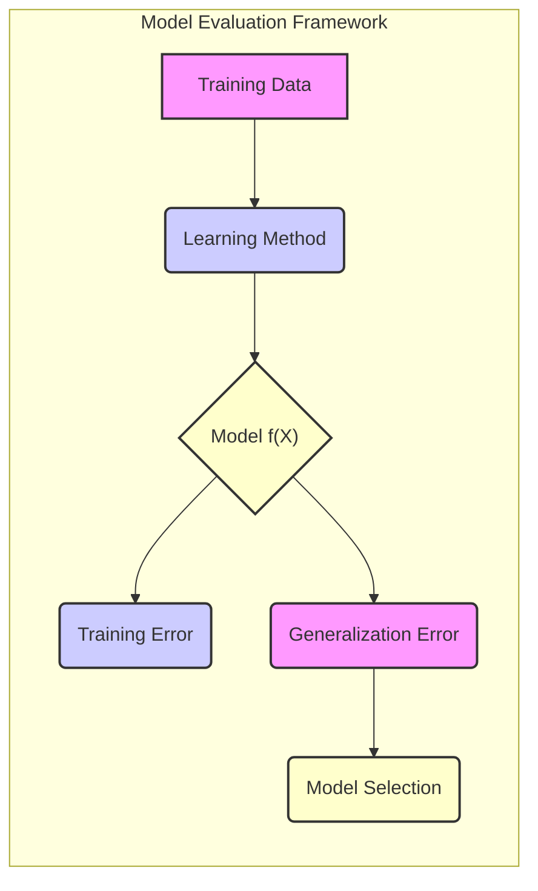
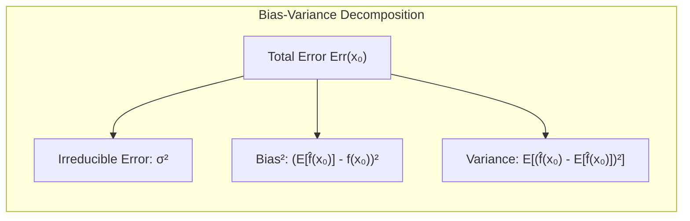
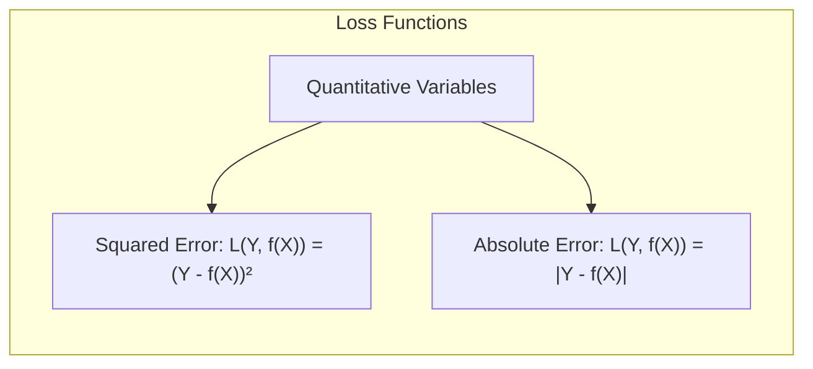
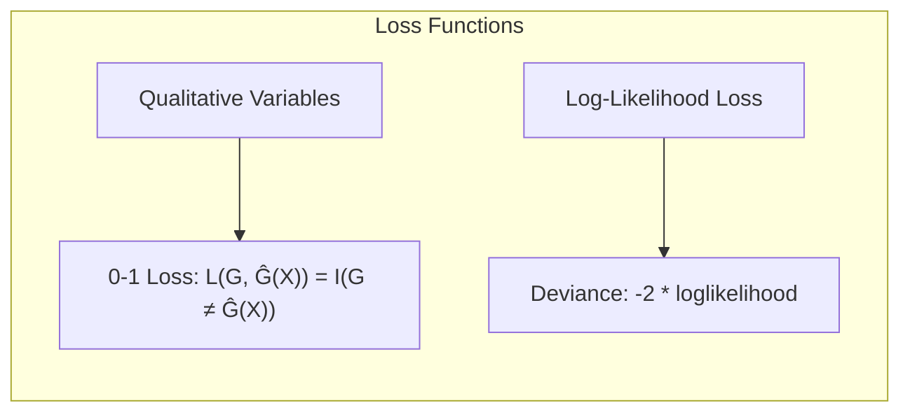
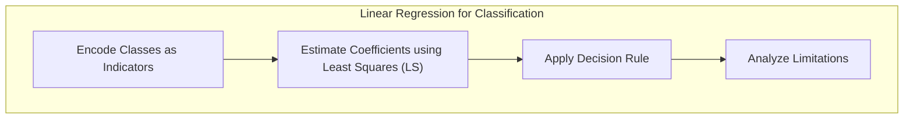
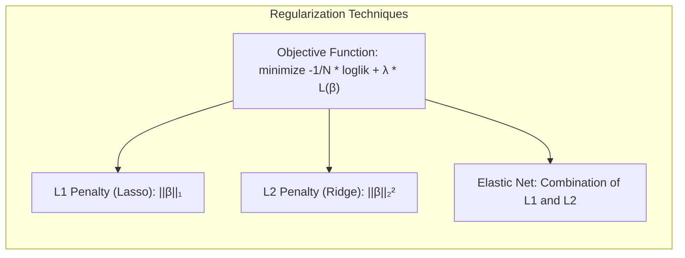
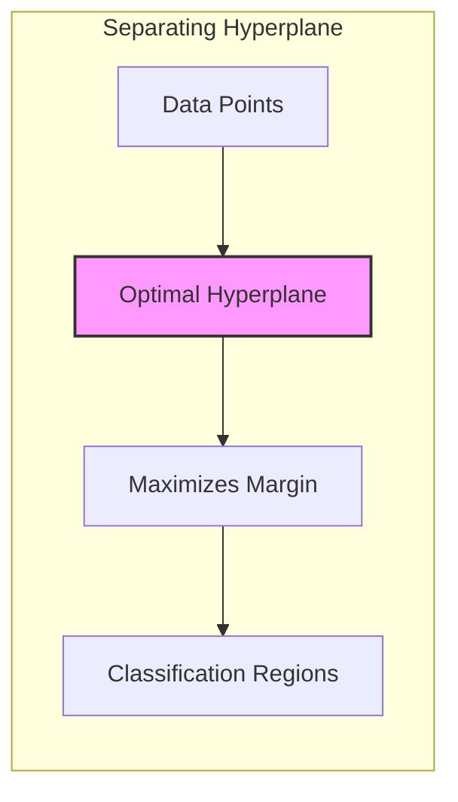
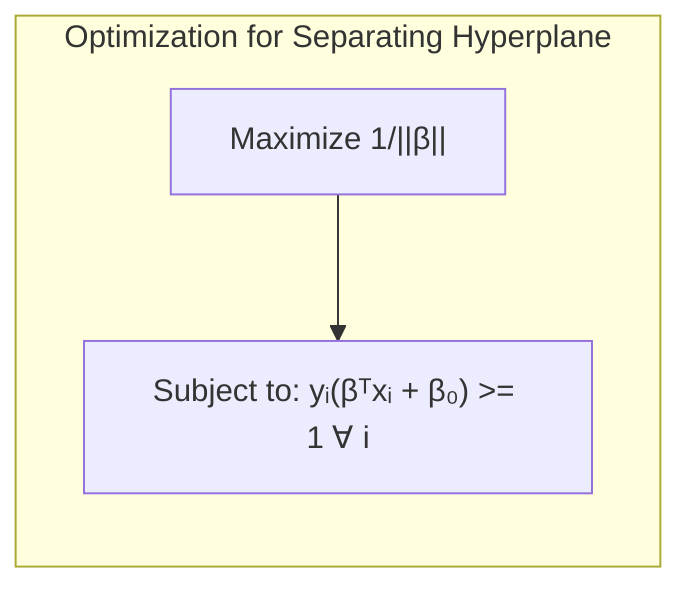
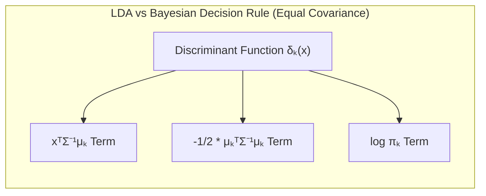

## Prediction Error with VC Dimension



### Introdução

A performance de generalização de um método de aprendizado, que se refere à sua capacidade de prever dados de teste independentes, é crucial na prática, pois orienta a escolha do método ou modelo de aprendizado e fornece uma medida da qualidade do modelo escolhido [^7.1]. Neste capítulo, abordamos os principais métodos para avaliação de desempenho e como eles são usados para selecionar modelos, iniciando com uma discussão da relação entre **viés, variância e complexidade do modelo** [^7.1]. Exploramos também o conceito de **Vapnik-Chervonenkis (VC) dimension** como uma medida geral de complexidade de modelos, particularmente útil para modelos não lineares onde o número de parâmetros não reflete adequadamente a flexibilidade do modelo. O uso da VC dimension nos leva a derivar **limites sobre o otimismo do erro de treinamento**.

### Conceitos Fundamentais

**Conceito 1: Erro de Generalização e Erro de Treinamento**

O **erro de generalização**, ou **erro de teste**, refere-se ao erro de predição sobre um conjunto de dados de teste independente [^7.2]. Ele é definido como:

$$ Err_T = E[L(Y, f(X))|T] $$

onde *T* é o conjunto de treinamento, *Y* é a variável alvo, *X* são as entradas, *f(X)* é o modelo de predição, e *L* é a função de perda [^7.2]. O **erro de treinamento**, por outro lado, é o erro médio sobre o conjunto de treinamento usado para ajustar o modelo:

$$ err = \frac{1}{N} \sum_{i=1}^{N} L(Y_i, f(x_i)) $$ [^7.2]

É importante notar que o erro de treinamento geralmente subestima o erro de generalização, pois o modelo se ajusta aos dados de treinamento e, portanto, pode não generalizar bem para novos dados [^7.2].

> 💡 **Exemplo Numérico:**
>
> Suponha que temos um conjunto de dados de treinamento com 100 pontos e ajustamos um modelo linear para prever a variável alvo. O erro quadrático médio (MSE) no conjunto de treinamento é de 2.5. Em um conjunto de teste independente com 50 pontos, o MSE é de 4.0. Isso ilustra que o erro de treinamento subestima o erro de generalização, indicando que o modelo não generaliza perfeitamente para novos dados.
>
> ```python
> import numpy as np
>
> # Dados de exemplo
> y_train_pred = np.array([1, 2, 3, 4, 5])
> y_train_true = np.array([1.2, 1.8, 3.1, 3.8, 5.2])
> y_test_pred = np.array([6, 7, 8, 9, 10])
> y_test_true = np.array([5.8, 7.3, 8.5, 9.3, 10.4])
>
> # Função para calcular MSE
> def mse(y_true, y_pred):
>  return np.mean((y_true - y_pred)**2)
>
> train_mse = mse(y_train_true, y_train_pred)
> test_mse = mse(y_test_true, y_test_pred)
>
> print(f"Erro de treinamento (MSE): {train_mse:.2f}")
> print(f"Erro de generalização (MSE): {test_mse:.2f}")
> ```
>
> Este código calcula o MSE para os dados de treinamento e teste, mostrando que o erro no conjunto de teste é maior do que o erro no conjunto de treinamento.

**Lemma 1:** *O erro de treinamento (err) tende a diminuir à medida que a complexidade do modelo aumenta, enquanto o erro de generalização (Err) tende a apresentar um mínimo em uma complexidade intermediária.* [^7.2]

Essa observação fundamental está relacionada ao *trade-off* entre viés e variância. Modelos simples tendem a ter um viés alto e uma variância baixa, enquanto modelos complexos tendem a ter um viés baixo e uma variância alta [^7.2].

**Conceito 2: Decomposição Viés-Variância**

A decomposição viés-variância é uma ferramenta essencial para entender o comportamento do erro de generalização [^7.3]. Para uma função de regressão com erro quadrático, o erro de predição em um ponto $x_0$ pode ser decomposto como:



$$ Err(x_0) = \sigma^2 + Bias^2(f(x_0)) + Var(f(x_0)) $$ [^7.3]

onde $\sigma^2$ é o erro irredutível, $Bias^2(f(x_0)) = [Ef(x_0) - f(x_0)]^2$ é o viés ao quadrado e $Var(f(x_0)) = E[f(x_0) - Ef(x_0)]^2$ é a variância do modelo. Essa decomposição mostra que o erro de predição é a soma do erro irredutível, do viés ao quadrado e da variância [^7.3].

> 💡 **Exemplo Numérico:**
>
> Considere um modelo de regressão linear para dados simulados com uma relação quadrática entre a entrada $x$ e a saída $y$.
> A verdadeira relação é $y = 2x^2 + \epsilon$, onde $\epsilon$ é um ruído gaussiano com desvio padrão $\sigma = 1$.
>
> 1.  **Modelo Simples (Linear):** Um modelo linear $f_1(x) = \beta_0 + \beta_1 x$ terá um viés alto porque não consegue capturar a relação quadrática. A variância será baixa se o modelo não se adaptar muito aos dados específicos.
> 2.  **Modelo Complexo (Polinomial de Grau 2):** Um modelo polinomial $f_2(x) = \beta_0 + \beta_1 x + \beta_2 x^2$ terá um viés baixo, pois pode capturar a relação quadrática. A variância será alta se o modelo se adaptar muito ao ruído nos dados de treinamento.
>
> Calculando o MSE para um ponto específico, digamos $x_0=2$:
>
> *   **Erro Irredutível:** $\sigma^2 = 1^2 = 1$ (devido ao ruído nos dados)
> *   **Modelo Linear:**
>     *   Suponha que $E[f_1(x_0)] = 5$. O valor verdadeiro é $f(x_0)= 2 \times 2^2 = 8$
>     *   $Bias^2(f_1(x_0)) = (5 - 8)^2 = 9$
>     *   Suponha que $Var(f_1(x_0)) = 0.5$
>     *   $Err(x_0) = 1 + 9 + 0.5 = 10.5$
> *   **Modelo Polinomial:**
>     *   Suponha que $E[f_2(x_0)] = 7.9$. O valor verdadeiro é $f(x_0)= 2 \times 2^2 = 8$
>     *   $Bias^2(f_2(x_0)) = (7.9 - 8)^2 = 0.01$
>     *   Suponha que $Var(f_2(x_0)) = 1.5$
>     *    $Err(x_0) = 1 + 0.01 + 1.5 = 2.51$
>
> Este exemplo numérico mostra que o modelo simples (linear) tem um erro maior devido ao viés, enquanto o modelo complexo (polinomial) tem um erro menor, embora com uma variância maior. Em geral, podemos representar a relação entre viés, variância e complexidade do modelo através do seguinte gráfico:
>
> ```mermaid
>   graph LR
>       A[Complexidade do Modelo] --> B(Viés)
>       A --> C(Variância)
>       B --> D{Erro de Generalização}
>       C --> D
>       style B fill:#f9f,stroke:#333,stroke-width:2px
>       style C fill:#ccf,stroke:#333,stroke-width:2px
>       style D fill:#ffc,stroke:#333,stroke-width:2px
>
>       E[Baixa Complexidade] --> F(Alto Viés, Baixa Variância)
>       G[Alta Complexidade] --> H(Baixo Viés, Alta Variância)
>       F --> I{Alto Erro de Generalização}
>       H --> J{Alto Erro de Generalização}
>       K[Complexidade Ideal] --> L(Baixo Viés, Baixa Variância)
>       L --> M{Baixo Erro de Generalização}
>
> ```
>
> O gráfico mostra que o erro de generalização é afetado tanto pelo viés quanto pela variância. Modelos muito simples ou muito complexos tendem a ter um erro de generalização maior.

**Corolário 1:** *O viés de um modelo reflete o quão bem o modelo consegue aproximar a verdadeira função subjacente, enquanto a variância reflete o quão sensível o modelo é às variações nos dados de treinamento. Modelos com alta complexidade, ao se adaptarem excessivamente aos dados de treino, apresentam alta variância e baixo viés, e o oposto ocorre para modelos de baixa complexidade.* [^7.3]

**Conceito 3: Funções de Perda e Log-Verossimilhança**

As funções de perda são usadas para medir o erro entre a predição do modelo e os valores reais [^7.2]. Para variáveis quantitativas, o erro quadrático e o erro absoluto são opções comuns [^7.2]:



$$ L(Y, f(X)) = (Y - f(X))^2 \quad \text{ou} \quad L(Y, f(X)) = |Y - f(X)| $$

Para dados qualitativos ou categóricos, a função de perda 0-1 é frequentemente utilizada [^7.2]:

$$ L(G, \hat{G}(X)) = I(G \neq \hat{G}(X)) $$

onde *G* é a classe real e $\hat{G}(X)$ é a classe predita. A **log-verossimilhança** também é uma função de perda útil para dados de diversas distribuições e, frequentemente, leva ao conceito de **deviancia** [^7.2]:



$$ L(G, P(X)) = -2 \sum_{k=1}^{K} I(G=k) log(p_k(X)) = -2 \times loglikelihood $$ [^7.2]

> ⚠️ **Nota Importante**: O uso da função de perda log-verossimilhança é uma abordagem robusta para diversos modelos e dados, oferecendo uma conexão com distribuições probabilísticas e inferência estatística.

> ❗ **Ponto de Atenção**: Para modelos de classificação, o viés e a variância podem interagir de forma não aditiva, devido à natureza discreta da função de perda 0-1. [^7.3.1]

> ✔️ **Destaque**: A escolha da função de perda apropriada é fundamental para um bom desempenho do modelo. É preciso considerar tanto a natureza dos dados quanto os objetivos da tarefa. [^7.2]

### Regressão Linear e Mínimos Quadrados para Classificação



A regressão linear pode ser aplicada em problemas de classificação codificando cada classe como um indicador (dummy variable) e ajustando o modelo de regressão linear com mínimos quadrados [^7.2]. Embora não seja tão comum quanto a regressão logística, ela pode ser útil em alguns cenários, como quando as classes são bem separáveis [^7.2]. No entanto, ela tem algumas limitações, como não gerar probabilidades diretamente e ser sensível a valores atípicos e à influência de covariâncias [^7.2], [^7.3].
Em geral, a regressão linear sobre uma matriz de indicadores tenta projetar cada classe em seu respectivo indicador, e a regra de decisão é atribuir à observação a classe com maior valor projetado.  
A projeção por mínimos quadrados para cada classe *k* é dada por:
$$ \hat{y}_{ik} = x_i^T \hat{\beta}_k $$
onde $\hat{\beta}_k = (X^TX)^{-1}X^Ty_k$ são os coeficientes estimados para a classe *k* e $y_k$ são os indicadores para a classe *k* [^7.2]. A classe predita para a observação i será a classe k que maximiza  $\hat{y}_{ik}$.

> 💡 **Exemplo Numérico:**
>
> Considere um problema de classificação com três classes (A, B, e C) e duas variáveis preditoras ($x_1$ e $x_2$). Temos um conjunto de dados de treinamento com 5 observações:
>
> | Observação | $x_1$ | $x_2$ | Classe |
> |------------|-------|-------|--------|
> | 1          | 1     | 2     | A      |
> | 2          | 1.5   | 1.8   | A      |
> | 3          | 3     | 5     | B      |
> | 4          | 4     | 4.5   | B      |
> | 5          | 6     | 1     | C      |
>
> **Passo 1: Codificação das Classes:**
>
>   Criamos uma matriz de indicadores $Y$ onde cada coluna representa uma classe:
>
>   | Observação | Y_A | Y_B | Y_C |
>   |------------|-----|-----|-----|
>   | 1          | 1   | 0   | 0   |
>   | 2          | 1   | 0   | 0   |
>   | 3          | 0   | 1   | 0   |
>   | 4          | 0   | 1   | 0   |
>   | 5          | 0   | 0   | 1   |
>
>  A matriz de preditores $X$ é dada por:
>
>   | Observação | $x_1$ | $x_2$ |
>  |------------|-------|-------|
>   | 1          | 1     | 2     |
>   | 2          | 1.5   | 1.8   |
>   | 3          | 3     | 5     |
>   | 4          | 4     | 4.5   |
>  | 5          | 6     | 1     |
>
>
> **Passo 2: Estimar Coeficientes:**
> Para cada classe $k$, estimamos os coeficientes $\hat{\beta}_k$ usando a fórmula $\hat{\beta}_k = (X^TX)^{-1}X^Ty_k$
>
> Suponha que após os cálculos (que envolvem inversão de matrizes), obtivemos os seguintes coeficientes (valores apenas ilustrativos):
>
>   *   $\hat{\beta}_A = \begin{bmatrix} 0.5 \\ -0.2 \end{bmatrix}$
>   *   $\hat{\beta}_B = \begin{bmatrix} -0.1 \\ 0.4 \end{bmatrix}$
>   *   $\hat{\beta}_C = \begin{bmatrix} 0.2 \\ -0.1 \end{bmatrix}$
>
> **Passo 3: Projeção e Regra de Decisão:**
>
>  Para uma nova observação, por exemplo, com $x_1 = 2$ e $x_2 = 3$, calculamos as projeções para cada classe:
>
>   *   $\hat{y}_{iA} = (2 \times 0.5) + (3 \times -0.2) = 1 - 0.6 = 0.4$
>   *   $\hat{y}_{iB} = (2 \times -0.1) + (3 \times 0.4) = -0.2 + 1.2 = 1.0$
>   *   $\hat{y}_{iC} = (2 \times 0.2) + (3 \times -0.1) = 0.4 - 0.3 = 0.1$
>
>   A classe predita seria a classe B, pois ela tem a maior projeção (1.0).
>
> ```python
> import numpy as np
> from sklearn.linear_model import LinearRegression
>
> # Dados de exemplo
> X = np.array([[1, 2], [1.5, 1.8], [3, 5], [4, 4.5], [6, 1]])
> Y = np.array([[1, 0, 0], [1, 0, 0], [0, 1, 0], [0, 1, 0], [0, 0, 1]])
>
> # Ajustar um modelo linear para cada classe
> models = []
> for k in range(Y.shape[1]):
>     model = LinearRegression()
>     model.fit(X, Y[:, k])
>     models.append(model)
>
> # Nova observação
> x_new = np.array([2, 3])
>
> # Calcular as projeções
> projections = [model.predict(x_new.reshape(1, -1))[0] for model in models]
>
> # Determinar a classe com maior projeção
> predicted_class = np.argmax(projections)
>
> print("Projeções:", projections)
> print("Classe Predita:", predicted_class)
> ```
>
> Este código implementa a regressão linear de indicadores para um problema de classificação com 3 classes, mostrando que o modelo seleciona a classe com o maior valor projetado.

**Lemma 2:** *Em certas condições, os hiperplanos de decisão gerados pela regressão linear de indicadores e pela LDA são equivalentes, especialmente quando as covariâncias entre as classes são iguais.* [^7.3]

Essa equivalência é demonstrada quando as projeções dos dados nos hiperplanos de decisão, usando ambos os métodos, levam à mesma classificação [^7.3].

**Corolário 2:** *Quando as classes são bem separadas e o número de observações por classe é grande, a regressão linear de indicadores pode ser uma alternativa simples e computacionalmente eficiente à LDA.* [^7.3]

Contudo, é importante reconhecer as limitações dessa abordagem:
> Em situações onde a probabilidade é fundamental, como na regressão logística, o modelo linear sobre uma matriz de indicadores pode levar a extrapolações problemáticas fora do intervalo [0,1]. A regressão logística, por sua vez, lida com este problema naturalmente. [^7.4]

> No entanto, a regressão linear de indicadores é um método direto e que pode ser adequado quando o foco está mais na decisão de classes do que na estimação de probabilidades precisas. [^7.2]

### Métodos de Seleção de Variáveis e Regularização em Classificação



A seleção de variáveis e a regularização são importantes para lidar com alta dimensionalidade e para evitar *overfitting* em problemas de classificação [^7.4.4], [^7.5]. A **regularização** adiciona uma penalidade à função de custo do modelo, incentivando soluções mais simples [^7.4.4]. Dois tipos comuns de penalidades são:

-   **Penalidade L1 (Lasso)**: Promove a esparsidade, forçando alguns coeficientes a serem exatamente zero.
-   **Penalidade L2 (Ridge)**: Reduz a magnitude dos coeficientes, mas geralmente não os força a zero.
    As penalidades L1 e L2 são expressas matematicamente como:

$$ L_1(\beta) = \|\beta\|_1 = \sum_{j=1}^p |\beta_j| \quad \text{e} \quad L_2(\beta) = \|\beta\|_2^2 = \sum_{j=1}^p \beta_j^2 $$

O objetivo é minimizar a função de custo que inclui a perda (e.g., log-likelihood) mais o termo de penalidade, por exemplo:

$$ \text{minimize} \quad -\frac{1}{N} \text{loglik} + \lambda L(\beta)  $$

onde $\lambda$ é um parâmetro de ajuste que controla a força da regularização.

> 💡 **Exemplo Numérico:**
>
> Suponha um problema de regressão logística com duas variáveis preditoras ($x_1$ e $x_2$). Vamos comparar o efeito da regularização L1 (Lasso) e L2 (Ridge) nos coeficientes do modelo.
>
> 1.  **Dados Simulados:** Geramos dados simulados onde $y$ é uma variável binária (0 ou 1) e as variáveis preditoras são $x_1$ e $x_2$.
> 2.  **Modelo sem Regularização:** Ajustamos um modelo de regressão logística sem nenhuma penalidade. Os coeficientes resultantes são, por exemplo, $\beta_1 = 2.5$ e $\beta_2 = -1.8$.
> 3.  **Modelo com Regularização L1 (Lasso):** Aplicamos a regularização L1 com $\lambda = 0.5$. Isso resulta em coeficientes esparsos, por exemplo, $\beta_1 = 1.2$ e $\beta_2 = 0$. Note que a penalidade L1 "zerou" o coeficiente de $x_2$.
> 4.  **Modelo com Regularização L2 (Ridge):** Aplicamos a regularização L2 com $\lambda = 0.5$. Os coeficientes são reduzidos em magnitude, por exemplo, $\beta_1 = 1.8$ e $\beta_2 = -1.3$.
> 5.  **Comparação:** A regularização L1 leva à esparsidade, removendo a variável $x_2$ do modelo, o que pode melhorar a interpretabilidade. Já a regularização L2 diminui todos os coeficientes, o que pode melhorar a estabilidade do modelo.
>
> Vamos mostrar o código em Python para este exemplo:
>
> ```python
> import numpy as np
> from sklearn.linear_model import LogisticRegression
> from sklearn.preprocessing import StandardScaler
>
> # Dados simulados
> np.random.seed(42)
> X = np.random.rand(100, 2)
> y = (X[:, 0] - X[:, 1] + np.random.randn(100) > 0).astype(int)
>
> # Padronizar os dados
> scaler = StandardScaler()
> X_scaled = scaler.fit_transform(X)
>
> # Modelo sem regularização
> model_no_reg = LogisticRegression(penalty=None)
> model_no_reg.fit(X_scaled, y)
> beta_no_reg = model_no_reg.coef_[0]
>
> # Modelo com regularização L1 (Lasso)
> model_l1 = LogisticRegression(penalty='l1', solver='liblinear', C=0.5)
> model_l1.fit(X_scaled, y)
> beta_l1 = model_l1.coef_[0]
>
> # Modelo com regularização L2 (Ridge)
> model_l2 = LogisticRegression(penalty='l2', C=0.5)
> model_l2.fit(X_scaled, y)
> beta_l2 = model_l2.coef_[0]
>
> print("Coeficientes sem regularização:", beta_no_reg)
> print("Coeficientes com regularização L1:", beta_l1)
> print("Coeficientes com regularização L2:", beta_l2)
>
> # Tabela de comparação
> print("\n| Método          | Beta 1 | Beta 2 |")
> print("|-----------------|--------|--------|")
> print(f"| Sem Regularização| {beta_no_reg[0]:.2f} | {beta_no_reg[1]:.2f} |")
> print(f"| L1 (Lasso)     | {beta_l1[0]:.2f} | {beta_l1[1]:.2f} |")
> print(f"| L2 (Ridge)     | {beta_l2[0]:.2f} | {beta_l2[1]:.2f} |")
> ```
>
> Este código simula um exemplo de regressão logística com e sem regularização L1 e L2, mostrando como cada penalidade afeta os coeficientes.

**Lemma 3:** *A penalidade L1 em classificação logística leva a coeficientes esparsos, resultando em modelos mais interpretáveis, selecionando automaticamente as variáveis mais relevantes.* [^7.4.4]

**Prova do Lemma 3:** A penalidade L1, ao impor um termo linear no valor absoluto dos coeficientes na função de custo, introduz uma geometria que leva à ocorrência de coeficientes nulos durante o processo de otimização. Este comportamento contrasta com a penalidade L2 que tende a apenas diminuir os coeficientes, mas não zerá-los. $\blacksquare$

**Corolário 3:** *A regularização L1 não apenas melhora a interpretabilidade, mas também ajuda a reduzir a variância do modelo, o que leva a uma melhor generalização.* [^7.4.5]

É comum combinar as penalidades L1 e L2, dando origem ao **Elastic Net**, que busca o balanço entre esparsidade e estabilidade do modelo [^7.5]:

> ⚠️ **Ponto Crucial**: A escolha entre L1, L2 ou Elastic Net depende da necessidade de esparsidade e do equilíbrio entre variância e viés. O parâmetro λ controla a complexidade do modelo, afetando seu viés e variância. [^7.5]
> A regularização é particularmente importante quando se lida com dados de alta dimensão, onde a quantidade de variáveis é comparável ou superior à quantidade de observações. [^7.5]

### Separating Hyperplanes e Perceptrons



A ideia de **separating hyperplanes** é encontrar um hiperplano que divide o espaço de entrada em regiões correspondentes às classes [^7.5.2]. O objetivo é maximizar a margem de separação entre as classes, ou seja, a distância mínima entre o hiperplano e os pontos de dados mais próximos de cada classe [^7.5.2].

A formulação do problema de otimização para encontrar o hiperplano ótimo envolve a maximização da margem sujeito à restrição de que todos os pontos de dados estejam corretamente classificados:



$$ \text{maximize} \quad \frac{1}{\|\beta\|} $$
$$ \text{sujeito a} \quad y_i(\beta^Tx_i + \beta_0) \geq 1 \quad \text{para todo} \quad i  $$
onde $\beta$ define a direção do hiperplano, $\beta_0$ define sua localização no espaço de entradas, $x_i$ são os pontos de dados, e $y_i$ são as classes correspondentes [^7.5.2].

A solução para este problema de otimização geralmente envolve o uso do *dual de Wolfe* e pode ser expressa como uma combinação linear de *vetores de suporte*, que são os pontos de dados mais próximos do hiperplano [^7.5.2].

O **Perceptron de Rosenblatt** é um algoritmo de aprendizado de máquina que também busca encontrar um hiperplano separador [^7.5.1]. O Perceptron ajusta os pesos iterativamente até que um hiperplano que separa as classes seja encontrado, ou converge para uma solução aproximada [^7.5.1]. No entanto, a convergência do Perceptron é garantida somente quando os dados são linearmente separáveis [^7.5.1].

### Pergunta Teórica Avançada: Quais as diferenças fundamentais entre a formulação de LDA e a Regra de Decisão Bayesiana considerando distribuições Gaussianas com covariâncias iguais?

**Resposta:**

A **Linear Discriminant Analysis (LDA)** e a **Regra de Decisão Bayesiana** são dois métodos de classificação intimamente relacionados, especialmente quando se assume distribuições Gaussianas para cada classe com covariâncias iguais [^7.3]. A LDA é derivada assumindo que as classes seguem distribuições gaussianas com a mesma matriz de covariância e calcula as funções discriminantes lineares a partir das médias e covariâncias das classes. A Regra de Decisão Bayesiana, por outro lado, baseia-se diretamente nas probabilidades condicionais das classes dado as entradas, derivadas da função densidade de probabilidade das classes.

Em ambos os casos, para o problema de *K* classes, e com a hipótese de distribuições gaussianas com a mesma matriz de covariância, a regra de decisão se reduz a atribuir a classe *k* que maximizar:



$$ \delta_k(x) = x^T \Sigma^{-1}\mu_k - \frac{1}{2}\mu_k^T\Sigma^{-1}\mu_k + log \pi_k $$

onde $\Sigma$ é a matriz de covariância comum, $\mu_k$ é o vetor de médias da classe *k*, e $\pi_k$ é a probabilidade *a priori* da classe *k* [^7.3]. Assim, sob essa hipótese de covariâncias iguais, as fronteiras de decisão se tornam lineares, tanto na LDA quanto na Regra de Decisão Bayesiana.

**Lemma 4:** *Quando as classes seguem distribuições Gaussianas com covariâncias iguais, o LDA e a Regra de Decisão Bayesiana levam à mesma função discriminante linear, e portanto, à mesma decisão de classificação.* [^7.3, ^7.3.3]

**Corolário 4:** *Se a hipótese de covariâncias iguais for relaxada, a regra de decisão da Regra de Decisão Bayesiana leva a fronteiras quadráticas entre classes, o que corresponde à análise discriminante quadrática (QDA)* [^7.3].

> ⚠️ **Ponto Crucial**: A igualdade das covariâncias leva à equivalência das fronteiras de decisão lineares entre a LDA e o classificador bayesiano. A violação dessa premissa introduz complexidade à fronteira de decisão, tornando-a quadrática ou mais complexa. [^7.3.1]

### Conclusão

Este capítulo explorou diversos aspectos da avaliação de modelos e seleção, focando na decomposição viés-variância, no uso da VC dimension para quantificar a complexidade do modelo e nos principais métodos de estimativa de erro, como cross-validation e bootstrap. A utilização de métodos de regularização também foi apresentada como uma abordagem para lidar com o *trade-off* viés-variância e melhorar o poder de generalização dos modelos. A discussão teórica avançada sobre a relação entre LDA e Regra de Decisão Bayesiana ressalta a necessidade de compreender as hipóteses subjacentes e as limitações de cada abordagem. A exploração detalhada desses conceitos e técnicas é essencial para a construção de modelos de aprendizado de máquina robustos e confiáveis.

### Footnotes

[^7.1]: "The generalization performance of a learning method relates to its prediction capability