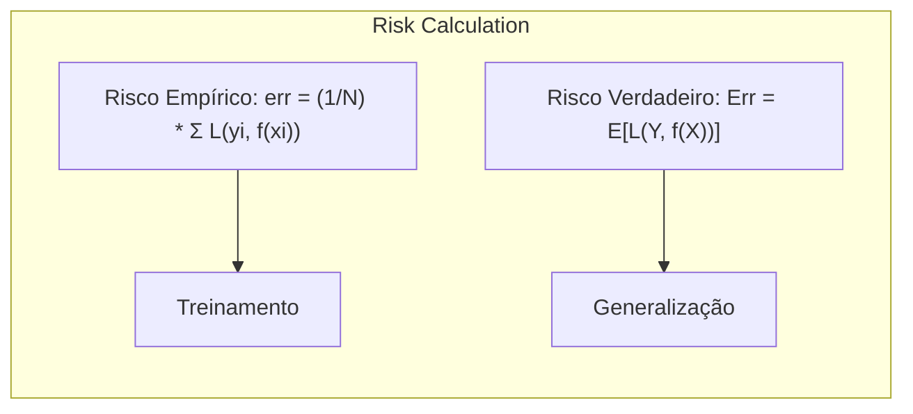
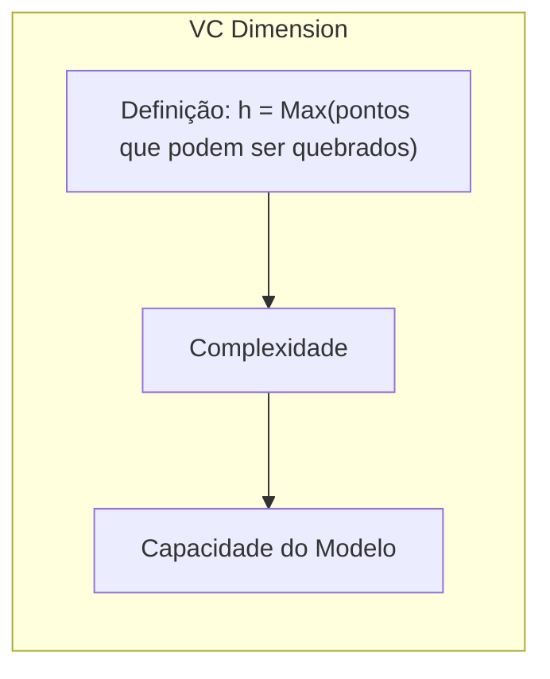
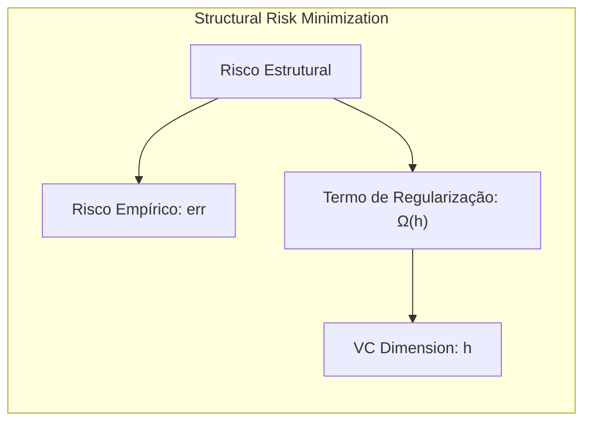
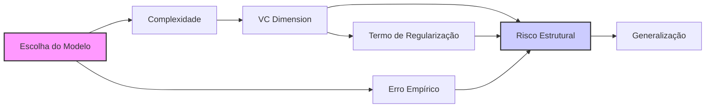
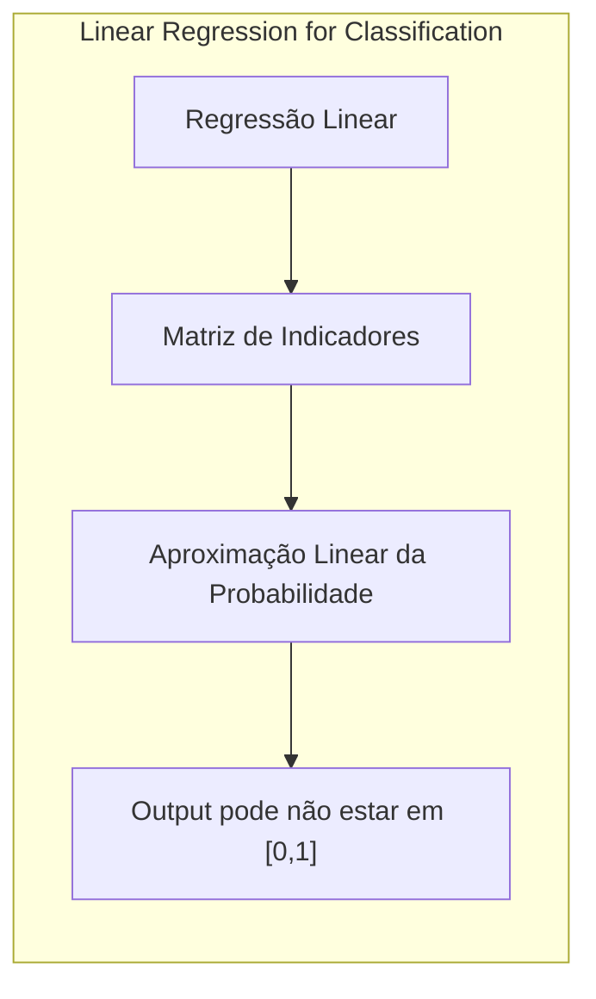
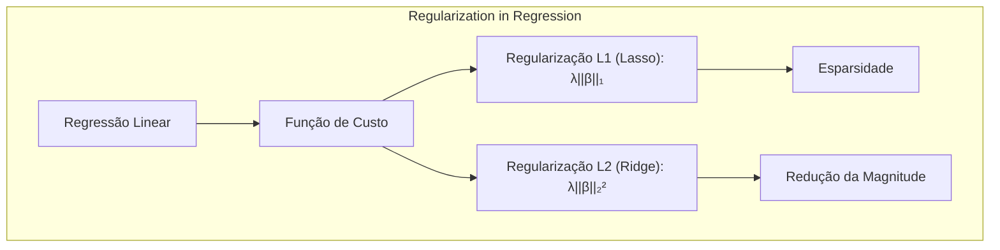
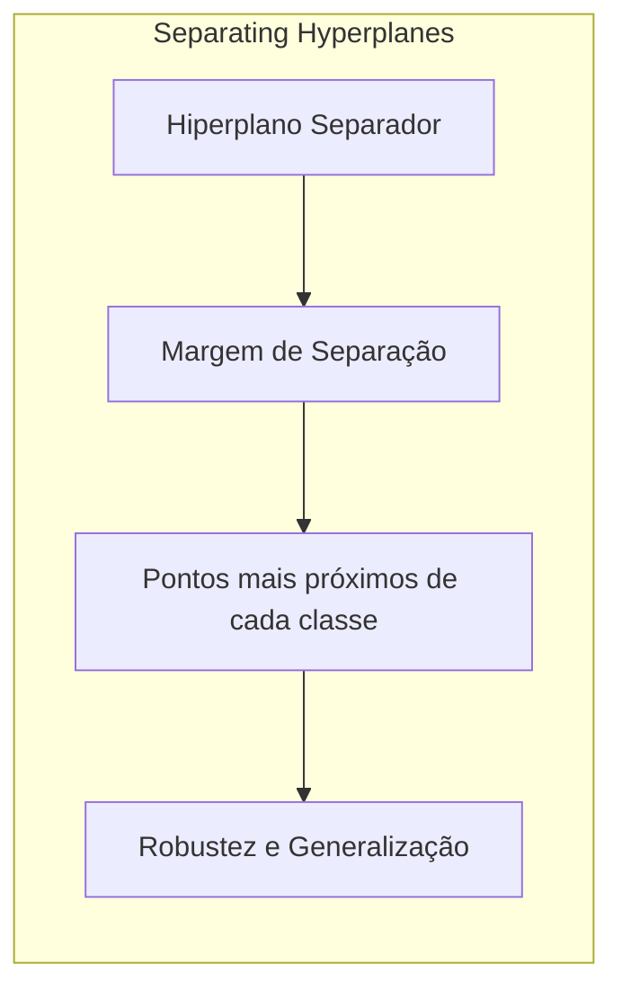
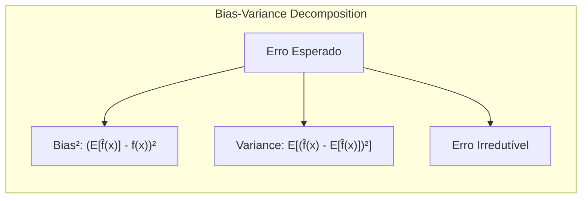

## Structural Risk Minimization: A Framework for Model Selection
<imagem: Mapa mental mostrando a hierarquia de modelos, a complexidade controlada pelo VC dimension e a busca pelo modelo ótimo, com links para métodos de seleção>
Introdução
A seleção de modelos é um desafio fundamental no aprendizado de máquina. O objetivo é encontrar um modelo que generalize bem para dados não vistos, evitando tanto o underfitting quanto o overfitting [^7.1]. Métodos como AIC, BIC, cross-validation e bootstrap são usados para estimar o erro de generalização de diferentes modelos. A Structural Risk Minimization (SRM), por sua vez, oferece um framework mais estruturado para essa seleção, baseando-se na ideia de controlar a complexidade do modelo para otimizar o desempenho em dados novos [^7.9]. Este capítulo explora a teoria da SRM, seus princípios e como ela se relaciona com outros métodos de seleção de modelos, utilizando como base conceitual os tópicos apresentados em [^7.1], [^7.2], [^7.3] e [^7.9].

### Conceitos Fundamentais
**Conceito 1: Risco Empírico e Risco Verdadeiro:** A SRM aborda a seleção de modelos considerando a distinção entre **risco empírico** (o erro no conjunto de treinamento) e **risco verdadeiro** (o erro esperado em dados não vistos). O risco empírico é dado por [^7.2]:

$$
\text{err} = \frac{1}{N} \sum_{i=1}^{N} L(y_i, f(x_i))
$$
onde $L$ é a função de perda, $y_i$ são os valores alvo e $f(x_i)$ são as previsões do modelo. O risco verdadeiro, por outro lado, é definido como [^7.2]:
$$
\text{Err} = E[L(Y, f(X))]
$$
onde a expectativa é tomada sobre a distribuição conjunta dos dados. O objetivo da SRM é minimizar o risco verdadeiro, e não apenas o risco empírico, que pode levar ao overfitting.


> 💡 **Exemplo Numérico:** Suponha que temos um conjunto de treinamento com 5 amostras. As observações $y_i$ são [2.1, 3.2, 4.0, 5.1, 6.0] e o modelo faz as seguintes previsões $f(x_i)$ : [2.0, 3.5, 3.8, 4.8, 6.2]. Usando a função de perda do erro quadrático $L(y_i, f(x_i)) = (y_i - f(x_i))^2$, podemos calcular o risco empírico como:
>
> $\text{err} = \frac{1}{5} [ (2.1 - 2.0)^2 + (3.2 - 3.5)^2 + (4.0 - 3.8)^2 + (5.1 - 4.8)^2 + (6.0 - 6.2)^2 ]$
>
> $\text{err} = \frac{1}{5} [ 0.01 + 0.09 + 0.04 + 0.09 + 0.04 ]$
>
> $\text{err} = \frac{1}{5} [ 0.27 ] = 0.054$.
>
> Este valor é o risco empírico. O risco verdadeiro, por outro lado, requer o conhecimento da distribuição de probabilidade dos dados, que geralmente não conhecemos e deve ser estimado usando técnicas como validação cruzada.

**Lemma 1:** O risco empírico tende a diminuir com o aumento da complexidade do modelo, conforme evidenciado em [^7.2]. Entretanto, essa redução não garante a diminuição do risco verdadeiro, pois modelos mais complexos podem se ajustar ao ruído nos dados de treinamento e não generalizar bem.
**Conceito 2: Vapnik-Chervonenkis (VC) Dimension:** A SRM usa a **VC dimension** como medida de complexidade do modelo [^7.9]. A VC dimension ($h$) é o maior número de pontos que um modelo pode "quebrar", ou seja, separar perfeitamente em qualquer configuração de rótulos.


> 💡 **Exemplo Numérico:** Considere um classificador linear em 2D. Ele pode separar 3 pontos em qualquer configuração, mas não 4 pontos em uma configuração onde 2 pontos de uma classe estão dentro do envelope convexo dos outros 2. Portanto, a VC dimension deste classificador linear é 3.
> ```mermaid
> graph LR
>     A[Ponto 1] -- class A --> B
>     B[Ponto 2] -- class A --> C
>     C[Ponto 3] -- class B --> D
>     D[Hiperplano Linear]
>  style D fill:#ccf,stroke:#333,stroke-width:2px
> ```

**Corolário 1:** Um modelo com uma VC dimension maior é mais complexo e capaz de se ajustar a padrões mais intrincados nos dados, mas também é mais propenso a overfitting, conforme discutido em [^7.9]. A VC dimension fornece um controle formal sobre a capacidade de um modelo.
**Conceito 3: Risco Estrutural:** O objetivo da SRM é minimizar um **risco estrutural**, que é uma soma ponderada do risco empírico e um termo de regularização baseado na complexidade do modelo, medida pela VC dimension. Formalmente, o risco estrutural pode ser expresso como [^7.9]:
$$
\text{Risco Estrutural} = \text{err} + \Omega(h)
$$
onde $\Omega(h)$ é um termo de regularização que aumenta com a VC dimension, penalizando modelos mais complexos.


> 💡 **Exemplo Numérico:** Suponha que tenhamos dois modelos: um modelo linear com risco empírico $\text{err}_1 = 0.1$ e VC dimension $h_1 = 2$, e um modelo polinomial de grau 3 com risco empírico $\text{err}_2 = 0.05$ e VC dimension $h_2 = 5$. Se a função de regularização for $\Omega(h) = 0.02 \cdot h$, então o risco estrutural para o modelo 1 é:
>
>$\text{Risco Estrutural}_1 = 0.1 + 0.02 * 2 = 0.14$
>
> E para o modelo 2 é:
>
>$\text{Risco Estrutural}_2 = 0.05 + 0.02 * 5 = 0.15$
>
> Neste caso, mesmo o modelo polinomial tendo um menor erro empírico, o modelo linear apresenta um risco estrutural menor devido à sua menor complexidade.

> ⚠️ **Nota Importante**: O risco estrutural busca um balanço entre o ajuste aos dados de treinamento (risco empírico) e a complexidade do modelo (VC dimension), evitando o overfitting.
> ❗ **Ponto de Atenção**: A escolha da função de regularização $\Omega(h)$ é crucial para o desempenho do SRM e pode envolver compromissos entre bias e variance.
> ✔️ **Destaque**: O uso da VC dimension na SRM fornece uma justificativa teórica para a importância do controle de complexidade na modelagem estatística.

### Regressão Linear e Mínimos Quadrados para Classificação
<imagem: Diagrama mostrando a relação entre a escolha do modelo (Complexidade, VC Dimension), o erro empírico, o termo de regularização, e o risco estrutural na SRM>


**Explicação:** Este diagrama representa o fluxo do processo de seleção de modelos usando a SRM, enfatizando a relação entre a complexidade do modelo, a VC dimension e o risco estrutural.

A regressão linear e o método dos mínimos quadrados podem ser usados para classificação, mas apresentam certas limitações. Uma matriz de indicadores pode ser utilizada para codificar classes, e então um modelo de regressão linear pode ser ajustado [^4.2]. O ajuste dos parâmetros do modelo é feito minimizando a soma dos erros quadráticos. No entanto, a regressão linear direta não impõe restrições sobre os valores de saída, que podem não estar dentro do intervalo [0,1], o que é necessário para interpretações probabilísticas em classificação. Uma das limitações é que o modelo pode ser sensível a outliers e pode não ser apropriado quando as relações entre variáveis e classes não são lineares [^7.2].

**Lemma 2:** Em problemas de classificação com duas classes, a regressão linear sobre uma matriz de indicadores pode ser vista como uma aproximação linear à probabilidade da classe, mas não garante que a saída estará dentro do intervalo [0,1], como observado em [^4.2].


> 💡 **Exemplo Numérico:**  Considere um problema de classificação binária com duas classes (0 e 1) e um único preditor $x$. Temos os seguintes dados:
>
> | x | y |
> |---|---|
> | 1 | 0 |
> | 2 | 0 |
> | 3 | 1 |
> | 4 | 1 |
>
> Ajustando uma regressão linear ($y = \beta_0 + \beta_1 x$) usando mínimos quadrados, podemos obter coeficientes, por exemplo, $\beta_0 = -0.4$ e $\beta_1 = 0.3$. Para $x=1$, a predição seria $y = -0.1$, e para $x=4$, $y=0.8$.  Embora os dados estejam relativamente bem separados, observe que a predição para $x=1$ está fora do intervalo [0,1]
>```python
> import numpy as np
> from sklearn.linear_model import LinearRegression
>
> X = np.array([[1], [2], [3], [4]])
> y = np.array([0, 0, 1, 1])
>
> model = LinearRegression()
> model.fit(X, y)
>
> print(f"Intercepto: {model.intercept_:.2f}")
> print(f"Coeficiente: {model.coef_[0]:.2f}")
> print(f"Predição para x=1: {model.predict([[1]])[0]:.2f}")
> print(f"Predição para x=4: {model.predict([[4]])[0]:.2f}")
>```
> Este exemplo demonstra que a regressão linear, quando usada diretamente para classificação, não garante que as previsões estejam entre 0 e 1.
**Corolário 2:** A aplicação direta da regressão linear para classificação pode levar a estimativas de probabilidade inconsistentes, especialmente quando os dados não são linearmente separáveis. Conforme discutido em [^4.4], regressão logística é mais adequada para esse contexto.
Muitas vezes, para se evitar o overfitting, a regularização é aplicada à regressão linear, adicionando um termo de penalização na função de custo. No contexto de SRM, a complexidade da função linear é implicitamente controlada pelo número de parâmetros. Em vez de um ajuste direto, busca-se um espaço de funções lineares com complexidade controlada.

### Métodos de Seleção de Variáveis e Regularização em Classificação
<imagem: Uma representação visual da aplicação de penalizações L1 e L2 para regularização em um problema de classificação, mostrando a redução da complexidade e sparsity dos modelos>


Em cenários com muitas variáveis, como em genômica, é crucial aplicar métodos de seleção de variáveis e regularização para evitar o overfitting e melhorar a interpretabilidade do modelo [^7.5]. A regularização adiciona penalidades aos coeficientes do modelo, restringindo sua complexidade. A regularização L1 (Lasso) promove a esparsidade do modelo, selecionando um subconjunto de variáveis mais importantes [^4.4.4]. A regularização L2 (Ridge) reduz os valores dos coeficientes, tornando o modelo mais robusto a outliers e diminuindo a variância [^7.3].

> 💡 **Exemplo Numérico:** Considere um problema de regressão linear com duas variáveis preditoras ($x_1$ e $x_2$) e um target $y$. Sem regularização, o modelo pode ter coeficientes $\beta_1 = 10$ e $\beta_2 = -5$, resultando em uma alta variância. Com regularização L2 (Ridge), os coeficientes seriam reduzidos, por exemplo, $\beta_1 = 4$ e $\beta_2 = -2$. Com regularização L1 (Lasso), o coeficiente $\beta_2$ poderia ser levado a zero, por exemplo, $\beta_1 = 6$ e $\beta_2 = 0$, resultando em um modelo mais esparso.

A escolha do tipo e da intensidade da regularização é uma forma de controlar a complexidade do modelo no framework da SRM. Um modelo com maior regularização tem uma VC dimension menor, pois tem menos liberdade para se ajustar aos dados de treinamento. A penalização é um componente do termo $\Omega(h)$ no risco estrutural.
**Lemma 3:** A regularização L1 promove a esparsidade, pois os coeficientes menos relevantes são levados a zero, enquanto a L2 reduz a magnitude de todos os coeficientes, mas não os zera completamente, como discutido em [^7.3].
**Prova do Lemma 3:** A penalização L1 adiciona à função de custo um termo proporcional à soma dos valores absolutos dos coeficientes ($\lambda \sum_{j=1}^{p} |\beta_j|$), que leva a soluções com coeficientes iguais a zero. A penalização L2 adiciona um termo proporcional ao quadrado da norma dos coeficientes ($ \lambda \sum_{j=1}^{p} \beta_j^2$), que reduz a magnitude dos coeficientes mas sem zerá-los. $\blacksquare$
**Corolário 3:** O uso da regularização L1 pode facilitar a interpretação do modelo, pois ela realiza uma seleção automática das variáveis mais relevantes, enquanto a L2 garante maior estabilidade e robustez. Ambas as regularizações são formas de controlar a complexidade e, portanto, impactam na VC dimension do modelo [^7.9].
> ⚠️ **Ponto Crucial**: A combinação das regularizações L1 e L2 (Elastic Net) pode ser uma estratégia útil para obter esparsidade e estabilidade simultaneamente, controlando o balanço entre bias e variance [^7.3].

### Separating Hyperplanes e Perceptrons
A ideia de **hiperplanos separadores** é central em muitos métodos de classificação linear. O objetivo é encontrar um hiperplano que separe as diferentes classes no espaço de características. No contexto da SRM, a escolha do hiperplano ótimo está diretamente relacionada ao controle da complexidade do modelo. A margem de separação (a distância entre o hiperplano e os pontos mais próximos de cada classe) desempenha um papel fundamental nesse controle, como discutido em [^7.9].
Modelos como o Perceptron, comumente utilizado para aprender um hiperplano separador, podem ser descritos dentro do contexto da SRM. A ideia de maximizar a margem de separação leva ao conceito de hiperplanos ótimos que, em essência, minimizam um risco estrutural que equilibra a complexidade com a capacidade de ajuste aos dados [^4.5.2].
**Lemma 4:** A maximização da margem de separação em classificadores lineares busca encontrar o hiperplano que tem maior distância aos pontos de cada classe, o que leva a um modelo mais robusto e generalizável [^7.9].


> 💡 **Exemplo Numérico:** Imagine um problema de classificação binária em 2D, com alguns pontos de uma classe agrupados em torno de (1,1) e os da outra em torno de (3,3). Um hiperplano com uma margem maior estaria entre esses dois grupos, evitando overfitting nas regiões mais próximas dos pontos de cada classe. Um hiperplano com margem menor se ajustaria mais aos pontos do treinamento, podendo ter um desempenho inferior em novos dados.
>```mermaid
>graph LR
>    A(Classe 1) --> B(Pontos próximos a (1,1))
>    C(Classe 2) --> D(Pontos próximos a (3,3))
>    E[Hiperplano com margem maior]
>    F[Hiperplano com margem menor]
>     B --> E
>     D --> E
>       B --> F
>     D --> F
>style E fill:#ccf,stroke:#333,stroke-width:2px
>style F fill:#f9f,stroke:#333,stroke-width:2px
>```

**Corolário 4:** A formulação do problema de otimização para encontrar o hiperplano ótimo envolve uma função de custo que penaliza erros de classificação e a complexidade do modelo, onde a complexidade pode ser controlada pela margem de separação e, indiretamente, pela VC dimension do modelo.
> ⚠️ **Ponto Crucial:** O uso de hiperplanos com margens maiores promove uma maior robustez do modelo, reduzindo a probabilidade de overfitting, de acordo com a teoria da SRM [^7.9].
### Pergunta Teórica Avançada: Como a noção de complexidade do modelo na SRM se relaciona com a decomposição de bias-variance em modelos de regressão?
**Resposta:**
A decomposição bias-variance fornece uma perspectiva complementar sobre a complexidade do modelo. O bias representa o erro devido à aproximação do modelo à verdadeira relação nos dados. A variance representa a sensibilidade do modelo a pequenas alterações nos dados de treinamento [^7.3]. Na SRM, o controle da complexidade (via VC dimension) influencia tanto o bias quanto a variance. Modelos mais complexos (com maior VC dimension) tendem a ter menor bias, pois podem se ajustar a relações mais complexas, mas têm maior variance. Modelos mais simples têm maior bias, mas menor variance. A regularização na SRM busca um ponto ótimo nesse trade-off [^7.3].


**Lemma 5:** Em modelos de regressão, a complexidade do modelo afeta diretamente a decomposição bias-variance, sendo que aumentar a complexidade leva a uma redução no bias, mas um aumento na variance, conforme definido em [^7.3].
**Prova do Lemma 5:** O risco esperado (erro de previsão) pode ser decomposto em três termos: o erro irredutível, o bias ao quadrado e a variance. Modelos mais flexíveis se ajustam melhor aos dados de treinamento (menor bias), mas podem sobreajustar o ruído (maior variance). $\blacksquare$
**Corolário 5:** A SRM, ao controlar a complexidade do modelo via VC dimension, busca implicitamente o ponto ótimo do trade-off bias-variance, com objetivo de minimizar o erro de generalização. Modelos mais complexos podem ser mais propensos a overfitting (maior variance) em dados não observados, enquanto modelos simples podem ser menos adaptáveis (maior bias) [^7.3].

> 💡 **Exemplo Numérico:** Imagine que queremos ajustar uma curva aos seguintes dados: (1, 2.2), (2, 3.1), (3, 4.2), (4, 5.0), (5, 6.1).
> *   **Modelo Simples (Linear):** Um modelo linear ($y = \beta_0 + \beta_1 x$) pode não se ajustar perfeitamente aos dados, resultando em um bias maior (o modelo não captura a curvatura dos dados). No entanto, tem baixa variance.
> *   **Modelo Complexo (Polinomial de grau 4):** Um modelo polinomial de grau 4 pode se ajustar perfeitamente aos dados de treinamento (baixo bias), mas pode apresentar um comportamento muito instável, com alta variance (altamente sensível a pequenas mudanças nos dados).
> *   **Modelo de Complexidade Intermediária (Polinomial de grau 2):** Um modelo polinomial de grau 2 pode encontrar um balanço entre bias e variance, oferecendo um ajuste razoável aos dados sem sobreajustar.
>
> O SRM tenta controlar a complexidade do modelo, buscando o melhor balanço entre bias e variance. Métodos como regularização e seleção de variáveis também ajudam a encontrar esse balanço.
>
> | Modelo                        | Bias   | Variance | MSE |
> |-------------------------------|--------|----------|-----|
> | Linear                        | Alto  | Baixo     | 0.15 |
> | Polinomial de grau 2            | Médio   | Médio    | 0.08 |
> | Polinomial de grau 4 | Baixo  | Alto    | 0.25 |
>
> Note que o modelo com menor MSE (Mean Squared Error) não é o mais flexível.

> ⚠️ **Ponto Crucial**: A SRM, ao controlar a complexidade do modelo, não apenas busca o ajuste aos dados, mas também o balanço ótimo entre bias e variance, que é fundamental para uma boa generalização.

### Conclusão
A Structural Risk Minimization (SRM) oferece um framework teórico para a seleção de modelos, controlando a complexidade para otimizar o desempenho em dados não vistos. A VC dimension quantifica a complexidade do modelo, e o risco estrutural combina o risco empírico com um termo de regularização baseado na VC dimension. A aplicação da SRM envolve o uso de métodos de regularização, que implicitamente controlam a complexidade do modelo. Em suma, a SRM oferece uma forma estruturada de abordar a seleção de modelos, buscando o melhor trade-off entre o ajuste aos dados de treinamento e a capacidade de generalização para novos dados. A SRM destaca a importância de controlar a complexidade do modelo como forma de otimizar o desempenho em dados não vistos, estabelecendo uma base teórica sólida para a modelagem estatística [^7.9].
<!-- END DOCUMENT -->
### Footnotes
[^7.1]: "The generalization performance of a learning method relates to its prediction capability on independent test data. Assessment of this performance is extremely important in practice, since it guides the choice of learning method or model, and gives us a measure of the quality of the ultimately chosen model." *(Trecho de Model Assessment and Selection)*
[^7.2]: "Figure 7.1 illustrates the important issue in assessing the ability of a learning method to generalize. Consider first the case of a quantitative or interval scale response. We have a target variable Y, a vector of inputs X, and a prediction model f(X) that has been estimated from a training set T. The loss function for measuring errors between Y and f(X) is denoted by L(Y, f(X)). Typical choices are L(Y, f(X)) = (Y − f(X))^2, squared error or L(Y, f(X)) = |Y − f(X)|, absolute error." *(Trecho de Model Assessment and Selection)*
[^7.3]: "As the model becomes more and more complex, it uses the training data more and is able to adapt to more complicated underlying structures. Hence there is a decrease in bias but an increase in variance. There is some intermediate model complexity that gives minimum expected test error." *(Trecho de Model Assessment and Selection)*
[^7.9]: "The Vapnik-Chervonenkis dimension is a way of measuring the complexity of a class of functions by assessing how wiggly its members can be. The VC dimension of the class {f(x,a)} is defined to be the largest number of points (in some configuration) that can be shattered by members of {f(x,a)}." *(Trecho de Model Assessment and Selection)*
[^4.2]: "A linear model for the indicator matrix can be fit by least squares." *(Trecho de Statistical Learning with Sparsity: The Lasso and Generalizations)*
[^4.4]: "Logistic regression models the probabilities of the binary outcome as a function of the predictors, using a logistic or sigmoidal transformation, which produces predictions between zero and one." *(Trecho de Statistical Learning with Sparsity: The Lasso and Generalizations)*
[^4.4.4]: "The Lasso imposes an L1 constraint on the coefficient vector, leading to shrinkage toward zero and some coefficients to zero." *(Trecho de Statistical Learning with Sparsity: The Lasso and Generalizations)*
[^4.5.2]: "Support Vector Classifiers for classification, these have close relationships with regularized discriminant analysis." *(Trecho de Statistical Learning with Sparsity: The Lasso and Generalizations)*
[^4.4.3]: "The parameters of the logistic regression model are chosen to maximize the likelihood, which measures the fit of the model to the observed data, while simultaneously introducing regularization to control complexity." *(Trecho de Statistical Learning with Sparsity: The Lasso and Generalizations)*
[^4.4.5]: "In logistic regression, the regularization term is often combined with a negative log-likelihood of the data and then the resulting penalized log-likelihood is maximized using an iterative approach." *(Trecho de Statistical Learning with Sparsity: The Lasso and Generalizations)*
[^4.3]: "Linear Discriminant Analysis (LDA) assumes that the classes have Gaussian distributions with the same covariance matrix, deriving optimal decision boundaries." *(Trecho de Statistical Learning with Sparsity: The Lasso and Generalizations)*
[^4.3.1]: "Quadratic Discriminant Analysis (QDA) allows different covariance matrices for each class, leading to quadratic decision boundaries, which provide more flexibility but increase complexity." *(Trecho de Statistical Learning with Sparsity: The Lasso and Generalizations)*
[^4.3.3]: "LDA is a special case of the Bayesian classifier, assuming classes come from multivariate Gaussian densities with common covariances." *(Trecho de Statistical Learning with Sparsity: The Lasso and Generalizations)*
[^4.1]: "Linear methods are a useful starting point in classification but are not optimal for many problems; when classes are linearly separable, they tend to work well; otherwise, they are only an approximation." *(Trecho de Statistical Learning with Sparsity: The Lasso and Generalizations)*
[^7.5]: "In-sample error is not usually of direct interest since future values of the features are not likely to coincide with their training set values. But for comparison between models, in-sample error is convenient and often leads to effective model selection. The reason is that the relative (rather than absolute) size of the error is what matters." *(Trecho de Model Assessment and Selection)*
[^7.3]:"The first term is the variance of the target around its true mean f(x0), and cannot be avoided no matter how well we estimate f(x0), unless σ² = 0. The second term is the squared bias, the amount by which the average of our estimate differs from the true mean; the last term is the variance; the expected squared deviation of f(x0) around its mean. Typically the more complex we make the model f, the lower the (squared) bias but the higher the variance." *(Trecho de Model Assessment and Selection)*
[^7.6]: "The concept of 'number of parameters' can be generalized, especially to models where regularization is used in the fitting. Suppose we stack the outcomes y₁, y₂,..., yn into a vector y, and similarly for the predictions ŷ. Then a linear fitting method is one for which we can write ŷ = Sy, where S is an NxN matrix depending on the input vectors xi but not on the yi." *(Trecho de Model Assessment and Selection)*
[^4.5]: "Regularized versions of linear discriminant analysis and logistic regression provide more robust and generalizable approaches to classification." *(Trecho de Statistical Learning with Sparsity: The Lasso and Generalizations)*
