## Limitações da Teoria de Vapnik-Chervonenkis (VC)
<imagem: Mapa mental conectando os conceitos de VC dimension, complexity, e limites de generalização com suas limitações e alternativas>

### Introdução
A teoria de Vapnik-Chervonenkis (VC) oferece uma estrutura para medir a complexidade de uma classe de funções e, consequentemente, derivar limites na generalização de modelos de aprendizado de máquina [^7.9]. Esta abordagem é fundamental para entender o tradeoff entre a complexidade do modelo e a sua capacidade de generalizar para dados não vistos. No entanto, a teoria VC não está isenta de limitações, e a compreensão dessas limitações é crucial para uma aplicação eficaz e para a exploração de abordagens alternativas.

### Conceitos Fundamentais
**Conceito 1: Dimensão VC e Complexidade**
A dimensão VC de uma classe de funções $\{f(x, a)\}$ é definida como o maior número de pontos que podem ser "shattered" por membros dessa classe [^7.9].  Um conjunto de pontos é "shattered" se, para qualquer atribuição de rótulos binários a esses pontos, existe uma função na classe que os separa perfeitamente. A dimensão VC, portanto, serve como uma medida da complexidade de uma classe de funções. Em outras palavras, quanto maior a dimensão VC, mais complexa é a classe de funções e maior é a capacidade do modelo de se ajustar aos dados de treinamento. Por exemplo, a dimensão VC de funções indicadoras lineares em um plano é 3, já que três pontos podem ser separados por retas, mas quatro pontos em configuração geral não podem ser separados por uma única reta[^7.9].

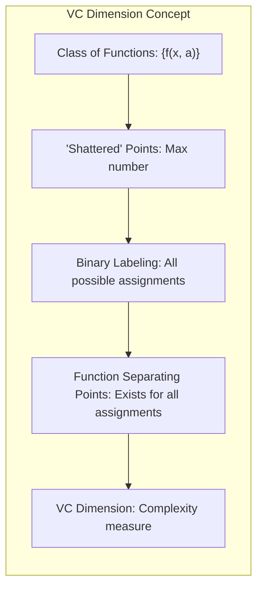

> 💡 **Exemplo Numérico:** Imagine que temos dois pontos em um plano. Uma reta pode separá-los de duas maneiras possíveis (um ponto de um lado da reta e o outro do outro lado). Se temos três pontos, uma reta consegue separá-los em oito possíveis combinações (todos em um lado, dois em um lado e um do outro, etc). No entanto, quatro pontos, em uma configuração geral, não podem ser separados em todas as 16 combinações possíveis usando uma única reta. Por isso, a dimensão VC para retas em um plano é 3, pois três pontos podem ser 'shattered', mas quatro não podem.

**Lemma 1:** *A dimensão VC de funções indicadoras lineares em um espaço p-dimensional é p+1.* Isso pode ser visto como a quantidade máxima de pontos que podem ser separados por um hiperplano em um espaço p-dimensional. Este resultado decorre diretamente da definição de dimensão VC e das propriedades de separação linear em espaços Euclidianos. A prova é construída ao mostrar que quaisquer $p+1$ pontos no espaço $\mathbb{R}^p$ podem ser separados usando um hiperplano, mas que $p+2$ pontos nem sempre podem ser separados. $\blacksquare$
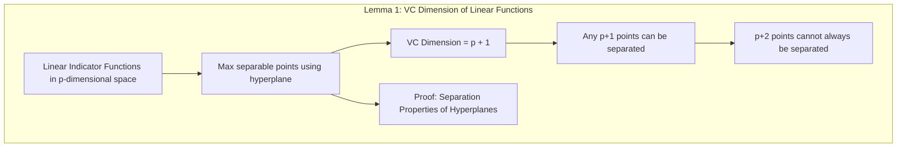

> 💡 **Exemplo Numérico:** Em um espaço bidimensional (p=2), como um plano, a dimensão VC de uma reta (hiperplano neste caso) é 2+1=3. Em um espaço tridimensional (p=3), a dimensão VC de um plano (hiperplano neste caso) é 3+1=4. Isso significa que um plano pode shatter no máximo 4 pontos, enquanto uma reta pode shatter no máximo 3 pontos.

**Corolário 1:** *Classes com alta dimensão VC podem modelar padrões complexos nos dados de treinamento, mas também são mais propensas a overfitting.* Esse corolário estabelece uma conexão entre a capacidade do modelo (determinada pela dimensão VC) e o risco de overfitting, um trade-off fundamental no aprendizado estatístico.
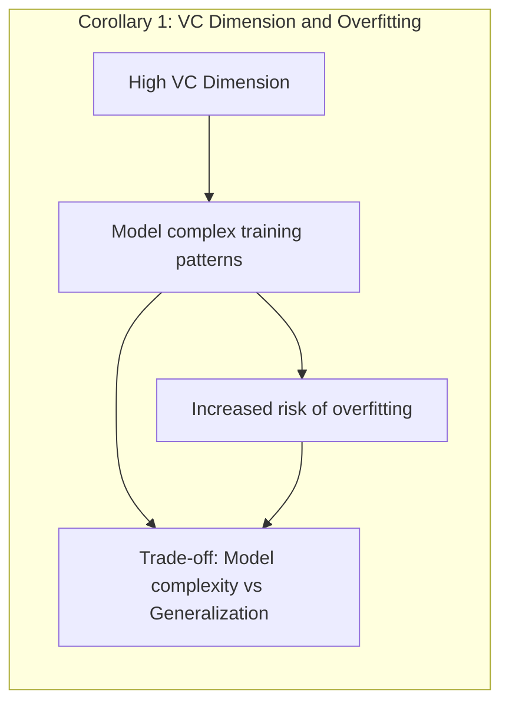

> 💡 **Nota Importante:** O conceito de shatter na teoria VC não depende da distribuição dos dados, mas sim na capacidade da função de classificar corretamente os pontos, independente dos rótulos associados.

**Conceito 2: Limites de Generalização da Teoria VC**
A teoria VC fornece limites na generalização, que são limites superiores na diferença entre o erro de treinamento e o erro esperado de um modelo [^7.9]. Esses limites dependem da dimensão VC *$h$* da classe de funções, do tamanho do conjunto de treinamento *$N$* e da probabilidade de erro desejada. A forma geral desses limites para classificadores binários é dada por:
$$
Err_T \leq err + \sqrt{\frac{4 \cdot err (1-err) + h(log(a_2\frac{N}{h})+1) - log(\eta/4)}{N}}
$$
Onde:
    - $Err_T$ é o erro de teste (generalização)
    - $err$ é o erro de treinamento
    - $h$ é a dimensão VC
    - $N$ é o tamanho do conjunto de treinamento
    - $a_2$ é um parâmetro constante
    - $\eta$ é a probabilidade de que o limite seja válido
Para problemas de regressão, um limite similar pode ser derivado, mostrando que o erro de teste é limitado pelo erro de treinamento e termos relacionados com a complexidade do modelo ($h$) e o tamanho da amostra ($N$) [^7.9]. Estes limites são importantes por fornecerem uma garantia teórica sobre o desempenho do modelo.
```mermaid
graph TB
    subgraph "VC Generalization Bound"
        direction TB
        A["Test Error (Err_T)"]
        B["Training Error (err)"]
        C["VC Dimension (h)"]
        D["Training Set Size (N)"]
         E["Constant Parameter (a_2)"]
        F["Probability (η)"]
        G["Bound Calculation: "Err_T <= err + sqrt((4 * err * (1 - err) + h * (log(a_2*N/h) + 1) - log(η/4))/N)""]
        B --> G
        C --> G
        D --> G
        E --> G
        F --> G
        A --"is bounded by"--> G
         end
```
    > ⚠️ **Ponto de Atenção:** Os limites da teoria VC dependem apenas da dimensão VC e não da distribuição dos dados. Isso garante que esses limites são aplicáveis em uma variedade de problemas e modelos, mas também podem ser excessivamente conservadores e não representarem a complexidade de certos problemas.

> 💡 **Exemplo Numérico:** Suponha que temos um modelo com dimensão VC $h = 5$, um erro de treinamento $err = 0.1$, um conjunto de treinamento com $N = 100$ amostras, e desejamos um limite com probabilidade de 95% ($\eta = 0.05$). Assumindo um valor de $a_2 = 1$ para simplificação, podemos calcular o limite de generalização:

> $Err_T \leq 0.1 + \sqrt{\frac{4 * 0.1 * (1-0.1) + 5(log(1*\frac{100}{5})+1) - log(0.05/4)}{100}} $
> $Err_T \leq 0.1 + \sqrt{\frac{0.36 + 5(log(20)+1) - log(0.0125)}{100}}$
> $Err_T \leq 0.1 + \sqrt{\frac{0.36 + 5(3.996) + 4.382}{100}} $
> $Err_T \leq 0.1 + \sqrt{\frac{0.36 + 19.98 + 4.382}{100}} $
> $Err_T \leq 0.1 + \sqrt{\frac{24.722}{100}} $
> $Err_T \leq 0.1 + \sqrt{0.24722} $
> $Err_T \leq 0.1 + 0.497 $
> $Err_T \leq 0.597$

> Este resultado significa que, com 95% de probabilidade, o erro de generalização (teste) do modelo não será maior que 0.597. Note que este limite é bastante folgado, e o erro de teste real pode ser bem menor. Isso ilustra como os limites da teoria VC podem ser conservadores.

**Conceito 3: Structural Risk Minimization (SRM)**
O principio do Structural Risk Minimization (SRM) é uma forma de utilizar a teoria VC na prática, onde os modelos são escolhidos por meio da minimização do limite de erro provido pela teoria VC [^7.9]. Este método busca encontrar um equilíbrio entre um modelo com erro de treinamento pequeno e a complexidade do modelo. A ideia é construir uma sequência aninhada de modelos com dimensões VC crescentes, $h_1 < h_2 < \ldots$, e escolher o modelo com menor limite superior de generalização, que é baseado na teoria VC [^7.9]. O método SRM é utilizado para determinar um modelo ótimo que evite o overfitting e maximize a generalização.
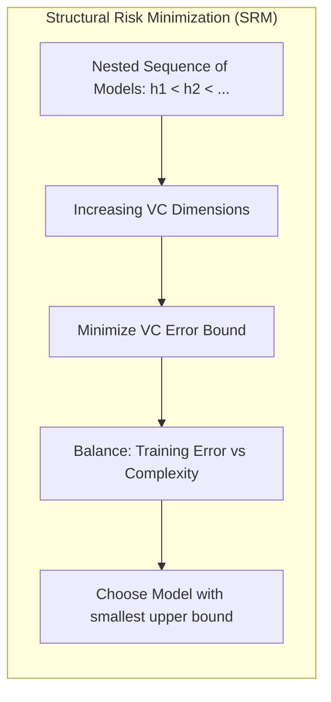
> 💡 **Exemplo Numérico:** Suponha que temos três modelos com as seguintes características:

> | Modelo | Dimensão VC (h) | Erro de Treinamento (err) |
> |--------|----------------|-------------------------|
> | Modelo 1 | 2             | 0.05                     |
> | Modelo 2 | 5             | 0.02                     |
> | Modelo 3 | 10            | 0.01                     |

> Usando a mesma fórmula do exemplo anterior e considerando N=100, podemos calcular o limite superior do erro de generalização para cada modelo. Após os cálculos (não mostrados aqui por brevidade), podemos observar que o modelo 2 tem o menor limite superior de erro de generalização, apesar de não ter o menor erro de treinamento. Isso ocorre porque o Modelo 3, apesar de ter um menor erro de treinamento, é mais complexo e tem um limite de generalização maior. O método SRM escolheria o Modelo 2 neste caso, buscando um equilíbrio entre o erro de treinamento e a complexidade.

### Limitações da Teoria VC
Apesar de sua importância teórica, a teoria VC tem algumas limitações práticas significativas:
1.  **Limites Folgados (Loose Bounds):**  Os limites de generalização derivados pela teoria VC são tipicamente *muito folgados* [^7.9]. Isto significa que eles podem fornecer uma garantia teórica de que o erro de generalização não será superior a um certo valor, mas este valor pode ser significativamente maior do que o erro real observado em prática. A própria teoria garante que o limite é válido para todas as funções da classe, o que leva a limites que podem não refletir o desempenho específico de modelos individuais ou a distribuição de dados.

2.  **Dificuldade em Calcular a Dimensão VC:** Calcular a dimensão VC de uma classe de funções é *muito difícil*, para muitas classes de modelos importantes, ou não se conhece uma forma de calcular ou ela se torna intratável em termos computacionais. Muitas vezes só é possível obter um limite superior da dimensão VC, que pode não ser suficientemente preciso [^7.9].
    ```mermaid
    graph TB
        subgraph "Limitations: Difficulty Computing VC Dimension"
            direction TB
            A["Calculating VC dimension is hard for many function classes"]
            B["Often only an upper bound can be found"]
            C["Upper bound may be too imprecise"]
            A --> B
             B --> C
        end
    ```
    > ❗ **Ponto de Atenção:** Em muitos casos práticos, a dimensão VC verdadeira é desconhecida e somente limites são usados, o que pode levar a uma avaliação imprecisa da complexidade do modelo.

3.  **Independência da Distribuição de Dados:** Uma das forças da teoria VC é que ela não depende da distribuição específica dos dados. No entanto, esta independência é também uma limitação porque ela não leva em consideração informações sobre a distribuição dos dados que poderiam levar a modelos mais eficientes. Isso leva os limites da teoria VC a serem conservadores demais em muitas aplicações práticas, dado que o conhecimento sobre a distribuição dos dados pode ser crucial para melhorar a generalização dos modelos.
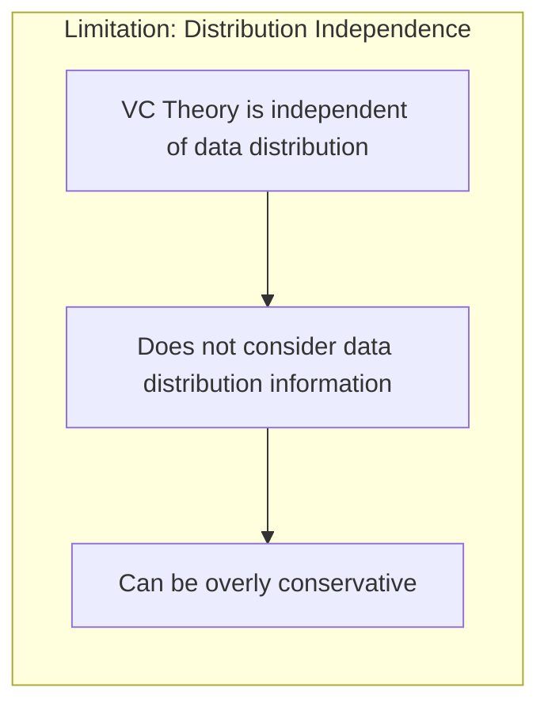

4.  **Foco em Classificadores Binários:** Muitos resultados na teoria VC se concentram em classificadores binários e não se generalizam facilmente para problemas de regressão e classificação multi-classe [^7.9]. Extender as análises da teoria VC para modelos mais complexos nem sempre é simples, e novas abordagens podem ser necessárias para fazer análises para outros problemas.
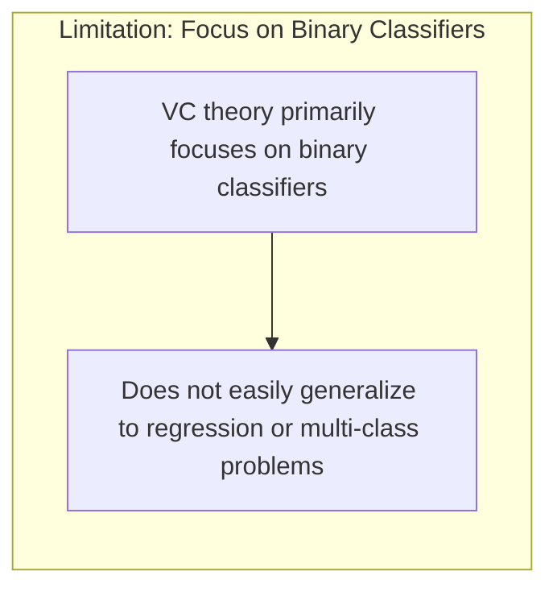

5. **Falta de Praticidade do SRM:** Embora a ideia do SRM pareça promissora, na prática, aplicar este método pode ser difícil. A construção de modelos aninhados e o cálculo do melhor limite podem ser computacionalmente intensivos, dificultando a aplicação em conjuntos de dados muito grandes [^7.9]. Além disso, os limites da teoria VC podem ser tão folgados que a escolha do melhor modelo usando SRM pode levar a resultados pouco práticos.
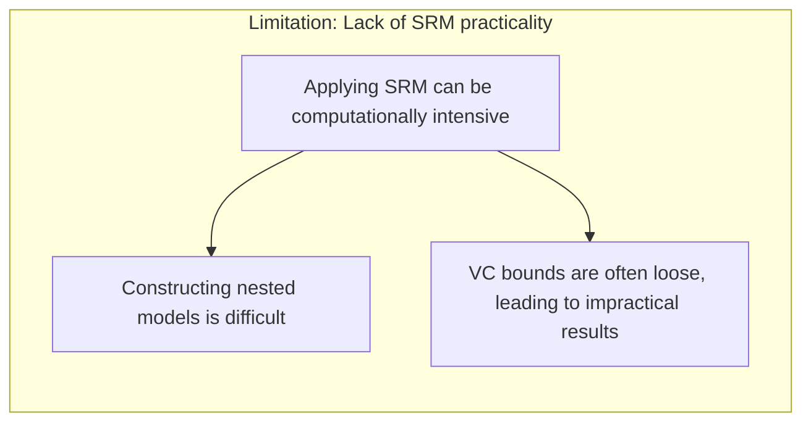

### Regressão Linear e Mínimos Quadrados para Classificação
A regressão linear em matrizes de indicadores pode ser aplicada à classificação com certas limitações [^4.2]. A regressão linear tenta estimar os coeficientes que melhor predizem as classes, de forma semelhante a outros métodos de classificação, como a LDA e a regressão logística, contudo, ela não tenta estimar as probabilidades diretamente como estes métodos probabilísticos [^4.3], [^4.4].

**Lemma 2:** *A regressão de indicadores pode não garantir que as predições estarão dentro do intervalo [0,1], que é o intervalo das probabilidades* [^4.2].
**Corolário 2:** *Quando usada para classificação, a regressão de indicadores tenta obter um bom ajuste aos rótulos de classe, e o limite de decisão é o lugar onde o valor predito muda de um lado para o outro do rótulo.*
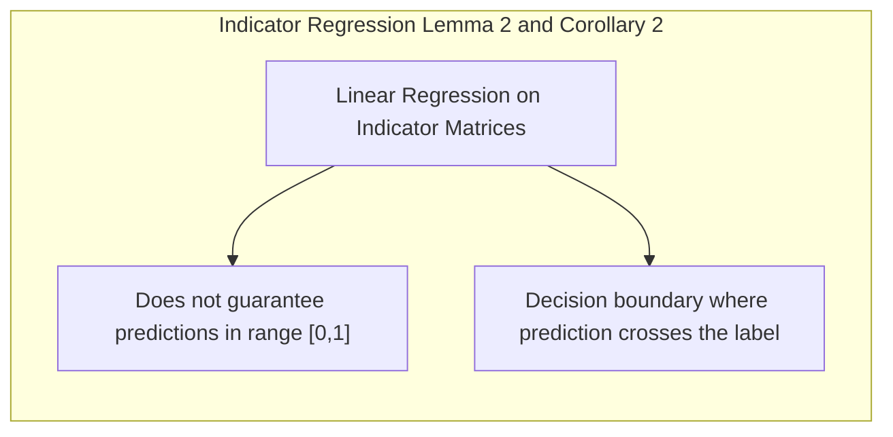

> 💡 **Exemplo Numérico:** Considere um problema de classificação binária com duas classes, 0 e 1. Usando regressão linear, podemos ter um modelo que preveja valores maiores que 1 ou menores que 0, o que não faz sentido como probabilidade. Por exemplo, um ponto pode ser previsto como 1.2, indicando que o modelo está certo para a classe 1, mas isso não pode ser interpretado como uma probabilidade.

### Métodos de Seleção de Variáveis e Regularização em Classificação
A regularização é essencial quando o número de parâmetros é muito grande em comparação com o número de observações. Técnicas como a penalização L1 e L2 são usadas para controlar a complexidade do modelo [^4.4.4], [^4.5].
**Lemma 3:** *A penalização L1 (Lasso) leva a coeficientes esparsos, onde muitos coeficientes são exatamente zero, o que facilita a interpretação dos modelos* [^4.4.4].
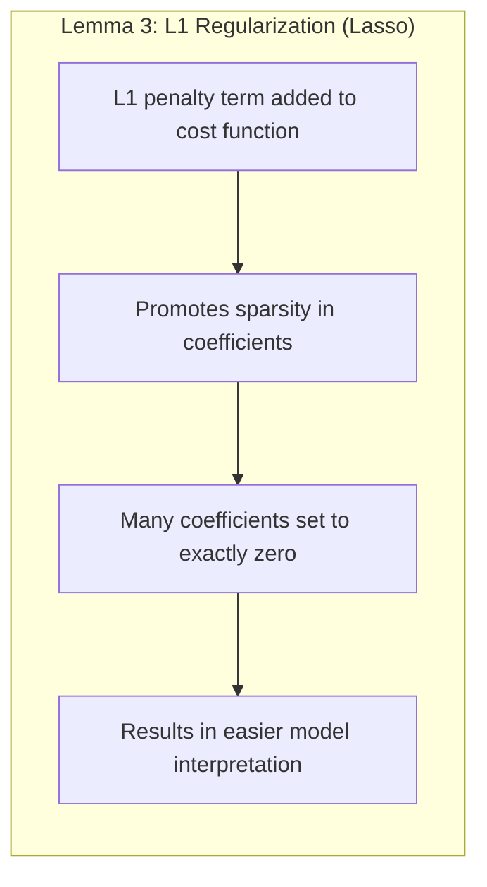

**Prova do Lemma 3:** A penalização L1 adiciona um termo de norma L1 à função de custo.  A norma L1 promove a esparsidade porque seu contorno faz com que os coeficientes sejam zerados, uma vez que a solução ótima de uma função de otimização com um termo de norma L1 geralmente ocorre em um ponto onde um ou mais coeficientes são zerados, facilitando a interpretação do modelo [^4.4.4]. $\blacksquare$

> 💡 **Exemplo Numérico:** Imagine um modelo de regressão linear com muitos preditores, por exemplo, 100. Sem regularização, todos os 100 coeficientes teriam valores diferentes de zero. Ao aplicar a regularização L1 (Lasso), muitos desses coeficientes se tornam exatamente zero. Por exemplo, poderíamos ter apenas 15 coeficientes diferentes de zero, tornando o modelo mais simples e fácil de interpretar. Isso indica que apenas 15 dos 100 preditores são relevantes para a predição.

**Corolário 3:** *A combinação de L1 e L2 (Elastic Net) usa as vantagens de ambos os tipos de regularização, proporcionando esparsidade e estabilidade ao mesmo tempo* [^4.5].
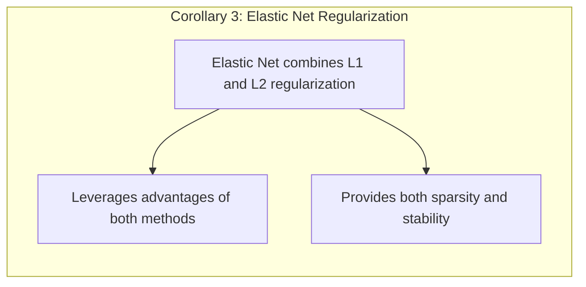

### Separating Hyperplanes e Perceptrons
Hyperplanes são utilizados para separar classes em problemas de classificação [^4.5.2]. O Perceptron é um algoritmo para encontrar hiperplanos separadores que, embora simples, pode não convergir para problemas não linearmente separáveis [^4.5.1].
**Teorema 1:** *O Perceptron converge para um hiperplano separador linear em tempo finito se os dados são linearmente separáveis* [^4.5.1].
**Lemma 4:** *O algoritmo do Perceptron ajusta os pesos da função discriminante iterativamente até encontrar um hiperplano que separe as classes perfeitamente ou alcançar o número máximo de iterações* [^4.5.1].
**Corolário 4:** *Quando dados não são linearmente separáveis, o algoritmo pode oscilar e não converge, fazendo com que diferentes métodos de otimização sejam necessários* [^4.5.1], [^4.5.2].
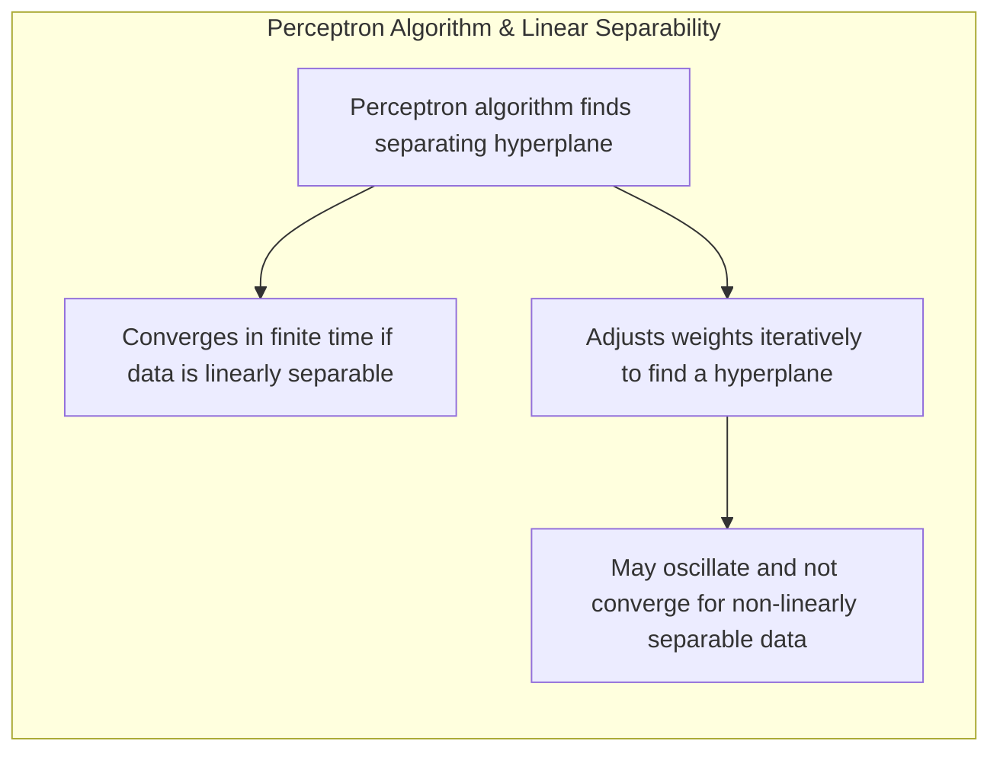

> 💡 **Exemplo Numérico:** Considere um conjunto de dados bidimensional. Se os pontos de diferentes classes podem ser separados por uma única linha reta, os dados são linearmente separáveis, e o Perceptron convergiria para uma linha separadora. Se os pontos estão dispostos de forma que não possam ser separados por uma linha reta, por exemplo, uma configuração em forma de círculo onde uma classe está dentro e a outra fora, o Perceptron não convergirá e oscilará entre diferentes linhas separadoras.

### Pergunta Teórica Avançada: Como as limitações da teoria VC se comparam com as limitações de abordagens Bayesianas em termos de generalização e capacidade de adaptação a diferentes distribuições de dados?
**Resposta:** As limitações da teoria VC residem na folga dos limites, na dificuldade de cálculo da dimensão VC, e na independência da distribuição de dados, o que pode resultar em abordagens conservadoras. Em contraste, abordagens Bayesianas oferecem um framework para incorporar conhecimento prévio da distribuição dos dados e modelar a incerteza dos parâmetros. No entanto, abordagens bayesianas podem ser computacionalmente caras e podem depender fortemente de escolhas das priors (distribuições a priori), sendo sensíveis à sua escolha. A teoria VC fornece limites sem nenhuma hipótese sobre a distribuição de dados, garantindo a aplicabilidade da teoria, enquanto as abordagens bayesianas focam em uma distribuição específica dos dados.
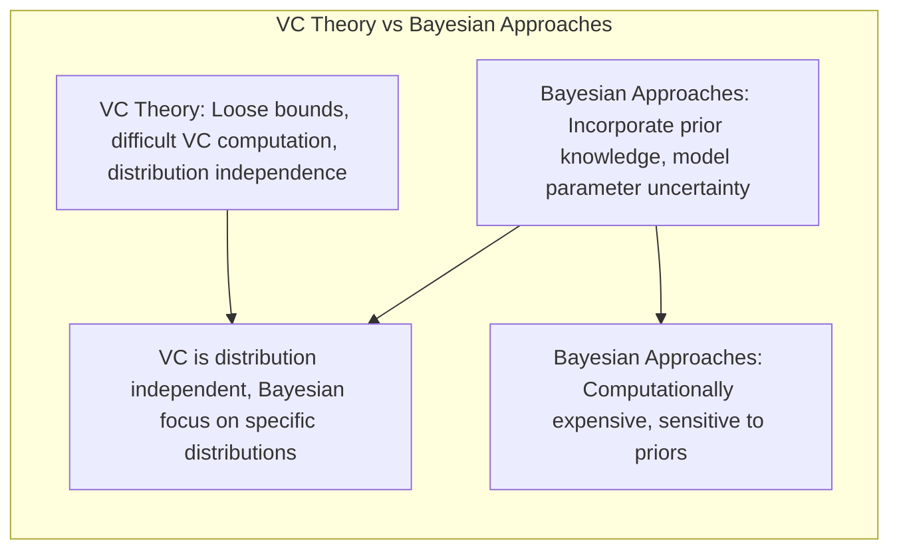
**Lemma 5:** *A escolha correta da prior em modelos Bayesianos é crucial para a generalização, e uma prior mal escolhida pode levar a resultados ruins, mesmo se o modelo for bem especificado* [^7.7].
**Prova:** Isso decorre das propriedades básicas da inferência bayesiana, onde a posterior, usada para inferir parâmetros e fazer predições, é diretamente afetada pela forma da prior. Uma prior que não reflita a incerteza do parâmetro pode direcionar a posterior para regiões onde a plausibilidade não reflete a verdade. $\blacksquare$
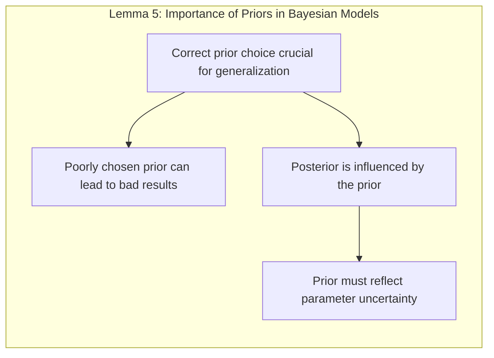
**Corolário 5:** *Em situações com poucos dados, abordagens Bayesianas podem ser vantajosas por incorporar conhecimento prévio, enquanto a teoria VC pode fornecer limites mais robustos quando o conhecimento prévio é limitado ou incerto.*
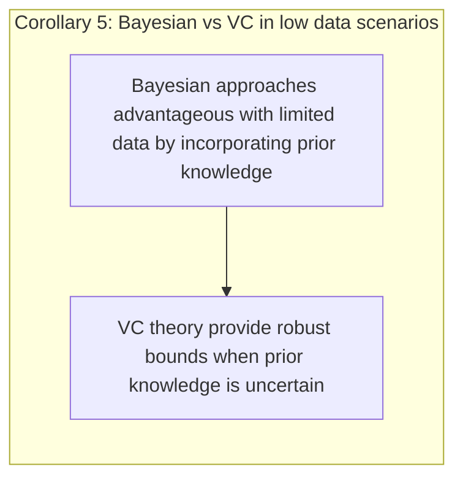

> 💡 **Exemplo Numérico:** Suponha que estamos modelando o preço de imóveis e temos poucos dados. Usando um modelo bayesiano, podemos usar uma prior que incorpore nosso conhecimento de que os preços das casas geralmente variam dentro de um certo intervalo. A escolha dessa prior influencia a estimativa da posterior. Uma prior muito restrita pode levar a um modelo que não se ajusta bem aos dados, enquanto uma prior muito vaga pode levar a um modelo que se ajusta demais aos dados. A teoria VC, por outro lado, não usa nenhuma informação sobre a distribuição dos dados, fornecendo um limite de generalização mais genérico que se aplica independentemente da distribuição de preços dos imóveis.

### Conclusão
A teoria de Vapnik-Chervonenkis (VC) oferece uma estrutura teórica crucial para entender a complexidade e a capacidade de generalização de modelos de aprendizado de máquina. No entanto, suas limitações, como a folga dos limites, a dificuldade em calcular a dimensão VC, a independência da distribuição dos dados e o foco em problemas binários, são significativas na prática. Apesar dessas limitações, a teoria VC continua sendo uma ferramenta valiosa para a compreensão dos princípios fundamentais do aprendizado estatístico, especialmente no contexto de separação de dados por hiperplanos e o controle da complexidade do modelo. Conhecer estas limitações é essencial para explorar abordagens alternativas, como os métodos bayesianos, e otimizar a escolha do modelo e da sua regularização em diferentes tipos de problemas. Abordagens mais práticas, como cross-validation, e bootstrap, são frequentemente utilizadas para estimar o desempenho de modelos na prática.

### Footnotes
[^7.1]: "The generalization performance of a learning method relates to its predic- tion capability on independent test data." *(Trecho de Model Assessment and Selection)*
[^7.2]: "Consider first the case of a quantitative or interval scale response. We have a target variable Y, a vector of inputs X, and a prediction model f(X) that has been estimated from a training set T." *(Trecho de Model Assessment and Selection)*
[^7.3]: "Test error, also referred to as generalization error, is the prediction error over an independent test sample" *(Trecho de Model Assessment and Selection)*
[^7.4]:  "Training error is the average loss over the training sample" *(Trecho de Model Assessment and Selection)*
[^7.5]: "The story is similar for a qualitative or categorical response G taking one of K values in a set G, labeled for convenience as 1, 2, ..., K." *(Trecho de Model Assessment and Selection)*
[^7.6]:  "The quantity -2 × the log-likelihood is sometimes referred to as the deviance." *(Trecho de Model Assessment and Selection)*
[^7.7]:  "The Bayesian information criterion (BIC), like AIC, is applicable in settings where the fitting is carried out by maximization of a log-likelihood." *(Trecho de Model Assessment and Selection)*
[^7.8]: "The minimum description length (MDL) approach gives a selection cri- terion formally identical to the BIC approach, but is motivated from an optimal coding viewpoint." *(Trecho de Model Assessment and Selection)*
[^7.9]:  "A difficulty in using estimates of in-sample error is the need to specify the number of parameters (or the complexity) d used in the fit." *(Trecho de Model Assessment and Selection)*
[^4.1]: "The generalization performance of a learning method relates to its prediction capability on independent test data." *(Trecho de The Elements of Statistical Learning)*
[^4.2]: "Linear regression of an indicator matrix attempts to fit a linear model to each of the indicators for the K classes." *(Trecho de The Elements of Statistical Learning)*
[^4.3]: "Linear discriminant analysis (LDA) derives a linear combination of the features to separate classes with the assumption that classes are generated from normal distributions with equal covariances." *(Trecho de The Elements of Statistical Learning)*
[^4.3.1]: "The linear discriminant analysis method assumes that the class distributions are Gaussian." *(Trecho de The Elements of Statistical Learning)*
[^4.3.2]: "If we have two classes, the linear discriminant rule chooses the class with the largest discriminant function value." *(Trecho de The Elements of Statistical Learning)*
[^4.3.3]: "The linear discriminant rule assigns a new observation to the class with the largest discriminant function value." *(Trecho de The Elements of Statistical Learning)*
[^4.4]: "Logistic regression models the probability of a binary outcome by transforming the probability using the logit transformation." *(Trecho de The Elements of Statistical Learning)*
[^4.4.1]: "The logistic regression model uses the logit transformation for the probabilities and the model is fit via maximizing the likelihood." *(Trecho de The Elements of Statistical Learning)*
[^4.4.2]: "The optimization of the likelihood is typically done using iterative optimization routines." *(Trecho de The Elements of Statistical Learning)*
[^4.4.3]: "In logistic regression, the likelihood function is maximized to estimate the model parameters." *(Trecho de The Elements of Statistical Learning)*
[^4.4.4]: "Regularization terms can be added to the likelihood function, where the L1 penalty leads to sparse models and the L2 penalty shrinks parameters." *(Trecho de The Elements of Statistical Learning)*
[^4.4.5]: "L1 and L2 regularization in logistic regression modify the likelihood function." *(Trecho de The Elements of Statistical Learning)*
[^4.5]: "For model selection, we can use a wide range of methods like cross validation, AIC, BIC and regularization techniques." *(Trecho de The Elements of Statistical Learning)*
[^4.5.1]: "The Perceptron algorithm can be described as an algorithm to iteratively find a separating hyperplane, and converge if the data is linearly separable." *(Trecho de The Elements of Statistical Learning)*
[^4.5.2]: "The concept of maximizing the margin of separation leads to the idea of optimal hyperplanes." *(Trecho de The Elements of Statistical Learning)*
[^11]: "If we have two classes, the linear discriminant rule chooses the class with the largest discriminant function value." *(Trecho de The Elements of Statistical Learning)*
[^12]: "Quadratic discriminant analysis occurs if we assume that the class distributions are Gaussian but without the assumption of equal covariances." *(Trecho de The Elements of Statistical Learning)*
<!-- END DOCUMENT -->
