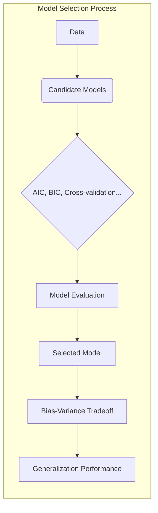
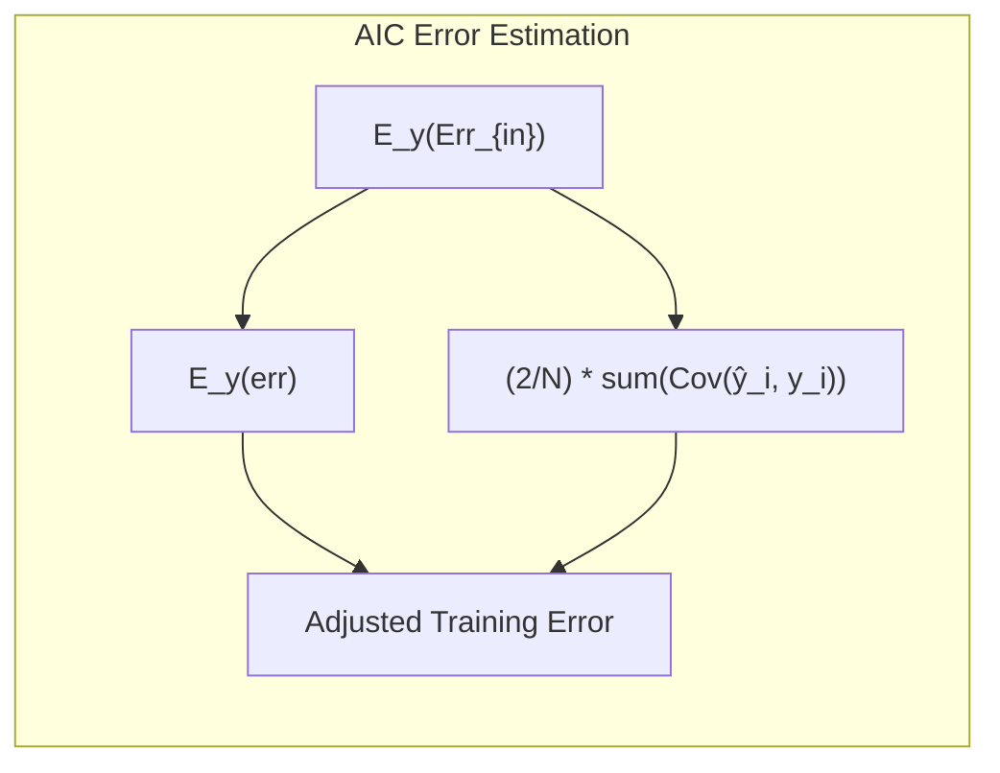
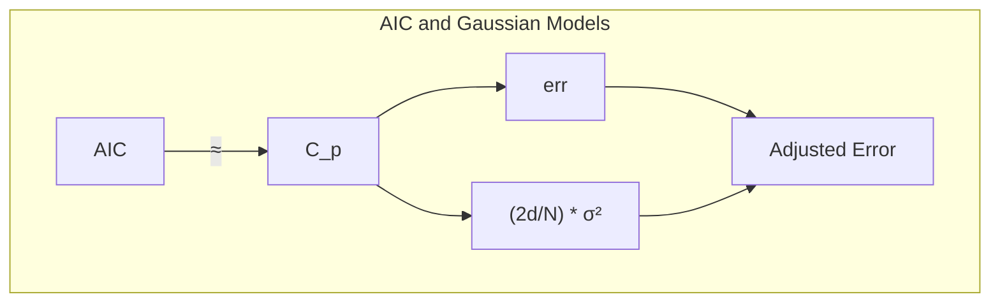
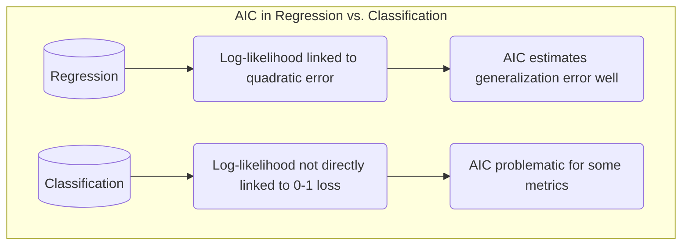
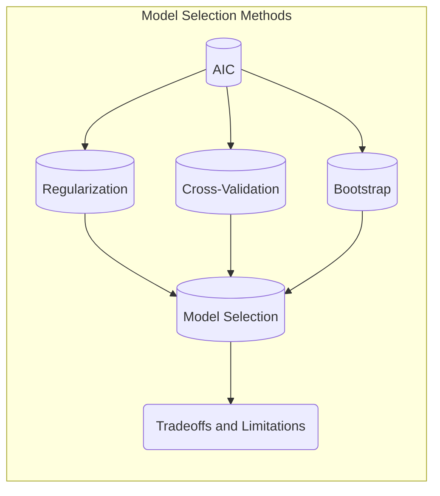
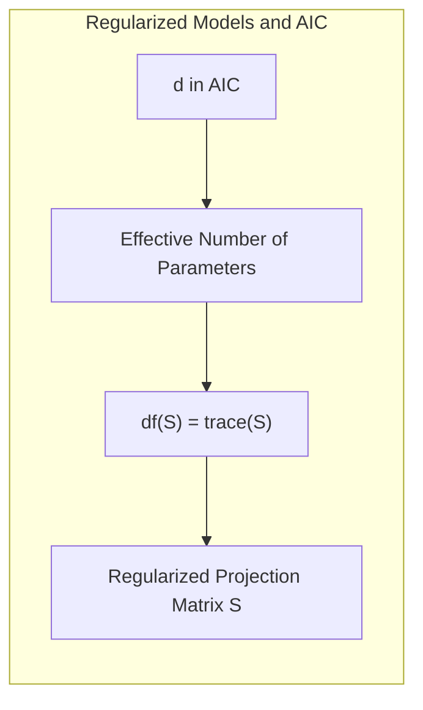
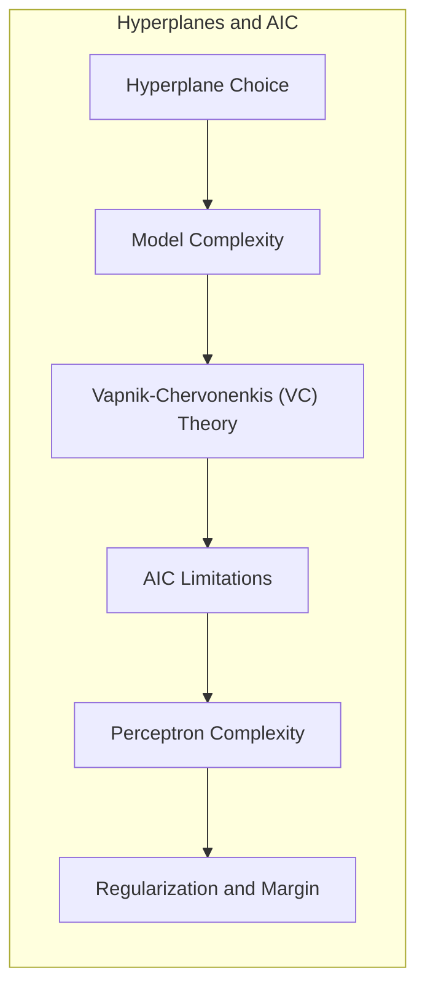
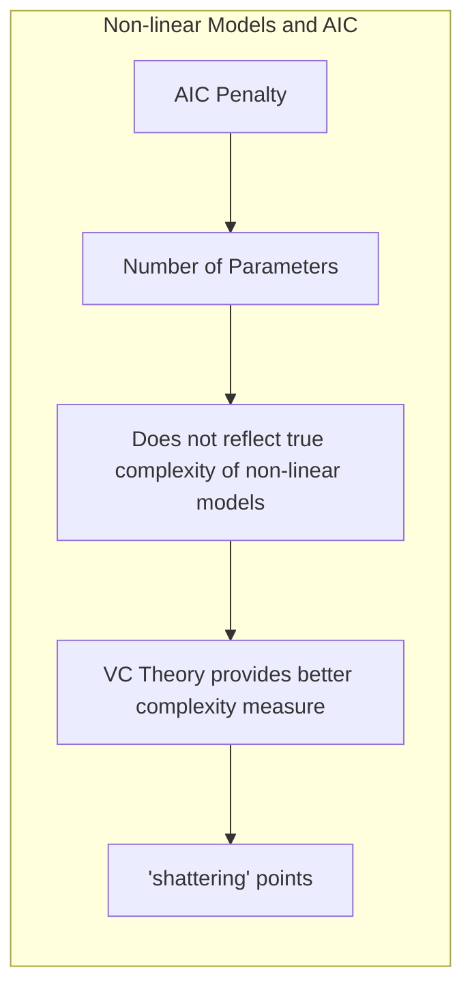

## Limitações do AIC na Seleção de Modelos Estatísticos

### Introdução

A seleção de modelos é uma etapa crucial na análise de dados e aprendizado de máquina, influenciando diretamente a generalização e a interpretabilidade dos resultados. O **Akaike Information Criterion (AIC)** é uma ferramenta popular para auxiliar nessa tarefa, fornecendo uma estimativa da qualidade relativa de diferentes modelos para um dado conjunto de dados. No entanto, é fundamental compreender as limitações do AIC para utilizá-lo de forma eficaz e evitar interpretações equivocadas [^7.1]. Este capítulo aprofunda as limitações do AIC, explorando situações em que seu uso pode ser problemático ou inadequado, baseado principalmente nas discussões presentes no material fornecido, em particular nas seções sobre bias, variance, model assessment e seleção [^7.1, ^7.2, ^7.3, ^7.4, ^7.5, ^7.6, ^7.7].

### Conceitos Fundamentais

**Conceito 1: AIC e a Estimativa do Erro de Teste**

O AIC é uma medida de qualidade de modelos que tenta estimar o erro de generalização, ou seja, o desempenho do modelo em dados não vistos.  O AIC adiciona uma penalidade para a complexidade do modelo, equilibrando o ajuste aos dados de treinamento (que tende a favorecer modelos mais complexos) com a capacidade de generalização [^7.5]. Formalmente, o AIC é definido como:

$$AIC = -2 \log(\hat{L}) + 2d$$

onde $\hat{L}$ é a verossimilhança maximizada do modelo e $d$ é o número de parâmetros. O termo $-2 \log(\hat{L})$ mede o quão bem o modelo se ajusta aos dados, enquanto $2d$ penaliza modelos com muitos parâmetros, evitando overfitting [^7.5]. O objetivo do AIC é selecionar o modelo que minimiza essa expressão, indicando um bom trade-off entre ajuste e complexidade.

> 💡 **Exemplo Numérico:** Suponha que temos dois modelos, $M_1$ e $M_2$, ajustados a um conjunto de dados. O modelo $M_1$ tem 3 parâmetros e uma log-verossimilhança maximizada $\hat{L}_1 = 100$, enquanto $M_2$ tem 5 parâmetros e uma log-verossimilhança maximizada $\hat{L}_2 = 110$. Calculando o AIC para cada modelo:
>
> $\text{AIC}_1 = -2 \log(100) + 2 \times 3 = -2 \times 4.605 + 6 = -9.21 + 6 = -3.21$
>
> $\text{AIC}_2 = -2 \log(110) + 2 \times 5 = -2 \times 4.700 + 10 = -9.40 + 10 = 0.6$
>
> Neste caso, o modelo $M_1$ tem um AIC menor (-3.21), indicando que ele é preferível em relação a $M_2$ (AIC = 0.6), dado o trade-off entre o ajuste e a complexidade.

**Lemma 1: Relação do AIC com a Estimativa do Erro de Teste**

Baseando-se em [^7.4], o AIC pode ser interpretado como uma correção do erro de treinamento, adicionando uma estimativa do otimismo do erro de treinamento:

$$ E_y(Err_{in}) = E_y(err) + \frac{2}{N}\sum_{i=1}^N Cov(\hat{y}_i, y_i) $$

onde $Err_{in}$ é o erro de previsão in-sample, $err$ é o erro de treinamento, e $Cov(\hat{y}_i, y_i)$ é a covariância entre as previsões e os valores reais. Essa relação revela que o AIC ajusta o erro de treinamento considerando a complexidade do modelo, que está ligada à magnitude da covariância [^7.4].

> 💡 **Exemplo Numérico:** Suponha que, para um modelo de regressão com 100 observações, o erro de treinamento $err$ seja 0.5. A soma das covariâncias $ \sum_{i=1}^{100} Cov(\hat{y}_i, y_i) $ é igual a 10. Usando a fórmula do Lemma 1:
>
> $E_y(Err_{in}) = 0.5 + \frac{2}{100} \times 10 = 0.5 + 0.2 = 0.7$.
>
> Isto indica que o erro de generalização (aproximado por $Err_{in}$) é maior que o erro de treinamento devido ao otimismo do ajuste no conjunto de treino. O AIC tenta capturar esse aumento.

**Conceito 2: Derivação do AIC a Partir da Teoria da Informação**

O AIC é derivado de princípios da teoria da informação, especificamente a divergência de Kullback-Leibler (KL), que mede a diferença entre duas distribuições de probabilidade. Em termos práticos, o AIC tenta encontrar o modelo que, dentre os modelos candidatos, está mais próximo da "verdadeira" distribuição geradora dos dados [^7.5, ^7.7].  A minimização do AIC pode ser vista como a minimização de uma estimativa da distância entre o modelo proposto e o modelo "verdadeiro".

**Corolário 1: AIC e Modelos Gaussianos**

Para modelos gaussianos com variância $\sigma^2$ conhecida, o AIC é equivalente à estatística $C_p$:

$$AIC \approx C_p = err + \frac{2d}{N} \sigma^2$$

Essa equivalência surge pois, para modelos gaussianos, a log-verossimilhança está diretamente relacionada ao erro quadrático médio [^7.5]. Isso demonstra que, para esses casos, o AIC é diretamente relacionado ao erro de treinamento corrigido pela complexidade do modelo, sendo um bom indicador do erro de generalização [^7.5].

> 💡 **Exemplo Numérico:** Consideremos um modelo de regressão linear com 5 parâmetros ajustado a 50 observações. O erro quadrático médio (MSE) $err$ é 0.4, e a variância dos erros $\sigma^2$ é estimada como 0.2. Usando a fórmula do $C_p$:
>
> $C_p = 0.4 + \frac{2 \times 5}{50} \times 0.2 = 0.4 + 0.04 = 0.44$
>
> Este valor é uma aproximação do AIC, e nos diz que o erro de treinamento (0.4) é ajustado pela complexidade do modelo (0.04) para obter uma estimativa mais precisa do erro de generalização.

**Conceito 3: Limitações Fundamentais do AIC**

Apesar de sua ampla aplicabilidade, o AIC possui limitações que devem ser consideradas.  Uma limitação crucial é que ele é assintoticamente consistente como um critério de seleção de modelos, ou seja, quando o tamanho da amostra ($N$) tende ao infinito, o AIC tem uma tendência de selecionar o modelo verdadeiro, *se ele estiver entre os candidatos*. Mas, para tamanhos de amostra finitos, o AIC pode ser inconsistente e selecionar um modelo mais complexo do que o necessário, especialmente quando a verdadeira estrutura é mais simples [^7.7].

> ⚠️ **Nota Importante**: O AIC, ao penalizar a complexidade dos modelos, tem como objetivo encontrar o melhor trade-off entre ajuste aos dados de treinamento e capacidade de generalização, mas essa penalidade pode ser insuficiente para amostras pequenas. **Referência ao tópico [^7.5]**.

> ❗ **Ponto de Atenção**: A natureza assintótica do AIC significa que, para amostras finitas, ele pode favorecer modelos complexos e apresentar resultados subótimos. **Conforme indicado em [^7.7]**.

> ✔️ **Destaque**: Embora o AIC seja amplamente usado, ele não garante a seleção do melhor modelo em todos os cenários, e pode ser necessário considerar outros critérios de seleção de modelos para uma análise robusta. **Baseado no tópico [^7.7]**.

### Regressão Linear e Mínimos Quadrados para Classificação

**Explicação:** Este diagrama destaca como a aplicação direta do AIC pode ser mais adequada para problemas de regressão, enquanto exige cautela na classificação devido à diferente natureza das funções de perda [^7.5].

Quando se usa o AIC em classificação, em que o objetivo é minimizar o erro de classificação (por exemplo, usando 0-1 loss), a relação direta entre log-verossimilhança e erro de generalização nem sempre é garantida. O AIC é derivado do erro quadrático ou log-verossimilhança, que são funções de custo suaves, mas o erro de classificação é uma função discreta, e o AIC pode não ser a escolha mais adequada. Para problemas de classificação, outras medidas podem ser mais apropriadas, como a validação cruzada ou abordagens bayesianas.

**Lemma 2: Penalização do AIC em Modelos Lineares**

Em modelos lineares, a penalização do AIC $2d/N$ se baseia no número de parâmetros $d$ e no tamanho da amostra $N$, como demostrado em [^7.5]. Se o número de parâmetros for grande em relação ao tamanho da amostra, a penalização do AIC será maior, favorecendo modelos mais simples e evitando overfitting. No entanto, em situações com muitos preditores e um número limitado de observações, a penalização do AIC pode não ser suficiente para prevenir o overfitting. Isso também se relaciona ao problema de selection bias em situações com grande dimensionalidade [^7.5, ^7.10].

> 💡 **Exemplo Numérico:** Considere um modelo linear com 10 preditores ajustado em um conjunto de dados com 30 observações, resultando em 11 parâmetros (incluindo o intercepto). Se a log-verossimilhança é $\hat{L} = 80$, o AIC é:
>
> $AIC = -2 \times 80 + 2 \times 11 = -160 + 22 = -138$
>
> Agora, suponha que um modelo mais simples com 5 preditores (6 parâmetros) resulte em uma log-verossimilhança de $\hat{L} = 75$. O AIC será:
>
> $AIC = -2 \times 75 + 2 \times 6 = -150 + 12 = -138$
>
> Mesmo com uma verossimilhança ligeiramente menor, o modelo mais simples tem o mesmo AIC. Para um tamanho de amostra pequeno, a penalização de complexidade pode não ser suficiente para favorecer o modelo mais simples.

**Corolário 2: AIC e a Dimensionalidade dos Dados**

Em cenários de alta dimensionalidade (muitos preditores), o AIC pode favorecer modelos complexos, pois os graus de liberdade efetivos do modelo podem ser muito maiores do que o número de parâmetros. Essa limitação é explicitamente abordada em [^7.5], onde se comenta que "a função AIC(a) fornece uma estimativa da curva de erro de teste", mas essa função também pode se tornar complexa quando as funções base são escolhidas de forma adaptativa. A equivalência direta entre número de parâmetros e complexidade deixa de ser válida, e pode levar a resultados menos precisos.

### Métodos de Seleção de Variáveis e Regularização em Classificação

Ao usar métodos de seleção de variáveis e regularização em classificação, é crucial entender como o AIC se encaixa nesses processos. A regularização, como L1 e L2, visa diminuir a complexidade do modelo adicionando um termo de penalização à função de custo, o que pode mitigar o overfitting, mas não substitui a necessidade de analisar o erro de generalização através de medidas como o AIC [^7.5]. O AIC tenta ajustar o número de parâmetros de maneira global, enquanto a regularização faz um ajuste mais local e diretamente sobre os pesos do modelo [^7.4, ^7.6].

**Lemma 3: AIC e Modelos Regularizados**

Em modelos regularizados, como a regressão logística com penalização L1, o número de parâmetros $d$ no AIC pode não ser o número de parâmetros explicitamente incluídos no modelo, mas sim o número de parâmetros efetivos, considerando a penalização. Ou seja, em modelos com regularização, $d$ não representa diretamente o número de coeficientes, mas sim o grau de liberdade efetivo da função, de acordo com [^7.6]:
$$df(S) = trace(S)$$
onde S representa a matriz de projeção linear, e pode ser uma matriz de ponderações regularizadas.

**Prova do Lemma 3:**  A derivação da expressão para o número efetivo de parâmetros em modelos regularizados pode ser obtida a partir do conceito de degrees of freedom, que se refere ao número de parâmetros que contribuem significativamente para a variação do modelo. Em modelos sem regularização, esse número coincide com o número total de parâmetros. No entanto, com regularização, alguns parâmetros são reduzidos, resultando em um número efetivo de parâmetros menor. A formalização via $trace(S)$ permite quantificar essa redução e corrigir as estimativas de erro [^7.6]. $\blacksquare$

> 💡 **Exemplo Numérico:** Considere um modelo de regressão linear com penalização L1 (Lasso) com 10 preditores. Inicialmente, temos 11 parâmetros (incluindo o intercepto). Após a regularização, alguns coeficientes são forçados a zero, resultando em 5 coeficientes não nulos.  No entanto, o número efetivo de parâmetros ($df(S)$)  pode não ser exatamente 5, devido à natureza da regularização. Suponha que  $trace(S)$ seja calculado como 6.  O AIC usará este valor 6 para a penalização, em vez de 11, refletindo a complexidade efetiva do modelo.

**Corolário 3: AIC e Elastic Net**

A penalização Elastic Net, que combina L1 e L2, introduz um nível adicional de complexidade na definição do número efetivo de parâmetros em relação ao AIC. Embora a penalização auxilie no controle do overfitting, a escolha do parâmetro $\alpha$ do Elastic Net pode ser um desafio e o uso do AIC para essa escolha ainda apresenta limitações. Em particular, o AIC em problemas de classificação não é um critério de seleção ideal quando a função de perda não está diretamente relacionada à log-verossimilhança. [^7.6]

> ⚠️ **Ponto Crucial**: Ao usar regularização e o AIC, é crucial considerar que o número de parâmetros na fórmula do AIC refere-se ao número efetivo de parâmetros, e não apenas ao número de parâmetros declarados. **Conforme discutido em [^7.6]**.

### Separating Hyperplanes e Perceptrons

A escolha de hiperplanos separadores ótimos, como em Support Vector Machines (SVMs), é influenciada pela complexidade dos modelos.  A teoria de Vapnik-Chervonenkis (VC) é uma alternativa para quantificar essa complexidade, e ela fornece uma medida mais geral da complexidade de um modelo que o número de parâmetros. O AIC, que penaliza explicitamente por parâmetros adicionais, pode ter dificuldade em lidar com a complexidade de modelos como o Perceptron [^7.9].  Em modelos baseados em hyperplanes, a regularização e o ajuste fino da margem de separação são mais críticos para a generalização do que o controle da quantidade de parâmetros.

### Pergunta Teórica Avançada (Exemplo): Qual a relação entre a penalidade do AIC e a complexidade de modelos não lineares, como redes neurais?

**Resposta:**

A penalidade do AIC, baseada no número de parâmetros, nem sempre reflete a complexidade real de modelos não-lineares. Em redes neurais, por exemplo, o número de parâmetros pode ser muito alto, mas nem todos os parâmetros contribuem igualmente para a capacidade de generalização do modelo. A estrutura da rede, suas ativações e o processo de treinamento, que não são capturados pelo número bruto de parâmetros, afetam a complexidade do modelo. O AIC pode falhar em capturar corretamente essas complexidades em modelos não lineares, o que pode levar a uma subestimação da complexidade do modelo [^7.6].

**Lemma 4: AIC e a Complexidade em Modelos Não-Lineares**

A abordagem de Vapnik-Chervonenkis (VC) para medir a complexidade de modelos, discutida em [^7.9], introduz a noção de que a capacidade de um modelo em "shatter" pontos não é linearmente relacionada com o número de parâmetros. A teoria VC oferece uma forma de quantificar essa capacidade de "shatter" e fornecer limites para a generalização, demonstrando a limitação do AIC em refletir a verdadeira complexidade de modelos não lineares [^7.9].

> 💡 **Exemplo Numérico:** Considere uma rede neural com 3 camadas ocultas, totalizando 1000 parâmetros. O AIC considera a penalização baseada nesse número,  mas a complexidade real da rede depende da arquitetura, das funções de ativação e do treinamento.  A teoria VC poderia quantificar a complexidade da rede de uma forma mais holística. Por exemplo, um modelo com grande capacidade de "shatter" pode ter um risco de generalização maior, mesmo se o AIC sugerir o contrário.

**Corolário 4: Limitações do AIC para Modelos com Regularização**

Em modelos com regularização, como redes neurais com weight decay, o AIC se baseia em um número efetivo de parâmetros que está diretamente relacionado à magnitude da penalização. Assim, o AIC não capta a verdadeira complexidade da arquitetura da rede, mas apenas uma estimativa aproximada da complexidade induzida pela regularização. Uma regularização forte pode diminuir o número efetivo de parâmetros, mas pode levar a um trade-off desfavorável entre bias e variance, e o AIC pode não capturar corretamente essa situação [^7.6].

### Conclusão

O AIC é uma ferramenta valiosa para a seleção de modelos, especialmente quando combinado com outras técnicas como cross-validation e bootstrap, conforme apresentado no capítulo 7 do livro. No entanto, suas limitações, especialmente em problemas de classificação e com modelos não-lineares, precisam ser consideradas. O AIC não substitui uma avaliação cuidadosa da adequação de modelos e uma análise criteriosa dos objetivos da análise. Abordagens como a teoria de VC e medidas de erro mais robustas, combinadas com regularização e avaliação da estabilidade das previsões, são fundamentais para a seleção de modelos eficazes e para uma análise estatística robusta.

<!-- END DOCUMENT -->
### Footnotes

[^7.1]: "The generalization performance of a learning method relates to its predic-tion capability on independent test data. Assessment of this performance is extremely important in practice, since it guides the choice of learning method or model, and gives us a measure of the quality of the ultimately chosen model." *(Trecho de Model Assessment and Selection)*

[^7.2]: "Figure 7.1 illustrates the important issue in assessing the ability of a learning method to generalize. Consider first the case of a quantitative or interval scale response. We have a target variable Y, a vector of inputs X, and a prediction model f(X) that has been estimated from a training set T." *(Trecho de Model Assessment and Selection)*

[^7.3]: "As in Chapter 2, if we assume that $Y = f(X) + \epsilon$ where $E(\epsilon) = 0$ and $Var(\epsilon) = \sigma_\epsilon$, we can derive an expression for the expected prediction error of a regression fit f(X) at an input point X = x0, using squared-error loss" *(Trecho de Model Assessment and Selection)*

[^7.4]: "Discussions of error rate estimation can be confusing, because we have to make clear which quantities are fixed and which are random¹. Before we continue, we need a few definitions, elaborating on the material of Sec-tion 7.2. Given a training set $T = \{(x_1, y_1), (x_2, y_2), \ldots, (x_N, y_N)\}$ the gen-eralization error of a model f is" *(Trecho de Model Assessment and Selection)*

[^7.5]: "The general form of the in-sample estimates is $Err_{in} = err + \omega$, where $\omega$ is an estimate of the average optimism. Using expression (7.24), applicable when $d$ parameters are fit under squared error loss, leads to a version of the so-called $C_p$ statistic," *(Trecho de Model Assessment and Selection)*

[^7.6]: "The concept of "number of parameters" can be generalized, especially to models where regularization is used in the fitting. Suppose we stack the outcomes $y_1, y_2,\ldots, y_n$ into a vector $y$, and similarly for the predictions $\hat{y}$. Then a linear fitting method is one for which we can write" *(Trecho de Model Assessment and Selection)*

[^7.7]: "The Bayesian information criterion (BIC), like AIC, is applicable in settings where the fitting is carried out by maximization of a log-likelihood. The generic form of BIC is $BIC = -2\log \text{lik} + (\log N) \cdot d$." *(Trecho de Model Assessment and Selection)*
[^7.9]: "A difficulty in using estimates of in-sample error is the need to specify the number of parameters (or the complexity) d used in the fit. Although the effective number of parameters introduced in Section 7.6 is useful for some nonlinear models, it is not fully general. The Vapnik-Chervonenkis (VC) theory provides such a general measure of complexity, and gives associated bounds on the optimism." *(Trecho de Model Assessment and Selection)*
[^7.10]: "Consider a classification problem with a large number of predictors, as may arise, for example, in genomic or proteomic applications. A typical strategy for analysis might be as follows:" *(Trecho de Model Assessment and Selection)*
