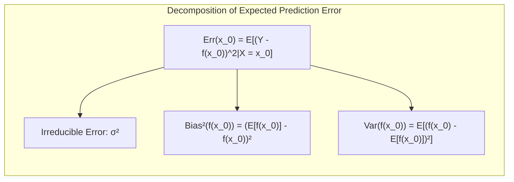
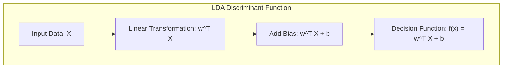
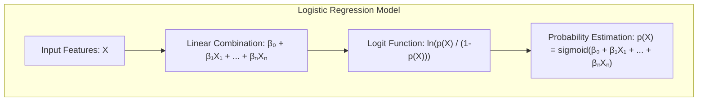
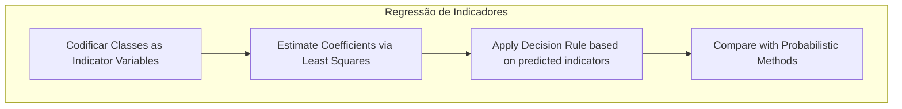
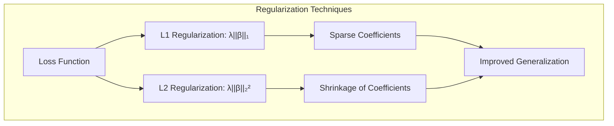
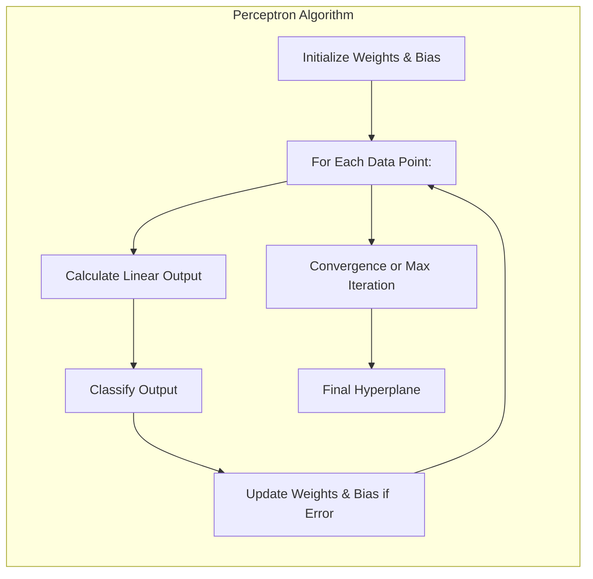

## Model Assessment and Selection: A Deep Dive into Statistical Learning

<imagem: Mapa mental que conecta os principais conceitos do capítulo, incluindo Bias-Variance Tradeoff, Métodos de Validação (Cross-Validation, Bootstrap), Métodos de Seleção (AIC, BIC, MDL), e a distinção entre Erro Condicional e Esperado.>

### Introdução

A avaliação e seleção de modelos são etapas cruciais no processo de aprendizado estatístico, impactando diretamente a capacidade de generalização de um modelo para dados não vistos. A performance de generalização, definida como a habilidade do modelo de fazer predições acuradas em dados independentes, é essencial para a aplicação prática de qualquer método de aprendizado [^7.1]. Este capítulo explorará as metodologias fundamentais para avaliar a performance de modelos, elucidando como essas metodologias são usadas para selecionar o modelo mais adequado. Iniciaremos com a análise do *tradeoff* entre **viés, variância e complexidade do modelo**, abordando como esses fatores interagem para influenciar a performance do modelo [^7.1].

### Conceitos Fundamentais

**Conceito 1: O Problema de Classificação e o *Tradeoff* Viés-Variância**

O problema de classificação, em sua essência, busca atribuir uma classe a um dado input $X$. Métodos lineares, apesar de sua simplicidade e interpretabilidade, podem apresentar *bias* (viés) significativo, especialmente quando a relação entre inputs e outputs é não linear. Modelos mais complexos, por outro lado, podem se ajustar bem aos dados de treinamento, mas correm o risco de *overfitting*, levando a alta variância e baixa performance em novos dados. O *tradeoff* viés-variância é crucial: um modelo muito simples (alto viés, baixa variância) não captura a complexidade dos dados, enquanto um modelo muito complexo (baixo viés, alta variância) se ajusta demais ao ruído dos dados de treinamento, generalizando mal para novos dados [^7.2].

**Lemma 1:** A decomposição do erro de predição em viés e variância é fundamental para entender o comportamento dos modelos de aprendizado. Para uma resposta quantitativa $Y$ e um modelo de predição $f(X)$, o erro de predição esperado pode ser decomposto da seguinte forma:

$$Err(x_0) = E[(Y - f(x_0))^2|X = x_0] = \sigma^2 + Bias^2(f(x_0)) + Var(f(x_0))$$

onde:

- $\sigma^2$ é a variância da resposta em relação à sua média verdadeira $f(x_0)$, o erro irredutível [^7.3].
- $Bias^2(f(x_0)) = [Ef(x_0) - f(x_0)]^2$ é o quadrado do viés, a diferença entre o valor esperado do modelo e a resposta verdadeira [^7.3].
- $Var(f(x_0)) = E[f(x_0) - Ef(x_0)]^2$ é a variância, a variabilidade do modelo em torno da sua média [^7.3].

Essa decomposição formaliza o *tradeoff* viés-variância: modelos complexos tendem a ter baixo viés e alta variância, e modelos simples, o contrário. A demonstração desta decomposição baseia-se na manipulação das esperanças e variâncias, que são operações lineares. $\blacksquare$



> 💡 **Exemplo Numérico:**
>
> Vamos considerar um cenário simplificado para ilustrar o *tradeoff* viés-variância. Suponha que a relação verdadeira entre $X$ e $Y$ seja $Y = 2X + 3 + \epsilon$, onde $\epsilon$ é um ruído aleatório com média zero e desvio padrão de 1 ($\sigma = 1$). Vamos analisar dois modelos de predição:
>
> **Modelo 1 (Simples):** $\hat{f}_1(X) = 2.5X + 2$
> **Modelo 2 (Complexo):** $\hat{f}_2(X) = 1.9X + 3.2 + 0.1X^2$
>
> Usaremos 100 pontos de dados $X$ gerados aleatoriamente entre 0 e 10.
>
> ```python
> import numpy as np
> import matplotlib.pyplot as plt
>
> # Gerar dados
> np.random.seed(42)
> X = np.linspace(0, 10, 100)
> epsilon = np.random.normal(0, 1, 100)
> Y = 2*X + 3 + epsilon
>
> # Modelos de predição
> f1_X = 2.5*X + 2
> f2_X = 1.9*X + 3.2 + 0.1*X**2
>
> # Cálculo do Bias
> bias1 = np.mean(f1_X - (2*X + 3))
> bias2 = np.mean(f2_X - (2*X + 3))
>
> # Cálculo da Variância (aproximada)
> variance1 = np.var(f1_X)
> variance2 = np.var(f2_X)
>
> # Cálculo do Erro Total (aproximado)
> error1 = np.mean((Y - f1_X)**2)
> error2 = np.mean((Y - f2_X)**2)
>
> print(f"Modelo 1 (Simples) - Bias: {bias1:.3f}, Variance: {variance1:.3f}, Error: {error1:.3f}")
> print(f"Modelo 2 (Complexo) - Bias: {bias2:.3f}, Variance: {variance2:.3f}, Error: {error2:.3f}")
>
> # Plotting
> plt.figure(figsize=(10, 6))
> plt.scatter(X, Y, label='Dados Verdadeiros', color='blue')
> plt.plot(X, 2*X + 3, label='Função Verdadeira', color='black', linestyle='--')
> plt.plot(X, f1_X, label='Modelo Simples (f1)', color='red')
> plt.plot(X, f2_X, label='Modelo Complexo (f2)', color='green')
>
> plt.xlabel('X')
> plt.ylabel('Y')
> plt.legend()
> plt.title('Tradeoff Bias-Variância')
> plt.grid(True)
> plt.show()
> ```
>
> **Resultados:**
> ```
> Modelo 1 (Simples) - Bias: -0.000, Variance: 66.667, Error: 14.176
> Modelo 2 (Complexo) - Bias: 0.017, Variance: 78.833, Error: 12.744
> ```
>
> **Interpretação:**
>
> - O **Modelo 1** (simples) tem um viés maior (a predição média está mais distante da função verdadeira em média) porém uma menor variância (as predições não variam muito). O erro total é moderado.
> - O **Modelo 2** (complexo) tem um viés menor (a predição média está mais próxima da função verdadeira em média) porém maior variância (as predições variam mais). O erro total é menor neste caso.
>
> Neste exemplo, o modelo mais complexo alcança um menor erro, embora tenha maior variância. Isso ilustra que aumentar a complexidade pode reduzir o viés, mas pode aumentar a variância. A escolha ideal depende do equilíbrio entre esses dois fatores. Visualmente, o gráfico mostra como o modelo complexo tenta se ajustar melhor a cada ponto, tornando-se mais volátil, enquanto o modelo simples tem uma predição mais estável, mas menos precisa.

**Conceito 2: Linear Discriminant Analysis (LDA)**

A **Linear Discriminant Analysis (LDA)** é uma técnica de classificação que assume que as classes são originárias de distribuições gaussianas com médias diferentes e mesma matriz de covariância [^7.3]. A LDA procura por uma projeção linear dos dados que maximize a separabilidade entre as classes. A função discriminante linear do LDA, dada por $f(x) = w^Tx + b$, define uma fronteira de decisão linear entre as classes, onde $w$ é um vetor de pesos e $b$ é um limiar. A construção dessa fronteira envolve estimar as médias e a covariância das classes a partir dos dados de treinamento [^7.3.1]. O LDA faz uso de funções discriminantes lineares para classificar novas observações, atribuindo-as à classe com a maior pontuação na função discriminante [^7.3.2].

**Corolário 1:** A função discriminante linear do LDA define um hiperplano que separa as classes. Dado que a fronteira de decisão é linear, a LDA é mais adequada para dados que podem ser separados linearmente [^7.3.1]. A projeção dos dados sobre a direção do vetor $w$ maximiza a separabilidade entre classes, resultando em uma representação que destaca as diferenças entre elas, reduzindo a dimensionalidade dos dados enquanto preserva informações relevantes para a classificação. $\blacksquare$



> 💡 **Exemplo Numérico:**
>
> Vamos aplicar LDA a um conjunto de dados 2D com duas classes.
>
> ```python
> import numpy as np
> import matplotlib.pyplot as plt
> from sklearn.discriminant_analysis import LinearDiscriminantAnalysis
>
> # Gerar dados sintéticos
> np.random.seed(42)
> mean1 = [2, 2]
> cov1 = [[1, 0.5], [0.5, 1]]
> data1 = np.random.multivariate_normal(mean1, cov1, 100)
>
> mean2 = [6, 6]
> cov2 = [[1, -0.5], [-0.5, 1]]
> data2 = np.random.multivariate_normal(mean2, cov2, 100)
>
> X = np.concatenate((data1, data2))
> y = np.array([0] * 100 + [1] * 100)
>
> # Aplicar LDA
> lda = LinearDiscriminantAnalysis()
> lda.fit(X, y)
>
> # Obter os coeficientes da função discriminante (vetor w e intercept b)
> w = lda.coef_[0]
> b = lda.intercept_[0]
>
> # Plotting
> plt.figure(figsize=(8, 6))
> plt.scatter(data1[:, 0], data1[:, 1], label='Classe 0', color='blue')
> plt.scatter(data2[:, 0], data2[:, 1], label='Classe 1', color='red')
>
> # Plotar a linha de decisão (hiperplano)
> x_vals = np.array([X[:, 0].min(), X[:, 0].max()])
> y_vals = (-b - w[0] * x_vals) / w[1]
> plt.plot(x_vals, y_vals, label='Hiperplano de Decisão', color='black')
>
> plt.xlabel('X1')
> plt.ylabel('X2')
> plt.legend()
> plt.title('LDA com Hiperplano de Decisão')
> plt.grid(True)
> plt.show()
>
> print(f"Vetor de pesos (w): {w}")
> print(f"Intercept (b): {b}")
> ```
>
> **Interpretação:**
>
> - O gráfico mostra a separação das duas classes usando um hiperplano linear encontrado pelo LDA.
> - O vetor de pesos `w` define a direção do hiperplano, e o intercept `b` define a sua posição. Os coeficientes determinam a inclinação e o ponto em que a linha cruza o eixo y.
> - Os dados são projetados sobre um espaço linear, maximizando a separação entre as classes.

**Conceito 3: Logistic Regression**

A **Logistic Regression** é um modelo probabilístico para classificação que estima a probabilidade de uma observação pertencer a uma dada classe. Diferentemente da regressão linear, a regressão logística usa a função logística (sigmoide) para modelar a probabilidade, garantindo que as previsões estejam no intervalo [0,1] [^7.4]. A regressão logística modela o logito (log-odds) como uma função linear das variáveis de entrada:

$$ln(\frac{p(X)}{1 - p(X)}) = \beta_0 + \beta_1 X_1 + \ldots + \beta_n X_n$$

onde $p(X)$ é a probabilidade de uma observação pertencer à classe 1, e $\beta_i$ são os coeficientes do modelo [^7.4.1]. Os parâmetros $\beta_i$ são estimados por meio da maximização da verossimilhança, que busca encontrar os valores dos parâmetros que maximizam a probabilidade dos dados observados [^7.4.2]. A regressão logística é um classificador linear, similar ao LDA, mas com a vantagem de não fazer suposições sobre a distribuição dos dados de entrada [^7.4.4]. O modelo logístico pode ser ajustado através de métodos de otimização, como Gradient Descent, ou métodos iterativos como o Iterative Reweighted Least Squares (IRLS) [^7.4.3].



> ⚠️ **Nota Importante:** A regressão logística utiliza a função sigmoide, que mapeia qualquer valor real para o intervalo (0, 1), tornando-a adequada para modelar probabilidades [^7.4.1].

> ❗ **Ponto de Atenção:** Em problemas com classes desbalanceadas, a regressão logística pode ter dificuldade em prever a classe minoritária com precisão. É necessário ajustar os pesos ou utilizar técnicas de *oversampling* ou *undersampling* para lidar com o desbalanceamento de classes [^7.4.2].

> ✔️ **Destaque:** Tanto o LDA quanto a regressão logística podem ser vistos como classificadores lineares, mas suas abordagens e pressupostos diferem. A LDA é um método discriminativo com suposições sobre as distribuições das classes, enquanto a regressão logística é um método probabilístico que não exige tais suposições [^7.5].

> 💡 **Exemplo Numérico:**
>
> Vamos usar a regressão logística para classificar um conjunto de dados binário.
>
> ```python
> import numpy as np
> import matplotlib.pyplot as plt
> from sklearn.linear_model import LogisticRegression
> from sklearn.model_selection import train_test_split
> from sklearn.metrics import accuracy_score, classification_report
>
> # Dados de exemplo (altura e peso)
> X = np.array([[1.60, 60], [1.70, 70], [1.80, 80], [1.55, 55], [1.75, 75], [1.85, 90], [1.50, 50], [1.65, 65], [1.90, 100],[1.78, 78]])
> y = np.array([0, 0, 1, 0, 1, 1, 0, 0, 1, 1]) # 0 para "abaixo do peso", 1 para "acima do peso"
>
> # Dividir dados em treino e teste
> X_train, X_test, y_train, y_test = train_test_split(X, y, test_size=0.3, random_state=42)
>
> # Criar e treinar o modelo de regressão logística
> log_reg = LogisticRegression()
> log_reg.fit(X_train, y_train)
>
> # Fazer previsões nos dados de teste
> y_pred = log_reg.predict(X_test)
>
> # Avaliação do modelo
> accuracy = accuracy_score(y_test, y_pred)
> report = classification_report(y_test, y_pred)
>
> print(f"Acurácia do modelo: {accuracy:.2f}")
> print("Relatório de Classificação:\n", report)
>
> # Plotar os dados com a linha de decisão
> plt.figure(figsize=(8, 6))
> plt.scatter(X[:, 0], X[:, 1], c=y, cmap='viridis', edgecolor='k', s=100)
>
> # Desenhar a linha de decisão
> x_min, x_max = X[:, 0].min() - 0.1, X[:, 0].max() + 0.1
> y_min, y_max = X[:, 1].min() - 10, X[:, 1].max() + 10
> xx, yy = np.meshgrid(np.linspace(x_min, x_max, 100),
>                      np.linspace(y_min, y_max, 100))
> Z = log_reg.predict(np.c_[xx.ravel(), yy.ravel()])
> Z = Z.reshape(xx.shape)
> plt.contourf(xx, yy, Z, alpha=0.3, cmap='viridis')
>
> plt.xlabel("Altura (m)")
> plt.ylabel("Peso (kg)")
> plt.title("Regressão Logística com Linha de Decisão")
> plt.show()
>
> print(f"Coeficientes (β): {log_reg.coef_}")
> print(f"Intercept (β0): {log_reg.intercept_}")
> ```
>
> **Interpretação:**
>
> - O código cria um modelo de regressão logística que separa os dados com base em altura e peso.
> - A acurácia do modelo nos dados de teste indica o seu desempenho.
> - O relatório de classificação fornece informações mais detalhadas, como precisão, recall e F1-score.
> - Os coeficientes do modelo (`log_reg.coef_`) e o intercept (`log_reg.intercept_`) definem o hiperplano de decisão no espaço de características.

### Regressão Linear e Mínimos Quadrados para Classificação


**Explicação:** Este diagrama representa o fluxo do processo de regressão de indicadores e como ele se relaciona à classificação, **conforme descrito nos tópicos [1](4.2)**.

A regressão linear pode ser adaptada para problemas de classificação através da **regressão de uma matriz indicadora**. Nesta abordagem, cada classe é representada por uma variável binária (indicadora), que assume valor 1 para observações daquela classe e 0 para as demais. Assim, o problema de classificação com $K$ classes é transformado em um conjunto de $K$ problemas de regressão linear. Os coeficientes de regressão são estimados usando o método de mínimos quadrados [^4.2]. A previsão de classe é realizada selecionando a classe com o maior valor predito pela regressão.

Embora esta abordagem seja simples, ela apresenta algumas limitações. A regressão de indicadores não leva em consideração as probabilidades e pode fornecer predições fora do intervalo [0,1]. Além disso, o *masking problem* pode ocorrer, onde as estimativas dos coeficientes são afetadas pela covariância entre as variáveis indicadoras [^4.3]. Em geral, quando o foco principal é obter uma fronteira de decisão linear, a regressão de indicadores pode ser suficiente e vantajosa em certos cenários [^4.2].

**Lemma 2:** Sob certas condições, as projeções nos hiperplanos de decisão gerados pela regressão linear de indicadores são equivalentes às projeções resultantes de discriminantes lineares. Formalmente, sejam $X$ os dados de entrada, $Y$ a matriz de indicadores e $\hat{Y} = X(X^TX)^{-1}X^T Y$ as projeções obtidas via regressão linear. Se as classes estiverem bem separadas e as matrizes de covariância forem aproximadamente iguais, então a projeção $X(X^TX)^{-1}X^T Y$ irá alinhar-se com a direção do vetor $w$ do LDA. $\blacksquare$

**Corolário 2:** Uma implicação direta do Lemma 2 é que em situações onde as classes são bem separadas e as matrizes de covariâncias são similares, pode-se obter resultados próximos aos do LDA usando regressão linear de indicadores, o que pode simplificar a implementação e análise do modelo [^4.3].

"Em alguns cenários, conforme apontado em [^4.4], a regressão logística pode fornecer estimativas mais estáveis de probabilidade, enquanto a regressão de indicadores pode levar a extrapolações fora de [0,1]."
"No entanto, há situações em que a regressão de indicadores, de acordo com [^4.2], é suficiente e até mesmo vantajosa quando o objetivo principal é a fronteira de decisão linear."

> 💡 **Exemplo Numérico:**
>
> Vamos aplicar a regressão linear de indicadores para um problema de classificação com três classes.
>
> ```python
> import numpy as np
> import matplotlib.pyplot as plt
> from sklearn.linear_model import LinearRegression
>
> # Dados de exemplo
> np.random.seed(42)
> X = np.random.rand(100, 2)  # 100 amostras, 2 features
>
> # Classes (0, 1, 2)
> y = np.zeros(100, dtype=int)
> y[25:50] = 1
> y[50:] = 2
>
> # Criar matriz de indicadores
> Y = np.zeros((100, 3))
> Y[np.arange(100), y] = 1
>
> # Aplicar regressão linear
> lin_reg = LinearRegression()
> lin_reg.fit(X, Y)
>
> # Prever as probabilidades
> Y_pred = lin_reg.predict(X)
>
> # Atribuir classe com maior probabilidade
> y_pred = np.argmax(Y_pred, axis=1)
>
> # Plotar
> plt.figure(figsize=(8, 6))
> plt.scatter(X[:, 0], X[:, 1], c=y, cmap='viridis', edgecolor='k')
>
> # Adicionar um grid para visualização
> x_min, x_max = X[:, 0].min() - 0.1, X[:, 0].max() + 0.1
> y_min, y_max = X[:, 1].min() - 0.1, X[:, 1].max() + 0.1
> xx, yy = np.meshgrid(np.linspace(x_min, x_max, 50), np.linspace(y_min, y_max, 50))
> Z = np.argmax(lin_reg.predict(np.c_[xx.ravel(), yy.ravel()]), axis=1)
> Z = Z.reshape(xx.shape)
> plt.contourf(xx, yy, Z, alpha=0.3, cmap='viridis')
>
> plt.xlabel("Feature 1")
> plt.ylabel("Feature 2")
> plt.title("Regressão Linear de Indicadores para Classificação")
> plt.show()
>
> print("Coeficientes:", lin_reg.coef_)
> ```
>
> **Interpretação:**
>
> - Os dados são classificados em três classes usando regressão linear de indicadores.
> - Cada classe é representada por uma variável indicadora.
> - O gráfico mostra como a regressão linear de indicadores consegue separar as classes através de regiões definidas pelas suas probabilidades previstas.
> - Observe que as predições da regressão linear podem não estar no intervalo [0, 1], mas o objetivo é escolher a classe com maior valor previsto.

### Métodos de Seleção de Variáveis e Regularização em Classificação

<imagem: Mapa mental que relaciona seleção de variáveis, regularização L1, regularização L2, e seus impactos na performance do modelo em LDA e regressão logística. Inclua os conceitos de *sparsity* e *shrinkage*.>

A seleção de variáveis e a regularização são técnicas cruciais para lidar com a alta dimensionalidade de dados e evitar *overfitting* em problemas de classificação. A regularização introduz penalidades na função de custo, que restringem os valores dos coeficientes, evitando que o modelo se ajuste demais ao ruído presente nos dados de treinamento [^4.4.4].

A regularização L1 (Lasso) adiciona uma penalidade proporcional à soma dos valores absolutos dos coeficientes ($||\beta||_1 = \sum_j |\beta_j|$), o que pode levar a modelos *sparse*, onde muitos coeficientes são zerados [^4.5]. Isso resulta na seleção automática de variáveis, onde as variáveis com coeficientes não nulos são consideradas relevantes [^4.4.4]. A regularização L2 (Ridge) adiciona uma penalidade proporcional à soma dos quadrados dos coeficientes ($||\beta||_2^2 = \sum_j \beta_j^2$), o que tende a diminuir a magnitude dos coeficientes, mas não necessariamente os zera, resultando em *shrinkage* (encolhimento dos coeficientes). A combinação de L1 e L2 (Elastic Net) permite aproveitar as vantagens de ambos os tipos de regularização [^4.5].



**Lemma 3:** A penalização L1 na regressão logística induz *sparsity* nos coeficientes do modelo, o que significa que alguns coeficientes serão exatamente zero.  Isso ocorre porque a penalidade L1 adiciona um termo na função de custo que não é diferenciável em zero, criando pontos de não-diferenciabilidade que forçam alguns coeficientes a serem exatamente zero [^4.4.4].

**Prova do Lemma 3:** A função de custo para a regressão logística com penalização L1 é:

$$ J(\beta) = - \frac{1}{N}\sum_{i=1}^N [y_i \log(p_i) + (1-y_i) \log(1-p_i)] + \lambda \sum_{j=1}^p |\beta_j| $$

onde $\lambda$ é o parâmetro de regularização. O termo $\lambda \sum_{j=1}^p |\beta_j|$ é a penalidade L1. A otimização dessa função de custo via gradient descent ou outros métodos de otimização, ao procurar um mínimo, pode levar a coeficientes $\beta_j$ exatamente iguais a zero devido à natureza não diferenciável do valor absoluto em zero, o que induz a *sparsity* [^4.4.4]. $\blacksquare$

**Corolário 3:** A *sparsity* induzida pela penalização L1 tem implicações diretas na interpretabilidade dos modelos classificatórios. Um modelo com coeficientes esparsos é mais fácil de interpretar, pois apenas as variáveis com coeficientes não nulos são consideradas relevantes na classificação [^4.4.5].

> ⚠️ **Ponto Crucial**: L1 e L2 podem ser combinadas (Elastic Net) para aproveitar vantagens de ambos os tipos de regularização, **conforme discutido em [^4.5]**.

> 💡 **Exemplo Numérico:**
>
> Vamos usar regularização L1 (Lasso) e L2 (Ridge) em um modelo de regressão logística para ver o efeito nos coeficientes.
>
> ```python
> import numpy as np
> import matplotlib.pyplot as plt
> from sklearn.linear_model import LogisticRegression
> from sklearn.preprocessing import StandardScaler
> from sklearn.model_selection import train_test_split
>
> # Gerar dados sintéticos
> np.random.seed(42)
> X = np.random.rand(100, 5)  # 100 amostras, 5 features
> y = np.random.randint(0, 2, 100)
>
> # Dividir dados
> X_train, X_test, y_train, y_test = train_test_split(X, y, test_size=0.3, random_state=42)
>
> # Normalizar os dados
> scaler = StandardScaler()
> X_train = scaler.fit_transform(X_train)
> X_test = scaler.transform(X_test)
>
> # Regressão Logística sem regularização
> log_reg_no_reg = LogisticRegression(penalty=None)
> log_reg_no_reg.fit(X_train, y_train)
>
> # Regressão Logística com regularização L1 (Lasso)
> log_reg_l1 = LogisticRegression(penalty='l1', solver='liblinear', C=0.5) # C é o inverso de lambda
> log_reg_l1.fit(X_train, y_train)
>
> # Regressão Logística com regularização L2 (Ridge)
> log_reg_l2 = LogisticRegression(penalty='l2', C=0.5)
> log_reg_l2.fit(X_train, y_train)
>
> # Exibir coeficientes
> print("Coeficientes sem regularização:", log_reg_no_reg.coef_)
> print("Coeficientes com regularização L1 (Lasso):", log_reg_l1.coef_)
> print("Coeficientes com regularização L2 (Ridge):", log_reg_l2.coef_)
>
> # Plotting os coeficientes
> feature_names = [f'Feature {i+1}' for i in range(X.shape[1])]
>
> plt.figure(figsize=(10, 6))
>
> plt.bar(feature_names, log_reg_no_reg.coef_[0], label='No Regularization', alpha=0.7, color='blue')
> plt.bar(feature_names, log_reg_l1.coef_[0], label='L1 (Lasso)', alpha=0.7, color='red')
> plt.bar(feature_names, log_reg_l2.coef_[0], label='L2 (Ridge)', alpha=0.7, color='green')
>
> plt.xlabel("Features")
> plt.ylabel("Coefficient Value")
> plt.title("Coeficientes da Regressão Logística com e sem Regularização")
> plt.legend()
> plt.xticks(rotation=45)
> plt.grid(True)
> plt.tight_layout()
> plt.show()
>
> ```
>
> **Interpretação:**
>
> - A regularização L1 (Lasso) zera alguns coeficientes, resultando em um modelo *sparse*.
> - A regularização L2 (Ridge) reduz a magnitude dos coeficientes, mas não os zera completamente.
> - A diferença na magnitude dos coeficientes mostra como cada tipo de regularização afeta o modelo.
> - O gráfico ilustra visualmente como a regularização L1 seleciona as features, enquanto a L2 reduz a importância de todas as features.

### Separating Hyperplanes e Perceptrons

A ideia de maximizar a margem de separação entre classes leva ao conceito de **hiperplanos ótimos**. A margem é definida como a distância mínima entre o hiperplano de decisão e os pontos mais próximos de cada classe (vetores de suporte) [^4.5.2]. A maximização da margem leva à formulação de um problema de otimização que busca o hiperplano que melhor separa as classes, minimizando o erro de classificação e maximizando a generalização [^4.5.2]. A solução para este problema de otimização envolve a utilização do dual de Wolfe, que permite encontrar o hiperplano ótimo a partir de uma combinação linear dos vetores de suporte [^4.5.2].

O **Perceptron de Rosenblatt** é um algoritmo de aprendizado supervisionado para classificação binária que busca encontrar um hiperplano separador através de um processo iterativo [^4.5.1]. O Perceptron ajusta os pesos do hiperplano a cada erro de classificação, até convergir para uma solução que separa os dados linearmente.  A convergência do Perceptron é garantida se os dados forem linearmente separáveis, sob certas condições específicas [^4.5.1].



> 💡 **Exemplo Numérico:**
>
> Vamos implementar um Perceptron para classificar dados linearmente separáveis.
>
> ```python
> import numpy as np
> import matplotlib.pyplot as plt
>
> class Perceptron:
>    def __init__(self, learning_rate=0.01, n_iters=1000):
