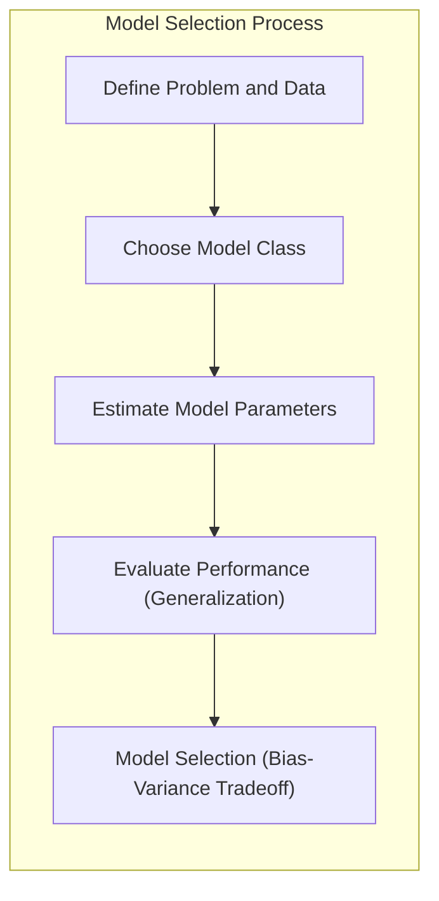
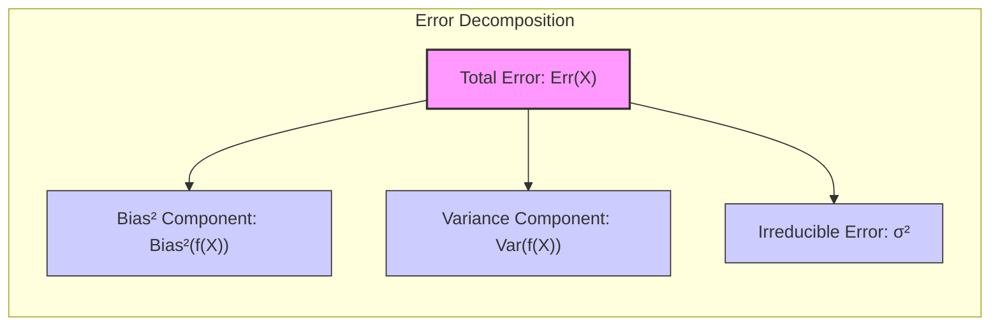
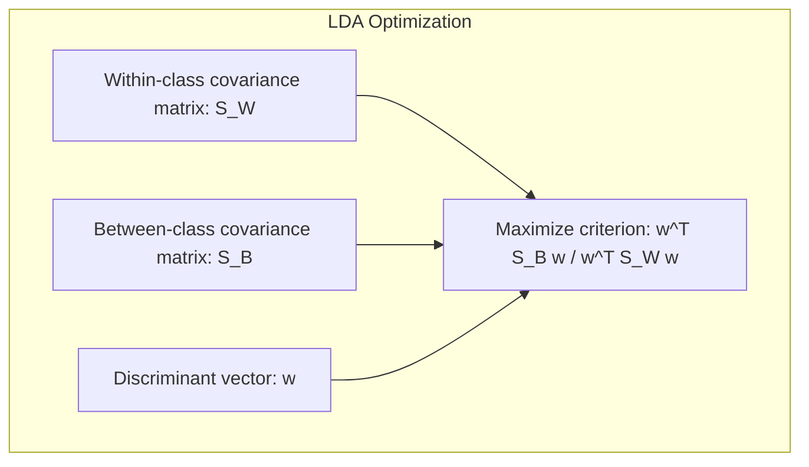
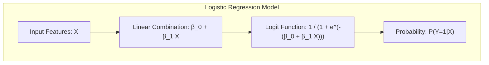
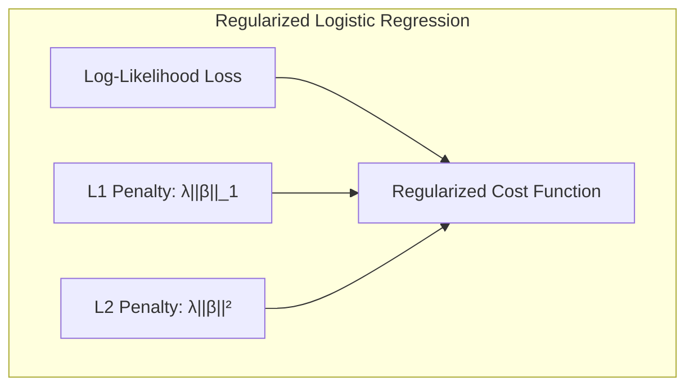
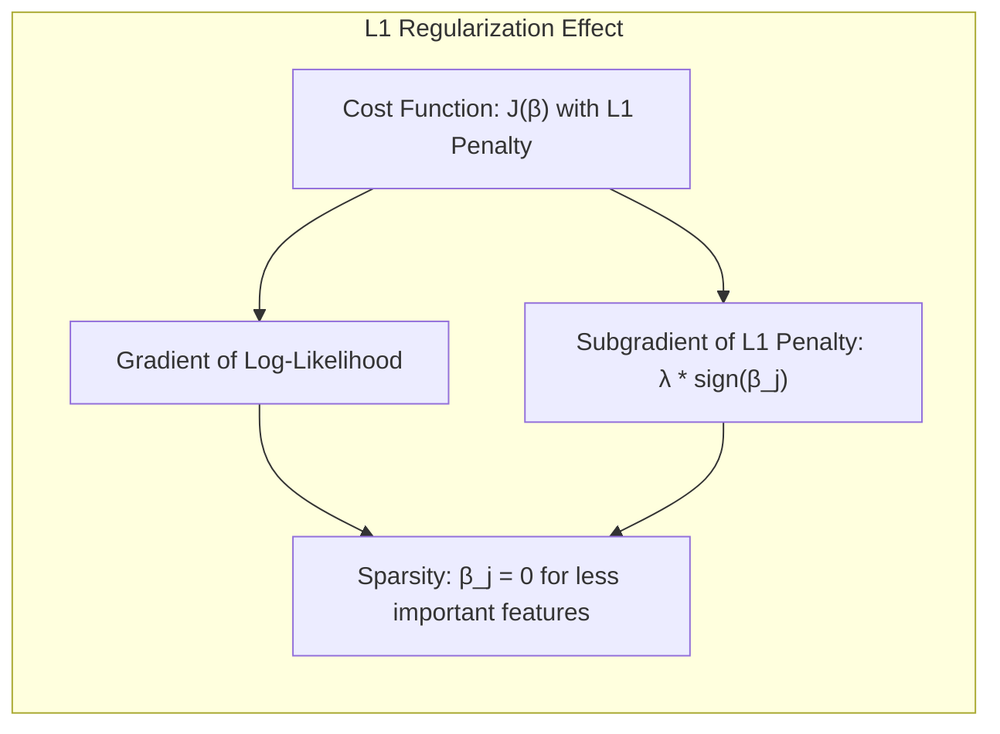
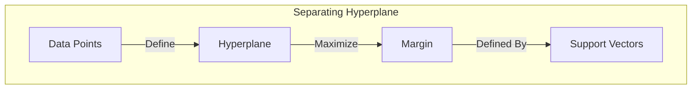

## Model Selection and the Bias-Variance Tradeoff

<imagem: Diagrama complexo mostrando a relação entre Bias, Variance e Complexidade do Modelo, com curvas representando diferentes métodos de seleção de modelo>

### Introdução

A seleção de modelos é um passo crucial na construção de modelos de aprendizado estatístico. O desempenho de um modelo em dados de teste independentes, conhecido como **generalização**, é o que realmente importa em aplicações práticas [^7.1]. A escolha do método de aprendizado ou modelo, e a avaliação de sua qualidade são etapas que devem ser conduzidas de forma cuidadosa [^7.1]. Este capítulo explora métodos para avaliação de desempenho e seleção de modelos, começando com a discussão sobre a interação entre **viés**, **variância** e **complexidade do modelo** [^7.1].



### Conceitos Fundamentais

**Conceito 1:** O **problema de classificação**, em sua essência, busca encontrar uma função $f(X)$ que prediz corretamente a variável resposta $Y$, a partir de um vetor de *inputs* $X$. No contexto de modelos lineares, a complexidade e o número de parâmetros do modelo são fatores que influenciam diretamente no *trade-off* entre viés e variância [^7.2]. Modelos mais simples, com menos parâmetros, tendem a ter alto viés, ou seja, dificuldade em capturar a verdadeira relação entre $X$ e $Y$, mas baixa variância, pois são menos sensíveis a variações nos dados de treinamento. Por outro lado, modelos mais complexos com muitos parâmetros, têm menor viés e maior variância, sendo mais flexíveis para se ajustarem a padrões específicos nos dados de treinamento, mas mais suscetíveis a ruídos e menos robustos em dados não observados [^7.2].

> 💡 **Exemplo Numérico:** Imagine que queremos modelar a relação entre a altura de uma pessoa ($X$) e seu peso ($Y$).
> *   **Modelo Simples (Alto Viés, Baixa Variância):** Um modelo linear simples como $Y = \beta_0 + \beta_1 X$, onde $Y$ é o peso e $X$ a altura, pode não capturar nuances como diferenças de composição corporal (massa muscular vs. gordura). Este modelo tem alto viés (subestima ou superestima sistematicamente o peso para muitas pessoas), mas baixa variância (as predições não mudam muito com dados diferentes).
> *   **Modelo Complexo (Baixo Viés, Alta Variância):** Um modelo polinomial de alta ordem, como $Y = \beta_0 + \beta_1 X + \beta_2 X^2 + \beta_3 X^3$, pode se ajustar muito bem aos dados de treinamento. No entanto, ele pode se ajustar muito bem a um conjunto específico de dados e falhar em generalizar para novos dados (alta variância). Pequenas mudanças nos dados de treinamento podem levar a grandes mudanças na curva preditiva.
>
> O *trade-off* aqui é que um modelo simples pode não se adequar bem aos dados (alto viés), enquanto um modelo complexo pode se ajustar excessivamente aos dados de treinamento e ser ruim para novos dados (alta variância). O objetivo é encontrar o modelo com a complexidade ideal que equilibre esses dois aspectos.

**Lemma 1:** Em um modelo linear, o viés pode ser definido como a diferença entre o valor médio predito pelo modelo e o verdadeiro valor da variável resposta, enquanto a variância é a variação da predição em relação à sua média. Formalmente, seja $E[f(X)]$ a predição média do modelo para um determinado $X$ e $f(X)$ o verdadeiro valor da variável resposta, o viés pode ser expresso como $Bias(f(X)) =  E[f(X)] - f(X)$. A variância, por sua vez, é $Var(f(X)) = E[(f(X) - E[f(X)])^2]$. A *decomposição do erro em viés e variância* revela que o erro total da predição é a soma do quadrado do viés, a variância e um erro irredutível [^7.3].

$$
Err(X) = \sigma^2 + Bias^2(f(X)) + Var(f(X))
$$

onde $\sigma^2$ é a variância do erro irredutível [^7.3]. $\blacksquare$



> 💡 **Exemplo Numérico:** Vamos supor que o verdadeiro modelo para uma variável $Y$ é $f(X) = 2X + 1$, e temos um conjunto de dados onde $X$ e $Y$ são gerados com algum ruído aleatório. Consideremos dois modelos:
>
> 1.  **Modelo 1 (Simples):** $f_1(X) = 1.5X + 0.5$
> 2.  **Modelo 2 (Complexo):** $f_2(X) = 2X + 1 + \epsilon$, onde $\epsilon$ representa um erro aleatório.
>
>   Suponha que, para um ponto específico $X=2$, o verdadeiro valor de $Y$ seja $f(2) = 2*2 + 1 = 5$.
>
>   *   **Cálculo do Viés (Bias):**
>       *   Para o Modelo 1: $Bias(f_1(2)) = E[f_1(2)] - f(2) = (1.5*2 + 0.5) - 5 = 3.5 - 5 = -1.5$. O viés é -1.5, indicando que o modelo sistematicamente subestima o valor real.
>       *   Para o Modelo 2: $Bias(f_2(2)) = E[f_2(2)] - f(2) = (2*2 + 1 + E[\epsilon]) - 5 = (5 + 0) - 5 = 0$, pois assumimos que o erro tem média zero. O viés é 0, indicando que o modelo não tem erro sistemático.
>
>   *   **Cálculo da Variância (Variance):**
>       *   Para o Modelo 1: $Var(f_1(2)) = E[(f_1(2) - E[f_1(2)])^2] = E[(3.5 - 3.5)^2] = 0$. A variância é 0, indicando que a predição é sempre a mesma para diferentes amostras de treinamento.
>       *   Para o Modelo 2: $Var(f_2(2)) = E[(f_2(2) - E[f_2(2)])^2] = E[(5 + \epsilon - 5)^2] = E[\epsilon^2] = \sigma^2_{\epsilon}$. A variância é igual à variância do erro, indicando que a predição varia com a variação do erro.
>
>   *   **Erro Total:**
>       *   $Err(2) = \sigma^2 + Bias^2(f_1(2)) + Var(f_1(2)) = \sigma^2 + (-1.5)^2 + 0 = \sigma^2 + 2.25$
>       *   $Err(2) = \sigma^2 + Bias^2(f_2(2)) + Var(f_2(2)) = \sigma^2 + 0^2 + \sigma^2_{\epsilon} = \sigma^2 + \sigma^2_{\epsilon}$.
>
>   O Modelo 1 tem um viés maior mas variância zero, enquanto o Modelo 2 tem viés zero e variância igual à variância do ruído. O erro total considera ambos os aspectos junto com o erro irredutível ($\sigma^2$).

**Conceito 2:** A **Linear Discriminant Analysis (LDA)** é um método de classificação que assume que as classes são geradas por distribuições Gaussianas com a mesma matriz de covariância [^7.3]. A fronteira de decisão entre duas classes é linear e obtida através da projeção dos dados em um subespaço que maximiza a separação entre as médias das classes e minimiza a variância dentro de cada classe [^7.3.1]. As suposições de normalidade e covariâncias iguais são cruciais para a formulação do LDA, o que pode levar a erros em cenários onde essas suposições não são válidas [^7.3.2], [^7.3.3]. O LDA busca maximizar a razão entre a variância entre as classes e a variância dentro das classes, definindo um discriminante linear que separa as classes de forma ótima sob as premissas estabelecidas.

**Corolário 1:** O discriminante linear obtido pelo LDA resulta em projeções dos dados que maximizam a razão entre a variância entre classes e a variância dentro das classes. Formalmente, seja $S_W$ a matriz de covariância dentro da classe e $S_B$ a matriz de covariância entre as classes, o discriminante linear $w$ é obtido maximizando a função $w^T S_B w / w^T S_W w$. Esse corolário demonstra que o LDA encontra uma projeção que otimiza a separação linear entre as classes, sob as condições de gaussianidade e covariância igual [^7.3.1].



> 💡 **Exemplo Numérico:** Considere um problema de classificação binária com duas classes (A e B) e duas características ($X_1$ e $X_2$). Suponha que as médias e as matrizes de covariância das classes são:
>
> *   Classe A: $\mu_A = [1, 1]^T$, $\Sigma_A = \begin{bmatrix} 1 & 0.5 \\ 0.5 & 1 \end{bmatrix}$
> *   Classe B: $\mu_B = [3, 3]^T$, $\Sigma_B = \begin{bmatrix} 1 & 0.5 \\ 0.5 & 1 \end{bmatrix}$
>
> A matriz de covariância pooled (combinada) é $S_W = \Sigma_A = \Sigma_B$ (já que são iguais). A matriz de covariância entre as classes é $S_B = (\mu_A - \mu_B)(\mu_A - \mu_B)^T = \begin{bmatrix} 2 & 2 \\ 2 & 2 \end{bmatrix}$.
>
> O objetivo do LDA é encontrar o discriminante linear $w$ que maximiza a razão $w^T S_B w / w^T S_W w$. A solução para esse problema é dada pelo autovetor da matriz $S_W^{-1}S_B$ correspondente ao maior autovalor.
>
> 1.  **Calculando $S_W^{-1}$:** A inversa de $S_W$ (ou $\Sigma_A$) é $S_W^{-1} = \begin{bmatrix} 1.333 & -0.667 \\ -0.667 & 1.333 \end{bmatrix}$
>
> 2.  **Calculando $S_W^{-1}S_B$:**
>    $S_W^{-1}S_B = \begin{bmatrix} 1.333 & -0.667 \\ -0.667 & 1.333 \end{bmatrix} \begin{bmatrix} 2 & 2 \\ 2 & 2 \end{bmatrix} = \begin{bmatrix} 1.333 & 1.333 \\ 1.333 & 1.333 \end{bmatrix}$
>
> 3.  **Autovetor:** O autovetor correspondente ao maior autovalor da matriz resultante é $w = [1, 1]^T$ (normalizado). Esse vetor é o discriminante linear que maximiza a separação entre as classes.
>
> A fronteira de decisão é dada pela reta perpendicular a $w$ e que passa pelo ponto médio das médias das classes, $\frac{\mu_A + \mu_B}{2} = [2, 2]^T$. Em termos práticos, dados novos pontos, eles serão classificados de acordo com a sua posição em relação a essa fronteira.

**Conceito 3:** A **Logistic Regression** é um modelo probabilístico para classificação que estima a probabilidade de um evento ocorrer através da função *logit* [^7.4]. Ao contrário do LDA, a regressão logística não faz suposições sobre a distribuição dos dados de entrada, e a fronteira de decisão resultante é dada pelo limite onde a probabilidade estimada é igual a 0.5 [^7.4.1]. A otimização dos parâmetros na regressão logística é realizada através da maximização da verossimilhança, e o modelo resultante pode ser interpretado como a probabilidade log-odds sendo modelada linearmente em relação aos *inputs* [^7.4.2], [^7.4.3]. Embora a regressão logística também resulte em fronteiras de decisão lineares, sua formulação e os parâmetros resultantes são diferentes daqueles obtidos via LDA [^7.4.4], [^7.4.5].



> 💡 **Exemplo Numérico:** Vamos considerar um problema de classificação binária com uma única variável preditora $X$. A regressão logística modela a probabilidade de um evento ($Y=1$) como:
>
>   $$ P(Y=1|X) = \frac{1}{1 + e^{-(\beta_0 + \beta_1 X)}} $$
>
>   Suponha que, após o treinamento do modelo, obtivemos os seguintes parâmetros: $\beta_0 = -3$ e $\beta_1 = 1.5$.
>
>   *   **Cálculo da Probabilidade:** Se temos um novo dado com $X=2$, a probabilidade de $Y=1$ é:
>       $$ P(Y=1|X=2) = \frac{1}{1 + e^{-(-3 + 1.5 * 2)}} = \frac{1}{1 + e^{0}} = \frac{1}{2} = 0.5 $$
>
>   *   **Fronteira de Decisão:** A fronteira de decisão ocorre quando a probabilidade é 0.5. Isso acontece quando o argumento da exponencial é zero:
>       $$ \beta_0 + \beta_1 X = 0 \Rightarrow -3 + 1.5 X = 0 \Rightarrow X = 2 $$
>
>       Portanto, a fronteira de decisão para este modelo é $X = 2$. Se $X > 2$, a probabilidade de $Y=1$ é maior que 0.5, e se $X < 2$, a probabilidade é menor que 0.5.
>   *   **Interpretação:** O parâmetro $\beta_1=1.5$ indica que para cada unidade de aumento em $X$, as *log-odds* (logaritmo da razão de chances) de $Y=1$ aumentam em 1.5. O parâmetro $\beta_0 = -3$ é o valor das *log-odds* quando $X=0$.

> ⚠️ **Nota Importante**: A escolha entre LDA e Regressão Logística depende das suposições sobre os dados e do objetivo da análise. Em alguns casos, o LDA pode ser mais eficiente, enquanto em outros a Regressão Logística pode ser mais robusta [^7.4.1].
> ❗ **Ponto de Atenção**: Em situações com classes não balanceadas, a Regressão Logística pode requerer ajustes para lidar com o desbalanceamento e evitar que a classe majoritária domine a decisão do modelo [^7.4.2].
> ✔️ **Destaque**: As estimativas de parâmetros em LDA e em regressão logística estão relacionadas, e em algumas situações específicas, podem produzir resultados similares, especialmente quando as suposições do LDA são válidas [^7.5].

### Regressão Linear e Mínimos Quadrados para Classificação


**Explicação:** Este diagrama representa o fluxo do processo de regressão de indicadores e como ele se relaciona à classificação, **conforme descrito nos tópicos [1](4.2)**.

A **regressão linear aplicada a uma matriz de indicadores** pode ser utilizada para classificação, onde cada classe é representada por uma coluna na matriz de *inputs*, com valores 0 ou 1. Ao usar mínimos quadrados para estimar os coeficientes, o modelo busca minimizar o erro entre a previsão e o valor real dos indicadores de classe [^4.2]. No entanto, a regressão linear não é um método apropriado para estimar probabilidades, uma vez que as previsões podem extrapolar os limites [0, 1]. A regressão linear, no contexto de classificação, busca obter uma fronteira linear de separação entre as classes, mas não fornece diretamente uma interpretação probabilística das predições [^4.1]. Embora a regressão linear seja simples de implementar, a aplicação direta para classificação pode levar a problemas como o *masking problem*, onde a presença de outras classes pode influenciar o resultado para uma classe específica [^4.3].

> 💡 **Exemplo Numérico:** Considere um problema de classificação com 3 classes (A, B, e C) e duas características $X_1$ e $X_2$. Vamos usar um conjunto de dados simulado:
>
> ```python
> import numpy as np
> from sklearn.linear_model import LinearRegression
>
> # Dados simulados
> X = np.array([[1, 2], [2, 3], [3, 4], [1, 4], [2, 5], [3, 6], [4, 1], [5, 2], [6, 3], [4, 3], [5, 4], [6, 5]])
> y = np.array([0, 0, 0, 1, 1, 1, 2, 2, 2, 0, 1, 2]) # Classes A=0, B=1, C=2
>
> # Matriz de indicadores
> y_encoded = np.eye(3)[y]
>
> # Regressão Linear
> model = LinearRegression()
> model.fit(X, y_encoded)
>
> # Previsões para novos pontos
> new_points = np.array([[2.5, 3.5], [4.5, 2.5]])
> predictions = model.predict(new_points)
>
> print("Coeficientes:", model.coef_)
> print("Intercepto:", model.intercept_)
> print("Previsões:", predictions)
>
> # Atribuição de classes
> predicted_classes = np.argmax(predictions, axis=1)
> print("Classes Preditas:", predicted_classes)
>
> ```
>
> **Saída (exemplo):**
> ```
> Coeficientes: [[ 0.066  0.066]
>  [-0.066 -0.066]
>  [ 0.    0.   ]]
> Intercepto: [ 0.533  0.333  0.133]
> Previsões: [[0.333 0.333 0.333]
>  [ 0.466 0.266 0.266]]
> Classes Preditas: [0 0]
> ```
> *   **Interpretação:**
>     *   A matriz `y_encoded` transforma as classes em vetores one-hot encoding.
>     *   A regressão linear ajusta os coeficientes para cada classe.
>     *   As `previsões` para os novos pontos fornecem uma pontuação para cada classe, onde o `argmax` determina a classe predita.
>     *   Note que os valores previstos não são probabilidades, eles podem ser menores que 0 ou maiores que 1.

**Lemma 2:** Em um problema de classificação binária, a regressão linear em uma matriz de indicadores, sob certas condições de ortogonalidade e separabilidade, pode ser equivalente a projetar os dados sobre um hiperplano de decisão linear, similar ao que é feito pelo LDA, com a restrição de que a matriz de covariância entre classes seja igual [^4.2]. Este *lemma* demonstra que a regressão linear pode, em cenários específicos, alcançar resultados comparáveis aos de discriminantes lineares.

**Corolário 2:** A aplicação de regressão linear a uma matriz de indicadores, sob as premissas do *lemma* anterior, leva à formação de hiperplanos de decisão que, sob as premissas estabelecidas, maximizam a separação das classes [^4.3]. Este corolário ressalta a equivalência em cenários específicos entre regressão linear e discriminantes lineares em termos de geração de fronteiras de decisão.

> "Em alguns cenários, conforme apontado em [^4.4], a regressão logística pode fornecer estimativas mais estáveis de probabilidade, enquanto a regressão de indicadores pode levar a extrapolações fora de [0,1]. No entanto, há situações em que a regressão de indicadores, de acordo com [^4.2], é suficiente e até mesmo vantajosa quando o objetivo principal é a fronteira de decisão linear.”

### Métodos de Seleção de Variáveis e Regularização em Classificação

A **seleção de variáveis** e a **regularização** são técnicas importantes para controlar a complexidade e melhorar a generalização de modelos de classificação. Ao reduzir o número de variáveis usadas ou ao regularizar os parâmetros do modelo, podemos evitar o *overfitting* e obter modelos mais robustos e interpretáveis [^4.4.4]. A regularização L1 e L2 são amplamente utilizadas em modelos logísticos para controlar a magnitude dos parâmetros, sendo que a penalidade L1 promove a esparsidade dos coeficientes, enquanto a penalidade L2 induz a estimativas menores e mais estáveis [^4.5]. A regularização se encaixa na formulação da função de custo através da adição de termos de penalização, que são ponderados por um fator de regularização. Essa função de custo combina a verossimilhança com esses termos de penalização, e é minimizada durante o treinamento do modelo [^4.4.4].



> 💡 **Exemplo Numérico:** Vamos aplicar a regularização L1 (Lasso) e L2 (Ridge) em um modelo de regressão logística usando um conjunto de dados sintético:
>
> ```python
> import numpy as np
> from sklearn.linear_model import LogisticRegression
> from sklearn.preprocessing import StandardScaler
> from sklearn.model_selection import train_test_split
> from sklearn.metrics import accuracy_score
>
> # Gerar dados sintéticos
> np.random.seed(42)
> X = np.random.rand(100, 10) # 100 amostras com 10 features
> true_coeffs = np.array([1, -2, 0.5, 0, 0, 0, 0, 0.8, -0.3, 0]) # Coeficientes verdadeiros (esparso)
> probabilities = 1 / (1 + np.exp(-(X @ true_coeffs + np.random.normal(0, 0.5, 100))))
> y = (probabilities > 0.5).astype(int)
>
> # Dividir dados em treino e teste
> X_train, X_test, y_train, y_test = train_test_split(X, y, test_size=0.3, random_state=42)
>
> # Normalizar os dados
> scaler = StandardScaler()
> X_train_scaled = scaler.fit_transform(X_train)
> X_test_scaled = scaler.transform(X_test)
>
> # Modelos
> model_l1 = LogisticRegression(penalty='l1', solver='liblinear', C=1.0) # Lasso
> model_l2 = LogisticRegression(penalty='l2', C=1.0) # Ridge
>
> # Treinamento e avaliação
> model_l1.fit(X_train_scaled, y_train)
> model_l2.fit(X_train_scaled, y_train)
>
> y_pred_l1 = model_l1.predict(X_test_scaled)
> y_pred_l2 = model_l2.predict(X_test_scaled)
>
> accuracy_l1 = accuracy_score(y_test, y_pred_l1)
> accuracy_l2 = accuracy_score(y_test, y_pred_l2)
>
> print("Acurácia Lasso:", accuracy_l1)
> print("Acurácia Ridge:", accuracy_l2)
>
> print("Coeficientes Lasso:", model_l1.coef_)
> print("Coeficientes Ridge:", model_l2.coef_)
> ```
>
> **Saída (exemplo):**
>
> ```
> Acurácia Lasso: 0.8666666666666667
> Acurácia Ridge: 0.8333333333333334
> Coeficientes Lasso: [[ 0.799 -1.534  0.465  0.    -0.    -0.   -0.   0.874 -0.231  0.   ]]
> Coeficientes Ridge: [[ 0.718 -1.499  0.412 -0.056 -0.157 -0.089 0.129  0.710 -0.165 -0.116]]
> ```
> *   **Interpretação:**
>     *   O código gera dados simulados com alguns coeficientes verdadeiros iguais a zero, simulando um cenário esparso.
>     *   A regularização L1 (Lasso) tende a zerar os coeficientes menos importantes, enquanto a L2 (Ridge) reduz seus valores, mas geralmente não os zera.
>     *   Nesse exemplo, a acurácia dos dois modelos é comparável, mas o Lasso mostra a propriedade de seleção de variáveis, atribuindo valores nulos a alguns coeficientes.

**Lemma 3:** Ao adicionar uma penalidade L1 à função de custo da regressão logística, obtemos coeficientes esparsos, ou seja, muitos deles iguais a zero. Isso pode ser demonstrado através da análise das condições de otimalidade para a minimização da função de custo regularizada [^4.4.4].

**Prova do Lemma 3:** Seja a função de custo regularizada dada por
$$
J(\beta) = -\frac{1}{N} \sum_{i=1}^{N} [y_i \log(p(x_i)) + (1-y_i)\log(1-p(x_i))] + \lambda \sum_{j=1}^{p} |\beta_j|
$$
onde $p(x_i)$ é a probabilidade predita para a observação $i$, $\beta$ é o vetor de coeficientes, e $\lambda$ é o parâmetro de regularização. As condições de otimalidade são encontradas onde o gradiente de $J(\beta)$ é igual a zero. O termo de penalidade L1, $|\beta_j|$, introduz um ponto de não diferenciabilidade em $\beta_j = 0$. No ponto de otimalidade, se $\beta_j = 0$, o subgradiente do termo L1 deve cancelar o gradiente da função de verossimilhança, resultando em muitos coeficientes $\beta_j$ iguais a zero, levando a esparsidade [^4.4.3], [^4.4.4]. $\blacksquare$



> 💡 **Exemplo Numérico:** Considere a função de custo com penalidade L1. Vamos analisar o efeito de um pequeno $\lambda$ (pouca regularização) e um grande $\lambda$ (muita regularização) em um modelo logístico com um único coeficiente $\beta$:
>
> $$ J(\beta) = -\frac{1}{N}\sum_{i=1}^{N} [y_i \log(p(x_i)) + (1-y_i)\log(1-p(x_i))] + \lambda |\beta| $$
>
> Suponha que a parte da verossimilhança seja tal que, sem regularização, o valor ótimo para $\beta$ seja $\beta^* = 2$. Agora considere:
>
> *   **$\lambda = 0.1$ (pouca regularização):** A penalidade adiciona $0.1 |\beta|$ à função de custo. O valor ótimo de $\beta$ será próximo de 2, pois a penalidade não é muito forte.
> *   **$\lambda = 1$ (muita regularização):** A penalidade adiciona $1 |\beta|$ à função de custo. O valor ótimo de $\beta$ pode ser reduzido significativamente, possivelmente chegando perto de zero. A força da penalização é muito maior e "puxa" o coeficiente em direção a zero.
>
> A penalidade L1 força o coeficiente para 0, enquanto a penalidade L2 apenas reduz a magnitude do mesmo.

**Corolário 3:** A esparsidade dos coeficientes obtida através da regularização L1 em modelos classificatórios torna o modelo resultante mais fácil de interpretar, uma vez que apenas as variáveis mais relevantes para a classificação são selecionadas, ao passo que as variáveis menos relevantes tem seus coeficientes zerados. Isso facilita a compreensão sobre quais características tem maior influência na decisão do modelo [^4.4.5].

> ⚠️ **Ponto Crucial**: A combinação de L1 e L2 através da técnica Elastic Net pode ser uma forma eficiente de combinar a seleção de variáveis e a estabilidade, através de penalizações distintas para cada componente [^4.5].

### Separating Hyperplanes e Perceptrons

A ideia de **hiperplanos separadores** parte do princípio de encontrar um hiperplano que maximize a margem entre as classes, ou seja, a distância entre o hiperplano e os pontos de cada classe mais próximos. O problema de encontrar esse hiperplano ótimo é um problema de otimização que pode ser resolvido através do uso da dualidade de Wolfe, onde a solução pode ser expressa como uma combinação linear de pontos de suporte. Os pontos de suporte são aqueles pontos dos dados que são mais próximos do hiperplano de decisão e que definem a margem. O Perceptron de Rosenblatt é um algoritmo iterativo para encontrar um hiperplano separador, cuja convergência é garantida sob condições de separabilidade linear dos dados [^4.5.1], [^4.5.2].



> 💡 **Exemplo Numérico:** Vamos ilustrar o funcionamento de um Perceptron simples com um exemplo bidimensional:
>
> Suponha que temos dois grupos de pontos:
>
> * Classe A (negativa): (1,1), (2,1), (1,2)
> * Classe B (positiva): (3,3), (4,3), (3,4)
>
> O objetivo do Perceptron é encontrar uma linha (hiperplano) que separe essas classes.
>
> 1.  **Inicialização:** Atribuímos um vetor de pesos aleatório, digamos $w = [0.1, 0.1]$ e um bias $b = 0$.
> 2.  **Iteração:** Para cada ponto de dado $(x_i, y_i)$:
>   *   Calculamos a saída do perceptron: $\hat{y_i} = w \cdot x_i + b$
>   *   Se $\hat{y_i} \geq 0$ e $y_i$ é classe negativa ou $\hat{y_i} < 0$ e $y_i$ é classe positiva, atualizamos os pesos e o bias:
>   $w_{new} = w + \alpha \cdot y_i \cdot x_i$
>   $b_{new} = b + \alpha \cdot y_i$
>
>   Onde $\alpha$ é a taxa de aprendizado (ex: 0.1) e  $y_i$ é -1 para classe A e 1 para classe B.
>
> 3.  **Repetição:** Repetimos o passo 2 até que todos os pontos sejam classificados corretamente ou até um número máximo de iterações.
>
> Após algumas iterações, o Perceptron irá encontrar um hiperpl