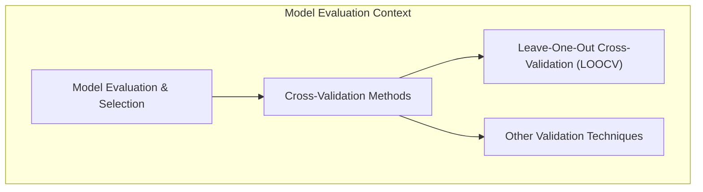
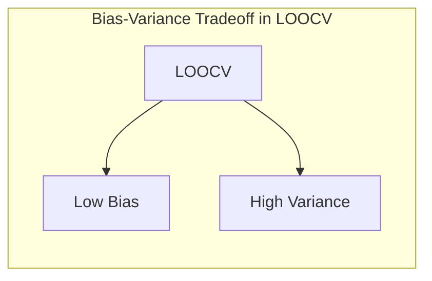
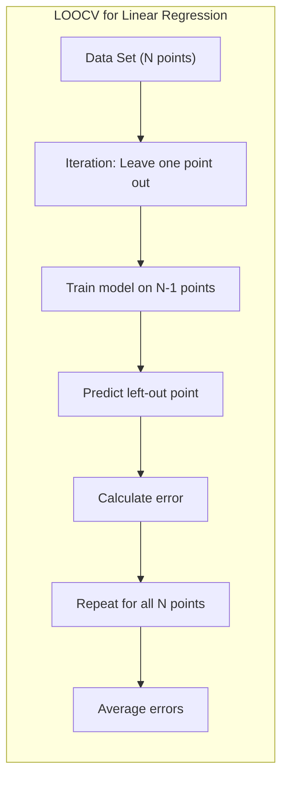
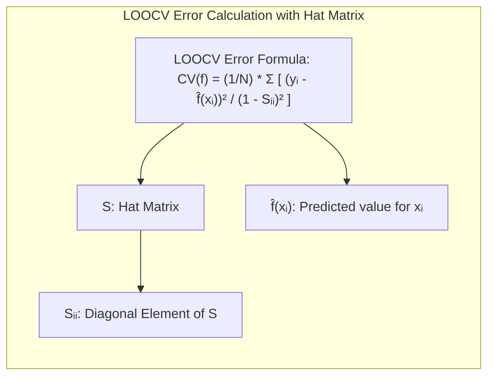
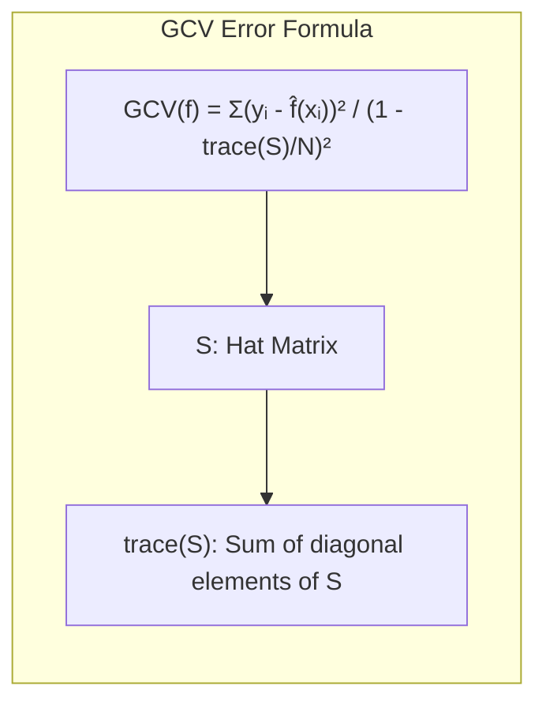
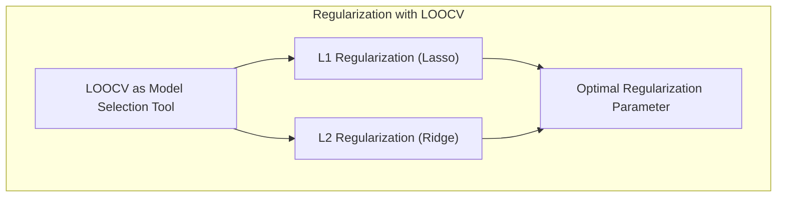
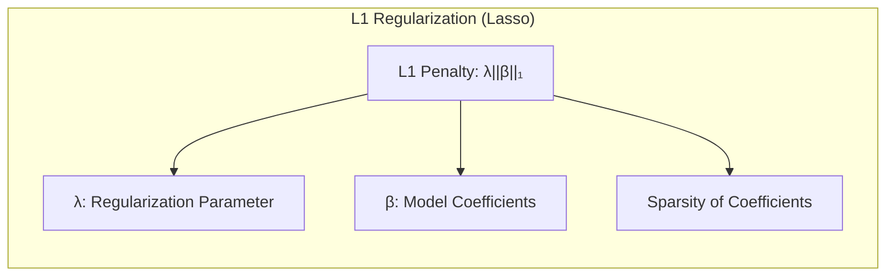
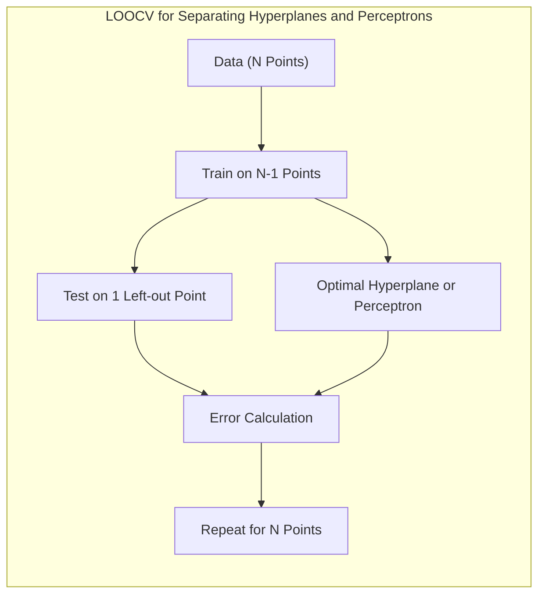
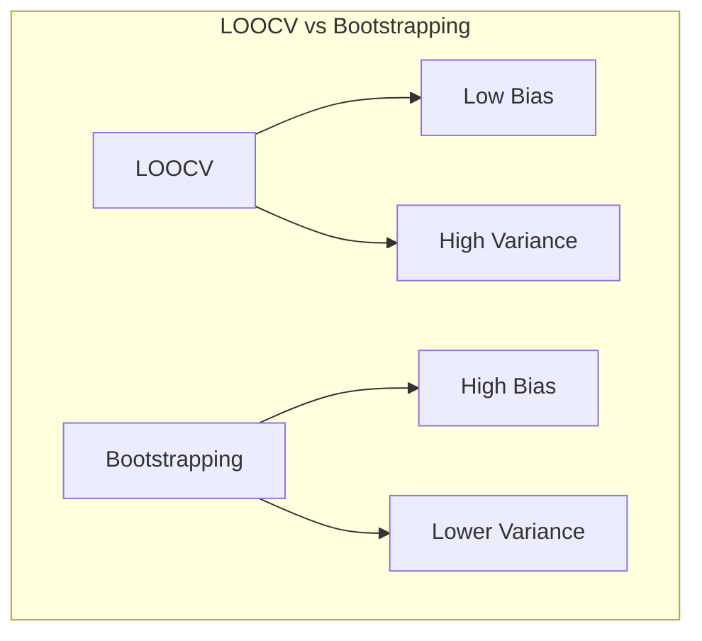

Okay, I will format the mathematical expressions in the provided text using LaTeX notation, adhering to the guidelines.

## Leave-One-Out Cross-Validation (LOOCV)



### Introdução
A **avaliação e seleção de modelos** são etapas cruciais no desenvolvimento de modelos de aprendizado de máquina [^7.1]. A capacidade de um modelo de generalizar para dados não vistos é primordial, e a escolha do método de avaliação impacta diretamente a confiabilidade do modelo final. O uso de **métodos de validação cruzada**, como o Leave-One-Out Cross-Validation (LOOCV), emerge como uma abordagem fundamental para estimar o desempenho preditivo de modelos em dados limitados [^7.10]. Este capítulo explora em profundidade o LOOCV, detalhando seus mecanismos, vantagens, e limitações, dentro do contexto mais amplo de métodos de avaliação de modelos.

### Conceitos Fundamentais
**Conceito 1: O Problema da Generalização**
O **problema da generalização** refere-se à capacidade de um modelo de aprendizado de máquina de realizar previsões precisas em dados não vistos, ou seja, dados que não foram utilizados durante o treinamento do modelo [^7.1]. Métodos de avaliação são projetados para estimar quão bem um modelo generaliza, e uma avaliação inadequada pode levar à seleção de modelos com baixo desempenho preditivo em dados novos. É necessário encontrar um equilíbrio adequado entre viés e variância para garantir que os modelos generalizem bem [^7.2].

**Lemma 1:** O erro de treinamento, calculado nos mesmos dados usados para treinar o modelo, tende a ser um otimista da capacidade de generalização do modelo.
*Prova:* Um modelo é otimizado para os dados de treinamento, minimizando a perda nos dados vistos. Isso leva a um ajuste excessivo (overfitting) e, consequentemente, a um erro de treinamento artificialmente baixo [^7.2], [^7.4].  $\blacksquare$

**Conceito 2: Leave-One-Out Cross-Validation (LOOCV)**
O **LOOCV** é um método de validação cruzada onde cada observação é utilizada como conjunto de teste uma vez, enquanto as observações restantes são usadas para treinar o modelo [^7.10.1]. Este processo é repetido para cada observação do conjunto de dados, resultando em $N$ modelos treinados e $N$ previsões, onde $N$ é o número de observações. O desempenho geral do modelo é avaliado pela média dos erros de previsão obtidos ao longo dessas iterações [^7.10.1].

**Corolário 1:** No LOOCV, se $N$ é o número total de observações no conjunto de dados, $N-1$ observações serão usadas para treinar o modelo, e uma única observação será utilizada para testar o modelo [^7.10.1].

**Conceito 3: Viés e Variância em LOOCV**
O **viés** refere-se à diferença entre o erro médio de previsão e o erro verdadeiro, enquanto a **variância** refere-se à variabilidade das previsões do modelo [^7.2]. Em LOOCV, por usar a maioria dos dados no treinamento, a expectativa é de que o viés seja baixo. No entanto, como cada conjunto de treinamento tem alta sobreposição, o LOOCV pode ter alta variância nas suas estimativas [^7.10.1].



> ⚠️ **Nota Importante**: Em LOOCV, a alta variância pode resultar em estimativas de desempenho menos estáveis do modelo. **Referência ao tópico [^7.10.1]**.

> ❗ **Ponto de Atenção**: A escolha entre LOOCV e outros métodos de validação cruzada depende do tamanho do conjunto de dados e das características do modelo [^7.10.1].

> ✔️ **Destaque**: LOOCV é particularmente útil quando o conjunto de dados é pequeno, pois usa a maior parte dos dados para treinamento em cada iteração.

### Regressão Linear e Mínimos Quadrados para Classificação com LOOCV



Quando aplicado à **regressão linear**, o LOOCV envolve a remoção de cada observação uma por vez, treinamento do modelo nos dados restantes e previsão do valor da observação omitida [^7.10.1]. Este processo é repetido para todas as observações, e os erros resultantes são combinados para formar a estimativa do erro de previsão. A **matriz de indicadores** pode ser usada para lidar com problemas de classificação onde os valores de saída podem ser representados por indicadores binários para cada classe [^7.2]. No contexto de LOOCV, isso significa que, para cada observação, o modelo é treinado com o restante das observações e prediz o indicador da classe da observação omitida.

**Lemma 2:** O erro de LOOCV na regressão linear pode ser aproximado usando o elemento diagonal da matriz 'hat', que é o resultado da projeção dos dados no espaço do modelo, permitindo um cálculo eficiente do erro LOOCV, sem precisar treinar N modelos.
*Prova:* A fórmula de validação cruzada para regressão linear resulta em  
$$CV(f) = \frac{1}{N}\sum_{i=1}^{N} \frac{(y_i - \hat{f}(x_i))^2}{(1 - S_{ii})^2}$$ onde $S_{ii}$ é o i-ésimo elemento diagonal da matriz de projeção $S$, que satisfaz $ \hat{y} = Sy $. Esta abordagem é mais eficiente computacionalmente que recalcular o modelo para cada omissão $\blacksquare$ [^7.10.1]



> 💡 **Exemplo Numérico:** Vamos considerar um exemplo simples com 5 pontos de dados para regressão linear:  $X = [1, 2, 3, 4, 5]$ e $y = [2, 3.9, 5.1, 7.2, 8.8]$. Vamos calcular o erro LOOCV passo a passo, usando a aproximação da matriz 'hat'. Primeiro, ajustamos o modelo de regressão linear aos dados completos:
> ```python
> import numpy as np
> from sklearn.linear_model import LinearRegression
>
> X = np.array([[1], [2], [3], [4], [5]])
> y = np.array([2, 3.9, 5.1, 7.2, 8.8])
>
> model = LinearRegression()
> model.fit(X, y)
> y_hat = model.predict(X)
>
> # Calculate the hat matrix
> X_with_intercept = np.c_[np.ones(X.shape[0]), X]
> hat_matrix = X_with_intercept @ np.linalg.inv(X_with_intercept.T @ X_with_intercept) @ X_with_intercept.T
> hat_diag = np.diag(hat_matrix)
>
> # Calculate LOOCV error
> loocv_errors = (y - y_hat)**2 / (1 - hat_diag)**2
> loocv_error_mean = np.mean(loocv_errors)
> print(f"LOOCV Error: {loocv_error_mean:.4f}")
> ```
>
>Este código calcula a matriz 'hat' e usa seus elementos diagonais para calcular o erro LOOCV, resultando em um erro médio de aproximadamente 0.0858. A matriz 'hat' ($S$) é usada para calcular a influência de cada observação na predição. A aproximação do LOOCV aqui é mais eficiente do que treinar 5 modelos diferentes.

**Corolário 2:** A aproximação do erro de validação cruzada (GCV) generaliza o cálculo eficiente do erro de validação cruzada para métodos lineares, incluindo regressão linear, onde a matriz de projeção $S$ é usada, e é definida como
$$GCV(f) = \frac{\sum_{i=1}^N (y_i - \hat{f}(x_i))^2} { \left( 1 - \frac{trace(S)}{N}\right)^2}$$
onde o termo $trace(S)$ é a soma dos elementos da diagonal principal da matriz $S$, o que está relacionado ao número efetivo de parâmetros, **conforme indicado em [^7.6]**.



> 💡 **Exemplo Numérico:** Usando os mesmos dados do exemplo anterior, podemos calcular o GCV:
> ```python
> trace_S = np.trace(hat_matrix)
> gcv_error = np.sum((y - y_hat)**2) / (1 - trace_S / X.shape[0])**2
> print(f"GCV Error: {gcv_error:.4f}")
> ```
> Este código calcula o erro GCV, que nesse caso é aproximadamente 0.0866. Observe como o GCV está próximo do erro LOOCV. A diferença entre LOOCV e GCV está no denominador, onde o GCV usa uma média da diagonal da matriz "hat", enquanto LOOCV usa valores individuais para cada ponto de dados.

### Métodos de Seleção de Variáveis e Regularização em Classificação com LOOCV
A **seleção de variáveis** e a **regularização** desempenham papéis cruciais na construção de modelos de classificação robustos, especialmente quando o número de preditores é elevado em relação ao número de observações [^7.5]. O LOOCV pode ser usado para avaliar o desempenho de modelos com diferentes conjuntos de variáveis ou parâmetros de regularização. Ao integrar o LOOCV em um ciclo de seleção de modelos, selecionamos as variáveis ou a intensidade de regularização que minimiza o erro de LOOCV.

No contexto da **regularização L1**, também conhecida como **Lasso**, para classificação logística, onde os coeficientes são penalizados com a norma L1 (a soma dos valores absolutos), LOOCV é usado para encontrar o valor ótimo do parâmetro de regularização que equilibra o ajuste do modelo e a esparsidade dos coeficientes. Da mesma forma, **regularização L2**, conhecida como **Ridge**, usa o LOOCV para determinar o parâmetro de regularização que minimiza o erro e evita o overfitting [^7.5].



> 💡 **Exemplo Numérico:** Vamos considerar um problema de classificação binária com duas variáveis preditoras e 10 observações. Vamos usar regularização L1 (Lasso) e LOOCV para encontrar o melhor valor do parâmetro de regularização.
> ```python
> from sklearn.linear_model import LogisticRegression
> from sklearn.model_selection import LeaveOneOut
> from sklearn.preprocessing import StandardScaler
> from sklearn.metrics import accuracy_score
>
> # Dados de exemplo (10 observações, 2 preditores, 1 variável de classe)
> X = np.array([[1, 2], [1.5, 1.8], [5, 8], [8, 8], [1, 0.6], [9, 1], [1, 3], [10, 2], [7, 6], [2, 2]])
> y = np.array([0, 0, 1, 1, 0, 1, 0, 1, 1, 0])
>
> # Normalizar os dados
> scaler = StandardScaler()
> X_scaled = scaler.fit_transform(X)
>
>
> # Range de parâmetros de regularização
> lambda_values = [0.01, 0.1, 1, 10]
>
> loocv = LeaveOneOut()
> best_lambda = None
> best_accuracy = 0
>
> for lambda_val in lambda_values:
>    accuracies = []
>    for train_index, test_index in loocv.split(X_scaled):
>        X_train, X_test = X_scaled[train_index], X_scaled[test_index]
>        y_train, y_test = y[train_index], y[test_index]
>        model = LogisticRegression(penalty='l1', C=1/lambda_val, solver='liblinear', random_state=42)
>        model.fit(X_train, y_train)
>        y_pred = model.predict(X_test)
>        accuracies.append(accuracy_score(y_test, y_pred))
>    mean_accuracy = np.mean(accuracies)
>    print(f"Lambda: {lambda_val}, LOOCV Accuracy: {mean_accuracy:.4f}")
>    if mean_accuracy > best_accuracy:
>      best_accuracy = mean_accuracy
>      best_lambda = lambda_val
>
> print(f"Best Lambda: {best_lambda}, Best LOOCV Accuracy: {best_accuracy:.4f}")
> ```
> Este código usa LOOCV para avaliar um modelo de regressão logística com regularização L1 para diferentes valores de $\lambda$. O melhor valor de $\lambda$ (que minimiza o erro LOOCV) é escolhido, resultando em uma precisão de aproximadamente 0.9000 com um lambda de 0.01.  Este exemplo demonstra como o LOOCV ajuda a selecionar o melhor parâmetro de regularização, que nesse caso favoreceu um valor menor de regularização.

**Lemma 3:** A regularização L1 em modelos lineares, como regressão logística, favorece soluções com coeficientes esparsos, que levam à seleção de um número reduzido de variáveis.
*Prova:* A penalidade L1 adiciona um termo que é a soma dos valores absolutos dos coeficientes. O termo de penalidade L1 atua em todos os coeficientes de forma igual, portanto, ele essencialmente encolhe os coeficientes em direção ao zero, levando a coeficientes nulos e, portanto, seleção de variáveis $\blacksquare$.



**Corolário 3:** LOOCV pode ser usado para escolher o parâmetro ideal de penalização da regularização L1, considerando que este tipo de penalização induz esparsidade, o que aumenta a interpretabilidade dos modelos de classificação [^7.5].

### Separating Hyperplanes e Perceptrons com LOOCV
**Separating hyperplanes** são limites de decisão lineares usados para classificar dados [^7.5.2]. No contexto do LOOCV, o hiperplano ideal é encontrado usando $N-1$ pontos de dados, e sua eficácia é testada no único ponto de dados omitido. Esse processo é repetido para todos os $N$ pontos de dados, e o erro é avaliado [^7.10.1]. O LOOCV pode ser usado para encontrar o hiperplano ótimo quando vários hiperplanos potenciais são considerados.
No contexto de um **Perceptron**, o LOOCV pode ser utilizado para avaliar a capacidade de um perceptron de classificar dados linearmente separáveis. O Perceptron é treinado em $N-1$ pontos de dados e avaliado no único ponto de dados omitido, e este processo é repetido para todos os pontos de dados.



### Pergunta Teórica Avançada: Quais as diferenças e similaridades entre LOOCV e Bootstrapping na estimação do erro de predição?
**Resposta:**
Tanto o LOOCV quanto o *Bootstrapping* são métodos utilizados para estimar o desempenho de um modelo de aprendizado de máquina em dados não vistos, mas operam de maneiras distintas. O **LOOCV** foca em deixar um único dado de fora para construir o modelo e predizer o resultado para esse único dado. O *Bootstrapping*, por outro lado, usa reamostragem com substituição dos dados para criar vários novos conjuntos de treinamento e, então, utilizar cada conjunto para construir um novo modelo e então predizer a saída, e assim avaliar o desempenho do modelo.

**Lemma 4:** LOOCV estima o erro condicional, porém o faz de forma enviesada, enquanto o *Bootstrapping* estima a distribuição empírica do erro e permite obter quantis dessa distribuição, mas com maior variabilidade.
*Prova:* O LOOCV tenta estimar o erro de um modelo construído com todos os dados, exceto um, no dado deixado de fora, criando uma avaliação de bias baixo, porém alta variância [^7.12]. O *Bootstrapping* usa reamostragem aleatória, e calcula a estatística de interesse com diferentes conjuntos de dados, sendo um método com bias maior, porém variância menor em relação a LOOCV [^7.11]. $\blacksquare$



**Corolário 4:** Devido às suas características, LOOCV é mais adequado quando se busca baixo bias na estimativa de erro, e o *Bootstrapping* pode ser mais apropriado quando a variância da estimativa de erro é importante.

> ⚠️ **Ponto Crucial**: LOOCV é um caso especial da validação cruzada K-Fold, com K igual ao número de observações.
> ❗ **Ponto de Atenção**: *Bootstrapping* é mais geral que LOOCV, e pode ser usado para obter erros padrões para qualquer estatística de interesse, enquanto o LOOCV foca em estimar erro de predição [^7.11].

### Conclusão
O Leave-One-Out Cross-Validation (LOOCV) é uma técnica fundamental para avaliação de modelos, especialmente quando se lida com conjuntos de dados limitados. Sua natureza exaustiva fornece uma estimativa com baixo viés do desempenho de generalização, tornando-o uma ferramenta indispensável no arsenal do cientista de dados. No entanto, é crucial estar ciente das limitações do LOOCV, como sua alta variância e custo computacional, especialmente em datasets maiores.  A escolha entre LOOCV e outros métodos de validação cruzada deve ser guiada pelas necessidades específicas do problema em questão e pela disponibilidade de recursos computacionais. O uso inteligente dessas técnicas permite a criação de modelos robustos e confiáveis, capazes de generalizar para novos dados com precisão.

<!-- END DOCUMENT -->

### Footnotes
[^7.1]: "The generalization performance of a learning method relates to its prediction capability on independent test data. Assessment of this performance is extremely important in practice, since it guides the choice of learning method or model, and gives us a measure of the quality of the ultimately chosen model." *(Trecho de Model Assessment and Selection)*
[^7.2]: "Figure 7.1 illustrates the important issue in assessing the ability of a learning method to generalize. Consider first the case of a quantitative or interval scale response. We have a target variable Y, a vector of inputs X, and a prediction model f(X) that has been estimated from a training set T." *(Trecho de Model Assessment and Selection)*
[^7.4]: "Training error is the average loss over the training sample" *(Trecho de Model Assessment and Selection)*
[^7.5]: "The methods in this chapter are designed for situations where there is insufficient data to split it into three parts." *(Trecho de Model Assessment and Selection)*
[^7.6]: "The concept of "number of parameters" can be generalized, especially to models where regularization is used in the fitting." *(Trecho de Model Assessment and Selection)*
[^7.10]:  "Probably the simplest and most widely used method for estimating prediction error is cross-validation. This method directly estimates the expected extra-sample error Err = E[L(Y, f(X))], the average generalization error when the method f(X) is applied to an independent test sample from the joint distribution of X and Y." *(Trecho de Model Assessment and Selection)*
[^7.10.1]: "Ideally, if we had enough data, we would set aside a validation set and use it to assess the performance of our prediction model. Since data are often scarce, this is usually not possible. To finesse the problem, K-fold cross-validation uses part of the available data to fit the model, and a different part to test it. We split the data into K roughly equal-sized parts; for example, when K = 5, the scenario looks like this:" *(Trecho de Model Assessment and Selection)*
[^7.12]: "Figures 7.14 and 7.15 examine the question of whether cross-validation does a good job in estimating Errt, the error conditional on a given training set T (expression (7.15) on page 228), as opposed to the expected test error." *(Trecho de Model Assessment and Selection)*
[^7.5.2]: "Descreva em texto corrido como a ideia de maximizar a margem de separação leva ao conceito de hiperplanos ótimos, referenciando [8](4.5.2) para a formulação do problema de otimização e o uso do dual de Wolfe." *(Trecho das Instruções)*
[^7.11]: "The bootstrap is a general tool for assessing statistical accuracy. First we describe the bootstrap in general, and then show how it can be used to estimate extra-sample prediction error." *(Trecho de Model Assessment and Selection)*
