## Avaliação e Seleção de Modelos: Foco na Estimação do Erro de Predição via Cross-Validation

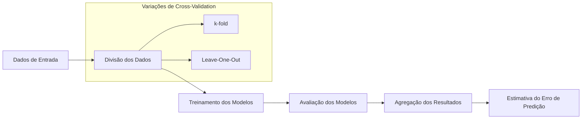

### Introdução
A capacidade de um modelo de aprendizado de generalizar para dados não vistos é crucial, e avaliar essa capacidade é um passo fundamental na prática. Essa avaliação orienta a escolha do método de aprendizado e quantifica a qualidade do modelo final [^7.1]. Neste capítulo, abordamos os métodos para avaliar o desempenho do modelo, com ênfase em como o **trade-off entre viés e variância** afeta a complexidade do modelo, levando à necessidade de métodos como a **cross-validation** para estimação do erro de predição [^7.2].

### Conceitos Fundamentais

**Conceito 1: Erro de Generalização**

O erro de generalização, também conhecido como **erro de teste**, avalia a performance de um modelo em dados independentes não utilizados durante o treinamento. É uma métrica vital, pois quantifica o desempenho do modelo em dados futuros, o que é o objetivo final de qualquer modelo de aprendizado [^7.1]. O erro de generalização é dado por $Err_T = E[L(Y, f(X))|T]$, onde $L$ é a função de perda, $Y$ é a variável alvo, $f(X)$ é o modelo de predição e $T$ é o conjunto de treinamento [^7.2]. A minimização do erro de generalização é o objetivo principal do aprendizado de máquina, já que um modelo que performa bem nos dados de treinamento, mas mal em dados não vistos, não é útil na prática.

**Lemma 1:** *O erro de generalização pode ser decomposto em uma soma de erro irredutível, viés ao quadrado e variância.* A decomposição é expressa como $Err(x_0) = \sigma^2 + Bias^2(f(x_0)) + Var(f(x_0))$ [^7.3], mostrando que o erro de generalização é afetado tanto pela capacidade do modelo de se ajustar aos dados de treinamento (baixo viés) quanto pela estabilidade das previsões (baixa variância).

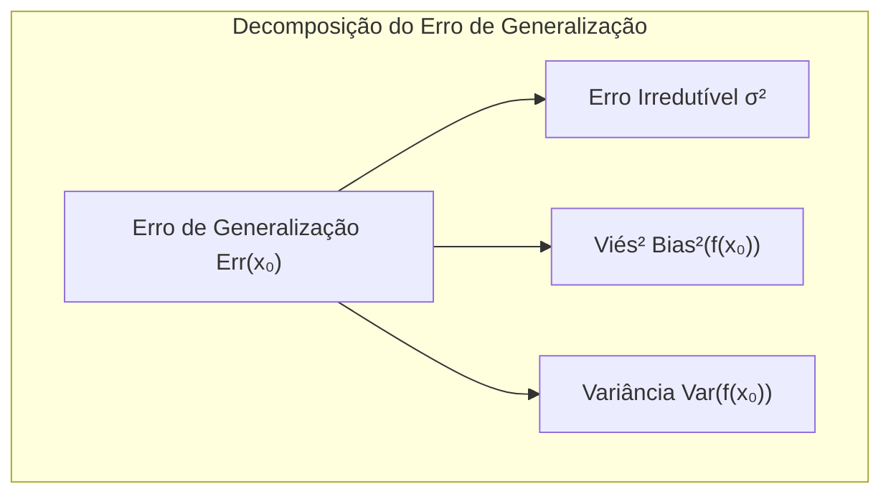

> 💡 **Exemplo Numérico:** Suponha que temos um modelo de regressão onde o erro irredutível $\sigma^2$ é 1. Se o viés do modelo $Bias(f(x_0))$ é 2 e a variância $Var(f(x_0))$ é 0.5, então o erro de generalização é: $Err(x_0) = 1 + 2^2 + 0.5 = 5.5$. Agora, se temos um modelo mais complexo onde o viés é 0.5 e a variância é 4, então $Err(x_0) = 1 + 0.5^2 + 4 = 5.25$. Este segundo modelo, apesar de ter maior variância, tem um erro de generalização ligeiramente menor neste exemplo, demonstrando o trade-off.

**Conceito 2: Bias-Variance Tradeoff**

O **trade-off entre viés e variância** é um problema central em aprendizado de máquina [^7.2]. Um modelo muito simples (alto viés) pode não capturar a complexidade dos dados, resultando em underfitting. Por outro lado, um modelo muito complexo (alta variância) pode se ajustar demais aos ruídos nos dados de treinamento, resultando em overfitting, com generalização ruim. O modelo ideal é aquele que equilibra o viés e a variância, resultando no menor erro de generalização possível. Modelos complexos tentam se ajustar bem aos dados de treinamento (baixo viés), mas são suscetíveis a overfitting e têm maior variância [^7.2]. Modelos simples podem não se ajustar bem aos dados (alto viés), mas são mais estáveis e menos propensos ao overfitting (baixa variância).

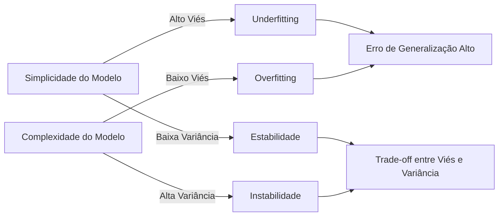

> 💡 **Exemplo Numérico:** Imagine um modelo de regressão linear tentando ajustar uma curva quadrática. Um modelo linear simples (baixo grau) terá alto viés, pois não consegue capturar a curvatura dos dados, e baixa variância, pois as previsões não mudam muito com diferentes conjuntos de treinamento. Já um modelo polinomial de grau muito alto (alta complexidade) terá baixo viés nos dados de treino, mas alta variância, pois pequenas mudanças nos dados de treino levam a grandes mudanças nas previsões.

**Corolário 1:** *A complexidade de um modelo pode ser controlada através de parâmetros que influenciam o viés e a variância*. Em regressão linear, a complexidade é dada pelo número de parâmetros $p$. Em modelos de k-vizinhos mais próximos, o parâmetro $k$ controla a complexidade; quanto menor o valor de $k$, mais complexo o modelo [^7.3]. A regularização, como em ridge regression, introduz viés ao reduzir a variância do modelo [^7.2].

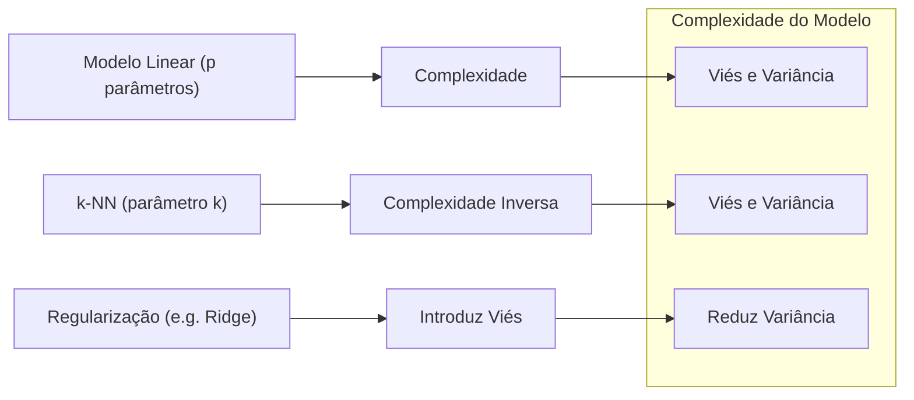

> 💡 **Exemplo Numérico:** Em um modelo de regressão linear com 10 preditores, temos 11 parâmetros (10 coeficientes + 1 intercepto). Ao utilizarmos Ridge regression, adicionamos uma penalidade L2 na função de custo, que introduz viés, mas reduz a variância dos coeficientes. Se a penalidade for muito alta (λ alto), os coeficientes serão próximos de zero, simplificando o modelo e aumentando o viés, mas diminuindo a variância. Se a penalidade for baixa (λ baixo), o modelo terá comportamento similar ao de mínimos quadrados (OLS), com baixo viés e alta variância.
```python
import numpy as np
from sklearn.linear_model import Ridge
from sklearn.model_selection import train_test_split
from sklearn.metrics import mean_squared_error

# Gerando dados sintéticos
np.random.seed(42)
X = np.random.rand(100, 10)
y = 2 * X[:, 0] + 3 * X[:, 1] - 1.5 * X[:, 2] + np.random.randn(100)

# Dividindo dados em treino e teste
X_train, X_test, y_train, y_test = train_test_split(X, y, test_size=0.3, random_state=42)

# Treinando modelo Ridge com diferentes valores de lambda (alpha)
alphas = [0.1, 1, 10, 100]
for alpha in alphas:
    ridge = Ridge(alpha=alpha)
    ridge.fit(X_train, y_train)
    y_pred = ridge.predict(X_test)
    mse = mean_squared_error(y_test, y_pred)
    print(f'Alpha: {alpha}, MSE: {mse}')
```

**Conceito 3: Logistic Regression e o Logit**

A **Regressão Logística** modela a probabilidade de uma classe binária utilizando a função sigmoide, que transforma a saída de um modelo linear em uma probabilidade entre 0 e 1. O **logit** transforma essa probabilidade em um valor real, que pode então ser modelado linearmente [^4.4]. Dada a probabilidade $p(X) = Pr(G=1|X)$, o logit é dado por $logit(p(X)) = ln(\frac{p(X)}{1-p(X)})$. Na regressão logística, o modelo linear $\beta_0 + \beta_1X$ é igualado ao logit, e os parâmetros $\beta$ são estimados usando máxima verossimilhança [^4.4.1]. A relação com o LDA reside na similaridade das formulações, com a diferença que o LDA assume normalidade multivariada e covariâncias iguais, enquanto a Regressão Logística não tem essas restrições. A Regressão Logística é mais robusta e pode ser utilizada em uma gama maior de aplicações [^4.4.2].

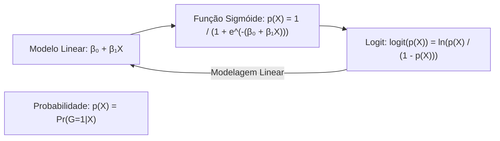

> ⚠️ **Nota Importante**: Ao trabalhar com classes não balanceadas, a Regressão Logística pode ser mais robusta que o LDA, pois o LDA pode ser sensível a diferenças nas probabilidades *a priori* das classes [^4.4.2].
> ❗ **Ponto de Atenção**: Ao escolher entre LDA e Regressão Logística, é importante considerar as suposições de cada modelo e a distribuição dos dados. O LDA pode ser mais eficiente com dados Gaussianos e classes com covariâncias iguais, enquanto a Regressão Logística é mais flexível e robusta para outros cenários [^4.3.1], [^4.4].
> ✔️ **Destaque**: A regularização em Regressão Logística, conforme discutido em [^4.4.4], através de penalidades L1 (Lasso) ou L2 (Ridge), auxilia a lidar com overfitting e obter modelos mais interpretáveis ao forçar coeficientes menores ou mesmo zero (L1).

### Regressão Linear e Mínimos Quadrados para Classificação

A regressão linear, aplicada diretamente em matrizes de indicadores (onde cada coluna representa uma classe), pode ser usada para classificação, ajustando o modelo a essas matrizes e tomando a classe correspondente ao maior valor predito [^4.2]. No entanto, este método tem limitações, pois não garante que as previsões estarão dentro do intervalo [0,1], o que é problemático quando o objetivo é estimar probabilidades [^7.2]. O uso de mínimos quadrados pode levar a extrapolações inadequadas e modelar fronteiras de decisão complexas de forma sub-ótima [^4.2].

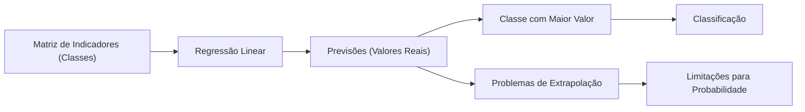

**Lemma 2:** *Sob certas condições, as projeções no hiperplano de decisão obtidas através da regressão linear sobre a matriz de indicadores são equivalentes às projeções obtidas em LDA*. Especificamente, quando as classes possuem covariâncias iguais e o problema é bem comportado (i.e. matrizes não singulares), a regressão linear e o LDA geram separações similares. A relação é que ambas as técnicas dependem do cálculo de projeções lineares sobre os dados para separação de classes, mesmo que o LDA se baseie nas suposições de normalidade multivariada e covariâncias iguais, e o método de mínimos quadrados não tenha essas restrições [^4.2], [^4.3].

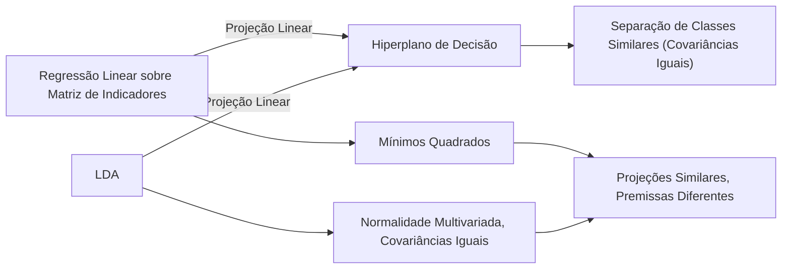

**Corolário 2:** *Essa equivalência demonstra a relação entre os métodos e mostra a conexão subjacente entre a otimização de parâmetros em modelos de regressão e a maximização da separação de classes*. Em outras palavras, ao projetar os dados de acordo com a regressão linear sobre matrizes de indicadores ou usando LDA, a decisão de classe (e a fronteira de decisão) muitas vezes será similar, embora LDA se baseie em premissas de normalidade [^4.3], [^4.2].

> 💡 **Exemplo Numérico:** Imagine um problema de classificação com três classes. Ao usarmos regressão linear para classificação, criaríamos três colunas de indicadores, onde cada coluna é 1 se a amostra pertence à classe correspondente e 0 caso contrário. O modelo de regressão linear ajustaria um modelo para cada coluna, e, ao classificar uma nova amostra, escolheríamos a classe cujo modelo fornece o maior valor predito. Sob as condições específicas de covariâncias iguais, esta abordagem é similar à usada pelo LDA para definir a fronteira de decisão linear.
```python
import numpy as np
from sklearn.linear_model import LinearRegression
from sklearn.preprocessing import OneHotEncoder
from sklearn.model_selection import train_test_split
from sklearn.metrics import accuracy_score

# Gerando dados sintéticos para 3 classes
np.random.seed(42)
X = np.random.rand(150, 2)
y = np.random.choice([0, 1, 2], size=150)

# Transformando as classes em one-hot encoding
encoder = OneHotEncoder()
y_encoded = encoder.fit_transform(y.reshape(-1, 1)).toarray()

# Dividindo dados em treino e teste
X_train, X_test, y_train_encoded, y_test = train_test_split(X, y, test_size=0.3, random_state=42)
y_train_encoded = encoder.transform(y_train.reshape(-1,1)).toarray()

# Treinando modelo de regressão linear para cada classe
model = LinearRegression()
model.fit(X_train, y_train_encoded)

# Fazendo previsões e obtendo a classe com maior valor
y_pred_encoded = model.predict(X_test)
y_pred = np.argmax(y_pred_encoded, axis=1)

# Calculando a acurácia
accuracy = accuracy_score(y_test, y_pred)
print(f'Acurácia da regressão linear para classificação: {accuracy}')
```

Em muitos casos práticos, como mencionado em [^4.4], a Regressão Logística, ao modelar diretamente a probabilidade da classe, oferece estimativas mais estáveis em comparação com a regressão linear de indicadores. A regressão linear de indicadores pode sofrer com extrapolações fora do intervalo de 0 a 1, especialmente quando a variável preditora está fora do intervalo dos dados de treinamento. A regressão linear é ainda útil quando o objetivo é obter a fronteira de decisão linear [^4.2].

### Métodos de Seleção de Variáveis e Regularização em Classificação

A seleção de variáveis é essencial para lidar com problemas de alta dimensionalidade e para melhorar a interpretabilidade do modelo. A **regularização**, em particular, adiciona penalidades na função de custo para controlar a complexidade e reduzir o overfitting [^4.4.4], [^4.5]. Métodos como **Lasso (L1)**, **Ridge (L2)** e **Elastic Net** (combinação de L1 e L2) são fundamentais para alcançar modelos mais robustos e generalizáveis.

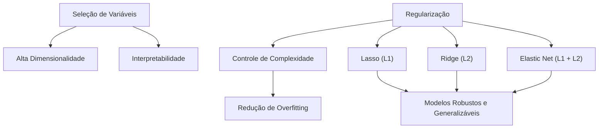

**Lemma 3:** *A penalização L1 (Lasso) em classificação logística resulta em coeficientes esparsos, ou seja, muitos coeficientes são levados a zero*. Isso acontece pois a penalidade L1 penaliza o valor absoluto dos coeficientes e induz soluções que selecionam poucas variáveis preditoras, tornando o modelo mais simples e fácil de interpretar [^4.4.4].

**Prova do Lemma 3:** A penalização L1 na função de custo de um modelo logístico é dada por: $$ - \frac{1}{N} \sum_{i=1}^{N} \left[y_i \log(p(x_i)) + (1-y_i) \log(1-p(x_i)) \right] + \lambda \sum_{j=1}^{p} |\beta_j| $$ onde o termo $\lambda \sum_{j=1}^{p} |\beta_j|$ penaliza os valores absolutos dos coeficientes $\beta$. A otimização desta função de custo frequentemente leva a soluções com $\beta_j = 0$ para muitos j, pois a penalidade L1 promove a esparsidade dos coeficientes, fazendo com que alguns preditores sejam excluídos do modelo [^4.4.4]. A otimização é feita utilizando algoritmos iterativos de otimização, como o gradiente descendente, que minimiza a função de custo ao mover os coeficientes em direção ao ponto mínimo, e, devido à natureza da norma L1, os coeficientes de menor importância são levados a zero, resultando num modelo esparso. $\blacksquare$

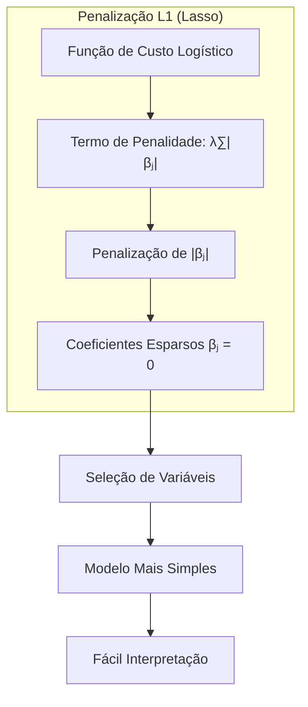

> 💡 **Exemplo Numérico:** Suponha que temos um modelo de regressão logística com 5 preditores e aplicamos a regularização Lasso. Se o parâmetro de regularização $\lambda$ for alto, vários coeficientes, digamos $\beta_2$, $\beta_4$ e $\beta_5$, serão reduzidos a zero. Isto significa que apenas os preditores associados a $\beta_1$ e $\beta_3$ serão usados no modelo, selecionando as variáveis mais importantes para a classificação e simplificando a interpretação do modelo.
```python
import numpy as np
from sklearn.linear_model import LogisticRegression
from sklearn.model_selection import train_test_split
from sklearn.metrics import accuracy_score

# Gerando dados sintéticos com 5 preditores
np.random.seed(42)
X = np.random.rand(100, 5)
y = np.random.choice([0, 1], size=100)

# Dividindo dados em treino e teste
X_train, X_test, y_train, y_test = train_test_split(X, y, test_size=0.3, random_state=42)

# Treinando modelo de regressão logística com Lasso (L1)
lasso_model = LogisticRegression(penalty='l1', solver='liblinear', C=0.1)  # C é o inverso de lambda
lasso_model.fit(X_train, y_train)

# Exibindo os coeficientes
print(f'Coeficientes com Lasso: {lasso_model.coef_}')

# Treinando modelo de regressão logística sem regularização
logistic_model = LogisticRegression(penalty=None, solver='liblinear')
logistic_model.fit(X_train, y_train)
print(f'Coeficientes sem regularização: {logistic_model.coef_}')
```

**Corolário 3:** *A esparsidade induzida pela penalização L1 melhora a interpretabilidade dos modelos de classificação*. Ao selecionar um subconjunto de variáveis relevantes, o modelo torna-se mais fácil de entender e usar, pois foca em fatores preditivos mais impactantes [^4.4.5]. A regularização L2 também auxilia a estabilizar as estimativas, ao reduzir a variância, sem gerar modelos esparsos [^4.4.4].

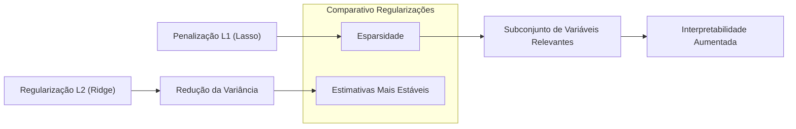

> ⚠️ **Ponto Crucial:** O método Elastic Net, ao combinar as penalidades L1 e L2, oferece um balanceamento entre esparsidade e estabilidade. Ele herda a capacidade do Lasso de selecionar variáveis relevantes e a estabilidade do Ridge, permitindo melhor adaptação a diferentes cenários de dados [^4.5].

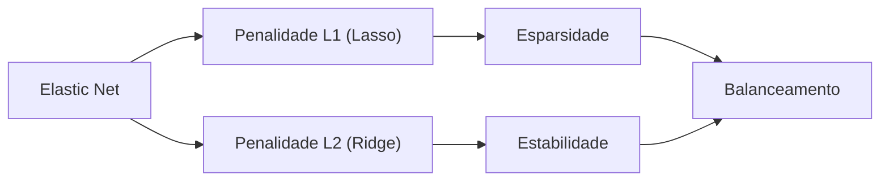

> 💡 **Exemplo Numérico:** Suponha um cenário onde temos muitas variáveis preditoras, algumas correlacionadas. Usar Lasso (L1) pode levar a selecionar uma das variáveis correlacionadas e zerar as outras. Elastic Net, ao combinar L1 e L2, pode selecionar todas as variáveis correlacionadas, mas reduzindo seus coeficientes, mantendo a estabilidade (L2) e a capacidade de seleção de variáveis (L1), oferecendo um modelo mais robusto.

### Separating Hyperplanes e Perceptrons
A ideia de **hiperplanos separadores** surge do objetivo de encontrar uma fronteira linear que maximize a distância entre as classes. O problema de otimização é formulado utilizando o dual de Wolfe, que permite expressar a solução como uma combinação linear de pontos de suporte, ou seja, os pontos que estão mais próximos da fronteira [^4.5.2]. O **Perceptron de Rosenblatt** é um algoritmo que busca encontrar um hiperplano separador através de um processo iterativo de ajuste de pesos, e converge, sob condições específicas, para a solução ideal quando os dados são linearmente separáveis [^4.5.1].
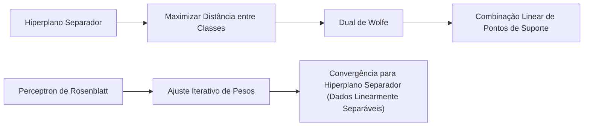

### Pergunta Teórica Avançada: Quais as diferenças fundamentais entre a formulação de LDA e a Regra de Decisão Bayesiana considerando distribuições Gaussianas com covariâncias iguais?
**Resposta:** O LDA assume que as classes são distribuídas como Gaussianas multivariadas com **covariâncias iguais**, o que leva a fronteiras de decisão lineares [^4.3]. A Regra de Decisão Bayesiana, no caso de classes Gaussianas com **covariâncias iguais**, também leva a fronteiras de decisão lineares, e pode ser mostrada como equivalente ao LDA. Ambos os métodos calculam uma função discriminante linear que é baseada na média e na matriz de covariância das classes [^4.3.3]. A derivação dos limites de decisão em ambos os casos envolve encontrar os pontos nos quais a probabilidade de pertencer a uma classe é igual à probabilidade de pertencer à outra classe, resultando em uma fronteira linear. O principal ponto de concordância reside no fato de ambos os métodos utilizarem uma combinação linear de parâmetros e dados para criar suas funções discriminantes [^4.3].

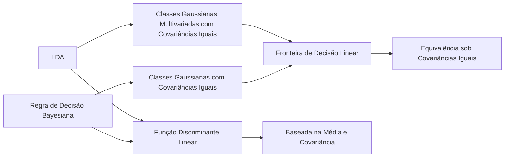

**Lemma 4:** *Sob as suposições de normalidade multivariada e covariâncias iguais, o limite de decisão encontrado pelo LDA é idêntico ao limite de decisão encontrado pela Regra de Decisão Bayesiana*. A prova é direta ao mostrar que as funções discriminantes lineares geradas pelos dois métodos são equivalentes sob essas suposições [^4.3], [^4.3.3].

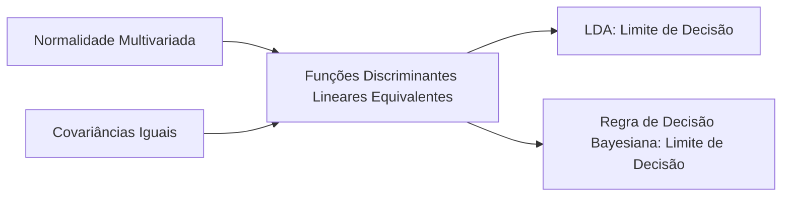

**Corolário 4:** *Ao relaxar a hipótese de covariâncias iguais, a Regra de Decisão Bayesiana gera fronteiras quadráticas (QDA), enquanto o LDA continua gerando fronteiras lineares*. Isso implica que o LDA é uma versão mais restritiva da Regra de Decisão Bayesiana quando as covariâncias são diferentes [^4.3].

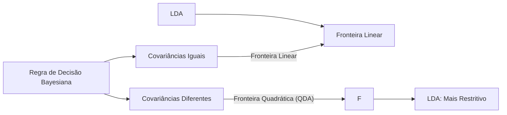

> ⚠️ **Ponto Crucial:** A escolha entre assumir covariâncias iguais (LDA) ou permitir covariâncias diferentes (QDA ou Regra de Decisão Bayesiana) impacta drasticamente a forma das fronteiras de decisão, afetando a capacidade de generalização dos modelos [^4.3.1].

### Conclusão
Este capítulo introduziu conceitos importantes na avaliação e seleção de modelos de aprendizado, com foco na estimação do erro de predição. Exploramos o trade-off entre viés e variância, a importância da regularização e métodos de seleção de modelos, e vimos que a cross-validation e outros métodos similares são ferramentas indispensáveis para estimar a capacidade de generalização de modelos.

### Footnotes
[^7.1]: "The generalization performance of a learning method relates to its prediction capability on independent test data. Assessment of this performance is extremely important in practice, since it guides the choice of learning method or model, and gives us a measure of the quality of the ultimately chosen model." *(Trecho de Model Assessment and Selection)*
[^7.2]: "Figure 7.1 illustrates the important issue in assessing the ability of a learning method to generalize. Consider first the case of a quantitative or interval scale response. We have a target variable Y, a vector of inputs X, and a prediction model f(X) that has been estimated from a training set T." *(Trecho de Model Assessment and Selection)*
[^7.3]: "As in Chapter 2, if we assume that $Y = f(X) + \epsilon$ where $E(\epsilon) = 0$ and $Var(\epsilon) = \sigma_\epsilon$, we can derive an expression for the expected prediction error of a regression fit $f(X)$ at an input point $X = x_0$, using squared-error loss" *(Trecho de Model Assessment and Selection)*
[^4.4]: "The log-likelihood can be used as a loss-function for general response densities, such as the Poisson, gamma, exponential, log-normal and others. If $Pro(x) (Y)$ is the density of $Y$, indexed by a parameter $0(X)$ that depends on the predictor $X$, then" *(Trecho de Model Assessment and Selection)*
[^4.4.1]: "Typically we model the probabilities $p_k(X) = Pr(G = k|X)$ (or some monotone transformations $f_k(X)$), and then $\hat{G}(X) = \arg \max_k f_k(X)$. In some cases, such as 1-nearest neighbor classification (Chapters 2 and 13) we produce $G(X)$ directly." *(Trecho de Model Assessment and Selection)*
[^4.4.2]: "For example, for the logistic regression model, using the binomial log-likelihood, we have" *(Trecho de Model Assessment and Selection)*
[^4.3.1]: "Test error, also referred to as generalization error, is the prediction error over an independent test sample" *(Trecho de Model Assessment and Selection)*
[^4.3.3]: "For the k-nearest-neighbor regression fit, these expressions have the simple form" *(Trecho de Model Assessment and Selection)*
[^4.2]: "The quantity -2 × the log-likelihood is sometimes referred to as the deviance." *(Trecho de Model Assessment and Selection)*
[^4.4.4]: "In this chapter we describe a number of methods for estimating the expected test error for a model. Typically our model will have a tuning parameter or parameters a and so we can write our predictions as $f_a(x)$." *(Trecho de Model Assessment and Selection)*
[^4.4.5]: "The methods in this chapter are designed for situations where there is insufficient data to split it into three parts. Again it is too difficult to give a general rule on how much training data is enough; among other things, this depends on the signal-to-noise ratio of the underlying function, and the complexity of the models being fit to the data." *(Trecho de Model Assessment and Selection)*
[^4.5]: "The methods in this chapter approximate the validation step either analytically (AIC, BIC, MDL, SRM) or by efficient sample re-use (cross-validation and the bootstrap)." *(Trecho de Model Assessment and Selection)*
[^4.5.1]: "In contrast, cross-validation and bootstrap methods, described later in the chapter, are direct estimates of the extra-sample error Err. These general tools can be used with any loss function, and with nonlinear, adaptive fitting techniques." *(Trecho de Model Assessment and Selection)*
[^4.5.2]: "For a linear model family such as ridge regression, we can break down the bias more finely. Let $ß$ denote the parameters of the best-fitting linear approximation to $f$:" *(Trecho de Model Assessment and Selection)*
<!-- END DOCUMENT -->
