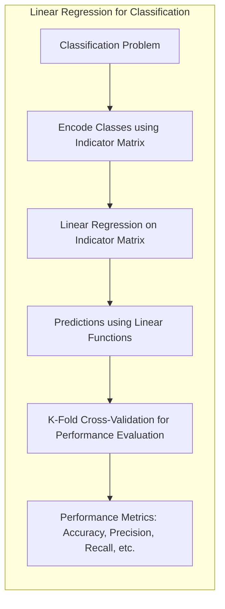
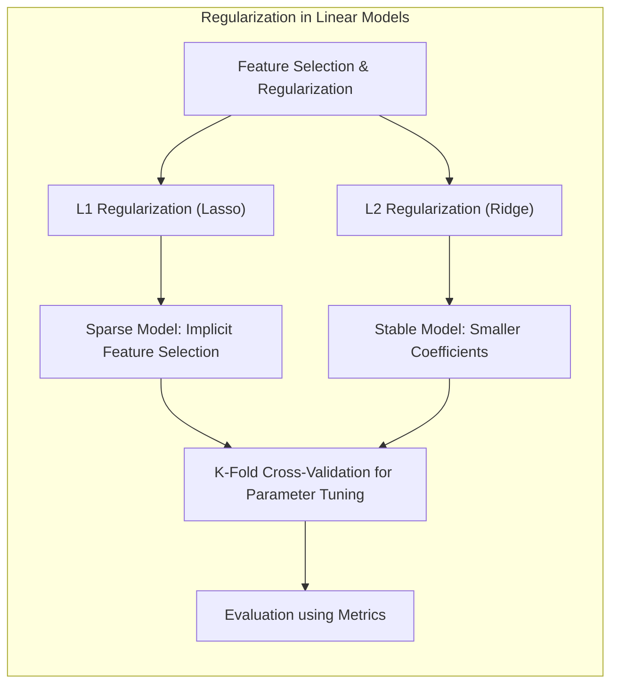

## K-Fold Cross-Validation: Um Guia Detalhado para Avaliação de Modelos
```mermaid
graph LR
    subgraph "K-Fold Cross-Validation Process"
        direction TB
        A["Dataset"] --> B{"Split into K Folds"};
        B --> C[ "For each Fold k = 1 to K" ];
        C --> D["Train Model on K-1 Folds"];
        D --> E["Test Model on Fold k"];
        E --> F["Store Test Error"];
        F --> C;
        C --> G["Average Test Errors from all K Folds"];
        G --> H["Estimated Model Performance"];
    end
```
### Introdução
A avaliação do desempenho de um modelo de aprendizado de máquina é uma etapa crucial no desenvolvimento de qualquer aplicação. O objetivo é estimar quão bem o modelo generalizará para dados não vistos, ou seja, sua capacidade de prever resultados precisos em situações reais. Uma das técnicas mais utilizadas para este propósito é a **K-Fold Cross-Validation**. Esta técnica envolve dividir o conjunto de dados em K partes (folds), usar K-1 partes para treinar o modelo e a parte restante para testar o modelo [^7.10], [^7.10.1]. O processo é repetido K vezes, cada vez com uma parte diferente usada para teste, e os resultados são combinados para fornecer uma estimativa do desempenho do modelo. O presente capítulo visa explorar em profundidade o K-Fold Cross-Validation, seus fundamentos, aplicações e nuances.

### Conceitos Fundamentais
**Conceito 1: O Problema da Generalização e da Avaliação de Modelos**
O desempenho de um método de aprendizado está intimamente ligado à sua capacidade de generalizar, ou seja, prever com precisão em dados que não foram utilizados no treinamento [^7.1]. A avaliação dessa capacidade é de extrema importância, pois ela orienta a escolha do método de aprendizado ou modelo adequado, fornecendo uma medida da qualidade do modelo selecionado [^7.1]. A avaliação em dados independentes é fundamental, pois um modelo que se ajusta perfeitamente aos dados de treinamento pode ter um desempenho insatisfatório com novos dados devido ao *overfitting*. O problema do *overfitting* é amplamente discutido no contexto da relação entre viés, variância e complexidade do modelo [^7.2]. Métodos lineares simples podem ter um viés alto, mas baixa variância, enquanto modelos mais complexos podem apresentar baixa viés, mas alta variância. O objetivo é encontrar um equilíbrio que minimize o erro de generalização.

> 💡 **Exemplo Numérico:**
>
> Imagine que estamos tentando prever o preço de casas com base em seus tamanhos.
>
> *   **Modelo Simples (Linear):** Usamos um modelo linear simples: $\text{Preço} = \beta_0 + \beta_1 \times \text{Tamanho}$. Este modelo tem um alto viés pois assume uma relação linear que pode não capturar todas as nuances do mercado imobiliário (por exemplo, não leva em conta a localização). No entanto, ele tem baixa variância, ou seja, ele se comporta de forma similar em diferentes amostras dos dados de treinamento.
>
> *   **Modelo Complexo (Polinomial de Alta Ordem):** Usamos um modelo polinomial de alta ordem: $\text{Preço} = \beta_0 + \beta_1 \times \text{Tamanho} + \beta_2 \times \text{Tamanho}^2 + \ldots + \beta_n \times \text{Tamanho}^n$. Este modelo tem baixo viés pois pode se ajustar bem aos dados de treinamento, mas tem alta variância. Ele pode se ajustar muito bem a um conjunto específico de dados, mas pode ter um desempenho ruim com novos dados.
>
> O K-Fold Cross-Validation ajudará a avaliar o desempenho desses modelos em diferentes partes dos dados, e selecionar o modelo que generaliza melhor para dados não vistos.
>
> Vamos supor que após aplicar K-Fold Cross-Validation em nossos modelos, obtemos os seguintes resultados:
>
> | Modelo             | Erro Médio (MSE) |
> |----------------------|--------------------|
> | Linear (Simples)     | 25000              |
> | Polinomial (Complexo)| 35000              |
>
> Neste exemplo, o modelo linear, apesar de sua simplicidade e alto viés, generaliza melhor do que o modelo polinomial, que sofre de *overfitting*, resultando em um erro maior em dados não vistos.

**Lemma 1:** *A complexidade do modelo influencia diretamente o viés e a variância da estimativa. Modelos mais simples tendem a ter maior viés e menor variância, enquanto modelos mais complexos tendem a ter menor viés, mas maior variância* [^7.2], [^7.3].
```mermaid
graph LR
    subgraph "Bias-Variance Tradeoff"
        direction TB
        A["Model Complexity"] --> B["Bias"];
        A --> C["Variance"];
        B --> D["Simple Model: High Bias, Low Variance"];
        C --> E["Complex Model: Low Bias, High Variance"];
         D --> F[ "Optimal Balance: Minimize Generalization Error"];
         E --> F;
        
    end
```

**Conceito 2: A Essência do K-Fold Cross-Validation**
O K-Fold Cross-Validation é um método de reamostragem que busca estimar o desempenho de um modelo em dados independentes. Ele divide o conjunto de dados em K partes (folds) de tamanho aproximadamente igual [^7.10.1]. O modelo é treinado em K-1 dessas partes e testado na parte restante. Esse processo é repetido K vezes, cada vez usando um fold diferente para o teste. Os resultados dos K testes são então combinados para obter uma estimativa do desempenho do modelo [^7.10.1]. Esta técnica permite utilizar todo o conjunto de dados, evitando a redução do tamanho do conjunto de treinamento que ocorreria ao se utilizar uma abordagem de divisão simples em treinamento e teste.

**Corolário 1:** *Ao iterar o treinamento e teste em diferentes folds, o K-Fold Cross-Validation proporciona uma avaliação mais robusta da capacidade de generalização do modelo, reduzindo a variabilidade associada a uma única divisão de dados em treinamento e teste* [^7.10.1].

**Conceito 3: Estimativas de Erro e suas Implicações**
Um dos principais objetivos do K-Fold Cross-Validation é estimar o erro de generalização do modelo, também conhecido como *expected test error* ou *prediction error* [^7.2]. Em termos formais, o erro de generalização (Err) é definido como o valor esperado da função de perda aplicada em um conjunto de dados independente. A função de perda ($L(Y, f(X))$) quantifica a diferença entre as previsões do modelo e os valores reais [^7.2]. No K-Fold Cross-Validation, para cada fold *k*, ajusta-se o modelo utilizando as outras *K-1* folds, e então, calcula-se o erro de previsão usando o fold *k*. O erro de previsão de cada fold é agregado para produzir um erro de previsão geral [^7.10], [^7.10.1]. Existem diferentes tipos de erros, como o *squared error*, usado em problemas de regressão, e o *misclassification error*, utilizado em problemas de classificação [^7.2].

> 💡 **Exemplo Numérico:**
>
> Suponha que estamos utilizando K-Fold Cross-Validation com K=5 para avaliar um modelo de regressão. Temos um conjunto de dados com 100 observações. Os dados são divididos em 5 folds de 20 observações cada.
>
> Para cada fold *k*, treinamos o modelo nas 80 observações dos outros 4 folds e calculamos o erro quadrático médio (MSE) nas 20 observações do fold *k*.
>
> Digamos que os MSEs para os 5 folds são os seguintes:
>
> *   Fold 1: MSE = 25
> *   Fold 2: MSE = 30
> *   Fold 3: MSE = 22
> *   Fold 4: MSE = 28
> *   Fold 5: MSE = 27
>
> O erro estimado do K-Fold Cross-Validation é a média desses MSEs:
>
> $\text{MSE}_{\text{K-Fold}} = \frac{25 + 30 + 22 + 28 + 27}{5} = 26.4$
>
> Este valor, 26.4, é uma estimativa do desempenho do modelo em dados não vistos. Ele nos permite comparar o desempenho de diferentes modelos.

### Regressão Linear e Mínimos Quadrados para Classificação

**Explicação:** O diagrama ilustra como problemas de classificação podem ser tratados usando regressão linear sobre uma matriz de indicadores, e como o desempenho do modelo é avaliado utilizando K-Fold Cross-Validation e métricas apropriadas.
A regressão linear, embora tradicionalmente utilizada para problemas de regressão, pode ser adaptada para problemas de classificação por meio da **regressão de matrizes de indicadores** [^7.2]. Nesta abordagem, cada classe é codificada como uma coluna de uma matriz de indicadores, onde cada linha representa uma observação. A regressão linear é então aplicada a cada coluna, resultando em uma função de decisão para cada classe. As previsões são feitas associando a observação à classe com a maior resposta da função linear. Apesar de sua simplicidade, este método apresenta limitações, como a tendência de produzir previsões que podem ficar fora do intervalo [0,1], e pode ser sensível a valores discrepantes. O K-Fold Cross-Validation pode ser aplicado para estimar a performance do modelo de regressão linear usado para classificação, permitindo uma avaliação mais robusta do desempenho do modelo.

> 💡 **Exemplo Numérico:**
>
> Imagine que temos um problema de classificação com três classes (A, B e C). Usamos um conjunto de dados com 100 observações e codificamos as classes em uma matriz de indicadores (1 para a classe correta e 0 para as outras):
>
> | Observação | Classe | Indicador A | Indicador B | Indicador C | Outras Features |
> |------------|--------|-------------|-------------|-------------|-----------------|
> | 1          | A      | 1           | 0           | 0           | ...            |
> | 2          | B      | 0           | 1           | 0           | ...            |
> | 3          | C      | 0           | 0           | 1           | ...            |
> | ...        | ...    | ...         | ...         | ...         | ...            |
> | 100        | A      | 1           | 0           | 0           | ...            |
>
> Aplicamos regressão linear em cada coluna da matriz de indicadores. Para cada observação *i*, obtemos os valores previstos $\hat{y}_{iA}$, $\hat{y}_{iB}$, e $\hat{y}_{iC}$ (os valores preditos pelo modelo para cada classe), onde os valores dessas predições podem estar fora do intervalo $[0,1]$. Para classificar, atribuímos à observação *i* a classe correspondente ao valor previsto máximo:
>
> $\text{Classe Predita}_i = \text{argmax}_{k \in \{A,B,C\}} \hat{y}_{ik}$
>
>
> O K-Fold Cross-Validation é utilizado para estimar o desempenho do modelo. O conjunto de dados é dividido em K folds. Para cada fold, o modelo é treinado nas observações dos outros K-1 folds, e avaliado nas observações do fold de teste. As métricas como acurácia, precisão e recall são calculadas em cada fold, e então calculadas na média dos folds. Por exemplo, se utilizarmos K=5 e a acurácia média nos folds for 0.82, então temos uma estimativa de que o modelo classificará corretamente 82% dos dados não vistos.

**Lemma 2:** *A regressão de matrizes de indicadores pode ser usada para problemas de classificação, mas as previsões podem extrapolar fora do intervalo [0,1], necessitando de métodos de correção, como a projeção nas classes mais próximas* [^7.2].

**Corolário 2:** *O K-Fold Cross-Validation, quando aplicado à regressão linear em matrizes de indicadores, avalia a robustez das fronteiras de decisão e as previsões de classificação em diferentes subconjuntos dos dados* [^7.10.1].

Em alguns casos, as limitações da regressão linear para classificação podem ser mitigadas com métodos como a **regressão logística**, que, ao contrário da regressão linear tradicional, gera previsões que podem ser interpretadas como probabilidades e se ajusta melhor aos problemas de classificação [^7.2]. Contudo, mesmo com métodos mais adequados, o K-Fold Cross-Validation continua sendo uma ferramenta fundamental para estimar o desempenho do modelo, permitindo a comparação com outros métodos e a escolha dos melhores parâmetros.

### Métodos de Seleção de Variáveis e Regularização em Classificação

**Explicação:** O diagrama mostra o processo de regularização L1 e L2, seu impacto em modelos lineares e como o K-Fold Cross-Validation é usado para ajustar os parâmetros de regularização e avaliar o modelo.
A seleção de variáveis e a regularização são técnicas cruciais em problemas de classificação, especialmente em situações com um grande número de preditores [^7.5]. Essas técnicas ajudam a reduzir a complexidade do modelo, evitando o *overfitting* e melhorando a capacidade de generalização. A **regularização** L1 (Lasso) e L2 (Ridge) adicionam penalidades à função de custo que penalizam a magnitude dos coeficientes do modelo [^7.2], [^7.3]. A regularização L1 tende a gerar modelos com coeficientes esparsos, resultando em uma seleção de variáveis implícita. Já a regularização L2 reduz a magnitude dos coeficientes, levando a modelos mais estáveis e menos sensíveis a pequenas mudanças nos dados de treinamento [^7.2]. O uso dessas técnicas impacta diretamente a capacidade de generalização, e o K-Fold Cross-Validation é crucial para ajustar os parâmetros de regularização.

> 💡 **Exemplo Numérico:**
>
> Suponha que temos um modelo de regressão logística para classificar pacientes como "alto risco" ou "baixo risco" com base em 20 variáveis de entrada (exames clínicos). Aplicamos regularização L1 e L2 para melhorar o desempenho do modelo.
>
> *   **Regularização L1 (Lasso):** Adicionamos uma penalidade à função de custo que é proporcional à soma dos valores absolutos dos coeficientes do modelo:
>     $$ \text{Custo}_\text{L1} = \text{Custo Original} + \lambda_1 \sum_{j=1}^{20} |\beta_j| $$
>     onde $\lambda_1$ é o parâmetro de regularização. Um valor grande para $\lambda_1$ força alguns coeficientes a serem exatamente zero, efetivamente selecionando apenas um subconjunto de variáveis relevantes.
>
> *   **Regularização L2 (Ridge):** Adicionamos uma penalidade à função de custo que é proporcional à soma dos quadrados dos coeficientes do modelo:
>      $$\text{Custo}_\text{L2} = \text{Custo Original} + \lambda_2 \sum_{j=1}^{20} \beta_j^2$$
>      onde $\lambda_2$ é o parâmetro de regularização. Um valor grande para $\lambda_2$ reduz a magnitude dos coeficientes, tornando o modelo menos sensível a pequenas mudanças nos dados de treinamento.
>
> Usamos K-Fold Cross-Validation para escolher os valores ideais para $\lambda_1$ e $\lambda_2$. Para cada valor de $\lambda_1$ e $\lambda_2$, avaliamos o modelo em cada fold, e calculamos o desempenho médio (e.g., a acurácia ou *F1-score*).
>
> Vamos supor que os resultados sejam os seguintes (para valores simplificados de λ):
>
> | Método              | $\lambda$ | Acurácia Média (K-Fold) | Número de Variáveis |
> |----------------------|-----------|----------------------|---------------------|
> | Regressão Logística (sem regularização)    | 0 | 0.78                  | 20                  |
> | Regressão Logística (L1 - Lasso) | 0.1 | 0.81                  | 12                  |
> | Regressão Logística (L1 - Lasso) | 0.5 | 0.79                  | 7                   |
> | Regressão Logística (L2 - Ridge) | 0.1 | 0.82                   | 20                  |
> | Regressão Logística (L2 - Ridge) | 1   | 0.80                   | 20                  |
>
> Neste exemplo, podemos ver que a regularização L2 com $\lambda_2=0.1$ oferece uma melhor acurácia média com todos os preditores mantidos. A regularização L1 com λ = 0.1 também melhora o resultado e ainda faz seleção de variáveis, simplificando o modelo.

**Lemma 3:** *A regularização L1 pode levar a modelos mais esparsos, enquanto a regularização L2 ajuda a reduzir a variância, tornando o modelo mais estável* [^7.2], [^7.3].

**Prova do Lemma 3:** Em modelos lineares, a regularização L1 adiciona um termo de penalidade proporcional à soma dos valores absolutos dos coeficientes, enquanto a regularização L2 adiciona um termo proporcional ao quadrado da soma dos coeficientes. A penalidade L1 força muitos coeficientes a serem exatamente zero, gerando esparsidade. A penalidade L2 reduz o valor dos coeficientes sem forçá-los a zero, resultando em um modelo mais estável e com menor variância, pois os parâmetros se tornam menos sensíveis aos dados. O problema de otimização com regularização L1 (Lasso) não é diferenciável, necessitando de algoritmos específicos como subgradient descent para a otimização. $\blacksquare$

**Corolário 3:** *O K-Fold Cross-Validation é um método eficaz para selecionar o valor adequado do parâmetro de regularização em modelos de classificação, permitindo equilibrar a complexidade do modelo com a capacidade de generalização* [^7.10.1].

A escolha dos parâmetros de regularização, assim como a seleção de quais variáveis são realmente relevantes, influencia diretamente o desempenho do modelo, e o K-Fold Cross-Validation proporciona uma abordagem sistemática para essa escolha, resultando em modelos mais robustos e generalizáveis. Técnicas como o *Elastic Net*, que combina penalidades L1 e L2, podem ser utilizadas para aproveitar as vantagens de ambas as abordagens [^7.5].

### Separating Hyperplanes e Perceptrons
```mermaid
graph LR
    subgraph "Perceptron Algorithm for Hyperplanes"
        direction TB
        A["Input Data (x, y)"];
        A --> B["Initialize Weights (w) and Bias (b)"];
        B --> C["For each Data Point:"];
        C --> D["Calculate Output: w * x + b"];
        D --> E{"Classify based on Output Sign"};
          E --> F[ "Check if Classification is Correct" ];
          F --> G[ "If Incorrect, update w and b" ];
          G --> C;
        F --> H["If All Correct, algorithm converges"]
          H --> I["K-Fold Cross Validation for Evaluation"];

    end
```
A ideia central por trás dos *separating hyperplanes* é encontrar uma fronteira linear que maximize a margem de separação entre as classes [^7.2]. Em um problema de classificação binária, o hiperplano de separação é definido como um conjunto de pontos que satisfazem uma equação linear. O objetivo é encontrar o hiperplano que melhor separe as classes, ou seja, aquele com a maior distância (margem) aos pontos de dados mais próximos de cada classe [^7.2]. A formulação desse problema envolve a otimização de uma função de custo que leva em consideração a margem e as possíveis violações da separabilidade [^7.2]. Um dos algoritmos mais conhecidos para encontrar *separating hyperplanes* é o Perceptron, um algoritmo iterativo que ajusta os parâmetros do hiperplano com base nos erros de classificação [^7.5], [^7.5.2]. O Perceptron de Rosenblatt foi um dos primeiros algoritmos de aprendizado de máquina, capaz de classificar dados linearmente separáveis em um número finito de iterações [^7.5.1].

> 💡 **Exemplo Numérico:**
>
> Considere um problema de classificação binária onde queremos separar dois grupos de pontos em um plano 2D. Cada ponto é definido por (x1, x2). Os pontos de um grupo são rotulados como +1 e os do outro grupo como -1.
>
> O objetivo do Perceptron é encontrar um hiperplano (neste caso, uma linha) que separa os dois grupos. O hiperplano é definido pela equação:
>
> $$w_1x_1 + w_2x_2 + b = 0$$
>
> Onde $w_1$ e $w_2$ são os pesos e *b* é o bias.
>
> O Perceptron itera sobre os dados. Inicialmente, os pesos e o bias são definidos aleatoriamente (e.g., $w_1=0.2$, $w_2=-0.5$, $b=0.1$). Para cada ponto $(x_1, x_2)$, o Perceptron calcula:
>
> $\text{Output} = w_1x_1 + w_2x_2 + b$
>
> Se Output > 0, o ponto é classificado como +1; caso contrário, é classificado como -1.
>
> Se o ponto for mal classificado, os pesos e o bias são atualizados da seguinte forma:
>
> $w_i \leftarrow w_i + \alpha \times \text{Target} \times x_i$
>
> $b \leftarrow b + \alpha \times \text{Target}$
>
> onde $\alpha$ é a taxa de aprendizado e $\text{Target}$ é o rótulo verdadeiro (+1 ou -1).
>
> Por exemplo, se um ponto com rótulo +1 é classificado como -1 pelo Perceptron, os pesos e o bias são ajustados para mover a linha de decisão na direção correta. Este processo se repete até que todos os pontos sejam classificados corretamente, ou seja, o hiperplano separe as classes. Note que o perceptron não converge se os dados não forem linearmente separáveis, e nesse caso é necessário usar outras abordagens.
>
> A avaliação do Perceptron é realizada por K-Fold Cross-Validation. O dataset é dividido em K folds, e para cada fold *k*, o modelo é treinado nos outros *K-1* folds e avaliado no fold *k*. O desempenho médio (acurácia, precisão, etc.) é utilizado para avaliar o modelo final.

**Lemma 4:** *Para dados linearmente separáveis, o Perceptron converge para um hiperplano que separa as classes* [^7.5.1].

**Prova do Lemma 4:** (Prova simplificada) Dado um conjunto de dados linearmente separável, o Perceptron atualiza seus pesos (parâmetros do hiperplano) em cada iteração até que não haja mais erros. Em cada passo, se um ponto de dados é mal classificado, os pesos são ajustados na direção que o coloca mais perto da região correta. Como os dados são linearmente separáveis, existe um hiperplano que separa as classes, e o Perceptron iterativamente converge para um dos infinitos hiperplanos de solução. $\blacksquare$

**Corolário 4:** *Sob certas condições, as soluções para o problema da maximização da margem podem ser obtidas através de combinações lineares dos pontos de suporte, ou seja, pontos que estão próximos da fronteira de decisão* [^7.2], [^7.5.2].

A convergência do Perceptron é garantida para dados linearmente separáveis [^7.5.1], mas em situações com dados não linearmente separáveis, outras técnicas como *support vector machines* (SVMs) e métodos de *kernel* são necessárias para encontrar fronteiras de decisão mais complexas [^7.2], [^7.5.2]. O K-Fold Cross-Validation desempenha um papel fundamental na avaliação de modelos que utilizam *separating hyperplanes*, permitindo estimar o desempenho em diferentes subconjuntos de dados e evitar o *overfitting*.

### Pergunta Teórica Avançada: Como o viés e a variância da estimativa de probabilidade em um classificador se relacionam com a escolha dos parâmetros em um modelo de Regressão Logística?
**Resposta:**
Na Regressão Logística, o objetivo é modelar a probabilidade de uma classe com base nas entradas. O modelo ajusta um conjunto de parâmetros (β) através da maximização da verossimilhança dos dados observados, o que impacta diretamente tanto o viés quanto a variância da estimativa de probabilidade [^7.2], [^7.3]. Um modelo mais simples (menos parâmetros ou coeficientes regularizados) pode ter um viés alto, mas uma variância baixa [^7.2]. Isso significa que, em média, a estimativa da probabilidade pode estar distante do valor verdadeiro, mas ela é relativamente consistente entre diferentes amostras. Um modelo mais complexo (mais parâmetros ou pouca regularização) pode ter um viés baixo, mas uma variância alta [^7.2], [^7.3]. Neste caso, a estimativa de probabilidade pode ser mais próxima do valor verdadeiro em média, mas ela varia muito entre diferentes amostras. A escolha dos parâmetros de regularização e o número de variáveis afetam diretamente esse equilíbrio. O K-Fold Cross-Validation ajuda a avaliar o desempenho do modelo com diferentes conjuntos de parâmetros, selecionando o conjunto que minimiza o *expected test error* [^7.10.1].
```mermaid
graph LR
    subgraph "Logistic Regression and Bias-Variance"
        direction TB
          A["Logistic Regression Model with Parameters"] --> B{"Parameter Choice (complexity & regularization)"};
         B --> C[ "Impact on Bias of Probability Estimates"];
           B --> D[ "Impact on Variance of Probability Estimates"];
           C --> E[ "Model Complexity vs Bias"];
           D --> F[ "Model Complexity vs Variance"];
            E & F --> G["K-Fold Cross Validation to Balance Bias and Variance"];

    end
```

> 💡 **Exemplo Numérico:**
>
> Considere um modelo de regressão logística para prever a probabilidade de um cliente comprar um produto. Temos 10 variáveis de entrada e podemos escolher entre dois modelos: um com menos variáveis e mais regularização (Modelo Simples) e outro com todas as variáveis e menos regularização (Modelo Complexo).
>
> *   **Modelo Simples:** Usamos 5 variáveis selecionadas e regularização L2 forte ($\lambda = 0.8$). Este modelo simplificado tem um viés maior, ou seja, pode não se ajustar perfeitamente aos dados, mas tem baixa variância.
> *   **Modelo Complexo:** Usamos todas as 10 variáveis com uma regularização L2 mais fraca ($\lambda = 0.1$). Este modelo tem um viés menor, ou seja, pode se ajustar muito bem aos dados de treinamento, mas possui maior variância.
>
> Aplicamos K-Fold Cross-Validation com K=5 e obtemos as seguintes métricas de avaliação:
>
> | Modelo            |   Acurácia Média | Variância da Acurácia |
> |--------------------|-------------------|----------------------|
> | Modelo Simples     |    0.77        |       0.002           |
> | Modelo Complexo   |    0.80        |      0.010           |
>
> O modelo complexo obteve uma acurácia média ligeiramente maior, mas com maior variância. Isso indica que o modelo simples pode ser mais robusto, dado que sua variância é menor.
>
> Além da acurácia, podemos analisar a probabilidade predita. Suponha que, para um cliente específico, temos a seguinte saída para o Modelo Simples e o Modelo Complexo em cada fold:
>
> | Fold | Probabilidade (Simples) | Probabilidade (Complexo) |
> |------|-------------------------|--------------------------|
> | 1    |        0.81            |          0.92             |
> | 2    |        0.79            |          0.68             |
> | 3    |        0.80           |           0.85             |
> | 4    |        0.82            |          0.75             |
> | 5    |        0.78           |           0.90              |
>
> O Modelo Simples é mais consistente em suas predições, demonstrando menor variância. O modelo complexo tem maior variabilidade e, portanto, maior variância.
>
> O K-Fold Cross-Validation ajuda a escolher o modelo que equilibra viés e variância, e generaliza melhor para novos clientes. A escolha entre os modelos pode depender de qual métrica é mais importante para o problema (robustez ou acurácia).

**Lemma 5:** *A complexidade do modelo de regressão logística, controlada pelos parâmetros de regularização e número de variáveis, influencia diretamente o trade-off entre viés e variância das estimativas de probabilidade* [^7.2].

**Corolário 5:** *O K-Fold Cross-Validation permite ajustar os parâmetros de regularização da regressão logística, buscando um equilíbrio ótimo entre viés e variância e consequentemente melhorando a capacidade de generalização do modelo* [^7.10.1].

A escolha do modelo (número de parâmetros e nível de regularização) na Regressão Logística é fundamental para a qualidade das estimativas de probabilidade, o que impacta diretamente a capacidade de classificar corretamente novas observações. Métodos como AIC e BIC podem ser utilizados para auxiliar nessa escolha, mas eles aproximam o *expected test error* e tendem a não estimar bem o *conditional error* [^7.7]. O K-Fold Cross-Validation, por outro lado, oferece uma abordagem mais robusta, permitindo uma avaliação mais completa do desempenho do modelo [^7.10], [^7.12].

### Conclusão
O K-Fold Cross-Validation é uma técnica poderosa e amplamente utilizada para a avaliação e seleção de modelos de aprendizado de máquina [^7.10], [^7.10.1]. Ao dividir o conjunto de dados em K partes, treinar o modelo em K-1 partes e testar na parte restante, ela permite estimar o desempenho do modelo em dados independentes e reduzir a variabilidade associada a uma única divisão de dados em treinamento e teste. Embora o K-Fold Cross-Validation tenha algumas limitações, como o fato de geralmente estimar melhor o *expected test error* do que o *conditional error*, ele continua sendo uma ferramenta fundamental na prática do aprendizado de máquina [^7.12]. Ao compreender seus fundamentos, aplicações e nuances, é possível fazer um uso mais eficaz dessa técnica na construção de modelos mais robustos e generalizáveis.
<!-- END DOCUMENT -->
### Footnotes
[^7.1]: "The generalization performance of a learning method relates to its prediction capability on independent test data. Assessment of this performance is extremely important in practice, since it guides the choice of learning method or model, and gives us a measure of the quality of the ultimately chosen model." *(Trecho de  Model Assessment and Selection)*
[^7.2]: "Figure 7.1 illustrates the important issue in assessing the ability of a learning method to generalize. Consider first the case of a quantitative or interval scale response. We have a target variable Y, a vector of inputs X, and a prediction model f(X) that has been estimated from a training set T. The loss function for measuring errors between Y and f(X) is denoted by L(Y, f(X))." *(Trecho de Model Assessment and Selection)*
[^7.3]: "The first term is the variance of the target around its true mean f(x0), and cannot be avoided no matter how well we estimate f(x0), unless σε = 0. The second term is the squared bias, the amount by which the average of our estimate differs from the true mean; the last term is the variance; the expected squared deviation of f(x0) around its mean. Typically the more complex we make the model f, the lower the (squared) bias but the higher the variance." *(Trecho de Model Assessment and Selection)*
[^7.5]: "The methods of this chapter approximate the validation step either analytically (AIC, BIC, MDL, SRM) or by efficient sample re-use (cross-validation and the bootstrap). Besides their use in model selection, we also examine to what extent each method provides a reliable estimate of test error of the final chosen model." *(Trecho de Model Assessment and Selection)*
[^7.5.1]: "The story is similar for a qualitative or categorical response G taking one of K values in a set G, labeled for convenience as 1, 2, ..., K. Typically we model the probabilities pk(X) = Pr(G = k|X) (or some monotone transformations fr(X)), and then Ĝ(X) = arg maxk Îk(X). In some cases, such as 1-nearest neighbor classification (Chapters 2 and 13) we produce Ĝ(X) directly." *(Trecho de Model Assessment and Selection)*
[^7.5.2]: "Described in Section 7.6, a linear fitting method is one for which we can write" *(Trecho de Model Assessment and Selection)*
[^7.7]: "The Bayesian information criterion (BIC), like AIC, is applicable in settings where the fitting is carried out by maximization of a log-likelihood. The generic form of BIC is" *(Trecho de Model Assessment and Selection)*
[^7.10]: "In this chapter we describe and illustrate the key methods for performance assessment, and show how they are used to select models. We begin the chapter with a discussion of the interplay between bias, variance and model complexity." *(Trecho de Model Assessment and Selection)*
[^7.10.1]: "If we are in a data-rich situation, the best approach for both problems is to randomly divide the dataset into three parts: a training set, a validation set, and a test set. The training set is used to fit the models; the validation set is used to estimate prediction error for model selection; the test set is used for assessment of the generalization error of the final chosen model." *(Trecho de Model Assessment and Selection)*
[^7.12]: "In contrast, cross-validation and bootstrap methods, described later in the chapter, are direct estimates of the extra-sample error Err. These general tools can be used with any loss function, and with nonlinear, adaptive fitting techniques." *(Trecho de Model Assessment and Selection)*
