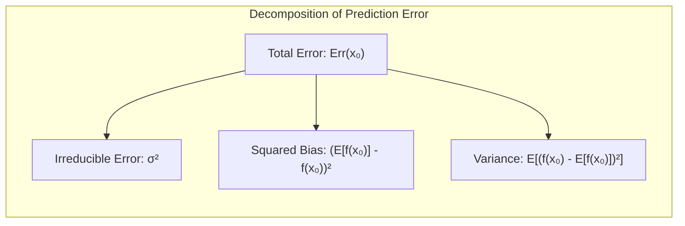
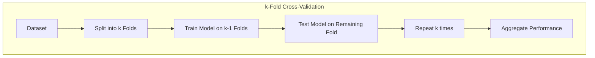
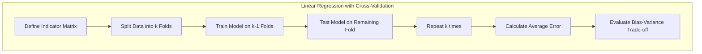
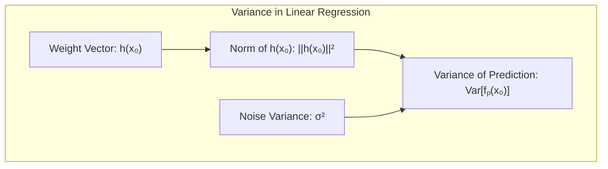
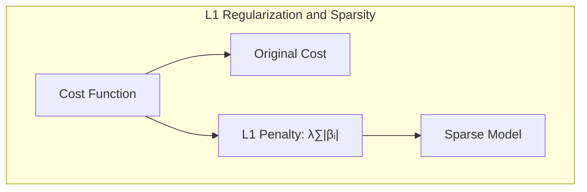
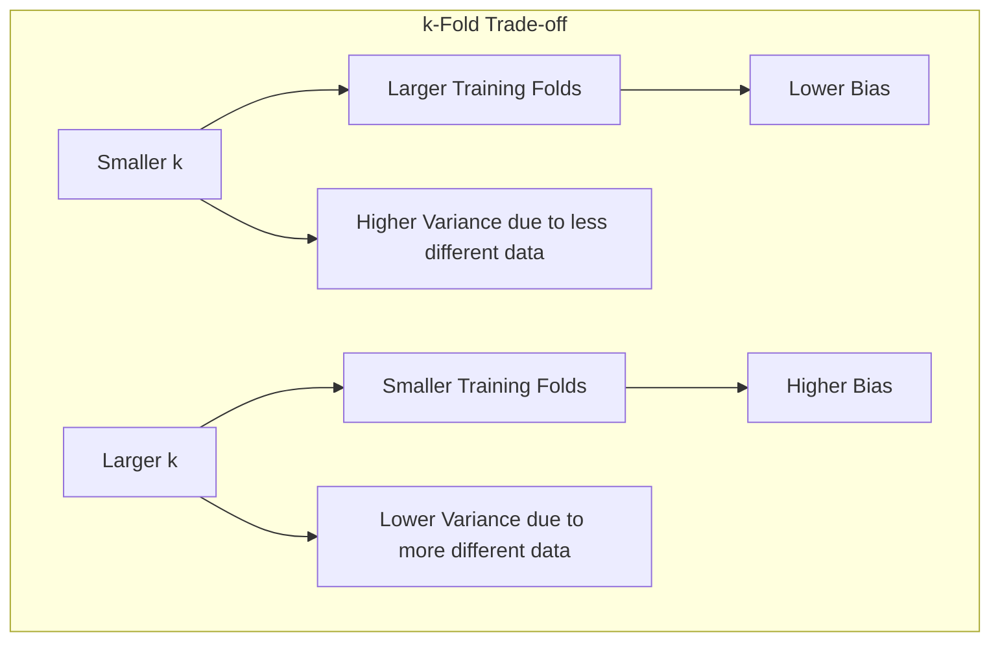

Okay, I will add the Mermaid diagrams as specified, focusing on enhancing the mathematical and statistical understanding of the text.

## Bias and Variance Tradeoff in Cross-Validation

<imagem: Diagrama mostrando um gráfico de bias e variância versus complexidade de modelo com diferentes tipos de validação cruzada (k-fold, leave-one-out) e suas implicações. A imagem deve incluir um eixo x representando a complexidade do modelo e dois eixos y: um para o bias e outro para a variância, cada um traçado com diferentes linhas representando os métodos de validação cruzada, incluindo leave-one-out e k-fold com diferentes valores de k.>

### Introdução

A avaliação do desempenho de modelos de aprendizado de máquina é crucial para garantir que os modelos generalizem bem para dados não vistos [^7.1]. Um aspecto fundamental dessa avaliação é o entendimento do *trade-off* entre **bias** e **variância**, que descreve a relação entre a complexidade do modelo e seu desempenho em dados de teste independentes. Este capítulo explora o uso da **validação cruzada** como uma técnica para estimar o desempenho de um modelo e como esse *trade-off* se manifesta neste contexto específico [^7.1].

### Conceitos Fundamentais

**Conceito 1: Generalização e *Trade-off* Bias-Variância**

O objetivo principal de qualquer modelo de aprendizado de máquina é a **generalização**, isto é, sua capacidade de fazer previsões precisas em dados não utilizados durante o treinamento. O *trade-off* entre **bias** e **variância** é uma barreira para alcançar essa generalização. Um modelo com **alto bias** (viés) é excessivamente simplificado e não consegue capturar as relações complexas dos dados, levando a erros tanto no conjunto de treinamento quanto no de teste. Em contraste, um modelo com **alta variância** é excessivamente complexo e se ajusta ao ruído aleatório nos dados de treinamento, resultando em um bom desempenho no conjunto de treinamento, mas um desempenho pobre em dados de teste [^7.2].

> ⚠️ **Nota Importante**: A escolha de um modelo que equilibre bem o *trade-off* bias-variância é essencial para obter um bom desempenho na prática. **Referência ao tópico [^7.2]**.

**Lemma 1: Decomposição do Erro de Predição**

O erro de predição esperado de um modelo de regressão $f(X)$ pode ser decomposto em três componentes: o erro irredutível (devido ao ruído nos dados), o bias ao quadrado e a variância [^7.3]. Matematicamente, em um ponto de entrada $X = x_0$:

$$Err(x_0) = \sigma^2 + [Ef(x_0) - f(x_0)]^2 + E[f(x_0) - Ef(x_0)]^2$$

Onde:
-  $\sigma^2$ é o **erro irredutível**, a variância do alvo em torno de sua média verdadeira $f(x_0)$.
- $[Ef(x_0) - f(x_0)]^2$ é o **bias ao quadrado**, a diferença entre a média das estimativas do modelo e a média verdadeira.
- $E[f(x_0) - Ef(x_0)]^2$ é a **variância**, a variabilidade das estimativas do modelo.

> 💡 **Exemplo Numérico:**
>
> Suponha que temos um modelo de regressão tentando prever preços de casas ($y$) com base em seus tamanhos ($x$). O modelo verdadeiro é $f(x) = 2x + 5$ (onde $x$ está em metros quadrados e $y$ em milhares de reais), e adicionamos um ruído aleatório $\epsilon \sim \mathcal{N}(0, 1)$ aos valores de $y$, ou seja $y=f(x)+\epsilon$.
>
> 1.  **Cenário de Alto Bias:** Usamos um modelo linear simples $\hat{f}_1(x) = a$ (uma constante), que não captura a relação entre tamanho e preço. Após o treinamento, estimamos que $a=10$. O $Ef(x)$ (valor médio estimado) será sempre 10. Se para uma casa de $x_0 = 5$ (5 metros quadrados), o valor real for $f(5) = 2 * 5 + 5 = 15$, então o bias ao quadrado é $(10 - 15)^2 = 25$.
> 2.  **Cenário de Alta Variância:** Usamos um modelo polinomial de alta ordem que se ajusta perfeitamente aos dados de treinamento, incluindo o ruído. Se executarmos o treinamento várias vezes com diferentes subconjuntos de dados de treinamento, obteremos modelos diferentes $\hat{f}_2(x)$, $\hat{f}_3(x)$, etc. para um $x_0$ de $5m^2$ teremos previsões como 12, 18, 14 com médias $Ef(x_0)=14$. A variância é a média de $[f_i(x_0) - Ef(x_0)]^2 = [(12-14)^2 + (18-14)^2 + (14-14)^2] / 3 = (4+16)/3 = 6.67$.
> 3.  **Erro Irredutível:** O erro irredutível $\sigma^2$, neste caso, é a variância do ruído que adicionamos aos dados, que é $\sigma^2=1$.
> 4.  **Erro Total:** Para o modelo de alto bias em $x_0 = 5$, teremos $Err(x_0) = 1 + 25 + 0 = 26$. Para o modelo de alta variância em $x_0 = 5$, teremos $Err(x_0) = 1 + (14 - 15)^2 + 6.67 = 8.67$. Note que o modelo de alta variância tem um erro menor neste ponto do que o modelo de alto bias.

**Conceito 2: Validação Cruzada**

A validação cruzada é uma técnica amplamente usada para estimar o desempenho de um modelo em dados não vistos e, consequentemente, para avaliar o *trade-off* bias-variância [^7.10]. Ela envolve a divisão do conjunto de dados em subconjuntos, utilizando alguns para treinar o modelo e outros para testá-lo. Uma das formas mais comuns é a *k-fold cross-validation*, onde o conjunto de dados é dividido em $k$ partes (folds) de tamanhos iguais. O modelo é treinado em $k-1$ folds e testado no fold restante, e esse processo é repetido $k$ vezes, cada vez usando um fold diferente para teste. Os resultados do desempenho são então agregados para fornecer uma estimativa da qualidade da generalização do modelo [^7.10.1].

> ❗ **Ponto de Atenção**: O valor de $k$ influencia o *trade-off* bias-variância na validação cruzada. **Conforme indicado em [^7.10.1]**.

**Corolário 1: Validação Cruzada Leave-One-Out (LOOCV)**

Um caso especial de validação cruzada é a *leave-one-out cross-validation* (LOOCV), onde $k$ é igual ao número de amostras nos dados ($k=N$). Nesse cenário, o modelo é treinado em todos os pontos de dados, exceto um, e o ponto deixado de fora é usado como teste. O processo é repetido para cada ponto nos dados [^7.10.1]. O LOOCV possui menor bias mas pode apresentar alta variância [^7.10.1].

> 💡 **Exemplo Numérico:**
>
> Imagine que temos um dataset com 10 amostras.
>
> **K-Fold (k=5):** Dividimos os dados em 5 folds de 2 amostras cada. Em cada iteração, treinamos o modelo em 4 folds (8 amostras) e testamos no fold restante (2 amostras). Repetimos 5 vezes e calculamos a média dos erros de teste.
>
> **LOOCV:** Para cada amostra, treinamos o modelo nas 9 amostras restantes e testamos na amostra deixada de fora. Repetimos isso 10 vezes (uma para cada amostra) e calculamos a média dos erros. O LOOCV tem um bias menor porque o modelo é treinado em uma quantidade maior de dados em cada iteração, mas pode sofrer de alta variância devido à correlação entre os modelos em cada iteração, dado que os conjuntos de treinamento são muito similares.

**Conceito 3: Otimismo da Taxa de Erro de Treinamento**

A taxa de erro de treinamento (ou erro em amostra) é geralmente otimista, isto é, menor que a verdadeira taxa de erro de generalização [^7.4]. Isso acontece porque o modelo é treinado nos mesmos dados usados para avaliação, permitindo que ele se ajuste ao ruído e detalhes específicos desses dados. O *trade-off* bias-variância se manifesta na maneira como o treinamento impacta os resultados da validação cruzada, na qual modelos complexos (alta variância) se beneficiam mais do que modelos simples (alto bias).
> ✔️ **Destaque**: Cross-validation visa mitigar o otimismo da taxa de erro de treinamento, estimando o erro em dados independentes. **Baseado no tópico [^7.4]**.

### Regressão Linear e Mínimos Quadrados para Classificação

A regressão linear, quando aplicada a um problema de classificação com uma matriz de indicadores, busca ajustar um modelo linear aos valores binários das classes [^7.2]. Embora simples, essa abordagem pode sofrer com o *trade-off* bias-variância. Para classes que não são bem separadas linearmente, a regressão linear pode levar a um modelo de alto bias, incapaz de capturar a complexidade dos dados [^7.2]. Por outro lado, se um grande número de parâmetros (ou seja, um número maior de variáveis preditoras) é usado em relação ao tamanho do conjunto de dados, o modelo pode se tornar muito flexível e apresentar alta variância, ajustando-se ao ruído nos dados de treinamento e generalizando mal para novos dados. Nesse contexto, a validação cruzada busca encontrar um equilíbrio, permitindo que se escolha um número adequado de variáveis preditoras e uma complexidade do modelo para otimizar a generalização [^7.10].

**Explicação:** O diagrama acima ilustra o processo de regressão de indicadores combinada com validação cruzada para lidar com o trade-off bias-variância.

**Lemma 2: Estimativa da Variância na Regressão Linear**
Em um modelo de regressão linear, onde os parâmetros são estimados via mínimos quadrados, a variância da predição $f_p(x_0)$ é dada por [^7.3]:

$$Var[f_p(x_0)] = ||h(x_0)||^2\sigma^2$$

Onde $h(x_0) = X(X^TX)^{-1}x_0$ é um vetor de pesos lineares e $\sigma^2$ é a variância do ruído. A variância, nesse contexto, aumenta com a complexidade do modelo (número de parâmetros $p$), o que está diretamente relacionado com a variância em cenários de validação cruzada.

> 💡 **Exemplo Numérico:**
>
> Considere um modelo de regressão linear com duas features $x_1$ e $x_2$. Seja $X$ a matriz de design (incluindo o intercepto), com um vetor de pesos linear $h(x_0)$ e $\sigma^2 = 1$ . A predição em um ponto $x_0 = [1, 2, 3]^T$ é dada por $f_p(x_0) = x_0^T \beta$, onde $\beta = (X^TX)^{-1}X^Ty$.
>
> Suponha que temos:
>
> $$X = \begin{bmatrix} 1 & 1 & 2 \\ 1 & 2 & 1 \\ 1 & 3 & 3 \\ 1 & 4 & 2  \end{bmatrix}, \quad  (X^TX)^{-1} = \begin{bmatrix} 2.75 & -0.25 & -0.5 \\ -0.25 & 0.125 & 0 \\ -0.5 & 0 & 0.125  \end{bmatrix}$$
>
> 1.  **Cálculo de $h(x_0)$:**  $h(x_0) = X(X^TX)^{-1}x_0 =  \begin{bmatrix} 1 & 1 & 2 \\ 1 & 2 & 1 \\ 1 & 3 & 3 \\ 1 & 4 & 2  \end{bmatrix} \begin{bmatrix} 2.75 & -0.25 & -0.5 \\ -0.25 & 0.125 & 0 \\ -0.5 & 0 & 0.125  \end{bmatrix}  \begin{bmatrix} 1 \\ 2 \\ 3  \end{bmatrix} = \begin{bmatrix} -0.75 \\ -0.5 \\ -0.25 \\ 0  \end{bmatrix}$.
> 2. **Cálculo da variância:** $Var[f_p(x_0)] = ||h(x_0)||^2\sigma^2 = ((-0.75)^2 + (-0.5)^2 + (-0.25)^2 + 0^2) * 1= 0.5625$.
>
>   Este exemplo mostra como a variância da predição em um ponto específico ($x_0$) é calculada e depende de $h(x_0)$, que por sua vez é influenciado pela complexidade do modelo. Em geral, adicionar mais features (aumentando a complexidade do modelo) levaria a um $h(x_0)$ com maior norma, resultando em maior variância.

**Corolário 2: Relação entre Variância e Número de Folds em Validação Cruzada**
Na validação cruzada, o aumento do número de folds $k$ diminui o bias, pois mais dados são usados no treinamento em cada iteração, mas também aumenta a variância das estimativas devido à menor quantidade de dados utilizados no teste. O contrário acontece ao diminuir o número de folds $k$.

“Em alguns casos, o uso de um $k$ pequeno pode resultar em uma alta variância na estimativa do erro, enquanto um $k$ grande, como no LOOCV, pode diminuir o bias mas aumentar a variância total [^7.10.1].”

"A escolha ideal de $k$ depende do trade-off desejado entre bias e variância. Valores de $k$ entre 5 e 10 são comumente utilizados como um bom compromisso prático [^7.10.1]".

> 💡 **Exemplo Numérico:**
>
> Imagine que temos um dataset com 100 amostras e estamos executando uma validação cruzada k-fold com os seguintes casos:
>
> **k=2:**  Dividimos os dados em 2 folds de 50 amostras cada. O modelo é treinado em 50 amostras e testado em 50.  Em seguida, invertemos os folds.  O bias é baixo, pois usamos uma boa parte dos dados no treinamento, mas a variância é alta porque as duas estimativas de erro podem variar muito (dependendo de qual fold é usado para o treinamento).
> **k=10:** Dividimos os dados em 10 folds de 10 amostras cada. O modelo é treinado em 90 amostras e testado em 10 amostras. Repetimos 10 vezes. O bias é maior em comparação com k=2, pois treinamos em menos dados em cada iteração. No entanto, a variância tende a ser menor, pois os folds de teste são menores.
> **k=100 (LOOCV):** O modelo é treinado em 99 amostras e testado em 1 amostra. A variância pode ser alta pois as estimativas são correlacionadas, devido à alta similaridade entre os conjuntos de treinamento, e o bias é menor.

### Métodos de Seleção de Variáveis e Regularização em Classificação

Em modelos de classificação, métodos de seleção de variáveis e regularização são utilizados para controlar a complexidade do modelo e mitigar problemas de overfitting [^7.5]. A regularização, por exemplo, ao adicionar penalidades a modelos logísticos (L1 e L2), restringe o espaço de soluções e induz a um modelo com variância reduzida. A validação cruzada, neste contexto, permite a escolha do nível de regularização que equilibre o *trade-off* bias-variância de forma ideal, evitando modelos sobreajustados ou excessivamente simplificados [^7.5].

**Lemma 3: Regularização L1 e Esparsidade**
A regularização L1 em modelos de classificação logística induz à esparsidade, levando a um modelo com menos parâmetros e consequentemente, menor variância [^7.6].

**Prova do Lemma 3:** A penalidade L1 adiciona o termo $\lambda \sum_{i=1}^p |\beta_i|$ à função de custo, onde $\lambda$ é o parâmetro de regularização e $\beta_i$ são os parâmetros do modelo. Para valores suficientemente altos de $\lambda$, os coeficientes $\beta_i$ tendem a ser zero, resultando num modelo esparso. $\blacksquare$

**Corolário 3: Efeito da Regularização no *Trade-off* Bias-Variância**
Ao penalizar a magnitude dos coeficientes, a regularização reduz a variância do modelo, mas pode aumentar seu bias. A escolha ideal do parâmetro de regularização (e portanto, o nível de complexidade do modelo) depende do *trade-off* entre bias e variância, e deve ser feita através de validação cruzada [^7.5].

> 💡 **Exemplo Numérico:**
>
> Suponha que estamos classificando emails como spam ou não spam usando um modelo de regressão logística com 1000 features (palavras do vocabulário).
>
> 1.  **Sem Regularização:** O modelo pode ajustar muito bem aos dados de treinamento, mas tem uma alta variância, generalizando mal para novos emails (overfitting).
> 2.  **Regularização L1 (Lasso):** Adicionamos a penalidade L1 com um $\lambda=0.1$. Muitos dos coeficientes $\beta_i$ são levados a zero, resultando em um modelo mais esparso e menos complexo. Isso reduz a variância do modelo, mas pode introduzir um pequeno aumento de bias.
> 3.  **Regularização L2 (Ridge):** Adicionamos a penalidade L2 com um $\lambda=0.1$. Os coeficientes são reduzidos, mas não necessariamente zerados. Isso também reduz a variância, mas em menor magnitude que a regularização L1, podendo introduzir menos bias.
> 4.  **Validação Cruzada para Escolha de $\lambda$:** Usamos validação cruzada com diferentes valores de $\lambda$ para L1 e L2 (ex: $\lambda \in \{0.001, 0.01, 0.1, 1\}$) e escolhemos o valor que apresenta o menor erro de validação cruzada, equilibrando o bias e a variância.
>
> Uma tabela comparativa poderia se parecer com:
>
> | Método             | Erro de Treinamento | Erro de Validação | Número de Coeficientes $\neq 0$ |
> |--------------------|---------------------|-------------------|-----------------------------------|
> | Sem Regularização   | 0.01                | 0.15              | 1000                              |
> | Regularização L1 ($\lambda=0.1$) | 0.05                | 0.08              | 200                               |
> | Regularização L2 ($\lambda=0.1$) | 0.03                | 0.10              | 1000                             |

### Separating Hyperplanes e Perceptrons

O método de *separating hyperplanes* e o algoritmo do *perceptron* buscam encontrar uma fronteira linear que separe as classes em um problema de classificação [^7.5.2], [^7.5.1]. A complexidade desses modelos é definida pelo número de dimensões dos dados de entrada. Modelos complexos (em altas dimensões) podem ter uma alta variância e serem suscetíveis a overfitting, ajustando-se ao ruído dos dados de treinamento. Nesse contexto, a validação cruzada busca encontrar a complexidade ideal do modelo (e talvez um subconjunto ótimo de características) que equilibre bias e variância [^7.10].

### Pergunta Teórica Avançada: Como a escolha do número de folds em validação cruzada afeta o *trade-off* bias-variância?

**Resposta:**
Na validação cruzada, a escolha do número de *folds* ($k$) afeta significativamente o balanço entre bias e variância [^7.10]. Um valor menor de $k$ (por exemplo, $k=2$) resulta em folds de treinamento maiores, que se aproximam do conjunto de treinamento original, levando a um menor bias na estimativa de erro. No entanto, cada modelo é treinado em uma parte diferente dos dados, o que aumenta a variância da estimativa. Por outro lado, um valor maior de $k$ (por exemplo, *leave-one-out*) diminui a variância, mas aumenta o bias, já que cada modelo é treinado em um subconjunto menor e muito similar aos outros.

**Lemma 4: Bias e Variância em k-fold cross-validation**
Com um $k$ menor, a estimativa de erro da validação cruzada é baseada em um modelo treinado em um subconjunto maior dos dados, resultando em um menor bias. Contudo, a estimativa de erro em cada fold é mais correlacionada entre si, levando a uma maior variância.

**Corolário 4: Implicações práticas da escolha do k na validação cruzada**
Na prática, um valor de $k$ entre 5 e 10 é frequentemente usado como um bom compromisso entre bias e variância [^7.10.1]. A escolha de um valor maior pode ser adequada quando o objetivo é diminuir a variância da estimativa, enquanto um valor menor pode ser usado quando o bias é uma maior preocupação.

> ⚠️ **Ponto Crucial**:  A escolha de $k$ em validação cruzada depende do *trade-off* desejado entre bias e variância, considerando também o tamanho do conjunto de dados e a complexidade do modelo. **Conforme discutido em [^7.10.1]**.

### Conclusão

A validação cruzada é uma ferramenta essencial para estimar o desempenho de modelos de aprendizado de máquina, fornecendo uma avaliação confiável do *trade-off* bias-variância [^7.10]. A escolha adequada de parâmetros como o número de folds e métodos de regularização é fundamental para equilibrar bias e variância e otimizar o desempenho do modelo na generalização. Ao considerar esses aspectos, o analista pode escolher modelos que sejam robustos e tenham bom desempenho em dados não vistos.

<!-- END DOCUMENT -->

### Footnotes

[^7.1]: "The generalization performance of a learning method relates to its prediction capability on independent test data. Assessment of this performance is extremely important in practice, since it guides the choice of learning method or model, and gives us a measure of the quality of the ultimately chosen model." *(Trecho de Model Assessment and Selection)*
[^7.2]: "Figure 7.1 illustrates the important issue in assessing the ability of a learning method to generalize. Consider first the case of a quantitative or interval scale response. We have a target variable Y, a vector of inputs X, and a prediction model f(X) that has been estimated from a training set T." *(Trecho de Model Assessment and Selection)*
[^7.3]: "As in Chapter 2, if we assume that $Y = f(X) + \epsilon$ where $E(\epsilon) = 0$ and $Var(\epsilon) = \sigma^2$, we can derive an expression for the expected prediction error of a regression fit $f(X)$ at an input point $X = x_0$, using squared-error loss:" *(Trecho de Model Assessment and Selection)*
[^7.4]:  "Discussions of error rate estimation can be confusing, because we have to make clear which quantities are fixed and which are random1. Before we continue, we need a few definitions, elaborating on the material of Section 7.2." *(Trecho de Model Assessment and Selection)*
[^7.5]:  "The methods of this chapter approximate the validation step either analytically (AIC, BIC, MDL, SRM) or by efficient sample re-use (cross-validation and the bootstrap). Besides their use in model selection, we also examine to what extent each method provides a reliable estimate of test error of the final chosen model." *(Trecho de Model Assessment and Selection)*
[^7.6]:  "For example, for the logistic regression model, using the binomial log-likelihood, we have" *(Trecho de Model Assessment and Selection)*
[^7.10]:  "Probably the simplest and most widely used method for estimating prediction error is cross-validation. This method directly estimates the expected extra-sample error $Err = E[L(Y, f(X))]$, the average generalization error when the method $f(X)$ is applied to an independent test sample from the joint distribution of $X$ and $Y$." *(Trecho de Model Assessment and Selection)*
[^7.10.1]:  "Ideally, if we had enough data, we would set aside a validation set and use it to assess the performance of our prediction model. Since data are often scarce, this is usually not possible. To finesse the problem, K-fold cross-validation uses part of the available data to fit the model, and a different part to test it." *(Trecho de Model Assessment and Selection)*
[^7.5.1]: "Here $h(x) = X(X^TX)^{-1}x_0$, the N-vector of linear weights that produce the fit $f(x_0) = x_0^T(X^TX)^{-1}X^Ty$, and hence $Var[f(x_0)] = ||h(x_0)||^2\sigma^2$." *(Trecho de Model Assessment and Selection)*
[^7.5.2]: "Before jumping into these topics, we first explore in more detail the nature of test error and the bias-variance tradeoff." *(Trecho de Model Assessment and Selection)*
