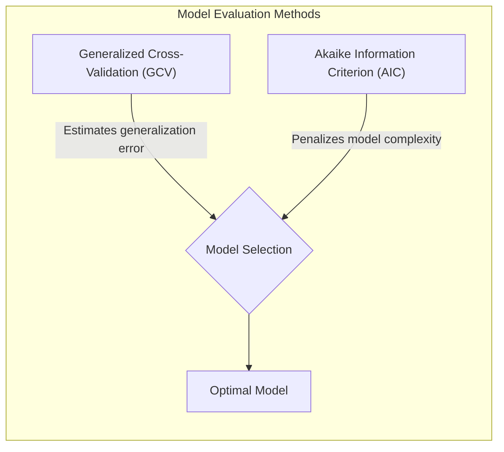
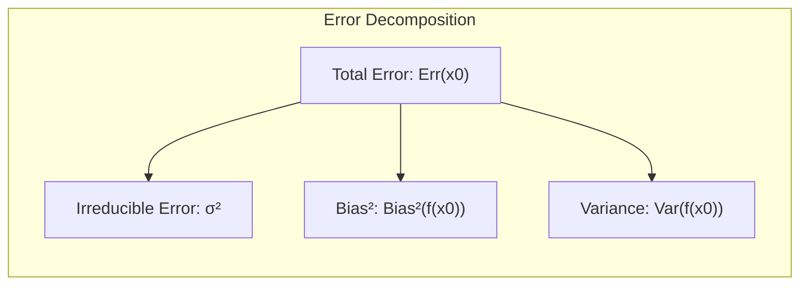
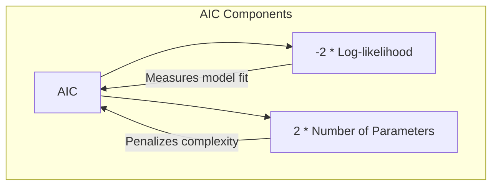
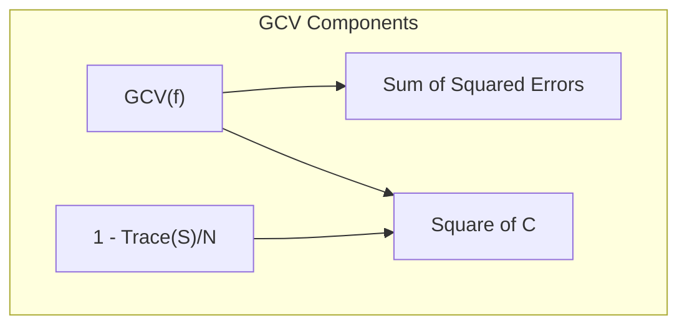
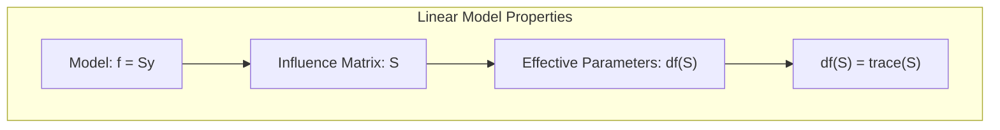
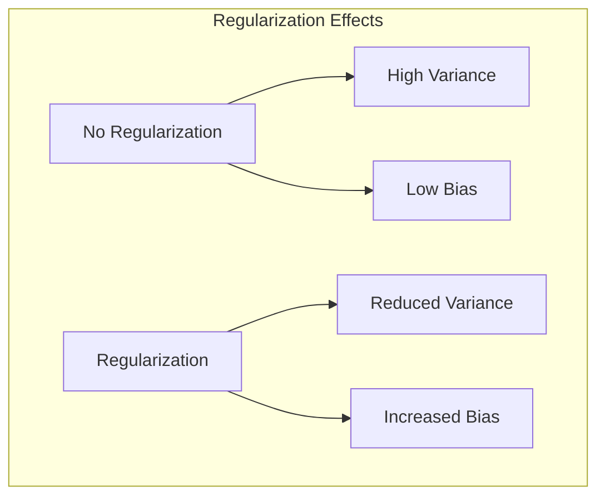
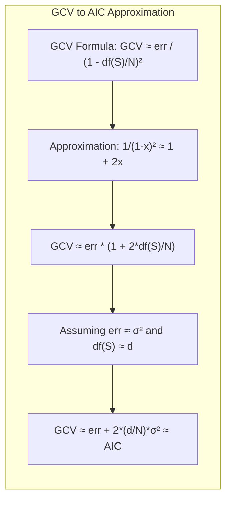
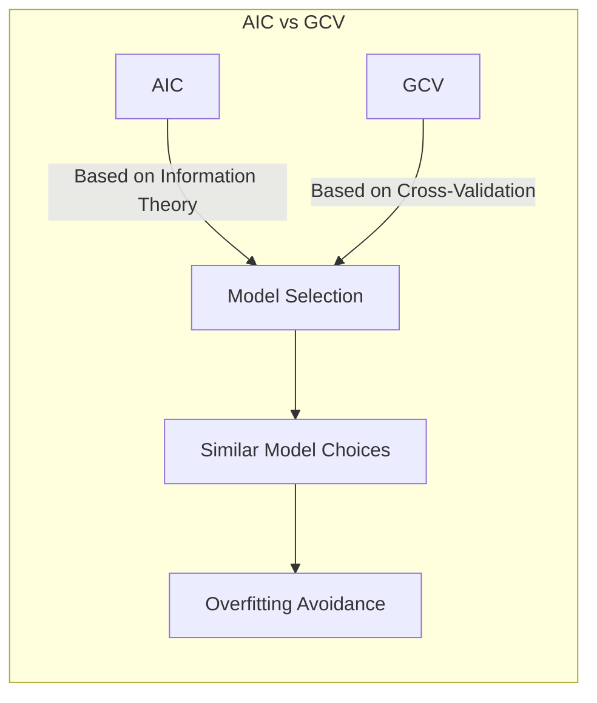

## Aprofundando a Similaridade entre Generalized Cross-Validation (GCV) e Akaike Information Criterion (AIC)

### Introdução

Este capítulo explora em detalhe os métodos de avaliação e seleção de modelos, focando na relação intrínseca entre o Generalized Cross-Validation (GCV) e o Akaike Information Criterion (AIC). A avaliação de modelos é crucial para garantir que os modelos preditivos generalizem bem para dados não vistos, e a escolha de um método adequado de avaliação é fundamental [^7.1]. GCV e AIC, embora derivados de perspectivas diferentes, compartilham fundamentos teóricos que os tornam similares em muitas situações práticas, especialmente para modelos lineares [^7.5]. Este capítulo explora as nuances dessas similaridades, detalhando suas derivações matemáticas, suposições e aplicações.

### Conceitos Fundamentais

Para entender a relação entre GCV e AIC, é fundamental revisitar alguns conceitos chave:

**Conceito 1: Erro de Generalização e Overfitting**: O principal objetivo de um modelo de aprendizado é generalizar bem para dados não vistos. O overfitting ocorre quando um modelo se ajusta muito bem aos dados de treinamento, mas tem um desempenho ruim em dados não vistos [^7.2]. A complexidade do modelo e a quantidade de dados de treinamento são fatores cruciais no trade-off entre bias e variance [^7.2], [^7.3].

**Lemma 1:** *O erro esperado de um modelo pode ser decomposto em três componentes principais: erro irredutível (variância do ruído), bias ao quadrado e variância do modelo*. Essa decomposição é fundamental para entender como a complexidade do modelo afeta o desempenho preditivo [^7.3].
$$ Err(x_0) = \sigma^2 + Bias^2(f(x_0)) + Var(f(x_0)) $$
> 💡 **Exemplo Numérico:** Suponha que temos um modelo com erro irredutível $\sigma^2 = 0.5$, um bias de $Bias(f(x_0)) = 0.2$, e uma variância de $Var(f(x_0)) = 0.1$. Então, o erro esperado seria $Err(x_0) = 0.5 + 0.2^2 + 0.1 = 0.5 + 0.04 + 0.1 = 0.64$. Este exemplo ilustra como os três componentes contribuem para o erro total do modelo. Um modelo mais complexo poderia reduzir o bias, mas aumentar a variância, e vice-versa, evidenciando o trade-off.

**Conceito 2: Otimismo do Erro de Treinamento**: O erro de treinamento, ou erro in-sample, geralmente é uma estimativa otimista do erro de generalização. Modelos tendem a se ajustar ao ruído nos dados de treinamento, levando a um desempenho aparentemente melhor nos dados de treinamento do que em dados novos e não vistos [^7.4].

**Corolário 1:** *O otimismo do erro de treinamento pode ser corrigido adicionando um termo de penalidade que depende da complexidade do modelo*, conforme expresso pelo AIC [^7.5] e utilizado no método GCV [^7.10].

**Conceito 3: AIC (Akaike Information Criterion)**: O AIC é uma métrica baseada na teoria da informação que estima a qualidade relativa de um modelo estatístico. Ele penaliza modelos complexos, adicionando um termo que cresce com o número de parâmetros no modelo. AIC é dado por:
$$AIC = -2 \, loglik + 2d$$ onde $loglik$ é o log-likelihood maximizado do modelo e $d$ é o número de parâmetros. [^7.5]
> ⚠️ **Nota Importante**: A penalidade no AIC, $2d$, corrige o otimismo do erro de treinamento em modelos lineares. [^7.5]
> 💡 **Exemplo Numérico:** Considere dois modelos: Modelo A com $loglik = -150$ e 5 parâmetros, e Modelo B com $loglik = -140$ e 10 parâmetros. O $AIC_A = -2(-150) + 2(5) = 310$ e o $AIC_B = -2(-140) + 2(10) = 300$. Apesar do Modelo B ter um log-likelihood maior, o AIC penaliza a complexidade, e neste caso favorece o Modelo B. Este exemplo mostra como o AIC equilibra o ajuste do modelo (log-likelihood) com a sua complexidade (número de parâmetros).

**Conceito 4: GCV (Generalized Cross-Validation)**: GCV é uma técnica de validação cruzada para estimar o erro de generalização de um modelo. Ele aproxima a validação cruzada leave-one-out para modelos lineares e é calculado como:
$$ GCV(f) = \frac{\sum_{i=1}^N [y_i - \hat{f}(x_i)]^2}{[1 - \text{trace}(S)/N]^2} $$
onde $S$ é a matriz de influência do modelo e $trace(S)$ é a soma dos elementos da diagonal principal (traço da matriz). [^7.10]
> ❗ **Ponto de Atenção**: O GCV visa minimizar a função de erro ajustando a complexidade do modelo, similarmente ao AIC, mas utilizando um método de validação cruzada. [^7.10]
> 💡 **Exemplo Numérico:** Suponha que temos um modelo linear com $N = 100$ observações. O erro quadrático médio (MSE) é $\frac{1}{N}\sum_{i=1}^N [y_i - \hat{f}(x_i)]^2 = 0.4$. A matriz de influência $S$ tem um traço $\text{trace}(S) = 5$. Então, $GCV = \frac{0.4}{(1 - 5/100)^2} = \frac{0.4}{(0.95)^2} \approx \frac{0.4}{0.9025} \approx 0.443$. Se o $\text{trace}(S)$ fosse 10, teríamos $GCV = \frac{0.4}{(1 - 10/100)^2} = \frac{0.4}{(0.9)^2} \approx \frac{0.4}{0.81} \approx 0.494$. Este exemplo demonstra como o GCV penaliza modelos com maior número efetivo de parâmetros (maior trace(S)).

### Regressão Linear e Mínimos Quadrados para Classificação

Na regressão linear para classificação, buscamos modelar a relação entre uma variável de resposta categórica e um conjunto de preditores utilizando uma matriz de indicadores para representar as classes.

A aplicação de mínimos quadrados na regressão de indicadores busca minimizar a soma dos erros quadrados entre a resposta observada e a resposta predita. A matriz de influência ($S$) é crucial para entender o impacto de cada observação no ajuste do modelo. O GCV utiliza o trace de $S$ para estimar o número efetivo de parâmetros, relacionando-se à ideia do AIC de penalizar modelos complexos.

**Lemma 2:** *Para um modelo linear f = Sy, o traço da matriz de influência $S$ (trace(S)) representa o número efetivo de parâmetros*. Essa propriedade é fundamental para a conexão entre GCV e AIC [^7.6]. $$df(S) = \text{trace}(S)$$
> 💡 **Exemplo Numérico:** Consideremos um modelo linear com 3 preditores e 100 observações. Se o modelo fosse ajustado sem regularização, o $\text{trace}(S)$ seria aproximadamente 3. Se usarmos regularização, o $\text{trace}(S)$ pode ser menor que 3, indicando um número efetivo de parâmetros menor devido à penalização. Se o $\text{trace}(S)$ fosse, por exemplo, 2.5, o GCV usaria este valor para penalizar a complexidade do modelo. Este exemplo mostra que o $\text{trace}(S)$ captura o número efetivo de graus de liberdade do modelo.

**Corolário 2:** *Em modelos lineares com ruído aditivo, a média dos erros quadrados pode ser expressa em termos do traço de S*, permitindo a derivação do GCV.

A limitação desse método reside na sua tendência a overfitting, especialmente quando o número de preditores se aproxima do número de observações. Essa limitação é abordada pelos métodos de regularização, que penalizam modelos complexos [^7.3].

### Métodos de Seleção de Variáveis e Regularização em Classificação

A seleção de variáveis e a regularização são abordagens para mitigar o problema de overfitting em modelos com muitos preditores. Penalidades como L1 e L2 são frequentemente usadas para induzir sparsity e estabilidade [^7.2]. No contexto da regressão linear, a regularização altera a matriz de influência $S$ e, consequentemente, a métrica do GCV.
> ✔️ **Destaque**: Tanto o AIC como o GCV consideram o efeito da complexidade do modelo ao escolher os melhores parâmetros. [^7.5] e [^7.10]

**Lemma 3:** *A regularização, como a ridge regression, introduz bias no modelo, mas reduz a variância*. Isso é fundamental para a formulação do GCV em modelos regularizados [^7.3].
$$ Err(x_0) = \sigma^2 + [f(x_0) - E[f_p(x_0)]]^2 + ||h(x_0)||^2 \sigma^2$$
> 💡 **Exemplo Numérico:** Suponha um modelo linear com um coeficiente $\beta$ estimado com uma dada variância. Sem regularização, a estimativa $\hat{\beta}$ pode ter alta variância, mas baixo bias. Com Ridge regression, o coeficiente será contraído, introduzindo um bias, mas reduzindo a variância. Digamos que $\hat{\beta} = 0.8$ sem regularização e $\hat{\beta}_{ridge} = 0.6$ com regularização. Se o verdadeiro $\beta$ for 0.7, o modelo original tem menor bias, mas o ridge regression pode ter menor erro total devido à redução na variância, mesmo que tenha um pequeno aumento no bias.

**Prova do Lemma 3:** A introdução do termo de regularização afeta a estimação dos parâmetros e, consequentemente, a função de bias. Modelos regularizados tendem a ter um bias maior, porém, a redução da variância compensa esse aumento em termos de erro de generalização. $\blacksquare$

**Corolário 3:** *Modelos regularizados e seus termos de penalização são consistentes com a formulação do GCV, onde o trace(S) é ajustado de acordo com o termo de regularização*.

### Separating Hyperplanes e Perceptrons

O conceito de *separating hyperplanes* é central para métodos de classificação linear. O objetivo é encontrar um hiperplano que separe os dados de diferentes classes da melhor maneira possível. O Perceptron é um algoritmo que busca iterativamente encontrar um hiperplano separador. A conexão com GCV e AIC não é direta neste ponto, pois esses métodos lidam com o ajuste de modelos e não com a convergência de algoritmos, conforme descrito em [^7.2] e [^7.10].

### Pergunta Teórica Avançada:  Qual é a relação entre GCV e AIC quando a função de perda é o erro quadrático e o modelo é linear?
**Resposta:**

O GCV (Generalized Cross-Validation) é dado por:
$$GCV(f) = \frac{\frac{1}{N} \sum_{i=1}^N [y_i - \hat{f}(x_i)]^2}{(1 - \text{trace}(S)/N)^2} = \frac{err}{(1 - \text{df}(S)/N)^2}$$ onde $err = \frac{1}{N} \sum_{i=1}^N [y_i - \hat{f}(x_i)]^2$ e $df(S)$ é o traço da matriz de influência $S$.
Para modelos lineares com função de perda do tipo erro quadrático, o AIC é dado por:
$$AIC = err + 2\frac{d}{N}\sigma^2 $$ onde $d$ é o número de parâmetros no modelo e $\sigma^2$ é uma estimativa da variância do erro.

Podemos reescrever o denominador do GCV utilizando a aproximação $(1-x)^{-2} \approx 1 + 2x$ quando $x$ é pequeno, como mostrado em [^7.10] :
$$ \frac{1}{(1-\frac{df(S)}{N})^2} \approx 1 + 2\frac{df(S)}{N} $$

Substituindo na fórmula do GCV:
$$GCV \approx err (1 + 2\frac{df(S)}{N}) \approx err + 2\frac{df(S)}{N} err$$

Em modelos lineares, para uma boa estimativa do erro, temos que $err \approx \sigma^2$. Sendo $df(S) \approx d$, então:
$$GCV \approx err + 2\frac{d}{N}\sigma^2$$
Essa aproximação mostra que o GCV se torna semelhante ao AIC para modelos lineares e erro quadrático, com a diferença que o GCV usa o número efetivo de parâmetros enquanto que o AIC usa o número total de parâmetros.
> 💡 **Exemplo Numérico:** Suponha um modelo linear com $N = 100$,  $err = 0.5$, e  $d = 10$ parâmetros. A variância do erro $\sigma^2$  é estimada como 0.48.
> O AIC seria: $AIC = 0.5 + 2 * \frac{10}{100} * 0.48 = 0.5 + 0.096 = 0.596$.
>  O $df(S)$ (trace(S)) é aproximadamente igual a $d = 10$. O GCV seria: $GCV = \frac{0.5}{(1 - 10/100)^2} = \frac{0.5}{0.9^2} = \frac{0.5}{0.81} \approx 0.617$. Utilizando a aproximação: $GCV \approx 0.5 + 2 * \frac{10}{100} * 0.5 = 0.5 + 0.1 = 0.6$.  Este exemplo ilustra que, para modelos lineares, os valores do GCV e AIC são próximos quando o erro quadrático médio é uma boa estimativa da variância do erro.

**Lemma 4:** *Para modelos lineares e erro quadrático, o GCV pode ser aproximado pelo AIC, mostrando a relação entre os dois métodos*. $\blacksquare$

**Corolário 4:** *Em situações práticas, o GCV tende a escolher modelos similares aos selecionados pelo AIC, com diferenças que podem surgir devido à aproximação utilizada no GCV*.

### Conclusão

O AIC e o GCV são ferramentas valiosas para avaliação e seleção de modelos, com bases teóricas e matemáticas diferentes, mas com propósitos práticos semelhantes. O AIC é derivado da teoria da informação e penaliza modelos complexos para evitar o overfitting, enquanto que o GCV é uma aproximação para a validação cruzada leave-one-out e busca estimar o erro de generalização, especialmente para modelos lineares. A forte relação entre os dois métodos emerge da sua capacidade de corrigir o viés do erro de treinamento e considerar a complexidade do modelo como fator crucial na sua capacidade de generalizar [^7.5], [^7.10]. Ambos levam a resultados similares, conforme demonstrado nos exercícios de [^7.11].

### Footnotes

[^7.1]: "The generalization performance of a learning method relates to its predic-
tion capability on independent test data. Assessment of this performance
is extremely important in practice, since it guides the choice of learning
method or model, and gives us a measure of the quality of the ultimately
chosen model." *(Trecho de Model Assessment and Selection)*

[^7.2]: "Figure 7.1 illustrates the important issue in assessing the ability of a learn-
ing method to generalize. Consider first the case of a quantitative or interval
scale response." *(Trecho de Model Assessment and Selection)*

[^7.3]: "As in Chapter 2, if we assume that $Y = f(X) + \varepsilon$ where $E(\varepsilon) = 0$ and
$Var(\varepsilon) = \sigma^2$, we can derive an expression for the expected prediction error
of a regression fit $f(X)$ at an input point $X = x_0$, using squared-error loss." *(Trecho de Model Assessment and Selection)*

[^7.4]: "Unfortunately training error is not a good estimate of the test error,
as seen in Figure 7.1. Training error consistently decreases with model
complexity, typically dropping to zero if we increase the model complexity
enough. However, a model with zero training error is overfit to the training
data and will typically generalize poorly." *(Trecho de Model Assessment and Selection)*

[^7.5]: "The general form of the in-sample estimates is
$Err_{in} = err + \omega$,
where $\omega$ is an estimate of the average optimism." *(Trecho de Model Assessment and Selection)*

[^7.6]: "The concept of "number of parameters" can be generalized, especially to
models where regularization is used in the fitting. Suppose we stack the
outcomes $Y_1, Y_2, \ldots, Y_n$ into a vector $y$, and similarly for the predictions
$\hat{y}$. Then a linear fitting method is one for which we can write
$\hat{y} = Sy$," *(Trecho de Model Assessment and Selection)*

[^7.7]: "The Bayesian information criterion (BIC), like AIC, is applicable in settings
where the fitting is carried out by maximization of a log-likelihood. The
generic form of BIC is" *(Trecho de Model Assessment and Selection)*

[^7.10]: "Probably the simplest and most widely used method for estimating predic-
tion error is cross-validation. This method directly estimates the expected
extra-sample error $Err = E[L(Y, f(X))]$, the average generalization error
when the method $f(X)$ is applied to an independent test sample from the
joint distribution of $X$ and $Y$." *(Trecho de Model Assessment and Selection)*
