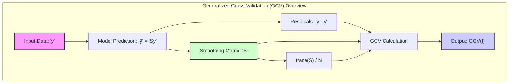
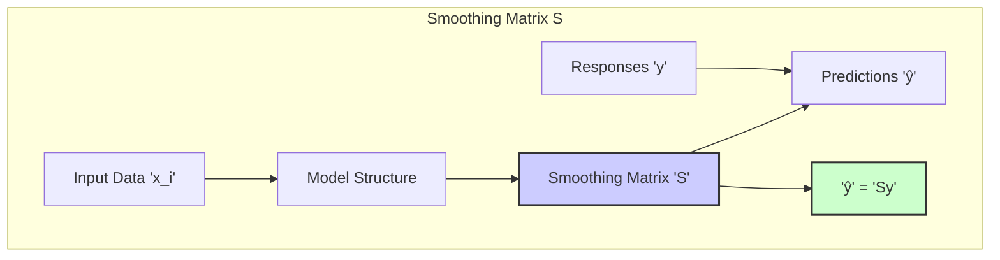
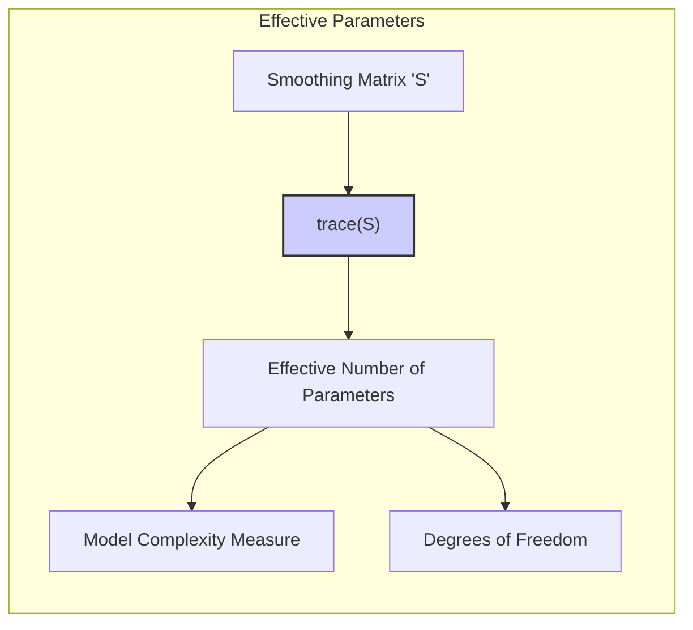
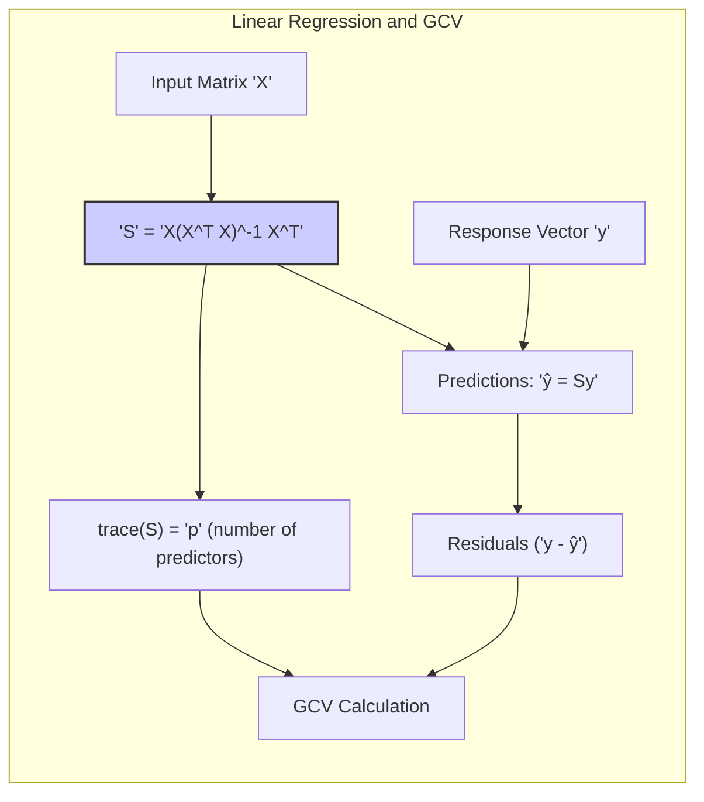
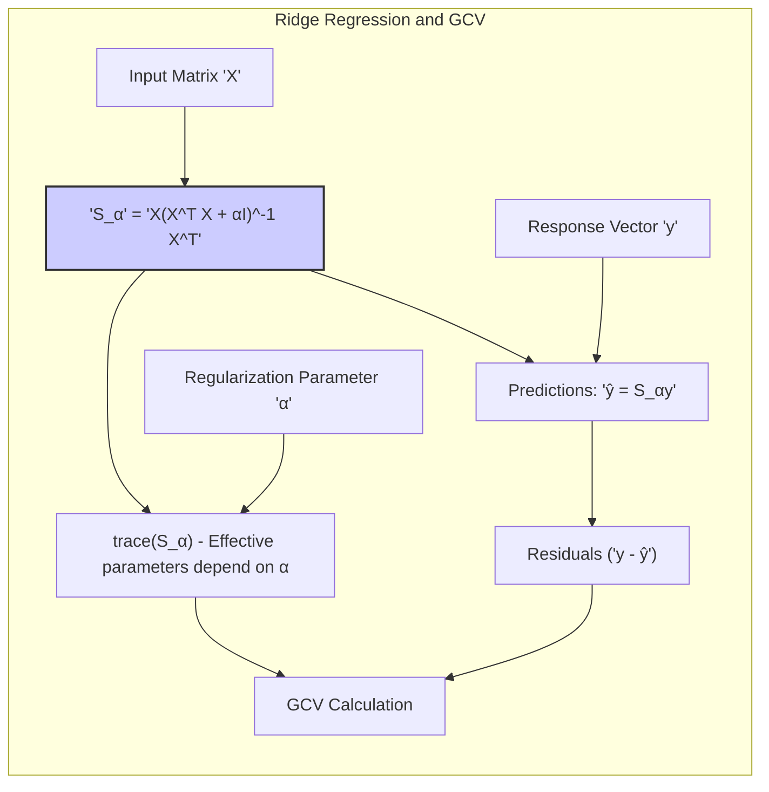
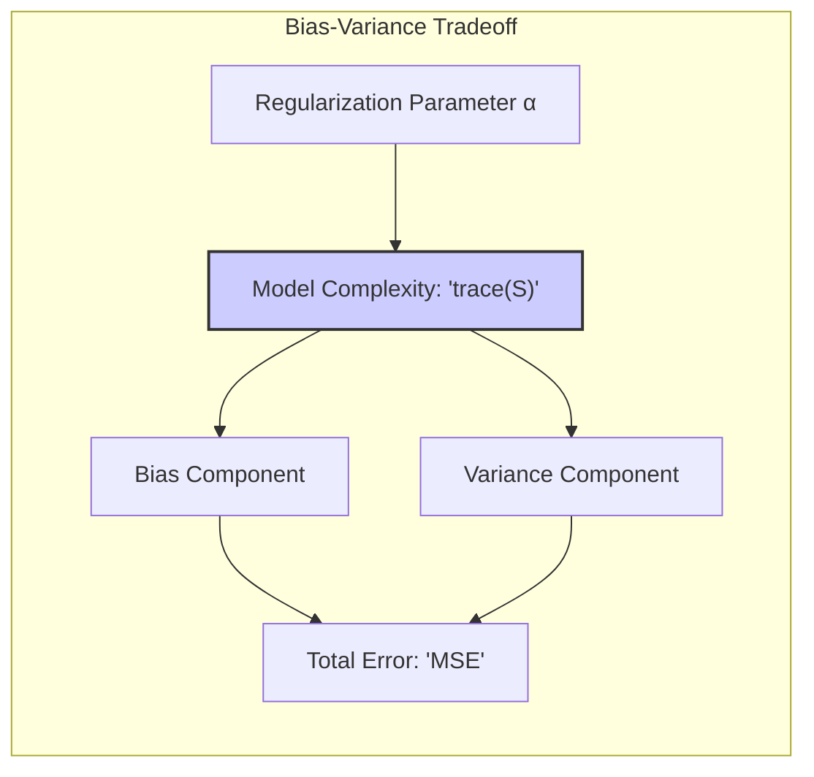

## Effective Parameters in Generalized Cross-Validation (GCV)



### Introdução
Este capítulo aborda a importância de avaliar o desempenho de modelos estatísticos e como selecionar o modelo mais adequado para um determinado problema. Em particular, o foco é no **Generalized Cross-Validation (GCV)** como um método para estimar o erro de predição, principalmente em modelos lineares. O objetivo principal é entender como o conceito de **effective number of parameters** surge no contexto do GCV, derivando uma formulação para o cálculo do erro de predição em função da complexidade do modelo [^7.1]. Além disso, exploramos o conceito de **optimism** do erro de treino e como o GCV busca mitigar esse problema [^7.4].

### Conceitos Fundamentais
**Conceito 1: Generalized Cross-Validation (GCV)**
O GCV é uma técnica que estima o erro de predição de um modelo através de uma aproximação do leave-one-out cross-validation (LOOCV) para modelos lineares. Em vez de refazer o modelo N vezes (onde N é o número de observações), como no LOOCV, o GCV usa uma única matriz 'S' para calcular os resíduos. Matematicamente, para um modelo linear onde ŷ = Sy, o erro de predição no GCV é dado por:
$$
GCV(f) = \frac{1}{N} \sum_{i=1}^{N} \left( \frac{y_i - \hat{y}_i}{1 - \text{trace}(S)/N} \right)^2
$$
onde $y_i$ são as observações, $\hat{y}_i$ são as predições, 'S' é a matriz de "smoothing" que define a relação entre $y$ e $\hat{y}$ e $trace(S)$ é a soma dos elementos da diagonal principal de S, também conhecido como **effective degrees of freedom** [^7.10].

> 💡 **Exemplo Numérico:**
> Suponha que temos um conjunto de dados com $N = 100$ observações e ajustamos um modelo linear tal que a matriz S tem um `trace(S) = 5`. Os valores de $y_i$ e $\hat{y}_i$ para as primeiras 5 observações são:
>
> | i   | $y_i$ | $\hat{y}_i$ |
> |-----|-------|-------------|
> | 1   | 2.5   | 2.3         |
> | 2   | 3.1   | 3.4         |
> | 3   | 4.0   | 3.8         |
> | 4   | 2.8   | 3.0         |
> | 5   | 3.5   | 3.3         |
>
> O erro GCV para essas observações é calculado como:
>  ```python
>  import numpy as np
>
>  y = np.array([2.5, 3.1, 4.0, 2.8, 3.5])
>  y_hat = np.array([2.3, 3.4, 3.8, 3.0, 3.3])
>  N = 100
>  trace_S = 5
>  gcv_values = ((y - y_hat) / (1 - trace_S/N))**2
>  gcv_mean = np.mean(gcv_values)
>  print(f"GCV para as primeiras 5 observações: {gcv_values}")
>  print(f"Média do GCV para as 5 primeiras observações: {gcv_mean}")
> ```
>
> O código Python calcula os valores de GCV para as primeiras 5 observações e a média desses valores.
>
> Os resíduos ajustados $(y_i - \hat{y}_i)/(1 - \text{trace}(S)/N)$ são penalizados pelo termo $(1 - \text{trace}(S)/N)$, que cresce com o aumento do número efetivo de parâmetros.

**Lemma 1: Matriz de "Smoothing" S**
A matriz S, também conhecida como matriz de *hat*, é crucial na formulação do GCV. Se um modelo ajustado pode ser expresso como ŷ = Sy, onde y é o vetor de respostas, então a matriz S descreve como as respostas são "smoothed" pelo modelo.  A matriz S depende dos vetores de entrada xᵢ, mas não das respostas yᵢ [^7.6].
$$
\hat{y} = S y
$$
**Prova:**
A matriz S depende dos preditores e da estrutura do modelo, e é utilizada para prever os valores de y, como mostrado em [^7.3.1].
$\blacksquare$



**Corolário 1: Relação entre o Resíduo e a Matriz S**
Em modelos lineares, é possível expressar o resíduo do modelo em termos dos elementos da matriz S.  Seja $\hat{y}_i$ a predição na i-ésima observação, então o resíduo cruzado é:
$$
y_i - \hat{y}_{-i}(x_i) = \frac{y_i - \hat{y}_i}{1 - S_{ii}}
$$
onde $S_{ii}$ é o i-ésimo elemento da diagonal principal de S [^7.10].

> 💡 **Exemplo Numérico:**
> Considere a observação $i=1$ do exemplo anterior, com $y_1 = 2.5$ e $\hat{y}_1 = 2.3$. Suponha que o elemento diagonal correspondente da matriz S seja $S_{11} = 0.04$.
> O resíduo cruzado para esta observação é então:
> $$
> y_1 - \hat{y}_{-1}(x_1) = \frac{2.5 - 2.3}{1 - 0.04} = \frac{0.2}{0.96} \approx 0.208
> $$
> Este valor é o resíduo que teríamos se o modelo fosse ajustado sem utilizar a observação $i=1$. Este resíduo é então usado no cálculo do GCV.

**Conceito 2: Effective Number of Parameters**
Em GCV, o termo trace(S) é interpretado como o número efetivo de parâmetros do modelo, o que permite comparar modelos de diferentes complexidades. Essa métrica está relacionada com o número de graus de liberdade do modelo. Se S for uma projeção ortogonal numa base de M funções, então trace(S) = M [^7.6].



**Lemma 2: Número Efetivo de Parâmetros em Modelos Lineares**
Para modelos lineares, a soma dos elementos da diagonal principal da matriz S, trace(S), representa o número efetivo de parâmetros do modelo. Matematicamente, df(S) = trace(S) [^7.6].
**Prova:**
A expressão df(S) = trace(S) é diretamente derivada da definição de modelos lineares, onde a predição ŷ é uma combinação linear dos dados de entrada y, definida pela matriz S. Este resultado é fundamental para a compreensão da complexidade de um modelo linear, como indicado em [^7.6]. $\blacksquare$

> 💡 **Exemplo Numérico:**
> Imagine um modelo linear simples com dois preditores (além do intercepto). Se a matriz S for uma projeção ortogonal, então trace(S) = 3. Isso significa que o modelo tem três graus de liberdade. Em um modelo mais complexo, como um modelo polinomial de grau 5, trace(S) será maior (p.ex. 6). O GCV usa essa informação para ajustar a avaliação do erro.

**Conceito 3: Optimism do Erro de Treino**
O erro de treino (erro observado nos dados de treino) geralmente é otimista, pois o modelo se ajusta aos dados com os quais foi treinado. O GCV visa corrigir esse otimismo usando o effective number of parameters e os resíduos ajustados. A métrica de *optimism* do erro é dada por:
$$
op = Errin - err
$$
onde $Errin$ é o erro de predição da amostra e $err$ o erro de treino [^7.4].

> 💡 **Exemplo Numérico:**
> Considere um cenário onde o erro de treino de um modelo é de 0.5 e o erro de predição da amostra (obtido usando validação cruzada) é de 0.7. O otimismo do erro de treino seria:
> $$
> op = 0.7 - 0.5 = 0.2
> $$
> O GCV procura aproximar o erro de predição (0.7) usando o erro de treino (0.5) e o effective number of parameters para corrigir o otimismo.

> ⚠️ **Nota Importante**: O GCV aproxima o erro de predição corrigindo o erro de treino com um termo que depende da complexidade do modelo (trace(S)) [^7.10].
> ❗ **Ponto de Atenção**: A escolha de uma métrica adequada para medir o erro é crucial e pode depender do problema (regressão ou classificação).  Em classificação, pode-se usar o log-likelihood. [^7.2]
> ✔️ **Destaque**: Embora o GCV seja geralmente aplicado em modelos lineares, existem extensões para outros modelos [^7.1].

### Regressão Linear e Mínimos Quadrados para GCV


A Regressão Linear é um caso especial de modelos lineares onde a matriz S pode ser expressa explicitamente em termos das matrizes de input X. No contexto do GCV, para um modelo linear com ajuste por mínimos quadrados:
$$
\hat{y} = X(X^T X)^{-1}X^T y = S y
$$
Onde $S = X(X^T X)^{-1}X^T$,  onde X é a matriz de design, e y é o vetor de respostas. Nesse caso,  trace(S) = p, o número de preditores (parâmetros) em X.

**Lemma 3: GCV em Regressão Linear**
Para um modelo linear ajustado por mínimos quadrados, o erro GCV é expresso como:
$$
GCV(f) = \frac{1}{N} \sum_{i=1}^N \frac{(y_i - \hat{y}_i)^2}{(1-p/N)^2}
$$
onde p é o número de preditores (parâmetros) no modelo, ou seja, trace(S) = p [^7.10].
**Prova:**
A prova é direta, substituindo $trace(S) = p$ na fórmula geral do GCV.
$\blacksquare$

> 💡 **Exemplo Numérico:**
> Suponha que temos um modelo de regressão linear com $p=4$ preditores (incluindo o intercepto) e $N=100$ observações. O erro GCV é calculado como:
> $$
> GCV(f) = \frac{1}{100} \sum_{i=1}^{100} \frac{(y_i - \hat{y}_i)^2}{(1-4/100)^2}
> $$
> A penalização no denominador $(1-4/100)^2 = (0.96)^2 = 0.9216$.  O erro quadrático médio dos resíduos é inflacionado pelo fator $1/0.9216 \approx 1.085$, corrigindo o erro de treino otimista.
>
> Se o erro de treino fosse $\frac{1}{N} \sum_{i=1}^{N} (y_i - \hat{y}_i)^2 = 0.6$, o GCV seria $0.6 * 1.085 = 0.651$.

**Corolário 2: GCV como Correção do Erro de Treino**
O GCV pode ser visto como uma correção do erro de treino, penalizando modelos com maior número de parâmetros.  A parte  $\frac{1}{(1-p/N)^2}$ age como um fator de penalização que aumenta à medida que a complexidade do modelo (p) se aproxima do tamanho da amostra (N).
*Limitações da Regressão Linear para Classificação e GCV:*
- Em problemas de classificação, regressão linear de indicadores pode levar a valores fora do intervalo [0,1] [^4.2].
- O GCV assume resíduos Gaussianos, o que pode não ser realista em alguns contextos [^7.2].
- O GCV é uma aproximação, não sendo um substituto exato para o LOOCV [^7.10].

### Métodos de Seleção de Variáveis e Regularização em GCV
Quando a regularização é aplicada em modelos lineares, o cálculo do effective number of parameters muda,  afetando o GCV. Por exemplo, em *ridge regression*:
$$
\hat{y} = X(X^T X + \alpha I)^{-1} X^T y = S_\alpha y
$$
onde $S_\alpha$ é a matriz de *smoothing* em ridge regression e $\alpha$ é o parâmetro de regularização. O trace de $S_\alpha$, usado no GCV, representa o número efetivo de parâmetros do modelo regularizado, que será menor que o número de parâmetros originais quando $\alpha>0$ [^7.6].



**Lemma 4: Regularização em GCV**
Com regularização, a matriz $S$ não é mais uma projeção ortogonal, e o número efetivo de parâmetros, trace(S), é um valor que depende de $\alpha$ e, geralmente, é menor que o número de parâmetros originais [^7.3].
$$df(\alpha) = trace(X(X^TX + \alpha I)^{-1} X^T)$$
**Prova:**
A prova segue diretamente das propriedades da matriz $S$ em regressão regularizada onde $S$ não é mais uma projeção ortogonal [^7.3]. $\blacksquare$

> 💡 **Exemplo Numérico:**
>
> Considere um modelo com $p=10$ preditores. Em regressão linear sem regularização, $trace(S) = p = 10$. Em ridge regression, o trace(S) é uma função de $\alpha$.
>
> Para um valor de $\alpha = 0.1$, suponha que o `trace(S) = 6` calculado seja $df(0.1) = trace(X(X^TX + 0.1I)^{-1} X^T) = 6$. Para um valor de $\alpha = 1$, suponha que  `trace(S) = 3`. Note que $trace(S) < 10$.
>
> O GCV em ridge regression penaliza menos o erro de treino quando $\alpha$ aumenta. Isso ocorre pois a regularização reduz a complexidade do modelo.
> ```python
> import numpy as np
> from sklearn.linear_model import Ridge
> from sklearn.datasets import make_regression
>
> X, y = make_regression(n_samples=100, n_features=10, random_state=42)
>
> alpha_values = [0.1, 1.0, 10.0]
>
> for alpha in alpha_values:
>    ridge = Ridge(alpha=alpha, fit_intercept=False)
>    ridge.fit(X,y)
>    S = X @ np.linalg.inv(X.T @ X + alpha * np.eye(X.shape[1])) @ X.T
>    effective_params = np.trace(S)
>    print(f"Alpha: {alpha}, Effective Parameters: {effective_params:.2f}")
> ```
> Este código Python demonstra como o effective number of parameters muda com o parâmetro de regularização $\alpha$.

**Corolário 3: Impacto da Regularização no GCV**
A regularização impacta o cálculo do GCV ao reduzir o número efetivo de parâmetros, reduzindo assim a complexidade do modelo e penalizando modelos mais complexos no processo de ajuste [^7.3].
> ⚠️ **Ponto Crucial**: A escolha de $\alpha$ pode ser feita minimizando o erro GCV, criando um processo de seleção de parâmetros [^7.6].
### Separating Hyperplanes e GCV
O conceito de hiperplanos separadores pode ser usado em classificação através de modelos lineares. GCV, embora concebido primariamente para regressão, pode ser aplicado para avaliar o desempenho de modelos de classificação linear. Os detalhes da aplicação dependem da função de custo escolhida para avaliação do modelo, que se adapta a outras métricas como *log-likelihood* em modelos de regressão logística [^7.2].

### Pergunta Teórica Avançada: Qual a relação entre o effective number of parameters e o viés e variância em modelos lineares regularizados como a ridge regression?
**Resposta:**
Em modelos lineares regularizados, como a *ridge regression*, o effective number of parameters é uma medida de complexidade do modelo que influencia o viés e a variância. Regularizar um modelo adiciona viés às estimativas dos parâmetros, mas reduz a variância. O GCV busca um balanço entre viés e variância através da otimização do effective number of parameters. O aumento do parâmetro de regularização $\alpha$ leva a uma diminuição no effective number of parameters, reduzindo a variância do modelo ao custo de aumentar o viés.

**Lemma 5: Relação entre effective number of parameters e viés e variância**
O effective number of parameters, trace(S), controla a complexidade do modelo. Reduzir trace(S), através da regularização, implica um aumento no viés e uma redução na variância.
$$Err(x_0) = \sigma^2 + \text{Bias}^2(f(x_0)) + \text{Var}(f(x_0))$$

**Prova:**
A prova é baseada na análise da decomposição de viés e variância, onde a complexidade do modelo controla o balanço entre as duas componentes [^7.3]. $\blacksquare$

**Corolário 4: Balanço Bias-Variância no GCV**
O objetivo do GCV é encontrar o valor ideal de trace(S) que minimiza o erro total, balanceando viés e variância. A complexidade do modelo é controlada indiretamente através da escolha do parâmetro de regularização (ex: $\alpha$), que afeta trace(S) [^7.3.1].
> ⚠️ **Ponto Crucial**: Modelos com alto viés (como modelos muito simples ou excessivamente regularizados) tendem a subestimar o erro real, enquanto modelos com alta variância (como modelos muito complexos) tendem a sobreajustar o ruído nos dados de treinamento [^7.2].

> 💡 **Exemplo Numérico:**
>
> Vamos supor que para um dado conjunto de dados, testamos três modelos de ridge regression com diferentes valores de $\alpha$: $\alpha_1 = 0.01$, $\alpha_2 = 1$ e $\alpha_3 = 10$. Após o treinamento e avaliação, obtemos os seguintes resultados:
>
> | Modelo       | $\alpha$ | Effective Parameters (trace(S)) | Viés² | Variância | MSE (Erro Médio Quadrático) |
> |--------------|----------|---------------------------------|-------|-----------|-----------------------------|
> | Ridge 1    | 0.01     | 9.5                             | 0.05  | 0.20      | 0.25                        |
> | Ridge 2    | 1        | 6                               | 0.15  | 0.15      | 0.30                        |
> | Ridge 3    | 10       | 2                               | 0.30  | 0.10      | 0.40                        |
>
> O modelo com $\alpha = 0.01$ tem o menor viés, mas a maior variância. O modelo com $\alpha = 10$ tem o maior viés, mas a menor variância. O modelo com $\alpha = 1$ oferece um bom balanço entre viés e variância, com o menor erro quadrático médio total.  O GCV tenderia a escolher o modelo com $\alpha=1$ neste caso.

### Conclusão
O Generalized Cross-Validation (GCV) é uma ferramenta útil para estimar o erro de predição em modelos lineares. Ele corrige o otimismo do erro de treino, usando o conceito de effective number of parameters para controlar a complexidade do modelo e equilibrar viés e variância. Ao aproximar o leave-one-out cross-validation de maneira eficiente, o GCV oferece uma alternativa computacionalmente viável para modelos complexos, como os regularizados. Embora tenha limitações, como a pressuposição de resíduos Gaussianos e o foco em modelos lineares, o GCV é uma ferramenta valiosa na seleção de modelos.
<!-- END SECTION -->
### Footnotes
[^7.1]: *“In this chapter we describe and illustrate the key methods for performance assessment, and show how they are used to select models. We begin the chapter with a discussion of the interplay between bias, variance and model complexity.”* *(Trecho de Model Assessment and Selection)*
[^7.2]: *“The story is similar for a qualitative or categorical response G taking one of K values in a set G, labeled for convenience as 1, 2, ..., K. Typically we model the probabilities pk(X) = Pr(G = k|X) (or some monotone transformations fr(X)), and then Ĝ(X) = arg maxk Îk(X). In some cases, such as 1-nearest neighbor classification (Chapters 2 and 13) we produce G(X) directly. Typical loss functions are”* *(Trecho de Model Assessment and Selection)*
[^7.3]: *“As in Chapter 2, if we assume that Y = f(X) + ε where E(ε) = 0 and Var(ε) = σε, we can derive an expression for the expected prediction error of a regression fit f(X) at an input point X = x0, using squared-error loss:”* *(Trecho de Model Assessment and Selection)*
[^7.3.1]: *“The test error Err(x0) for a ridge regression fit fa(xo) is identical in form to (7.11), except the linear weights in the variance term are different: h(x) = X(XTX + αI)-1x0. The bias term will also be different.”* *(Trecho de Model Assessment and Selection)*
[^7.4]: *“The difference between Errin and the training error err: op = Errin – err.”* *(Trecho de Model Assessment and Selection)*
[^7.6]: *“The concept of "number of parameters" can be generalized, especially to models where regularization is used in the fitting. Suppose we stack the outcomes Y1, Y2,..., yn into a vector y, and similarly for the predictions ŷ. Then a linear fitting method is one for which we can write ŷ = Sy,”* *(Trecho de Model Assessment and Selection)*
[^7.10]: *“Generalized cross-validation provides a convenient approximation to leave-one out cross-validation, for linear fitting under squared-error loss. As defined in Section 7.6, a linear fitting method is one for which we can write ŷ = Sy.”* *(Trecho de Model Assessment and Selection)*
[^4.2]: *“The loss function for measuring errors between Y and f(X) is denoted by L(Y, f(X)). Typical choices are”* *(Trecho de Model Assessment and Selection)*
[^7.1]: *“In this chapter we describe a number of methods for estimating the expected test error for a model. Typically our model will have a tuning parameter or parameters a and so we can write our predictions as fa(x). The tuning parameter varies the complexity of our model, and we wish to find the value of a that minimizes error, that is, produces the minimum of the average test error curve in Figure 7.1. Having said this, for brevity we will often suppress the dependence of f(x) on a.”* *(Trecho de Model Assessment and Selection)*
<!-- END DOCUMENT -->
