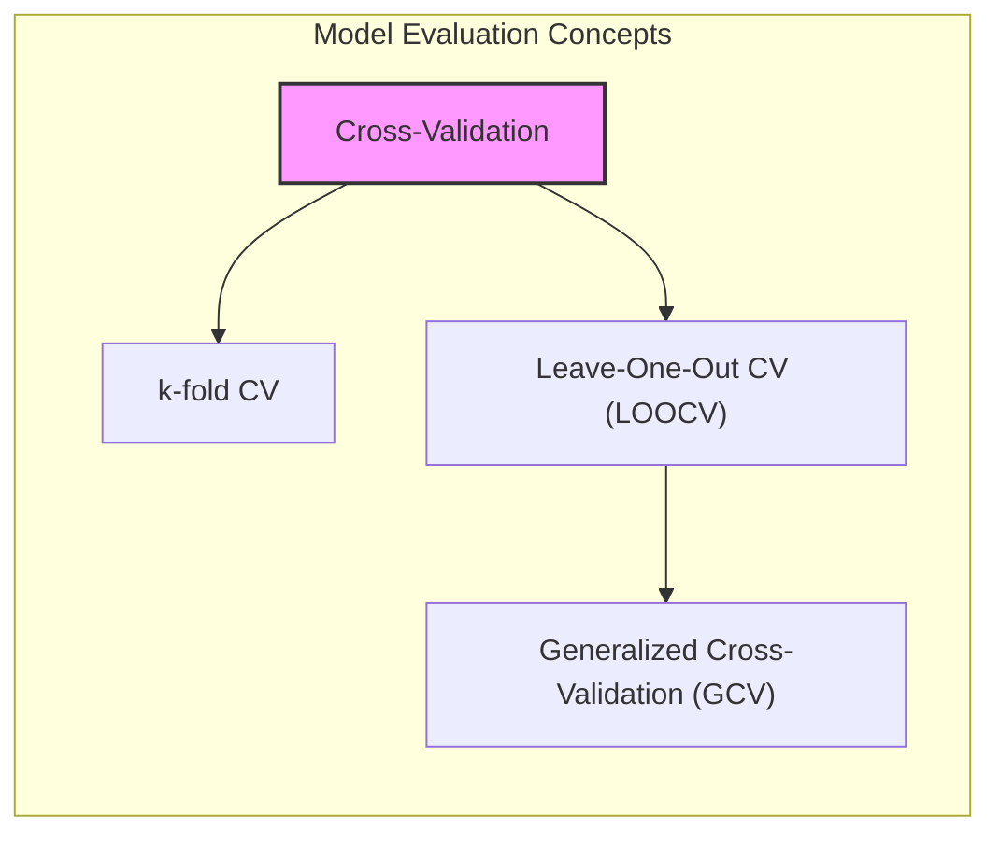
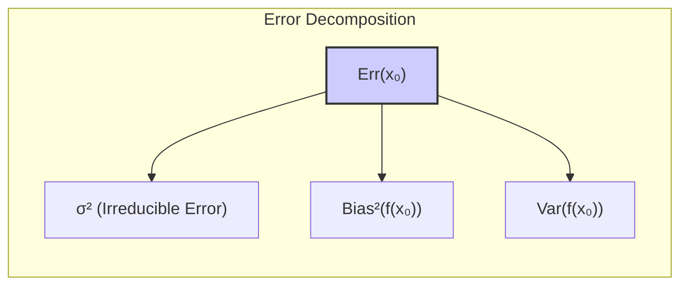
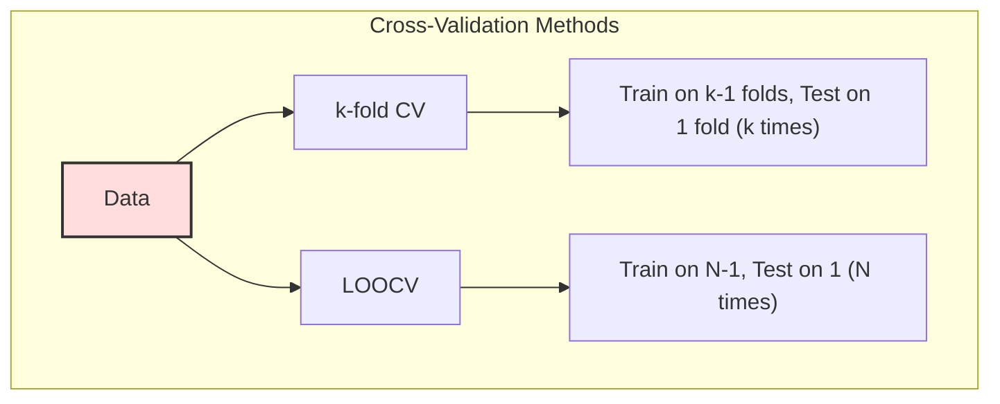
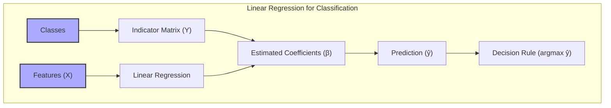
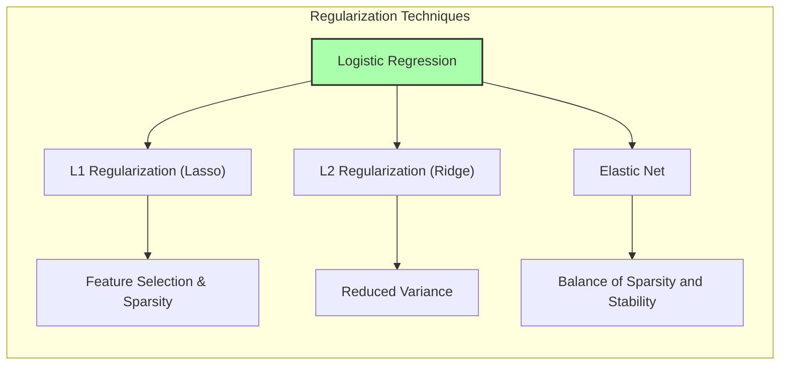
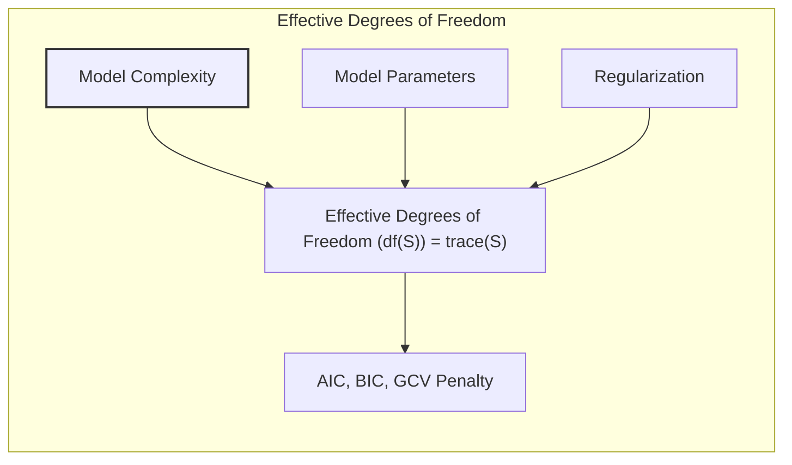

## Generalized Cross-Validation (GCV) para Seleção e Avaliação de Modelos



### Introdução

A avaliação e seleção de modelos estatísticos e de machine learning são etapas cruciais no processo de análise de dados. A capacidade de um modelo em generalizar para dados não vistos é o principal objetivo, e para tal, é fundamental estimar o erro de predição com precisão [^7.1]. Este capítulo explora as técnicas para avaliação de desempenho de modelos, com ênfase na Generalized Cross-Validation (GCV). A GCV oferece uma alternativa computacionalmente eficiente ao leave-one-out cross-validation (LOOCV), abordando o problema de estimar o erro de predição com menor custo computacional [^7.10]. Ao longo do capítulo, são apresentadas as bases teóricas e matemáticas para a compreensão da GCV, sua relação com outras técnicas, e seu papel na mitigação do tradeoff entre viés e variância [^7.2].

### Conceitos Fundamentais

**Conceito 1: Erro de Generalização e o Tradeoff Viés-Variância**

O desempenho de um modelo é usualmente avaliado pela sua capacidade de generalizar, isto é, de produzir resultados precisos em dados não utilizados no treinamento. O erro de generalização, também conhecido como erro de teste, representa a discrepância entre as previsões do modelo e os valores reais em um conjunto de dados independente [^7.2]. O **tradeoff viés-variância** é fundamental para entender a complexidade da modelagem. Modelos com alta complexidade tendem a se ajustar perfeitamente aos dados de treinamento, reduzindo o viés, mas aumentam a variância, tornando-os suscetíveis a ruídos e com baixa capacidade de generalização. Por outro lado, modelos menos complexos apresentam alto viés e baixa variância, resultando em previsões consistentemente imprecisas. Encontrar um equilíbrio é crucial para a construção de modelos eficazes [^7.2].
> ⚠️ **Nota Importante:** A complexidade do modelo influencia diretamente o balanço entre viés e variância. **Referência ao tópico [^7.2]**.

**Lemma 1:** A decomposição do erro de predição esperado em termos de viés e variância pode ser expressa como:

$$Err(x_0) = \sigma^2 + Bias^2(f(x_0)) + Var(f(x_0))$$

onde:

*   $Err(x_0)$ é o erro de predição esperado no ponto $x_0$.
*   $\sigma^2$ é a variância do ruído nos dados.
*   $Bias^2(f(x_0))$ é o viés ao quadrado, medindo o quanto a média das predições difere do valor verdadeiro.
*   $Var(f(x_0))$ é a variância, medindo a variabilidade das predições ao redor da sua média.

Este lemma detalha a natureza do erro de predição como uma soma de um erro irredutível (o ruído), o viés do modelo e a variância das predições, ilustrando como o tradeoff entre viés e variância é inerente à modelagem [^7.3]. $\blacksquare$



> 💡 **Exemplo Numérico:** Suponha que temos um modelo que tenta prever a altura de uma planta com base em sua idade.
>
> *   **Modelo Simples (Baixa Complexidade):** Um modelo linear simples, como $altura = 2 \times idade + 5$, pode ter um alto viés porque não captura a curvatura do crescimento da planta ao longo do tempo. As previsões podem estar consistentemente abaixo ou acima da altura real para algumas faixas de idade. No entanto, a variância seria baixa, pois o modelo é simples e as previsões não variariam muito mesmo com diferentes conjuntos de dados de treinamento.
>
> *   **Modelo Complexo (Alta Complexidade):** Um modelo polinomial de alta ordem, como $altura = 0.1 \times idade^3 - 1.5 \times idade^2 + 8 \times idade + 2$, poderia se ajustar bem aos dados de treinamento, com um viés baixo. Contudo, este modelo seria altamente sensível a ruídos nos dados e resultaria em previsões muito diferentes com novos conjuntos de dados, indicando uma alta variância.
>
>   Podemos ilustrar isso com uma tabela onde o Erro(x₀) é calculado em um ponto de teste específico, por exemplo, idade = 5:
>
> | Modelo          | $\sigma^2$ (Ruído) | $Bias^2(f(x_0))$ | $Var(f(x_0))$ | $Err(x_0)$ |
> | --------------- | ------------------ | ---------------- | ------------- | ---------- |
> | Linear          |        1          |         9       |        1       |     11     |
> | Polinomial      |        1          |         1       |        9       |     11     |
>
>   Aqui, $\sigma^2$ representa o ruído inerente aos dados (fixado em 1). O modelo linear tem um bias alto (9) e uma variância baixa (1), e o modelo polinomial o inverso, resultando no mesmo erro de predição total. O objetivo ao escolher o modelo ideal é encontrar um equilíbrio entre viés e variância que minimize $Err(x_0)$.

**Conceito 2: Cross-Validation (CV)**

A **cross-validation** (CV) é uma técnica para estimar o erro de generalização dividindo os dados em $K$ partes (folds). O modelo é treinado em $K-1$ partes, e a performance é avaliada na parte restante. Este processo é repetido $K$ vezes, cada vez usando uma parte diferente como conjunto de teste. A média dos erros obtidos em cada parte constitui a estimativa do erro de generalização. O **k-fold cross-validation** (k-fold CV), comumente usando $K = 5$ ou $K = 10$, é uma abordagem equilibrada que reduz o viés da estimação ao utilizar quase todos os dados para treino e tem variância menor que o leave-one-out CV. O **leave-one-out cross-validation** (LOOCV), com $K=N$, usa cada observação como um conjunto de teste em cada iteração, resultando em um estimador quase não enviesado, porém com alta variância e alto custo computacional [^7.10].
> ❗ **Ponto de Atenção:** Leave-one-out CV tem alta variância devido a similaridade entre os conjuntos de treinamento. **Conforme indicado em [^7.10]**.



> 💡 **Exemplo Numérico:** Imagine que temos um conjunto de dados com 100 amostras.
>
> *   **K-fold CV (K=5):** Dividimos as amostras em 5 grupos de 20. Em cada iteração, usamos 4 grupos (80 amostras) para treinar o modelo e o grupo restante (20 amostras) para avaliar o desempenho. Repetimos isso 5 vezes, cada vez usando um grupo diferente para avaliação. A média dos erros de predição dessas 5 iterações nos dá uma estimativa do erro de generalização.
>
> *   **LOOCV:** Usaríamos 99 amostras para treinar e 1 para testar. Repetimos o processo 100 vezes, cada vez com uma amostra diferente para teste. A média dos erros de predição dessas 100 iterações nos daria a estimativa do erro de generalização. LOOCV fornece uma estimativa menos enviesada, mas com alta variância, pois os modelos de treinamento são muito semelhantes em cada iteração. K-fold CV é uma alternativa computacionalmente mais eficiente, apesar de possuir um viés maior do que LOOCV.

**Corolário 1:** As abordagens de cross-validation podem ser interpretadas como métodos para obter estimativas de $Err$, o erro de predição esperado, que é mais tratável estatisticamente que $Err_T$, o erro condicional ao conjunto de treinamento $T$. A cross-validation estima o erro de predição sobre um novo conjunto de dados amostrado da mesma distribuição dos dados de treino, mas o resultado não depende do conjunto de treinamento específico utilizado, o que evita os problemas causados pelo overfitting. **Baseado no tópico [^7.10]**.

**Conceito 3: Generalized Cross-Validation (GCV)**

A **Generalized Cross-Validation (GCV)** é uma aproximação para o LOOCV, com a vantagem de ser computacionalmente mais eficiente. A GCV é particularmente útil em modelos lineares, onde o cálculo do traço de uma matriz é muito menos custoso que rodar o modelo de treino N vezes no caso de LOOCV [^7.10]. A GCV busca estimar a média do erro de predição com menor custo computacional do que o LOOCV, ao aproximar a média da soma dos erros quadráticos dos resíduos.

### Regressão Linear e Mínimos Quadrados para Classificação


A **regressão linear** aplicada a uma matriz de indicadores pode ser usada para fins de classificação. Neste método, cada classe é representada por uma coluna na matriz de indicadores, com 1 indicando a pertinência de uma observação à classe e 0 caso contrário [^7.2]. Os coeficientes de regressão são estimados usando o método dos mínimos quadrados, gerando uma função que prediz a pertinência de uma observação a cada classe. A regra de decisão é então definida pela classe com a maior predição [^7.2].

**Lemma 2:** Dada a matriz de indicadores $Y$ com dimensões $N \times K$, onde $N$ é o número de observações e $K$ é o número de classes, a aplicação da regressão linear com mínimos quadrados pode ser vista como uma projeção dos dados em um espaço de menor dimensão, onde as classes são representadas por vetores ortogonais. A fronteira de decisão emerge como um hiperplano no espaço de entrada original. **Baseado em [^7.2]**. $\blacksquare$

> 💡 **Exemplo Numérico:** Considere um problema de classificação com três classes (A, B, e C) e quatro observações. Podemos criar uma matriz de indicadores $Y$ como:
>
> ```
>      A   B   C
> obs1  1   0   0
> obs2  0   1   0
> obs3  0   0   1
> obs4  1   0   0
> ```
>
> Onde cada coluna representa uma classe, e um valor 1 indica que a observação pertence àquela classe. Se tivermos uma matriz de características $X$ (por exemplo, contendo duas variáveis preditoras para cada observação) e aplicarmos a regressão linear para estimar os coeficientes $\beta$, teremos uma função preditiva para cada classe.
>
> A matriz de características poderia ser:
>
> ```
>      x1   x2
> obs1  2   3
> obs2  1   4
> obs3  3   2
> obs4  2   4
> ```
>
>  Após aplicar o método dos mínimos quadrados, teríamos os coeficientes $\beta$ que definiriam um hiperplano para cada classe. Por exemplo, para a classe A, a previsão poderia ser $\hat{y}_A = \beta_{0A} + \beta_{1A}x_1 + \beta_{2A}x_2$. Para classificar uma nova observação, calcularíamos o valor predito para cada classe e a classe com maior valor predito seria a classificação final.

**Corolário 2:** A regressão linear de indicadores, embora simples, pode sofrer com o “masking problem” onde classes intermediárias são mascaradas por classes extremas, além de gerar probabilidades fora do intervalo [0,1], sendo menos adequada do que abordagens como a regressão logística em determinados cenários. **Conforme indicado em [^7.3] e [^7.4]**.

Embora a regressão linear de indicadores seja uma abordagem simples e computacionalmente eficiente, ela tem limitações. A regressão logística, por exemplo, pode oferecer estimativas mais estáveis de probabilidades, particularmente quando os dados são desbalanceados ou quando o objetivo principal é a estimação de probabilidades [^7.4].

### Métodos de Seleção de Variáveis e Regularização em Classificação



A seleção de variáveis e a regularização são técnicas para melhorar a performance e interpretabilidade dos modelos de classificação. A regularização impõe penalidades aos coeficientes do modelo, evitando o overfitting e promovendo modelos mais esparsos e estáveis. A **regularização L1** (Lasso) promove a esparsidade ao penalizar a soma dos valores absolutos dos coeficientes, enquanto a **regularização L2** (Ridge) penaliza a soma dos quadrados dos coeficientes, reduzindo a variância do modelo. A **Elastic Net** combina L1 e L2, permitindo controlar tanto a esparsidade quanto a estabilidade [^7.4.4, 7.5].

**Lemma 3:** A penalização L1 na regressão logística leva a coeficientes esparsos, ou seja, alguns coeficientes são exatamente zero, promovendo a seleção automática de variáveis e simplificando o modelo.

**Prova do Lemma 3:** A penalização L1 adiciona um termo $\lambda \sum_{j=1}^{p}|\beta_j|$ à função de custo da regressão logística. A não diferenciabilidade do valor absoluto em zero causa "cantos" na função de custo, o que leva os algoritmos de otimização a convergirem para soluções onde alguns $\beta_j$ são exatamente zero. $\blacksquare$

> 💡 **Exemplo Numérico:** Vamos considerar um modelo de regressão logística com três preditores: $x_1$, $x_2$ e $x_3$. A função de custo para a regressão logística é dada por:
>
> $$J(\beta) = -\frac{1}{N} \sum_{i=1}^{N} [y_i \log(\sigma(\beta^T x_i)) + (1-y_i) \log(1-\sigma(\beta^T x_i))]$$
>
> onde $\sigma$ é a função sigmóide, $y_i$ é a variável de resposta binária (0 ou 1), e $\beta$ são os coeficientes do modelo.
>
> *   **Regularização L1 (Lasso):** Adicionamos o termo $\lambda \sum_{j=1}^{3}|\beta_j|$ à função de custo:
>
> $$J_{L1}(\beta) = J(\beta) + \lambda (|\beta_1| + |\beta_2| + |\beta_3|)$$
>
>   O valor de $\lambda$ controla a força da regularização. Se $\lambda$ for alto, a penalidade força alguns coeficientes a serem exatamente zero, realizando seleção de variáveis. Por exemplo, se após aplicar a regularização com um $\lambda$ adequado, $\beta_2$ for zero, o preditor $x_2$ é excluído do modelo.
>
> *  **Regularização L2 (Ridge):**  Adicionamos o termo $\lambda \sum_{j=1}^{3}\beta_j^2$ à função de custo:
>
> $$J_{L2}(\beta) = J(\beta) + \lambda (\beta_1^2 + \beta_2^2 + \beta_3^2)$$
>
>   A regularização L2 não zera os coeficientes, mas reduz os seus valores, o que reduz a variância do modelo e o torna menos propenso a overfitting.
>
> *   **Elastic Net:** Combina as duas regularizações, penalizando tanto a soma dos valores absolutos quanto a soma dos quadrados dos coeficientes. A função de custo Elastic Net é dada por:
>
> $$J_{EN}(\beta) = J(\beta) + \lambda_1 \sum_{j=1}^{3}|\beta_j| + \lambda_2 \sum_{j=1}^{3}\beta_j^2$$
>
> A escolha de $\lambda_1$ e $\lambda_2$ permite um balanço entre esparsidade e estabilidade.

**Corolário 3:** Modelos com regularização L1 tendem a ser mais interpretáveis, pois apenas as variáveis mais relevantes permanecem no modelo, facilitando a compreensão do fenômeno modelado, como discutido em [^7.4.5].

É importante notar que a escolha entre regularização L1, L2 ou Elastic Net depende das características específicas do problema e dos objetivos da modelagem. Métodos de validação cruzada podem auxiliar na determinação do parâmetro de regularização ideal [^7.5.1, 7.5.2].

### Separating Hyperplanes e Perceptrons

A ideia de **hiperplanos separadores** emerge da busca por maximizar a margem entre classes, encontrando o hiperplano que melhor separa os dados. Em modelos de classificação linear, o hiperplano de decisão é determinado pelos parâmetros do modelo, e o objetivo é encontrar os parâmetros que maximizam a margem de separação [^7.5.2]. O **Perceptron** de Rosenblatt é um algoritmo iterativo que busca aprender um hiperplano separador, ajustando os pesos do modelo até que todos os dados de treinamento sejam classificados corretamente, desde que os dados sejam linearmente separáveis [^7.5.1].

### Pergunta Teórica Avançada

**Pergunta:** Como o conceito de *effective degrees of freedom* se relaciona com a penalização da complexidade de um modelo em métodos como AIC, BIC e GCV?

**Resposta:** O *effective degrees of freedom* ($df(S) = trace(S)$) quantifica a complexidade de um modelo linear, representando o número de parâmetros efetivamente utilizados pelo modelo. A matriz $S$ relaciona as predições com os dados observados, com o traço da matriz indicando quantos parâmetros livres são necessários para modelar os dados. Nos critérios de informação AIC e BIC, e também na GCV, a complexidade do modelo é penalizada com base nesse número de parâmetros efetivos. Nos critérios AIC/BIC, um termo linear é adicionado à função de custo para penalizar modelos mais complexos, enquanto que na GCV a penalidade é implicitamente considerada através do termo de correção 1/(1 - traço(S)/N). O *effective degrees of freedom* é uma medida que se torna particularmente útil quando há regularização, onde o número de parâmetros originais não corresponde à complexidade real do modelo [^7.6].



> 💡 **Exemplo Numérico:** Em um modelo linear de mínimos quadrados, a matriz $S$ é dada por $S = X(X^TX)^{-1}X^T$, onde $X$ é a matriz de design. O *effective degrees of freedom* é o traço dessa matriz, ou seja, a soma dos seus elementos da diagonal principal. Se tivermos 100 observações e 5 preditores, o número total de parâmetros é 6 (5 preditores + o intercepto). No entanto, se aplicarmos regularização, o *effective degrees of freedom* pode ser menor que 6.
>
>   Por exemplo, com 100 observações e 5 preditores, uma matriz $X$ poderia ser simulada em Python com:
>
> ```python
> import numpy as np
> from sklearn.linear_model import LinearRegression
>
> np.random.seed(42)
> X = np.random.rand(100, 5)
> y = np.random.rand(100)
>
> # Modelo de mínimos quadrados
> model = LinearRegression()
> model.fit(X, y)
>
> # Obtendo a matriz de projeção S
> XT = X.T
> S = X @ np.linalg.inv(XT @ X) @ XT
>
> # Calculando o traço de S (effective degrees of freedom)
> df = np.trace(S)
> print(f'Effective degrees of freedom (OLS): {df:.2f}')
>
>
> # Para um modelo Ridge, S muda, e o trace(S) também
> from sklearn.linear_model import Ridge
> alpha = 1 # Parâmetro de regularização
> ridge_model = Ridge(alpha=alpha)
> ridge_model.fit(X, y)
>
> # Calculando a matriz de projeção S para o modelo Ridge
> S_ridge = X @ np.linalg.inv(XT @ X + alpha * np.identity(X.shape[1])) @ XT
> df_ridge = np.trace(S_ridge)
> print(f'Effective degrees of freedom (Ridge): {df_ridge:.2f}')
>
> ```
>
> A saída do código mostra que para o modelo OLS, o effective degrees of freedom é aproximadamente igual ao número de parâmetros (6), enquanto para o modelo Ridge, o effective degrees of freedom é menor, ilustrando como a regularização reduz a complexidade do modelo, diminuindo o número de parâmetros efetivamente utilizados.

**Lemma 4:** O *effective degrees of freedom*  ($df(S)$) em um modelo linear, definido como o traço da matriz S ($trace(S)$), captura a quantidade de parâmetros efetivamente utilizados pelo modelo. A forma como o modelo utiliza os dados é que define a sua complexidade, e não necessariamente a quantidade original de parâmetros.
$\blacksquare$

**Corolário 4:** Em modelos com regularização, o número de parâmetros original pode ser muito maior que o *effective degrees of freedom*. A regularização impõe uma estrutura aos parâmetros do modelo, fazendo com que alguns sejam redundantes ou limitados. A penalização da complexidade deve ser feita com base na quantidade de parâmetros efetivamente utilizados, e não o número original de parâmetros. **Conforme indicado em [^7.6]**.

> ⚠️ **Ponto Crucial:**  A penalização da complexidade em critérios como AIC e BIC, e em GCV,  está fundamentada na noção de *effective degrees of freedom* e não apenas no número original de parâmetros. **Baseado em [^7.6]**.

### Conclusão

Este capítulo explorou as técnicas para avaliação de desempenho de modelos, com ênfase na Generalized Cross-Validation (GCV). Foi apresentado o tradeoff entre viés e variância, e o papel das técnicas de cross-validation, especialmente o LOOCV, na estimativa do erro de generalização. A GCV surgiu como uma alternativa computacionalmente eficiente ao LOOCV, oferecendo uma aproximação útil para modelos lineares. Métodos de seleção de variáveis e regularização, bem como os conceitos de hiperplanos separadores e perceptrons também foram brevemente discutidos. A GCV e os outros métodos de avaliação de modelos são ferramentas essenciais para a construção de modelos eficazes, capazes de generalizar bem em dados não vistos. As perguntas teóricas avançadas ao final de cada seção permitem avaliar a compreensão profunda dos conceitos teóricos-chave.
<!-- END DOCUMENT -->

### Footnotes

[^7.1]: "The generalization performance of a learning method relates to its prediction capability on independent test data. Assessment of this performance is extremely important in practice, since it guides the choice of learning method or model, and gives us a measure of the quality of the ultimately chosen model." *(Trecho de Model Assessment and Selection)*
[^7.2]: "Figure 7.1 illustrates the important issue in assessing the ability of a learning method to generalize. Consider first the case of a quantitative or interval scale response. We have a target variable Y, a vector of inputs X, and a prediction model f(X) that has been estimated from a training set T." *(Trecho de Model Assessment and Selection)*
[^7.3]: "In this chapter we describe and illustrate the key methods for performance assessment, and show how they are used to select models. We begin the chapter with a discussion of the interplay between bias, variance and model complexity." *(Trecho de Model Assessment and Selection)*
[^7.4]: "The story is similar for a qualitative or categorical response G taking one of K values in a set G, labeled for convenience as 1, 2, ..., K. Typically we model the probabilities pk(X) = Pr(G = k|X) (or some monotone transformations fr(X)), and then Ĝ(X) = arg maxk Îk(X). In some cases, such as 1-nearest neighbor classification (Chapters 2 and 13) we produce G(X) directly." *(Trecho de Model Assessment and Selection)*
[^7.4.1]: "Typical loss functions are I(G≠G(X)) (0-1 loss), L(G, P(X)) = -2 Σ (G=k) log pk(X) = -2 log(X) (-2 x log likelihood)." *(Trecho de Model Assessment and Selection)*
[^7.4.2]: "The quantity -2 × the log-likelihood is sometimes referred to as the deviance." *(Trecho de Model Assessment and Selection)*
[^7.4.3]: "Again, test error here is ErrT = E[L(G, Ĝ(X))|T], the population misclassification error of the classifier trained on T, and Err is the expected misclassification error." *(Trecho de Model Assessment and Selection)*
[^7.4.4]: "Training error is the sample analogue, for example, err = -2/N Σ log pg (Xi), the sample log-likelihood for the model." *(Trecho de Model Assessment and Selection)*
[^7.4.5]: "The log-likelihood can be used as a loss-function for general response densities, such as the Poisson, gamma, exponential, log-normal and others. If Pro(x) (Y) is the density of Y, indexed by a parameter 0(X) that depends on the predictor X, then L(Y,0(X)) = −2. log Pro(x) (Y)." *(Trecho de Model Assessment and Selection)*
[^7.5]: "The “-2” in the definition makes the log-likelihood loss for the Gaussian distribution match squared-error loss." *(Trecho de Model Assessment and Selection)*
[^7.5.1]: "For ease of exposition, for the remainder of this chapter we will use Y and f(X) to represent all of the above situations, since we focus mainly on the quantitative response (squared-error loss) setting. For the other situations, the appropriate translations are obvious." *(Trecho de Model Assessment and Selection)*
[^7.5.2]: "In this chapter we describe a number of methods for estimating the expected test error for a model. Typically our model will have a tuning parameter or parameters a and so we can write our predictions as fa(x). The tuning parameter varies the complexity of our model, and we wish to find the value of a that minimizes error, that is, produces the minimum of the average test error curve in Figure 7.1. Having said this, for brevity we will often suppress the dependence of f(x) on a." *(Trecho de Model Assessment and Selection)*
[^7.6]:  "It is important to note that there are in fact two separate goals that we might have in mind: Model selection: estimating the performance of different models in order to choose the best one. Model assessment: having chosen a final model, estimating its prediction error (generalization error) on new data." *(Trecho de Model Assessment and Selection)*
[^7.6.1]: "If we are in a data-rich situation, the best approach for both problems is to randomly divide the dataset into three parts: a training set, a validation set, and a test set." *(Trecho de Model Assessment and Selection)*
[^7.6.2]:  "The training set is used to fit the models; the validation set is used to estimate prediction error for model selection; the test set is used for assessment of the generalization error of the final chosen model. Ideally, the test set should be kept in a “vault,” and be brought out only at the end of the data analysis." *(Trecho de Model Assessment and Selection)*
[^7.6.3]: "Suppose instead that we use the test-set repeatedly, choosing the model with smallest test-set error. Then the test set error of the final chosen model will underestimate the true test error, sometimes substantially." *(Trecho de Model Assessment and Selection)*
[^7.6.4]:  "It is difficult to give a general rule on how to choose the number of observations in each of the three parts, as this depends on the signal-to-noise ratio in the data and the training sample size. A typical split might be 50% for training, and 25% each for validation and testing." *(Trecho de Model Assessment and Selection)*
[^7.6.5]: "The methods in this chapter are designed for situations where there is insufficient data to split it into three parts. Again it is too difficult to give a general rule on how much training data is enough; among other things, this depends on the signal-to-noise ratio of the underlying function, and the complexity of the models being fit to the data." *(Trecho de Model Assessment and Selection)*
[^7.7]: "As in Chapter 2, if we assume that Y = f(X) + ε where E(ε) = 0 and Var(ε) = σε, we can derive an expression for the expected prediction error of a regression fit f(X) at an input point X = x0, using squared-error loss: Err(xo) = E[(Y − f(xo))2|X = xo] = σ² + Bias² (f(xo)) + Var(f(xo)) = Irreducible Error + Bias² + Variance." *(Trecho de Model Assessment and Selection)*
[^7.7.1]: "The first term is the variance of the target around its true mean f(x0), and cannot be avoided no matter how well we estimate f(x0), unless σε = 0." *(Trecho de Model Assessment and Selection)*
[^7.7.2]:  "The second term is the squared bias, the amount by which the average of our estimate differs from the true mean; the last term is the variance; the expected squared deviation of f(x0) around its mean." *(Trecho de Model Assessment and Selection)*
[^7.7.3]: "Typically the more complex we make the model f, the lower the (squared) bias but the higher the variance." *(Trecho de Model Assessment and Selection)*
[^7.7.4]: "For the k-nearest-neighbor regression fit, these expressions have the simple form Err(xo) = E[(Y - fk(xo))2|X = xo] = σε + [f(xo) - (1/k)Σ f(xi)]² + σ²/k" *(Trecho de Model Assessment and Selection)*
[^7.7.5]: "Here we assume for simplicity that training inputs xi are fixed, and the randomness arises from the yi. The number of neighbors k is inversely related to the model complexity." *(Trecho de Model Assessment and Selection)*
[^7.7.6]:  "For small k, the estimate f(x) can potentially adapt itself better to the underlying f(x). As we increase k, the bias the squared difference between f(x0) and the average of f(x) at the k-nearest neighbors will typically increase, while the variance decreases." *(Trecho de Model Assessment and Selection)*
[^7.7.7]: "For a linear model fit fp(x) = xTß, where the parameter vector ß with p components is fit by least squares, we have Err(xo) = E[(Y - fp(xo))2|X = xo] = σε + [f(xo) – Efp(xo)]² + ||h(xo)||202." *(Trecho de Model Assessment and Selection)*
[^7.8]: "Here h(x0) = X(XTX)−1x0, the N-vector of linear weights that produce the fit fp(xo) = x0T(XTX)−1XTy, and hence Var[fp(xo)] = ||h(xo)||2σ2." *(Trecho de Model Assessment and Selection)*
[^7.8.1]: "While this variance changes with xo, its average (with xo taken to be each of the sample values xi) is (p/N)σ2, and hence 1/N Σ Err(x) = σε + 1/N Σ [f(xi) – Ef(xi)]² + p/N σ2, the in-sample error." *(Trecho de Model Assessment and Selection)*
[^7.8.2]: "Here model complexity is directly related to the number of parameters p. The test error Err(x0) for a ridge regression fit fa(x0) is identical in form to (7.11), except the linear weights in the variance term are different: h(x0) = X(XTX + αI)-1x0. The bias term will also be different." *(Trecho de Model Assessment and Selection)*
[^7.8.3]: "For a linear model family such as ridge regression, we can break down the bias more finely. Let β denote the parameters of the best-fitting linear approximation to f:  β = arg min E (f(X) – XTβ)2" *(Trecho de Model Assessment and Selection)*
[^7.8.4]: "Here the expectation is taken with respect to the distribution of the input variables X. Then we can write the average squared bias as Exo [f(x0) - Efa(x0)]2 = Exo [f