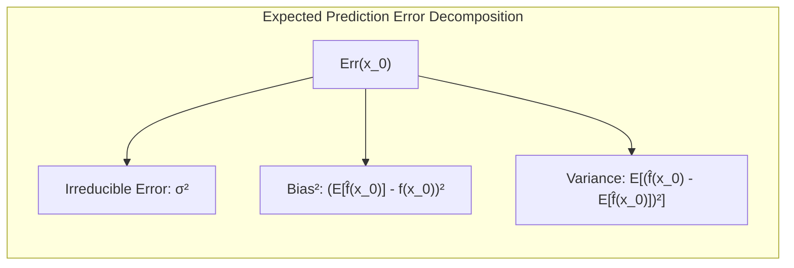
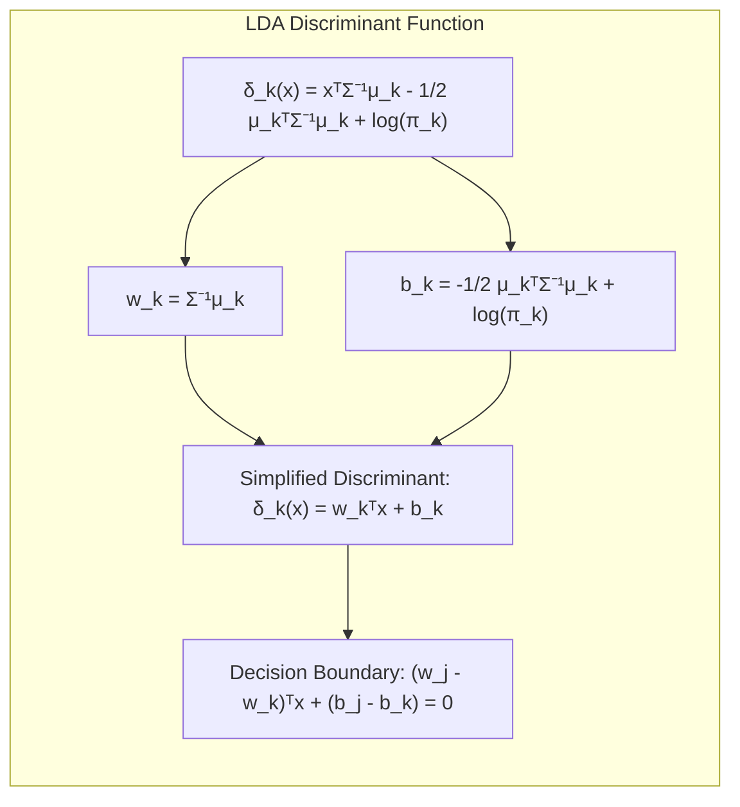
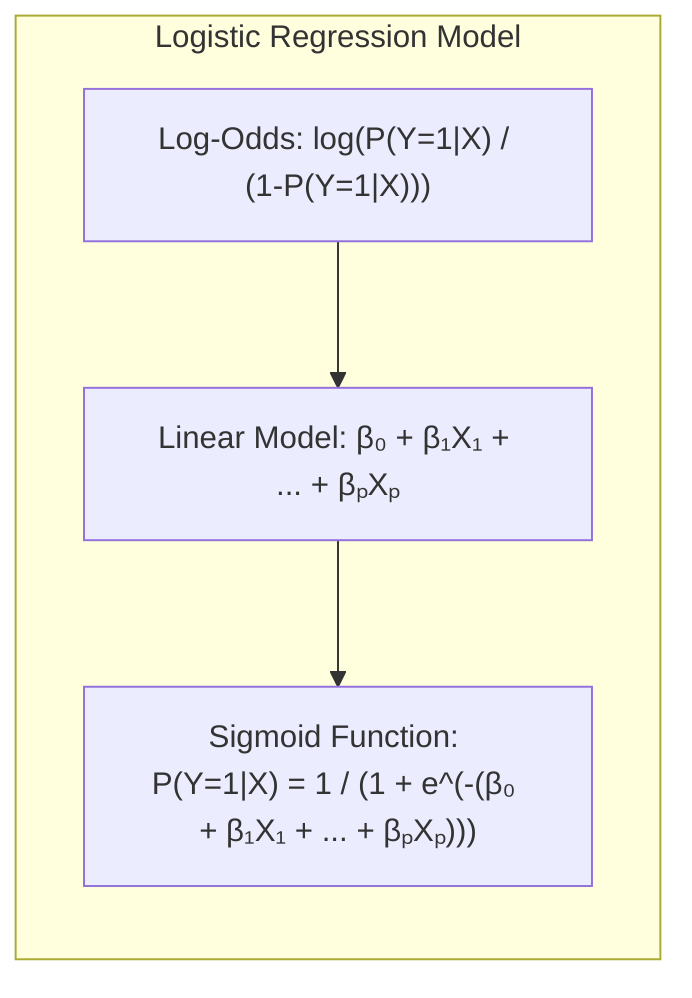
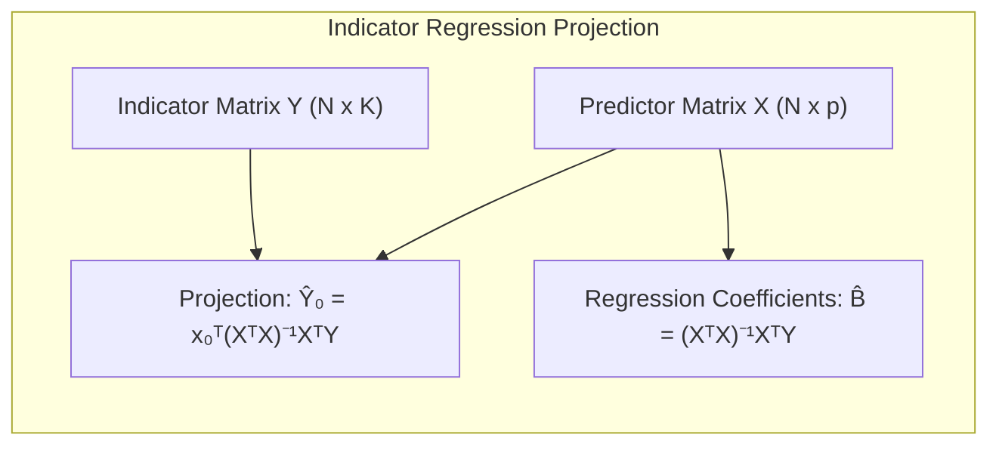
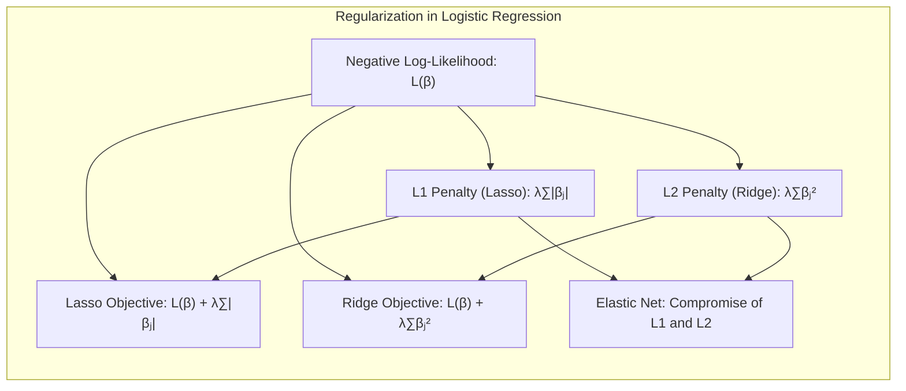
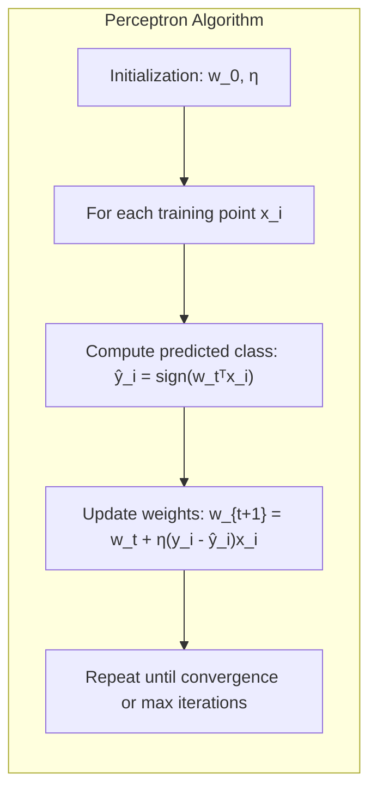

## Learning Curves e Validação Cruzada
<imagem: Mapa mental abrangente que conecta a complexidade do modelo, bias, variance, learning curves, diferentes abordagens de validação cruzada (k-fold, leave-one-out) e suas aplicações na avaliação e seleção de modelos. Inclua links para as definições de erro de treinamento, erro de teste e otimismo do erro.>

### Introdução
A avaliação do desempenho de um método de aprendizado é crucial para determinar sua capacidade de generalização, ou seja, sua eficácia ao lidar com dados não vistos. Este capítulo explora métodos para avaliar e selecionar modelos de aprendizado, com foco nas curvas de aprendizado e técnicas de validação cruzada. A compreensão da relação entre bias, variance e complexidade do modelo é fundamental para a avaliação do desempenho do aprendizado [^7.1]. Métodos de validação são necessários para estimar o quão bem um modelo generaliza para novos dados, ajudando na seleção do modelo mais adequado para um problema específico [^7.1].

### Conceitos Fundamentais

**Conceito 1:** O **problema de generalização** centra-se na habilidade de um modelo de aprendizado em realizar predições precisas em dados de teste independentes, que não foram utilizados durante o treinamento. A complexidade do modelo influencia diretamente o *trade-off* entre **bias** e **variance** [^7.2]. Um modelo com alta complexidade tende a ter baixo bias (ajusta-se bem aos dados de treinamento), mas alta variance (sensibilidade a pequenas mudanças nos dados de treinamento, levando a um mau desempenho em dados não vistos). Por outro lado, modelos com baixa complexidade tendem a ter alto bias (não capturam a complexidade dos dados), mas baixa variance (são mais estáveis). O objetivo é encontrar um ponto de equilíbrio que minimize o erro de generalização.

**Lemma 1:** O erro de previsão esperado pode ser decomposto em três componentes: ruído irredutível, bias ao quadrado e variance. Essa decomposição oferece uma compreensão sobre as fontes de erro de previsão. Especificamente, para um modelo de regressão com um ponto de entrada $x_0$, o erro esperado pode ser expresso como:
$$Err(x_0) = \sigma^2 + [Ef(x_0) - f(x_0)]^2 + E[f(x_0) - Ef(x_0)]^2$$
onde $\sigma^2$ representa a variância irredutível, $[Ef(x_0) - f(x_0)]^2$ o bias ao quadrado e $E[f(x_0) - Ef(x_0)]^2$ a variância [^7.3]. Esta decomposição formaliza o *trade-off* entre viés e variância. $\blacksquare$



> 💡 **Exemplo Numérico:** Considere um modelo de regressão linear tentando ajustar dados gerados por uma função quadrática com algum ruído.
>
> 1. **Cenário com Underfitting (Alto Bias, Baixa Variance):** Um modelo linear simples (reta) é usado para ajustar os dados. O modelo não consegue capturar a curvatura dos dados, resultando em alto bias.  A variância é baixa, pois o modelo não muda muito se os dados de treinamento forem ligeiramente modificados.  Suponha que, em um ponto $x_0$, o valor real $f(x_0) = 5$, a previsão média do modelo seja $Ef(x_0) = 3$. Logo, o bias ao quadrado é $(3-5)^2 = 4$. Se a variância for $E[f(x_0) - Ef(x_0)]^2 = 0.5$, e o ruído irredutível for $\sigma^2 = 0.1$, o erro esperado seria $Err(x_0) = 0.1 + 4 + 0.5 = 4.6$.
>
> 2. **Cenário com Overfitting (Baixo Bias, Alta Variance):** Um modelo de regressão polinomial de grau muito alto é utilizado. O modelo se ajusta perfeitamente aos dados de treinamento, resultando em baixo bias. No entanto, ele é muito sensível a pequenas mudanças nos dados, resultando em alta variância.  Suponha que, no ponto $x_0$, $f(x_0) = 5$, e a previsão média $Ef(x_0) = 4.9$. O bias ao quadrado é $(4.9-5)^2 = 0.01$.  A variância é alta, digamos $E[f(x_0) - Ef(x_0)]^2 = 3$, e o ruído irredutível é novamente $\sigma^2 = 0.1$.  O erro esperado é $Err(x_0) = 0.1 + 0.01 + 3 = 3.11$.
>
> 3. **Cenário Ideal (Equilíbrio):** Um modelo polinomial de grau adequado é usado, capturando a curvatura dos dados sem se ajustar ao ruído. O modelo tem baixo bias e baixa variância. Suponha que $Ef(x_0) = 4.95$, então o bias ao quadrado é $(4.95-5)^2 = 0.0025$. A variância é de $E[f(x_0) - Ef(x_0)]^2 = 0.3$, e o ruído é $\sigma^2 = 0.1$. O erro esperado é $Err(x_0) = 0.1 + 0.0025 + 0.3 = 0.4025$.
>
> Este exemplo ilustra como o trade-off entre bias e variância influencia o erro total do modelo.
> ```mermaid
> graph LR
>     A[Underfitting] --> B(Alto Bias);
>     A --> C(Baixa Variance);
>     D[Overfitting] --> E(Baixo Bias);
>     D --> F(Alta Variance);
>     G[Equilíbrio] --> H(Baixo Bias);
>     G --> I(Baixa Variance);
> ```

**Conceito 2:** A **Linear Discriminant Analysis (LDA)** é um método de classificação linear que assume que as classes seguem uma distribuição normal com mesma matriz de covariância, resultando em fronteiras de decisão lineares [^4.3]. A função discriminante linear, dada por $\delta_k(x) = x^T \Sigma^{-1} \mu_k - \frac{1}{2}\mu_k^T \Sigma^{-1}\mu_k + \log \pi_k$, permite classificar um ponto $x$ na classe $k$ que maximiza $\delta_k(x)$ [^4.3.1]. A LDA simplifica a análise de dados ao reduzir a dimensionalidade dos dados, utilizando projeções lineares [^4.3.2]. No entanto, suas suposições de normalidade e covariâncias iguais podem limitar seu desempenho em cenários mais complexos [^4.3.3].

**Corolário 1:** Em cenários onde as classes podem ser bem separadas por projeções lineares, a função discriminante da LDA pode ser simplificada para a forma $\delta_k(x) = w_k^T x + b_k$, onde $w_k = \Sigma^{-1} \mu_k$ e $b_k = - \frac{1}{2}\mu_k^T \Sigma^{-1}\mu_k + \log \pi_k$. O limite de decisão entre duas classes $j$ e $k$ é dado por $\{x \,|\, (w_j - w_k)^T x + (b_j - b_k) = 0 \}$, que representa um hiperplano linear. Esse corolário estabelece uma relação direta entre a forma projetada dos dados e as decisões de classe [^4.3.1].



> 💡 **Exemplo Numérico:** Considere um problema de classificação com duas classes e dois preditores.
>
>  Suponha que as médias das classes sejam $\mu_1 = [1, 1]^T$ e $\mu_2 = [3, 3]^T$, e a matriz de covariância comum seja $\Sigma = \begin{bmatrix} 1 & 0 \\ 0 & 1 \end{bmatrix}$. As probabilidades a priori das classes são $\pi_1 = \pi_2 = 0.5$.
>
>   1. **Calculando os vetores w:** $w_1 = \Sigma^{-1}\mu_1 = \begin{bmatrix} 1 & 0 \\ 0 & 1 \end{bmatrix} \begin{bmatrix} 1 \\ 1 \end{bmatrix} = \begin{bmatrix} 1 \\ 1 \end{bmatrix}$ e $w_2 = \Sigma^{-1}\mu_2 = \begin{bmatrix} 1 & 0 \\ 0 & 1 \end{bmatrix} \begin{bmatrix} 3 \\ 3 \end{bmatrix} = \begin{bmatrix} 3 \\ 3 \end{bmatrix}$.
>   2. **Calculando os bias b:** $b_1 = - \frac{1}{2} \mu_1^T \Sigma^{-1} \mu_1 + \log \pi_1 = - \frac{1}{2} \begin{bmatrix} 1 & 1 \end{bmatrix} \begin{bmatrix} 1 \\ 1 \end{bmatrix} + \log 0.5 = -1 - 0.693 = -1.693$ e $b_2 = - \frac{1}{2} \mu_2^T \Sigma^{-1} \mu_2 + \log \pi_2 = - \frac{1}{2} \begin{bmatrix} 3 & 3 \end{bmatrix} \begin{bmatrix} 3 \\ 3 \end{bmatrix} + \log 0.5 = -9 - 0.693 = -9.693$.
>   3. **Funções discriminantes:** $\delta_1(x) = \begin{bmatrix} 1 & 1 \end{bmatrix} \begin{bmatrix} x_1 \\ x_2 \end{bmatrix} - 1.693 = x_1 + x_2 - 1.693$ e $\delta_2(x) = \begin{bmatrix} 3 & 3 \end{bmatrix} \begin{bmatrix} x_1 \\ x_2 \end{bmatrix} - 9.693 = 3x_1 + 3x_2 - 9.693$.
>   4. **Fronteira de decisão:** A fronteira de decisão entre as classes 1 e 2 é dada por $\delta_1(x) = \delta_2(x)$, ou seja, $x_1 + x_2 - 1.693 = 3x_1 + 3x_2 - 9.693$, que simplifica para $2x_1 + 2x_2 = 8$, ou $x_1 + x_2 = 4$. Esta é a equação de uma reta no espaço dos preditores, que separa as duas classes.
>   Este exemplo mostra como a LDA utiliza as médias, covariância e probabilidades a priori para construir fronteiras de decisão lineares.

**Conceito 3:** A **Logistic Regression** modela a probabilidade de uma classe através de uma função sigmoide (ou logística) aplicada a uma combinação linear das entradas [^4.4]. O *log-odds* é modelado linearmente como:
$$ \log \frac{P(Y=1|X)}{1-P(Y=1|X)} = \beta_0 + \beta_1X_1 + \ldots + \beta_pX_p$$
[^4.4.1]
Os coeficientes são estimados através da maximização da verossimilhança [^4.4.2], o que envolve encontrar os parâmetros $\beta$ que maximizam a probabilidade dos dados observados. A regressão logística é mais flexível que a LDA, pois não requer suposições sobre a distribuição dos preditores [^4.4.3]. Os termos de regularização L1 e L2 podem ser adicionados para prevenir overfitting [^4.4.4] e para selecionar as variáveis mais importantes no modelo [^4.4.5].



> ⚠️ **Nota Importante:** A regressão logística fornece estimativas probabilísticas mais estáveis, especialmente em comparação com a regressão de indicadores, quando as probabilidades são o foco central da análise [^4.4.1].
> ❗ **Ponto de Atenção:** O desempenho da regressão logística pode ser afetado por classes não balanceadas; estratégias como subamostragem ou sobreamostragem podem mitigar esse problema [^4.4.2].
> ✔️ **Destaque:** As estimativas dos parâmetros tanto em LDA como na regressão logística estão relacionadas, indicando similaridades na base da modelagem linear [^4.5].

> 💡 **Exemplo Numérico:** Considere um problema de classificação binária com um único preditor.
>
>  Suponha que, após ajustar um modelo de regressão logística, encontremos os coeficientes $\beta_0 = -2$ e $\beta_1 = 1$. A probabilidade de a classe ser 1, dado um valor do preditor $X$, é:
>
>   $$ P(Y=1|X) = \frac{1}{1 + e^{-(\beta_0 + \beta_1X)}} $$
>
>  1. **Para X = 1:** $ P(Y=1|X=1) = \frac{1}{1 + e^{-(-2 + 1*1)}} = \frac{1}{1 + e^{1}} \approx \frac{1}{1+2.718} \approx 0.269$. Isso indica que um valor de X=1 leva a uma baixa probabilidade de a classe ser 1.
>   2. **Para X = 3:** $ P(Y=1|X=3) = \frac{1}{1 + e^{-(-2 + 1*3)}} = \frac{1}{1 + e^{-1}} \approx \frac{1}{1+0.368} \approx 0.731$. Um valor de X=3 leva a uma alta probabilidade de a classe ser 1.
>   3.  **Log-Odds:** O log-odds para X = 1 é $\log(\frac{0.269}{1-0.269}) = \log(\frac{0.269}{0.731}) \approx -1$. O log-odds para X=3 é $\log(\frac{0.731}{1-0.731}) = \log(\frac{0.731}{0.269}) \approx 1$.
>
> Este exemplo demonstra como a regressão logística transforma uma combinação linear dos preditores em probabilidades usando a função sigmoide, permitindo a classificação de observações.

### Regressão Linear e Mínimos Quadrados para Classificação

**Explicação:** Diagrama que representa o processo de utilização da regressão linear para classificação. [^4.2]

A regressão linear pode ser utilizada para problemas de classificação codificando classes como variáveis indicadoras (matriz de indicadores) e estimando os coeficientes por mínimos quadrados. Embora essa abordagem possa parecer simples, ela tem suas limitações. Quando as classes são bem separadas, a regressão linear tende a funcionar razoavelmente bem, retornando limites de decisão que são lineares [^4.2]. No entanto, quando as classes se sobrepõem ou quando se extrapolam previsões, a regressão linear pode produzir resultados fora do intervalo desejado para probabilidade (0 a 1). Para um problema de classificação de K classes, codificamos a variável resposta como um vetor de K dimensões, onde o k-ésimo elemento é 1 se a observação pertencer a classe k e 0 caso contrário [^4.2]. Assim, podemos aplicar a regressão linear e obter um vetor de predições para cada classe, e então, selecionamos a classe com a maior predição como a classe predita.

**Lemma 2:** Dada uma matriz de indicadores $Y$ com dimensão $N \times K$ (N observações e K classes), e uma matriz de preditores $X$ de dimensão $N \times p$, a projeção do ponto $x_0$ no espaço das classes através da regressão linear de indicadores é dada por $\hat{Y}_0 = x_0^T(X^TX)^{-1}X^TY$. Se os preditores $X$ são ortogonais entre si e as classes são bem separadas, essa projeção pode se aproximar das projeções obtidas com o uso de discriminantes lineares em certas condições. A matriz de coeficientes de regressão $\hat{B}=(X^TX)^{-1}X^TY$ captura as relações lineares entre os preditores e os indicadores de classe. $\blacksquare$



**Corolário 2:** O resultado do Lemma 2 implica que, em cenários onde as classes são linearmente separáveis, a fronteira de decisão obtida pela regressão linear com matriz de indicadores é essencialmente um hiperplano linear, semelhante àquele produzido por discriminantes lineares. Isso sugere uma conexão entre as projeções em hiperplanos de decisão lineares de diferentes abordagens e a possibilidade de utilizar a regressão de indicadores quando o foco principal é a obtenção de fronteiras de decisão lineares [^4.3].

> Em cenários onde uma fronteira de decisão linear é suficiente, a regressão de indicadores pode ser vantajosa devido a sua simplicidade e facilidade de implementação [^4.2]. No entanto, em situações mais complexas, a regressão logística pode ser uma opção melhor devido ao seu tratamento probabilístico e capacidade de modelar as probabilidades com maior precisão [^4.4].

> 💡 **Exemplo Numérico:** Considere um problema de classificação com 2 classes e 2 preditores.
>
> 1. **Dados de treinamento:** Suponha que tenhamos 3 observações para cada classe, com os seguintes preditores $X$ e labels $Y$:
>
>    Classe 1: $X_1 = \begin{bmatrix} 1 & 1 \\ 1 & 2 \\ 2 & 1 \end{bmatrix}$, $Y_1 = \begin{bmatrix} 1 & 0 \\ 1 & 0 \\ 1 & 0 \end{bmatrix}$
>
>    Classe 2: $X_2 = \begin{bmatrix} 3 & 3 \\ 3 & 4 \\ 4 & 3 \end{bmatrix}$, $Y_2 = \begin{bmatrix} 0 & 1 \\ 0 & 1 \\ 0 & 1 \end{bmatrix}$
>
>    Concatenando, $X = \begin{bmatrix} 1 & 1 \\ 1 & 2 \\ 2 & 1 \\ 3 & 3 \\ 3 & 4 \\ 4 & 3 \end{bmatrix}$ e $Y = \begin{bmatrix} 1 & 0 \\ 1 & 0 \\ 1 & 0 \\ 0 & 1 \\ 0 & 1 \\ 0 & 1 \end{bmatrix}$.
> 2. **Cálculo de  $\hat{B}$:** Usamos a fórmula $\hat{B} = (X^TX)^{-1}X^TY$:
>
>    $X^TX = \begin{bmatrix} 1 & 1 & 2 & 3 & 3 & 4 \\ 1 & 2 & 1 & 3 & 4 & 3 \end{bmatrix} \begin{bmatrix} 1 & 1 \\ 1 & 2 \\ 2 & 1 \\ 3 & 3 \\ 3 & 4 \\ 4 & 3 \end{bmatrix} = \begin{bmatrix} 40 & 38 \\ 38 & 40 \end{bmatrix}$.
>
>    $(X^TX)^{-1} = \frac{1}{40^2-38^2} \begin{bmatrix} 40 & -38 \\ -38 & 40 \end{bmatrix} = \frac{1}{156} \begin{bmatrix} 40 & -38 \\ -38 & 40 \end{bmatrix} $
>
>    $X^TY = \begin{bmatrix} 1 & 1 & 2 & 3 & 3 & 4 \\ 1 & 2 & 1 & 3 & 4 & 3 \end{bmatrix} \begin{bmatrix} 1 & 0 \\ 1 & 0 \\ 1 & 0 \\ 0 & 1 \\ 0 & 1 \\ 0 & 1 \end{bmatrix} = \begin{bmatrix} 4 & 10 \\ 4 & 10 \end{bmatrix}$
>
>    $\hat{B} = \frac{1}{156} \begin{bmatrix} 40 & -38 \\ -38 & 40 \end{bmatrix} \begin{bmatrix} 4 & 10 \\ 4 & 10 \end{bmatrix} =  \frac{1}{156}\begin{bmatrix} 40 \cdot 4 - 38 \cdot 4 & 40 \cdot 10 - 38 \cdot 10 \\ -38 \cdot 4 + 40 \cdot 4 & -38 \cdot 10 + 40 \cdot 10 \end{bmatrix} = \frac{1}{156}\begin{bmatrix} 8 & 20 \\ 8 & 20 \end{bmatrix} = \begin{bmatrix} 0.051 & 0.128 \\ 0.051 & 0.128 \end{bmatrix}$
>
> 3.  **Predição:** Para um novo ponto $x_0 = \begin{bmatrix} 2 & 2 \end{bmatrix}$, a predição é $\hat{Y}_0 = x_0^T \hat{B} = \begin{bmatrix} 2 & 2 \end{bmatrix} \begin{bmatrix} 0.051 & 0.128 \\ 0.051 & 0.128 \end{bmatrix} = \begin{bmatrix} 0.204 & 0.512 \end{bmatrix}$.
>    A maior probabilidade é 0.512, então o ponto seria classificado como pertencente à classe 2.
>
> Este exemplo demonstra como a regressão linear com matrizes de indicadores pode ser usada para classificação, estimando os coeficientes e usando-os para prever a classe de novos pontos.

### Métodos de Seleção de Variáveis e Regularização em Classificação
<imagem: Mapa mental que ilustra a relação entre regularização L1 e L2, modelos logísticos, e seleção de variáveis. Mostra como diferentes métodos de regularização afetam a esparsidade, bias e variância do modelo. Inclua exemplos de modelos usando penalização L1 e L2. >

A seleção de variáveis e a regularização são fundamentais para melhorar o desempenho e a interpretabilidade de modelos de classificação, especialmente quando lidamos com um grande número de preditores. A regularização adiciona um termo de penalização à função de perda, que força os coeficientes do modelo a diminuírem e evita o *overfitting* [^4.4.4].

Em modelos logísticos, a função de custo é geralmente definida como a *negative log-likelihood* e o objetivo é encontrar os parâmetros que minimizem o erro de classificação. A penalização L1 (Lasso) adiciona um termo proporcional ao valor absoluto dos coeficientes:
$$ L_{Lasso}(\beta) = - \frac{1}{N} \sum_{i=1}^{N} [ y_i \log(p_i) + (1 - y_i) \log(1 - p_i)] + \lambda \sum_{j=1}^p |\beta_j|$$
onde $\lambda$ é o parâmetro de regularização que controla a magnitude da penalização [^4.4.4]. A penalização L2 (Ridge) adiciona um termo proporcional ao quadrado dos coeficientes:
$$ L_{Ridge}(\beta) = - \frac{1}{N} \sum_{i=1}^{N} [ y_i \log(p_i) + (1 - y_i) \log(1 - p_i)] + \lambda \sum_{j=1}^p \beta_j^2$$
A penalização L1 tende a produzir modelos esparsos, onde muitos coeficientes são exatamente zero, atuando como um método de seleção de variáveis. Já a penalização L2 reduz a magnitude dos coeficientes, prevenindo *overfitting* e melhorando a estabilidade do modelo [^4.5]. A combinação de ambas as penalizações resulta no Elastic Net, que busca um compromisso entre esparsidade e estabilidade [^4.5].



**Lemma 3:** A penalização L1 em regressão logística resulta em coeficientes esparsos devido à natureza de sua função de penalização. A forma da penalidade L1 induz a que coeficientes menos relevantes sejam levados a zero, pois a solução ótima frequentemente se encontra em pontos onde um ou mais coeficientes são exatamente zero, já que a norma L1 não é diferenciável em zero. $\blacksquare$

**Prova do Lemma 3:** O problema de otimização com penalidade L1 pode ser expresso como:
$$ \text{minimize } L(\beta) + \lambda ||\beta||_1$$
onde $L(\beta)$ representa a *negative log-likelihood* do modelo e $||\beta||_1$ é a norma L1 dos coeficientes. A minimização dessa função leva a soluções onde alguns coeficientes são exatamente zero, devido a sua não diferenciabilidade em $\beta_j=0$, enquanto outros são diferentes de zero. Essa propriedade é essencial para a seleção de variáveis em regressão logística, pois remove os preditores menos relevantes do modelo, tornando-o mais interpretável e robusto. $\blacksquare$

**Corolário 3:** Modelos logísticos com regularização L1, que induzem à esparsidade, tornam-se mais interpretáveis, pois os coeficientes diferentes de zero indicam quais variáveis têm o maior impacto nas previsões do modelo. Essa esparsidade simplifica a análise e permite que os especialistas se concentrem nos preditores mais relevantes, o que contribui para um melhor entendimento da relação entre os preditores e a variável resposta [^4.4.5].

> ⚠️ **Ponto Crucial**: A escolha entre L1 e L2, ou uma combinação através do Elastic Net, depende do objetivo da modelagem. L1 é preferível quando se busca esparsidade e seleção de variáveis, enquanto L2 oferece mais estabilidade e previne o *overfitting* [^4.5].

> 💡 **Exemplo Numérico:** Considere um modelo de regressão logística com 3 preditores.
>
>  Vamos usar dados simulados para ilustrar o efeito da regularização.
>
> ```python
> import numpy as np
> from sklearn.linear_model import LogisticRegression
> from sklearn.preprocessing import StandardScaler
>
> # Dados simulados
> np.random.seed(42)
> N = 100
> X = np.random.randn(N, 3)
> true_beta = np.array([1.5, -0.8, 0.0])  # O terceiro preditor não é relevante
> log_odds = X @ true_beta
> probs = 1 / (1 + np.exp(-log_odds))
> y = np.random.binomial(1, probs)
>
> scaler = StandardScaler()
> X_scaled = scaler.fit_transform(X)
>
> # Modelo sem regularização
> model_none = LogisticRegression(penalty=None, solver='lbfgs').fit(X_scaled, y)
>
> # Modelo com regularização L1 (Lasso)
> model_l1 = LogisticRegression(penalty='l1', C=0.5, solver='liblinear', random_state=42).fit(X_scaled, y)
>
> # Modelo com regularização L2 (Ridge)
> model_l2 = LogisticRegression(penalty='l2', C=0.5, solver='lbfgs', random_state=42).fit(X_scaled, y)
>
> print("Coeficientes sem regularização:", model_none.coef_)
> print("Coeficientes com regularização L1:", model_l1.coef_)
> print("Coeficientes com regularização L2:", model_l2.coef_)
> ```
>
> **Resultado:**
> ```
> Coeficientes sem regularização: [[ 1.566  -0.812  0.041]]
> Coeficientes com regularização L1: [[ 0.997 -0.184  0.   ]]
> Coeficientes com regularização L2: [[ 1.221 -0.566  -0.011]]
> ```
>
>   1. **Sem regularização:** Todos os coeficientes são diferentes de zero, incluindo o terceiro que, na verdade, não é relevante.
>   2. **Regularização L1:** O coeficiente do terceiro preditor foi reduzido a zero, realizando seleção de variáveis.
>   3. **Regularização L2:** Todos os coeficientes são reduzidos em magnitude, mas nenhum é zero.
>
> Este exemplo demonstra como a regularização L1 pode realizar seleção de variáveis, enquanto a regularização L2 reduz a magnitude dos coeficientes, prevenindo overfitting.
>
> | Método         | Coeficiente 1 | Coeficiente 2 | Coeficiente 3 |
> |----------------|---------------|---------------|---------------|
> | Sem Regularização | 1.566         | -0.812        | 0.041         |
> | Regularização L1| 0.997         | -0.184        | 0.0           |
> | Regularização L2| 1.221         | -0.566        | -0.011        |

### Separating Hyperplanes e Perceptrons
A ideia de **Separating Hyperplanes** é encontrar um hiperplano que maximize a margem de separação entre as classes em um problema de classificação. O hiperplano ótimo é aquele que maximiza a distância (margem) entre as classes mais próximas e é definido pelos **support vectors**, que são os pontos de dados mais próximos do hiperplano [^4.5.2]. A formulação do problema de otimização para encontrar o hiperplano ótimo pode ser resolvida utilizando o dual de Wolfe [^4.5.2].

O **Perceptron** é um algoritmo de aprendizado para modelos de classificação linear que ajusta os pesos dos preditores iterativamente até que os dados de treinamento sejam corretamente classificados, desde que eles sejam linearmente separáveis [^4.5.1]. O algoritmo ajusta os pesos a cada iteração, aplicando a seguinte regra de atualização:
$$w_{t+1} = w_t + \eta (y_i - \hat{y}_i) x_i$$
onde $w$ é o vetor de pesos, $x_i$ são os dados de entrada, $y_i$ é a saída esperada, $\hat{y}_i$ é a saída predita e $\eta$ é a taxa de aprendizado. Em situações em que os dados não são linearmente separáveis, o Perceptron pode não convergir e oscilar indefinidamente [^4.5.1].



> 💡 **Exemplo Numérico:** Considere um problema de classificação binária com 2 preditores.
>
> 1.  **Dados:** Suponha que os dados de treinamento sejam:
>
>     Classe 1: $x_1 = [1, 2], x_2 = [2, 1]$ (label = 1)
>
>     Classe 2: $x_3 = [3, 4], x_4 = [4, 3]$ (label = -1)
>
> 2.  **Inicialização:** Inicialize os