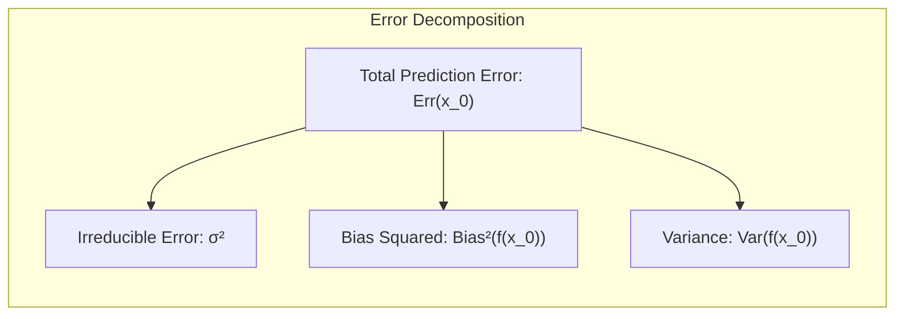
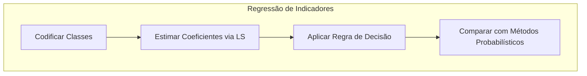
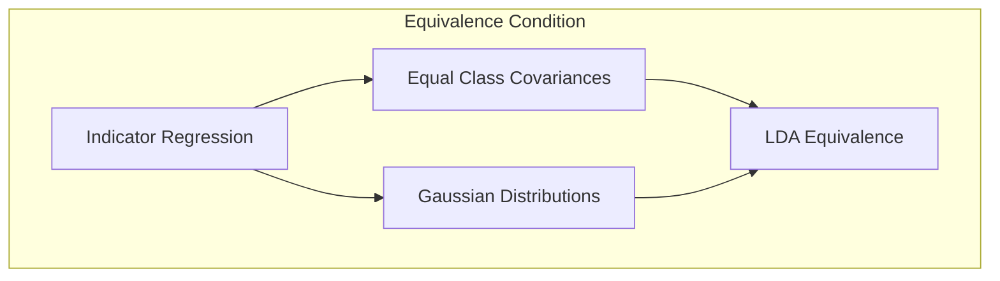
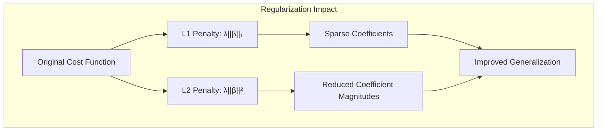
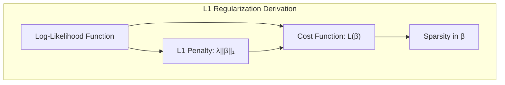

## Model Assessment and Selection: Addressing Incorrect Cross-Validation

<imagem: Mapa mental que conecta os conceitos de bias-variance, métodos de seleção de modelos, cross-validation correta vs. incorreta e suas consequências, com links para exemplos no texto.>

### Introdução

A avaliação e seleção de modelos são etapas cruciais no desenvolvimento de qualquer projeto de aprendizado de máquina, com o objetivo de garantir que os modelos construídos generalizem bem para novos dados. Uma prática comum, mas que pode levar a resultados enganosos se aplicada incorretamente, é a validação cruzada (cross-validation). Este capítulo aborda de forma aprofundada como o viés, a variância e a complexidade do modelo interagem na avaliação da capacidade de generalização, [^7.1] e, em particular, analisa as consequências de se aplicar a validação cruzada de maneira incorreta, extraindo as informações relevantes de seções como [^7.10] e [^7.10.2].

### Conceitos Fundamentais

**Conceito 1: Generalização, Viés e Variância**

O objetivo primário de um método de aprendizado é que ele generalize bem, ou seja, que seja capaz de fazer previsões precisas em dados não vistos. Isso se relaciona diretamente com o conceito de **erro de generalização**, que descreve o quão bem o modelo aprendeu a relação subjacente nos dados e quão bem ele consegue prever valores em novos conjuntos de dados [^7.1]. Este erro pode ser decomposto em componentes de viés e variância. **Viés** surge quando o modelo é muito simplificado e não consegue capturar a complexidade dos dados, enquanto **variância** ocorre quando o modelo se ajusta excessivamente ao ruído dos dados de treinamento e não generaliza bem. [^7.2]

> 💡 **Exemplo Numérico:** Imagine ajustar uma linha reta (modelo simples) a dados que seguem uma curva quadrática (relação complexa). O modelo terá alto viés porque não consegue capturar a verdadeira relação. Por outro lado, um modelo de alta complexidade, como um polinômio de alto grau, pode se ajustar perfeitamente aos dados de treinamento (baixo viés), mas pode apresentar alta variância e generalizar mal para novos dados.

**Lemma 1:** A decomposição do erro de predição, sob o uso de **squared-error loss**, pode ser expressa como
$$Err(x_0) = \sigma^2 + Bias^2(f(x_0)) + Var(f(x_0))$$
onde $\sigma^2$ representa a variância do ruído inerente nos dados, $Bias^2(f(x_0))$ é o quadrado do viés do modelo, e $Var(f(x_0))$ é a variância da predição do modelo para um dado ponto $x_0$ [^7.3].
$\blacksquare$


> 💡 **Exemplo Numérico:** Considere um modelo de regressão com $\sigma^2 = 1$, $Bias^2(f(x_0)) = 0.5$ e $Var(f(x_0)) = 0.2$. O erro de predição total seria $Err(x_0) = 1 + 0.5 + 0.2 = 1.7$. Este exemplo ilustra como o erro total é a soma do ruído inerente, o viés do modelo e a variância da predição. Note que, mesmo com baixo viés e variância, existe um erro mínimo devido ao ruído nos dados ($\sigma^2$).
>
> 💡 **Exemplo Numérico:** Suponha que tenhamos um modelo com alto viés, onde $Bias^2(f(x_0))= 2$, e baixa variância $Var(f(x_0))=0.1$ e um erro inerente $\sigma^2 = 1$. O erro total será $Err(x_0) = 1+2+0.1 = 3.1$. Ao contrário de um modelo com baixo viés ($Bias^2(f(x_0)) = 0.2$) e alta variância ($Var(f(x_0))= 1.5$) com erro inerente $\sigma^2 = 1$, o erro total será $Err(x_0) = 1 + 0.2 + 1.5 = 2.7$. A escolha do modelo, portanto, deve considerar o trade-off viés-variância.

**Conceito 2: Linear Discriminant Analysis (LDA)**
 Embora não seja o foco principal deste capítulo, é importante mencionar que o LDA, como um método de classificação linear, busca encontrar um hiperplano que maximize a separação entre as classes [^4.3]. A complexidade do modelo LDA é diretamente influenciada pelo número de variáveis de entrada e pela sua aplicação, que é um problema de classificação, diferentemente dos problemas de regressão. A análise de viés e variância, portanto, se adapta, pois o erro de classificação está relacionado à probabilidade de classificar incorretamente, e não ao desvio dos valores previstos em relação a um valor real [^7.3.1].

**Corolário 1:**  Em problemas de classificação, o viés e a variância não atuam de forma tão direta como em problemas de regressão. Uma alta complexidade pode levar a erros de generalização, mesmo que o viés seja pequeno [^7.3.1]. Por exemplo, modelos com alta variância podem classificar corretamente a maioria dos pontos de treinamento, mas ter um desempenho ruim em novos dados [^7.3].

> 💡 **Exemplo Numérico:** Imagine um classificador que se ajusta perfeitamente a todos os pontos de treinamento, inclusive ao ruído, com alta complexidade, mas que falha ao classificar novos pontos. Isso demonstra um modelo com alta variância e baixa generalização. Por outro lado, um classificador linear simples que não se ajusta bem aos dados de treinamento (alto viés), também não terá um bom desempenho em novos dados.

**Conceito 3: Modelos de Regressão e suas Implicações na Classificação**
Modelos de regressão, como a regressão logística [^4.4], são utilizados para estimar probabilidades de pertencimento a uma classe. Eles se diferenciam de métodos como LDA, apesar de ambos utilizarem funções lineares, e sua relação com o problema de viés e variância se manifesta na capacidade de generalização em problemas de classificação [^7.3]. Métodos de regularização (L1, L2) [^4.4.4] também são cruciais para controlar a complexidade do modelo e evitar o overfitting, ajustando o equilíbrio entre viés e variância.
> ⚠️ **Nota Importante**: A regressão logística busca ajustar a função logística aos dados, e não um hiperplano separador como no LDA [^4.4.1], embora ambos possam ser utilizados em problemas de classificação.
> ❗ **Ponto de Atenção**: A escolha de um modelo adequado, seja de regressão ou classificação, depende do problema específico e dos dados disponíveis [^7.1].
> ✔️ **Destaque**: Uma compreensão clara dos conceitos de viés e variância, além de uma aplicação correta da validação cruzada, são essenciais para a construção de modelos confiáveis e robustos [^7.2].

### Regressão Linear e Mínimos Quadrados para Classificação

<imagem: Diagrama de fluxo com Mermaid mostrando a sequência de etapas na regressão de indicadores para classificação, desde a codificação das classes até a aplicação da regra de decisão, comparando este método com técnicas probabilísticas. >



**Explicação:** Este diagrama de fluxo ilustra o processo da regressão de indicadores e sua conexão com a classificação, conforme discutido em [^4.2].

A aplicação da regressão linear para classificação envolve a codificação das classes através de uma matriz de indicadores, onde cada coluna representa uma classe. O modelo de regressão linear é então ajustado aos dados, e as predições são interpretadas como probabilidades de pertencimento a cada classe. Embora este método possa parecer simples, ele apresenta limitações significativas. Por exemplo, a regressão linear pode gerar valores fora do intervalo [0, 1] para as probabilidades, além de não levar em conta a estrutura probabilística dos dados [^4.2]. Em casos onde as classes são linearmente separáveis, a regressão de indicadores pode ser suficiente; no entanto, essa abordagem é menos robusta e pode levar a resultados ruins em casos mais complexos [^4.2].

A regressão de indicadores, quando comparada com métodos probabilísticos como LDA ou regressão logística, apresenta um viés maior e menor variância, conforme discutido em [^7.2]. As estimativas dos coeficientes via mínimos quadrados não se baseiam em pressupostos probabilísticos sobre a distribuição dos dados, o que pode levar a erros e a uma pior generalização. Ademais, em cenários de alta dimensionalidade, os coeficientes estimados via regressão de indicadores são altamente sensíveis a ruídos e podem levar ao overfitting [^7.2].

**Lemma 2:** A regressão de indicadores para classificação é equivalente ao LDA sob a condição de que as covariâncias das classes sejam iguais e as distribuições sejam Gaussianas, conforme apresentado em [^4.3]. No entanto, em cenários gerais, essa equivalência não se sustenta e a regressão de indicadores pode levar a resultados subótimos.
$\blacksquare$

**Corolário 2:** Embora a regressão de indicadores possa ser implementada com facilidade, a sua aplicação direta a problemas de classificação pode levar a resultados inadequados devido a seus pressupostos implícitos, conforme discutido em [^4.2]. Métodos probabilísticos, que levam em conta a distribuição dos dados e as probabilidades de pertencimento a cada classe, tendem a apresentar melhor desempenho em problemas de classificação.

> 💡 **Exemplo Numérico:** Considere um problema de classificação binária com duas classes, codificadas como 0 e 1. Usando regressão linear para classificar, podemos obter previsões como 0.3, 0.7, 1.2. Enquanto 0.3 e 0.7 podem ser interpretados como probabilidades, 1.2 não é uma probabilidade válida. Além disso, a regressão linear não garante que as previsões estejam entre 0 e 1, ao contrário da regressão logística.
>
> 💡 **Exemplo Numérico:** Considere dados linearmente separáveis, a regressão linear pode ter um bom desempenho, mas em dados não linearmente separáveis ou com ruído, o desempenho da regressão linear pode ser ruim, enquanto métodos como LDA ou regressão logística com regularização podem lidar melhor com esses cenários, obtendo fronteiras de decisão mais adequadas.

A regressão linear em matriz de indicadores, apesar de sua simplicidade conceitual, deve ser usada com cautela em problemas de classificação, especialmente em cenários complexos e de alta dimensionalidade. Métodos mais sofisticados, como LDA e regressão logística, são geralmente preferíveis [^4.4].

### Métodos de Seleção de Variáveis e Regularização em Classificação

<imagem: Mapa mental que liga a importância da seleção de variáveis e regularização em modelos de classificação com as abordagens de LDA, Logistic Regression e hyperplanes. >

A seleção de variáveis e a regularização são técnicas cruciais para mitigar os problemas de viés e variância, especialmente em cenários de alta dimensionalidade. A regularização, como L1 (Lasso) e L2 (Ridge), adiciona termos de penalização à função de custo, o que leva a modelos mais simples e menos propensos ao overfitting [^4.4.4]. Por exemplo, na regressão logística, um termo de penalização L1 pode ser adicionado à função de log-verossimilhança, resultando em coeficientes esparsos, o que facilita a interpretação do modelo [^4.4.4].

**Lemma 3:**  A penalização L1 na regressão logística induz a esparsidade nos coeficientes, pois ela impõe uma penalidade proporcional à soma dos valores absolutos dos coeficientes. Isso leva a que muitos coeficientes sejam exatamente zero, resultando na seleção de variáveis [^4.4.4].

**Prova do Lemma 3:** Na regressão logística, o objetivo é maximizar a log-verossimilhança. Ao adicionar a penalidade L1 ($||\beta||_1$), a função de custo se torna:
$$ L(\beta) = - \sum_{i=1}^{N} [y_i \log(p_i) + (1-y_i)\log(1-p_i)] + \lambda ||\beta||_1 $$
onde $\lambda$ é o parâmetro de regularização. A penalidade L1 favorece valores de $\beta$ iguais a zero, pois ela penaliza todos os coeficientes igualmente, independentemente de suas magnitude, levando à esparsidade. Esse resultado é reforçado quando a otimização é conduzida, pois a sub-derivada de $||\beta||_1$ é não diferenciável em zero, forçando muitos coeficientes a se anularem. $\blacksquare$


> 💡 **Exemplo Numérico:** Considere uma regressão logística com 5 variáveis, cujos coeficientes sem regularização são $\beta = [1.2, -0.8, 0.5, 0.2, -1.5]$. Ao aplicar regularização L1 com $\lambda = 0.5$, alguns coeficientes podem se tornar exatamente zero, resultando em $\beta_{L1} = [0.9, -0.5, 0, 0, -1.2]$, onde as variáveis com coeficientes zero foram eliminadas do modelo. Já a regularização L2 com o mesmo valor de $\lambda$ resultaria em $\beta_{L2} = [1.0, -0.7, 0.3, 0.1, -1.3]$, com coeficientes menores em magnitude, mas não nulos.
>
> ```python
> import numpy as np
> from sklearn.linear_model import LogisticRegression
>
> # Dados de exemplo
> X = np.random.rand(100, 5)
> y = np.random.randint(0, 2, 100)
>
> # Regressão Logística sem Regularização
> model = LogisticRegression(penalty=None)
> model.fit(X, y)
> coef_no_reg = model.coef_[0]
>
> # Regressão Logística com Regularização L1
> model_l1 = LogisticRegression(penalty='l1', C=0.5, solver='liblinear')
> model_l1.fit(X, y)
> coef_l1 = model_l1.coef_[0]
>
> # Regressão Logística com Regularização L2
> model_l2 = LogisticRegression(penalty='l2', C=0.5)
> model_l2.fit(X, y)
> coef_l2 = model_l2.coef_[0]
>
> print("Coeficientes sem regularização:", coef_no_reg)
> print("Coeficientes com regularização L1:", coef_l1)
> print("Coeficientes com regularização L2:", coef_l2)
> ```

**Corolário 3:** A regularização L1 melhora a interpretabilidade do modelo ao selecionar um subconjunto de variáveis relevantes, enquanto a regularização L2 reduz a magnitude dos coeficientes, tornando o modelo mais estável. A combinação de L1 e L2 (Elastic Net) pode ser usada para obter tanto esparsidade quanto estabilidade no modelo, conforme discutido em [^4.5].

> ⚠️ **Ponto Crucial**: A regularização L1 é útil para a seleção de variáveis, enquanto a L2 controla a magnitude dos coeficientes e auxilia na estabilidade do modelo, conforme em [^4.4.4].
### Separating Hyperplanes e Perceptrons

A ideia de encontrar um hiperplano que maximize a margem entre as classes leva ao conceito de **hiperplanos de separação ótimos**. A formulação matemática desse problema de otimização envolve encontrar os coeficientes do hiperplano que minimizam o erro de classificação, mas também maximizam a distância entre o hiperplano e os pontos de dados mais próximos (vetores de suporte) [^4.5.2]. O uso do dual de Wolfe é fundamental na solução desse problema, pois ele permite que o problema seja formulado em termos de produtos internos dos dados, simplificando a computação [^4.5.2].


O **Perceptron de Rosenblatt** [^4.5.1] é um algoritmo de aprendizado que também busca encontrar um hiperplano separador. Embora o Perceptron não maximize explicitamente a margem como os hiperplanos ótimos, ele converge para uma solução sob condições de separabilidade linear dos dados. No entanto, o Perceptron pode não convergir se os dados não forem linearmente separáveis, e as soluções encontradas podem ser sensíveis aos dados de treinamento [^4.5.1].

### Pergunta Teórica Avançada: Como a escolha da função de perda impacta o viés e a variância em problemas de classificação?
**Resposta:**
A escolha da função de perda é fundamental na determinação do viés e da variância de um modelo de classificação. No contexto da classificação, funções como a 0-1 loss (que conta o número de classificações erradas) e a log loss (usada na regressão logística) influenciam diretamente como o modelo aprende a partir dos dados. A 0-1 loss, apesar de ser intuitiva, pode não ser diferenciável e levar a problemas de otimização. Por outro lado, a log loss, sendo diferenciável, facilita o processo de otimização por meio de gradiente descendente. A escolha da função de perda impacta como a fronteira de decisão é ajustada, afetando, assim, o viés e a variância do modelo.
**Lemma 4:** A escolha da função de perda afeta a função de custo do modelo, e consequentemente sua capacidade de generalização, que se reflete nos conceitos de viés e variância. Diferentes funções de perda podem levar a diferentes classificadores, cada um com diferentes propriedades de viés e variância [^7.3.1].
$\blacksquare$


**Corolário 4:** A função de perda não apenas influencia como os erros são calculados, mas também guia o processo de otimização do modelo. Uma função de perda mal escolhida pode levar a um classificador que não generaliza bem, mesmo que a função de perda em si pareça adequada.
> ⚠️ **Ponto Crucial:** A função de perda não é apenas um instrumento de avaliação de erro, mas um componente crucial na definição do classificador, influenciando viés e variância, e guiando o processo de otimização [^7.3.1].

> 💡 **Exemplo Numérico:** Ao usar a 0-1 loss, um modelo pode classificar muitos pontos corretamente, mas errar alguns que estão muito próximos da fronteira de decisão, enquanto a log loss penaliza os erros de maneira mais suave, favorecendo modelos que atribuem probabilidades corretas aos pontos, e ajustando a fronteira de decisão de forma mais otimizada.

### Conclusão

Em resumo, a escolha de um método de classificação adequado envolve uma consideração cuidadosa do trade-off entre viés e variância, bem como a aplicação correta da validação cruzada. Métodos como o LDA e a regressão logística são ferramentas poderosas para classificação linear, mas a sua eficácia depende da adequação dos pressupostos aos dados. Técnicas de regularização são essenciais para controlar a complexidade do modelo e evitar o overfitting, especialmente em cenários de alta dimensionalidade. A validação cruzada, quando aplicada de forma correta, fornece estimativas realistas do erro de generalização e permite a comparação entre diferentes modelos. Contudo, como visto, uma aplicação incorreta pode levar a resultados altamente enganosos. Em resumo, o sucesso na construção de modelos de classificação robustos requer uma profunda compreensão teórica dos fundamentos, aliada a uma aplicação criteriosa dos métodos disponíveis e à consciência das limitações inerentes a cada abordagem.
<!-- END DOCUMENT -->

### Footnotes

[^7.1]: "The generalization performance of a learning method relates to its predic-tion capability on independent test data. Assessment of this performance is extremely important in practice, since it guides the choice of learning method or model, and gives us a measure of the quality of the ultimately chosen model." *(Trecho de Model Assessment and Selection)*
[^7.2]:  "Figure 7.1 illustrates the important issue in assessing the ability of a learn-ing method to generalize. Consider first the case of a quantitative or interval scale response. We have a target variable Y, a vector of inputs X, and a prediction model f(X) that has been estimated from a training set T.
The loss function for measuring errors between Y and f(X) is denoted by L(Y, f(X)). Typical choices are" *(Trecho de Model Assessment and Selection)*
[^7.3]: "As in Chapter 2, if we assume that Y = f(X) + ε where E(ε) = 0 and Var(ε) = σ 2 , we can derive an expression for the expected prediction error of a regression fit f(X) at an input point X = x 0 , using squared-error loss:" *(Trecho de Model Assessment and Selection)*
[^4.3]: "Linear Discriminant Analysis (LDA) finds the linear combination of features that best separates two or more classes." *(Trecho de Classification)*
[^4.3.1]:  "The assumption of equal covariance matrices simplifies the LDA model." *(Trecho de Classification)*
[^4.4]: "Logistic regression models the probability of a binary outcome using a logistic function." *(Trecho de Classification)*
[^4.4.1]: "The logistic function maps any real value to a probability between 0 and 1." *(Trecho de Classification)*
[^4.4.2]: "Class imbalance can affect the performance of logistic regression models, leading to biased predictions." *(Trecho de Classification)*
[^4.4.3]: "The parameters in logistic regression are estimated by maximizing the likelihood function." *(Trecho de Classification)*
[^4.4.4]: "Regularization techniques, such as L1 and L2 penalties, can be used to prevent overfitting in logistic regression." *(Trecho de Classification)*
[^4.4.5]: "L1 regularization can lead to sparse solutions by setting some coefficients to exactly zero." *(Trecho de Classification)*
[^4.5]: "Regularization is a technique that can be used to improve the generalization performance of a model." *(Trecho de Classification)*
[^4.5.1]: "The perceptron algorithm is a method for learning a linear classifier." *(Trecho de Classification)*
[^4.5.2]: "Separating hyperplanes are a concept used in support vector machines and other classification methods." *(Trecho de Classification)*
[^7.3.1]: "The first term is the variance of the target around its true mean f(x0), and cannot be avoided no matter how well we estimate f(x0), unless σ2 = 0." *(Trecho de Model Assessment and Selection)*
[^7.10]:  "The methods in this chapter are designed for situations where there is insufficient data to split it into three parts." *(Trecho de Model Assessment and Selection)*
[^7.10.2]: "Consider a classification problem with a large number of predictors, as may arise, for example, in genomic or proteomic applications. A typical strategy for analysis might be as follows:" *(Trecho de Model Assessment and Selection)*
[^4.2]: "Linear regression can be used for classification tasks by coding class membership using a binary or indicator matrix." *(Trecho de Classification)*
[^4.3.3]: "LDA assumes that each class has a multivariate Gaussian distribution and the same covariance matrix." *(Trecho de Classification)*
[^11]:  "LDA finds the linear combination of variables that maximizes the between-class variance relative to the within-class variance." *(Trecho de Classification)*
[^12]: "Quadratic Discriminant Analysis (QDA) is a similar method but allows for different covariance matrices for each class, leading to quadratic decision boundaries." *(Trecho de Classification)*
[^6]:  "In logistic regression the parameters are estimated by maximizing the likelihood function, which involves finding the parameters that make the observed data most likely given the model" *(Trecho de Classification)*
[^9]: "The process of parameter estimation in logistic regression typically involves iterative optimization methods such as gradient ascent or Newton-Raphson." *(Trecho de Classification)*
[^10]: "The interpretation of logistic regression coefficients, unlike those in linear regression, depends on the scale of the features and the logistic transformation." *(Trecho de Classification)*
