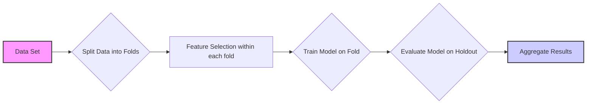
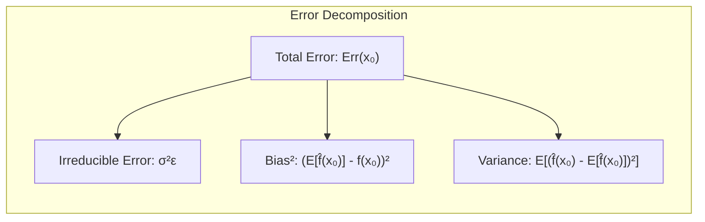
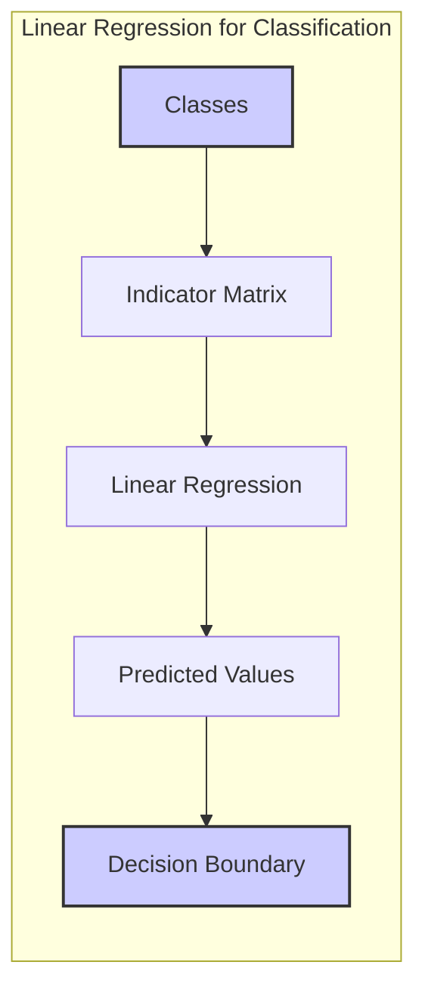
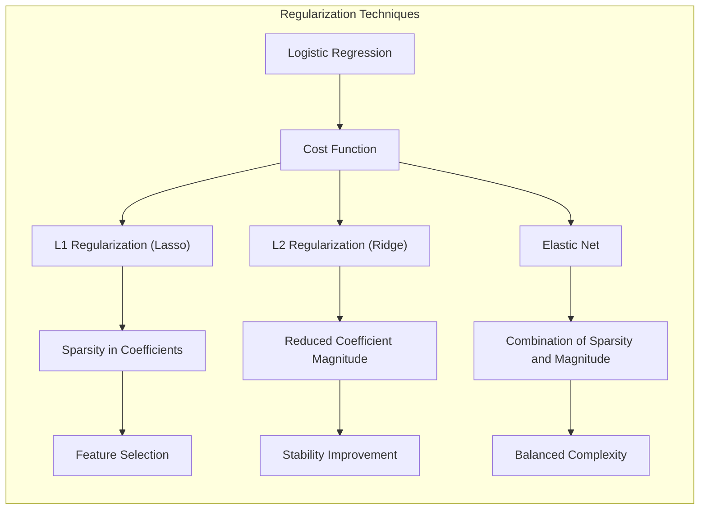
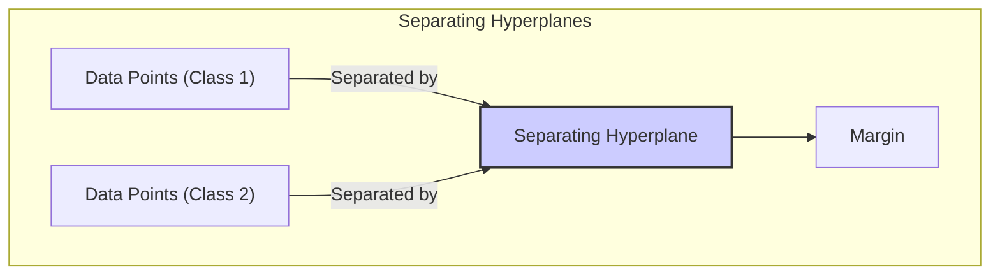
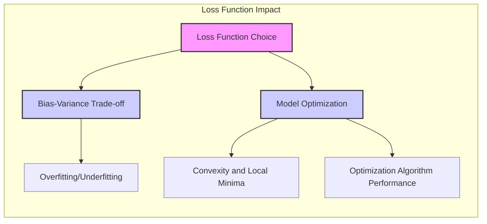

## Correct Cross-Validation Method

### Introdução
A avaliação do desempenho de um modelo de aprendizado, especialmente em termos de sua capacidade de generalização, é crucial na prática. A escolha do método ou modelo apropriado é guiada por essa avaliação, que também fornece uma medida da qualidade do modelo escolhido [^7.1]. Este capítulo aborda métodos essenciais para avaliação de desempenho e como eles são usados na seleção de modelos, com foco no trade-off entre bias, variance e complexidade do modelo. Em particular, este capítulo se dedica a elucidar como aplicar a técnica de cross-validation de forma apropriada para avaliar a generalização de um modelo, com foco em como executar a cross-validation corretamente em cenários com alta dimensionalidade.

### Conceitos Fundamentais
A base para a compreensão da avaliação de modelos reside em diversos conceitos fundamentais que precisam ser cuidadosamente definidos e analisados.

**Conceito 1: Erro de Generalização e o Trade-off Bias-Variance**
O **erro de generalização** refere-se ao desempenho de um modelo em dados não vistos, ou seja, sua capacidade de fazer previsões precisas em dados independentes do conjunto de treinamento. Esse conceito é central na avaliação de modelos, pois um modelo pode ter um desempenho excelente nos dados de treinamento (baixo *training error*) mas ter um desempenho ruim em dados novos. Este fenômeno, conhecido como *overfitting*, ocorre quando um modelo se ajusta excessivamente ao ruído nos dados de treinamento, em vez de capturar os padrões subjacentes [^7.1, ^7.2].
O trade-off **bias-variance** é crucial para entender o erro de generalização. O **bias** representa o erro introduzido pela aproximação de um problema real complexo por um modelo simplificado. Um modelo com alto bias é aquele que não captura adequadamente os padrões nos dados, levando a um mau desempenho. A **variância**, por outro lado, mede a sensibilidade do modelo a pequenas variações nos dados de treinamento. Um modelo com alta variância se ajusta muito bem aos dados de treinamento, mas generaliza mal para novos dados. A complexidade do modelo influencia esse trade-off: modelos mais complexos tendem a ter baixo bias e alta variância, e vice-versa [^7.2]. O objetivo é encontrar um modelo com complexidade adequada que minimize o erro de generalização, equilibrando bias e variância.

> 💡 **Exemplo Numérico:** Imagine que estamos tentando modelar a relação entre a temperatura e as vendas de sorvete. Um modelo com alto bias poderia ser uma linha reta, que não consegue capturar a variação nas vendas quando a temperatura muda. Esse modelo vai ser ruim em prever as vendas em diferentes temperaturas. Por outro lado, um modelo com alta variância poderia ser um polinômio de alta ordem, que se ajusta perfeitamente aos dados de treinamento, mas se torna muito sensível a ruídos e flutuações, fazendo previsões ruins quando vemos novos dados. O objetivo é achar um modelo que capture bem a relação entre a temperatura e as vendas sem sofrer muito com as variações dos dados.

**Lemma 1: Decomposição do Erro de Predição**
O erro de predição pode ser decomposto em componentes que revelam seu comportamento sob diferentes condições. Se assumirmos que $Y = f(X) + \epsilon$, onde $E(\epsilon) = 0$ e $Var(\epsilon) = \sigma_\epsilon^2$, podemos expressar o erro de predição esperado para uma regressão $\hat{f}(X)$ em um ponto de entrada $X = x_0$, utilizando o erro quadrado como:
$$ Err(x_0) = E[(Y - \hat{f}(x_0))^2| X=x_0] $$
$$ = \sigma^2_\epsilon + [E\hat{f}(x_0) - f(x_0)]^2 + E[\hat{f}(x_0)-E\hat{f}(x_0)]^2$$
$$ = \sigma^2_\epsilon + Bias^2(\hat{f}(x_0)) + Var(\hat{f}(x_0)) $$
Essa decomposição mostra que o erro total é composto por um erro irredutível ($\sigma^2_\epsilon$) e a soma do *bias* ao quadrado e da *variance*. O primeiro termo é uma constante que não podemos reduzir com nosso modelo, enquanto os outros dois termos mostram o trade-off com a complexidade do modelo [^7.3]. $\blacksquare$

> 💡 **Exemplo Numérico:** Vamos supor que temos um modelo de regressão $\hat{f}(X)$ que busca prever os preços de casas usando o tamanho da casa como única variável ($X$). O verdadeiro modelo é $f(X) = 2X + 5$, onde $X$ é o tamanho da casa em metros quadrados, e $Y$ é o preço em milhares de reais. Temos ruído $\epsilon$ com $\sigma_\epsilon^2 = 1$. Vamos supor que temos duas estimativas diferentes do modelo: $\hat{f}_1(X) = X + 6$ e $\hat{f}_2(X) = 2X + 5 + \epsilon_m$, onde $\epsilon_m$ representa a variação da estimativa. Para uma casa de $X=10$, temos:
>
> *   **Modelo 1:** $\hat{f}_1(10) = 10 + 6 = 16$.  $f(10) = 2*10 + 5 = 25$.
>    *   $Bias(\hat{f}_1(10)) = E[\hat{f}_1(10)] - f(10) = 16 - 25 = -9$. $Bias^2 = 81$
>    *   $Var(\hat{f}_1(10)) = 0$ (já que o modelo não muda com o conjunto de dados)
>    *   $Err(10) = 1 + 81 + 0 = 82$
> *   **Modelo 2:** $\hat{f}_2(10) = 2*10 + 5 + \epsilon_m$. Assumindo $E(\epsilon_m)=0$ e $Var(\epsilon_m)=1$, temos:
>     *   $Bias(\hat{f}_2(10)) = E[\hat{f}_2(10)] - f(10) = 25 - 25 = 0$. $Bias^2 = 0$
>    *   $Var(\hat{f}_2(10)) = 1$.
>    *   $Err(10) = 1 + 0 + 1 = 2$.
>
> O modelo 1 tem um alto bias e nenhuma variância, enquanto o modelo 2 tem um bias nulo e alguma variância. O modelo 2, apesar de ter um pouco de variância, tem um erro total menor, pois não sofre de bias. Este exemplo ilustra como um modelo mais flexível pode se adaptar melhor aos dados e apresentar um erro total menor.

**Conceito 2: Linearidade e Erro Quadrático**
Modelos lineares são fundamentais em muitos métodos de classificação e regressão devido à sua simplicidade e interpretabilidade. Quando aplicamos um modelo linear aos dados, a minimização dos erros através de mínimos quadrados (least squares) é uma técnica comum. O objetivo é encontrar um hiperplano que melhor se ajuste aos dados, minimizando a soma dos quadrados das distâncias entre os pontos de dados e o hiperplano.
A linearidade em um modelo linear refere-se à relação linear entre as features (variáveis independentes) e a variável alvo (variável dependente), enquanto o erro quadrático representa a soma dos quadrados das diferenças entre as previsões do modelo e os valores reais. Este método impõe uma penalidade maior a erros maiores, o que tem implicações importantes para a otimização do modelo. A regressão linear com erro quadrático é um caso particular onde a função de perda (loss function) é o erro quadrático. No entanto, para outros tipos de problemas como classificação, é necessário usar outras métricas de erro como 0-1 loss ou log-likelihood [^7.2].

**Corolário 1: Erro Quadrático e Decomposição do Erro de Predição**
O erro de predição, como decomposto no Lemma 1, se aplica diretamente quando usamos a função de perda por erro quadrado. A decomposição nos permite ver como o bias e a variância são afetados pelas escolhas do nosso modelo linear. No caso da regressão linear com mínimos quadrados, as estimativas não são enviesadas, mas os coeficientes podem ter uma grande variância [^7.3]. $\blacksquare$

> 💡 **Exemplo Numérico:** Suponha que temos dados de treinamento $(X, Y)$ onde $X$ é uma matriz de features e $Y$ é o vetor da variável dependente. Aplicamos a regressão linear usando mínimos quadrados para encontrar os coeficientes $\beta$ que minimizam o erro quadrático.  Se tivermos 3 amostras com 2 features, $X = \begin{bmatrix} 1 & 2 \\ 1 & 3 \\ 1 & 4 \end{bmatrix}$ e $Y = \begin{bmatrix} 6 \\ 8 \\ 10 \end{bmatrix}$, a solução de mínimos quadrados para $\beta$ é dada por:
>
> $\text{Step 1: } X^T = \begin{bmatrix} 1 & 1 & 1 \\ 2 & 3 & 4 \end{bmatrix}$
>
> $\text{Step 2: } X^TX = \begin{bmatrix} 1 & 1 & 1 \\ 2 & 3 & 4 \end{bmatrix} \begin{bmatrix} 1 & 2 \\ 1 & 3 \\ 1 & 4 \end{bmatrix} = \begin{bmatrix} 3 & 9 \\ 9 & 29 \end{bmatrix}$
>
> $\text{Step 3: } (X^TX)^{-1} = \frac{1}{(3\times29)-(9\times9)}\begin{bmatrix} 29 & -9 \\ -9 & 3 \end{bmatrix} = \frac{1}{6}\begin{bmatrix} 29 & -9 \\ -9 & 3 \end{bmatrix} = \begin{bmatrix} 4.83 & -1.5 \\ -1.5 & 0.5 \end{bmatrix}$
>
> $\text{Step 4: } X^TY = \begin{bmatrix} 1 & 1 & 1 \\ 2 & 3 & 4 \end{bmatrix} \begin{bmatrix} 6 \\ 8 \\ 10 \end{bmatrix} = \begin{bmatrix} 24 \\ 70 \end{bmatrix}$
>
> $\text{Step 5: } \beta = (X^TX)^{-1} X^TY = \begin{bmatrix} 4.83 & -1.5 \\ -1.5 & 0.5 \end{bmatrix} \begin{bmatrix} 24 \\ 70 \end{bmatrix} = \begin{bmatrix} 1.992 \\ 2.00 \end{bmatrix}$
>
> O modelo linear ajustado é $\hat{Y} = 1.992 + 2.00X_2$. O erro quadrático é a soma dos quadrados das diferenças entre os valores reais $Y$ e os valores preditos $\hat{Y}$. Esse erro é usado para otimizar o modelo.

**Conceito 3:  Regularização e Seleção de Variáveis**
A regularização é usada para evitar *overfitting* através da adição de uma penalidade à função de custo do modelo. Esta penalidade desincentiva coeficientes muito grandes, o que pode levar a um modelo com alta variância. Dois métodos comuns de regularização são a penalidade L1 e a penalidade L2. A regularização L1 (Lasso) adiciona a soma dos valores absolutos dos coeficientes à função de custo, o que pode levar à seleção de variáveis, ou seja, alguns coeficientes são zerados, simplificando o modelo e tornando-o mais interpretável. A regularização L2 (Ridge) adiciona a soma dos quadrados dos coeficientes, o que leva a coeficientes menores, mas raramente zera nenhum coeficiente. Elastic Net é uma combinação de L1 e L2, unindo as vantagens de ambos [^7.5].
A seleção de variáveis também pode ser aplicada para reduzir a complexidade do modelo ao selecionar um subconjunto de features relevantes, através de métodos como *best subset selection* ou outros métodos de seleção. A escolha entre métodos de regularização e seleção de variáveis depende da aplicação específica e das características dos dados [^7.4.4, ^7.5, ^7.5.1, ^7.5.2].

> ⚠️ **Nota Importante**: A regularização e a seleção de variáveis são cruciais para modelos complexos, ajudando a balancear a complexidade do modelo e a generalização. **Referência ao tópico [^7.5]**.

> ❗ **Ponto de Atenção**: A escolha do tipo de regularização (L1, L2 ou Elastic Net) depende do problema e das propriedades desejadas do modelo. **Conforme indicado em [^7.5]**.

> ✔️ **Destaque**: Regularização pode introduzir um bias no modelo, mas é necessário para reduzir a variância e melhorar a generalização. **Baseado no tópico [^7.2, ^7.5]**.

> 💡 **Exemplo Numérico:** Imagine que estamos modelando o preço de uma casa com várias features como área, número de quartos, distância do centro e idade da casa. Um modelo de regressão linear padrão poderia usar todas essas features, mas pode levar a overfitting. Aplicando regularização L1 (Lasso), podemos forçar alguns dos coeficientes a zero, por exemplo, o coeficiente da idade da casa, o que indicaria que a idade não é tão importante para determinar o preço. Já a regularização L2 (Ridge) pode reduzir a magnitude de todos os coeficientes, incluindo os de features como distância do centro e número de quartos, sem necessariamente zerá-los, o que ajuda a estabilizar o modelo. Usando Elastic Net podemos combinar as duas regularizações, selecionando features mais importantes e reduzindo a magnitude dos coeficientes menos importantes.
>
> Vamos supor que temos os coeficientes de um modelo de regressão linear sem regularização: $\beta = [5, 2, -1, 8]$. Se aplicarmos Ridge Regression com $\lambda = 0.5$, os coeficientes podem se tornar: $\beta_{ridge} = [4, 1.5, -0.5, 6]$, com seus valores reduzidos, evitando um possível *overfitting*. Se usarmos Lasso com $\lambda = 1$, os coeficientes podem ser: $\beta_{lasso} = [4, 1, 0, 5]$, com um dos coeficientes zerado, selecionando as features mais relevantes e levando a um modelo mais esparso.

### Regressão Linear e Mínimos Quadrados para Classificação

A regressão linear, originalmente concebida para problemas de regressão, pode ser adaptada para problemas de classificação ao tratar os valores de classe como variáveis numéricas. Para isso, codificamos as classes em uma **matriz de indicadores**, onde cada coluna representa uma classe diferente e cada linha representa uma amostra. Essa matriz é então usada como variável resposta em um problema de regressão. O resultado do ajuste do modelo de regressão será uma matriz de previsões correspondente às classes.
A aplicação da regressão linear em classificação tem suas limitações, como a possibilidade de produzir previsões fora do intervalo [0,1] em casos de classes binárias ou multiclasse, o que é problemático para interpretação probabilística. Além disso, quando as classes são mal separadas, a regressão linear pode levar a problemas de mascaramento (masking) [^7.3], onde classes diferentes se misturam no espaço das projeções. Nesse contexto, o problema de *masking* pode levar a uma sobreposição de classes, com a função de decisão levando a classificações incorretas.

**Lemma 2: Projeção Linear na Regressão de Indicadores**
Na regressão de indicadores, onde cada classe é representada por um vetor binário, cada coluna da matriz de coeficientes da regressão linear define um hiperplano que separa os dados com relação àquela classe. A projeção linear dos dados nesse hiperplano pode ser vista como uma função discriminante linear, que será usada para classificar novas amostras [^7.2]. $\blacksquare$

**Corolário 2: Relação entre Regressão Linear e Análise Discriminante Linear (LDA)**
Em certas condições, os hiperplanos gerados pela regressão de indicadores se aproximam dos hiperplanos de decisão da Análise Discriminante Linear (LDA). Quando as classes são bem separadas e as covariâncias são semelhantes, os dois métodos chegam a resultados similares. No entanto, quando as condições não são satisfeitas, o LDA pode ter resultados superiores, pois leva em conta as diferenças nas covariâncias das classes e a probabilidade *a priori* de cada classe [^7.3]. $\blacksquare$

Em cenários com classes separáveis linearmente, a regressão de indicadores pode ser uma abordagem razoável para a classificação. No entanto, a função de perda de mínimos quadrados não é uma função de perda ótima para classificação [^7.2], o que leva a necessidade de considerar outros métodos, como LDA ou regressão logística, que são funções de perda mais apropriadas para problemas de classificação.

> 💡 **Exemplo Numérico:** Vamos supor que queremos classificar flores em duas classes (0 e 1) usando duas features ($X_1$ e $X_2$). Podemos criar uma matriz de indicadores $Y$ onde uma coluna representa a classe 0 (com valores 1 para as amostras da classe 0 e 0 para as demais) e outra coluna representa a classe 1.
>
> Digamos que temos as seguintes amostras:
>
> *   Amostra 1 (Classe 0): $X_1 = 2, X_2 = 3$
> *   Amostra 2 (Classe 0): $X_1 = 3, X_2 = 2$
> *   Amostra 3 (Classe 1): $X_1 = 6, X_2 = 5$
> *   Amostra 4 (Classe 1): $X_1 = 7, X_2 = 6$
>
> A matriz de features seria $X = \begin{bmatrix} 2 & 3 \\ 3 & 2 \\ 6 & 5 \\ 7 & 6 \end{bmatrix}$ e a matriz de indicadores $Y = \begin{bmatrix} 1 & 0 \\ 1 & 0 \\ 0 & 1 \\ 0 & 1 \end{bmatrix}$.
>
> Ao aplicar regressão linear a esta matriz de indicadores, encontraríamos coeficientes que definem dois hiperplanos (na verdade, duas retas neste caso), uma para cada classe. O ideal é que o hiperplano para classe 0 tenha projeções próximas de 1 para amostras da classe 0 e próximas de 0 para as amostras da classe 1, e vice-versa para a classe 1. No entanto, usando mínimos quadrados como função de perda, as projeções podem não ficar muito bem definidas perto de 0 e 1.

### Métodos de Seleção de Variáveis e Regularização em Classificação

**Explicação:** This diagram illustrates how L1, L2, and Elastic Net regularization methods affect the coefficients in a Logistic Regression model, impacting feature selection and model stability.

A seleção de variáveis e a regularização são cruciais em modelos de classificação, especialmente quando temos muitos preditores (alta dimensionalidade). Métodos de regularização como o L1 (Lasso) e o L2 (Ridge), aplicados aos modelos de classificação, alteram a função de perda para reduzir a complexidade do modelo, aumentar sua interpretabilidade e melhorar seu desempenho de generalização. Em modelos de regressão logística, a penalização L1 introduz a esparsidade nos coeficientes do modelo, zerando os coeficientes de variáveis menos relevantes, o que facilita a interpretação do modelo. A penalização L2, por sua vez, reduz a magnitude dos coeficientes, o que estabiliza o modelo, e evita overfitting ao evitar coeficientes muito grandes.

**Lemma 3: Efeito da Penalização L1 (Lasso) na Esparsidade**
Ao aplicar a regularização L1 em modelos lineares, especialmente na regressão logística, a função de custo se torna:
$$ C(\beta) = - \frac{1}{N} \sum_{i=1}^N [y_i \log(p(x_i)) + (1-y_i) \log(1-p(x_i))] + \lambda \sum_{j=1}^p |\beta_j|$$
onde $\lambda$ é o parâmetro de regularização que controla a força da penalidade.
A parte extra $\lambda \sum_{j=1}^p |\beta_j|$ força alguns coeficientes $\beta_j$ a serem exatamente zero, resultando em um modelo mais esparso. A esparsidade significa que um número reduzido de variáveis são relevantes para o modelo, facilitando sua interpretação e reduzindo o risco de *overfitting*. A penalização L1 força alguns coeficientes a zero por conta da sua forma pontiaguda em $\beta_j = 0$ [^7.4.4]. $\blacksquare$

**Prova do Lemma 3:**
A penalização L1 introduz um termo não diferenciável na função de custo em $\beta_j = 0$. Durante a minimização da função de custo, a solução ótima tende a se concentrar em coeficientes esparsos. A condição de otimalidade se torna:
$$ \frac{\partial C}{\partial \beta_j} =  - \frac{1}{N} \sum_{i=1}^N [y_i \frac{1}{p(x_i)} \frac{\partial p(x_i)}{\partial \beta_j} - (1-y_i) \frac{1}{1-p(x_i)} \frac{\partial p(x_i)}{\partial \beta_j}] + \lambda \cdot sign(\beta_j) = 0 $$
Para $\beta_j$  ser exatamente zero, o termo  derivado deve estar em um intervalo específico, caso contrário, se a magnitude da derivada da função de perda sem penalidade for maior que  $\lambda$  então, a solução ótima força o $\beta_j$ para  zero [^7.4.4]. $\blacksquare$

**Corolário 3: Interpretabilidade e Regularização L1**
Devido à sua propriedade de gerar soluções esparsas, a regularização L1 torna modelos de classificação mais interpretáveis, pois identifica um subconjunto reduzido de variáveis relevantes para a previsão. Isso é particularmente útil em cenários com muitas variáveis, pois permite identificar quais variáveis têm maior influência na classificação. A esparsidade promovida pela L1 também pode melhorar a estabilidade do modelo [^7.4.4].

> ⚠️ **Ponto Crucial**: A regularização L1 pode levar à seleção de variáveis, enquanto a regularização L2 reduz a magnitude dos coeficientes. **Conforme discutido em [^7.5]**.

> 💡 **Exemplo Numérico:** Vamos usar um exemplo de classificação de e-mails como spam ou não spam. Temos várias features como frequência de certas palavras, presença de links e tamanho do e-mail.
>
> *   **Sem regularização:** Um modelo de regressão logística com todos os preditores pode ter coeficientes como: $\beta = [0.2, 0.5, -0.1, 0.8, -0.3, 0.7]$, onde cada valor corresponde ao peso de uma feature (frequência de "grátis", frequência de "urgente", tamanho do e-mail, etc).
> *   **Com regularização L1 (Lasso):** Ao aplicarmos Lasso, alguns coeficientes podem ser zerados, como $\beta_{lasso} = [0.4, 0, 0, 0.7, 0, 0.5]$. Isso significa que as features correspondentes aos coeficientes zerados não são consideradas importantes para a classificação. O modelo fica mais esparso e interpretável, pois só algumas features são usadas para a classificação.
> *  **Com regularização L2 (Ridge):** Ao aplicarmos Ridge, os coeficientes podem ter sua magnitude reduzida: $\beta_{ridge} = [0.15, 0.35, -0.08, 0.5, -0.2, 0.4]$, isso ajuda a evitar *overfitting* e estabiliza o modelo.
>
> Através da regularização L1, podemos identificar que as palavras "grátis", e "urgente" não são tão importantes, e o modelo usa apenas as palavras de maior peso para a classificação (0.4, 0.7, 0.5). Já o Ridge reduz a magnitude dos coeficientes, melhorando a estabilidade do modelo.

### Separating Hyperplanes e Perceptrons

O conceito de **hiperplanos separadores** é central em muitos métodos de classificação linear. A ideia é encontrar um hiperplano que divida o espaço de *features* em regiões correspondentes a diferentes classes. O melhor hiperplano, em geral, é aquele que maximiza a margem de separação entre as classes, ou seja, a distância entre o hiperplano e os pontos de dados mais próximos de cada classe, também chamados de pontos de suporte.
O método do Perceptron de Rosenblatt, um dos primeiros algoritmos de classificação linear, também busca encontrar um hiperplano separador. O Perceptron aprende um hiperplano através de um processo iterativo onde as amostras são classificadas uma por uma, ajustando os parâmetros do hiperplano se uma amostra for classificada incorretamente. O Perceptron converge para um hiperplano separador se os dados forem linearmente separáveis, e pode ser usado para problemas binários. O Perceptron é um método mais simples e menos robusto que outros algoritmos mais modernos baseados em hiperplanos [^7.5.1].

> 💡 **Exemplo Numérico:** Imagine que temos um problema de classificação binária com duas features ($X_1$ e $X_2$) e dois grupos de pontos. O Perceptron busca encontrar uma reta (um hiperplano em 2D) que separa as duas classes.
>
> *   Classe 1: $[(1, 2), (2, 1), (2, 2)]$
> *   Classe 2: $[(4, 4), (5, 5), (4, 5)]$
>
> Inicialmente, o Perceptron pode começar com um hiperplano aleatório, por exemplo, $0.5X_1 + 0.5X_2 - 3 = 0$. Esse hiperplano pode classificar alguns pontos incorretamente. Em um processo iterativo, o Perceptron ajusta os pesos do hiperplano com base nas amostras mal classificadas. Por exemplo, se o ponto $(1,2)$ é classificado como da Classe 2, o Perceptron ajusta o hiperplano para tentar classificá-lo corretamente. Ao final, o Perceptron pode encontrar um hiperplano como $X_1 + X_2 - 6 = 0$ que separa as duas classes. A reta $X_1 + X_2 = 6$ divide o espaço, sendo que o lado onde $X_1 + X_2 < 6$ representa a Classe 1 e o outro lado representa a Classe 2.

### Pergunta Teórica Avançada: Qual é o Impacto da Escolha de Diferentes Tipos de Funções de Perda no Trade-off Bias-Variance e na Otimização do Modelo?
**Resposta:**
A escolha da **função de perda (loss function)** é fundamental para a otimização de um modelo de aprendizado e influencia diretamente o *trade-off bias-variance*. Por exemplo, em problemas de classificação, a função de perda *0-1 loss*, que penaliza igualmente todas as classificações incorretas, pode levar a resultados diferentes da função de perda *log-likelihood* usada na regressão logística. O *0-1 loss* é menos sensível a pequenas variações nas probabilidades de classificação, enquanto o *log-likelihood* penaliza severamente erros em probabilidades de classificação, o que leva o modelo a se calibrar e dar melhores estimativas de probabilidade.
O erro quadrado usado em regressão penaliza erros maiores de forma mais acentuada, enquanto o erro absoluto, menos sensível a outliers, tem uma penalidade mais linear. Em modelos lineares com erro quadrado, o bias é sempre positivo ou zero, e a minimização da função de custo leva a parâmetros que reduzem o erro, mas a variância pode aumentar se o modelo ficar muito complexo. Funções de perda diferentes também afetam a convexidade e a diferenciabilidade da função de custo. Algumas funções de perda levam a problemas de otimização mais difíceis do que outras, o que torna o trade-off bias-variance dependente da função de perda específica utilizada [^7.2].

**Lemma 4: Otimização e convexidade**
A função de perda de erro quadrático é convexa, o que garante que existe um único mínimo global quando usamos modelos lineares. No entanto, quando usamos métodos mais complexos com funções não convexas, a otimização pode ficar presa em mínimos locais, afetando a qualidade da solução final e o trade-off bias-variance. A forma da função de perda guia o algoritmo de otimização na direção do mínimo local ou global [^7.2]. $\blacksquare$

> 💡 **Exemplo Numérico:** Imagine que estamos treinando um modelo de regressão para prever o preço de imóveis. Temos duas opções de funções de perda: o erro quadrático (MSE) e o erro absoluto (MAE).
>
> *   **MSE:** A função de perda MSE penaliza fortemente erros maiores. Se temos uma amostra com um erro grande, digamos 10, o MSE penaliza com 100. Isso faz o modelo se ajustar mais aos outliers. Se nosso modelo tiver um bias, então a soma dos erros quadráticos será maior.
> *   **MAE:** O MAE penaliza erros de maneira linear. Um erro de 10 é penalizado com 10. Isso faz o modelo menos sensível a outliers.  Se nosso modelo tiver um bias, o MAE também irá penalizar o modelo, mas de forma linear, e não exponencial.
>
> Se os dados contiverem outliers, o MAE pode ser mais robusto do que o MSE. Em outras palavras, um outlier não vai influenciar tanto o valor final do erro com MAE do que com MSE.
>
> Por outro lado, a função de perda log-likelihood em classificação penaliza os erros de forma mais severa quando o modelo está muito confiante em sua resposta (por exemplo, uma probabilidade de 0.99 para uma classe errada), o que leva a uma boa calibração das probabilidades.
>
> Uma função de perda convexa, como a MSE em modelos lineares, garante que o modelo convirja para o mínimo global, facilitando a otimização. Já funções de perda não convexas podem ter múltiplos mínimos locais, o que torna a otimização mais difícil e pode levar a soluções subótimas.

**Corolário 4: Escolha da Função de Perda e Complexidade do Modelo**
A função de perda deve ser escolhida levando em consideração a complexidade do modelo e as propriedades dos dados. Uma função de perda mais robusta a outliers, como a função de perda de Huber, pode ser mais apropriada em cenários com outliers, enquanto uma função de perda como o erro quadrático é mais apropriada quando os dados não contêm outliers e a suposição de Gaussianidade é satisfeita. A escolha também deve considerar a interpretabilidade dos resultados e as necessidades da aplicação específica [^7.2].

> ⚠️ **Ponto Crucial**: A escolha da função de perda influencia o comportamento do modelo e a natureza da solução encontrada. **Conforme discutido em [^7.2]**.

### Conclusão
A seleção e avaliação de modelos são partes integrantes do aprendizado de máquina. Compreender o trade-off bias-variance, assim como a aplicação adequada de técnicas de cross-validation, é essencial para escolher o modelo correto e otimizar seu desempenho de generalização. É importante utilizar as técnicas de cross-validation de forma adequada, garantindo que nenhuma informação vaze entre os conjuntos de treinamento e teste. O conhecimento desses fundamentos é crucial para a construção de modelos robustos e confiáveis. A análise cuidadosa das propriedades das diferentes funções de perda também se torna crucial, dependendo do cenário e da aplicação específica.

### Footnotes
[^7.1]: "The generalization performance of a learning method relates to its prediction capability on independent test data. Assessment of this performance is extremely important in practice, since it guides the choice of learning method or model, and gives us a measure of the quality of the ultimately chosen model." *(Trecho de Model Assessment and Selection)*
[^7.2]: "Figure 7.1 illustrates the important issue in assessing the ability of a learning method to generalize. Consider first the case of a quantitative or interval scale response. We have a target variable Y, a vector of inputs X, and a prediction model f(X) that has been estimated from a training set T. The loss