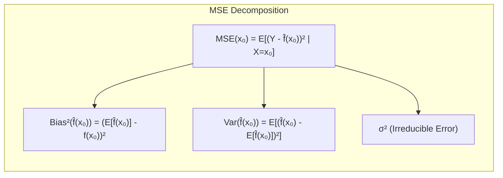
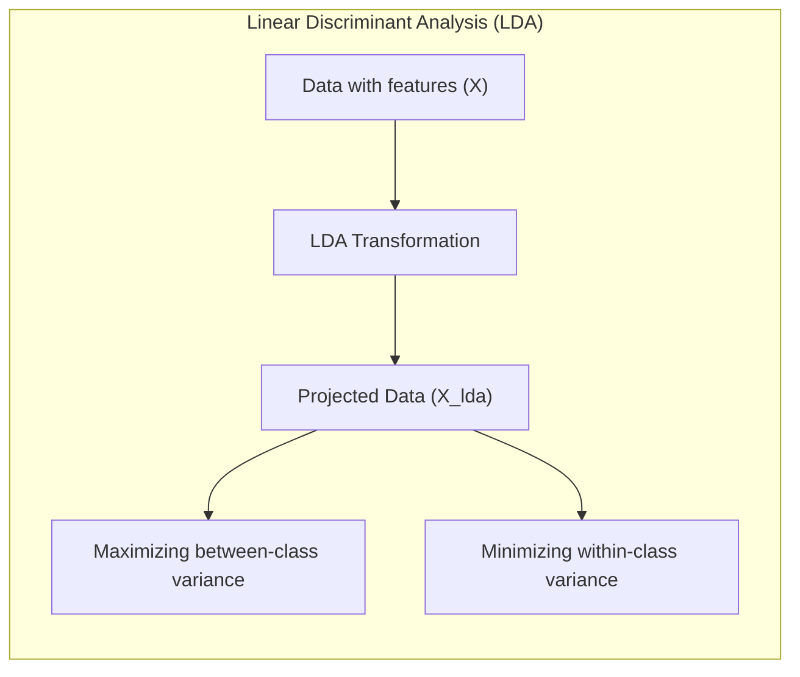
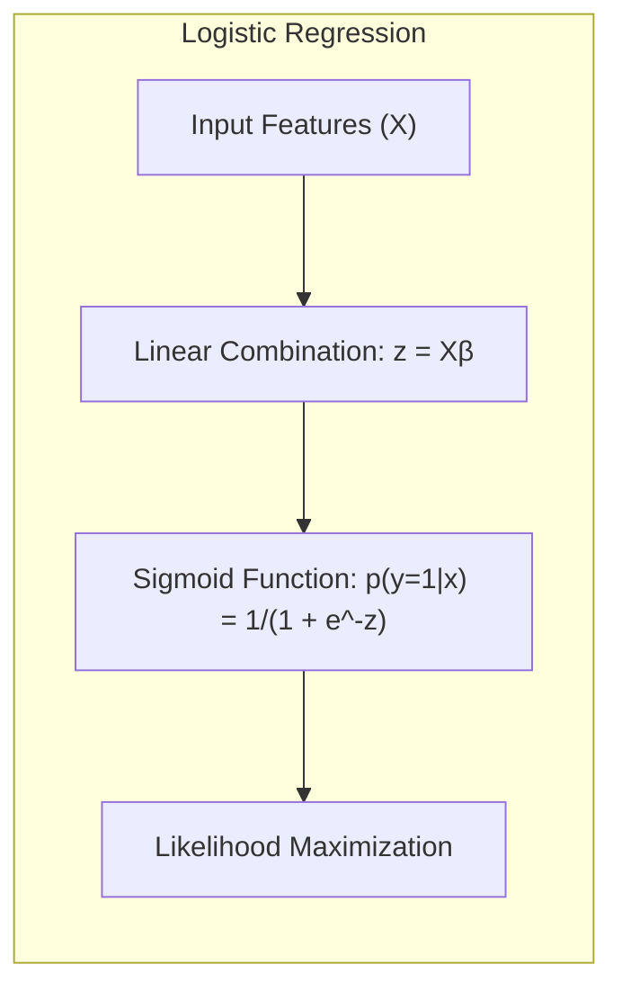
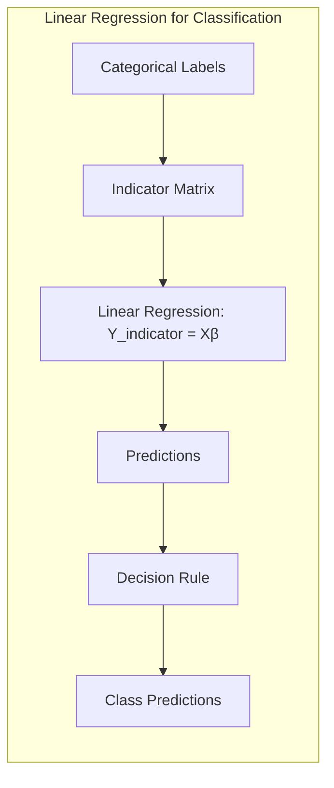
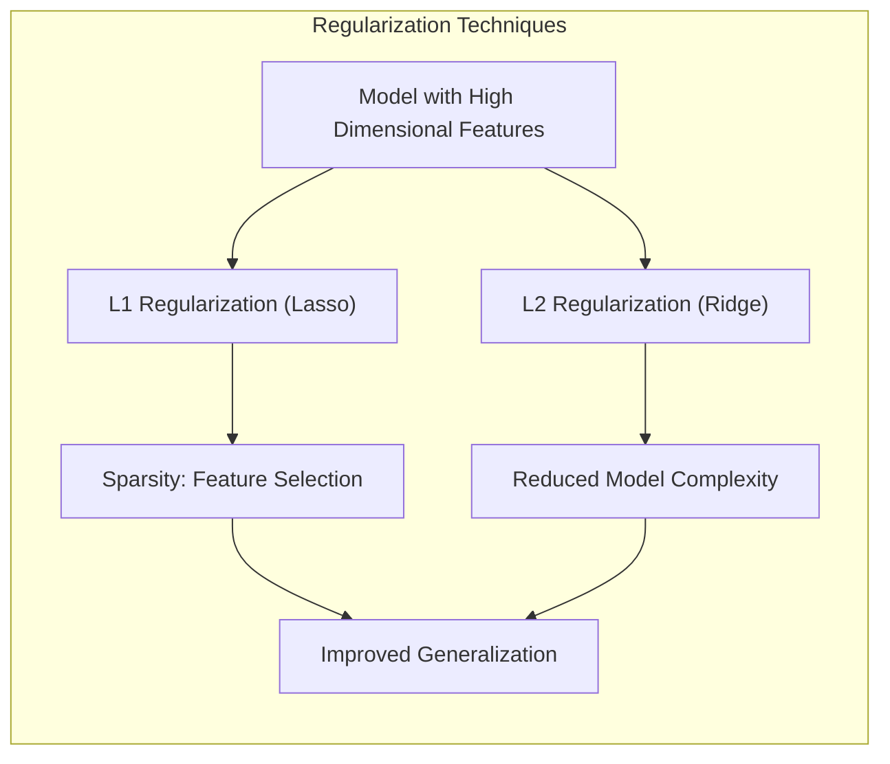
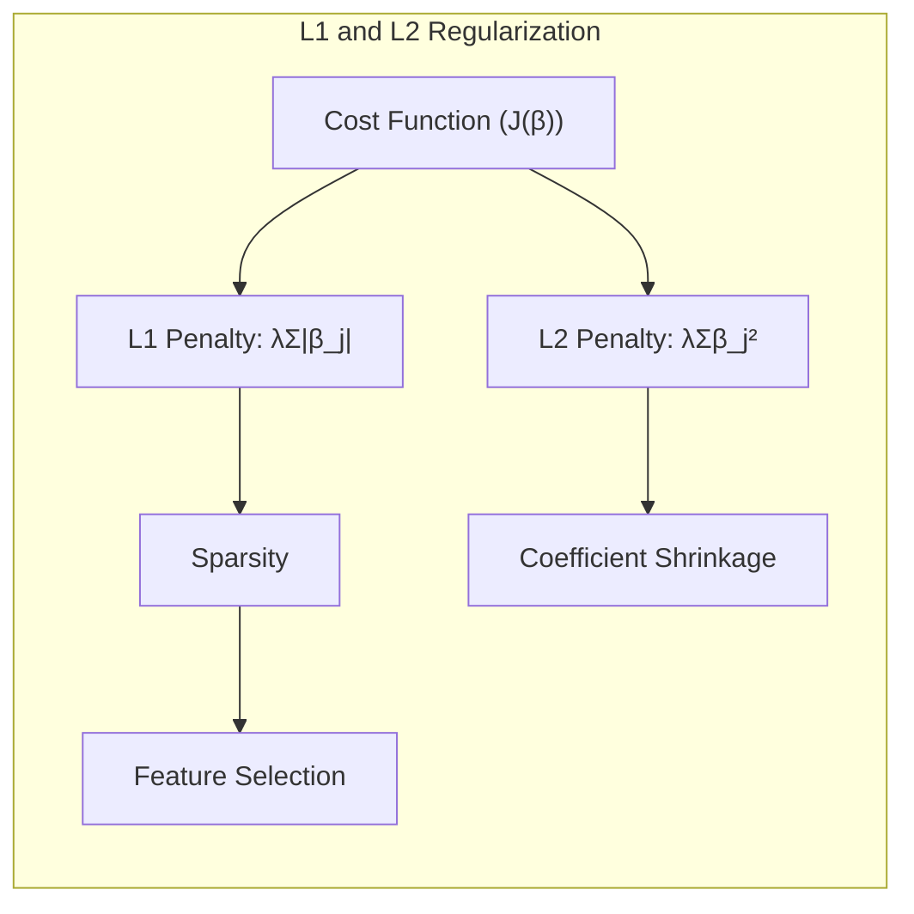
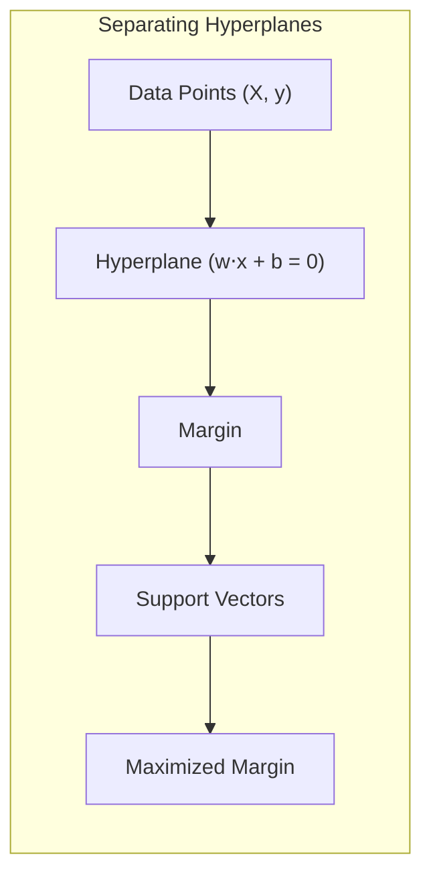
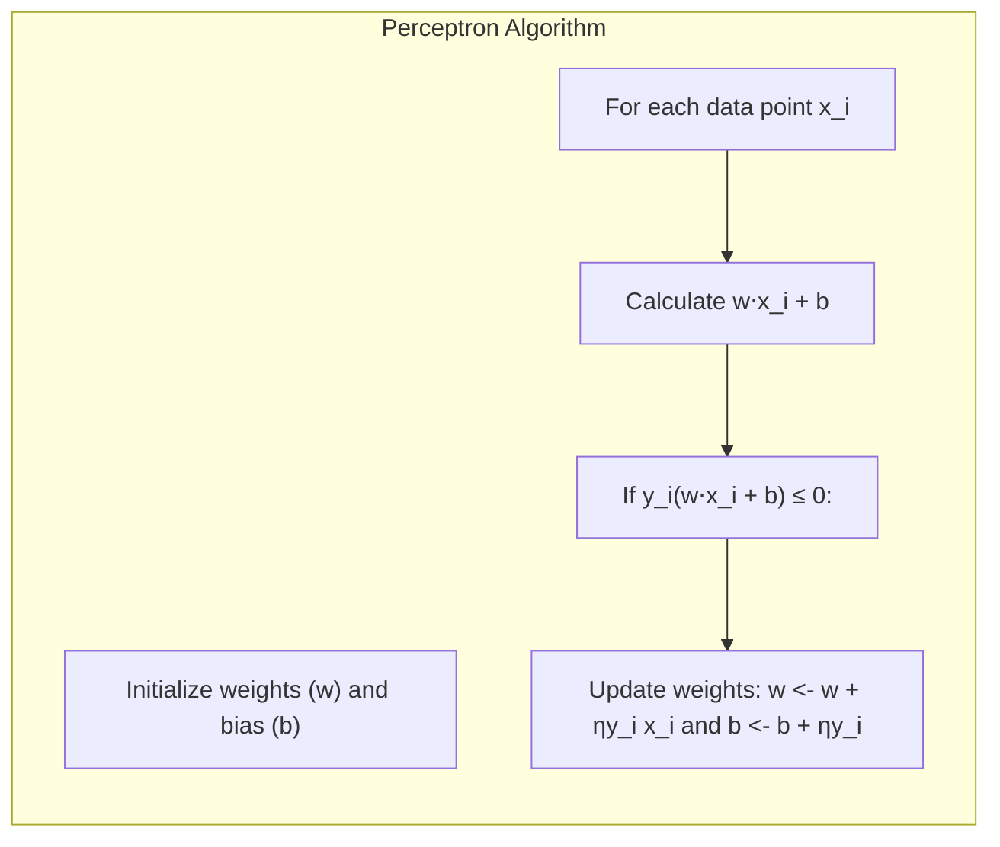

Okay, here's the augmented text with Mermaid diagrams, focusing on the mathematical and statistical concepts as requested:

## Unsupervised Screening for Feature Selection in Model Assessment

<imagem: Um mapa mental complexo que ilustra a hierarquia dos métodos de seleção de variáveis, com um ramo dedicado aos métodos supervisionados (e.g., regularização L1, L2) e outro para os não supervisionados (e.g., análise de componentes principais, métodos de clustering), mostrando como esses métodos convergem para um modelo final.>

### Introdução

A capacidade de generalização de um método de aprendizado, ou seja, a sua performance em dados de teste independentes, é um aspecto crucial na prática do aprendizado de máquina [^7.1]. A avaliação desta performance guia a escolha do modelo e nos dá uma medida da qualidade do modelo selecionado. Este capítulo aborda técnicas chave para a avaliação de performance e como elas são usadas para selecionar modelos, explorando inicialmente a relação entre viés, variância e complexidade do modelo. No contexto específico de seleção de variáveis, o screening não supervisionado é uma ferramenta útil, embora não totalmente abordada nos tópicos fornecidos [^7.2]. Vamos expandir sobre esse conceito no presente capítulo. O screening não supervisionado, por sua natureza, não considera diretamente as labels das classes ou variáveis target, mas busca identificar padrões e estruturas inerentes nos dados.

### Conceitos Fundamentais

**Conceito 1: O Problema da Classificação e a Generalização**

Em problemas de classificação, o objetivo é atribuir uma instância a uma categoria específica, dado um conjunto de atributos. Um modelo com boa generalização consegue realizar essa tarefa de forma eficaz em dados não vistos anteriormente. Métodos lineares de classificação, como LDA e Regressão Logística, buscam encontrar fronteiras de decisão lineares que separam as diferentes classes, o que pode levar a trade-offs entre **viés e variância** [^7.2]. Um modelo complexo pode se ajustar bem aos dados de treinamento, levando a um baixo viés, mas com alta variância, ou seja, grande sensibilidade a pequenas variações nos dados de treinamento e pouca capacidade de generalizar. Um modelo muito simples, por outro lado, terá alto viés e baixa variância, subajustando os dados e perdendo informações importantes.

**Lemma 1: Decomposição do Erro Quadrático Médio em Viés e Variância**

O erro quadrático médio (MSE) de um modelo preditivo pode ser decomposto em três componentes: o ruído irredutível, o viés ao quadrado e a variância. A formulação desse lemma é:
$$
Err(x_0) = E[(Y - \hat{f}(x_0))^2 | X = x_0] = \sigma^2 + Bias^2(\hat{f}(x_0)) + Var(\hat{f}(x_0)),
$$
onde $\sigma^2$ representa o ruído irredutível, $Bias(\hat{f}(x_0)) = E[\hat{f}(x_0)] - f(x_0)$ o viés e $Var(\hat{f}(x_0)) = E[(\hat{f}(x_0) - E[\hat{f}(x_0)])^2]$ a variância [^7.3]. O objetivo é encontrar um modelo que minimize esse erro total, considerando a compensação entre viés e variância. $\blacksquare$


> 💡 **Exemplo Numérico:** Suponha que temos um modelo de regressão que tenta prever a altura de pessoas com base em seu peso. Vamos simular dados para ilustrar o tradeoff.
```python
import numpy as np
import matplotlib.pyplot as plt

# Generate synthetic data
np.random.seed(42)
X = np.linspace(50, 120, 50)  # Weight
true_slope = 0.05
true_intercept = 140
Y = true_slope * X + true_intercept + np.random.normal(0, 5, 50) # Height

# Simple linear model
def linear_model(x, slope, intercept):
    return slope * x + intercept

# Complex model (polynomial)
def polynomial_model(x, coefs):
    return np.polyval(coefs, x)

# Fit simple model with least squares
slope_simple = np.cov(X, Y)[0,1]/np.var(X)
intercept_simple = np.mean(Y) - slope_simple*np.mean(X)

# Fit a 3rd order polynomial
coefs_complex = np.polyfit(X,Y,3)


# Calculate predictions
y_simple_pred = linear_model(X, slope_simple, intercept_simple)
y_complex_pred = polynomial_model(X, coefs_complex)

# Calculate MSE
mse_simple = np.mean((Y - y_simple_pred)**2)
mse_complex = np.mean((Y - y_complex_pred)**2)


print(f"MSE (Simple): {mse_simple:.2f}")
print(f"MSE (Complex): {mse_complex:.2f}")

# Generate test data (slightly different from train)
X_test = np.linspace(55,115,50)
Y_test = true_slope * X_test + true_intercept + np.random.normal(0, 5, 50)

y_simple_test_pred = linear_model(X_test, slope_simple, intercept_simple)
y_complex_test_pred = polynomial_model(X_test, coefs_complex)

# Calculate MSE on test data
mse_simple_test = np.mean((Y_test - y_simple_test_pred)**2)
mse_complex_test = np.mean((Y_test - y_complex_test_pred)**2)

print(f"MSE Test (Simple): {mse_simple_test:.2f}")
print(f"MSE Test (Complex): {mse_complex_test:.2f}")


# Plotting
plt.figure(figsize=(10, 5))
plt.scatter(X, Y, label='Data de Treino')
plt.plot(X, y_simple_pred, color='red', label='Modelo Simples')
plt.plot(X, y_complex_pred, color='green', label='Modelo Complexo')
plt.xlabel('Peso (kg)')
plt.ylabel('Altura (cm)')
plt.title('Trade-off entre Viés e Variância')
plt.legend()
plt.show()


plt.figure(figsize=(10, 5))
plt.scatter(X_test, Y_test, label='Dados de Teste')
plt.plot(X_test, y_simple_test_pred, color='red', label='Modelo Simples')
plt.plot(X_test, y_complex_test_pred, color='green', label='Modelo Complexo')
plt.xlabel('Peso (kg)')
plt.ylabel('Altura (cm)')
plt.title('Performance em Dados de Teste')
plt.legend()
plt.show()

```
> Nesse exemplo, o modelo simples (linear) pode ter um viés maior (não capturar algumas nuances), enquanto o modelo complexo (polinomial) pode se ajustar muito aos dados de treino, apresentando uma variância mais alta e uma generalização pior (maior MSE no teste). O erro irredutível é causado pelo ruído nos dados.

**Conceito 2: Linear Discriminant Analysis (LDA)**

LDA é uma técnica para classificação que busca projetar os dados em um espaço de menor dimensão de forma que as classes fiquem o mais separadas possível. As premissas básicas do LDA incluem a normalidade multivariada das classes e a igualdade das matrizes de covariância. A função discriminante linear obtida pelo LDA serve para definir fronteiras de decisão entre as classes [^7.3].


**Corolário 1: A Relação entre Projeções LDA e Subespaços Reduzidos**

Sob as premissas do LDA, a função discriminante linear pode ser vista como uma projeção dos dados em um subespaço de dimensão reduzida, maximizando a razão entre a variância entre classes e a variância intra-classe. Isso resulta em uma representação dos dados que é otimizada para a classificação, reduzindo a dimensionalidade sem perda significativa de informação relevante para a tomada de decisão. $\blacksquare$

> 💡 **Exemplo Numérico:** Imagine um conjunto de dados com duas classes, cada uma com duas features. As features para cada classe tem uma distribuição gaussiana bidimensional, e a classe 1 tem média $\mu_1 = [2, 2]$ e a classe 2 tem média $\mu_2 = [4, 4]$. Ambas as classes tem a mesma matriz de covariância $\Sigma = \begin{bmatrix} 1 & 0.5 \\ 0.5 & 1 \end{bmatrix}$. LDA vai projetar os dados em uma dimensão, maximizando a separação entre os pontos das classes, e este eixo resultante será o discriminante linear.
> ```python
> import numpy as np
> import matplotlib.pyplot as plt
> from sklearn.discriminant_analysis import LinearDiscriminantAnalysis
>
> # Generate synthetic data
> np.random.seed(42)
> mean1 = [2, 2]
> mean2 = [4, 4]
> cov = [[1, 0.5], [0.5, 1]]
> X1 = np.random.multivariate_normal(mean1, cov, 100)
> X2 = np.random.multivariate_normal(mean2, cov, 100)
> X = np.concatenate((X1, X2))
> y = np.array([0] * 100 + [1] * 100)
>
> # Apply LDA
> lda = LinearDiscriminantAnalysis()
> X_lda = lda.fit_transform(X, y)
>
> # Plotting the data and the projection
> plt.figure(figsize=(8, 6))
> plt.scatter(X[:, 0], X[:, 1], c=y, cmap='viridis', edgecolors='k', label = 'Original Data')
>
> # Calculate the direction of the projection
> coef = lda.coef_
> slope = -coef[0,0]/coef[0,1]
>
> # Define the projection line
> x_proj = np.linspace(np.min(X[:,0]),np.max(X[:,0]),100)
> y_proj = slope*x_proj
>
> # Plot the projection line
> plt.plot(x_proj, y_proj, color = 'red', label='LDA Projection Line')
> plt.xlabel('Feature 1')
> plt.ylabel('Feature 2')
> plt.title('LDA Projection')
> plt.legend()
> plt.show()
>
> plt.figure(figsize=(8,6))
> plt.scatter(X_lda, np.zeros_like(X_lda), c=y, cmap='viridis', edgecolors='k', label = 'Projected Data')
> plt.xlabel('LDA Component')
> plt.title('Data Projected onto one dimension')
> plt.legend()
> plt.show()
> ```
> Aqui podemos ver que LDA projeta os dados em uma dimensão, e os pontos se tornam mais separados nesta projeção. A direção da projeção é determinada pelos coeficientes calculados pelo LDA.

**Conceito 3: Logistic Regression e Maximização da Verossimilhança**

Logistic Regression é outro método linear de classificação que modela a probabilidade de uma instância pertencer a uma classe através de uma função logística (sigmoid). A função logit, que é o logaritmo da razão de chances (odds), é modelada como uma função linear das variáveis preditoras. Os parâmetros do modelo são estimados via maximização da verossimilhança, ou seja, maximizando a probabilidade dos dados observados dado o modelo [^7.4]. Este modelo, ao contrário do LDA, não assume normalidade dos dados, mas sim a distribuição de Bernoulli para a variável resposta.


> 💡 **Exemplo Numérico:** Vamos simular um problema de classificação binária para ilustrar a Regressão Logística. Suponha que queremos classificar e-mails como "spam" ou "não spam" baseado em duas features: número de palavras e presença de links.
```python
import numpy as np
import matplotlib.pyplot as plt
from sklearn.linear_model import LogisticRegression
from sklearn.model_selection import train_test_split
from sklearn.metrics import accuracy_score

# Generate synthetic data
np.random.seed(42)
n_samples = 200
X = np.random.rand(n_samples, 2) * 10
y = (1 / (1 + np.exp(-(0.5 * X[:, 0] - 0.3 * X[:, 1] + 1))) > 0.5).astype(int)

# Split data into train and test
X_train, X_test, y_train, y_test = train_test_split(X, y, test_size=0.3, random_state=42)

# Train a Logistic Regression model
logistic_model = LogisticRegression()
logistic_model.fit(X_train, y_train)

# Make predictions
y_pred = logistic_model.predict(X_test)

# Calculate accuracy
accuracy = accuracy_score(y_test, y_pred)
print(f"Accuracy: {accuracy:.2f}")

# Visualize decision boundary
x_min, x_max = X[:, 0].min() - 1, X[:, 0].max() + 1
y_min, y_max = X[:, 1].min() - 1, X[:, 1].max() + 1
xx, yy = np.meshgrid(np.linspace(x_min, x_max, 100),
                     np.linspace(y_min, y_max, 100))
Z = logistic_model.predict(np.c_[xx.ravel(), yy.ravel()])
Z = Z.reshape(xx.shape)

plt.figure(figsize=(8, 6))
plt.contourf(xx, yy, Z, cmap=plt.cm.RdBu, alpha=0.8)
plt.scatter(X[:, 0], X[:, 1], c=y, cmap=plt.cm.RdBu, edgecolors='k')
plt.xlabel("Number of words")
plt.ylabel("Presence of links")
plt.title("Logistic Regression Decision Boundary")
plt.show()

print(f"Coefficients: {logistic_model.coef_}")
print(f"Intercept: {logistic_model.intercept_}")
```
> Nesse exemplo, o modelo de regressão logística aprende a fronteira de decisão para separar as classes, usando a função sigmóide para estimar a probabilidade de um e-mail ser spam. A acurácia nos dados de teste indica o quão bem o modelo generaliza. Os coeficientes mostram a influência das features na decisão.

> ⚠️ **Nota Importante**: Modelos lineares são eficientes para dados linearmente separáveis, mas podem não capturar relações não lineares.
> ❗ **Ponto de Atenção**: Em problemas com classes desbalanceadas, pode ser necessário ajustar os pesos das classes na regressão logística para obter melhores resultados.
> ✔️ **Destaque**: A regressão logística estima as probabilidades de classe diretamente, o que a torna útil em aplicações onde essas probabilidades são importantes.

### Regressão Linear e Mínimos Quadrados para Classificação

<imagem: Um diagrama de fluxo detalhado mostrando como a regressão linear de matrizes indicadoras leva a decisões de classificação. O diagrama inclui etapas como codificação de classes, estimativa de coeficientes via mínimos quadrados, aplicação de regras de decisão, e comparação com métodos probabilísticos, como regressão logística.>


A regressão linear pode ser adaptada para problemas de classificação através da regressão de uma matriz de indicadores. Nesse método, cada classe é representada por uma variável indicadora que assume o valor 1 quando a instância pertence àquela classe e 0 caso contrário. Um modelo de regressão linear é então ajustado a essas variáveis indicadoras, e as predições são convertidas em decisões de classe através de alguma regra de decisão. Por exemplo, a classe com o maior valor de predição pode ser selecionada como a classe predita [^7.2].

Este método tem limitações. A regressão de indicadores não modela diretamente a probabilidade de cada classe. Em vez disso, ela busca ajustar um modelo linear aos indicadores de classe, o que pode levar a resultados fora do intervalo [0,1] para problemas de classificação binária. Além disso, os mínimos quadrados podem ser sensíveis a outliers, e a covariância entre os indicadores de classe pode influenciar o ajuste do modelo [^7.3].

**Lemma 2: Equivalência entre Projeções Lineares e Discriminantes Lineares**

Em condições específicas, as projeções nos hiperplanos de decisão gerados pela regressão linear da matriz de indicadores podem ser equivalentes às obtidas com LDA, especialmente quando as classes são aproximadamente esféricas e têm variâncias semelhantes. A prova deste lemma envolve a demonstração de que os coeficientes obtidos por mínimos quadrados se relacionam com as médias de cada classe e a matriz de covariância combinada [^7.3]. $\blacksquare$

> 💡 **Exemplo Numérico:** Vamos simular um caso simples de classificação binária, onde podemos ajustar uma regressão linear para as classes usando um código indicador, e comparar com LDA.
```python
import numpy as np
import matplotlib.pyplot as plt
from sklearn.linear_model import LinearRegression
from sklearn.discriminant_analysis import LinearDiscriminantAnalysis
from sklearn.metrics import accuracy_score

# Generate synthetic data
np.random.seed(42)
n_samples = 100
X = np.random.rand(n_samples, 2) * 10
y = (0.5 * X[:, 0] - 0.3 * X[:, 1] + 1 > 0).astype(int)

# Indicator matrix
indicator_matrix = np.zeros((n_samples, 2))
indicator_matrix[np.arange(n_samples), y] = 1

# Linear regression on indicator matrix
linear_reg = LinearRegression()
linear_reg.fit(X, indicator_matrix)
y_pred_linear_reg = np.argmax(linear_reg.predict(X),axis = 1)


# LDA
lda = LinearDiscriminantAnalysis()
lda.fit(X,y)
y_pred_lda = lda.predict(X)

print("Linear Regression Accuracy: ", accuracy_score(y, y_pred_linear_reg))
print("LDA Accuracy: ", accuracy_score(y, y_pred_lda))

# Visualization
x_min, x_max = X[:, 0].min() - 1, X[:, 0].max() + 1
y_min, y_max = X[:, 1].min() - 1, X[:, 1].max() + 1
xx, yy = np.meshgrid(np.linspace(x_min, x_max, 100), np.linspace(y_min, y_max, 100))
Z_linear_reg = np.argmax(linear_reg.predict(np.c_[xx.ravel(), yy.ravel()]), axis=1).reshape(xx.shape)
Z_lda = lda.predict(np.c_[xx.ravel(), yy.ravel()]).reshape(xx.shape)

plt.figure(figsize=(12, 6))
plt.subplot(1, 2, 1)
plt.contourf(xx, yy, Z_linear_reg, cmap=plt.cm.RdBu, alpha=0.8)
plt.scatter(X[:, 0], X[:, 1], c=y, cmap=plt.cm.RdBu, edgecolors='k')
plt.title('Linear Regression Decision Boundary')

plt.subplot(1, 2, 2)
plt.contourf(xx, yy, Z_lda, cmap=plt.cm.RdBu, alpha=0.8)
plt.scatter(X[:, 0], X[:, 1], c=y, cmap=plt.cm.RdBu, edgecolors='k')
plt.title('LDA Decision Boundary')
plt.show()

```
> Aqui, vemos que a regressão linear nas matrizes indicadoras pode gerar resultados comparáveis aos do LDA, especialmente quando as classes são aproximadamente esféricas. As fronteiras de decisão são similares, como esperado pela equivalência entre os dois métodos sob certas condições.

**Corolário 2: Simplificação da Análise do Modelo com a Equivalência**

Este corolário estabelece que, sob certas condições, a análise e otimização de modelos de regressão linear para classificação podem ser simplificadas utilizando os conceitos e resultados obtidos da análise discriminante linear, facilitando a interpretação e comparação entre os métodos [^7.3].

A regressão logística, como mencionado anteriormente, oferece uma abordagem mais natural para a modelagem de probabilidades de classe, evitando os problemas de extrapolação fora do intervalo [0,1] que podem ocorrer na regressão de indicadores [^7.4]. No entanto, em cenários onde a principal preocupação é a fronteira de decisão linear e não as probabilidades, a regressão de indicadores pode ser suficiente e computacionalmente mais eficiente [^7.2].

### Métodos de Seleção de Variáveis e Regularização em Classificação

<imagem: Um mapa mental que ilustra a hierarquia dos métodos de regularização em modelos de classificação, com foco em técnicas de regularização L1 e L2. O mapa mental mostra como a regularização L1 promove a sparsity, enquanto a regularização L2 reduz a complexidade do modelo, ambos visando melhorar a generalização.>


A seleção de variáveis é um passo crucial para lidar com conjuntos de dados de alta dimensionalidade, onde o número de variáveis preditoras é grande. A regularização, por sua vez, é uma técnica utilizada para evitar overfitting, penalizando a complexidade do modelo. Métodos de regularização, como penalizações L1 (Lasso) e L2 (Ridge), podem ser combinados em modelos logísticos para controle de sparsity e estabilidade [^7.5].

A penalização L1 adiciona à função de custo um termo proporcional à soma dos valores absolutos dos coeficientes, promovendo soluções esparsas, ou seja, forçando alguns coeficientes a serem exatamente zero [^7.4.4]. Isso resulta na seleção de um subconjunto de variáveis relevantes para o modelo. A penalização L2 adiciona um termo proporcional à soma dos quadrados dos coeficientes, reduzindo a magnitude dos coeficientes e suavizando a função de decisão [^7.4.4].


**Lemma 3: Penalização L1 e Sparsity em Classificação Logística**

A penalização L1, ao adicionar um termo proporcional à soma dos valores absolutos dos coeficientes à função de custo da regressão logística, leva a uma solução onde muitos coeficientes são exatamente zero. A prova desse lemma envolve mostrar que a não-diferenciabilidade do termo L1 na origem promove esse comportamento, convergindo para soluções esparsas [^7.4.4]. $\blacksquare$

**Prova do Lemma 3:** A função de custo regularizada na regressão logística com penalização L1 é dada por
$$
J(\beta) = -\sum_{i=1}^{N} [y_i \log(p(x_i)) + (1-y_i)\log(1-p(x_i))] + \lambda \sum_{j=1}^{p}|\beta_j|,
$$
onde $p(x_i)$ é a probabilidade estimada da classe para a instância $x_i$, e $\lambda$ é o parâmetro de regularização. A não-diferenciabilidade do termo $\lambda \sum_{j=1}^{p}|\beta_j|$ na origem força alguns coeficientes a se tornarem zero quando o $\lambda$ é suficientemente grande, promovendo a esparsidade. $\blacksquare$

> 💡 **Exemplo Numérico:** Vamos usar a Regressão Logística com Regularização L1 (Lasso) e L2 (Ridge), comparando os resultados em um dataset simulado.
```python
import numpy as np
import matplotlib.pyplot as plt
from sklearn.linear_model import LogisticRegression
from sklearn.model_selection import train_test_split
from sklearn.metrics import accuracy_score
from sklearn.preprocessing import StandardScaler

# Generate synthetic data with 10 features, few relevant
np.random.seed(42)
n_samples = 100
n_features = 10
X = np.random.rand(n_samples, n_features)
true_coef = np.array([0.8, -0.5, 0.3, 0, 0, 0, 0, 0, 0, 0])  # Only first 3 features are relevant
y = (np.dot(X, true_coef) + np.random.normal(0, 0.5, n_samples) > 0).astype(int)
# Standardize the features
scaler = StandardScaler()
X = scaler.fit_transform(X)

# Split data into training and test sets
X_train, X_test, y_train, y_test = train_test_split(X, y, test_size=0.3, random_state=42)

# Logistic Regression with L1 (Lasso)
lasso_model = LogisticRegression(penalty='l1', solver='liblinear', C=1.0)  # C is inverse of lambda
lasso_model.fit(X_train, y_train)
y_pred_lasso = lasso_model.predict(X_test)
accuracy_lasso = accuracy_score(y_test, y_pred_lasso)

# Logistic Regression with L2 (Ridge)
ridge_model = LogisticRegression(penalty='l2', C=1.0)
ridge_model.fit(X_train, y_train)
y_pred_ridge = ridge_model.predict(X_test)
accuracy_ridge = accuracy_score(y_test, y_pred_ridge)


print(f"Lasso Accuracy: {accuracy_lasso:.2f}")
print(f"Ridge Accuracy: {accuracy_ridge:.2f}")

print("Lasso Coefficients: ", lasso_model.coef_)
print("Ridge Coefficients: ", ridge_model.coef_)

# Varying the regularization strenght
C_values = [0.001, 0.01, 0.1, 1, 10, 100]
lasso_coefs = []
ridge_coefs = []

for c in C_values:
    lasso_model_c = LogisticRegression(penalty='l1', solver='liblinear', C=c)
    lasso_model_c.fit(X_train, y_train)
    lasso_coefs.append(lasso_model_c.coef_[0])

    ridge_model_c = LogisticRegression(penalty='l2', C=c)
    ridge_model_c.fit(X_train, y_train)
    ridge_coefs.append(ridge_model_c.coef_[0])

lasso_coefs = np.array(lasso_coefs)
ridge_coefs = np.array(ridge_coefs)

plt.figure(figsize=(12, 6))
plt.subplot(1, 2, 1)
for i in range(n_features):
    plt.plot(C_values, lasso_coefs[:,i], label=f'Feature {i}')
plt.xscale('log')
plt.xlabel('C (Regularization Strength)')
plt.ylabel('Lasso Coefficients')
plt.legend(loc='center left', bbox_to_anchor=(1, 0.5))

plt.subplot(1, 2, 2)
for i in range(n_features):
    plt.plot(C_values, ridge_coefs[:,i], label=f'Feature {i}')
plt.xscale('log')
plt.xlabel('C (Regularization Strength)')
plt.ylabel('Ridge Coefficients')
plt.legend(loc='center left', bbox_to_anchor=(1, 0.5))

plt.show()
```
> Com esse exemplo, podemos ver como a regularização L1 (Lasso) leva a coeficientes esparsos (muitos exatamente zero) e como a regularização L2 (Ridge) reduz a magnitude dos coeficientes, ambas tentando melhorar a generalização. Podemos observar como os coeficientes variam com o parâmetro de regularização C.

**Corolário 3: Implicações da Sparsity na Interpretabilidade**

A esparsidade induzida pela penalização L1 melhora a interpretabilidade do modelo, pois permite identificar quais variáveis têm um efeito significativo na predição. Isso é importante em aplicações onde a compreensão do modelo é tão relevante quanto sua capacidade preditiva [^7.4.5].

> ⚠️ **Ponto Crucial**: A combinação de penalizações L1 e L2 (Elastic Net) permite obter modelos com esparsidade e estabilidade, aproveitando as vantagens de ambas as abordagens.

### Separating Hyperplanes e Perceptrons


A ideia de maximizar a margem de separação entre as classes leva ao conceito de **hiperplanos ótimos**, que são utilizados em métodos de classificação como o **Support Vector Machine (SVM)** [^7.5.2]. A margem é a distância entre o hiperplano de decisão e os pontos de dados mais próximos de cada classe, também conhecidos como **vetores de suporte**. A maximização dessa margem resulta em modelos que são mais robustos e têm maior capacidade de generalização. O problema de encontrar o hiperplano ótimo pode ser formulado como um problema de otimização quadrática, que pode ser resolvido através do uso do dual de Wolfe.


O **Perceptron de Rosenblatt** é um algoritmo de aprendizado de máquina que busca encontrar um hiperplano que separa as classes, ou seja, uma **fronteira de decisão linear**. Sob condições de separabilidade, o algoritmo do perceptron é garantido de convergir para uma solução que separa as classes. No entanto, se os dados não forem linearmente separáveis, o algoritmo pode não convergir ou demorar muito tempo para isso [^7.5.1].

> 💡 **Exemplo Numérico:** Vamos simular um conjunto de dados linearmente separável para ilustrar o funcionamento do Perceptron.
```python
import numpy as np
import matplotlib.pyplot as plt
from sklearn.linear_model import Perceptron
from sklearn.model_selection import train_test_split
from sklearn.metrics import accuracy_score

# Generate linearly separable data
np.random.seed(42)
n_samples = 100
X = np.random.rand(n_samples, 2) * 10
y = (X[:, 0] - X[:, 1] + 2 > 0).astype(int)  # Linearly separable

# Split the data into training and test sets
X_train, X_test, y_train, y_test = train_test_split(X, y, test_size=0.3, random_state=42)

# Perceptron model
perceptron = Perceptron(max_iter=1000, tol=1e-3, eta0 = 0.1)
perceptron.fit(X_train, y_train)
y_pred = perceptron.predict(X_test)

# Calculate accuracy
accuracy = accuracy_score(y_test, y_pred)
print(f"Accuracy: {accuracy:.2f}")
print(f"Coeficients: {perceptron.coef_}")
print(f"Intercept: {perceptron.intercept_}")

# Decision Boundary visualization
x_min, x_max = X[:, 0].min() - 1, X[:, 0].max() + 1
y_min, y_max = X[:, 1].min() - 1, X[:, 1].max() + 1
xx, yy = np.meshgrid(np.linspace(x_min, x_max, 100),
                     np.linspace(y_min, y_max, 100))
Z = perceptron.predict(np.c_[xx.ravel(), yy.ravel()])
Z = Z.reshape(xx.shape)

plt.figure(figsize=(8, 6