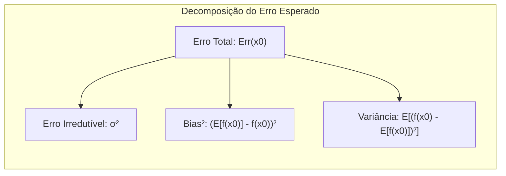
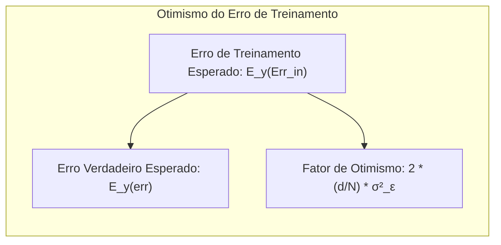
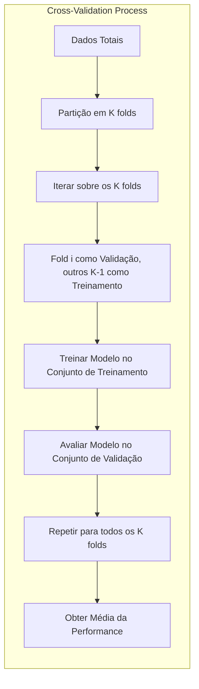
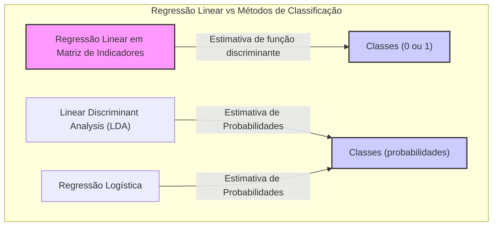
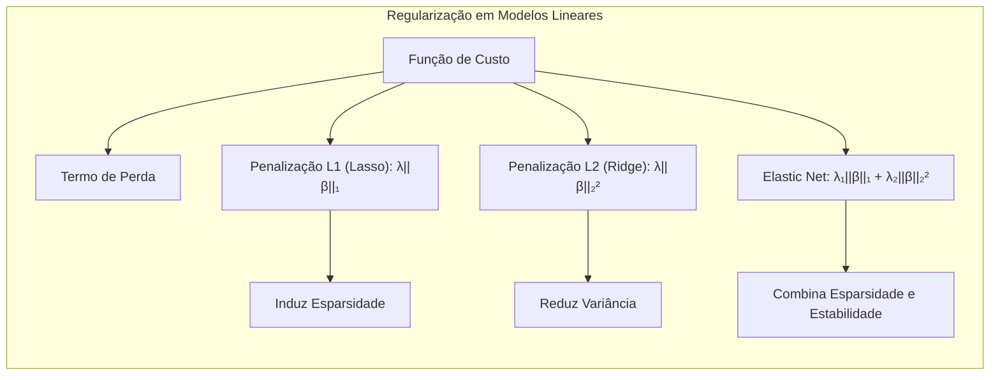
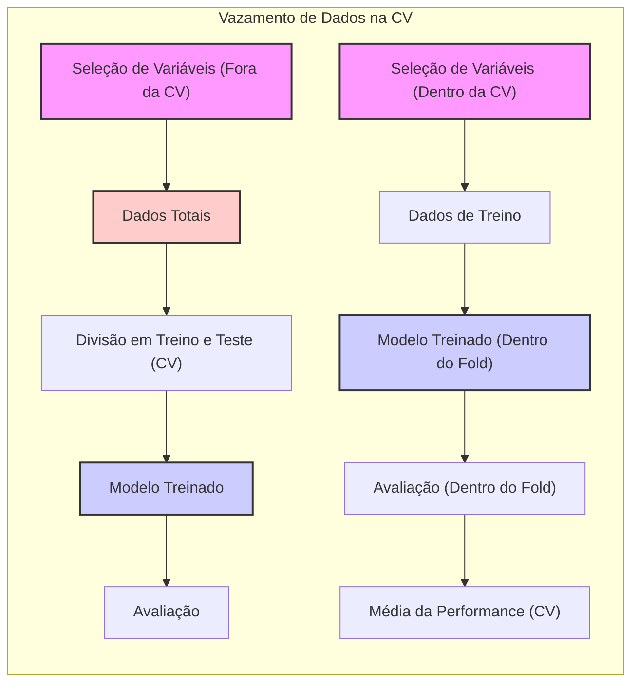

## Cross-Validation Pitfalls: A Deep Dive into Model Assessment Challenges

### Introdução

A **cross-validation (CV)** é uma técnica fundamental no aprendizado de máquina e estatística, utilizada para avaliar a capacidade de generalização de um modelo, ou seja, sua performance em dados não vistos. Embora seja uma ferramenta poderosa, a CV está sujeita a várias armadilhas que podem levar a avaliações otimistas e, consequentemente, a modelos inadequados. Este capítulo explora as complexidades e os erros comuns relacionados ao uso da cross-validation, focando em análises detalhadas, fundamentos teóricos e exemplos práticos, com base nos conceitos e informações apresentadas em [^7.1], [^7.2], [^7.3], [^7.4], [^7.5] e [^7.10].

### Conceitos Fundamentais

**Conceito 1: A necessidade da avaliação de modelos e do tradeoff Bias-Variance**
A avaliação da **generalização** é crucial, pois ela mede a capacidade do modelo de prever resultados em dados independentes [^7.1]. O modelo precisa ser capaz de adaptar-se bem aos dados de treinamento, sem se tornar excessivamente específico para eles, um fenômeno conhecido como *overfitting*. Um bom modelo deve ter um equilíbrio entre **bias** e **variância**: um modelo com alto *bias* simplifica demais a relação entre as variáveis, enquanto um modelo com alta *variância* se ajusta demais aos ruídos dos dados de treinamento, generalizando mal [^7.2]. A complexidade do modelo é um fator que impacta diretamente nesse tradeoff [^7.2].

**Lemma 1:** Dado um modelo $f(X)$ e um valor alvo $Y$, o erro esperado de previsão (Err) pode ser decomposto em três componentes: erro irredutível ($\sigma^2$), o quadrado do *bias* (Bias²) e a *variância* (Var), demonstrando o tradeoff bias-variância [^7.3]:
$$ Err(x_0) = E[(Y - f(x_0))^2|X=x_0] = \sigma^2 + [Ef(x_0) - f(x_0)]^2 + E[f(x_0) - Ef(x_0)]^2 = \sigma^2 + Bias^2 + Var $$
Essa decomposição mostra que, ao tentar reduzir o *bias*, frequentemente aumentamos a *variância* e vice-versa [^7.3]. $\blacksquare$

> 💡 **Exemplo Numérico:** Suponha que temos um modelo de regressão linear simples para prever o preço de casas ($Y$) com base na área ($X$).
>
> 1.  Um modelo muito simples, como $f(X) = \beta_0$, pode ter alto bias, pois ignora a relação entre área e preço, resultando em um erro de generalização alto (ex: $Err = 20000$).  Neste caso, digamos que $\sigma^2 = 5000$, $Bias^2 = 10000$, $Var = 5000$.
> 2. Um modelo muito complexo que ajusta cada ponto de treinamento ($f(X) = \beta_0 + \beta_1 X + \beta_2 X^2 + ...$), terá baixo *bias* no conjunto de treinamento, mas alta *variância*, generalizando mal para novas casas (ex: $Err = 18000$, com $\sigma^2 = 5000$, $Bias^2 = 1000$, $Var = 12000$).
> 3. Um modelo equilibrado ($f(X) = \beta_0 + \beta_1 X$) pode ter um erro de generalização menor (ex: $Err = 10000$, com $\sigma^2 = 5000$, $Bias^2 = 2500$, $Var = 2500$).
>
> Este exemplo ilustra como os componentes do erro se somam e o tradeoff entre *bias* e *variância*. Um modelo simples tem um *bias* alto e baixa *variância*, enquanto um modelo complexo tem baixo *bias* e alta *variância*. O objetivo é encontrar um modelo com o menor erro de generalização, onde esses componentes são equilibrados.

**Conceito 2: Erro de treinamento e seu otimismo**
O **erro de treinamento**, obtido ao avaliar o modelo nos mesmos dados usados para o treinamento, é otimista em relação ao verdadeiro erro de generalização [^7.2]. Métodos de ajuste, como o ajuste de mínimos quadrados, tendem a se adaptar demais aos dados de treinamento, reduzindo o erro de treinamento mas potencialmente aumentando o erro de generalização [^7.4]. O *otimismo* do erro de treinamento pode ser definido como a diferença entre o erro no conjunto de dados de treinamento e o erro esperado, sendo este último mais indicativo da performance do modelo em novos dados [^7.4].

**Corolário 1:** O *otimismo* do erro de treinamento, sob condições de modelos lineares com erros aditivos, é diretamente proporcional ao número de parâmetros ($d$) e inversamente proporcional ao tamanho da amostra ($N$), como dado por [^7.4]:
$$ E_y(Err_{in}) = E_y(err) + 2 \cdot \frac{d}{N} \sigma_{\epsilon}^2 $$
Essa relação enfatiza como o aumento da complexidade do modelo (mais parâmetros) aumenta o *otimismo*, destacando a necessidade de métodos de avaliação como a cross-validation [^7.4].

> 💡 **Exemplo Numérico:** Considere um modelo de regressão linear com 5 parâmetros ($d=5$) ajustado a um conjunto de dados com 50 amostras ($N=50$). Suponha que a variância do erro seja $\sigma_{\epsilon}^2 = 4$.
>
>  1. O erro esperado de treinamento é $E_y(err)$.
>  2. O otimismo do erro de treinamento é $2 \cdot \frac{5}{50} \cdot 4 = 0.8$.
>  3. Portanto, o erro esperado no conjunto de treinamento é $E_y(Err_{in}) = E_y(err) + 0.8$. Isso significa que o erro no conjunto de treinamento será, em média, 0.8 unidades menor que o erro esperado em um novo conjunto de dados.
>
>   Se aumentarmos o número de parâmetros para 10, o otimismo passa a ser $2 \cdot \frac{10}{50} \cdot 4 = 1.6$, demonstrando como aumentar a complexidade do modelo leva a um erro de treinamento cada vez mais otimista.  Isso ilustra porque o erro de treinamento sozinho não é uma boa métrica para avaliar a capacidade de generalização do modelo.

**Conceito 3: O papel crucial da cross-validation**
A cross-validation é uma abordagem para estimar o erro de generalização, particionando os dados em subconjuntos de treinamento e validação repetidamente [^7.10]. Ao avaliar o modelo em dados que não foram usados diretamente no ajuste, a CV fornece uma estimativa menos otimista do erro de generalização [^7.10]. Os tipos mais comuns de CV incluem a K-fold CV, onde os dados são divididos em *K* partes, e leave-one-out (LOOCV), onde cada observação é usada como validação uma vez [^7.10].

> ⚠️ **Nota Importante**: A escolha entre diferentes tipos de CV (K-fold, LOOCV) impacta o *bias* e a variância da estimativa do erro [^7.10].
> ❗ **Ponto de Atenção**: A aplicação incorreta da cross-validation, especialmente em pipelines complexos, pode levar a resultados enganosos e superotimistas [^7.10.2].
> ✔️ **Destaque**:  A cross-validation estima o erro esperado (Err) e não o erro condicional em um dado conjunto de treinamento (ErrT). [^7.12]

### Regressão Linear e Mínimos Quadrados para Classificação

A aplicação de regressão linear em uma matriz de indicadores para problemas de classificação pode parecer uma solução simples, mas apresenta limitações importantes. Ao aplicar regressão linear diretamente, a relação entre a saída e as classes pode ser mal-interpretada, especialmente quando as classes não são bem separadas ou balanceadas. O uso de **mínimos quadrados** para estimar os parâmetros do modelo de regressão linear também pode levar a previsões fora do intervalo [0,1] [^7.2], que não são interpretáveis como probabilidades. Embora a regressão linear possa criar uma fronteira de decisão linear, ela carece de fundamentos probabilísticos explícitos, que são a base de métodos como o **Linear Discriminant Analysis (LDA)** e a **Regressão Logística** [^7.3], [^7.4].

**Lemma 2:** Em algumas condições, a regressão linear em matriz de indicadores e LDA são equivalentes, especialmente quando as classes compartilham covariâncias iguais. No entanto, a regressão linear não estima diretamente probabilidades, mas sim uma função discriminante [^7.3].
Essa equivalência, sob certas condições, demonstra como os métodos de classificação linear compartilham mecanismos subjacentes, mas também destaca a importância de um modelo mais adequado e a interpretação de probabilidades [^7.3]. $\blacksquare$

**Corolário 2:** A regressão linear em matriz de indicadores é sensível a *outliers* e pode levar a estimativas instáveis de probabilidades quando as classes não estão balanceadas, demonstrando sua inadequação em cenários específicos, onde métodos como regressão logística ou LDA seriam mais apropriados [^7.4], [^7.2].
Essa observação ressalta as limitações do uso direto da regressão linear para classificação, mostrando a necessidade de métodos mais robustos e especificamente projetados para essa tarefa.

Mencione comparações e limitações:

*   "A regressão linear em matriz de indicadores pode ser computacionalmente mais simples, mas a regressão logística fornece estimativas de probabilidade mais estáveis, especialmente quando existem classes não balanceadas" [^7.4].
*   "O método de regressão linear não modela a probabilidade diretamente, podendo levar a extrapolações não interpretáveis fora do intervalo de 0 a 1, ao contrário da regressão logística" [^7.4].

> 💡 **Exemplo Numérico:** Considere um problema de classificação binária com duas classes, 'A' e 'B', onde 'A' é codificada como 0 e 'B' como 1.
>
>  1. **Regressão Linear:** Se aplicarmos regressão linear, o modelo pode tentar aproximar a relação entre os preditores e os rótulos 0 e 1, mas pode gerar previsões fora desse intervalo (ex: -0.2 ou 1.3). Essas previsões não podem ser interpretadas como probabilidades.
>  2.  **Regressão Logística:** A regressão logística usa a função sigmoide para mapear a saída para o intervalo (0,1), garantindo que a saída seja interpretável como uma probabilidade da amostra pertencer à classe 'B'. Uma previsão de 0.7 indica que há 70% de chance de uma dada amostra pertencer à classe 'B'.
>  3. **Classes Desbalanceadas:** Se a classe 'A' tiver 90% das amostras e a classe 'B' 10%, a regressão linear pode ser muito influenciada pela classe majoritária, levando a resultados instáveis. A regressão logística pode lidar melhor com esse desbalanceamento, já que o modelo é projetado para estimar probabilidades e não apenas uma função discriminante linear.
>
> Este exemplo demonstra que, embora a regressão linear possa ser utilizada para classificação, ela possui sérias limitações, especialmente na interpretação dos resultados e no tratamento de classes desbalanceadas. A regressão logística, por outro lado, fornece estimativas de probabilidade que são diretamente interpretáveis e mais estáveis, sendo mais adequada para problemas de classificação.

### Métodos de Seleção de Variáveis e Regularização em Classificação

A seleção de variáveis e a regularização são técnicas cruciais para lidar com problemas de alta dimensionalidade, ou seja, quando o número de variáveis (preditores) é muito grande em relação ao número de amostras. A **regularização** adiciona termos de penalidade à função de perda, controlando a complexidade do modelo e prevenindo o *overfitting*. A penalização **L1 (Lasso)** induz a esparsidade, zerando alguns coeficientes e realizando seleção de variáveis [^7.3], [^7.5]. A penalização **L2 (Ridge)** diminui a magnitude dos coeficientes, tornando o modelo mais estável e reduzindo a variância [^7.5]. A combinação das duas penalidades, **Elastic Net**, busca um equilíbrio entre esparsidade e estabilidade [^7.5].

**Lemma 3:** A penalização L1 na regressão logística leva a coeficientes esparsos, onde apenas as variáveis mais importantes têm coeficientes diferentes de zero [^7.5]:
$$ L( \beta) = - \sum_i [y_i \log(\sigma(\mathbf{x_i}^T\beta)) + (1-y_i) \log(1-\sigma(\mathbf{x_i}^T\beta))] + \lambda \sum_{j=1}^p |\beta_j| $$
Nessa fórmula, o segundo termo ($ \lambda \sum_{j=1}^p |\beta_j| $) é a penalização L1 que força alguns $\beta_j$ a serem exatamente zero, realizando a seleção de variáveis. $\blacksquare$

**Prova do Lemma 3:** A prova detalhada deste lemma envolve a análise das condições de otimalidade da função de custo penalizada. Em geral, a penalização L1 leva a soluções esparsas, pois ela busca minimizar a norma L1 dos coeficientes, incentivando que alguns sejam zerados. A penalização L2, por outro lado, busca diminuir a magnitude dos coeficientes, mas sem zerá-los, garantindo estabilidade [^7.4], [^7.5]. $\blacksquare$

**Corolário 3:** A esparsidade induzida pela penalização L1 não apenas reduz a complexidade do modelo, mas também melhora sua interpretabilidade, identificando quais variáveis são mais importantes na predição [^7.5].
Essa propriedade é muito útil em muitos cenários onde o entendimento do modelo é tão importante quanto sua performance.

> ⚠️ **Ponto Crucial**: A escolha entre L1, L2 ou Elastic Net depende das características do problema. L1 é preferível quando a esparsidade é desejada, enquanto L2 é útil para reduzir a variância em situações de alta dimensionalidade. O Elastic Net tenta balancear esses dois objetivos [^7.5].

> 💡 **Exemplo Numérico:** Vamos considerar um cenário de classificação com 100 preditores e 200 amostras.
>
>   1. **Regressão Logística sem Regularização:** O modelo pode apresentar *overfitting*, ajustando-se demais ao ruído dos dados de treinamento.
>   2. **Regressão Logística com Penalização L1 (Lasso):** Aplicando a regularização L1 com um $\lambda = 0.1$, os coeficientes de alguns preditores são forçados a zero. Suponha que apenas 20 preditores resultem com coeficientes diferentes de zero. Isso indica que apenas esses 20 preditores são relevantes para a classificação, melhorando a interpretabilidade do modelo e evitando o overfitting.
>   3. **Regressão Logística com Penalização L2 (Ridge):** Aplicando a regularização L2 com um $\lambda = 0.1$, os coeficientes de todos os 100 preditores são reduzidos em magnitude, mas nenhum é exatamente zero. Isso torna o modelo mais estável e menos sensível a pequenas variações nos dados de treinamento, reduzindo a variância.
>   4.  **Elastic Net:** Usando um Elastic Net com $\lambda_1 = 0.05$ e $\lambda_2 = 0.05$, podemos obter um modelo que combina esparsidade (alguns coeficientes zero) com a redução da magnitude dos coeficientes (todos menores em comparação com um modelo sem regularização).
>   | Método            | Número de Preditor não-zero | Estabilidade | Interpretabilidade |
>   |--------------------|--------------------------|-----------------|-------------------|
>   | Sem Regularização | 100                      | Baixa           | Baixa             |
>   | Lasso ($\lambda$=0.1) | 20                       | Média           | Alta              |
>   | Ridge ($\lambda$=0.1)  | 100                      | Alta            | Média            |
>   | Elastic Net ($\lambda_1$=0.05, $\lambda_2$=0.05)       | 50      | Média           | Média            |
>
> Este exemplo ilustra como as penalizações L1 e L2 afetam os coeficientes do modelo. A penalização L1 gera esparsidade, a L2 reduz a magnitude dos coeficientes e o Elastic Net combina os efeitos de ambas. A escolha da penalização apropriada depende dos objetivos do problema.

### Separating Hyperplanes e Perceptrons

O conceito de **hiperplano de separação** é fundamental na classificação linear. O objetivo é encontrar um hiperplano que melhor separe as classes de dados, e uma forma de fazer isso é maximizar a margem de separação entre as classes [^7.5.2]. O **Perceptron**, um algoritmo simples de aprendizado, busca iterativamente um hiperplano que separe corretamente as classes. No entanto, ele não garante a convergência caso os dados não sejam linearmente separáveis [^7.5.1].

### Pergunta Teórica Avançada (Exemplo): Quais são as consequências de se realizar a seleção de variáveis (e.g., através de correlação com as classes) antes de aplicar a cross-validation?
**Resposta:** Realizar a seleção de variáveis antes da cross-validation leva a estimativas otimistas da performance do modelo. A seleção de variáveis, baseada na informação de todos os dados, introduz um *vazamento de dados* que não seria observado em um conjunto de dados independente. A cross-validation deve encapsular todas as etapas do pipeline de modelagem, incluindo a seleção de variáveis, para fornecer uma avaliação não enviesada do erro de generalização [^7.10.2]. Se as variáveis são selecionadas com base em todos os dados e a CV é aplicada *depois* dessa seleção, o desempenho aparente do modelo será melhor do que o seu desempenho real em dados futuros [^7.10.2].
Para evitar essa armadilha, a seleção de variáveis deve ser feita dentro de cada *fold* da cross-validation, usando apenas a informação do conjunto de treinamento correspondente. Dessa forma, o processo de seleção de variáveis não se beneficia de informações do conjunto de validação, fornecendo uma estimativa mais realista da capacidade de generalização do modelo.

**Lemma 4:** O erro estimado por cross-validation, se feita de maneira incorreta, será uma estimativa enviesada e excessivamente otimista do erro de generalização, pois a seleção de variáveis e os ajustes de parâmetros devem ocorrer dentro de cada *fold*, e não externamente [^7.10.2].
Esse erro é crucial para entender as limitações da cross-validation quando aplicada incorretamente e a necessidade de aplicar corretamente os procedimentos para resultados confiáveis.

**Corolário 4:** A seleção de variáveis, se feita antes da cross-validation, torna os preditores selecionados dependentes da informação de todos os dados, mesmo aqueles que serão posteriormente utilizados para avaliar o modelo, invalidando o propósito da cross-validation de simular dados não vistos, e consequentemente, invalidando qualquer conclusão sobre a eficácia da modelagem [^7.10.2].

> ⚠️ **Ponto Crucial**: Para obter resultados válidos, qualquer etapa de pré-processamento, incluindo a seleção de variáveis, deve ser feita dentro de cada *fold* da cross-validation, simulando o cenário real de uso do modelo [^7.10.2].

> 💡 **Exemplo Numérico:** Suponha um conjunto de dados com 1000 amostras e 200 preditores. Vamos comparar duas abordagens para seleção de variáveis e cross-validation em um problema de classificação.
>
>  1. **Abordagem Incorreta (Vazamento de Dados):**
>     - Selecionamos os 50 preditores mais correlacionados com a variável alvo utilizando *todos os dados*.
>     - Aplicamos 10-fold cross-validation utilizando esses 50 preditores pré-selecionados.
>     - O desempenho do modelo na CV será superestimado, pois a seleção de variáveis já utilizou informação dos dados que seriam usados na validação.
>
>  2. **Abordagem Correta (Sem Vazamento de Dados):**
>     - Dentro de *cada fold* da cross-validation (10-fold):
>         - Dividimos os dados em treino (90%) e validação (10%).
>         - Selecionamos os 50 preditores mais correlacionados *apenas no conjunto de treinamento*.
>         - Treinamos o modelo utilizando os 50 preditores selecionados no conjunto de treinamento.
>         - Avaliamos o modelo no conjunto de validação.
>     -  Calculamos o desempenho médio do modelo ao longo de todos os folds.
>
>  3. **Comparação:**
>     - O desempenho da abordagem incorreta será sempre melhor, pois existe vazamento de dados. Se o erro de classificação na abordagem incorreta for de 5%, o erro na abordagem correta pode ser de 8%.
>     - A abordagem correta fornece uma avaliação mais honesta da capacidade de generalização do modelo.
>
>     | Abordagem             | Vazamento de Dados | Desempenho Estimado  | Validade do Desempenho |
>     |-----------------------|--------------------|---------------------|-----------------------|
>     | Incorreta          | Sim                 | Otimista               | Baixa                 |
>     | Correta             | Não                 | Mais Realista    | Alta                  |
>
> Este exemplo demonstra como o vazamento de dados durante a seleção de variáveis pode levar a resultados enganosos na cross-validation. A abordagem correta, encapsulando todas as etapas de modelagem dentro de cada fold da CV, é fundamental para obter uma avaliação confiável da capacidade de generalização do modelo.

### Conclusão

A cross-validation é uma ferramenta poderosa para avaliar modelos de aprendizado de máquina, mas seu uso eficaz requer um entendimento profundo de suas sutilezas e potenciais armadilhas. A seleção de variáveis feita incorretamente e o vazamento de dados são apenas alguns exemplos de como a má aplicação da cross-validation pode levar a resultados otimistas e decisões errôneas sobre qual modelo utilizar. Uma implementação cuidadosa e um entendimento claro dos fundamentos estatísticos são essenciais para usar a cross-validation de forma correta, assegurando uma avaliação confiável do desempenho de generalização dos modelos, e evitando decisões com base em resultados enganosos. Este capítulo detalhou alguns dos problemas e como aplicar a cross-validation de forma mais assertiva, demonstrando a complexidade de um tema que parece simples.

### Footnotes

[^7.1]: *“The generalization performance of a learning method relates to its prediction capability on independent test data.”*
[^7.2]: *“Figure 7.1 illustrates the important issue in assessing the ability of a learning method to generalize.”*
[^7.3]: *“As in Chapter 2, if we assume that Y = f(X) + ε where E(ε) = 0 and Var(ε) = σ², we can derive an expression for the expected prediction error of a regression fit f(X) at an input point X = x0, using squared-error loss:”*
[^7.4]:  *“Training error is the average loss over the training sample”*
[^7.5]: *“The methods of this chapter approximate the validation step either an-alytically (AIC, BIC, MDL, SRM) or by efficient sample re-use (cross-validation and the bootstrap).”*
[^7.10]: *“Probably the simplest and most widely used method for estimating prediction error is cross-validation.”*
[^7.10.2]: *“Consider a classification problem with a large number of predictors, as may arise, for example, in genomic or proteomic applications.”*
[^7.12]: *“Figures 7.14 and 7.15 examine the question of whether cross-validation does a good job in estimating Errt, the error conditional on a given training set T.”*
