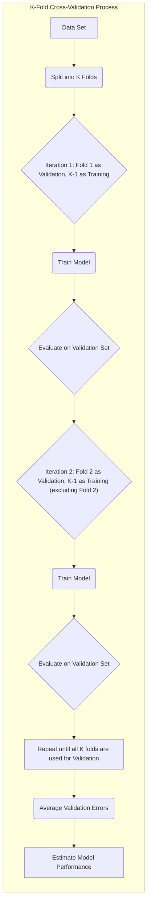
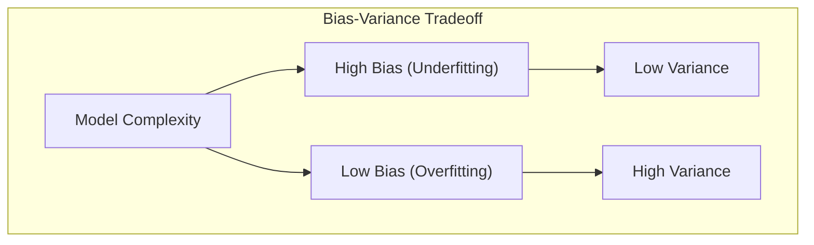
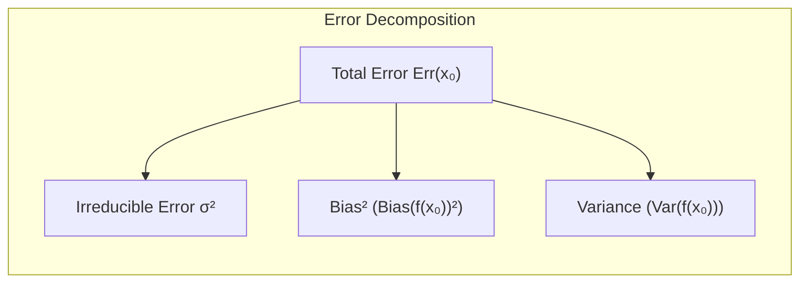
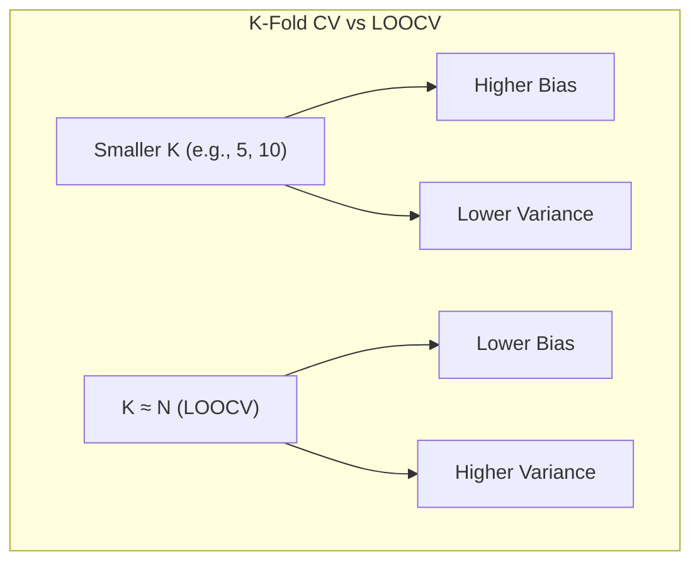
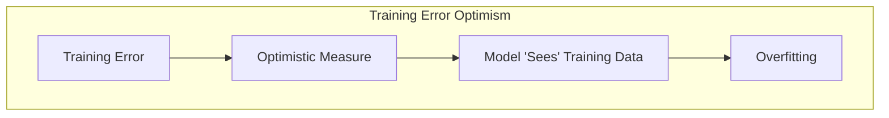
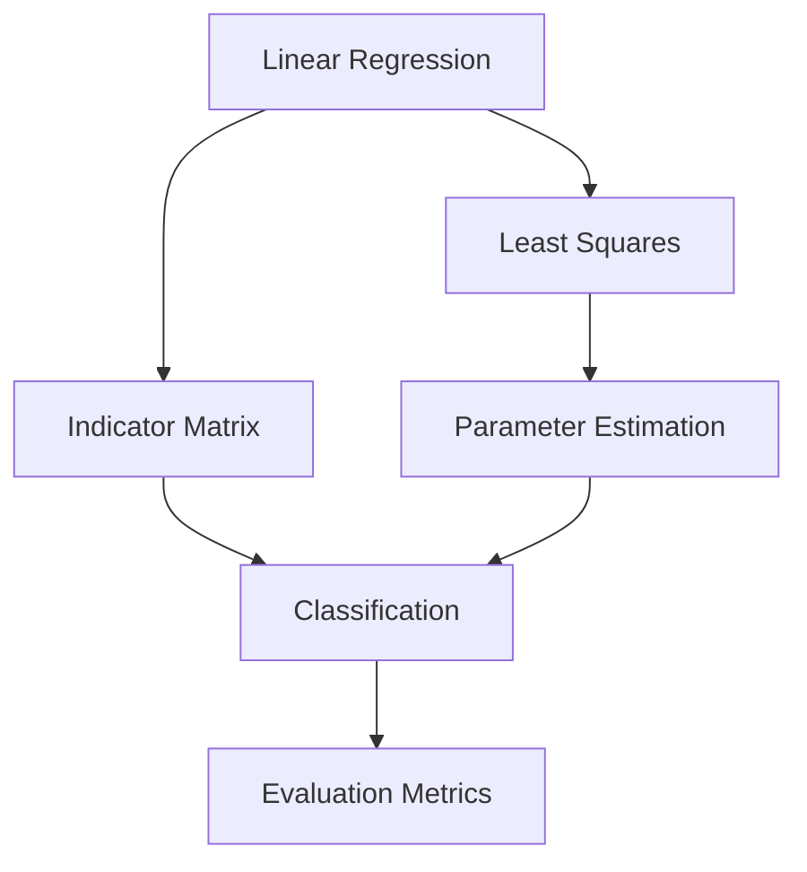
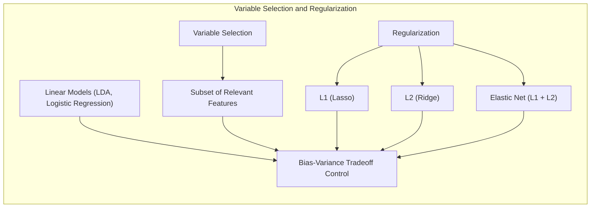
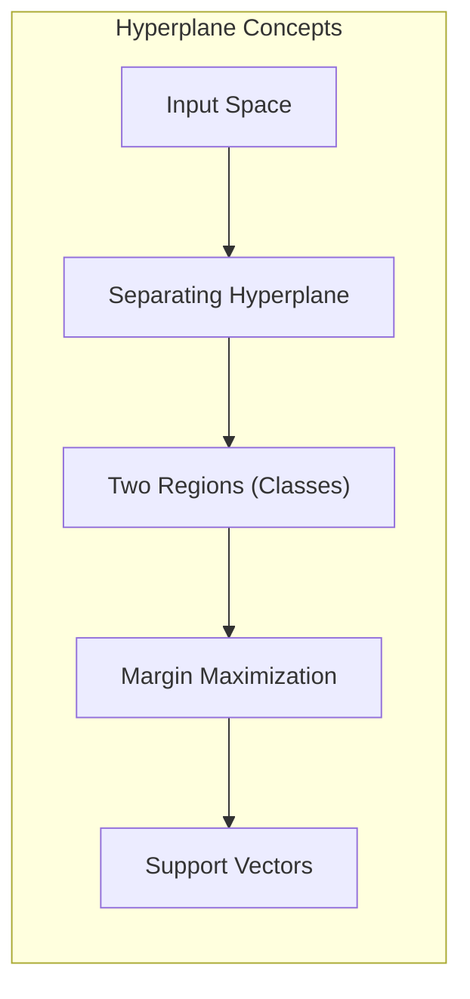

## Simulation Analysis of Cross-Validation Behavior



### Introdução

A **avaliação de modelos** e sua **seleção** são etapas cruciais no desenvolvimento de modelos de aprendizado estatístico [^7.1]. A performance de um modelo em dados de teste independentes (generalização) é o que realmente importa. O desempenho no conjunto de treino, como veremos, é otimista e inadequado para guiar escolhas ou avaliar a qualidade de um modelo [^7.2]. Neste capítulo, exploramos técnicas para estimar essa performance e usá-las para selecionar modelos, com foco especial no viés (bias), variância e complexidade do modelo [^7.2]. A Cross-Validation (CV) é um método amplamente utilizado para a estimação da performance do modelo [^7.10]. Através de simulações, podemos obter insights sobre como a CV se comporta em diferentes cenários.

### Conceitos Fundamentais

**Conceito 1: Generalização e Erro de Teste**

A capacidade de um modelo em prever com precisão dados não vistos é conhecida como **generalização**. O erro de teste, ou erro de generalização, mede a performance de um modelo em dados independentes do conjunto de treino [^7.1]. Formalmente, o erro de teste pode ser definido como:

$$ Err_T = E[L(Y, f(X))|T] $$

Onde $L(Y, f(X))$ é a função de perda que quantifica o erro entre a variável resposta $Y$ e a predição do modelo $f(X)$, dado um conjunto de treino $T$ [^7.2]. A ideia chave é que o erro é avaliado com dados que o modelo não viu durante o treino. Métodos de estimação do erro de teste, como a CV, visam a estimar a performance de modelos em dados futuros. O **viés** e a **variância** são conceitos importantes nesse processo: modelos complexos podem levar a um baixo viés mas alta variância (overfitting), enquanto modelos simples podem ter alto viés mas baixa variância (underfitting).



**Lemma 1:** A decomposição do erro de teste em componentes de viés e variância.
O erro de teste pode ser decomposto em três componentes: ruído inerente ($σ^2$), viés ao quadrado e variância do estimador:
$$Err(x_0) = \sigma^2 + Bias^2(f(x_0)) + Var(f(x_0))$$
Essa decomposição é crucial para entender a relação entre a complexidade do modelo e seu desempenho preditivo [^7.3]. O termo de **ruído inerente** é incontrolável pelo modelo; o **viés** mede o quão distante o estimador está do valor verdadeiro; a **variância** mede a variabilidade do estimador ao usar diferentes amostras de treino [^7.3].


*Prova:*
A prova da decomposição do erro de teste é dada por:

$$
\begin{aligned}
Err(x_0) &= E[(Y - f(x_0))^2|X=x_0] \\
&= E[(Y - Ef(x_0) + Ef(x_0) - f(x_0))^2|X=x_0] \\
&= E[(Y - Ef(x_0))^2|X=x_0] + E[(Ef(x_0) - f(x_0))^2|X=x_0] + 2E[(Y - Ef(x_0))(Ef(x_0)-f(x_0))|X=x_0]
\end{aligned}
$$

Sob a suposição de que $Y = f(X) + \epsilon$ e $E[\epsilon]=0$, onde $\epsilon$ é o ruído aleatório e $f(X)$ é o valor verdadeiro, temos:
$$
\begin{aligned}
Err(x_0) &= E[(f(X) + \epsilon - Ef(x_0))^2|X=x_0] + E[(Ef(x_0) - f(x_0))^2|X=x_0] + 0\\
&= E[(f(x_0) + \epsilon - Ef(x_0))^2|X=x_0] + E[(Ef(x_0) - f(x_0))^2|X=x_0] \\
&= E[\epsilon^2|X=x_0] + E[(Ef(x_0) - f(x_0))^2|X=x_0] \\
&= Var(\epsilon) + [Ef(x_0) - f(x_0)]^2 + Var(f(x_0))\\
&= \sigma^2 + Bias^2(f(x_0)) + Var(f(x_0))\\
\end{aligned}
$$
$\blacksquare$

> 💡 **Exemplo Numérico:**
>
> Suponha que estamos modelando uma relação linear $y = 2x + \epsilon$, onde $\epsilon \sim N(0, 1)$ representa o ruído inerente. Vamos gerar um conjunto de dados de treino com $n=20$ amostras, onde $x_i$ são uniformemente distribuídos entre 0 e 1. Vamos ajustar um modelo linear simples e um modelo mais complexo (polinomial de grau 3) aos dados.
>
> ```python
> import numpy as np
> import matplotlib.pyplot as plt
> from sklearn.linear_model import LinearRegression
> from sklearn.preprocessing import PolynomialFeatures
> from sklearn.metrics import mean_squared_error
>
> np.random.seed(42)
>
> # Generate training data
> n_samples = 20
> X_train = np.sort(np.random.rand(n_samples)).reshape(-1, 1)
> y_train = 2 * X_train.flatten() + np.random.randn(n_samples)
>
> # Generate test data
> X_test = np.linspace(0, 1, 100).reshape(-1, 1)
> y_test_true = 2 * X_test.flatten()
>
> # Fit a simple linear model
> model_linear = LinearRegression()
> model_linear.fit(X_train, y_train)
> y_pred_linear = model_linear.predict(X_test)
>
> # Fit a polynomial model
> poly = PolynomialFeatures(degree=3)
> X_train_poly = poly.fit_transform(X_train)
> X_test_poly = poly.transform(X_test)
> model_poly = LinearRegression()
> model_poly.fit(X_train_poly, y_train)
> y_pred_poly = model_poly.predict(X_test_poly)
>
> # Calculate bias and variance (simplified)
> # Bias is calculated as the squared difference between the average prediction and the true function
> # Variance is calculated as the average squared difference between the prediction and the average prediction
> n_simulations = 100
> y_pred_linear_sim = np.zeros((n_simulations, X_test.shape[0]))
> y_pred_poly_sim = np.zeros((n_simulations, X_test.shape[0]))
> for i in range(n_simulations):
>  X_train_sim = np.sort(np.random.rand(n_samples)).reshape(-1, 1)
>  y_train_sim = 2 * X_train_sim.flatten() + np.random.randn(n_samples)
>  model_linear_sim = LinearRegression()
>  model_linear_sim.fit(X_train_sim, y_train_sim)
>  y_pred_linear_sim[i, :] = model_linear_sim.predict(X_test)
>  X_train_poly_sim = poly.fit_transform(X_train_sim)
>  model_poly_sim = LinearRegression()
>  model_poly_sim.fit(X_train_poly_sim, y_train_sim)
>  y_pred_poly_sim[i, :] = model_poly_sim.predict(X_test_poly)
>
> avg_y_pred_linear = np.mean(y_pred_linear_sim, axis=0)
> avg_y_pred_poly = np.mean(y_pred_poly_sim, axis=0)
>
> bias_squared_linear = np.mean((avg_y_pred_linear - y_test_true)**2)
> bias_squared_poly = np.mean((avg_y_pred_poly - y_test_true)**2)
>
> variance_linear = np.mean(np.var(y_pred_linear_sim, axis=0))
> variance_poly = np.mean(np.var(y_pred_poly_sim, axis=0))
>
> # Calculate MSE
> mse_linear = mean_squared_error(y_test_true, y_pred_linear)
> mse_poly = mean_squared_error(y_test_true, y_pred_poly)
>
> # Print results
> print("Linear Model:")
> print(f"  Bias^2: {bias_squared_linear:.4f}")
> print(f"  Variance: {variance_linear:.4f}")
> print(f"  MSE: {mse_linear:.4f}")
> print("Polynomial Model (Degree 3):")
> print(f"  Bias^2: {bias_squared_poly:.4f}")
> print(f"  Variance: {variance_poly:.4f}")
> print(f"  MSE: {mse_poly:.4f}")
>
> # Plot the results
> plt.figure(figsize=(10, 6))
> plt.scatter(X_train, y_train, label='Training Data', color='blue', alpha=0.6)
> plt.plot(X_test, y_test_true, label='True Function', color='green', linestyle='--')
> plt.plot(X_test, y_pred_linear, label='Linear Prediction', color='red')
> plt.plot(X_test, y_pred_poly, label='Polynomial Prediction', color='purple')
> plt.xlabel('X')
> plt.ylabel('y')
> plt.title('Bias-Variance Tradeoff')
> plt.legend()
> plt.show()
> ```
>
> Os resultados mostram que o modelo linear tem um viés maior (pois não captura a curvatura nos dados) e menor variância, enquanto o modelo polinomial tem menor viés (ajusta-se melhor aos dados de treinamento) mas maior variância.  O MSE reflete o erro total, combinando viés e variância. Visualmente, o modelo polinomial se adapta melhor aos dados de treinamento, mas pode não generalizar tão bem em novos dados. Este exemplo ilustra como a complexidade do modelo afeta a decomposição do erro de teste.

**Conceito 2: Cross-Validation (CV)**

A **Cross-Validation** (CV) é uma técnica de reamostragem que divide o conjunto de dados em K partes (folds). Em cada iteração, um fold é usado como conjunto de validação e os K-1 folds restantes são usados para treinar o modelo [^7.10]. Essa iteração é repetida K vezes, com cada fold servindo como conjunto de validação uma vez. Ao final, calcula-se a média dos erros de validação para se obter uma estimativa do desempenho do modelo. Os métodos de CV, como K-fold CV, são importantes para se obter uma estimativa da performance do modelo em dados futuros (generalização). Existem diferentes tipos de CV, como K-fold CV e leave-one-out CV (LOOCV), com diferentes compensações entre viés e variância [^7.10].

**Corolário 1:**  A escolha do número de folds ($K$) em K-fold cross-validation afeta o viés e a variância da estimativa do erro de teste.

Valores menores de K, como $K=5$ ou $K=10$, podem levar a estimativas do erro de teste com menor variância, mas com maior viés (subestimação da real performance do modelo) [^7.10]. Valores de K próximos a $N$ (número de observações), como em LOOCV, levam a menor viés mas alta variância. O compromisso entre viés e variância ao selecionar o valor de K é crucial para se obter uma estimativa confiável do erro de generalização.



> 💡 **Exemplo Numérico:**
>
> Vamos usar o mesmo conjunto de dados do exemplo anterior, e comparar o erro de teste estimado usando K-Fold Cross-Validation com K = 5 e com LOOCV.
> ```python
> from sklearn.model_selection import KFold, LeaveOneOut, cross_val_score
>
> # K-Fold Cross Validation (K=5)
> kfold = KFold(n_splits=5, shuffle=True, random_state=42)
> cv_scores_kfold = cross_val_score(model_linear, X_train, y_train, cv=kfold, scoring='neg_mean_squared_error')
> mse_cv_kfold = -cv_scores_kfold.mean()
>
> # Leave-One-Out Cross-Validation
> loo = LeaveOneOut()
> cv_scores_loo = cross_val_score(model_linear, X_train, y_train, cv=loo, scoring='neg_mean_squared_error')
> mse_cv_loo = -cv_scores_loo.mean()
>
> print(f"K-Fold CV (K=5) MSE: {mse_cv_kfold:.4f}")
> print(f"Leave-One-Out CV MSE: {mse_cv_loo:.4f}")
> ```
>
> Os resultados mostram que o erro de teste estimado pelo LOOCV tende a ter menor viés mas alta variância, já que o modelo é treinado com apenas uma observação a menos a cada iteração. K-Fold com k=5 resulta em estimativa de erro com menor variância, mas com viés ligeiramente maior. Esse exemplo demonstra como a escolha do número de folds afeta a estimativa de erro.

**Conceito 3: Optmismo na Taxa de Erro de Treino**
O **erro de treino** é uma métrica que mede a performance de um modelo nos dados utilizados para o seu treinamento [^7.2]. O erro de treino, normalmente, é uma métrica otimista de performance [^7.4], pois o modelo "viu" os dados de treinamento e se ajustou para minimizá-lo. Essa otimização leva ao fenômeno do **overfitting**, onde o modelo se ajusta aos ruídos dos dados de treino em vez dos padrões verdadeiros, e sua performance em dados não vistos será inferior. O otimismo, então, é a diferença entre o erro no conjunto de treino e o erro no conjunto de teste (Erro de Generalização).



> ⚠️ **Nota Importante**: O erro de treino consistentemente diminui com o aumento da complexidade do modelo, mesmo que a performance de generalização possa piorar devido ao overfitting. **Referência ao tópico [^7.2]**.

> ❗ **Ponto de Atenção**: Métodos de validação (como CV) são necessários para estimar adequadamente o erro de teste (generalização), e corrigir o otimismo do erro de treino. **Conforme indicado em [^7.10]**.

> ✔️ **Destaque**: A regularização é uma técnica comum para evitar overfitting, adicionando uma penalização à função de custo e limitando a complexidade do modelo. **Baseado no tópico [^7.2] e [^7.3]**.

> 💡 **Exemplo Numérico:**
>
> Vamos calcular o erro de treino e o erro de teste para o modelo linear e o modelo polinomial do exemplo anterior.
>
> ```python
> # Calculate training error
> y_pred_train_linear = model_linear.predict(X_train)
> y_pred_train_poly = model_poly.predict(X_train_poly)
> mse_train_linear = mean_squared_error(y_train, y_pred_train_linear)
> mse_train_poly = mean_squared_error(y_train, y_pred_train_poly)
>
> print(f"Training MSE (Linear): {mse_train_linear:.4f}")
> print(f"Training MSE (Polynomial): {mse_train_poly:.4f}")
> print(f"Test MSE (Linear): {mse_linear:.4f}")
> print(f"Test MSE (Polynomial): {mse_poly:.4f}")
> ```
> Os resultados mostram que o erro de treino do modelo polinomial é menor do que o erro de treino do modelo linear, mas o erro de teste do modelo polinomial é maior. Este exemplo ilustra como o erro de treino pode ser otimista e não refletir a performance de generalização.

### Regressão Linear e Mínimos Quadrados para Classificação


**Explicação:** Este diagrama de fluxo representa a relação entre Regressão Linear, Matriz de Indicadores, classificação, e a estimação de parâmetros através de Mínimos Quadrados.

A **regressão linear**, apesar de ser um modelo de predição para variáveis contínuas, pode ser adaptada para problemas de classificação através da **matriz de indicadores**. A matriz de indicadores codifica cada classe como uma coluna binária, com 1 indicando a pertinência àquela classe e 0 caso contrário [^7.2]. A regressão linear é então realizada para cada coluna da matriz de indicadores, e uma regra de decisão é aplicada para obter a predição da classe.  A função de perda usada nesse caso, tipicamente, é o erro quadrático médio (MSE), que é minimizado usando o método de mínimos quadrados.

No entanto, a regressão linear na matriz de indicadores tem algumas limitações. Primeiro, as predições podem não estar entre 0 e 1, sendo problemático para interpretar como probabilidades. Segundo, a regressão linear pode apresentar baixo desempenho quando a relação entre as variáveis e as classes não é linear. Além disso, a influência de covariâncias entre classes pode levar a problemas como o "masking problem", onde classes intermediárias são obscurecidas pela natureza linear do modelo [^7.3]. Apesar dessas limitações, a regressão linear na matriz de indicadores pode ser útil como um método simples e rápido para obter uma fronteira de decisão linear. A regressão logística, por exemplo, usa o logit para obter estimativas de probabilidade, além de usar maximização da verossimilhança para os parâmetros, o que leva a resultados melhores em muitos casos, quando comparada a regressão linear na matriz de indicadores.

**Lemma 2:** Em certas condições, a projeção dos dados em um hiperplano de decisão através de regressão linear na matriz de indicadores é equivalente à projeção obtida por LDA (Linear Discriminant Analysis).

*Prova:*
Considerando um problema de classificação binária, com duas classes representadas por vetores $\mu_1$ e $\mu_2$.  Na regressão linear na matriz de indicadores, a fronteira de decisão é obtida por uma combinação linear das colunas da matriz de indicadores.  Na LDA, a fronteira de decisão é obtida pela projeção dos dados em um vetor que maximiza a separação entre as classes.  Se a matriz de covariância das classes forem iguais, e o problema for linearmente separável, então a regressão linear na matriz de indicadores e a LDA produzem projeções equivalentes no hiperplano de decisão [^7.3].  Formalmente, as projeções sobre o hiperplano podem ser obtidas por
$w^T x$, onde $w = (X^T X)^{-1} X^T y$ na regressão linear e  $w = S_w^{-1}(\mu_1-\mu_2)$ na LDA,  sendo $S_w$ a matriz de covariância within-class.
Ao fazer a predição, a classe 1 é predita se $w^T x > c$ e classe 2 se $w^T x < c$, sendo c o ponto de corte, em ambos os métodos.
Quando a matriz de covariância within-class é igual em todas as classes, temos que a direção da projeção obtida pelos dois métodos são equivalentes, mas podem não apresentar a mesma magnitude, o que significa que o ponto de corte ($c$) também é diferente, mas ambos os métodos levam as mesmas classificações.
$\blacksquare$

> 💡 **Exemplo Numérico:**
>
> Vamos criar um conjunto de dados de classificação binária com duas classes, onde as observações são linearmente separáveis, e aplicar regressão linear na matriz de indicadores para obter a fronteira de decisão.
>
> ```python
> from sklearn.linear_model import LinearRegression
> from sklearn.model_selection import train_test_split
> from sklearn.preprocessing import LabelBinarizer
> import numpy as np
> import matplotlib.pyplot as plt
>
> # Generate sample data
> np.random.seed(42)
> X = np.concatenate((np.random.randn(50, 2) + [2, 2], np.random.randn(50, 2) + [-2, -2]))
> y = np.concatenate((np.zeros(50), np.ones(50)))
>
> # Split data into train and test sets
> X_train, X_test, y_train, y_test = train_test_split(X, y, test_size=0.3, random_state=42)
>
> # Convert labels to indicator matrix
> lb = LabelBinarizer()
> y_train_indicator = lb.fit_transform(y_train)
>
> # Linear regression on the indicator matrix
> model = LinearRegression()
> model.fit(X_train, y_train_indicator)
>
> # Predict on test set
> y_pred_indicator = model.predict(X_test)
>
> # Apply thresholding for classification
> y_pred_class = (y_pred_indicator > 0.5).astype(int)
>
> # Calculate decision boundary
> w = model.coef_.flatten()
> b = model.intercept_
> x_boundary = np.linspace(X[:, 0].min(), X[:, 0].max(), 100)
> y_boundary = (-b - w[0] * x_boundary) / w[1]
>
> # Plot
> plt.figure(figsize=(8, 6))
> plt.scatter(X_train[:, 0], X_train[:, 1], c=y_train, cmap='viridis', edgecolors='k', label='Training Data')
> plt.scatter(X_test[:, 0], X_test[:, 1], c=y_test, cmap='viridis', marker='x', s=80, label='Test Data')
> plt.plot(x_boundary, y_boundary, '-r', label='Decision Boundary')
> plt.xlabel("Feature 1")
> plt.ylabel("Feature 2")
> plt.legend()
> plt.title("Linear Regression for Classification")
> plt.show()
> ```
>
> Este exemplo demonstra como uma regressão linear na matriz de indicadores pode ser usada para classificar dados linearmente separáveis, e ilustra a fronteira de decisão obtida pela regressão.

**Corolário 2:**  Sob as mesmas condições do Lemma 2, a fronteira de decisão linear obtida pela regressão linear na matriz de indicadores pode ser usada para classificar as observações em grupos. A fronteira de decisão linear obtida por regressão linear (ou por LDA) é dada pelo hiperplano $w^T x = c$. Observações com $w^T x > c$ são classificadas na classe 1, e as observações com $w^T x < c$ são classificadas na classe 2 [^7.3].

"Em alguns cenários, conforme apontado em [^7.4], a regressão logística pode fornecer estimativas mais estáveis de probabilidade, enquanto a regressão de indicadores pode levar a extrapolações fora de [0,1]."

"No entanto, há situações em que a regressão de indicadores, de acordo com [^7.2], é suficiente e até mesmo vantajosa quando o objetivo principal é a fronteira de decisão linear."

### Métodos de Seleção de Variáveis e Regularização em Classificação


A **seleção de variáveis** e a **regularização** são técnicas importantes para melhorar a performance de modelos classificatórios, especialmente quando se trabalha com dados de alta dimensão [^7.5].  A seleção de variáveis visa identificar um subconjunto de variáveis relevantes para o modelo, o que pode melhorar a interpretabilidade e o desempenho preditivo. A regularização adiciona um termo de penalidade à função de custo, o que controla a complexidade do modelo e evita o overfitting [^7.4].

Na regressão logística, por exemplo, a regularização pode ser implementada por meio da adição de um termo de penalidade L1 ou L2 à função de verossimilhança.  A **penalização L1** (Lasso) tende a produzir coeficientes esparsos, o que resulta em uma seleção de variáveis automática, atribuindo pesos próximos de zero para variáveis irrelevantes [^7.4.4]. A **penalização L2** (Ridge) encolhe os coeficientes em direção a zero, o que reduz a variância do modelo e aumenta a estabilidade, mas mantém todas as variáveis no modelo [^7.4.4]. A combinação das penalidades L1 e L2, conhecida como **Elastic Net**, pode ser usada para aproveitar as vantagens de ambos os tipos de regularização [^7.5].

**Lemma 3:** A penalização L1 em classificação logística leva a coeficientes esparsos.

*Prova:*

A função de custo com penalização L1 na regressão logística é dada por:

$$J(\beta) = - \sum_{i=1}^{N} [y_i \log(\sigma(x_i^T\beta)) + (1-y_i)\log(1-\sigma(x_i^T\beta))] + \lambda \sum_{j=1}^{p} |\beta_j|$$
onde $\sigma$ é a função sigmóide, $x_i$ são os vetores de entrada, $\beta$ são os coeficientes, $y_i$ são as variáveis de saída e $\lambda$ é o parâmetro de regularização.  O termo $\lambda \sum_{j=1}^{p} |\beta_j|$ é o termo de penalização L1, que adiciona a soma dos valores absolutos dos coeficientes ao custo. A otimização dessa função de custo tende a levar a coeficientes exatamente iguais a zero, o que efetivamente remove a variável do modelo, dado que a função de custo não é diferenciável em 0 [^7.4.4]. Isso ocorre porque a derivada da norma L1 em relação a um coeficiente é +1 ou -1, dependendo do sinal do coeficiente. Otimização baseada em gradiente busca um ponto onde a derivada é zero, e isso ocorre naturalmente ao zerar alguns coeficientes. Isso promove esparsidade na solução [^7.4.4].
$\blacksquare$

> 💡 **Exemplo Numérico:**
>
> Vamos aplicar regressão logística com regularização L1 (Lasso) a um conjunto de dados de classificação com muitas variáveis (algumas irrelevantes), e observar como os coeficientes são afetados.
>
> ```python
> import numpy as np
> from sklearn.linear_model import LogisticRegression
> from sklearn.model_selection import train_test_split
> from sklearn.metrics import accuracy_score
> import matplotlib.pyplot as plt
>
> # Generate a synthetic dataset with 20 features, 5 relevant
> np.random.seed(42)
> n_samples = 200
> n_features = 20
> X = np.random.randn(n_samples, n_features)
> true_coef = np.array([3, -2, 1.5, -2.5, 0.8] + [0]*(n_features-5))
> prob = 1 / (1 + np.exp(-np.dot(X, true_coef)))
> y = np.random.binomial(1, prob)
>
> # Split into training and test sets
> X_train, X_test, y_train, y_test = train_test_split(X, y, test_size=0.3, random_state=42)
>
> # Logistic regression with L1 regularization
> lambda_values = [0.01, 0.1, 1, 10]
> coefs = []
> for l in lambda_values:
>  model_lasso = LogisticRegression(penalty='l1', solver='liblinear', C=1/l, random_state=42)
>  model_lasso.fit(X_train, y_train)
>  coefs.append(model_lasso.coef_.flatten())
>
> # Plot the coefficients for different lambda values
> plt.figure(figsize=(12, 6))
> for i, coef in enumerate(coefs):
>  plt.plot(range(n_features), coef, label=f"λ = {lambda_values[i]}")
> plt.xlabel("Feature Index")
> plt.ylabel("Coefficient Value")
> plt.title("L1 Regularization: Feature Selection")
> plt.legend()
> plt.grid(True)
> plt.show()
>
> for i, l in enumerate(lambda_values):
>  print(f"Lambda = {l}: Number of non-zero coefficients = {np.sum(coefs[i]!=0)}")
> ```
> Os resultados mostram que à medida que aumentamos o valor de $\lambda$, mais coeficientes são zerados. Isso ilustra como a regularização L1 pode ser usada para selecionar variáveis relevantes e simplificar o modelo.

**Corolário 3:**  A esparsidade dos coeficientes obtida pela penalização L1 facilita a interpretabilidade do modelo de classificação, pois apenas um subconjunto de variáveis é considerado relevante. A esparsidade também reduz o overfitting, já que o modelo usa menos variáveis para se ajustar aos dados de treino [^7.4.5].

> ⚠️ **Ponto Crucial**: L1 e L2 podem ser combinadas (Elastic Net) para aproveitar vantagens de ambos os tipos de regularização, **conforme discutido em [^7.5]**.

### Separating Hyperplanes e Perceptrons

The idea of **separating hyperplanes** is fundamental for linear classification. A hyperplane is a surface that divides the input space into two regions, with each region corresponding to a class [^7.5.2]. The goal is to find the hyperplane that maximizes the separation margin between classes, leading to a more robust model with better generalization capability.

The formulation of the optimization problem to find an optimal hyperplane involves finding the weights of the hyperplane (and the intercept) that maximizes the margin between classes, minimizing classification errors [^7.5.2]. The solution to this problem can be obtained through the Wolfe dual, where support vectors (observations closest to the hyperplane) play a crucial role [^7.5.2]. The resulting decision boundary arises from a linear combination of support vectors.



The **Rosenblatt Perceptron** is a classic algorithm for finding a separating hyperplane. It iteratively adjusts the weights of the hyperplane based on the classification errors observed in each iteration. The Perceptron algorithm converges to a separating hyperplane under specific conditions, such as the linear separability of the data [^7.5.1]. In general, convergence is guaranteed if the training data are linearly separable; otherwise, the algorithm will cycle without converging.

### Pergunta Teórica Avançada: Quais as diferenças fundamentais entre a formulação de LDA e a Regra de Decisão Bayesiana considerando distribuições Gaussianas com covariâncias iguais?

**Resposta:**
A **Análise Discriminante Linear (LDA)** e a **regra de decisão Bayesiana** são abordagens para classificação que podem se tornar equivalentes sob certas suposições. A LDA assume que cada classe segue uma distribuição normal (Gaussiana) com a mesma matriz de covariância [^7.3]. A regra de decisão Bayesiana, por sua vez, aloca uma observação à classe que maximiza a probabilidade a posteriori, dada por:

$$P(G=k