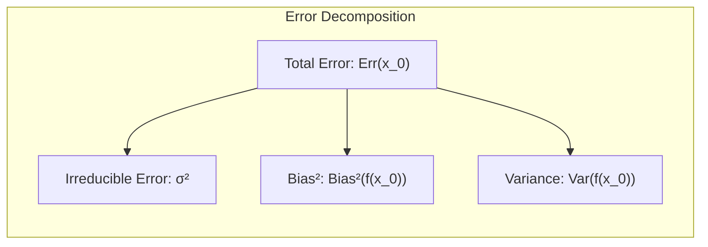
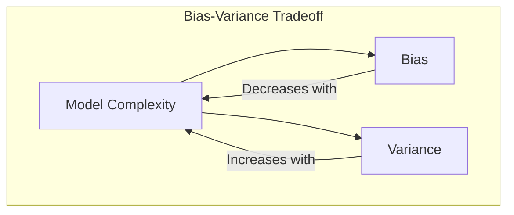
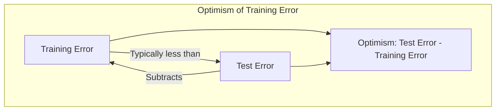
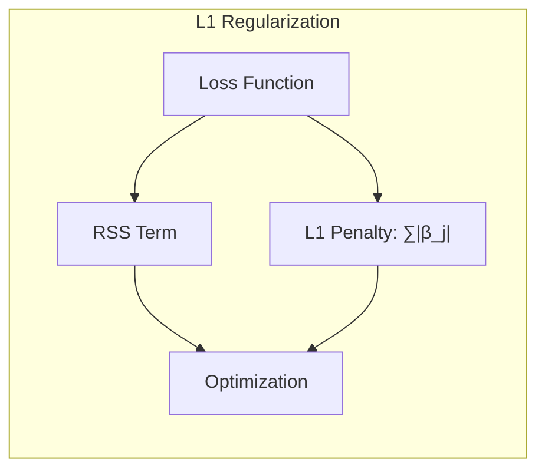
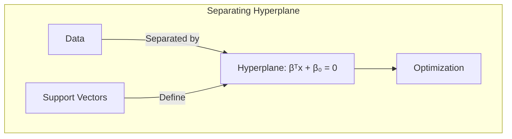
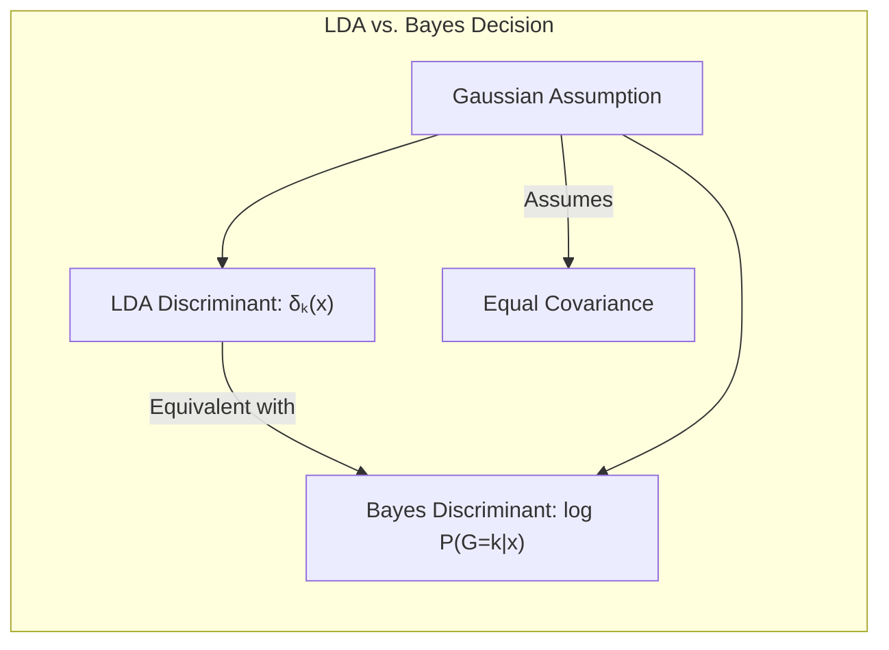
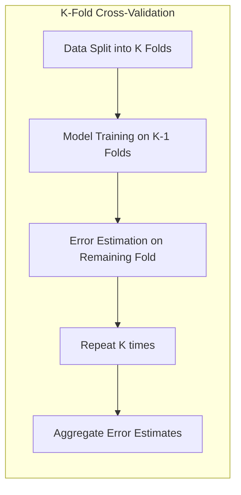

## Model Assessment and Selection: Focusing on Cross-Validation Variability
<imagem: Mapa mental conectando os principais métodos de avaliação de modelos (AIC, BIC, Cross-Validation, Bootstrap) com foco na discussão da variabilidade das estimativas de erro em cross-validation, incluindo os conceitos de bias-variance tradeoff e overfitting, todos interligados pelos objetivos de model selection e model assessment.>

### Introdução
A avaliação do desempenho de um modelo de aprendizado estatístico, ou seja, sua capacidade de generalização para dados não vistos, é crucial para a escolha do modelo mais adequado e para a quantificação da qualidade da solução final [^7.1]. Este capítulo se aprofunda em métodos-chave para a avaliação de performance, explorando o interplay entre **bias**, **variance** e **complexidade do modelo**, particularmente no contexto da validação cruzada e a variabilidade de suas estimativas [^7.2]. Nosso foco será detalhar a variabilidade das estimativas de erro obtidas por meio de **cross-validation**, um método fundamental para a seleção e avaliação de modelos em estatística e aprendizado de máquina.

### Conceitos Fundamentais
**Conceito 1: Generalização e Erro de Predição**

O objetivo central de um modelo de aprendizado estatístico é a capacidade de **generalização**, ou seja, sua habilidade de predizer resultados precisos em dados independentes, não utilizados no treinamento [^7.1]. O **erro de predição** é a medida que quantifica essa generalização, sendo crucial para orientar a escolha do modelo e avaliar a qualidade da solução obtida [^7.2]. Este erro é medido por uma função de perda $L(Y, f(X))$, que quantifica a discrepância entre o valor real $Y$ e a predição do modelo $f(X)$. As formas comuns incluem o erro quadrático ($L(Y, f(X)) = (Y - f(X))^2$) e o erro absoluto ($L(Y, f(X)) = |Y - f(X)|$) [^7.2].

**Lemma 1:** *A decomposição do erro de predição em termos de bias e variance.*
O erro de predição esperado pode ser decomposto em três componentes: o **erro irredutível**, o **bias ao quadrado** e a **variância** [^7.3]. Em particular, a fórmula para o erro quadrático esperado em um ponto de entrada $x_0$ pode ser escrita como:
$$Err(x_0) = \sigma^2 + Bias^2(f(x_0)) + Var(f(x_0))$$
onde $\sigma^2$ representa o erro irredutível, $Bias^2(f(x_0))$ o bias do estimador ao quadrado, e $Var(f(x_0))$ a variância do estimador. Esta decomposição é crucial para entender a complexidade dos modelos e sua propensão ao overfitting ou underfitting [^7.3].
$\blacksquare$



> 💡 **Exemplo Numérico:** Suponha que temos um modelo que tenta prever os preços de casas. O erro irredutível ($\sigma^2$) pode ser o ruído inerente nos dados, como fatores desconhecidos que afetam os preços (ex: um vazamento não detectado). O bias ($\text{Bias}^2(f(x_0))$) pode ser devido ao modelo simplificar demais a relação entre as características das casas e o preço, por exemplo, não considerando a localização. A variância ($\text{Var}(f(x_0))$) é como as predições do modelo mudam se usarmos diferentes conjuntos de treinamento. Um modelo muito complexo (ex: uma árvore de decisão profunda) pode ter baixa bias, mas alta variância, enquanto um modelo simples (ex: regressão linear com poucas features) pode ter alta bias e baixa variância. Se para uma casa específica ($x_0$), temos $\sigma^2 = 1000$, $Bias^2(f(x_0)) = 4000$, e $Var(f(x_0)) = 1000$, então o erro esperado será $Err(x_0) = 1000 + 4000 + 1000 = 6000$. Reduzir o bias e a variância é o objetivo da modelagem.

**Conceito 2: Bias-Variance Tradeoff e Complexidade do Modelo**
O conceito de **bias-variance tradeoff** destaca uma relação inversa entre o viés e a variância de um modelo [^7.2]. Modelos mais simples, com menor complexidade, geralmente têm um viés maior e uma variância menor, podendo levar ao underfitting, onde o modelo não captura os padrões importantes nos dados. Já modelos mais complexos tendem a ter menor viés, mas uma variância maior, levando ao overfitting, onde o modelo se adapta excessivamente aos ruídos nos dados de treinamento, comprometendo sua capacidade de generalização [^7.2, 7.3].



**Corolário 1:** *O impacto do número de vizinhos 'k' na regressão k-NN.* Para um modelo de regressão **k-nearest neighbors (k-NN)**, a complexidade do modelo é inversamente proporcional ao número de vizinhos $k$ [^7.3]. Valores pequenos de $k$ tornam o modelo mais flexível e adaptável aos dados, reduzindo o bias, mas aumentando a variância. Aumentar $k$ leva a um modelo mais regularizado, aumentando o bias, mas reduzindo a variância [^7.3.1]. Isso ilustra claramente o tradeoff entre bias e variance e como a complexidade do modelo influencia o desempenho.

> 💡 **Exemplo Numérico:** Imagine usar k-NN para prever a altura de uma pessoa com base na altura de seus vizinhos mais próximos. Se definirmos $k=1$, cada predição seria a altura da pessoa mais próxima. O modelo se ajustaria muito bem aos dados de treinamento (baixo bias), mas seria muito sensível a dados incomuns (alta variância). Se usarmos um valor maior, como $k=10$, a predição será uma média das alturas dos 10 vizinhos mais próximos. Este modelo será menos sensível a dados incomuns (baixa variância), mas pode não capturar detalhes sutis (alto bias). O valor ideal de $k$ estaria em algum ponto intermediário que equilibra o bias e a variância.

**Conceito 3: Otimismo da Taxa de Erro de Treinamento**
O **erro de treinamento** (training error) é a medida da performance do modelo sobre os dados usados para o treinamento, sendo normalmente inferior ao erro de teste (test error). Isso ocorre porque os modelos tendem a se ajustar aos dados de treinamento, o que leva a uma estimativa excessivamente otimista do erro de predição para dados não vistos [^7.4]. O **otimismo** da taxa de erro de treinamento, definido como a diferença entre o erro de predição e o erro de treinamento, indica o quanto o desempenho do modelo no treinamento é diferente da generalização [^7.4].



> ⚠️ **Nota Importante**: O erro de treinamento não é um bom estimador do erro de teste, especialmente em modelos mais complexos, onde o overfitting pode ser um problema. **Referência ao tópico [^7.4]**.

> ❗ **Ponto de Atenção**: O otimismo aumenta com a complexidade do modelo e diminui com o tamanho do conjunto de treinamento. **Conforme indicado em [^7.4]**.

> 💡 **Exemplo Numérico:** Imagine ajustar um polinômio de grau 1 (uma linha) e um polinômio de grau 10 (uma curva complexa) a um conjunto de dados. O polinômio de grau 10 pode se ajustar perfeitamente a todos os pontos do conjunto de treinamento, resultando em um erro de treinamento muito baixo. No entanto, ele pode se ajustar também aos ruídos e não generalizar bem para novos dados (alto erro de teste). O polinômio de grau 1, por outro lado, pode ter um erro de treinamento um pouco maior, mas tem um erro de teste mais baixo em novos dados, indicando um menor otimismo. O otimismo é a diferença entre o erro de treino e o erro de teste, que neste caso será maior para o polinômio de grau 10.

### Regressão Linear e Mínimos Quadrados para Classificação
<imagem: Diagrama de fluxo que detalha o processo de aplicação da regressão linear para classificação, começando com a codificação das classes em variáveis indicadoras, seguida pela estimação dos coeficientes usando mínimos quadrados e terminando com a aplicação de uma regra de decisão. As setas indicam o fluxo de dados e interações entre os passos.>

```mermaid
flowchart TD
  subgraph "Indicator Regression"
    A[Codificação de Classes "Variables Indicadoras"] --> B[Estimação "Mínimos Quadrados"]
    B --> C[Regra de "Decisão"]
    C --> D[Avaliação]
  end
```

A regressão linear, quando aplicada a matrizes de indicadores, pode ser usada para problemas de classificação. Nesse cenário, cada classe é representada por uma **variável indicadora**. Para um problema de classificação com $K$ classes, são criadas $K$ variáveis binárias, onde cada variável assume o valor 1 se a amostra pertence à classe correspondente e 0 caso contrário [^7.2]. Os coeficientes da regressão são estimados usando **mínimos quadrados**, buscando ajustar um hiperplano que minimize a soma dos erros ao quadrado entre as classes indicadoras e os valores preditos. As predições são então convertidas em decisões de classe usando uma regra de decisão (por exemplo, atribuindo a classe com o maior valor predito). Apesar da simplicidade, a regressão linear com matrizes indicadoras apresenta limitações, como sensibilidade a outliers e o problema de masking [^7.3], onde a covariância entre classes pode influenciar as fronteiras de decisão, muitas vezes de forma indesejada. Em situações em que a suposição de normalidade não é cumprida ou quando classes são não-lineares, métodos probabilísticos como a regressão logística são mais adequados [^7.4].

**Lemma 2:** *Equivalência entre projeções e discriminantes lineares.*
Em certas condições, as projeções nos hiperplanos de decisão obtidas pela regressão linear com variáveis indicadoras são equivalentes às projeções obtidas por discriminantes lineares, especialmente em situações onde as classes apresentam uma boa separabilidade linear [^7.2, 7.3].
$\blacksquare$

**Corolário 2:** *Simplificação na análise de modelos lineares.*
A equivalência entre as projeções (Lemma 2) permite simplificar a análise de modelos de classificação lineares, demonstrando que a regressão de indicadores pode levar a fronteiras de decisão semelhantes à LDA, especialmente quando as classes são razoavelmente separáveis e os dados não apresentam outliers extremos [^7.3].
$\blacksquare$

A regressão de indicadores é, portanto, uma ferramenta valiosa, particularmente quando o objetivo principal é a obtenção de uma **fronteira de decisão linear**. No entanto, em cenários mais complexos, outras técnicas, como a regressão logística, oferecem uma abordagem mais robusta e flexível [^7.4].

> 💡 **Exemplo Numérico:** Suponha um problema de classificação com 3 classes (A, B, C). Criamos três variáveis indicadoras: $I_A$, $I_B$ e $I_C$. Se uma amostra pertencer à classe B, $I_B$ será 1 e as outras duas variáveis serão 0. A regressão linear tenta estimar as probabilidades de cada classe usando estas variáveis como preditores. A função de predição para a classe A seria algo como $\hat{P}(A|x) = \beta_0 + \beta_1 x_1 + \beta_2 x_2 + \ldots$. Uma amostra é classificada como A se $\hat{P}(A|x)$ for o maior valor dentre as três classes. Este método pode sofrer com outliers, como uma amostra que esteja muito distante das outras da mesma classe, influenciando a linha de decisão.

### Métodos de Seleção de Variáveis e Regularização em Classificação
<imagem: Diagrama em estilo mapa mental que interconecta os métodos de seleção de variáveis (L1, L2, Elastic Net) e sua aplicação em classificação com a LDA, regressão logística e hyperplanes. O diagrama detalha as relações entre a regularização, a sparsity dos coeficientes e a melhoria na generalização de modelos.>

A seleção de variáveis e a regularização são métodos cruciais para a construção de modelos mais robustos e generalizáveis [^7.4.4]. A regularização consiste em adicionar um termo de penalidade à função de perda, que tem como objetivo evitar o overfitting, reduzindo a complexidade do modelo e selecionando as variáveis mais relevantes [^7.5].

A **regularização L1**, também conhecida como lasso, adiciona a soma dos valores absolutos dos coeficientes como termo de penalidade [^7.4.4]:
$$L_1(\beta) = \sum_{j=1}^{p} |\beta_j|$$
A regularização L1 tende a gerar modelos esparsos, onde muitos coeficientes são reduzidos a zero, atuando como um método de seleção de variáveis.

A **regularização L2**, também conhecida como ridge, adiciona a soma dos coeficientes ao quadrado como termo de penalidade [^7.4.4]:
$$L_2(\beta) = \sum_{j=1}^{p} \beta_j^2$$
A regularização L2 reduz os coeficientes para valores menores, porém sem zerá-los, o que a torna mais adequada para modelos em que todas as variáveis são relevantes, mas sua magnitude precisa ser controlada.

A combinação de L1 e L2, conhecida como **Elastic Net**, utiliza ambas as penalidades, buscando um equilíbrio entre sparsity e estabilidade [^7.5].

**Lemma 3:** *A penalização L1 e a sparsity*. A penalização L1, quando aplicada à regressão logística, promove a sparsity dos coeficientes [^7.4.4]. A otimização da função de perda penalizada leva a que alguns coeficientes sejam exatamente zero, o que indica que algumas variáveis não contribuem significativamente para o modelo [^7.4.4].
**Prova do Lemma 3:**
A penalização L1, ao adicionar a soma dos valores absolutos dos coeficientes à função de perda, cria pontos não diferenciáveis quando os coeficientes são nulos. Durante a otimização, esses pontos dificultam a convergência para valores próximos a zero e incentivam a convergência exata a zero, induzindo sparsity. Este mecanismo é diferente do da regularização L2, que empurra os coeficientes para perto de zero sem forçar sua nulidade. $\blacksquare$



**Corolário 3:** *Implicações para a interpretabilidade*. A sparsity induzida pela regularização L1 melhora a interpretabilidade dos modelos classificatórios, pois identifica e remove variáveis não informativas, o que simplifica a análise e a tomada de decisão [^7.4.5].
$\blacksquare$

> ⚠️ **Ponto Crucial**: A escolha entre L1, L2, ou Elastic Net depende das características do problema e do balanço desejado entre sparsity e estabilidade. **Conforme discutido em [^7.5]**.

> 💡 **Exemplo Numérico:** Considere um problema de regressão onde se tenta prever o preço de um carro com base em várias features, como quilometragem, idade, marca, número de portas, etc. Um modelo de regressão linear sem regularização pode dar pesos significativos para todas as variáveis, mesmo para aquelas que não são tão importantes para a predição (ex: cor do carro). Se aplicarmos a regularização L1 (Lasso), alguns dos coeficientes serão reduzidos a zero, indicando que suas variáveis correspondentes não são relevantes. Já com a regularização L2 (Ridge), os coeficientes serão reduzidos, mas não zerados, mantendo todas as variáveis no modelo, mas com menor importância. Se um coeficiente referente à variável "cor do carro" for reduzido a zero no Lasso, podemos dizer que essa variável não é relevante para a predição do preço do carro, tornando o modelo mais simples e interpretável. A regularização Elastic Net buscaria um balanço entre as duas abordagens.

```python
import numpy as np
from sklearn.linear_model import LinearRegression, Ridge, Lasso, ElasticNet
from sklearn.model_selection import train_test_split
from sklearn.metrics import mean_squared_error

# Simulação de dados
np.random.seed(42)
n_samples = 100
n_features = 10
X = np.random.rand(n_samples, n_features)
true_coef = np.array([5, -3, 2, 0, 0, 0, 0, 1, -2, 0]) # Variáveis 4, 5, 6 e 10 não são relevantes
y = np.dot(X, true_coef) + np.random.randn(n_samples)

# Divisão em treino e teste
X_train, X_test, y_train, y_test = train_test_split(X, y, test_size=0.3, random_state=42)

# Regressão Linear sem regularização
ols = LinearRegression()
ols.fit(X_train, y_train)
ols_pred = ols.predict(X_test)
ols_mse = mean_squared_error(y_test, ols_pred)

# Regressão Ridge
ridge = Ridge(alpha=1)
ridge.fit(X_train, y_train)
ridge_pred = ridge.predict(X_test)
ridge_mse = mean_squared_error(y_test, ridge_pred)

# Regressão Lasso
lasso = Lasso(alpha=0.1)
lasso.fit(X_train, y_train)
lasso_pred = lasso.predict(X_test)
lasso_mse = mean_squared_error(y_test, lasso_pred)

# Regressão ElasticNet
elastic = ElasticNet(alpha=0.1, l1_ratio=0.5)
elastic.fit(X_train, y_train)
elastic_pred = elastic.predict(X_test)
elastic_mse = mean_squared_error(y_test, elastic_pred)

# Comparação
print("MSE para OLS:", ols_mse)
print("MSE para Ridge:", ridge_mse)
print("MSE para Lasso:", lasso_mse)
print("MSE para ElasticNet:", elastic_mse)

print("\nCoeficientes OLS:", ols.coef_)
print("Coeficientes Ridge:", ridge.coef_)
print("Coeficientes Lasso:", lasso.coef_)
print("Coeficientes ElasticNet:", elastic.coef_)
```

Este código demonstra como os coeficientes são afetados por cada tipo de regularização. O Lasso tende a zerar os coeficientes menos importantes (como as features 4, 5, 6 e 10), enquanto o Ridge reduz seus valores, mas sem zerá-los. O ElasticNet busca um balanço entre os dois.

### Separating Hyperplanes e Perceptrons
O conceito de **separating hyperplanes** surge no contexto de modelos lineares para classificação, onde o objetivo é encontrar um hiperplano que separe as diferentes classes nos dados de entrada. Esse hiperplano pode ser descrito por uma equação linear na forma $\beta^T x + \beta_0 = 0$, onde $\beta$ é o vetor de parâmetros que define a orientação do hiperplano e $\beta_0$ é o intercepto [^7.5.2]. A maximização da margem de separação entre as classes leva ao conceito de **hiperplanos ótimos**, e o problema de encontrar estes hiperplanos pode ser formulado como um problema de otimização que pode ser resolvido utilizando o dual de Wolfe. A solução para esse problema geralmente envolve combinações lineares de alguns pontos de dados chamados **support vectors** [^7.5.2].
O **Perceptron de Rosenblatt** é um algoritmo iterativo que busca ajustar um hiperplano separador, atualizando os pesos da função discriminante linear com base nos erros de classificação. Este algoritmo garante a convergência para um hiperplano separador se os dados forem linearmente separáveis [^7.5.1].

**Teorema 1:** *Convergência do Perceptron*. O Perceptron de Rosenblatt converge para um hiperplano separador em um número finito de passos se os dados de treinamento forem linearmente separáveis [^7.5.1].
$\blacksquare$



**Lemma 4:** *A formulação do problema de otimização*. O problema de encontrar um separating hyperplane ótimo pode ser formulado como um problema de otimização da forma:
$$min_{\beta, \beta_0} \frac{1}{2}||\beta||^2$$
$$subject \ to: y_i(\beta^T x_i + \beta_0) \ge 1 \quad \forall i$$
onde $y_i$ são as labels de classe (+1 ou -1) e $x_i$ são os dados de entrada [^7.5.2]. Este problema pode ser resolvido utilizando técnicas de otimização. $\blacksquare$

> 💡 **Exemplo Numérico:** Suponha que temos dois grupos de pontos em um plano, um com label +1 e outro com label -1. Queremos encontrar uma linha que separe os dois grupos. Esta linha é um hiperplano. A equação desta linha seria $\beta_1 x_1 + \beta_2 x_2 + \beta_0 = 0$. O perceptron ajusta os valores de $\beta_1$, $\beta_2$ e $\beta_0$ iterativamente, corrigindo a linha cada vez que classifica um ponto incorretamente. Se os dados forem linearmente separáveis, o Perceptron acabará por encontrar uma linha que separe corretamente os dois grupos.

### Pergunta Teórica Avançada: Quais as diferenças fundamentais entre a formulação de LDA e a Regra de Decisão Bayesiana considerando distribuições Gaussianas com covariâncias iguais?
**Resposta:**
A Linear Discriminant Analysis (LDA) e a Regra de Decisão Bayesiana, sob certas condições, como a suposição de que as classes seguem distribuições Gaussianas com matrizes de covariância iguais, levam a fronteiras de decisão lineares [^7.3]. Na LDA, busca-se encontrar um subespaço linear que maximize a separação entre as classes, assumindo que todas as classes compartilham a mesma matriz de covariância [^7.3]. A função discriminante linear do LDA é dada por:
$$ \delta_k(x) = x^T\Sigma^{-1}\mu_k - \frac{1}{2}\mu_k^T\Sigma^{-1}\mu_k + \log(\pi_k) $$
onde $\mu_k$ é a média da classe k, $\Sigma$ é a matriz de covariância conjunta e $\pi_k$ a probabilidade a priori da classe k. A decisão de classe é feita atribuindo a amostra $x$ à classe $k$ que maximiza $\delta_k(x)$.

A Regra de Decisão Bayesiana, por sua vez, busca minimizar o risco de classificação, atribuindo cada amostra à classe com maior probabilidade a posteriori, que para distribuições Gaussianas com covariâncias iguais resulta numa função discriminante linear:
$$ P(G=k|x) = \frac{\pi_k \frac{1}{(2\pi)^{p/2}|\Sigma|^{1/2}}e^{-\frac{1}{2}(x-\mu_k)^T\Sigma^{-1}(x-\mu_k)}}{\sum_{j=1}^K \pi_j \frac{1}{(2\pi)^{p/2}|\Sigma|^{1/2}}e^{-\frac{1}{2}(x-\mu_j)^T\Sigma^{-1}(x-\mu_j)}} $$

Note que o denominador não influencia a decisão, pois é comum a todas as classes. Tomando o logaritmo, e eliminando constantes, obtemos:
$$ \log P(G=k|x) = \log \pi_k - \frac{1}{2}(x-\mu_k)^T\Sigma^{-1}(x-\mu_k) $$
que é uma forma equivalente da função discriminante do LDA. Assim, quando as classes seguem distribuições Gaussianas com covariâncias iguais, as abordagens LDA e Bayesiana resultam em fronteiras de decisão lineares equivalentes [^7.3.3]. A principal diferença reside na interpretação dos parâmetros: a LDA estima esses parâmetros a partir dos dados de treinamento, enquanto a regra bayesiana utiliza as probabilidades a priori e as distribuições de probabilidade para tomar a decisão ótima.

**Lemma 4:** *Equivalência formal entre LDA e Decisão Bayesiana.*
Em condições de normalidade das classes com covariâncias iguais, a função discriminante derivada da análise de discriminante linear (LDA) é equivalente à função discriminante obtida da regra de decisão Bayesiana [^7.3, 7.3.3]. $\blacksquare$



**Corolário 4:** *Fronteiras quadráticas com covariâncias desiguais.*
Ao relaxar a hipótese de covariâncias iguais para todas as classes, a regra de decisão Bayesiana leva a fronteiras de decisão quadráticas, caracterizando a análise de discriminante quadrática (QDA). A QDA utiliza matrizes de covariância diferentes para cada classe, permitindo uma maior flexibilidade na adaptação às diferentes distribuições [^7.3].
$\blacksquare$

> ⚠️ **Ponto Crucial**: A escolha entre LDA (covariâncias iguais) e QDA (covariâncias diferentes) depende das características dos dados e da necessidade de modelar fronteiras de decisão mais flexíveis. **Conforme discutido em [^7.3.1]**.

> 💡 **Exemplo Numérico:** Imagine classificar flores em duas espécies com base em duas características: comprimento da pétala e largura da pétala. Se as duas espécies tiverem distribuições gaussianas com a mesma covariância, ou seja, a dispersão das características for similar para as duas espécies, tanto LDA quanto a regra de decisão bayesiana resultarão em uma fronteira de decisão linear, uma reta que separa as duas espécies no espaço 2D. No entanto, se as covariâncias forem diferentes, QDA levará a uma fronteira de decisão quadrática, uma curva que pode se ajustar melhor a essas diferenças nas distribuições.

### Variabilidade das Estimativas de Erro de Cross-Validation
A validação cruzada (**cross-validation**) é um método amplamente utilizado para estimar a performance de modelos de aprendizado de máquina em dados não vistos [^7.10]. Ela envolve a divisão dos dados em $K$ partes ou folds, onde cada fold é utilizado como conjunto de teste enquanto os demais são utilizados para treinamento. O procedimento é repetido $K$ vezes, usando um fold diferente como teste em cada iteração. As estimativas de performance são então agregadas para fornecer uma estimativa geral do desempenho do modelo. Existem diversas variantes, como a k-fold cross-validation e leave-one-out cross-validation.

O ponto chave deste capítulo é a variabilidade das estimativas de erro obtidas via cross-validation, o qual depende de diversos fatores, como o tamanho do conjunto de treinamento, o número de folds, a complexidade do modelo, e a natureza dos dados. Diferente dos métodos analíticos (AIC, BIC), a cross-validation estima diretamente o erro de predição extra-amostral.
A estimativa do erro em k-fold cross-validation é calculada como:
$$CV(f) = \frac{1}{N} \sum_{i=1}^N L(y_i, f^{-k(i)}(x_i))$$
onde $N$ é o tamanho total dos dados, $k(i)$ é o fold a que pertence a $i$-ésima observação, e $f^{-k(i)}$ é o modelo treinado sem o $k(i)$-ésimo fold [^7.10].



Uma forma de compreender a variabilidade é examinar a relação entre as estimativas de erro obtidas com diferentes conjuntos de treinamento e as verdadeiras taxas de erro. Para um número grande de simulações, as estimativas de erro obtidas via cross-validation apresentam uma variabilidade considerável, especialmente quando o tamanho do conjunto de treinamento é pequeno e o número de folds é alto [^7.12].

Além disso, a forma como a cross-validation é implementada pode afetar a variabilidade. Uma prática comum (e incorreta) é selecionar variáveis importantes com base em todos os dados, e somente após esta etapa realizar o cross-validation. Isso causa viés na estimativa da performance do modelo. A forma correta é selecionar as variáveis e treinar o modelo em cada fold, deixando de lado as observações do fold em uso para cada iteração [^7.10.2].

Os métodos descritos neste capítulo, como a cross-validation, fornecem estimativas do erro de generalização em modelos. No entanto, é importante lembrar que essas estimativas são passíveis de variabilidade. O entendimento da variabilidade nos permite tomar decisões mais informadas no processo de seleção e avaliação de modelos, auxiliando em conclusões mais sólidas [^7.12].

> 💡 **Exemplo Numérico:** Suponha que temos um conjunto de dados com 100 amostras e queremos usar 5-fold cross-validation para avaliar um modelo. Isso significa que dividimos os dados em 5 partes de 20 amostras cada. Para cada fold, treinamos o modelo em 80 amostras e avaliamos as 20 amostras restantes. Suponha que as taxas de erro para cada um dos cinco folds sejam: 0.15, 0.20, 0.18, 0.22 e 0.17. A taxa de erro geral seria a média desses valores: (0.15 + 0.20 + 0.18 + 0.22 + 0.17)/5 = 0.184. A variabilidade é medida pelo desvio padrão ou variância das taxas de erro obtidas para cada fold. Se as taxas de erro em diferentes folds forem muito diferentes entre si, a estimativa geral terá alta variabilidade. Essa variabilidade indica que a estimativa da performance do modelo não é estável, e podemos precisar de mais dados ou métodos de avaliação mais robustos.

```python
import numpy as np
from sklearn.model_selection import KFold
from sklearn.linear_model import LinearRegression
from sklearn.metrics import mean_squared_error

# Simulação de dados
np.random.seed(42)
n_samples = 100
n_features = 5
X = np.random.rand(n_samples, n_features)
true_coef = np.array([2, -1, 0.5, 1.5, -0.8])
y = np.dot(X, true_coef) + np.random.randn(n_samples)

# Cross-validation com 5 folds
kf = KFold(n_splits=5, shuffle=True, random_state=42)
mse_scores = []

for train_index, test_index in kf.split(X):
    X_train, X_test = X[train_index], X[test_index]
    y_train, y_test = y[train_index], y[test_index]
    
    model = LinearRegression()
    model.fit(X_train, y_train)
    y_pred = model.predict(X_test)
    mse = mean_squared_error(y_test, y_pred)
    mse_scores.append(mse)

# Exibição dos resultados
print("MSE para cada fold:", mse_scores)
print("MSE médio:", np.mean(mse_scores))
print("Desvio padrão do MSE:", np.std(mse_scores))
```
Este exemplo mostra como calcular a variabilidade da cross-validation. As diferentes taxas de erro para cada fold demonstram essa variabilidade.

### Conclusão
Este capítulo explorou métodos de avaliação de modelos, com foco na variabilidade das estimativas de erro em cross-validation. A compreensão dos conceitos de bias-variance tradeoff, otimismo do erro de treinamento e a variabilidade da cross-validation é essencial para a aplicação eficaz de modelos de aprendizado de máquina. A avaliação cuidadosa da performance, a escolha adequada do método e a consideração da variabilidade das estimativas levam a modelos mais robustos e generalizáveis.

### Footnotes
[^7.1]: "The generalization performance of a learning method relates to its prediction capability on independent test data. Assessment of this performance is extremely important in practice, since it guides the choice of learning method or model, and gives us a measure of the quality of the ultimately chosen model." *(Trecho de Model Assessment and Selection)*
[^7.2]: "Figure 7.1 illustrates the important issue in assessing the ability of a learning method to generalize. Consider first the case of a quantitative or interval scale response. We have a target variable Y, a vector of inputs X, and a prediction model f(X) that has been estimated from a training set T." *(Trecho de Model Assessment and Selection)*
[^7.3]: "As in Chapter 2, if we assume that $Y = f(X) + \varepsilon$ where $E(\varepsilon) = 0$ and $Var(\varepsilon) = \sigma_\varepsilon^2$, we can derive an expression for the expected prediction error of a regression fit $f(X)$ at an input point $X = x_0$, using squared-error loss:" *(Trecho de Model Assessment and Selection)*
[^7.3.1]: "Typically the more complex we make the model f, the lower the (squared) bias but