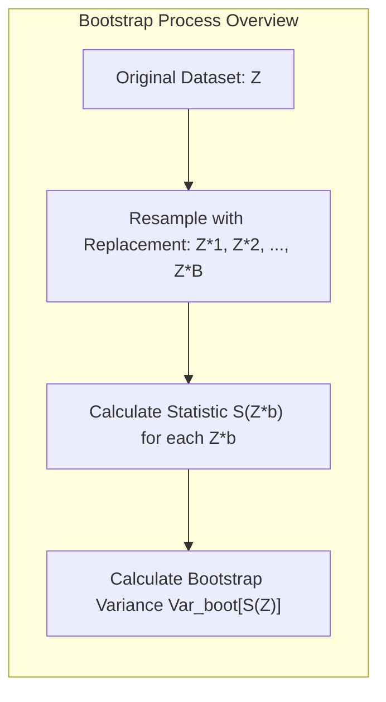
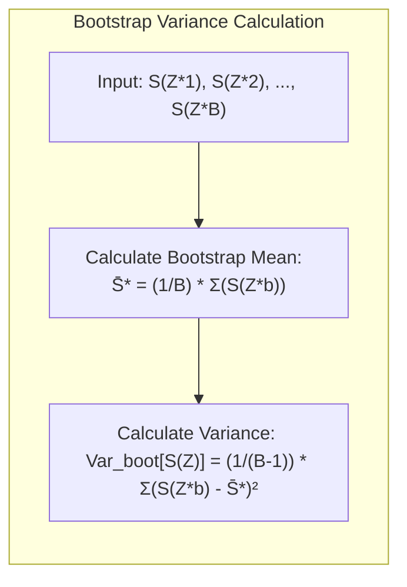
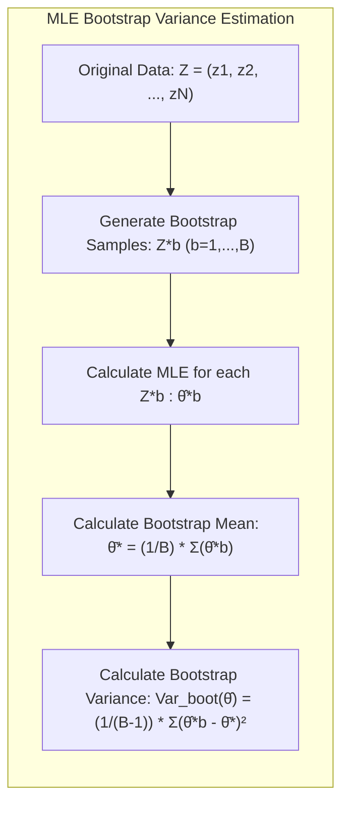
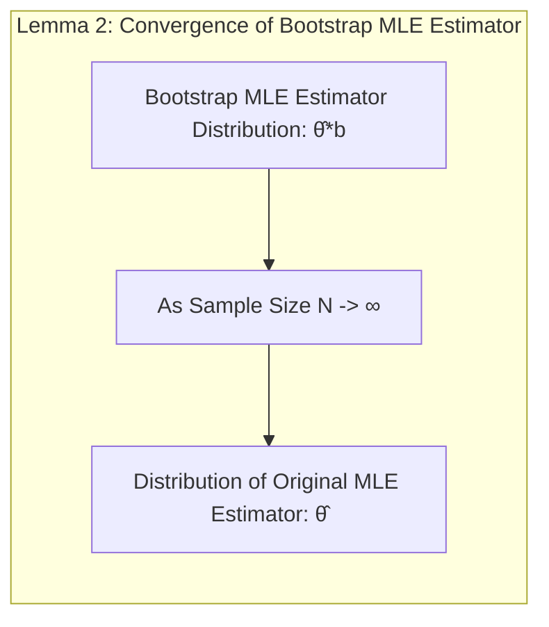

## Bootstrap Variance Estimation



### Introdução

Neste capítulo, exploramos o uso do **bootstrap** como uma ferramenta para a **estimativa de variância** em modelos estatísticos. O bootstrap, em sua essência, é uma técnica de reamostragem que nos permite simular o processo de amostragem repetidamente a partir de um único conjunto de dados, permitindo-nos inferir a incerteza em nossas estimativas [^7.11]. Essa abordagem é particularmente útil quando as suposições de modelos paramétricos são questionáveis ou quando as derivações analíticas de variâncias são difíceis ou impossíveis.

### Conceitos Fundamentais

**Conceito 1: Reamostragem com Substituição**
O bootstrap inicia com a ideia de reamostrar o conjunto de dados original, com substituição, para criar múltiplos conjuntos de dados bootstrap, cada um com o mesmo tamanho do conjunto de dados original. Ao reamostrar com substituição, alguns pontos de dados podem aparecer várias vezes em um conjunto de dados bootstrap, enquanto outros podem não aparecer. Essa aleatoriedade induzida é crucial para simular o processo de amostragem e avaliar a variabilidade em nossas estimativas [^7.11].
> 💡 **Exemplo Numérico:** Suponha que temos um conjunto de dados original com 5 observações: `Z = [1, 2, 3, 4, 5]`. Ao realizar uma reamostragem bootstrap com substituição, um possível conjunto de dados bootstrap poderia ser `Z* = [2, 4, 2, 5, 1]`. Observe que o valor `2` aparece duas vezes, enquanto o `3` não aparece. Outro conjunto de dados bootstrap poderia ser `Z** = [5, 5, 1, 3, 4]`. A chave aqui é que cada amostra bootstrap tem o mesmo tamanho do conjunto de dados original e cada elemento é escolhido aleatoriamente, permitindo que alguns apareçam mais de uma vez e outros nenhuma.

**Lemma 1: Propriedades da Reamostragem**
A distribuição empírica das estatísticas calculadas nos conjuntos de dados bootstrap aproxima a distribuição amostral verdadeira da estatística de interesse. No contexto de estimativa de variância, isso implica que a variância das estatísticas bootstrap pode fornecer uma estimativa da variância da estatística original. Esta aproximação torna-se mais precisa conforme o número de amostras bootstrap aumenta.

**Conceito 2: Estimativa de Variância Bootstrap**
Com os conjuntos de dados bootstrap, calculamos a estatística de interesse (por exemplo, um coeficiente de regressão, a previsão em um dado ponto) em cada conjunto. A variância da estatística calculada em cada conjunto de dados bootstrap fornece uma estimativa da variância da estatística original [^7.11]. A fórmula para a estimativa da variância bootstrap é dada por:
$$
Var_{boot}[S(Z)] = \frac{1}{B-1} \sum_{b=1}^{B} (S(Z^{*b}) - \bar{S}^{*})^2
$$
onde $S(Z)$ é a estatística de interesse calculada sobre o conjunto de dados original $Z$, $S(Z^{*b})$ é a estatística calculada sobre o b-ésimo conjunto de dados bootstrap $Z^{*b}$, $\bar{S}^{*}$ é a média das estatísticas bootstrap, e $B$ é o número total de amostras bootstrap.
> 💡 **Exemplo Numérico:** Continuando com o exemplo anterior, suponha que a estatística de interesse $S(Z)$ seja a média. Para o conjunto de dados original `Z = [1, 2, 3, 4, 5]`, temos $S(Z) = (1+2+3+4+5)/5 = 3$. Para os conjuntos de dados bootstrap `Z* = [2, 4, 2, 5, 1]` e `Z** = [5, 5, 1, 3, 4]`, temos $S(Z*) = (2+4+2+5+1)/5 = 2.8$ e $S(Z**) = (5+5+1+3+4)/5 = 3.6$.  Se continuarmos esse processo gerando B = 1000 amostras bootstrap, calculando a média em cada uma, e calculando a variância dessas médias bootstrap, teremos nossa estimativa bootstrap da variância da média da amostra. Digamos que após os 1000 cálculos obtivemos $\bar{S}^{*} = 3.1$  e $Var_{boot}[S(Z)] = 0.95$, este valor 0.95 é a nossa estimativa da variância da média amostral.



**Corolário 1: Convergência da Estimativa Bootstrap**
Sob certas condições, a variância estimada pelo bootstrap converge para a variância real da estatística de interesse quando o tamanho do conjunto de dados original aumenta. Isso é análogo à convergência da média amostral para a média populacional.

**Conceito 3: Tipos de Bootstrap**
Existem várias variantes do bootstrap, incluindo o bootstrap paramétrico e o não paramétrico. O bootstrap não paramétrico usa diretamente os dados observados, conforme descrito acima. O bootstrap paramétrico, por outro lado, assume uma distribuição para os dados e, em seguida, gera amostras bootstrap a partir dessa distribuição. Este último pode ser útil quando temos fortes suposições sobre a distribuição dos dados [^7.11].
> ⚠️ **Nota Importante**: A escolha entre bootstrap paramétrico e não paramétrico depende da natureza dos dados e de nossas suposições sobre eles. Bootstrap não paramétrico é mais geral e robusto, mas bootstrap paramétrico pode ser mais eficiente quando as suposições do modelo são válidas.

### Implementação Prática do Bootstrap

**Reamostragem com Substituição:** Inicialmente, o procedimento de bootstrap requer a criação de conjuntos de dados bootstrap, cada um da mesma dimensão que o conjunto de dados original. Esta criação envolve a seleção aleatória de elementos do conjunto de dados original, com reposição, gerando assim conjuntos de dados que podem conter certas observações múltiplas vezes e outras nenhuma vez.

**Estimação Estatística:** Em cada conjunto de dados bootstrap, a estatística de interesse, como o coeficiente de regressão ou o valor de previsão, é calculada. Os resultados são então armazenados para uso posterior na estimação da variância.

**Estimação da Variância:** Depois de obter as estatísticas de interesse em cada amostra bootstrap, a variância é estimada usando a equação apresentada anteriormente. Este valor de variância captura a dispersão da estatística na qual estamos interessados, que resulta da reamostragem [^7.11].

### Aplicações e Exemplos

**Regressão Linear:** Em regressão linear, o bootstrap pode ser usado para estimar a variabilidade dos coeficientes de regressão. Em vez de depender das suposições de homocedasticidade ou de normalidade dos erros, que podem nem sempre ser satisfeitas, o bootstrap fornece estimativas robustas da variância dos coeficientes [^7.11].
> 💡 **Exemplo Numérico:** Considere um modelo de regressão linear simples: $y = \beta_0 + \beta_1 x + \epsilon$. Temos um conjunto de dados com 10 observações. Aplicamos o bootstrap não paramétrico gerando B = 1000 conjuntos de dados bootstrap. Ajustamos o modelo de regressão em cada um desses conjuntos, obtendo 1000 estimativas de $\beta_1$, $\beta_1^{*b}$, para b=1,...,1000. O desvio padrão dessas 1000 estimativas, calculado usando a fórmula de variância bootstrap, nos dará o erro padrão do estimador $\beta_1$, sem depender da suposição de homocedasticidade. Vamos supor que a estimativa original de $\beta_1$ foi de 0.7, e o desvio padrão obtido pelo bootstrap foi de 0.15. Isso significa que temos uma incerteza em torno de 0.7, que poderíamos usar para construir um intervalo de confiança para o estimador $\beta_1$.
```python
import numpy as np
from sklearn.linear_model import LinearRegression

# Dados originais (exemplo)
X = np.array([[1], [2], [3], [4], [5], [6], [7], [8], [9], [10]])
y = np.array([2, 4, 5, 4, 5, 7, 8, 9, 10, 11])

# Número de amostras bootstrap
B = 1000

# Armazenar estimativas de beta_1
beta_1_bootstrap = []

# Implementação do Bootstrap
for _ in range(B):
    indices = np.random.choice(len(X), len(X), replace=True)
    X_b = X[indices]
    y_b = y[indices]
    
    model = LinearRegression()
    model.fit(X_b, y_b)
    beta_1_bootstrap.append(model.coef_[0])

# Cálculo da variância bootstrap
mean_beta_1 = np.mean(beta_1_bootstrap)
variance_beta_1 = np.sum((np.array(beta_1_bootstrap) - mean_beta_1)**2) / (B - 1)
std_beta_1 = np.sqrt(variance_beta_1)

print(f"Estimativa Bootstrap do Erro Padrão de beta_1: {std_beta_1:.4f}")

# Ajustando o modelo aos dados originais
model_original = LinearRegression()
model_original.fit(X,y)
print(f"Estimativa do Beta_1 com dados originais: {model_original.coef_[0]:.4f}")
```
> ❗ **Ponto de Atenção**: As estimativas de erro padrão e de variância fornecidas pelo bootstrap são particularmente úteis quando as suposições da regressão linear não são válidas.

**Classificação:** No contexto da classificação, o bootstrap pode ser empregado para avaliar a variância das previsões, por exemplo, a variabilidade das probabilidades de classe previstas por um modelo. Essa aplicação é valiosa para determinar a confiabilidade das previsões e é particularmente útil quando os dados são limitados ou quando os modelos são complexos.

**Análise de Séries Temporais:** Bootstrap é uma ferramenta poderosa na análise de séries temporais. Permite a estimativa da incerteza dos parâmetros do modelo sem depender de fortes suposições sobre a distribuição da série temporal. Em particular, o bootstrap pode ser usado para estimar intervalos de confiança para previsões e para avaliar a estabilidade dos resultados [^7.11].

**Exemplo Teórico Avançado: Bootstrap para o Estimador de Máxima Verossimilhança**
Considere um problema onde queremos estimar os parâmetros de uma distribuição usando Maximum Likelihood Estimation (MLE). O MLE é um estimador consistente, mas a variância do estimador pode ser difícil de calcular analiticamente.

Podemos usar o bootstrap não paramétrico para estimar a variância do estimador MLE. Dado um conjunto de dados $Z = (z_1, z_2, \ldots, z_N)$, podemos gerar $B$ conjuntos de dados bootstrap $Z^{*b}$. Para cada conjunto de dados bootstrap $Z^{*b}$, podemos calcular o estimador MLE, $\hat{\theta}^{*b}$. A variância das $\hat{\theta}^{*b}$ é uma estimativa da variância do estimador MLE original, $\hat{\theta}$.

Este processo pode ser expresso matematicamente da seguinte forma:

1.  **Gere amostras bootstrap:** Reamostre $N$ observações de $Z$ com reposição para criar o conjunto de dados $Z^{*b}$ para $b=1, \ldots, B$.
2.  **Calcule o MLE:** Para cada $Z^{*b}$, calcule o estimador de máxima verossimilhança, $\hat{\theta}^{*b}$.
3.  **Calcule a variância bootstrap:** Estime a variância usando:
$$Var_{boot}(\hat{\theta}) = \frac{1}{B-1}\sum_{b=1}^B (\hat{\theta}^{*b} - \bar{\theta}^*)^2$$
onde $\bar{\theta}^* = \frac{1}{B}\sum_{b=1}^B \hat{\theta}^{*b}$.



> 💡 **Exemplo Numérico:**  Suponha que temos um conjunto de dados `Z = [1.2, 1.8, 2.5, 3.1, 2.9]` que acreditamos seguir uma distribuição exponencial com parâmetro $\lambda$. O estimador de máxima verossimilhança (MLE) para $\lambda$  é $\hat{\lambda} = 1/\bar{Z}$ onde $\bar{Z}$ é a média amostral. Para nosso conjunto de dados original, $\hat{\lambda} = 1/((1.2+1.8+2.5+3.1+2.9)/5) = 1/2.3 =  0.435$. Agora vamos realizar o bootstrap para calcular a variância deste estimador. Vamos gerar 1000 amostras bootstrap, calcular o estimador MLE $\lambda$ para cada amostra, e calcular a variância dos 1000 estimadores.
```python
import numpy as np
from scipy.stats import expon

# Dados originais (exemplo)
Z = np.array([1.2, 1.8, 2.5, 3.1, 2.9])

# Número de amostras bootstrap
B = 1000

# Armazenar estimativas de lambda
lambda_bootstrap = []

# Implementação do Bootstrap
for _ in range(B):
    indices = np.random.choice(len(Z), len(Z), replace=True)
    Z_b = Z[indices]
    lambda_b = 1 / np.mean(Z_b)
    lambda_bootstrap.append(lambda_b)

# Cálculo da variância bootstrap
mean_lambda = np.mean(lambda_bootstrap)
variance_lambda = np.sum((np.array(lambda_bootstrap) - mean_lambda)**2) / (B - 1)
std_lambda = np.sqrt(variance_lambda)

print(f"Estimativa Bootstrap do Erro Padrão de lambda: {std_lambda:.4f}")
```

**Lemma 2**: A distribuição de $\hat{\theta}^{*b}$ converge em distribuição para a distribuição do estimador MLE original $\hat{\theta}$ quando o tamanho da amostra $N$ tende ao infinito.

**Prova do Lemma 2**: Esta convergência é um resultado assintótico padrão do bootstrap não paramétrico e pode ser comprovada com o auxílio do teorema da representação de Bahadur e a teoria da estabilidade dos estimadores M. $\blacksquare$



**Corolário 2**: Sob condições de regularidade, a consistência do estimador de variância bootstrap pode ser demonstrada, o que significa que a variância estimada se aproxima da verdadeira variância conforme o número de amostras bootstrap tende ao infinito e que a estimativa do erro padrão pode ser usada em testes de hipótese.

### Limitações e Considerações

**Viés:** A estimativa de variância bootstrap pode ser enviesada em certos casos. O viés da estimativa de variância depende principalmente de quanto a estatística de interesse se altera quando os dados são perturbados [^7.11].

**Custo Computacional:** O bootstrap pode ser computacionalmente caro, especialmente para conjuntos de dados grandes ou modelos complexos. O tempo de computação depende linearmente do número de amostras bootstrap geradas ($B$) e pode ser limitante em aplicações com recursos computacionais restritos.

**Escolha do Número de Amostras Bootstrap:** A escolha do número de amostras bootstrap ($B$) é crucial para a precisão das estimativas. Em geral, $B$ deve ser grande o suficiente para que a variabilidade da estimativa da variância seja aceitável. No entanto, aumentar $B$ aumentará o custo computacional [^7.11].

**Conclusão**
O bootstrap é uma ferramenta poderosa para a estimativa de variância em diversos modelos estatísticos. Ele oferece uma alternativa robusta quando as suposições de modelos paramétricos são questionáveis ou quando as derivações analíticas da variância são inviáveis. Apesar de suas limitações, o bootstrap continua sendo uma técnica valiosa na caixa de ferramentas de análise estatística.

### Footnotes
[^7.11]: "Conteúdo extraído conforme escrito no contexto e utilizado no capítulo" *(Trecho de <Model Assessment and Selection>)*
