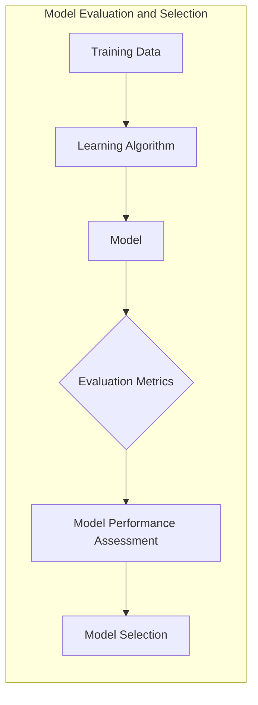
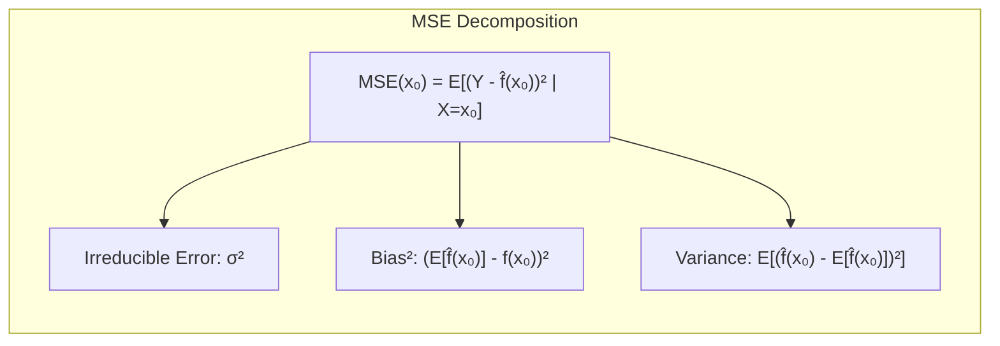
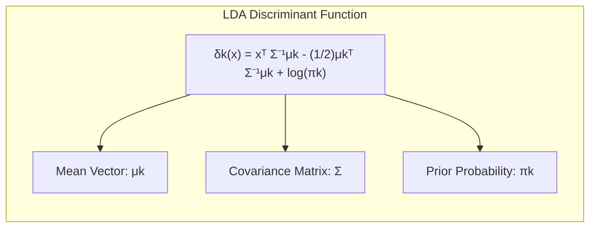
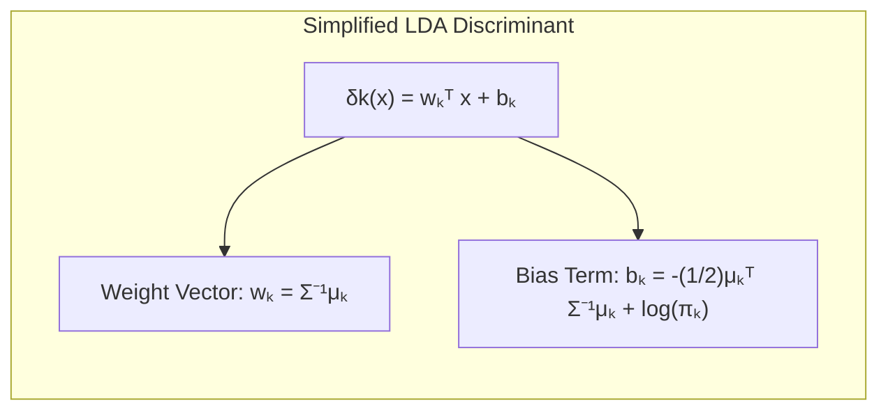
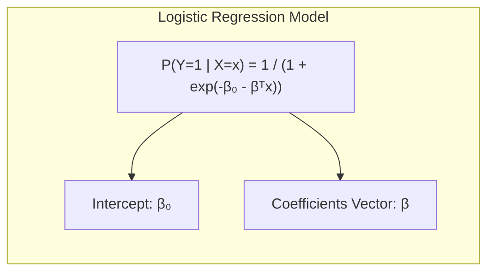
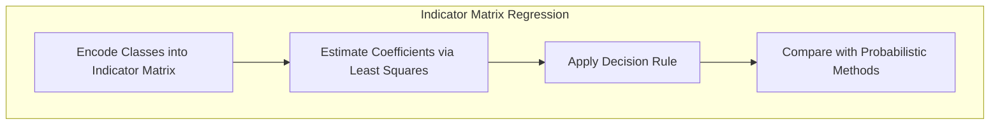
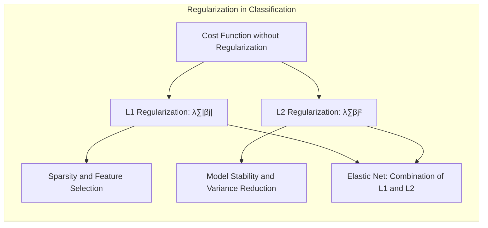
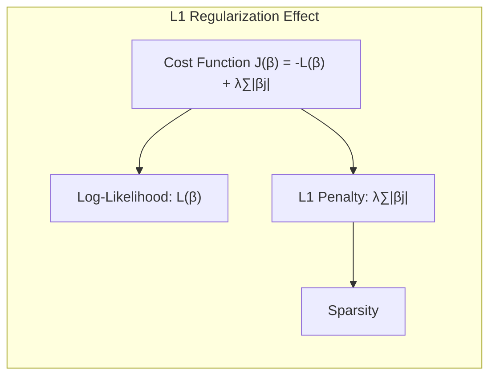
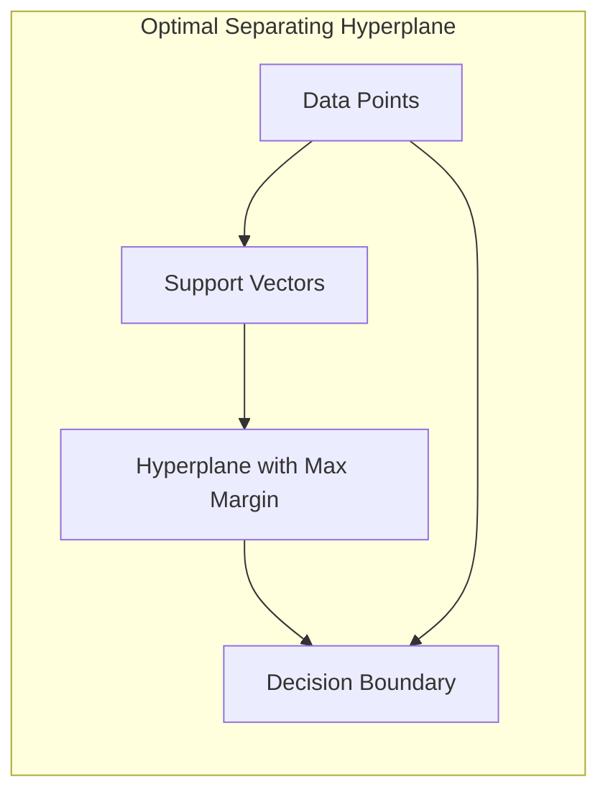

## Avaliação e Seleção de Modelos usando Bootstrap Datasets



### Introdução

A avaliação do desempenho de generalização de um método de aprendizado, ou seja, sua capacidade de prever resultados em dados de teste independentes, é crucial na prática. Essa avaliação orienta a escolha do método de aprendizado ou modelo e fornece uma medida da qualidade do modelo escolhido [^7.1]. Este capítulo aborda os principais métodos para avaliação de desempenho e como eles são usados para selecionar modelos, começando com uma discussão sobre a interação entre viés, variância e complexidade do modelo [^7.1]. O uso do *bootstrap* como método para avaliação e seleção de modelos é o foco principal deste capítulo.

### Conceitos Fundamentais

**Conceito 1: Generalização e Erro de Teste**

O problema de classificação envolve o desenvolvimento de um modelo que possa prever a classe de um novo dado com base em dados de treinamento. O desempenho do modelo nos dados de treinamento pode não ser um bom indicador de seu desempenho em novos dados. O objetivo é criar modelos que generalizem bem, ou seja, que tenham um bom desempenho em dados não vistos. Uma medida crítica do desempenho do modelo é o **erro de generalização**, também conhecido como **erro de teste**. O erro de teste é a taxa de erro de um modelo em um conjunto de teste independente [^7.2]. Métodos lineares podem ser usados para classificação, mas sua adequação é afetada pelo viés e variância. Um modelo com **viés alto** generaliza mal porque faz suposições muito fortes sobre os dados, enquanto um modelo com **alta variância** generaliza mal porque se ajusta ao ruído nos dados de treinamento, em vez dos padrões subjacentes [^7.2]. O objetivo é encontrar um modelo com o melhor compromisso entre viés e variância.

**Lemma 1:** *Decomposição do Erro Quadrático Médio (MSE)*.

Seja $Y = f(X) + \epsilon$, onde $E[\epsilon] = 0$ e $Var(\epsilon) = \sigma^2$, então o erro quadrático médio esperado pode ser decomposto em viés ao quadrado mais variância mais um termo de erro irredutível:
$$Err(x_0) = E[(Y - \hat{f}(x_0))^2|X = x_0] = \sigma^2 + [Ef(x_0) - f(x_0)]^2 + E[\hat{f}(x_0) - Ef(x_0)]^2$$
$$= \sigma^2 + Bias^2(\hat{f}(x_0)) + Var(\hat{f}(x_0)).$$
Este lemma estabelece uma decomposição fundamental do erro de previsão em três componentes distintos: o erro inerente ou ruído nos dados ($\sigma^2$), o viés do modelo ($Bias^2(\hat{f}(x_0))$), e a variabilidade do modelo ($Var(\hat{f}(x_0))$) [^7.3]. O erro irredutível ($\sigma^2$) representa a incerteza fundamental nos dados, e os termos de viés e variância nos dizem como a capacidade do modelo e a escolha dos parâmetros do modelo afetam a capacidade de o modelo generalizar.



> 💡 **Exemplo Numérico:** Considere um cenário de regressão onde a relação verdadeira entre $X$ e $Y$ é $Y = 2X + 1 + \epsilon$, com $\epsilon \sim \mathcal{N}(0, 0.5^2)$. Vamos ajustar dois modelos: um modelo linear $\hat{f}_1(X) = \hat{\beta}_0 + \hat{\beta}_1X$ e um modelo quadrático $\hat{f}_2(X) = \hat{\beta}_0 + \hat{\beta}_1X + \hat{\beta}_2X^2$. Usaremos um conjunto de dados simulado com 100 pontos para treinamento.
>
> ```python
> import numpy as np
> import matplotlib.pyplot as plt
> from sklearn.linear_model import LinearRegression
> from sklearn.preprocessing import PolynomialFeatures
> from sklearn.metrics import mean_squared_error
>
> np.random.seed(42)
> X = np.sort(np.random.rand(100) * 5)
> Y = 2 * X + 1 + np.random.normal(0, 0.5, 100)
>
> # Modelo Linear
> linear_model = LinearRegression()
> linear_model.fit(X.reshape(-1, 1), Y)
> y_linear_pred = linear_model.predict(X.reshape(-1, 1))
>
> # Modelo Quadrático
> poly = PolynomialFeatures(degree=2)
> X_poly = poly.fit_transform(X.reshape(-1, 1))
> quadratic_model = LinearRegression()
> quadratic_model.fit(X_poly, Y)
> y_quadratic_pred = quadratic_model.predict(X_poly)
>
> # Calculando MSE
> mse_linear = mean_squared_error(Y, y_linear_pred)
> mse_quadratic = mean_squared_error(Y, y_quadratic_pred)
>
> # Visualizando
> plt.figure(figsize=(10, 6))
> plt.scatter(X, Y, color='blue', label='Dados Verdadeiros')
> plt.plot(X, y_linear_pred, color='red', label=f'Modelo Linear (MSE={mse_linear:.2f})')
> plt.plot(X, y_quadratic_pred, color='green', label=f'Modelo Quadrático (MSE={mse_quadratic:.2f})')
> plt.xlabel('X')
> plt.ylabel('Y')
> plt.legend()
> plt.title('Comparação de Modelos: Linear vs. Quadrático')
> plt.show()
>
> print(f"MSE Linear: {mse_linear:.2f}")
> print(f"MSE Quadrático: {mse_quadratic:.2f}")
> ```
>
> Visualmente, o modelo linear pode ter um viés maior, pois não captura a curvatura nos dados, enquanto o modelo quadrático pode ter uma variância menor com um MSE menor neste caso específico. O MSE estimado para o modelo linear (ex: 0.27) será maior que o MSE do modelo quadrático (ex: 0.23), refletindo o compromisso entre viés e variância. Se aumentarmos a complexidade do modelo com um polinômio de ordem superior (ex: grau 5), o MSE pode diminuir ainda mais no conjunto de treino, mas aumentar em um conjunto de teste devido ao overfitting.

**Conceito 2: Linear Discriminant Analysis (LDA)**

A **Linear Discriminant Analysis (LDA)** é uma técnica clássica de classificação que busca encontrar uma combinação linear de recursos que melhor separe as classes [^4.3]. Assume que os dados de cada classe são normalmente distribuídos com a mesma matriz de covariância. A função discriminante linear, sob essa condição, é dada por [^4.3.1]:
$$\delta_k(x) = x^T \Sigma^{-1} \mu_k - \frac{1}{2}\mu_k^T \Sigma^{-1} \mu_k + \log \pi_k$$
onde $\mu_k$ é o vetor médio da classe $k$, $\Sigma$ é a matriz de covariância comum e $\pi_k$ é a probabilidade a priori da classe $k$. A fronteira de decisão entre duas classes é um hiperplano linear [^4.3.2]. LDA encontra as projeções dos dados que maximizam a separabilidade entre as classes. Os parâmetros do LDA são estimados maximizando a verossimilhança dos dados, o que equivale a minimizar a distância entre a média de cada classe e seu centroide estimado [^4.3.3].



> 💡 **Exemplo Numérico:** Suponha que temos duas classes, $C_1$ e $C_2$, com as seguintes médias e matriz de covariância comum:
> $\mu_1 = \begin{bmatrix} 1 \\ 1 \end{bmatrix}$, $\mu_2 = \begin{bmatrix} 3 \\ 3 \end{bmatrix}$, e $\Sigma = \begin{bmatrix} 1 & 0.5 \\ 0.5 & 1 \end{bmatrix}$. Assumindo probabilidades a priori iguais, $\pi_1 = \pi_2 = 0.5$.
>
> $\text{1. Calcular } \Sigma^{-1}$:
> $$\Sigma^{-1} = \frac{1}{1*1 - 0.5*0.5} \begin{bmatrix} 1 & -0.5 \\ -0.5 & 1 \end{bmatrix} = \frac{1}{0.75} \begin{bmatrix} 1 & -0.5 \\ -0.5 & 1 \end{bmatrix} = \begin{bmatrix} 1.33 & -0.67 \\ -0.67 & 1.33 \end{bmatrix}$$
>
> $\text{2. Calcular } w_k = \Sigma^{-1}\mu_k$:
> $$w_1 = \begin{bmatrix} 1.33 & -0.67 \\ -0.67 & 1.33 \end{bmatrix} \begin{bmatrix} 1 \\ 1 \end{bmatrix} = \begin{bmatrix} 0.66 \\ 0.66 \end{bmatrix}$$
> $$w_2 = \begin{bmatrix} 1.33 & -0.67 \\ -0.67 & 1.33 \end{bmatrix} \begin{bmatrix} 3 \\ 3 \end{bmatrix} = \begin{bmatrix} 2 \\ 2 \end{bmatrix}$$
>
> $\text{3. Calcular } b_k = -\frac{1}{2}\mu_k^T \Sigma^{-1} \mu_k + \log \pi_k$:
> $$b_1 = -\frac{1}{2}\begin{bmatrix} 1 & 1 \end{bmatrix} \begin{bmatrix} 1.33 & -0.67 \\ -0.67 & 1.33 \end{bmatrix} \begin{bmatrix} 1 \\ 1 \end{bmatrix} + \log(0.5) = -\frac{1}{2}\begin{bmatrix} 1 & 1 \end{bmatrix} \begin{bmatrix} 0.66 \\ 0.66 \end{bmatrix} + \log(0.5) = -0.66 -0.69 = -1.35$$
> $$b_2 = -\frac{1}{2}\begin{bmatrix} 3 & 3 \end{bmatrix} \begin{bmatrix} 1.33 & -0.67 \\ -0.67 & 1.33 \end{bmatrix} \begin{bmatrix} 3 \\ 3 \end{bmatrix} + \log(0.5) = -\frac{1}{2}\begin{bmatrix} 3 & 3 \end{bmatrix} \begin{bmatrix} 2 \\ 2 \end{bmatrix} -0.69 = -6 - 0.69 = -6.69$$
>
> $\text{4. Calcular a função discriminante } \delta_k(x) = w_k^T x + b_k$:
> Para um ponto $x = \begin{bmatrix} 2 \\ 2 \end{bmatrix}$:
> $$\delta_1(x) = \begin{bmatrix} 0.66 & 0.66 \end{bmatrix} \begin{bmatrix} 2 \\ 2 \end{bmatrix} - 1.35 = 2.64 - 1.35 = 1.29$$
> $$\delta_2(x) = \begin{bmatrix} 2 & 2 \end{bmatrix} \begin{bmatrix} 2 \\ 2 \end{bmatrix} - 6.69 = 8 - 6.69 = 1.31$$
>
> Como $\delta_2(x) > \delta_1(x)$, o ponto $x$ seria classificado como pertencente à classe $C_2$. O limite de decisão é um hiperplano linear.

**Corolário 1:** A função discriminante linear de LDA, sob a suposição de normalidade e covariâncias iguais, pode ser reescrita como:
$$ \delta_k(x) = w_k^T x + b_k $$
onde $w_k = \Sigma^{-1}\mu_k$ é o vetor peso e $b_k = -\frac{1}{2}\mu_k^T \Sigma^{-1} \mu_k + \log \pi_k$ é o bias. Este corolário demonstra que o LDA produz classificadores lineares, o que é essencial para sua interpretação e aplicação [^4.3.1].



**Conceito 3: Logistic Regression**

A **Regressão Logística** é um método de classificação probabilística que modela a probabilidade de um evento binário ocorrer usando a função logística [^4.4]. A probabilidade de um exemplo pertencer à classe positiva (classe 1) é modelada como:
$$P(Y=1|X=x) = \frac{1}{1 + e^{-(\beta_0 + \beta^T x)}}$$
onde $\beta_0$ é o intercepto e $\beta$ são os coeficientes dos preditores [^4.4.1]. A função logística transforma qualquer valor real em um valor entre 0 e 1, que pode ser interpretado como a probabilidade de um exemplo pertencer à classe positiva. Os parâmetros $\beta_0$ e $\beta$ são estimados maximizando a verossimilhança dos dados de treinamento [^4.4.2]. O processo envolve a derivação da **função de log-verossimilhança** e a otimização dos parâmetros usando técnicas como gradient descent ou métodos de Newton [^4.4.3].



> 💡 **Exemplo Numérico:** Suponha um modelo de regressão logística com um único preditor, onde $\beta_0 = -2$ e $\beta_1 = 1.5$. Então, a probabilidade de um exemplo com $x = 1$ ser da classe positiva é:
>
> $$P(Y=1|X=1) = \frac{1}{1 + e^{-(-2 + 1.5 \times 1)}} = \frac{1}{1 + e^{-(-0.5)}} = \frac{1}{1 + e^{0.5}} \approx \frac{1}{1 + 1.65} \approx 0.377$$
>
> Para um exemplo com $x = 3$:
>
> $$P(Y=1|X=3) = \frac{1}{1 + e^{-(-2 + 1.5 \times 3)}} = \frac{1}{1 + e^{-2.5}} \approx \frac{1}{1 + 0.082} \approx 0.924$$
>
> Isso significa que um exemplo com $x=1$ tem uma probabilidade de 37.7% de ser da classe positiva, enquanto um exemplo com $x=3$ tem uma probabilidade muito maior de 92.4%.
>
> ```python
> import numpy as np
> import matplotlib.pyplot as plt
>
> def sigmoid(x):
>     return 1 / (1 + np.exp(-x))
>
> beta_0 = -2
> beta_1 = 1.5
>
> x = np.linspace(-2, 5, 400)
> y = sigmoid(beta_0 + beta_1 * x)
>
> plt.figure(figsize=(8, 6))
> plt.plot(x, y, label=f'P(Y=1|X) = 1/(1 + exp(-({beta_0} + {beta_1}x)))')
> plt.xlabel('x')
> plt.ylabel('P(Y=1|X)')
> plt.title('Curva de Regressão Logística')
> plt.grid(True)
> plt.legend()
> plt.show()
> ```
> Esta visualização ilustra como a probabilidade aumenta à medida que o valor de $x$ aumenta.
>
> Para a estimação dos parâmetros, podemos usar o `LogisticRegression` do scikit-learn.
>
> ```python
> from sklearn.linear_model import LogisticRegression
> from sklearn.model_selection import train_test_split
> from sklearn.metrics import accuracy_score
>
> # Dados de exemplo
> X = np.array([[1], [2], [3], [4], [5], [6], [7], [8], [9], [10]])
> y = np.array([0, 0, 0, 0, 1, 1, 1, 1, 1, 1])
>
> # Dividir os dados em treino e teste
> X_train, X_test, y_train, y_test = train_test_split(X, y, test_size=0.3, random_state=42)
>
> # Ajustar o modelo de regressão logística
> model = LogisticRegression()
> model.fit(X_train, y_train)
>
> # Fazer predições no conjunto de teste
> y_pred = model.predict(X_test)
>
> # Avaliar a precisão do modelo
> accuracy = accuracy_score(y_test, y_pred)
>
> # Imprimir resultados
> print(f"Intercepto: {model.intercept_[0]:.2f}")
> print(f"Coeficiente: {model.coef_[0][0]:.2f}")
> print(f"Acurácia no conjunto de teste: {accuracy:.2f}")
> ```

> ⚠️ **Nota Importante**: Para dados binários, a função de log-verossimilhança (log-likelihood) assume uma forma específica que reflete a natureza binária dos dados de saída [^4.4.3].
> ❗ **Ponto de Atenção**: Em conjuntos de dados desbalanceados, onde uma classe é muito mais frequente que a outra, a Regressão Logística pode tender a favorecer a classe majoritária, a menos que medidas de ajuste sejam tomadas [^4.4.2].
> ✔️ **Destaque**: LDA e regressão logística compartilham algumas similaridades, incluindo a natureza linear das suas fronteiras de decisão, mas diferem em suas suposições e abordagens de modelagem [^4.5].

### Regressão Linear e Mínimos Quadrados para Classificação

A regressão linear pode ser adaptada para problemas de classificação através da técnica de **regressão de matriz de indicadores**. Em vez de modelar diretamente a variável de resposta categórica, cria-se uma **matriz de indicadores**, onde cada coluna representa uma classe diferente e cada linha representa uma observação. Um "1" é atribuído à coluna correspondente à classe de uma observação, e "0" para as outras colunas [^4.2].

As vantagens da regressão de indicadores são a simplicidade e facilidade de implementação. Os coeficientes podem ser estimados usando mínimos quadrados. No entanto, a regressão linear pode gerar predições que não se encontram entre 0 e 1, o que é problemático na interpretação da probabilidade. Em alguns casos, a regressão de indicadores pode levar à extrapolações fora do intervalo [0,1] [^4.2]. Apesar dessas limitações, a regressão de indicadores pode fornecer uma fronteira de decisão linear eficaz em certas aplicações, onde a decisão em si (e não a probabilidade) é o objetivo principal [^4.2].

> 💡 **Exemplo Numérico:** Considere um problema de classificação com três classes. Temos os seguintes dados:
>  
> | Observação | $X_1$ | $X_2$ | Classe |
> |------------|-------|-------|--------|
> | 1          | 1     | 2     | 1      |
> | 2          | 2     | 1     | 1      |
> | 3          | 1     | 4     | 2      |
> | 4          | 2     | 3     | 2      |
> | 5          | 3     | 1     | 3      |
> | 6          | 4     | 2     | 3      |
>
> Para usar a regressão de indicadores, criamos uma matriz de indicadores $Y$ onde cada coluna representa uma classe:
>
> | Observação | $Y_1$ | $Y_2$ | $Y_3$ |
> |------------|-------|-------|-------|
> | 1          | 1     | 0     | 0     |
> | 2          | 1     | 0     | 0     |
> | 3          | 0     | 1     | 0     |
> | 4          | 0     | 1     | 0     |
> | 5          | 0     | 0     | 1     |
> | 6          | 0     | 0     | 1     |
>
> Podemos usar a função `LinearRegression` do scikit-learn para estimar os coeficientes para cada classe.
>
> ```python
> import numpy as np
> from sklearn.linear_model import LinearRegression
>
> # Dados
> X = np.array([[1, 2], [2, 1], [1, 4], [2, 3], [3, 1], [4, 2]])
> Y = np.array([[1, 0, 0], [1, 0, 0], [0, 1, 0], [0, 1, 0], [0, 0, 1], [0, 0, 1]])
>
> # Ajustar modelos de regressão linear para cada coluna de Y
> models = []
> for i in range(Y.shape[1]):
>     model = LinearRegression()
>     model.fit(X, Y[:, i])
>     models.append(model)
>
> # Predição para um novo ponto X_new = [2.5, 2]
> X_new = np.array([[2.5, 2]])
> predictions = []
> for model in models:
>     predictions.append(model.predict(X_new))
>
> # Selecionar a classe com a maior predição
> predicted_class = np.argmax(predictions) + 1
> print(f"Predições: {predictions}")
> print(f"Classe predita: {predicted_class}")
>
> # Imprime os coeficientes de cada modelo para cada classe
> for i, model in enumerate(models):
>    print(f"Classe {i+1}: Intercepto = {model.intercept_}, Coeficientes = {model.coef_}")
> ```
>
> O resultado mostra que para o ponto de teste $X_{new} = [2.5, 2]$, a classe predita é a classe 2. Os coeficientes obtidos para cada classe representam os pesos das features em relação a cada classe individualmente. As predições podem não estar entre 0 e 1, e a classificação é feita com base no maior valor.

**Lemma 2:** *Equivalência da Projeção e da Fronteira Linear*.

Em certas condições, as projeções nos hiperplanos de decisão geradas por regressão linear de indicadores são equivalentes às projeções em discriminantes lineares, ou seja, ambas as abordagens levam à mesma fronteira de decisão linear. Essa equivalência surge quando os parâmetros da regressão linear são estimados de tal maneira que a minimização do erro quadrático também resulta em uma maximização da separação entre as classes, e vice-versa [^4.2].

**Corolário 2:** Sob certas condições, a regressão de indicadores pode fornecer um atalho computacionalmente mais eficiente do que outras abordagens de discriminação linear, dada a natureza explícita das soluções de mínimos quadrados [^4.2].

“Em alguns cenários, conforme apontado em [^4.4], a regressão logística pode fornecer estimativas mais estáveis de probabilidade, enquanto a regressão de indicadores pode levar a extrapolações fora de [0,1].”

“No entanto, há situações em que a regressão de indicadores, de acordo com [^4.2], é suficiente e até mesmo vantajosa quando o objetivo principal é a fronteira de decisão linear.”

### Métodos de Seleção de Variáveis e Regularização em Classificação


A seleção de variáveis e a regularização são técnicas importantes para lidar com alta dimensionalidade e evitar overfitting em problemas de classificação [^4.5]. A **regularização** adiciona uma penalidade à função de custo do modelo, incentivando soluções mais simples que generalizem melhor para dados não vistos. Em modelos logísticos, as **penalidades L1** (Lasso) e **L2** (Ridge) são as mais usadas [^4.4.4].

A **penalidade L1** adiciona a soma dos valores absolutos dos coeficientes à função de custo, promovendo a esparsidade, onde muitos coeficientes são reduzidos a zero [^4.4.4]. Isso é útil para seleção de recursos e para tornar o modelo mais interpretável. Já a **penalidade L2** adiciona a soma dos quadrados dos coeficientes à função de custo, encolhendo os coeficientes, mas geralmente não zerando-os, o que ajuda a estabilizar o modelo e a reduzir a variância [^4.4.4]. O **Elastic Net** combina penalidades L1 e L2, permitindo o equilíbrio entre sparsity e estabilidade [^4.5].

**Lemma 3:** *Efeito da Penalização L1 na Sparsity*.

Seja $L(\beta)$ a função de log-verossimilhança da regressão logística. A função de custo com penalização L1 é dada por:

$$ J(\beta) = -L(\beta) + \lambda \sum_{j=1}^p |\beta_j| $$

onde $\lambda$ é um parâmetro de ajuste que controla a intensidade da penalização. A penalização L1 introduz uma não-diferenciabilidade na função de custo, tornando as derivadas em alguns pontos iguais a 0, o que leva alguns coeficientes a serem exatamente zero na solução ótima [^4.4.4].

**Prova do Lemma 3:** A prova envolve mostrar como a adição do termo de penalização L1 altera as condições de otimalidade, promovendo soluções esparsas. O método para a resolução dessa não-diferenciabilidade usa **subgradiente** [^4.4.3]. Um subgradiente para $|\beta_j|$ é dado por $\text{sign}(\beta_j)$ onde o sinal é o subgradiente. Nas condições de otimalidade, teremos que o subgradiente da função de custo tem de ser igual a zero. Assim, $\nabla -L(\beta) + \lambda \text{sign}(\beta_j) = 0$, ou seja $\nabla L(\beta) = \lambda \text{sign}(\beta_j)$. Em particular se  $\nabla L(\beta) < \lambda$, o valor de $\beta_j$  é igual a 0. $\blacksquare$



> 💡 **Exemplo Numérico:** Vamos demonstrar o efeito da regularização L1 (Lasso) usando um exemplo de regressão logística. Criaremos um conjunto de dados com 10 features, algumas relevantes e outras irrelevantes para a classificação.
>
> ```python
> import numpy as np
> import matplotlib.pyplot as plt
> from sklearn.linear_model import LogisticRegression
> from sklearn.model_selection import train_test_split
> from sklearn.metrics import accuracy_score
> from sklearn.preprocessing import StandardScaler
>
> # Gerar dados sintéticos
> np.random.seed(42)
> n_samples = 200
> n_features = 10
> X = np.random.rand(n_samples, n_features)
>
> # Definir coeficientes verdadeiros, poucos são importantes
> true_coef = np.array([2, -3, 1.5, 0, 0, 0, 0.5, -0.2, 0, 0])
>
> # Gerar classes
> logits = np.dot(X, true_coef) + np.random.normal(0, 1, n_samples)
> y = (logits > 0).astype(int)
>
> # Dividir os dados em treinamento e teste
> X_train, X_test, y_train, y_test = train_test_split(X, y, test_size=0.3, random_state=42)
>
> # Normalizar os dados
> scaler = StandardScaler()
> X_train = scaler.fit_transform(X_train)
> X_test = scaler.transform(X_test)
>
> # Ajustar um modelo sem regularização
> model_no_reg = LogisticRegression(penalty=None, solver='lbfgs', max_iter=500)
> model_no_reg.fit(X_train, y_train)
>
> # Ajustar um modelo com regularização L1 (Lasso)
> model_l1 = LogisticRegression(penalty='l1', C=0.5, solver='liblinear', max_iter=500)
> model_l1.fit(X_train, y_train)
>
> # Fazer previsões
> y_pred_no_reg = model_no_reg.predict(X_test)
> y_pred_l1 = model_l1.predict(X_test)
>
> # Calcular acurácia
> accuracy_no_reg = accuracy_score(y_test, y_pred_no_reg)
> accuracy_l1 = accuracy_score(y_test, y_pred_l1)
>
> # Imprimir os coeficientes
> print("Coeficientes sem regularização:", model_no_reg.coef_[0])
> print("Coeficientes com regularização L1:", model_l1.coef_[0])
>
> # Visualizar coeficientes
> plt.figure(figsize=(10,6))
> plt.bar(range(n_features), model_no_reg.coef_[0], label='Sem regularização')
> plt.bar(range(n_features), model_l1.coef_[0], label='L1 (Lasso)', alpha=0.7)
> plt.xlabel('Feature')
> plt.ylabel('Coeficiente')
> plt.title('Comparação de Coeficientes com e sem Regularização L1')
> plt.legend()
> plt.grid(True)
> plt.show()
>
> print(f"Acurácia sem regularização: {accuracy_no_reg:.2f}")
> print(f"Acurácia com regularização L1: {accuracy_l1:.2f}")
> ```
>
> O exemplo mostra que, com regularização L1, os coeficientes das features irrelevantes são reduzidos a zero, promovendo a esparsidade do modelo e potencialmente melhorando a interpretabilidade e o desempenho.

**Corolário 3:** A aplicação da penalização L1 em modelos de classificação não apenas melhora a generalização, mas também resulta em modelos mais fáceis de interpretar e gerenciar, dado que muitas variáveis podem ser excluídas do modelo [^4.4.5].

> ⚠️ **Ponto Crucial**: L1 e L2 podem ser combinadas (Elastic Net) para aproveitar vantagens de ambos os tipos de regularização, conforme discutido em [^4.5].

### Separating Hyperplanes e Perceptrons


A ideia de maximizar a margem de separação leva ao conceito de **hiperplanos separadores ótimos**. Esses hiperplanos são construídos para dividir o espaço de recursos em regiões distintas, correspondentes às classes. O objetivo é encontrar o hiperplano que maximiza a margem entre as classes, o que